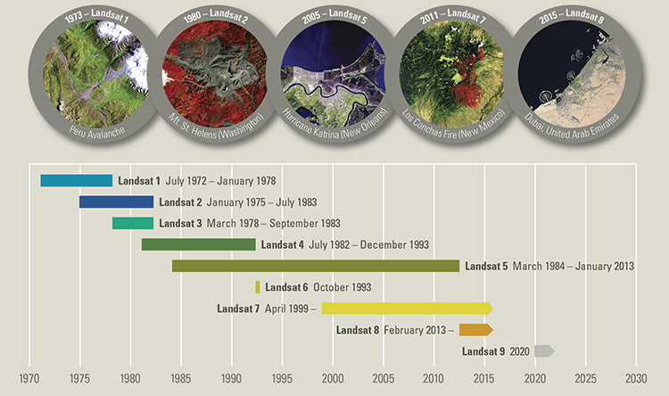

***

<h1> <p align="center"> Spatial-temporal differences in cloud cover of satellite observations across the Brazilian Amazon</p> </h1>
<p align="center"> Willian Vieira de Oliveira </p>


<p align="right"> [ Part 1 - About the project and the data ] </p>

### SUMMARY

1. [**About**](./1_Project.md#About)
1. [**The Data**](./1_Project.md#TheData)
    1. [Raw data](./1_Project.md#RawData)
    1. [Processed data](./1_Project.md#ProcessedData)
    1. [Additional data](./1_Project.md#AdditionalData)
1. [**Questions about the data**](./1_Project.md#Questions)
1. [**Basic processing of the data**](./2_Basic_processing.md#BasicProc)
1. [**Statistics**](./2_Basic_processing.md#Stats)
1. [**Exploratory Data Analysis**](./3_EDA.md#EDA)
1. [**Results**](./4_Results_and_Conclusion.md#Results)
1. [**Conclusion**](./4_Results_and_Conclusion.md#Conclusion)
***

<a id='About'></a>
## 1. About

<p align="right"><b>OBS.:</b> It could also be interesting to include CBERS-4/MUX data in the analysis.</p>

<p align="justify"> <br>
Earth observation (EO) satellites provide data that are essential for a range of non-military uses. Among the possible uses, Young and Onoda (2017) highlight the importance of this source of data for addressing environmental problems. Environmental applications of satellite data include, for example, vegetation mapping, fire risk estimation and water stress monitoring. In addition, the use of satellite images allows analysing how habitats change as a result of human activities. For instance, the use of satellite images acquired by various sensors assists the detection and measurement of deforestation in the Brazilian Amazon rainforest. In order to do so, it can be used both optical and radar sensors, that present different spatial and temporal resolutions. This variety of data sources favours the development of studies in different scales, with different revisit periods. </p>
<p align="justify">
The sensors Landsat-8/OLI and Sentinel-2/MSI are examples of optical sensors that are commonly used in studies regarding the Brazilian rainforest. Landsat-8 provides global coverage of satellite observation since February 2013. The OLI sensor presents spatial resolution of 30 meters, in contrast to the 10-meter spatial resolution of the MSI sensor. In addition, these sensors present temporal resolution of 16 days (OLI) and 5 days (MSI), respectively. The Sentinel-2 mission uses two satellites in order to provide data with this temporal resolution, Sentinel-2A (launched on June 2015) and Sentinel-2B (launched on June 2017). The products generated by these sensors are freely available, which contributes to the increasingly use of these data sources for several purposes (Sano et al., 2007), including the monitoring of the selective logging in the Brazilian Amazon (Lima et al., 2019). However, these products are usually impacted by the frequent presence of cloud cover. Persistent cloud cover represents a recurrent problem in optical remote sensing analysis in tropical regions. </p>
<p align="justify">
The vulnerability of optical sensors to the presence of cloud cover represents a problem for studies that depend on the availability of cloud-free imagery. In this context, this study presents an analysis on the spatio-temporal differences in cloud cover observed in satellite imagery provided by different sensors, accross the Brazilian Amazon region. In order to do so, I analysed the Landsat-8/OLI and Sentinel-2/MSI metadata archives, considering the timeline of each sensor. Therefore, I analysed data regarding Landsat-8/OLI observations acquired from February 2013 to July 2019 and Sentinel-2/MSI observations acquired from August 2015 to July 2019. </p>


### Brazilian Amazon

The following image illustrates the area covered by the Brazilian Amazon and the states that it covers.


```python
from matplotlib import pyplot as plt
import geopandas as gpd
```


```python
BR_Amazon_Estates = gpd.read_file('Data/Amazonia_Legal/UFS_AMZLEG_LLWGS84.shp', encoding='utf-8')
BR_Amazon_Biome = gpd.read_file('Data/Amazonia_Legal/Amazon_biome_BR.shp', encoding='utf-8')

fig, ax = plt.subplots(figsize=(10, 8))
BR_Amazon_Estates.plot(color='white', ax=ax, linewidth=1, edgecolor='black')
BR_Amazon_Biome.plot(color='green', label='Brazilian Amazon', markersize=0.2, ax=ax, alpha=0.7)
plt.title('Brazilian Amazon biome and the states that it covers')
plt.show()
```


### Timeline of the analysed sensors

<p align="justify">
The period of study of this project was defined considering the timelines of the Landsat-8/OLI and Sentinel-2/MSI sensors. The following figures illustrate the timelime of the Landsat and Sentinel missions.
</p>

#### Landsat timeline:
<p align="center"></p>

#### Sentinel timeline:
<p align="center"></p>

***
<a id='TheData'></a>
## 2. The Data

<a id='RawData'></a>
### 2.1 Raw data

<p align="justify">
The dataset analysed in this project includes the metadata archives related to Landsat-8/OLI and Sentinel-2/MSI observations acquired accross the region of the Brazilian Amazon. This dataset was obtained using the Earth Explorer (EE) tool and includes data obtained from February 2013 to July 2019 by the OLI sensor and from August 2015 to July 2019 by the Sentinel-2/MSI. The search was performed using a shapefile that describes the limits of the Brazilian states that include the Amazon rainforest. However, the EE only allows the use of shapefiles composed of up to 30 points. It is possible to use only a limited representation of the boundaries of the Brazilian Amazon. Therefore, the original dataset will be later filtered to include only data related to scenes that really intersects the area of interest, which in study refers to the Brazilian states that include the Amazon rainforest. 
</p>

#### Search parameters

- **Website:** http://earthexplorer.usgs.gov
- **Data range (mm/dd/yyyy):** from 02/01/2013 to 07/31/2019
- **Shapefile (up to 30 pts):** [Limite_AMZLEG_30pts.zip](./Data/Amazonia_Legal/EarthExplorer/Limite_AMZLEG_30pts.zip)
- **Data Sets:** Landsat 8 OLI/TIRS C1 Level-1 and Sentinel-2
- **Observation:** The EE lists only 100 results. However, it is possible to export all results (Non-Limited Results) in different formats (e.g., kmz, csv, shp)


<p align="justify">
This data is not tidy, once the data is not well-organized ant there is too much information to be described in a single table. The raw data includes data regarding 34.689 scenes obtained by the Landsat-8/OLI and 142.994 scenes acquired by the Sentinel-2/MSI. The difference between the number of scenes acquired by the sensors is due to the characteristics of each sensor and their respective temporal resolution.
</p>

#### Original Landsat-8/OLI metadata archive:


```python
L8_archive = gpd.read_file('Data/Metadata/EarthExplorer/LANDSAT_8_C1_330455.csv', encoding='utf-8')
```


```python
gpd.pd.set_option('display.max_columns', None)
L8_archive.head(5)
```


<div>

<table border="1" class="dataframe">
  <thead>
    <tr style="text-align: right;">
      <th></th>
      <th>Landsat Product Identifier</th>
      <th>Landsat Scene Identifier</th>
      <th>Acquisition Date</th>
      <th>Collection Category</th>
      <th>Collection Number</th>
      <th>WRS Path</th>
      <th>WRS Row</th>
      <th>Target WRS Path</th>
      <th>Target WRS Row</th>
      <th>Nadir/Off Nadir</th>
      <th>Roll Angle</th>
      <th>Date L-1 Generated</th>
      <th>Start Time</th>
      <th>Stop Time</th>
      <th>Station Identifier</th>
      <th>Day/Night Indicator</th>
      <th>Land Cloud Cover</th>
      <th>Scene Cloud Cover</th>
      <th>Ground Control Points Model</th>
      <th>Ground Control Points Version</th>
      <th>Geometric RMSE Model (meters)</th>
      <th>Geometric RMSE Model X</th>
      <th>Geometric RMSE Model Y</th>
      <th>Image Quality</th>
      <th>Processing Software Version</th>
      <th>Sun Elevation L1</th>
      <th>Sun Azimuth L1</th>
      <th>TIRS SSM Model</th>
      <th>Data Type Level-1</th>
      <th>Sensor Identifier</th>
      <th>Panchromatic Lines</th>
      <th>Panchromatic Samples</th>
      <th>Reflective Lines</th>
      <th>Reflective Samples</th>
      <th>Thermal Lines</th>
      <th>Thermal Samples</th>
      <th>Map Projection Level-1</th>
      <th>UTM Zone</th>
      <th>Datum</th>
      <th>Ellipsoid</th>
      <th>Grid Cell Size Panchromatic</th>
      <th>Grid Cell Size Reflective</th>
      <th>Grid Cell Size Thermal</th>
      <th>Bias Parameter File Name OLI</th>
      <th>Bias Parameter File Name TIRS</th>
      <th>Calibration Parameter File</th>
      <th>RLUT File Name</th>
      <th>Center Latitude</th>
      <th>Center Longitude</th>
      <th>UL Corner Lat</th>
      <th>UL Corner Long</th>
      <th>UR Corner Lat</th>
      <th>UR Corner Long</th>
      <th>LL Corner Lat</th>
      <th>LL Corner Long</th>
      <th>LR Corner Lat</th>
      <th>LR Corner Long</th>
      <th>Center Latitude dec</th>
      <th>Center Longitude dec</th>
      <th>UL Corner Lat dec</th>
      <th>UL Corner Long dec</th>
      <th>UR Corner Lat dec</th>
      <th>UR Corner Long dec</th>
      <th>LL Corner Lat dec</th>
      <th>LL Corner Long dec</th>
      <th>LR Corner Lat dec</th>
      <th>LR Corner Long dec</th>
      <th>Display ID</th>
      <th>Ordering ID</th>
      <th>Browse Link</th>
      <th>geometry</th>
    </tr>
  </thead>
  <tbody>
    <tr>
      <th>0</th>
      <td>LC08_L1GT_228058_20190731_20190731_01_RT</td>
      <td>LC82280582019212LGN00</td>
      <td>2019/07/31</td>
      <td>RT</td>
      <td>1</td>
      <td>228</td>
      <td>058</td>
      <td>228</td>
      <td>058</td>
      <td>NADIR</td>
      <td>-.001</td>
      <td>2019/07/31</td>
      <td>2019:212:13:52:35.1813890</td>
      <td>2019:212:13:53:06.9513880</td>
      <td>LGN</td>
      <td>DAY</td>
      <td>46.82</td>
      <td>46.82</td>
      <td>-1</td>
      <td>4</td>
      <td>0</td>
      <td>0</td>
      <td>0</td>
      <td>9</td>
      <td>LPGS_13.1.0</td>
      <td>58.51089092</td>
      <td>58.82830696</td>
      <td>PRELIMINARY</td>
      <td>OLI_TIRS_L1GT</td>
      <td>OLI_TIRS</td>
      <td>15481</td>
      <td>15161</td>
      <td>7741</td>
      <td>7581</td>
      <td>7741</td>
      <td>7581</td>
      <td>UTM</td>
      <td>21</td>
      <td>WGS84</td>
      <td>WGS84</td>
      <td>15</td>
      <td>30</td>
      <td>30</td>
      <td>LO8BPF20190731132309_20190731140944.01</td>
      <td>LT8BPF20190730101752_20190730110028.01</td>
      <td>LC08CPF_20190701_20190930_01.01</td>
      <td>LC08RLUT_20150303_20431231_01_12.h5</td>
      <td>b"2\xb053'34.80N,54\xb040'47.64W"</td>
      <td>b"3\xb056'17.38N,55\xb020'00.46W"</td>
      <td>b"3\xb034'43.79N,53\xb039'27.36W"</td>
      <td>b"2\xb012'09.65N,55\xb042'07.02W"</td>
      <td>b"1\xb050'24.97N,54\xb001'43.50W"</td>
      <td>2.893</td>
      <td>-54.6799</td>
      <td>3.93816</td>
      <td>-55.33346</td>
      <td>3.57883</td>
      <td>-53.6576</td>
      <td>2.20268</td>
      <td>-55.70195</td>
      <td>1.84027</td>
      <td>-54.02875</td>
      <td>LC08_L1GT_228058_20190731_20190731_01_RT</td>
      <td>LC82280582019212LGN00</td>
      <td>https://earthexplorer.usgs.gov/browse-link/128...</td>
      <td>None</td>
      <td>None</td>
      <td>None</td>
      <td>None</td>
      <td>None</td>
      <td>None</td>
    </tr>
    <tr>
      <th>1</th>
      <td>LC08_L1TP_228059_20190731_20190731_01_RT</td>
      <td>LC82280592019212LGN00</td>
      <td>2019/07/31</td>
      <td>RT</td>
      <td>1</td>
      <td>228</td>
      <td>059</td>
      <td>228</td>
      <td>059</td>
      <td>NADIR</td>
      <td>-.001</td>
      <td>2019/07/31</td>
      <td>2019:212:13:52:59.1020800</td>
      <td>2019:212:13:53:30.8720790</td>
      <td>LGN</td>
      <td>DAY</td>
      <td>18.89</td>
      <td>18.89</td>
      <td>34</td>
      <td>4</td>
      <td>9.842</td>
      <td>6.81</td>
      <td>7.106</td>
      <td>9</td>
      <td>LPGS_13.1.0</td>
      <td>57.56644241</td>
      <td>57.03247746</td>
      <td>PRELIMINARY</td>
      <td>OLI_TIRS_L1TP</td>
      <td>OLI_TIRS</td>
      <td>15481</td>
      <td>15161</td>
      <td>7741</td>
      <td>7581</td>
      <td>7741</td>
      <td>7581</td>
      <td>UTM</td>
      <td>21</td>
      <td>WGS84</td>
      <td>WGS84</td>
      <td>15</td>
      <td>30</td>
      <td>30</td>
      <td>LO8BPF20190731132309_20190731140944.01</td>
      <td>LT8BPF20190730101752_20190730110028.01</td>
      <td>LC08CPF_20190701_20190930_01.01</td>
      <td>LC08RLUT_20150303_20431231_01_12.h5</td>
      <td>b"1\xb026'46.93N,54\xb059'15.58W"</td>
      <td>b"2\xb029'29.80N,55\xb038'25.91W"</td>
      <td>b"2\xb007'56.42N,53\xb057'59.22W"</td>
      <td>b"0\xb045'22.50N,56\xb000'33.01W"</td>
      <td>b"0\xb023'37.75N,54\xb020'11.18W"</td>
      <td>1.44637</td>
      <td>-54.98766</td>
      <td>2.49161</td>
      <td>-55.64053</td>
      <td>2.13234</td>
      <td>-53.96645</td>
      <td>.75625</td>
      <td>-56.00917</td>
      <td>.39382</td>
      <td>-54.33644</td>
      <td>LC08_L1TP_228059_20190731_20190731_01_RT</td>
      <td>LC82280592019212LGN00</td>
      <td>https://earthexplorer.usgs.gov/browse-link/128...</td>
      <td>None</td>
      <td>None</td>
      <td>None</td>
      <td>None</td>
      <td>None</td>
      <td>None</td>
    </tr>
    <tr>
      <th>2</th>
      <td>LC08_L1TP_228060_20190731_20190731_01_RT</td>
      <td>LC82280602019212LGN00</td>
      <td>2019/07/31</td>
      <td>RT</td>
      <td>1</td>
      <td>228</td>
      <td>060</td>
      <td>228</td>
      <td>060</td>
      <td>NADIR</td>
      <td>-.001</td>
      <td>2019/07/31</td>
      <td>2019:212:13:53:23.0227720</td>
      <td>2019:212:13:53:54.7927700</td>
      <td>LGN</td>
      <td>DAY</td>
      <td>12.86</td>
      <td>12.86</td>
      <td>47</td>
      <td>4</td>
      <td>9.407</td>
      <td>7.034</td>
      <td>6.246</td>
      <td>9</td>
      <td>LPGS_13.1.0</td>
      <td>56.58876726</td>
      <td>55.35186994</td>
      <td>PRELIMINARY</td>
      <td>OLI_TIRS_L1TP</td>
      <td>OLI_TIRS</td>
      <td>15501</td>
      <td>15181</td>
      <td>7751</td>
      <td>7591</td>
      <td>7751</td>
      <td>7591</td>
      <td>UTM</td>
      <td>21</td>
      <td>WGS84</td>
      <td>WGS84</td>
      <td>15</td>
      <td>30</td>
      <td>30</td>
      <td>LO8BPF20190731132309_20190731140944.01</td>
      <td>LT8BPF20190730101752_20190730110028.01</td>
      <td>LC08CPF_20190701_20190930_01.01</td>
      <td>LC08RLUT_20150303_20431231_01_12.h5</td>
      <td>b"0\xb000'00.83S,55\xb017'42.43W"</td>
      <td>b"1\xb002'42.32N,55\xb056'51.29W"</td>
      <td>b"0\xb041'09.10N,54\xb016'28.06W"</td>
      <td>b"0\xb041'24.32S,56\xb019'00.16W"</td>
      <td>b"1\xb003'09.25S,54\xb038'37.10W"</td>
      <td>-.00023</td>
      <td>-55.29512</td>
      <td>1.04509</td>
      <td>-55.94758</td>
      <td>.68586</td>
      <td>-54.27446</td>
      <td>-.69009</td>
      <td>-56.31671</td>
      <td>-1.05257</td>
      <td>-54.64364</td>
      <td>LC08_L1TP_228060_20190731_20190731_01_RT</td>
      <td>LC82280602019212LGN00</td>
      <td>https://earthexplorer.usgs.gov/browse-link/128...</td>
      <td>None</td>
      <td>None</td>
      <td>None</td>
      <td>None</td>
      <td>None</td>
      <td>None</td>
    </tr>
    <tr>
      <th>3</th>
      <td>LC08_L1TP_228061_20190731_20190731_01_RT</td>
      <td>LC82280612019212LGN00</td>
      <td>2019/07/31</td>
      <td>RT</td>
      <td>1</td>
      <td>228</td>
      <td>061</td>
      <td>228</td>
      <td>061</td>
      <td>NADIR</td>
      <td>-.001</td>
      <td>2019/07/31</td>
      <td>2019:212:13:53:46.9392270</td>
      <td>2019:212:13:54:18.7092260</td>
      <td>LGN</td>
      <td>DAY</td>
      <td>7.67</td>
      <td>7.67</td>
      <td>137</td>
      <td>4</td>
      <td>9.628</td>
      <td>7.263</td>
      <td>6.32</td>
      <td>9</td>
      <td>LPGS_13.1.0</td>
      <td>55.58089064</td>
      <td>53.78088143</td>
      <td>PRELIMINARY</td>
      <td>OLI_TIRS_L1TP</td>
      <td>OLI_TIRS</td>
      <td>15501</td>
      <td>15181</td>
      <td>7751</td>
      <td>7591</td>
      <td>7751</td>
      <td>7591</td>
      <td>UTM</td>
      <td>21</td>
      <td>WGS84</td>
      <td>WGS84</td>
      <td>15</td>
      <td>30</td>
      <td>30</td>
      <td>LO8BPF20190731132309_20190731140944.01</td>
      <td>LT8BPF20190730101752_20190730110028.01</td>
      <td>LC08CPF_20190701_20190930_01.01</td>
      <td>LC08RLUT_20150303_20431231_01_12.h5</td>
      <td>b"1\xb026'47.36S,55\xb036'09.11W"</td>
      <td>b"0\xb024'03.64S,56\xb015'17.96W"</td>
      <td>b"0\xb045'37.01S,54\xb034'54.48W"</td>
      <td>b"2\xb008'09.74S,56\xb037'29.50W"</td>
      <td>b"2\xb029'55.10S,54\xb057'01.48W"</td>
      <td>-1.44649</td>
      <td>-55.60253</td>
      <td>-.40101</td>
      <td>-56.25499</td>
      <td>-.76028</td>
      <td>-54.5818</td>
      <td>-2.13604</td>
      <td>-56.62486</td>
      <td>-2.49864</td>
      <td>-54.95041</td>
      <td>LC08_L1TP_228061_20190731_20190731_01_RT</td>
      <td>LC82280612019212LGN00</td>
      <td>https://earthexplorer.usgs.gov/browse-link/128...</td>
      <td>None</td>
      <td>None</td>
      <td>None</td>
      <td>None</td>
      <td>None</td>
      <td>None</td>
    </tr>
    <tr>
      <th>4</th>
      <td>LC08_L1TP_228062_20190731_20190731_01_RT</td>
      <td>LC82280622019212LGN00</td>
      <td>2019/07/31</td>
      <td>RT</td>
      <td>1</td>
      <td>228</td>
      <td>062</td>
      <td>228</td>
      <td>062</td>
      <td>NADIR</td>
      <td>0</td>
      <td>2019/07/31</td>
      <td>2019:212:13:54:10.8599180</td>
      <td>2019:212:13:54:42.6299170</td>
      <td>LGN</td>
      <td>DAY</td>
      <td>8.1</td>
      <td>8.1</td>
      <td>187</td>
      <td>4</td>
      <td>9.64</td>
      <td>7.295</td>
      <td>6.302</td>
      <td>9</td>
      <td>LPGS_13.1.0</td>
      <td>54.54515674</td>
      <td>52.31297975</td>
      <td>PRELIMINARY</td>
      <td>OLI_TIRS_L1TP</td>
      <td>OLI_TIRS</td>
      <td>15501</td>
      <td>15201</td>
      <td>7751</td>
      <td>7601</td>
      <td>7751</td>
      <td>7601</td>
      <td>UTM</td>
      <td>21</td>
      <td>WGS84</td>
      <td>WGS84</td>
      <td>15</td>
      <td>30</td>
      <td>30</td>
      <td>LO8BPF20190731132309_20190731140944.01</td>
      <td>LT8BPF20190730101752_20190730110028.01</td>
      <td>LC08CPF_20190701_20190930_01.01</td>
      <td>LC08RLUT_20150303_20431231_01_12.h5</td>
      <td>b"2\xb053'34.30S,55\xb054'36.79W"</td>
      <td>b"1\xb050'50.35S,56\xb033'46.91W"</td>
      <td>b"2\xb012'24.30S,54\xb053'19.00W"</td>
      <td>b"3\xb034'55.31S,56\xb056'02.58W"</td>
      <td>b"3\xb056'41.53S,55\xb015'25.38W"</td>
      <td>-2.89286</td>
      <td>-55.91022</td>
      <td>-1.84732</td>
      <td>-56.56303</td>
      <td>-2.20675</td>
      <td>-54.88861</td>
      <td>-3.58203</td>
      <td>-56.93405</td>
      <td>-3.94487</td>
      <td>-55.25705</td>
      <td>LC08_L1TP_228062_20190731_20190731_01_RT</td>
      <td>LC82280622019212LGN00</td>
      <td>https://earthexplorer.usgs.gov/browse-link/128...</td>
      <td>None</td>
      <td>None</td>
      <td>None</td>
      <td>None</td>
      <td>None</td>
      <td>None</td>
    </tr>
  </tbody>
</table>
</div>


#### Original Sentinel-2/MSI metadata archive:


```python
S2_archive = gpd.read_file('Data/Metadata/EarthExplorer/SENTINEL_2A_330458.csv', encoding='utf-8')
```


```python
S2_archive.head(5)
```


<div>

<table border="1" class="dataframe">
  <thead>
    <tr style="text-align: right;">
      <th></th>
      <th>Entity ID</th>
      <th>Acquisition Start Date</th>
      <th>Acquisition End Date</th>
      <th>Tile Number</th>
      <th>Cloud Cover</th>
      <th>Agency</th>
      <th>Platform</th>
      <th>Vendor</th>
      <th>Vendor Tile ID</th>
      <th>Orbit Number</th>
      <th>Orbit Direction</th>
      <th>Vendor Software Version</th>
      <th>Production Date</th>
      <th>Vendor Product ID</th>
      <th>Archiving Center</th>
      <th>Datatake Type</th>
      <th>Datatake Identifier</th>
      <th>Data Type</th>
      <th>Product Type</th>
      <th>Product Format</th>
      <th>Processing Level</th>
      <th>Datastrip ID</th>
      <th>Datum</th>
      <th>Map Projection</th>
      <th>UTM Zone</th>
      <th>EPSG Code</th>
      <th>Resolution</th>
      <th>Units</th>
      <th>Sun Zenith Angle Mean</th>
      <th>Sun Azimuth Angle  Mean</th>
      <th>Quantification</th>
      <th>Center Latitude</th>
      <th>Center Longitude</th>
      <th>NW Corner Lat</th>
      <th>NW Corner Long</th>
      <th>NE  Corner Lat</th>
      <th>NE  Corner Long</th>
      <th>SE Corner Lat</th>
      <th>SE Corner Long</th>
      <th>SW Corner Lat</th>
      <th>SW Corner Long</th>
      <th>Center Latitude dec</th>
      <th>Center Longitude dec</th>
      <th>NW  Corner Lat dec</th>
      <th>NW Corner Long dec</th>
      <th>NE Corner Lat dec</th>
      <th>NE Corner Long dec</th>
      <th>SE Corner Lat dec</th>
      <th>SE Corner Long dec</th>
      <th>SW Corner Lat dec</th>
      <th>SW Corner Long dec</th>
      <th>Display ID</th>
      <th>Ordering ID</th>
      <th>Browse Link</th>
      <th>geometry</th>
    </tr>
  </thead>
  <tbody>
    <tr>
      <th>0</th>
      <td>8459228</td>
      <td>2019-07-31T14:01:00.461Z</td>
      <td>2019-07-31T14:04:33.319Z</td>
      <td>T21MXN</td>
      <td>0</td>
      <td>ESA</td>
      <td>SENTINEL-2B</td>
      <td>EPAE</td>
      <td>L1C_T21MXN_A012534_20190731T140100</td>
      <td>67</td>
      <td>Descending Orbit</td>
      <td>02.08</td>
      <td>2019-07-31T18:41:21.000000Z</td>
      <td>S2B_MSIL1C_20190731T140059_N0208_R067_T21MXN_2...</td>
      <td>EPA_</td>
      <td>INS-NOBS</td>
      <td>GS2B_20190731T140059_012534_N02.08</td>
      <td>UINT16</td>
      <td>S2MSI1C</td>
      <td>JPEG2000</td>
      <td>LEVEL-1C</td>
      <td>S2B_OPER_MSI_L1C_DS_EPAE_20190731T184121_S2019...</td>
      <td>WGS84</td>
      <td>UTM</td>
      <td>21S</td>
      <td>32721</td>
      <td>10  20  60</td>
      <td>METER</td>
      <td>35.9019781861549</td>
      <td>45.3314040108965</td>
      <td>10000</td>
      <td>b"6\xb049'37.54S,55\xb035'53.57W"</td>
      <td>b"6\xb019'54.16S,56\xb005'45.18W"</td>
      <td>b"6\xb019'44.53S,55\xb006'12.37W"</td>
      <td>b"7\xb019'18.27S,55\xb005'58.28W"</td>
      <td>b"7\xb019'29.43S,56\xb005'38.46W"</td>
      <td>-6.8270935</td>
      <td>-55.598215</td>
      <td>-6.3317122</td>
      <td>-56.0958834</td>
      <td>-6.3290357</td>
      <td>-55.1034361</td>
      <td>-7.3217409</td>
      <td>-55.0995234</td>
      <td>-7.3248413</td>
      <td>-56.0940171</td>
      <td>L1C_T21MXN_A012534_20190731T140100</td>
      <td>8459228</td>
      <td>https://earthexplorer.usgs.gov/browse-link/108...</td>
      <td>None</td>
      <td>None</td>
      <td>None</td>
      <td>None</td>
      <td>None</td>
      <td>None</td>
    </tr>
    <tr>
      <th>1</th>
      <td>8459248</td>
      <td>2019-07-31T14:04:26.104Z</td>
      <td>2019-07-31T14:16:52.912Z</td>
      <td>T21LYF</td>
      <td>0</td>
      <td>ESA</td>
      <td>SENTINEL-2B</td>
      <td>SGS_</td>
      <td>L1C_T21LYF_A012534_20190731T140426</td>
      <td>67</td>
      <td>Descending Orbit</td>
      <td>02.08</td>
      <td>2019-07-31T18:59:58.000000Z</td>
      <td>S2B_MSIL1C_20190731T140059_N0208_R067_T21LYF_2...</td>
      <td>SGS_</td>
      <td>INS-NOBS</td>
      <td>GS2B_20190731T140059_012534_N02.08</td>
      <td>UINT16</td>
      <td>S2MSI1C</td>
      <td>JPEG2000</td>
      <td>LEVEL-1C</td>
      <td>S2B_OPER_MSI_L1C_DS_SGS__20190731T185958_S2019...</td>
      <td>WGS84</td>
      <td>UTM</td>
      <td>21S</td>
      <td>32721</td>
      <td>10  20  60</td>
      <td>METER</td>
      <td>39.7230947954757</td>
      <td>38.356051698176</td>
      <td>10000</td>
      <td>b"13\xb008'58.90S,54\xb038'56.28W"</td>
      <td>b"12\xb039'27.50S,55\xb009'31.80W"</td>
      <td>b"12\xb038'55.45S,54\xb008'54.80W"</td>
      <td>b"13\xb038'25.34S,54\xb008'13.46W"</td>
      <td>b"13\xb039'00.00S,55\xb009'05.08W"</td>
      <td>-13.1496944</td>
      <td>-54.648968</td>
      <td>-12.6576391</td>
      <td>-55.158834</td>
      <td>-12.6487348</td>
      <td>-54.1485557</td>
      <td>-13.6403721</td>
      <td>-54.1370711</td>
      <td>-13.6499997</td>
      <td>-55.1514113</td>
      <td>L1C_T21LYF_A012534_20190731T140426</td>
      <td>8459248</td>
      <td>https://earthexplorer.usgs.gov/browse-link/108...</td>
      <td>None</td>
      <td>None</td>
      <td>None</td>
      <td>None</td>
      <td>None</td>
      <td>None</td>
    </tr>
    <tr>
      <th>2</th>
      <td>8459266</td>
      <td>2019-07-31T13:12:47.462Z</td>
      <td>2019-07-31T13:14:24.872Z</td>
      <td>T23MQQ</td>
      <td>.0106</td>
      <td>ESA</td>
      <td>SENTINEL-2A</td>
      <td>SGS_</td>
      <td>L1C_T23MQQ_A021442_20190731T131247</td>
      <td>138</td>
      <td>Descending Orbit</td>
      <td>02.08</td>
      <td>2019-07-31T14:46:03.000000Z</td>
      <td>S2A_MSIL1C_20190731T131251_N0208_R138_T23MQQ_2...</td>
      <td>SGS_</td>
      <td>INS-NOBS</td>
      <td>GS2A_20190731T131251_021442_N02.08</td>
      <td>UINT16</td>
      <td>S2MSI1C</td>
      <td>JPEG2000</td>
      <td>LEVEL-1C</td>
      <td>S2A_OPER_MSI_L1C_DS_SGS__20190731T144603_S2019...</td>
      <td>WGS84</td>
      <td>UTM</td>
      <td>23S</td>
      <td>32723</td>
      <td>10  20  60</td>
      <td>METER</td>
      <td>34.5318630639854</td>
      <td>46.9885719595683</td>
      <td>10000</td>
      <td>b"5\xb000'57.60S,42\xb042'05.41W"</td>
      <td>b"4\xb031'16.10S,43\xb011'51.84W"</td>
      <td>b"4\xb031'04.81S,42\xb012'31.48W"</td>
      <td>b"5\xb030'36.48S,42\xb012'16.29W"</td>
      <td>b"5\xb030'50.26S,43\xb011'42.03W"</td>
      <td>-5.0159995</td>
      <td>-42.7015027</td>
      <td>-4.5211384</td>
      <td>-43.1977339</td>
      <td>-4.5180014</td>
      <td>-42.2087444</td>
      <td>-5.510132</td>
      <td>-42.2045253</td>
      <td>-5.5139615</td>
      <td>-43.1950072</td>
      <td>L1C_T23MQQ_A021442_20190731T131247</td>
      <td>8459266</td>
      <td>https://earthexplorer.usgs.gov/browse-link/108...</td>
      <td>None</td>
      <td>None</td>
      <td>None</td>
      <td>None</td>
      <td>None</td>
      <td>None</td>
    </tr>
    <tr>
      <th>3</th>
      <td>8467276</td>
      <td>2019-07-31T14:47:36.457Z</td>
      <td>2019-07-31T14:56:41.230Z</td>
      <td>T19LDJ</td>
      <td>0</td>
      <td>ESA</td>
      <td>SENTINEL-2A</td>
      <td>SGS_</td>
      <td>L1C_T19LDJ_A021443_20190731T144736</td>
      <td>139</td>
      <td>Descending Orbit</td>
      <td>02.08</td>
      <td>2019-07-31T18:09:42.000000Z</td>
      <td>S2A_MSIL1C_20190731T144741_N0208_R139_T19LDJ_2...</td>
      <td>SGS_</td>
      <td>INS-NOBS</td>
      <td>GS2A_20190731T144741_021443_N02.08</td>
      <td>UINT16</td>
      <td>S2MSI1C</td>
      <td>JPEG2000</td>
      <td>LEVEL-1C</td>
      <td>S2A_OPER_MSI_L1C_DS_SGS__20190731T180942_S2019...</td>
      <td>WGS84</td>
      <td>UTM</td>
      <td>19S</td>
      <td>32719</td>
      <td>10  20  60</td>
      <td>METER</td>
      <td>39.1675085567964</td>
      <td>43.1066984804499</td>
      <td>10000</td>
      <td>b"10\xb026'49.70S,69\xb024'44.82W"</td>
      <td>b"9\xb056'58.63S,69\xb054'45.48W"</td>
      <td>b"9\xb057'03.07S,68\xb054'39.45W"</td>
      <td>b"10\xb056'38.11S,68\xb054'38.43W"</td>
      <td>b"10\xb056'33.22S,69\xb054'55.93W"</td>
      <td>-10.44714</td>
      <td>-69.4124512</td>
      <td>-9.9496202</td>
      <td>-69.9126344</td>
      <td>-9.9508535</td>
      <td>-68.9109586</td>
      <td>-10.9439191</td>
      <td>-68.9106755</td>
      <td>-10.9425599</td>
      <td>-69.9155363</td>
      <td>L1C_T19LDJ_A021443_20190731T144736</td>
      <td>8467276</td>
      <td>https://earthexplorer.usgs.gov/browse-link/108...</td>
      <td>None</td>
      <td>None</td>
      <td>None</td>
      <td>None</td>
      <td>None</td>
      <td>None</td>
    </tr>
    <tr>
      <th>4</th>
      <td>8467298</td>
      <td>2019-07-31T13:12:47.462Z</td>
      <td>2019-07-31T13:14:24.872Z</td>
      <td>T23MQR</td>
      <td>.4756</td>
      <td>ESA</td>
      <td>SENTINEL-2A</td>
      <td>SGS_</td>
      <td>L1C_T23MQR_A021442_20190731T131247</td>
      <td>138</td>
      <td>Descending Orbit</td>
      <td>02.08</td>
      <td>2019-07-31T14:46:03.000000Z</td>
      <td>S2A_MSIL1C_20190731T131251_N0208_R138_T23MQR_2...</td>
      <td>SGS_</td>
      <td>INS-NOBS</td>
      <td>GS2A_20190731T131251_021442_N02.08</td>
      <td>UINT16</td>
      <td>S2MSI1C</td>
      <td>JPEG2000</td>
      <td>LEVEL-1C</td>
      <td>S2A_OPER_MSI_L1C_DS_SGS__20190731T144603_S2019...</td>
      <td>WGS84</td>
      <td>UTM</td>
      <td>23S</td>
      <td>32723</td>
      <td>10  20  60</td>
      <td>METER</td>
      <td>33.9681902733238</td>
      <td>48.0361588740952</td>
      <td>10000</td>
      <td>b"4\xb006'42.76S,42\xb042'15.76W"</td>
      <td>b"3\xb037'00.20S,43\xb011'59.08W"</td>
      <td>b"3\xb036'51.17S,42\xb012'42.68W"</td>
      <td>b"4\xb036'22.94S,42\xb012'30.25W"</td>
      <td>b"4\xb036'34.46S,43\xb011'51.05W"</td>
      <td>-4.1118768</td>
      <td>-42.7043785</td>
      <td>-3.6167221</td>
      <td>-43.1997438</td>
      <td>-3.6142145</td>
      <td>-42.2118543</td>
      <td>-4.6063729</td>
      <td>-42.2084029</td>
      <td>-4.6095714</td>
      <td>-43.1975132</td>
      <td>L1C_T23MQR_A021442_20190731T131247</td>
      <td>8467298</td>
      <td>https://earthexplorer.usgs.gov/browse-link/108...</td>
      <td>None</td>
      <td>None</td>
      <td>None</td>
      <td>None</td>
      <td>None</td>
      <td>None</td>
    </tr>
  </tbody>
</table>
</div>


<a id='ProcessedData'></a>
### 2.2 Preprocessed data

<p align="justify">
The original metadata archives do not follow the same structure. Therefore, it is necessary to extract only the data that might be useful in this project and define a new dataframe, composed of data related to both sensors.
</p>

#### Points to consider:

- Sentinel 2 products do not use the Path/Row naming convention. They are provided in tiles (See Section 7.2.2 of the [Product Specification Document](https://sentinel.esa.int/documents/247904/685211/Sentinel-2-Products-Specification-Document)).
    - Naming convention: https://sentinel.esa.int/web/sentinel/user-guides/sentinel-2-msi/naming-convention
    - Sentinel 2 data dictionary: https://lta.cr.usgs.gov/DD/Sentinel2.html
    
    
- The naming convention of Sentinel 2 products (Vendor ID) might vary according to the scene. Examples of product ID related to scenes acquired in the same day (18/08/2016):
    - S2A_OPER_MSI_L1C_TL_SGS__20160818T195844_A006042_T19MEV_N02.04
    - L1C_T23LLH_A006041_20160818T132512
    
    
- Landsat Level-1 data products are processed to a northern (positive) Universal Transverse Mercator (UTM) projection zone, regardless of whether the scene is in the Northern or Southern Hemisphere. This differs from the Sentinel products, which present the UTM zone followed by the identification of the hemisphere in which the scene was taken.
    - Read more: https://www.usgs.gov/faqs/why-do-landsat-scenes-southern-hemisphere-display-negative-utm-values?qt-news_science_products=0#qt-news_science_products
    

#### Structure of the new dataframe


```python
import numpy as np
import pandas as pd
# Header of the new dataframe
header = np.array(['ProductID', 'AcquisitionDate', 'Platform', 'WRSPath', 
                   'WRSRow', 'TileNumber', 'CloudCover', 'Datum', 
                   'UTMZone', 'SpatialRes_Pan', 'SpatialRes_Refletive', 'SpatialRes_Thermal'])
                  
# Dataframe, composed only by the header
df = pd.DataFrame(columns=list(header))
df
```


<div>

<table border="1" class="dataframe">
  <thead>
    <tr style="text-align: right;">
      <th></th>
      <th>ProductID</th>
      <th>AcquisitionDate</th>
      <th>Platform</th>
      <th>WRSPath</th>
      <th>WRSRow</th>
      <th>TileNumber</th>
      <th>CloudCover</th>
      <th>Datum</th>
      <th>UTMZone</th>
      <th>SpatialRes_Pan</th>
      <th>SpatialRes_Refletive</th>
      <th>SpatialRes_Thermal</th>
    </tr>
  </thead>
  <tbody>
  </tbody>
</table>
</div>


#### Assigning data to the new dataframe

<p align="justify">
First of all, we selected only the information of interest and attributed it to a dictionary. We performed this procedure in order to improve the performance of the data selection and the definition of an unique dataframe.
</p>    

##### Landsat-8/OLI


```python
L8_dict = {}

for index, row in L8_archive.iterrows():
    L8_dict[index] = {
        "ProductID": row["Landsat Product Identifier"], 
        "AcquisitionDate": row['Acquisition Date'],
        "Platform": 'Landsat-8',
        "WRSPath": row['WRS Path'],
        "WRSRow": row['WRS Row'],
        "TileNumber": None,
        "CloudCover": row['Land Cloud Cover'],
        "Datum": row['Datum'],
        "UTMZone": row['UTM Zone'],
        "SpatialRes_Pan": row['Grid Cell Size Panchromatic'],
        "SpatialRes_Refletive": row['Grid Cell Size Reflective'],
        "SpatialRes_Thermal": row['Grid Cell Size Thermal']
    }
```


```python
L8_df = pd.DataFrame.from_dict(L8_dict, "index")
L8_df.head(10)
```


<div>

<table border="1" class="dataframe">
  <thead>
    <tr style="text-align: right;">
      <th></th>
      <th>ProductID</th>
      <th>AcquisitionDate</th>
      <th>Platform</th>
      <th>WRSPath</th>
      <th>WRSRow</th>
      <th>TileNumber</th>
      <th>CloudCover</th>
      <th>Datum</th>
      <th>UTMZone</th>
      <th>SpatialRes_Pan</th>
      <th>SpatialRes_Refletive</th>
      <th>SpatialRes_Thermal</th>
    </tr>
  </thead>
  <tbody>
    <tr>
      <th>0</th>
      <td>LC08_L1GT_228058_20190731_20190731_01_RT</td>
      <td>2019/07/31</td>
      <td>Landsat-8</td>
      <td>228</td>
      <td>058</td>
      <td>None</td>
      <td>46.82</td>
      <td>WGS84</td>
      <td>21</td>
      <td>15</td>
      <td>30</td>
      <td>30</td>
    </tr>
    <tr>
      <th>1</th>
      <td>LC08_L1TP_228059_20190731_20190731_01_RT</td>
      <td>2019/07/31</td>
      <td>Landsat-8</td>
      <td>228</td>
      <td>059</td>
      <td>None</td>
      <td>18.89</td>
      <td>WGS84</td>
      <td>21</td>
      <td>15</td>
      <td>30</td>
      <td>30</td>
    </tr>
    <tr>
      <th>2</th>
      <td>LC08_L1TP_228060_20190731_20190731_01_RT</td>
      <td>2019/07/31</td>
      <td>Landsat-8</td>
      <td>228</td>
      <td>060</td>
      <td>None</td>
      <td>12.86</td>
      <td>WGS84</td>
      <td>21</td>
      <td>15</td>
      <td>30</td>
      <td>30</td>
    </tr>
    <tr>
      <th>3</th>
      <td>LC08_L1TP_228061_20190731_20190731_01_RT</td>
      <td>2019/07/31</td>
      <td>Landsat-8</td>
      <td>228</td>
      <td>061</td>
      <td>None</td>
      <td>7.67</td>
      <td>WGS84</td>
      <td>21</td>
      <td>15</td>
      <td>30</td>
      <td>30</td>
    </tr>
    <tr>
      <th>4</th>
      <td>LC08_L1TP_228062_20190731_20190731_01_RT</td>
      <td>2019/07/31</td>
      <td>Landsat-8</td>
      <td>228</td>
      <td>062</td>
      <td>None</td>
      <td>8.1</td>
      <td>WGS84</td>
      <td>21</td>
      <td>15</td>
      <td>30</td>
      <td>30</td>
    </tr>
    <tr>
      <th>5</th>
      <td>LC08_L1TP_228063_20190731_20190731_01_RT</td>
      <td>2019/07/31</td>
      <td>Landsat-8</td>
      <td>228</td>
      <td>063</td>
      <td>None</td>
      <td>.1</td>
      <td>WGS84</td>
      <td>21</td>
      <td>15</td>
      <td>30</td>
      <td>30</td>
    </tr>
    <tr>
      <th>6</th>
      <td>LC08_L1TP_228064_20190731_20190731_01_RT</td>
      <td>2019/07/31</td>
      <td>Landsat-8</td>
      <td>228</td>
      <td>064</td>
      <td>None</td>
      <td>0</td>
      <td>WGS84</td>
      <td>21</td>
      <td>15</td>
      <td>30</td>
      <td>30</td>
    </tr>
    <tr>
      <th>7</th>
      <td>LC08_L1TP_228065_20190731_20190731_01_RT</td>
      <td>2019/07/31</td>
      <td>Landsat-8</td>
      <td>228</td>
      <td>065</td>
      <td>None</td>
      <td>.8</td>
      <td>WGS84</td>
      <td>21</td>
      <td>15</td>
      <td>30</td>
      <td>30</td>
    </tr>
    <tr>
      <th>8</th>
      <td>LC08_L1TP_228066_20190731_20190731_01_RT</td>
      <td>2019/07/31</td>
      <td>Landsat-8</td>
      <td>228</td>
      <td>066</td>
      <td>None</td>
      <td>3.94</td>
      <td>WGS84</td>
      <td>21</td>
      <td>15</td>
      <td>30</td>
      <td>30</td>
    </tr>
    <tr>
      <th>9</th>
      <td>LC08_L1TP_228067_20190731_20190731_01_RT</td>
      <td>2019/07/31</td>
      <td>Landsat-8</td>
      <td>228</td>
      <td>067</td>
      <td>None</td>
      <td>9.83</td>
      <td>WGS84</td>
      <td>21</td>
      <td>15</td>
      <td>30</td>
      <td>30</td>
    </tr>
  </tbody>
</table>
</div>


##### Sentinel-2/MSI

Note that we removed the first character of all data related to the column 'Tile Number'. The 'Tile Number' data iniciate with the letter 'T', which refers to the word 'Tile'. However, this character is not part of the tile identification.


```python
from datetime import datetime

S2_dict = {}

for index, row in S2_archive.iterrows():
    S2_dict[index] = {
        "ProductID": row['Vendor Tile ID'], 
        "AcquisitionDate": datetime.strptime(row['Acquisition End Date'][0:10], '%Y-%m-%d').date(),
        "Platform": row['Platform'],
        "WRSPath": None,
        "WRSRow": None,
        "TileNumber": row['Tile Number'][1:],
        "CloudCover": row['Cloud Cover'],
        "Datum": row['Datum'],
        "UTMZone": row['UTM Zone'],
        "SpatialRes_Pan": row['Resolution'][0:2],
        "SpatialRes_Refletive": row['Resolution'][4:6],
        "SpatialRes_Thermal": row['Resolution'][8:10]
    }
```


```python
S2_df = pd.DataFrame.from_dict(S2_dict, "index")
S2_df.head(10)
```


<div>

<table border="1" class="dataframe">
  <thead>
    <tr style="text-align: right;">
      <th></th>
      <th>ProductID</th>
      <th>AcquisitionDate</th>
      <th>Platform</th>
      <th>WRSPath</th>
      <th>WRSRow</th>
      <th>TileNumber</th>
      <th>CloudCover</th>
      <th>Datum</th>
      <th>UTMZone</th>
      <th>SpatialRes_Pan</th>
      <th>SpatialRes_Refletive</th>
      <th>SpatialRes_Thermal</th>
    </tr>
  </thead>
  <tbody>
    <tr>
      <th>0</th>
      <td>L1C_T21MXN_A012534_20190731T140100</td>
      <td>2019-07-31</td>
      <td>SENTINEL-2B</td>
      <td>None</td>
      <td>None</td>
      <td>21MXN</td>
      <td>0</td>
      <td>WGS84</td>
      <td>21S</td>
      <td>10</td>
      <td>20</td>
      <td>60</td>
    </tr>
    <tr>
      <th>1</th>
      <td>L1C_T21LYF_A012534_20190731T140426</td>
      <td>2019-07-31</td>
      <td>SENTINEL-2B</td>
      <td>None</td>
      <td>None</td>
      <td>21LYF</td>
      <td>0</td>
      <td>WGS84</td>
      <td>21S</td>
      <td>10</td>
      <td>20</td>
      <td>60</td>
    </tr>
    <tr>
      <th>2</th>
      <td>L1C_T23MQQ_A021442_20190731T131247</td>
      <td>2019-07-31</td>
      <td>SENTINEL-2A</td>
      <td>None</td>
      <td>None</td>
      <td>23MQQ</td>
      <td>.0106</td>
      <td>WGS84</td>
      <td>23S</td>
      <td>10</td>
      <td>20</td>
      <td>60</td>
    </tr>
    <tr>
      <th>3</th>
      <td>L1C_T19LDJ_A021443_20190731T144736</td>
      <td>2019-07-31</td>
      <td>SENTINEL-2A</td>
      <td>None</td>
      <td>None</td>
      <td>19LDJ</td>
      <td>0</td>
      <td>WGS84</td>
      <td>19S</td>
      <td>10</td>
      <td>20</td>
      <td>60</td>
    </tr>
    <tr>
      <th>4</th>
      <td>L1C_T23MQR_A021442_20190731T131247</td>
      <td>2019-07-31</td>
      <td>SENTINEL-2A</td>
      <td>None</td>
      <td>None</td>
      <td>23MQR</td>
      <td>.4756</td>
      <td>WGS84</td>
      <td>23S</td>
      <td>10</td>
      <td>20</td>
      <td>60</td>
    </tr>
    <tr>
      <th>5</th>
      <td>L1C_T19LDL_A021443_20190731T144736</td>
      <td>2019-07-31</td>
      <td>SENTINEL-2A</td>
      <td>None</td>
      <td>None</td>
      <td>19LDL</td>
      <td>0</td>
      <td>WGS84</td>
      <td>19S</td>
      <td>10</td>
      <td>20</td>
      <td>60</td>
    </tr>
    <tr>
      <th>6</th>
      <td>L1C_T19LDH_A021443_20190731T144736</td>
      <td>2019-07-31</td>
      <td>SENTINEL-2A</td>
      <td>None</td>
      <td>None</td>
      <td>19LDH</td>
      <td>0</td>
      <td>WGS84</td>
      <td>19S</td>
      <td>10</td>
      <td>20</td>
      <td>60</td>
    </tr>
    <tr>
      <th>7</th>
      <td>L1C_T22NDF_A012534_20190731T140100</td>
      <td>2019-07-31</td>
      <td>SENTINEL-2B</td>
      <td>None</td>
      <td>None</td>
      <td>22NDF</td>
      <td>24.4119</td>
      <td>WGS84</td>
      <td>22N</td>
      <td>10</td>
      <td>20</td>
      <td>60</td>
    </tr>
    <tr>
      <th>8</th>
      <td>L1C_T21MXP_A012534_20190731T140426</td>
      <td>2019-07-31</td>
      <td>SENTINEL-2B</td>
      <td>None</td>
      <td>None</td>
      <td>21MXP</td>
      <td>0</td>
      <td>WGS84</td>
      <td>21S</td>
      <td>10</td>
      <td>20</td>
      <td>60</td>
    </tr>
    <tr>
      <th>9</th>
      <td>L1C_T21MZS_A012534_20190731T140100</td>
      <td>2019-07-31</td>
      <td>SENTINEL-2B</td>
      <td>None</td>
      <td>None</td>
      <td>21MZS</td>
      <td>3.1434</td>
      <td>WGS84</td>
      <td>21S</td>
      <td>10</td>
      <td>20</td>
      <td>60</td>
    </tr>
  </tbody>
</table>
</div>


##### Concatenation of both dataframes


```python
concat_df = pd.concat([L8_df, S2_df])

print("Shape of the new dataframe: ", concat_df.shape)
```

    Shape of the new dataframe:  (177683, 12)
    

#### Writing the new dataframe to file


```python
filename = 'Output/Metadata/Metadata_L8_S2.csv'

try:
    concat_df.to_csv(filename, sep=',', index=False, encoding='utf-8')
    print("The dataframe was written to file!")
except Exception as e:
    print(str(e))
```

    The dataframe was written to file!
    

<a id='AdditionalData'></a>
### 2.3 Additional data

In addition, the following data ca also be useful:

1. Shapefile of the limits of Brazil and its states (0.71Mb)
    - http://www.dpi.inpe.br/Ambdata/unidades_administrativas.php
<br><br>
1. Shapefile of the limits of the Brazilian Amazon (0.30Mb)
    - http://www.dpi.inpe.br/amb_data/Shapefiles/UF_AmLeg_LLwgs84.zip
<br><br>
1. Shapefile of the Brazilian Amazon biome (0.28Mb)
    - https://opendata.arcgis.com/datasets/54ec099791644be4b273d9d8a853d452_4.zip
<br><br>
1. Shapefile of the annual deforastation increment, from 2008 to 2018 (204Mb)
    - http://terrabrasilis.dpi.inpe.br/download/prodes-legal-amz/vector/yearly_deforestation_2008_2018.zip

***
<a id='Questions'></a>

## 3. Questions about the data

1. How many scenes intersect the Brazilian Amazon, considering the OLI and MSI sensors?
1. How many scenes intersect each Brazilian state?
1. What is the monthly average percentage of cloud cover observed for each region?
1. Which regions are more affected by cloud cover?
1. Which state did present the lowest annual cloud cover rate?
1. Do regions that are more affected by cloud cover present the highest deforastation rates? (????? deforastation data)
1. What is the mean cloud covarage observed in each season of the year?
1. What is the percentage of scenes free of cloud in each region?


[<p align="right"> **Next notebook >>** </p>](./2_Basic_processing.md)

***
## References

[1] Rene Beuchle , Hugh D. Eva , Hans-Jürgen Stibig , Catherine Bodart , Andreas Brink , Philippe Mayaux , Desiree Johansson , Frederic Achard & Alan Belward (2011) A satellite data set for tropical forest area change assessment, **International Journal of Remote Sensing**, 32:22, 7009-7031, DOI: 10.1080/01431161.2011.611186

[2] Sano E E, Ferreira L G, Asner G P et al., 2007. Spatial and temporal probabilities of obtaining cloud-free Landsat
images over the Brazilian tropical savanna. **International Journal of Remote Sensing**, 28(12): 2739–2752.

[3] Lima, T.A., Beuchle, R., Langner, A., Grecchi, R.C., Griess, V.C., & Achard, F. (2019). Comparing Sentinel-2 MSI and Landsat 8 OLI Imagery for Monitoring Selective Logging in the Brazilian Amazon. **Remote Sensing**, 11, 961.

[4] Young O.R., Onoda M. (2017) **Satellite Earth Observations in Environmental Problem-Solving**. In: Onoda M., Young O. (eds) Satellite Earth Observations and Their Impact on Society and Policy. Springer, Singapore, DOI: 10.1080/01431161.2011.611186
