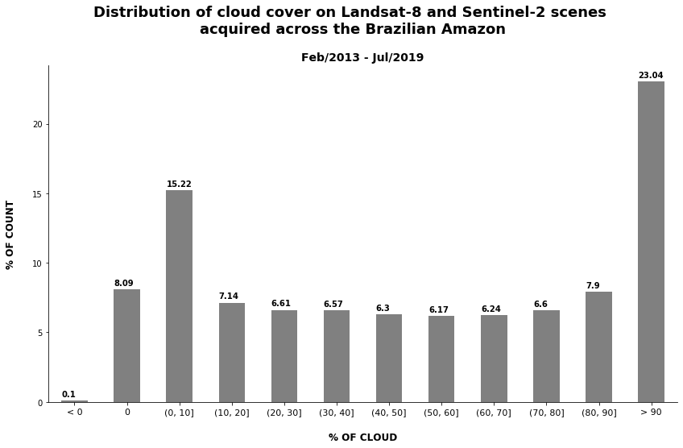
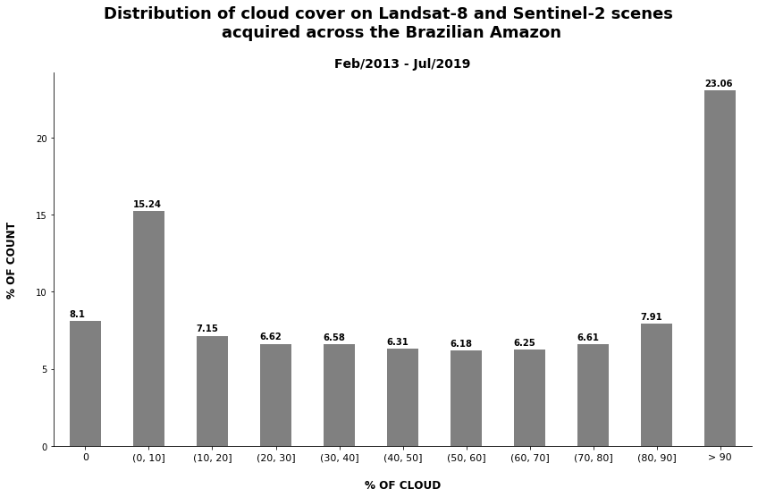

***

<h1> <p align="center"> Spatial-temporal differences in cloud cover of satellite observations across the Brazilian Amazon rainforest</p> </h1>
<p align="center"> Willian Vieira de Oliveira </p>


<p align="right"> [ Part 2 - Basic processing and statistics of the data ] </p>

### SUMMARY

1. [**About**](./1_Project.md#About)
1. [**The Data**](./1_Project.md#TheData)
    1. [Raw data](./1_Project.md#RawData)
    1. [Processed data](./1_Project.md#ProcessedData)
    1. [Additional data](./1_Project.md#AdditionalData)
1. [**Questions about the data**](./1_Project.md#Questions)
1. [**Basic processing of the data**](./2_Basic_processing.md#BasicProc)
1. [**Statistics**](./2_Basic_processing.md#Stats)
1. [**Exploratory Data Analysis**](./3_EDA.md#EDA)
1. [**Results**](./4_Results_and_Conclusion.md#Results)
1. [**Conclusion**](./4_Results_and_Conclusion.md#Conclusion)
***

<a id='BasicProc'></a>
## 4. Basic processing of the data

### Reading the metadata file


```python
from matplotlib import pyplot as plt
import geopandas as gpd
import pandas as pd
```


```python
filename = 'Output/Metadata/Metadata_L8_S2.csv'

try:
    raw_data = pd.read_csv(filename, encoding='utf-8')
    print("The file was read!")
except Exception as e:
    print(str(e))
```

    The file was read!
    


```python
raw_data#.head()
```


<div>
<table border="1" class="dataframe">
  <thead>
    <tr style="text-align: right;">
      <th></th>
      <th>Product ID</th>
      <th>Acquisition Date</th>
      <th>Platform</th>
      <th>WRS Path</th>
      <th>WRS Row</th>
      <th>Tile Number</th>
      <th>Cloud cover</th>
      <th>Datum</th>
      <th>UTM Zone</th>
      <th>Spatial Resolution - Pan</th>
      <th>Spatial Resolution - Refletive</th>
      <th>Spatial Resolution - Thermal</th>
    </tr>
  </thead>
  <tbody>
    <tr>
      <th>0</th>
      <td>LC08_L1GT_228058_20190731_20190731_01_RT</td>
      <td>2019/07/31</td>
      <td>Landsat-8</td>
      <td>228.0</td>
      <td>58.0</td>
      <td>NaN</td>
      <td>46.8200</td>
      <td>WGS84</td>
      <td>21</td>
      <td>15</td>
      <td>30</td>
      <td>30</td>
    </tr>
    <tr>
      <th>1</th>
      <td>LC08_L1TP_228059_20190731_20190731_01_RT</td>
      <td>2019/07/31</td>
      <td>Landsat-8</td>
      <td>228.0</td>
      <td>59.0</td>
      <td>NaN</td>
      <td>18.8900</td>
      <td>WGS84</td>
      <td>21</td>
      <td>15</td>
      <td>30</td>
      <td>30</td>
    </tr>
    <tr>
      <th>2</th>
      <td>LC08_L1TP_228060_20190731_20190731_01_RT</td>
      <td>2019/07/31</td>
      <td>Landsat-8</td>
      <td>228.0</td>
      <td>60.0</td>
      <td>NaN</td>
      <td>12.8600</td>
      <td>WGS84</td>
      <td>21</td>
      <td>15</td>
      <td>30</td>
      <td>30</td>
    </tr>
    <tr>
      <th>3</th>
      <td>LC08_L1TP_228061_20190731_20190731_01_RT</td>
      <td>2019/07/31</td>
      <td>Landsat-8</td>
      <td>228.0</td>
      <td>61.0</td>
      <td>NaN</td>
      <td>7.6700</td>
      <td>WGS84</td>
      <td>21</td>
      <td>15</td>
      <td>30</td>
      <td>30</td>
    </tr>
    <tr>
      <th>4</th>
      <td>LC08_L1TP_228062_20190731_20190731_01_RT</td>
      <td>2019/07/31</td>
      <td>Landsat-8</td>
      <td>228.0</td>
      <td>62.0</td>
      <td>NaN</td>
      <td>8.1000</td>
      <td>WGS84</td>
      <td>21</td>
      <td>15</td>
      <td>30</td>
      <td>30</td>
    </tr>
    <tr>
      <th>5</th>
      <td>LC08_L1TP_228063_20190731_20190731_01_RT</td>
      <td>2019/07/31</td>
      <td>Landsat-8</td>
      <td>228.0</td>
      <td>63.0</td>
      <td>NaN</td>
      <td>0.1000</td>
      <td>WGS84</td>
      <td>21</td>
      <td>15</td>
      <td>30</td>
      <td>30</td>
    </tr>
    <tr>
      <th>6</th>
      <td>LC08_L1TP_228064_20190731_20190731_01_RT</td>
      <td>2019/07/31</td>
      <td>Landsat-8</td>
      <td>228.0</td>
      <td>64.0</td>
      <td>NaN</td>
      <td>0.0000</td>
      <td>WGS84</td>
      <td>21</td>
      <td>15</td>
      <td>30</td>
      <td>30</td>
    </tr>
    <tr>
      <th>7</th>
      <td>LC08_L1TP_228065_20190731_20190731_01_RT</td>
      <td>2019/07/31</td>
      <td>Landsat-8</td>
      <td>228.0</td>
      <td>65.0</td>
      <td>NaN</td>
      <td>0.8000</td>
      <td>WGS84</td>
      <td>21</td>
      <td>15</td>
      <td>30</td>
      <td>30</td>
    </tr>
    <tr>
      <th>8</th>
      <td>LC08_L1TP_228066_20190731_20190731_01_RT</td>
      <td>2019/07/31</td>
      <td>Landsat-8</td>
      <td>228.0</td>
      <td>66.0</td>
      <td>NaN</td>
      <td>3.9400</td>
      <td>WGS84</td>
      <td>21</td>
      <td>15</td>
      <td>30</td>
      <td>30</td>
    </tr>
    <tr>
      <th>9</th>
      <td>LC08_L1TP_228067_20190731_20190731_01_RT</td>
      <td>2019/07/31</td>
      <td>Landsat-8</td>
      <td>228.0</td>
      <td>67.0</td>
      <td>NaN</td>
      <td>9.8300</td>
      <td>WGS84</td>
      <td>21</td>
      <td>15</td>
      <td>30</td>
      <td>30</td>
    </tr>
    <tr>
      <th>10</th>
      <td>LC08_L1TP_228068_20190731_20190731_01_RT</td>
      <td>2019/07/31</td>
      <td>Landsat-8</td>
      <td>228.0</td>
      <td>68.0</td>
      <td>NaN</td>
      <td>0.9800</td>
      <td>WGS84</td>
      <td>21</td>
      <td>15</td>
      <td>30</td>
      <td>30</td>
    </tr>
    <tr>
      <th>11</th>
      <td>LC08_L1TP_228069_20190731_20190731_01_RT</td>
      <td>2019/07/31</td>
      <td>Landsat-8</td>
      <td>228.0</td>
      <td>69.0</td>
      <td>NaN</td>
      <td>0.7900</td>
      <td>WGS84</td>
      <td>21</td>
      <td>15</td>
      <td>30</td>
      <td>30</td>
    </tr>
    <tr>
      <th>12</th>
      <td>LC08_L1TP_228070_20190731_20190731_01_RT</td>
      <td>2019/07/31</td>
      <td>Landsat-8</td>
      <td>228.0</td>
      <td>70.0</td>
      <td>NaN</td>
      <td>0.1000</td>
      <td>WGS84</td>
      <td>21</td>
      <td>15</td>
      <td>30</td>
      <td>30</td>
    </tr>
    <tr>
      <th>13</th>
      <td>LC08_L1TP_228071_20190731_20190731_01_RT</td>
      <td>2019/07/31</td>
      <td>Landsat-8</td>
      <td>228.0</td>
      <td>71.0</td>
      <td>NaN</td>
      <td>0.1700</td>
      <td>WGS84</td>
      <td>21</td>
      <td>15</td>
      <td>30</td>
      <td>30</td>
    </tr>
    <tr>
      <th>14</th>
      <td>LC08_L1TP_228072_20190731_20190731_01_RT</td>
      <td>2019/07/31</td>
      <td>Landsat-8</td>
      <td>228.0</td>
      <td>72.0</td>
      <td>NaN</td>
      <td>0.0000</td>
      <td>WGS84</td>
      <td>21</td>
      <td>15</td>
      <td>30</td>
      <td>30</td>
    </tr>
    <tr>
      <th>15</th>
      <td>LC08_L1TP_004058_20190730_20190730_01_RT</td>
      <td>2019/07/30</td>
      <td>Landsat-8</td>
      <td>4.0</td>
      <td>58.0</td>
      <td>NaN</td>
      <td>70.9300</td>
      <td>WGS84</td>
      <td>19</td>
      <td>15</td>
      <td>30</td>
      <td>30</td>
    </tr>
    <tr>
      <th>16</th>
      <td>LC08_L1TP_004059_20190730_20190730_01_RT</td>
      <td>2019/07/30</td>
      <td>Landsat-8</td>
      <td>4.0</td>
      <td>59.0</td>
      <td>NaN</td>
      <td>54.7200</td>
      <td>WGS84</td>
      <td>19</td>
      <td>15</td>
      <td>30</td>
      <td>30</td>
    </tr>
    <tr>
      <th>17</th>
      <td>LC08_L1TP_004060_20190730_20190730_01_RT</td>
      <td>2019/07/30</td>
      <td>Landsat-8</td>
      <td>4.0</td>
      <td>60.0</td>
      <td>NaN</td>
      <td>79.8400</td>
      <td>WGS84</td>
      <td>19</td>
      <td>15</td>
      <td>30</td>
      <td>30</td>
    </tr>
    <tr>
      <th>18</th>
      <td>LC08_L1GT_004061_20190730_20190730_01_RT</td>
      <td>2019/07/30</td>
      <td>Landsat-8</td>
      <td>4.0</td>
      <td>61.0</td>
      <td>NaN</td>
      <td>84.4400</td>
      <td>WGS84</td>
      <td>19</td>
      <td>15</td>
      <td>30</td>
      <td>30</td>
    </tr>
    <tr>
      <th>19</th>
      <td>LC08_L1GT_004062_20190730_20190730_01_RT</td>
      <td>2019/07/30</td>
      <td>Landsat-8</td>
      <td>4.0</td>
      <td>62.0</td>
      <td>NaN</td>
      <td>81.8600</td>
      <td>WGS84</td>
      <td>19</td>
      <td>15</td>
      <td>30</td>
      <td>30</td>
    </tr>
    <tr>
      <th>20</th>
      <td>LC08_L1TP_004063_20190730_20190730_01_RT</td>
      <td>2019/07/30</td>
      <td>Landsat-8</td>
      <td>4.0</td>
      <td>63.0</td>
      <td>NaN</td>
      <td>14.2300</td>
      <td>WGS84</td>
      <td>19</td>
      <td>15</td>
      <td>30</td>
      <td>30</td>
    </tr>
    <tr>
      <th>21</th>
      <td>LC08_L1TP_004064_20190730_20190730_01_RT</td>
      <td>2019/07/30</td>
      <td>Landsat-8</td>
      <td>4.0</td>
      <td>64.0</td>
      <td>NaN</td>
      <td>0.0000</td>
      <td>WGS84</td>
      <td>19</td>
      <td>15</td>
      <td>30</td>
      <td>30</td>
    </tr>
    <tr>
      <th>22</th>
      <td>LC08_L1TP_004065_20190730_20190730_01_RT</td>
      <td>2019/07/30</td>
      <td>Landsat-8</td>
      <td>4.0</td>
      <td>65.0</td>
      <td>NaN</td>
      <td>0.0000</td>
      <td>WGS84</td>
      <td>19</td>
      <td>15</td>
      <td>30</td>
      <td>30</td>
    </tr>
    <tr>
      <th>23</th>
      <td>LC08_L1TP_004066_20190730_20190730_01_RT</td>
      <td>2019/07/30</td>
      <td>Landsat-8</td>
      <td>4.0</td>
      <td>66.0</td>
      <td>NaN</td>
      <td>0.0000</td>
      <td>WGS84</td>
      <td>19</td>
      <td>15</td>
      <td>30</td>
      <td>30</td>
    </tr>
    <tr>
      <th>24</th>
      <td>LC08_L1TP_004067_20190730_20190730_01_RT</td>
      <td>2019/07/30</td>
      <td>Landsat-8</td>
      <td>4.0</td>
      <td>67.0</td>
      <td>NaN</td>
      <td>4.6700</td>
      <td>WGS84</td>
      <td>19</td>
      <td>15</td>
      <td>30</td>
      <td>30</td>
    </tr>
    <tr>
      <th>25</th>
      <td>LC08_L1GT_221061_20190730_20190730_01_RT</td>
      <td>2019/07/30</td>
      <td>Landsat-8</td>
      <td>221.0</td>
      <td>61.0</td>
      <td>NaN</td>
      <td>40.7500</td>
      <td>WGS84</td>
      <td>23</td>
      <td>15</td>
      <td>30</td>
      <td>30</td>
    </tr>
    <tr>
      <th>26</th>
      <td>LC08_L1TP_221062_20190730_20190730_01_RT</td>
      <td>2019/07/30</td>
      <td>Landsat-8</td>
      <td>221.0</td>
      <td>62.0</td>
      <td>NaN</td>
      <td>34.9100</td>
      <td>WGS84</td>
      <td>23</td>
      <td>15</td>
      <td>30</td>
      <td>30</td>
    </tr>
    <tr>
      <th>27</th>
      <td>LC08_L1TP_221063_20190730_20190730_01_RT</td>
      <td>2019/07/30</td>
      <td>Landsat-8</td>
      <td>221.0</td>
      <td>63.0</td>
      <td>NaN</td>
      <td>8.7300</td>
      <td>WGS84</td>
      <td>23</td>
      <td>15</td>
      <td>30</td>
      <td>30</td>
    </tr>
    <tr>
      <th>28</th>
      <td>LC08_L1TP_221064_20190730_20190730_01_RT</td>
      <td>2019/07/30</td>
      <td>Landsat-8</td>
      <td>221.0</td>
      <td>64.0</td>
      <td>NaN</td>
      <td>0.0000</td>
      <td>WGS84</td>
      <td>23</td>
      <td>15</td>
      <td>30</td>
      <td>30</td>
    </tr>
    <tr>
      <th>29</th>
      <td>LC08_L1TP_221065_20190730_20190730_01_RT</td>
      <td>2019/07/30</td>
      <td>Landsat-8</td>
      <td>221.0</td>
      <td>65.0</td>
      <td>NaN</td>
      <td>0.0000</td>
      <td>WGS84</td>
      <td>23</td>
      <td>15</td>
      <td>30</td>
      <td>30</td>
    </tr>
    <tr>
      <th>...</th>
      <td>...</td>
      <td>...</td>
      <td>...</td>
      <td>...</td>
      <td>...</td>
      <td>...</td>
      <td>...</td>
      <td>...</td>
      <td>...</td>
      <td>...</td>
      <td>...</td>
      <td>...</td>
    </tr>
    <tr>
      <th>177653</th>
      <td>S2A_OPER_PRD_MSIL1C_PDMC_20170121T132253_R110_...</td>
      <td>2015-08-19</td>
      <td>SENTINEL-2A</td>
      <td>NaN</td>
      <td>NaN</td>
      <td>T21MWP</td>
      <td>8.2695</td>
      <td>WGS84</td>
      <td>21S</td>
      <td>10</td>
      <td>20</td>
      <td>60</td>
    </tr>
    <tr>
      <th>177654</th>
      <td>S2A_OPER_PRD_MSIL1C_PDMC_20170121T132253_R110_...</td>
      <td>2015-08-19</td>
      <td>SENTINEL-2A</td>
      <td>NaN</td>
      <td>NaN</td>
      <td>T21MXM</td>
      <td>71.5078</td>
      <td>WGS84</td>
      <td>21S</td>
      <td>10</td>
      <td>20</td>
      <td>60</td>
    </tr>
    <tr>
      <th>177655</th>
      <td>S2A_OPER_PRD_MSIL1C_PDMC_20170121T132253_R110_...</td>
      <td>2015-08-19</td>
      <td>SENTINEL-2A</td>
      <td>NaN</td>
      <td>NaN</td>
      <td>T21MVP</td>
      <td>9.4894</td>
      <td>WGS84</td>
      <td>21S</td>
      <td>10</td>
      <td>20</td>
      <td>60</td>
    </tr>
    <tr>
      <th>177656</th>
      <td>S2A_OPER_PRD_MSIL1C_PDMC_20170121T132253_R110_...</td>
      <td>2015-08-19</td>
      <td>SENTINEL-2A</td>
      <td>NaN</td>
      <td>NaN</td>
      <td>T21MVM</td>
      <td>23.7708</td>
      <td>WGS84</td>
      <td>21S</td>
      <td>10</td>
      <td>20</td>
      <td>60</td>
    </tr>
    <tr>
      <th>177657</th>
      <td>S2A_OPER_PRD_MSIL1C_PDMC_20170121T132253_R110_...</td>
      <td>2015-08-19</td>
      <td>SENTINEL-2A</td>
      <td>NaN</td>
      <td>NaN</td>
      <td>T21MUP</td>
      <td>44.9922</td>
      <td>WGS84</td>
      <td>21S</td>
      <td>10</td>
      <td>20</td>
      <td>60</td>
    </tr>
    <tr>
      <th>177658</th>
      <td>S2A_OPER_PRD_MSIL1C_PDMC_20170121T132253_R110_...</td>
      <td>2015-08-19</td>
      <td>SENTINEL-2A</td>
      <td>NaN</td>
      <td>NaN</td>
      <td>T21MUN</td>
      <td>48.1419</td>
      <td>WGS84</td>
      <td>21S</td>
      <td>10</td>
      <td>20</td>
      <td>60</td>
    </tr>
    <tr>
      <th>177659</th>
      <td>S2A_OPER_PRD_MSIL1C_PDMC_20170121T132253_R110_...</td>
      <td>2015-08-19</td>
      <td>SENTINEL-2A</td>
      <td>NaN</td>
      <td>NaN</td>
      <td>T21MUM</td>
      <td>11.8060</td>
      <td>WGS84</td>
      <td>21S</td>
      <td>10</td>
      <td>20</td>
      <td>60</td>
    </tr>
    <tr>
      <th>177660</th>
      <td>S2A_OPER_PRD_MSIL1C_PDMC_20170121T132253_R110_...</td>
      <td>2015-08-19</td>
      <td>SENTINEL-2A</td>
      <td>NaN</td>
      <td>NaN</td>
      <td>T21MWM</td>
      <td>48.0121</td>
      <td>WGS84</td>
      <td>21S</td>
      <td>10</td>
      <td>20</td>
      <td>60</td>
    </tr>
    <tr>
      <th>177661</th>
      <td>S2A_OPER_PRD_MSIL1C_PDMC_20170121T132253_R110_...</td>
      <td>2015-08-19</td>
      <td>SENTINEL-2A</td>
      <td>NaN</td>
      <td>NaN</td>
      <td>T21MXN</td>
      <td>47.3968</td>
      <td>WGS84</td>
      <td>21S</td>
      <td>10</td>
      <td>20</td>
      <td>60</td>
    </tr>
    <tr>
      <th>177662</th>
      <td>S2A_OPER_PRD_MSIL1C_PDMC_20170121T132253_R110_...</td>
      <td>2015-08-19</td>
      <td>SENTINEL-2A</td>
      <td>NaN</td>
      <td>NaN</td>
      <td>T21MXP</td>
      <td>48.0832</td>
      <td>WGS84</td>
      <td>21S</td>
      <td>10</td>
      <td>20</td>
      <td>60</td>
    </tr>
    <tr>
      <th>177663</th>
      <td>S2A_OPER_PRD_MSIL1C_PDMC_20170121T132253_R110_...</td>
      <td>2015-08-19</td>
      <td>SENTINEL-2A</td>
      <td>NaN</td>
      <td>NaN</td>
      <td>T21MWN</td>
      <td>39.6626</td>
      <td>WGS84</td>
      <td>21S</td>
      <td>10</td>
      <td>20</td>
      <td>60</td>
    </tr>
    <tr>
      <th>177664</th>
      <td>S2A_OPER_PRD_MSIL1C_PDMC_20170122T031711_R110_...</td>
      <td>2015-08-19</td>
      <td>SENTINEL-2A</td>
      <td>NaN</td>
      <td>NaN</td>
      <td>T21KUB</td>
      <td>0.0000</td>
      <td>WGS84</td>
      <td>21S</td>
      <td>10</td>
      <td>20</td>
      <td>60</td>
    </tr>
    <tr>
      <th>177665</th>
      <td>S2A_OPER_PRD_MSIL1C_PDMC_20170122T031711_R110_...</td>
      <td>2015-08-19</td>
      <td>SENTINEL-2A</td>
      <td>NaN</td>
      <td>NaN</td>
      <td>T20KQG</td>
      <td>0.0000</td>
      <td>WGS84</td>
      <td>20S</td>
      <td>10</td>
      <td>20</td>
      <td>60</td>
    </tr>
    <tr>
      <th>177666</th>
      <td>S2A_OPER_PRD_MSIL1C_PDMC_20170122T031711_R110_...</td>
      <td>2015-08-19</td>
      <td>SENTINEL-2A</td>
      <td>NaN</td>
      <td>NaN</td>
      <td>T20KRG</td>
      <td>0.0000</td>
      <td>WGS84</td>
      <td>20S</td>
      <td>10</td>
      <td>20</td>
      <td>60</td>
    </tr>
    <tr>
      <th>177667</th>
      <td>S2A_OPER_PRD_MSIL1C_PDMC_20170122T031711_R110_...</td>
      <td>2015-08-19</td>
      <td>SENTINEL-2A</td>
      <td>NaN</td>
      <td>NaN</td>
      <td>T21KTB</td>
      <td>0.0000</td>
      <td>WGS84</td>
      <td>21S</td>
      <td>10</td>
      <td>20</td>
      <td>60</td>
    </tr>
    <tr>
      <th>177668</th>
      <td>S2A_OPER_PRD_MSIL1C_PDMC_20170122T031711_R110_...</td>
      <td>2015-08-19</td>
      <td>SENTINEL-2A</td>
      <td>NaN</td>
      <td>NaN</td>
      <td>T21KUA</td>
      <td>0.0000</td>
      <td>WGS84</td>
      <td>21S</td>
      <td>10</td>
      <td>20</td>
      <td>60</td>
    </tr>
    <tr>
      <th>177669</th>
      <td>S2A_OPER_PRD_MSIL1C_PDMC_20170122T031711_R110_...</td>
      <td>2015-08-19</td>
      <td>SENTINEL-2A</td>
      <td>NaN</td>
      <td>NaN</td>
      <td>T21KVB</td>
      <td>0.0000</td>
      <td>WGS84</td>
      <td>21S</td>
      <td>10</td>
      <td>20</td>
      <td>60</td>
    </tr>
    <tr>
      <th>177670</th>
      <td>S2A_OPER_PRD_MSIL1C_PDMC_20170121T211720_R110_...</td>
      <td>2015-08-19</td>
      <td>SENTINEL-2A</td>
      <td>NaN</td>
      <td>NaN</td>
      <td>T21MYU</td>
      <td>0.2791</td>
      <td>WGS84</td>
      <td>21S</td>
      <td>10</td>
      <td>20</td>
      <td>60</td>
    </tr>
    <tr>
      <th>177671</th>
      <td>S2A_OPER_PRD_MSIL1C_PDMC_20170121T211720_R110_...</td>
      <td>2015-08-19</td>
      <td>SENTINEL-2A</td>
      <td>NaN</td>
      <td>NaN</td>
      <td>T21MWT</td>
      <td>3.0382</td>
      <td>WGS84</td>
      <td>21S</td>
      <td>10</td>
      <td>20</td>
      <td>60</td>
    </tr>
    <tr>
      <th>177672</th>
      <td>S2A_OPER_PRD_MSIL1C_PDMC_20170121T211720_R110_...</td>
      <td>2015-08-19</td>
      <td>SENTINEL-2A</td>
      <td>NaN</td>
      <td>NaN</td>
      <td>T21MZV</td>
      <td>0.0000</td>
      <td>WGS84</td>
      <td>21S</td>
      <td>10</td>
      <td>20</td>
      <td>60</td>
    </tr>
    <tr>
      <th>177673</th>
      <td>S2A_OPER_PRD_MSIL1C_PDMC_20170121T211720_R110_...</td>
      <td>2015-08-19</td>
      <td>SENTINEL-2A</td>
      <td>NaN</td>
      <td>NaN</td>
      <td>T21MWV</td>
      <td>44.3405</td>
      <td>WGS84</td>
      <td>21S</td>
      <td>10</td>
      <td>20</td>
      <td>60</td>
    </tr>
    <tr>
      <th>177674</th>
      <td>S2A_OPER_PRD_MSIL1C_PDMC_20170121T211720_R110_...</td>
      <td>2015-08-19</td>
      <td>SENTINEL-2A</td>
      <td>NaN</td>
      <td>NaN</td>
      <td>T21MXV</td>
      <td>9.5568</td>
      <td>WGS84</td>
      <td>21S</td>
      <td>10</td>
      <td>20</td>
      <td>60</td>
    </tr>
    <tr>
      <th>177675</th>
      <td>S2A_OPER_PRD_MSIL1C_PDMC_20170121T211720_R110_...</td>
      <td>2015-08-19</td>
      <td>SENTINEL-2A</td>
      <td>NaN</td>
      <td>NaN</td>
      <td>T21MXT</td>
      <td>2.3223</td>
      <td>WGS84</td>
      <td>21S</td>
      <td>10</td>
      <td>20</td>
      <td>60</td>
    </tr>
    <tr>
      <th>177676</th>
      <td>S2A_OPER_PRD_MSIL1C_PDMC_20170121T211720_R110_...</td>
      <td>2015-08-19</td>
      <td>SENTINEL-2A</td>
      <td>NaN</td>
      <td>NaN</td>
      <td>T21MXU</td>
      <td>1.2880</td>
      <td>WGS84</td>
      <td>21S</td>
      <td>10</td>
      <td>20</td>
      <td>60</td>
    </tr>
    <tr>
      <th>177677</th>
      <td>S2A_OPER_PRD_MSIL1C_PDMC_20170121T211720_R110_...</td>
      <td>2015-08-19</td>
      <td>SENTINEL-2A</td>
      <td>NaN</td>
      <td>NaN</td>
      <td>T21MYT</td>
      <td>3.1379</td>
      <td>WGS84</td>
      <td>21S</td>
      <td>10</td>
      <td>20</td>
      <td>60</td>
    </tr>
    <tr>
      <th>177678</th>
      <td>S2A_OPER_PRD_MSIL1C_PDMC_20170121T211720_R110_...</td>
      <td>2015-08-19</td>
      <td>SENTINEL-2A</td>
      <td>NaN</td>
      <td>NaN</td>
      <td>T21MWU</td>
      <td>10.2529</td>
      <td>WGS84</td>
      <td>21S</td>
      <td>10</td>
      <td>20</td>
      <td>60</td>
    </tr>
    <tr>
      <th>177679</th>
      <td>S2A_OPER_PRD_MSIL1C_PDMC_20170121T211720_R110_...</td>
      <td>2015-08-19</td>
      <td>SENTINEL-2A</td>
      <td>NaN</td>
      <td>NaN</td>
      <td>T21MVV</td>
      <td>44.8977</td>
      <td>WGS84</td>
      <td>21S</td>
      <td>10</td>
      <td>20</td>
      <td>60</td>
    </tr>
    <tr>
      <th>177680</th>
      <td>S2A_OPER_PRD_MSIL1C_PDMC_20170121T211720_R110_...</td>
      <td>2015-08-19</td>
      <td>SENTINEL-2A</td>
      <td>NaN</td>
      <td>NaN</td>
      <td>T21MVU</td>
      <td>18.1768</td>
      <td>WGS84</td>
      <td>21S</td>
      <td>10</td>
      <td>20</td>
      <td>60</td>
    </tr>
    <tr>
      <th>177681</th>
      <td>S2A_OPER_PRD_MSIL1C_PDMC_20170121T211720_R110_...</td>
      <td>2015-08-19</td>
      <td>SENTINEL-2A</td>
      <td>NaN</td>
      <td>NaN</td>
      <td>T21MYV</td>
      <td>34.5259</td>
      <td>WGS84</td>
      <td>21S</td>
      <td>10</td>
      <td>20</td>
      <td>60</td>
    </tr>
    <tr>
      <th>177682</th>
      <td>S2A_OPER_PRD_MSIL1C_PDMC_20170121T211720_R110_...</td>
      <td>2015-08-19</td>
      <td>SENTINEL-2A</td>
      <td>NaN</td>
      <td>NaN</td>
      <td>T21MVT</td>
      <td>5.5611</td>
      <td>WGS84</td>
      <td>21S</td>
      <td>10</td>
      <td>20</td>
      <td>60</td>
    </tr>
  </tbody>
</table>
<p>177683 rows × 12 columns</p>
</div>


### Tidying up the data


```python
tidy_data = raw_data.copy()
```

#### Table columns and structure

##### Table struture 


```python
print("Number of lines: ", tidy_data.shape[0])
print("Number of columns: ", tidy_data.shape[1])
```

    Number of lines:  177683
    Number of columns:  12
    

##### Columns


```python
tidy_data.columns
```


    Index(['Product ID', 'Acquisition Date', 'Platform', 'WRS Path', 'WRS Row',
           'Tile Number', 'Cloud cover', 'Datum', 'UTM Zone',
           'Spatial Resolution - Pan', 'Spatial Resolution - Refletive',
           'Spatial Resolution - Thermal'],
          dtype='object')


#### Statistics and distribution of the cloud cover data

Observe that some data present negative cloud cover. *These observations will be removed from the dataframe*.

##### Statistics


```python
tidy_data["Cloud cover"].describe()
```


    count    177683.000000
    mean         49.937668
    std          36.960325
    min          -1.000000
    25%          12.155400
    50%          49.936100
    75%          87.789700
    max         100.000000
    Name: Cloud cover, dtype: float64


##### Data distribution


```python
from matplotlib import pyplot as plt

# create the figure
fig = plt.figure()
fig.suptitle("Distribution of cloud cover on Landsat-8 and Sentinel-2 scenes \nacquired across the Brazilian Amazon", fontsize=18, fontweight='bold') 

# format the axes
ax = fig.add_subplot()
fig.subplots_adjust(top=0.85)
ax.set_title('Feb/2013 - Jul/2019', fontsize=14, fontweight='bold')
ax.set_xlabel("% OF CLOUD", labelpad=20, fontsize=12, fontweight='bold')
ax.set_ylabel("% OF COUNT", labelpad=20, fontsize=12, fontweight='bold')
ax.spines['top'].set_visible(False)
ax.spines['right'].set_visible(False)
plt.grid(linestyle="dashed", axis="y")

# data normalization
out = pd.cut(tidy_data["Cloud cover"], bins=[-100, -1, 0, 10, 20, 30, 40, 50, 60, 70, 80, 90, 100], include_lowest=False)
out_norm = out.value_counts(sort=False, normalize=True).mul(100)
ax = out_norm.plot.bar(rot=0, color="gray", figsize=(14,8) )

# X-axis: Label options
    # Option 1: ["< 0"; (0, 10]; "> 90"]
labels = [str(c) for c in out.cat.categories]
labels[0] = "< 0"
labels[1] = "0"
labels[-1] = "> 90"
    # Option 2: 0 to 10
#labels = [str(c)[1:-1].replace(","," to") for c in out.cat.categories]
    # Option 3: >0<=10
#labels = ["< 0", "Zero cloud", ">0<=10", ">10<=20", ">20<=30", ">30<=40", ">40<=50", ">50<=60", ">60<=70", ">70<=80", ">80<=90", ">90"]

ax.set_xticklabels(labels, color='black', fontsize=11)

# add the y-value related to each bar
for p in ax.patches:
    #ax.annotate(str(round(p.get_height(),2)), (p.get_x() * 1.000, p.get_height() * 1.015))    
    ax.annotate(str(round(p.get_height(),2)), (p.get_x(), p.get_height() + 0.3), color='black', fontweight='bold')    

plt.show()
```





##### Removing observations that present negative cloud cover


```python
# Get the name of indexes for which column "Cloud cover" has negative values
index_delete = tidy_data[tidy_data["Cloud cover"] < 0].index


# Delete these row indexes from dataFrame
tidy_data.drop(index_delete, inplace=True)
```


```python
print("There are ", len(index_delete), " observations that present negative cloud cover.")

print("\nNew structure of the dataframe: ", tidy_data.shape)
```

    There are 183 observations that present negative cloud cover.
    
    New structure of the dataframe:  (177500, 12)
    

#### Lets check the statistics and distribution of the data once again

##### Statistics


```python
tidy_data["Cloud cover"].describe()
```


    count    177500.000000
    mean         49.990184
    std          36.943149
    min           0.000000
    25%          12.263300
    50%          50.013650
    75%          87.816550
    max         100.000000
    Name: Cloud cover, dtype: float64


##### Data distribution


```python
from matplotlib import pyplot as plt

# create the figure
fig = plt.figure()
fig.suptitle("Distribution of cloud cover on Landsat-8 and Sentinel-2 scenes \nacquired across the Brazilian Amazon", fontsize=18, fontweight='bold') 

# format the axes
ax = fig.add_subplot()
fig.subplots_adjust(top=0.85)
ax.set_title('Feb/2013 - Jul/2019', fontsize=14, fontweight='bold')
ax.set_xlabel("% OF CLOUD", labelpad=20, fontsize=12, fontweight='bold')
ax.set_ylabel("% OF COUNT", labelpad=20, fontsize=12, fontweight='bold')
ax.spines['top'].set_visible(False)
ax.spines['right'].set_visible(False)
plt.grid(linestyle="dashed", axis="y")

# data normalization
out = pd.cut(tidy_data["Cloud cover"], bins=[-100, 0, 10, 20, 30, 40, 50, 60, 70, 80, 90, 100], include_lowest=False)
out_norm = out.value_counts(sort=False, normalize=True).mul(100)
ax = out_norm.plot.bar(rot=0, color="gray", figsize=(14,8) )

# X-axis: Label options
    # Option 1: ["< 0"; (0, 10]; "> 90"]
labels = [str(c) for c in out.cat.categories]
labels[0] = "0"
labels[-1] = "> 90"
    # Option 2: 0 to 10
#labels = [str(c)[1:-1].replace(","," to") for c in out.cat.categories]
    # Option 3: >0<=10
#labels = ["< 0", "Zero cloud", ">0<=10", ">10<=20", ">20<=30", ">30<=40", ">40<=50", ">50<=60", ">60<=70", ">70<=80", ">80<=90", ">90"]

ax.set_xticklabels(labels, color='black', fontsize=11)

# add the y-value related to each bar
for p in ax.patches:
    #ax.annotate(str(round(p.get_height(),2)), (p.get_x() * 1.000, p.get_height() * 1.015))    
    ax.annotate(str(round(p.get_height(),2)), (p.get_x(), p.get_height() + 0.3), color='black', fontweight='bold')    

plt.show()
```





#### Converting some columns to catagorical factors

##### Platform


```python
tidy_data.loc[tidy_data["Platform"] == "Landsat-8", "Platform"] = "L8"
tidy_data.loc[tidy_data["Platform"] == "SENTINEL-2A", "Platform"] = "S2A"
tidy_data.loc[tidy_data["Platform"] == "SENTINEL-2B", "Platform"] = "S2B"

# Convert the column Platform to type Category 
    # https://stackoverflow.com/questions/38954525/how-to-have-catagorical-factor-variables-in-python
tidy_data["Platform"] = tidy_data["Platform"].astype('category')
```

##### Catalog system for Landsat and Sentinel data

**Landsat** uses the Worldwide Reference System (**WRS**), which is a global system that catalogs Landsat data by Path and Row numbers.


On the other hand, **Sentinel** adopts the UTM system, which divides the Earth's surface into granules. The granules, also called **tiles**, are 100x100 km2 ortho-images in UTM/WGS84.


Here, I created a column named "Catalog system" to describe the system related to each observation. This column tells me if I should analyse the columns "WRS Path" and "WRS Row" or just the column "Tile Number".


```python
# Creates the new column
tidy_data.insert(3, "Catalog system", None, allow_duplicates=False)
```


```python
# Attributes the data
tidy_data.loc[tidy_data["Platform"] == "L8", "Catalog system"] = "WRS"
tidy_data.loc[tidy_data["Platform"] == "S2A", "Catalog system"] = "Tile"
tidy_data.loc[tidy_data["Platform"] == "S2B", "Catalog system"] = "Tile"
```


```python
# Converts to categorical type
tidy_data["Catalog system"] = tidy_data["Catalog system"].astype('category')
tidy_data.head()
```


<div>
<table border="1" class="dataframe">
  <thead>
    <tr style="text-align: right;">
      <th></th>
      <th>Product ID</th>
      <th>Acquisition Date</th>
      <th>Platform</th>
      <th>Catalog system</th>
      <th>WRS Path</th>
      <th>WRS Row</th>
      <th>Tile Number</th>
      <th>Cloud cover</th>
      <th>Datum</th>
      <th>UTM Zone</th>
      <th>Spatial Resolution - Pan</th>
      <th>Spatial Resolution - Refletive</th>
      <th>Spatial Resolution - Thermal</th>
    </tr>
  </thead>
  <tbody>
    <tr>
      <th>0</th>
      <td>LC08_L1GT_228058_20190731_20190731_01_RT</td>
      <td>2019/07/31</td>
      <td>L8</td>
      <td>WRS</td>
      <td>228.0</td>
      <td>58.0</td>
      <td>NaN</td>
      <td>46.82</td>
      <td>WGS84</td>
      <td>21</td>
      <td>15</td>
      <td>30</td>
      <td>30</td>
    </tr>
    <tr>
      <th>1</th>
      <td>LC08_L1TP_228059_20190731_20190731_01_RT</td>
      <td>2019/07/31</td>
      <td>L8</td>
      <td>WRS</td>
      <td>228.0</td>
      <td>59.0</td>
      <td>NaN</td>
      <td>18.89</td>
      <td>WGS84</td>
      <td>21</td>
      <td>15</td>
      <td>30</td>
      <td>30</td>
    </tr>
    <tr>
      <th>2</th>
      <td>LC08_L1TP_228060_20190731_20190731_01_RT</td>
      <td>2019/07/31</td>
      <td>L8</td>
      <td>WRS</td>
      <td>228.0</td>
      <td>60.0</td>
      <td>NaN</td>
      <td>12.86</td>
      <td>WGS84</td>
      <td>21</td>
      <td>15</td>
      <td>30</td>
      <td>30</td>
    </tr>
    <tr>
      <th>3</th>
      <td>LC08_L1TP_228061_20190731_20190731_01_RT</td>
      <td>2019/07/31</td>
      <td>L8</td>
      <td>WRS</td>
      <td>228.0</td>
      <td>61.0</td>
      <td>NaN</td>
      <td>7.67</td>
      <td>WGS84</td>
      <td>21</td>
      <td>15</td>
      <td>30</td>
      <td>30</td>
    </tr>
    <tr>
      <th>4</th>
      <td>LC08_L1TP_228062_20190731_20190731_01_RT</td>
      <td>2019/07/31</td>
      <td>L8</td>
      <td>WRS</td>
      <td>228.0</td>
      <td>62.0</td>
      <td>NaN</td>
      <td>8.10</td>
      <td>WGS84</td>
      <td>21</td>
      <td>15</td>
      <td>30</td>
      <td>30</td>
    </tr>
  </tbody>
</table>
</div>


##### Identifying the hemisphere in which the observation was acquired

Sentinel data presents the hemisphere along with the UTM Zone. However, Landsat data does not include this information. 

- Is it possible to identify the hemisphere using the path and row information? I might try that later on.


```python
# Creates a new column, named "Hemisphere"
tidy_data.insert(10, "Hemisphere", None, allow_duplicates=False)
```


```python
# Attributes the hemispher identifier to the new column
tidy_data.loc[tidy_data["Platform"] == "S2A", "Hemisphere"] = tidy_data["UTM Zone"].str[-1]
tidy_data.loc[tidy_data["Platform"] == "S2B", "Hemisphere"] = tidy_data["UTM Zone"].str[-1]

# Removes the hemispher identifier from the column "UTM Zone"
tidy_data.loc[tidy_data["Platform"] == "S2A", "UTM Zone"] = tidy_data["UTM Zone"].str[:-1]
tidy_data.loc[tidy_data["Platform"] == "S2B", "UTM Zone"] = tidy_data["UTM Zone"].str[:-1]
```

##### Sorting the table by column "Platform" (descending)


```python
tidy_data = tidy_data.sort_values("Platform", ascending=False, inplace=False)
tidy_data
```


<div>
<table border="1" class="dataframe">
  <thead>
    <tr style="text-align: right;">
      <th></th>
      <th>Product ID</th>
      <th>Acquisition Date</th>
      <th>Platform</th>
      <th>Catalog system</th>
      <th>WRS Path</th>
      <th>WRS Row</th>
      <th>Tile Number</th>
      <th>Cloud cover</th>
      <th>Datum</th>
      <th>UTM Zone</th>
      <th>Hemisphere</th>
      <th>Spatial Resolution - Pan</th>
      <th>Spatial Resolution - Refletive</th>
      <th>Spatial Resolution - Thermal</th>
    </tr>
  </thead>
  <tbody>
    <tr>
      <th>146473</th>
      <td>S2B_MSIL1C_20170715T134209_N0205_R124_T22MFC_2...</td>
      <td>2017-07-15</td>
      <td>S2B</td>
      <td>Tile</td>
      <td>NaN</td>
      <td>NaN</td>
      <td>T22MFB</td>
      <td>0.0614</td>
      <td>WGS84</td>
      <td>22</td>
      <td>S</td>
      <td>10</td>
      <td>20</td>
      <td>60</td>
    </tr>
    <tr>
      <th>89169</th>
      <td>S2B_MSIL1C_20180824T142849_N0206_R053_T20MPS_2...</td>
      <td>2018-08-24</td>
      <td>S2B</td>
      <td>Tile</td>
      <td>NaN</td>
      <td>NaN</td>
      <td>T20MRB</td>
      <td>0.9071</td>
      <td>WGS84</td>
      <td>20</td>
      <td>S</td>
      <td>10</td>
      <td>20</td>
      <td>60</td>
    </tr>
    <tr>
      <th>139370</th>
      <td>S2B_MSIL1C_20171106T132219_N0206_R038_T23LML_2...</td>
      <td>2017-11-06</td>
      <td>S2B</td>
      <td>Tile</td>
      <td>NaN</td>
      <td>NaN</td>
      <td>T23LML</td>
      <td>25.4748</td>
      <td>WGS84</td>
      <td>23</td>
      <td>S</td>
      <td>10</td>
      <td>20</td>
      <td>60</td>
    </tr>
    <tr>
      <th>139347</th>
      <td>S2B_MSIL1C_20171106T132219_N0206_R038_T23MNT_2...</td>
      <td>2017-11-06</td>
      <td>S2B</td>
      <td>Tile</td>
      <td>NaN</td>
      <td>NaN</td>
      <td>T23MNT</td>
      <td>18.3035</td>
      <td>WGS84</td>
      <td>23</td>
      <td>S</td>
      <td>10</td>
      <td>20</td>
      <td>60</td>
    </tr>
    <tr>
      <th>89128</th>
      <td>S2B_MSIL1C_20180824T142849_N0206_R053_T20MND_2...</td>
      <td>2018-08-24</td>
      <td>S2B</td>
      <td>Tile</td>
      <td>NaN</td>
      <td>NaN</td>
      <td>T20LNR</td>
      <td>0.6727</td>
      <td>WGS84</td>
      <td>20</td>
      <td>S</td>
      <td>10</td>
      <td>20</td>
      <td>60</td>
    </tr>
    <tr>
      <th>139353</th>
      <td>S2B_MSIL1C_20171106T132219_N0206_R038_T23MNQ_2...</td>
      <td>2017-11-06</td>
      <td>S2B</td>
      <td>Tile</td>
      <td>NaN</td>
      <td>NaN</td>
      <td>T23MNQ</td>
      <td>23.6639</td>
      <td>WGS84</td>
      <td>23</td>
      <td>S</td>
      <td>10</td>
      <td>20</td>
      <td>60</td>
    </tr>
    <tr>
      <th>89182</th>
      <td>S2B_MSIL1C_20180824T142849_N0206_R053_T20LMN_2...</td>
      <td>2018-08-24</td>
      <td>S2B</td>
      <td>Tile</td>
      <td>NaN</td>
      <td>NaN</td>
      <td>T20LMM</td>
      <td>0.0000</td>
      <td>WGS84</td>
      <td>20</td>
      <td>S</td>
      <td>10</td>
      <td>20</td>
      <td>60</td>
    </tr>
    <tr>
      <th>89130</th>
      <td>S2B_MSIL1C_20180824T142849_N0206_R053_T20NPJ_2...</td>
      <td>2018-08-24</td>
      <td>S2B</td>
      <td>Tile</td>
      <td>NaN</td>
      <td>NaN</td>
      <td>T20MPT</td>
      <td>0.0056</td>
      <td>WGS84</td>
      <td>20</td>
      <td>S</td>
      <td>10</td>
      <td>20</td>
      <td>60</td>
    </tr>
    <tr>
      <th>89198</th>
      <td>S2B_MSIL1C_20180824T142849_N0206_R053_T20MQC_2...</td>
      <td>2018-08-24</td>
      <td>S2B</td>
      <td>Tile</td>
      <td>NaN</td>
      <td>NaN</td>
      <td>T20NPG</td>
      <td>12.5944</td>
      <td>WGS84</td>
      <td>20</td>
      <td>N</td>
      <td>10</td>
      <td>20</td>
      <td>60</td>
    </tr>
    <tr>
      <th>89117</th>
      <td>S2B_MSIL1C_20180824T142849_N0206_R053_T20LLP_2...</td>
      <td>2018-08-24</td>
      <td>S2B</td>
      <td>Tile</td>
      <td>NaN</td>
      <td>NaN</td>
      <td>T20LPL</td>
      <td>0.0000</td>
      <td>WGS84</td>
      <td>20</td>
      <td>S</td>
      <td>10</td>
      <td>20</td>
      <td>60</td>
    </tr>
    <tr>
      <th>139339</th>
      <td>S2B_MSIL1C_20171106T132219_N0206_R038_T23MRT_2...</td>
      <td>2017-11-06</td>
      <td>S2B</td>
      <td>Tile</td>
      <td>NaN</td>
      <td>NaN</td>
      <td>T23MRT</td>
      <td>39.3702</td>
      <td>WGS84</td>
      <td>23</td>
      <td>S</td>
      <td>10</td>
      <td>20</td>
      <td>60</td>
    </tr>
    <tr>
      <th>89153</th>
      <td>S2B_MSIL1C_20180824T142849_N0206_R053_T21PTR_2...</td>
      <td>2018-08-24</td>
      <td>S2B</td>
      <td>Tile</td>
      <td>NaN</td>
      <td>NaN</td>
      <td>T21NTE</td>
      <td>17.4050</td>
      <td>WGS84</td>
      <td>21</td>
      <td>N</td>
      <td>10</td>
      <td>20</td>
      <td>60</td>
    </tr>
    <tr>
      <th>139360</th>
      <td>S2B_MSIL1C_20171106T132219_N0206_R038_T23MMR_2...</td>
      <td>2017-11-06</td>
      <td>S2B</td>
      <td>Tile</td>
      <td>NaN</td>
      <td>NaN</td>
      <td>T23MMR</td>
      <td>0.1313</td>
      <td>WGS84</td>
      <td>23</td>
      <td>S</td>
      <td>10</td>
      <td>20</td>
      <td>60</td>
    </tr>
    <tr>
      <th>139352</th>
      <td>S2B_MSIL1C_20171106T132219_N0206_R038_T23MNR_2...</td>
      <td>2017-11-06</td>
      <td>S2B</td>
      <td>Tile</td>
      <td>NaN</td>
      <td>NaN</td>
      <td>T23MNR</td>
      <td>1.2102</td>
      <td>WGS84</td>
      <td>23</td>
      <td>S</td>
      <td>10</td>
      <td>20</td>
      <td>60</td>
    </tr>
    <tr>
      <th>139366</th>
      <td>S2B_MSIL1C_20171106T132219_N0206_R038_T23MMM_2...</td>
      <td>2017-11-06</td>
      <td>S2B</td>
      <td>Tile</td>
      <td>NaN</td>
      <td>NaN</td>
      <td>T23MMM</td>
      <td>7.3842</td>
      <td>WGS84</td>
      <td>23</td>
      <td>S</td>
      <td>10</td>
      <td>20</td>
      <td>60</td>
    </tr>
    <tr>
      <th>139372</th>
      <td>S2B_MSIL1C_20171106T132219_N0206_R038_T23LMJ_2...</td>
      <td>2017-11-06</td>
      <td>S2B</td>
      <td>Tile</td>
      <td>NaN</td>
      <td>NaN</td>
      <td>T23LMJ</td>
      <td>46.7160</td>
      <td>WGS84</td>
      <td>23</td>
      <td>S</td>
      <td>10</td>
      <td>20</td>
      <td>60</td>
    </tr>
    <tr>
      <th>139349</th>
      <td>S2B_MSIL1C_20171106T132219_N0206_R038_T23MPS_2...</td>
      <td>2017-11-06</td>
      <td>S2B</td>
      <td>Tile</td>
      <td>NaN</td>
      <td>NaN</td>
      <td>T23MPS</td>
      <td>0.6984</td>
      <td>WGS84</td>
      <td>23</td>
      <td>S</td>
      <td>10</td>
      <td>20</td>
      <td>60</td>
    </tr>
    <tr>
      <th>139355</th>
      <td>S2B_MSIL1C_20171106T132219_N0206_R038_T23MPP_2...</td>
      <td>2017-11-06</td>
      <td>S2B</td>
      <td>Tile</td>
      <td>NaN</td>
      <td>NaN</td>
      <td>T23MPP</td>
      <td>55.0049</td>
      <td>WGS84</td>
      <td>23</td>
      <td>S</td>
      <td>10</td>
      <td>20</td>
      <td>60</td>
    </tr>
    <tr>
      <th>139378</th>
      <td>S2B_MSIL1C_20171106T132219_N0206_R038_T23LLJ_2...</td>
      <td>2017-11-06</td>
      <td>S2B</td>
      <td>Tile</td>
      <td>NaN</td>
      <td>NaN</td>
      <td>T23LLJ</td>
      <td>77.6297</td>
      <td>WGS84</td>
      <td>23</td>
      <td>S</td>
      <td>10</td>
      <td>20</td>
      <td>60</td>
    </tr>
    <tr>
      <th>139351</th>
      <td>S2B_MSIL1C_20171106T132219_N0206_R038_T23MPR_2...</td>
      <td>2017-11-06</td>
      <td>S2B</td>
      <td>Tile</td>
      <td>NaN</td>
      <td>NaN</td>
      <td>T23MPR</td>
      <td>14.7294</td>
      <td>WGS84</td>
      <td>23</td>
      <td>S</td>
      <td>10</td>
      <td>20</td>
      <td>60</td>
    </tr>
    <tr>
      <th>139281</th>
      <td>S2B_MSIL1C_20171108T140049_N0206_R067_T22NEL_2...</td>
      <td>2017-11-08</td>
      <td>S2B</td>
      <td>Tile</td>
      <td>NaN</td>
      <td>NaN</td>
      <td>T22MCA</td>
      <td>90.4819</td>
      <td>WGS84</td>
      <td>22</td>
      <td>S</td>
      <td>10</td>
      <td>20</td>
      <td>60</td>
    </tr>
    <tr>
      <th>89121</th>
      <td>S2B_MSIL1C_20180824T142849_N0206_R053_T20JKT_2...</td>
      <td>2018-08-24</td>
      <td>S2B</td>
      <td>Tile</td>
      <td>NaN</td>
      <td>NaN</td>
      <td>T20LLM</td>
      <td>0.0000</td>
      <td>WGS84</td>
      <td>20</td>
      <td>S</td>
      <td>10</td>
      <td>20</td>
      <td>60</td>
    </tr>
    <tr>
      <th>89152</th>
      <td>S2B_MSIL1C_20180824T142849_N0206_R053_T20MPU_2...</td>
      <td>2018-08-24</td>
      <td>S2B</td>
      <td>Tile</td>
      <td>NaN</td>
      <td>NaN</td>
      <td>T20NPK</td>
      <td>0.2788</td>
      <td>WGS84</td>
      <td>20</td>
      <td>N</td>
      <td>10</td>
      <td>20</td>
      <td>60</td>
    </tr>
    <tr>
      <th>89179</th>
      <td>S2B_MSIL1C_20180824T142849_N0206_R053_T20MPC_2...</td>
      <td>2018-08-24</td>
      <td>S2B</td>
      <td>Tile</td>
      <td>NaN</td>
      <td>NaN</td>
      <td>T20MQV</td>
      <td>0.5286</td>
      <td>WGS84</td>
      <td>20</td>
      <td>S</td>
      <td>10</td>
      <td>20</td>
      <td>60</td>
    </tr>
    <tr>
      <th>89149</th>
      <td>S2B_MSIL1C_20180824T142849_N0206_R053_T20MPT_2...</td>
      <td>2018-08-24</td>
      <td>S2B</td>
      <td>Tile</td>
      <td>NaN</td>
      <td>NaN</td>
      <td>T20MQC</td>
      <td>5.4627</td>
      <td>WGS84</td>
      <td>20</td>
      <td>S</td>
      <td>10</td>
      <td>20</td>
      <td>60</td>
    </tr>
    <tr>
      <th>89160</th>
      <td>S2B_MSIL1C_20180824T142849_N0206_R053_T20LPM_2...</td>
      <td>2018-08-24</td>
      <td>S2B</td>
      <td>Tile</td>
      <td>NaN</td>
      <td>NaN</td>
      <td>T20LNQ</td>
      <td>3.3736</td>
      <td>WGS84</td>
      <td>20</td>
      <td>S</td>
      <td>10</td>
      <td>20</td>
      <td>60</td>
    </tr>
    <tr>
      <th>89162</th>
      <td>S2B_MSIL1C_20180824T142849_N0206_R053_T20LNK_2...</td>
      <td>2018-08-24</td>
      <td>S2B</td>
      <td>Tile</td>
      <td>NaN</td>
      <td>NaN</td>
      <td>T20LML</td>
      <td>0.0000</td>
      <td>WGS84</td>
      <td>20</td>
      <td>S</td>
      <td>10</td>
      <td>20</td>
      <td>60</td>
    </tr>
    <tr>
      <th>89163</th>
      <td>S2B_MSIL1C_20180824T142849_N0206_R053_T20MQD_2...</td>
      <td>2018-08-24</td>
      <td>S2B</td>
      <td>Tile</td>
      <td>NaN</td>
      <td>NaN</td>
      <td>T20MRE</td>
      <td>12.6556</td>
      <td>WGS84</td>
      <td>20</td>
      <td>S</td>
      <td>10</td>
      <td>20</td>
      <td>60</td>
    </tr>
    <tr>
      <th>139344</th>
      <td>S2B_MSIL1C_20171106T132219_N0206_R038_T23MQR_2...</td>
      <td>2017-11-06</td>
      <td>S2B</td>
      <td>Tile</td>
      <td>NaN</td>
      <td>NaN</td>
      <td>T23MQR</td>
      <td>0.0000</td>
      <td>WGS84</td>
      <td>23</td>
      <td>S</td>
      <td>10</td>
      <td>20</td>
      <td>60</td>
    </tr>
    <tr>
      <th>89120</th>
      <td>S2B_MSIL1C_20180824T142849_N0206_R053_T20LMQ_2...</td>
      <td>2018-08-24</td>
      <td>S2B</td>
      <td>Tile</td>
      <td>NaN</td>
      <td>NaN</td>
      <td>T20LNM</td>
      <td>0.3534</td>
      <td>WGS84</td>
      <td>20</td>
      <td>S</td>
      <td>10</td>
      <td>20</td>
      <td>60</td>
    </tr>
    <tr>
      <th>...</th>
      <td>...</td>
      <td>...</td>
      <td>...</td>
      <td>...</td>
      <td>...</td>
      <td>...</td>
      <td>...</td>
      <td>...</td>
      <td>...</td>
      <td>...</td>
      <td>...</td>
      <td>...</td>
      <td>...</td>
      <td>...</td>
    </tr>
    <tr>
      <th>13338</th>
      <td>LC08_L1TP_229069_20170310_20170317_01_T1</td>
      <td>2017/03/10</td>
      <td>L8</td>
      <td>WRS</td>
      <td>229.0</td>
      <td>69.0</td>
      <td>NaN</td>
      <td>18.5800</td>
      <td>WGS84</td>
      <td>21</td>
      <td>None</td>
      <td>15</td>
      <td>30</td>
      <td>30</td>
    </tr>
    <tr>
      <th>13329</th>
      <td>LC08_L1GT_229060_20170310_20170317_01_T2</td>
      <td>2017/03/10</td>
      <td>L8</td>
      <td>WRS</td>
      <td>229.0</td>
      <td>60.0</td>
      <td>NaN</td>
      <td>98.0000</td>
      <td>WGS84</td>
      <td>21</td>
      <td>None</td>
      <td>15</td>
      <td>30</td>
      <td>30</td>
    </tr>
    <tr>
      <th>13330</th>
      <td>LC08_L1TP_229061_20170310_20170317_01_T2</td>
      <td>2017/03/10</td>
      <td>L8</td>
      <td>WRS</td>
      <td>229.0</td>
      <td>61.0</td>
      <td>NaN</td>
      <td>92.5300</td>
      <td>WGS84</td>
      <td>21</td>
      <td>None</td>
      <td>15</td>
      <td>30</td>
      <td>30</td>
    </tr>
    <tr>
      <th>13328</th>
      <td>LC08_L1GT_229059_20170310_20170317_01_T2</td>
      <td>2017/03/10</td>
      <td>L8</td>
      <td>WRS</td>
      <td>229.0</td>
      <td>59.0</td>
      <td>NaN</td>
      <td>95.1300</td>
      <td>WGS84</td>
      <td>21</td>
      <td>None</td>
      <td>15</td>
      <td>30</td>
      <td>30</td>
    </tr>
    <tr>
      <th>13336</th>
      <td>LC08_L1TP_229067_20170310_20170317_01_T1</td>
      <td>2017/03/10</td>
      <td>L8</td>
      <td>WRS</td>
      <td>229.0</td>
      <td>67.0</td>
      <td>NaN</td>
      <td>43.8000</td>
      <td>WGS84</td>
      <td>21</td>
      <td>None</td>
      <td>15</td>
      <td>30</td>
      <td>30</td>
    </tr>
    <tr>
      <th>13327</th>
      <td>LC08_L1GT_229058_20170310_20170317_01_T2</td>
      <td>2017/03/10</td>
      <td>L8</td>
      <td>WRS</td>
      <td>229.0</td>
      <td>58.0</td>
      <td>NaN</td>
      <td>99.3000</td>
      <td>WGS84</td>
      <td>21</td>
      <td>None</td>
      <td>15</td>
      <td>30</td>
      <td>30</td>
    </tr>
    <tr>
      <th>13333</th>
      <td>LC08_L1TP_229064_20170310_20170317_01_T1</td>
      <td>2017/03/10</td>
      <td>L8</td>
      <td>WRS</td>
      <td>229.0</td>
      <td>64.0</td>
      <td>NaN</td>
      <td>93.2000</td>
      <td>WGS84</td>
      <td>21</td>
      <td>None</td>
      <td>15</td>
      <td>30</td>
      <td>30</td>
    </tr>
    <tr>
      <th>13332</th>
      <td>LC08_L1GT_229063_20170310_20170317_01_T2</td>
      <td>2017/03/10</td>
      <td>L8</td>
      <td>WRS</td>
      <td>229.0</td>
      <td>63.0</td>
      <td>NaN</td>
      <td>98.1500</td>
      <td>WGS84</td>
      <td>21</td>
      <td>None</td>
      <td>15</td>
      <td>30</td>
      <td>30</td>
    </tr>
    <tr>
      <th>13331</th>
      <td>LC08_L1TP_229062_20170310_20170317_01_T2</td>
      <td>2017/03/10</td>
      <td>L8</td>
      <td>WRS</td>
      <td>229.0</td>
      <td>62.0</td>
      <td>NaN</td>
      <td>84.5300</td>
      <td>WGS84</td>
      <td>21</td>
      <td>None</td>
      <td>15</td>
      <td>30</td>
      <td>30</td>
    </tr>
    <tr>
      <th>13334</th>
      <td>LC08_L1TP_229065_20170310_20170317_01_T1</td>
      <td>2017/03/10</td>
      <td>L8</td>
      <td>WRS</td>
      <td>229.0</td>
      <td>65.0</td>
      <td>NaN</td>
      <td>65.2500</td>
      <td>WGS84</td>
      <td>21</td>
      <td>None</td>
      <td>15</td>
      <td>30</td>
      <td>30</td>
    </tr>
    <tr>
      <th>13313</th>
      <td>LC08_L1GT_003063_20170311_20170317_01_T2</td>
      <td>2017/03/11</td>
      <td>L8</td>
      <td>WRS</td>
      <td>3.0</td>
      <td>63.0</td>
      <td>NaN</td>
      <td>100.0000</td>
      <td>WGS84</td>
      <td>19</td>
      <td>None</td>
      <td>15</td>
      <td>30</td>
      <td>30</td>
    </tr>
    <tr>
      <th>13308</th>
      <td>LC08_L1GT_003058_20170311_20170317_01_T2</td>
      <td>2017/03/11</td>
      <td>L8</td>
      <td>WRS</td>
      <td>3.0</td>
      <td>58.0</td>
      <td>NaN</td>
      <td>99.9100</td>
      <td>WGS84</td>
      <td>19</td>
      <td>None</td>
      <td>15</td>
      <td>30</td>
      <td>30</td>
    </tr>
    <tr>
      <th>13298</th>
      <td>LC08_L1GT_227063_20170312_20170317_01_T2</td>
      <td>2017/03/12</td>
      <td>L8</td>
      <td>WRS</td>
      <td>227.0</td>
      <td>63.0</td>
      <td>NaN</td>
      <td>99.9800</td>
      <td>WGS84</td>
      <td>21</td>
      <td>None</td>
      <td>15</td>
      <td>30</td>
      <td>30</td>
    </tr>
    <tr>
      <th>13312</th>
      <td>LC08_L1GT_003062_20170311_20170317_01_T2</td>
      <td>2017/03/11</td>
      <td>L8</td>
      <td>WRS</td>
      <td>3.0</td>
      <td>62.0</td>
      <td>NaN</td>
      <td>100.0000</td>
      <td>WGS84</td>
      <td>19</td>
      <td>None</td>
      <td>15</td>
      <td>30</td>
      <td>30</td>
    </tr>
    <tr>
      <th>13294</th>
      <td>LC08_L1GT_227059_20170312_20170317_01_T2</td>
      <td>2017/03/12</td>
      <td>L8</td>
      <td>WRS</td>
      <td>227.0</td>
      <td>59.0</td>
      <td>NaN</td>
      <td>84.8700</td>
      <td>WGS84</td>
      <td>22</td>
      <td>None</td>
      <td>15</td>
      <td>30</td>
      <td>30</td>
    </tr>
    <tr>
      <th>13321</th>
      <td>LC08_L1TP_220064_20170311_20170317_01_T1</td>
      <td>2017/03/11</td>
      <td>L8</td>
      <td>WRS</td>
      <td>220.0</td>
      <td>64.0</td>
      <td>NaN</td>
      <td>49.6800</td>
      <td>WGS84</td>
      <td>23</td>
      <td>None</td>
      <td>15</td>
      <td>30</td>
      <td>30</td>
    </tr>
    <tr>
      <th>13317</th>
      <td>LC08_L1GT_003067_20170311_20170317_01_T2</td>
      <td>2017/03/11</td>
      <td>L8</td>
      <td>WRS</td>
      <td>3.0</td>
      <td>67.0</td>
      <td>NaN</td>
      <td>93.7900</td>
      <td>WGS84</td>
      <td>19</td>
      <td>None</td>
      <td>15</td>
      <td>30</td>
      <td>30</td>
    </tr>
    <tr>
      <th>13314</th>
      <td>LC08_L1GT_003064_20170311_20170317_01_T2</td>
      <td>2017/03/11</td>
      <td>L8</td>
      <td>WRS</td>
      <td>3.0</td>
      <td>64.0</td>
      <td>NaN</td>
      <td>74.7100</td>
      <td>WGS84</td>
      <td>19</td>
      <td>None</td>
      <td>15</td>
      <td>30</td>
      <td>30</td>
    </tr>
    <tr>
      <th>13315</th>
      <td>LC08_L1GT_003065_20170311_20170317_01_T2</td>
      <td>2017/03/11</td>
      <td>L8</td>
      <td>WRS</td>
      <td>3.0</td>
      <td>65.0</td>
      <td>NaN</td>
      <td>100.0000</td>
      <td>WGS84</td>
      <td>19</td>
      <td>None</td>
      <td>15</td>
      <td>30</td>
      <td>30</td>
    </tr>
    <tr>
      <th>13318</th>
      <td>LC08_L1TP_003068_20170311_20170317_01_T2</td>
      <td>2017/03/11</td>
      <td>L8</td>
      <td>WRS</td>
      <td>3.0</td>
      <td>68.0</td>
      <td>NaN</td>
      <td>78.5900</td>
      <td>WGS84</td>
      <td>19</td>
      <td>None</td>
      <td>15</td>
      <td>30</td>
      <td>30</td>
    </tr>
    <tr>
      <th>13320</th>
      <td>LC08_L1TP_220063_20170311_20170317_01_T1</td>
      <td>2017/03/11</td>
      <td>L8</td>
      <td>WRS</td>
      <td>220.0</td>
      <td>63.0</td>
      <td>NaN</td>
      <td>65.1600</td>
      <td>WGS84</td>
      <td>23</td>
      <td>None</td>
      <td>15</td>
      <td>30</td>
      <td>30</td>
    </tr>
    <tr>
      <th>13322</th>
      <td>LC08_L1TP_220065_20170311_20170317_01_T1</td>
      <td>2017/03/11</td>
      <td>L8</td>
      <td>WRS</td>
      <td>220.0</td>
      <td>65.0</td>
      <td>NaN</td>
      <td>68.0600</td>
      <td>WGS84</td>
      <td>23</td>
      <td>None</td>
      <td>15</td>
      <td>30</td>
      <td>30</td>
    </tr>
    <tr>
      <th>13324</th>
      <td>LC08_L1TP_220067_20170311_20170317_01_T1</td>
      <td>2017/03/11</td>
      <td>L8</td>
      <td>WRS</td>
      <td>220.0</td>
      <td>67.0</td>
      <td>NaN</td>
      <td>43.8200</td>
      <td>WGS84</td>
      <td>23</td>
      <td>None</td>
      <td>15</td>
      <td>30</td>
      <td>30</td>
    </tr>
    <tr>
      <th>13319</th>
      <td>LC08_L1GT_220062_20170311_20170317_01_T2</td>
      <td>2017/03/11</td>
      <td>L8</td>
      <td>WRS</td>
      <td>220.0</td>
      <td>62.0</td>
      <td>NaN</td>
      <td>86.4000</td>
      <td>WGS84</td>
      <td>23</td>
      <td>None</td>
      <td>15</td>
      <td>30</td>
      <td>30</td>
    </tr>
    <tr>
      <th>13311</th>
      <td>LC08_L1GT_003061_20170311_20170317_01_T2</td>
      <td>2017/03/11</td>
      <td>L8</td>
      <td>WRS</td>
      <td>3.0</td>
      <td>61.0</td>
      <td>NaN</td>
      <td>99.9900</td>
      <td>WGS84</td>
      <td>19</td>
      <td>None</td>
      <td>15</td>
      <td>30</td>
      <td>30</td>
    </tr>
    <tr>
      <th>13325</th>
      <td>LC08_L1TP_220068_20170311_20170317_01_T1</td>
      <td>2017/03/11</td>
      <td>L8</td>
      <td>WRS</td>
      <td>220.0</td>
      <td>68.0</td>
      <td>NaN</td>
      <td>15.3000</td>
      <td>WGS84</td>
      <td>23</td>
      <td>None</td>
      <td>15</td>
      <td>30</td>
      <td>30</td>
    </tr>
    <tr>
      <th>13323</th>
      <td>LC08_L1TP_220066_20170311_20170317_01_T1</td>
      <td>2017/03/11</td>
      <td>L8</td>
      <td>WRS</td>
      <td>220.0</td>
      <td>66.0</td>
      <td>NaN</td>
      <td>36.1300</td>
      <td>WGS84</td>
      <td>23</td>
      <td>None</td>
      <td>15</td>
      <td>30</td>
      <td>30</td>
    </tr>
    <tr>
      <th>13309</th>
      <td>LC08_L1GT_003059_20170311_20170317_01_T2</td>
      <td>2017/03/11</td>
      <td>L8</td>
      <td>WRS</td>
      <td>3.0</td>
      <td>59.0</td>
      <td>NaN</td>
      <td>100.0000</td>
      <td>WGS84</td>
      <td>19</td>
      <td>None</td>
      <td>15</td>
      <td>30</td>
      <td>30</td>
    </tr>
    <tr>
      <th>13316</th>
      <td>LC08_L1GT_003066_20170311_20170317_01_T2</td>
      <td>2017/03/11</td>
      <td>L8</td>
      <td>WRS</td>
      <td>3.0</td>
      <td>66.0</td>
      <td>NaN</td>
      <td>99.9700</td>
      <td>WGS84</td>
      <td>19</td>
      <td>None</td>
      <td>15</td>
      <td>30</td>
      <td>30</td>
    </tr>
    <tr>
      <th>34662</th>
      <td>LC08_L1GT_225058_20130319_20170505_01_T2</td>
      <td>2013/03/19</td>
      <td>L8</td>
      <td>WRS</td>
      <td>225.0</td>
      <td>58.0</td>
      <td>NaN</td>
      <td>100.0000</td>
      <td>WGS84</td>
      <td>22</td>
      <td>None</td>
      <td>15</td>
      <td>30</td>
      <td>30</td>
    </tr>
  </tbody>
</table>
<p>177500 rows × 14 columns</p>
</div>


#### Writing the tidy dataframe to file (preliminary version)


```python
filename = 'Output/Metadata/Metadata_L8_S2_tidy.csv'

try:
    tidy_data.to_csv(filename, sep=',', index=False, encoding='utf-8')
    print("The dataframe was written to file!")
except Exception as e:
    print(str(e))
```

    The dataframe was written to file!
    

### To be concluded...

1. Dados duvidosos. Não tenho certeza se deveria removê-los. Não tenho muito interesse na informação de resolução
    1. Há dados que apresentam resolução espacial - Pan igual a -1 e 0
    1. Há dados que apresentam resolução espacial - Refletive igual a 0
    1. Há dados que apresentam resolução espacial - Thermal igual a 0
1. Tentar identificar o hemisfério (N/S) para cada observação Landsat
1. Sentinel inclui imagens cortadas, onde boa parte da cena é representada por valores nulos (background). Em alguns casos, apenas esta parte intercepta a área de estudo. Neste caso, seria necessário remover estas observações. Como fazer? Orbit number é um identificador único para cada tilling number?
    https://sentinel.esa.int/web/sentinel/missions/sentinel-2/data-products

***
<a id='Stats'></a>
## 5. Statistics

To be concluded...


```python

```

[<p align="left"> **<< Previous notebook** </p>](./1_Project.md)

[<p align="right"> **Next notebook >>** </p>](./3_EDA.md)

***
## References

[1] Rene Beuchle , Hugh D. Eva , Hans-Jürgen Stibig , Catherine Bodart , Andreas Brink , Philippe Mayaux , Desiree Johansson , Frederic Achard & Alan Belward (2011) A satellite data set for tropical forest area change assessment, **International Journal of Remote Sensing**, 32:22, 7009-7031, DOI: 10.1080/01431161.2011.611186

[2] Sano E E, Ferreira L G, Asner G P et al., 2007. Spatial and temporal probabilities of obtaining cloud-free Landsat
images over the Brazilian tropical savanna. **International Journal of Remote Sensing**, 28(12): 2739–2752.

[3] Lima, T.A., Beuchle, R., Langner, A., Grecchi, R.C., Griess, V.C., & Achard, F. (2019). Comparing Sentinel-2 MSI and Landsat 8 OLI Imagery for Monitoring Selective Logging in the Brazilian Amazon. **Remote Sensing**, 11, 961.

[4] Young O.R., Onoda M. (2017) **Satellite Earth Observations in Environmental Problem-Solving**. In: Onoda M., Young O. (eds) Satellite Earth Observations and Their Impact on Society and Policy. Springer, Singapore, DOI: 10.1080/01431161.2011.611186
