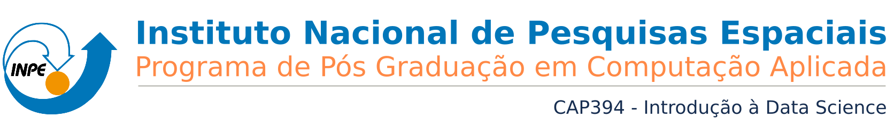

***

<h1> <p align="center"> Spatial-temporal differences in cloud cover of satellite observations across the Brazilian Amazon rainforest</p> </h1>
<p align="center"> Willian Vieira de Oliveira </p>


<p align="right"> [ Part 2 - Basic processing and statistics of the data ] </p>

### SUMMARY

1. [**About**](#About)
1. [**The Data**](#TheData)
    1. [Raw data](#RawData)
    1. [Processed data](#ProcessedData)
    1. [Additional data](#AdditionalData)
1. [**Questions about the data**](#Questions)
1. [**Basic processing of the data**](./2_Basic_processing.md#BasicProc)
1. [**Statistics**](./2_Basic_processing.md#Stats)
1. [**Exploratory Data Analysis**](./3_EDA.md#EDA)
1. [**Results**](./4_Results_and_Conclusion.md#Results)
1. [**Conclusion**](./4_Results_and_Conclusion.md#Conclusion)
***

<a id='BasicProc'></a>
## 4. Basic processing of the data

### Reading and tidying up the metadata file


```python
from matplotlib import pyplot as plt
import geopandas as gpd
```


```python
filename = 'Output/Metadata/Metadata_L8_S2.csv'

try:
    metadata = gpd.read_file(filename, encoding='utf-8')
    print("The file was read!")
except Exception as e:
    print(str(e))
```

    The file was read!
    

To be concluded...


```python

```

***
<a id='Stats'></a>
## 5. Statistics

To be concluded...


```python

```

[<p align="left"> **<< Previous notebook** </p>](./1_Project.md)

[<p align="right"> **Next notebook >>** </p>](./3_EDA.md)

***
## References

[1] Rene Beuchle , Hugh D. Eva , Hans-Jürgen Stibig , Catherine Bodart , Andreas Brink , Philippe Mayaux , Desiree Johansson , Frederic Achard & Alan Belward (2011) A satellite data set for tropical forest area change assessment, **International Journal of Remote Sensing**, 32:22, 7009-7031, DOI: 10.1080/01431161.2011.611186

[2] Sano E E, Ferreira L G, Asner G P et al., 2007. Spatial and temporal probabilities of obtaining cloud-free Landsat
images over the Brazilian tropical savanna. **International Journal of Remote Sensing**, 28(12): 2739–2752.

[3] Lima, T.A., Beuchle, R., Langner, A., Grecchi, R.C., Griess, V.C., & Achard, F. (2019). Comparing Sentinel-2 MSI and Landsat 8 OLI Imagery for Monitoring Selective Logging in the Brazilian Amazon. **Remote Sensing**, 11, 961.

[4] Young O.R., Onoda M. (2017) **Satellite Earth Observations in Environmental Problem-Solving**. In: Onoda M., Young O. (eds) Satellite Earth Observations and Their Impact on Society and Policy. Springer, Singapore, DOI: 10.1080/01431161.2011.611186
