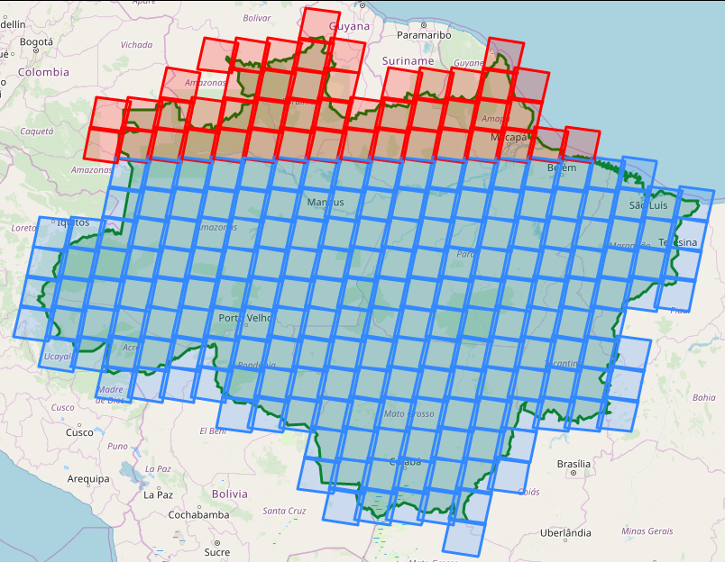
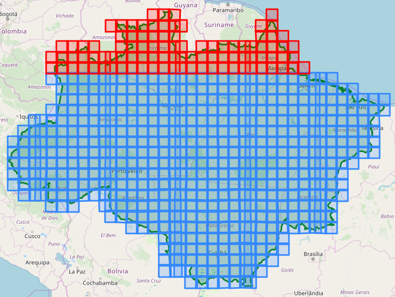

***

<h1> <p align="center"> Spatial-temporal differences in cloud cover of satellite observations across the Brazilian Amazon rainforest</p> </h1>
<p align="center"> Willian Vieira de Oliveira </p>


<p align="right"> [ Part 3 - Exploratory Data Analysis ] </p>

### SUMMARY

1. [**About**](./1_Project.md#About)
1. [**The Data**](./1_Project.md#TheData)
    1. [Raw data](./1_Project.md#RawData)
    1. [Processed data](./1_Project.md#ProcessedData)
    1. [Additional data](./1_Project.md#AdditionalData)
1. [**Questions about the data**](./1_Project.md#Questions)
1. [**Basic processing of the data**](./2_Basic_processing.md#BasicProc)
1. [**Statistics**](./2_Basic_processing.md#Stats)
1. [**Exploratory Data Analysis**](./3_EDA.md#EDA)
1. [**Results**](./4_Results_and_Conclusion.md#Results)
1. [**Conclusion**](./4_Results_and_Conclusion.md#Conclusion)
***

<a id='EDA'></a>
## 6. Exploratory Data Analysis


```python
filename = 'Output/Metadata/Metadata_L8_S2_tidy.csv'

try:
    raw_data = pd.read_csv(filename, encoding='utf-8')
    print("The file was read!")
except Exception as e:
    print(str(e))
```

    The file was read!
    

### Analysis of the Landsat-8 grids (path/row) that intersect the area of study


```python
import numpy as np
import pandas as pd
import geopandas as gpd
import folium
import os, shutil
from glob import glob
import imgkit
```


```python
# Auxiliary data
# List of all landsat-8 paths and rows
wrs = gpd.GeoDataFrame.from_file('Data/wrs2/wrs2.shp')

wrs.head(10)
```


<div>
<style scoped>
    .dataframe tbody tr th:only-of-type {
        vertical-align: middle;
    }

    .dataframe tbody tr th {
        vertical-align: top;
    }

    .dataframe thead th {
        text-align: right;
    }
</style>
<table border="1" class="dataframe">
  <thead>
    <tr style="text-align: right;">
      <th></th>
      <th>PR_ID</th>
      <th>PATH</th>
      <th>ROW</th>
      <th>MODE</th>
      <th>WEST</th>
      <th>EAST</th>
      <th>SOUTH</th>
      <th>NORTH</th>
      <th>geometry</th>
    </tr>
  </thead>
  <tbody>
    <tr>
      <th>0</th>
      <td>1</td>
      <td>1</td>
      <td>1</td>
      <td>D</td>
      <td>-3.6745</td>
      <td>9.5667</td>
      <td>79.6888</td>
      <td>81.8555</td>
      <td>POLYGON ((7.737374983151664 80.9888, 9.56671 8...</td>
    </tr>
    <tr>
      <th>1</th>
      <td>2</td>
      <td>1</td>
      <td>2</td>
      <td>D</td>
      <td>-10.7752</td>
      <td>1.9275</td>
      <td>78.9112</td>
      <td>81.1340</td>
      <td>POLYGON ((-10.70176281728041 80.18680241918837...</td>
    </tr>
    <tr>
      <th>2</th>
      <td>3</td>
      <td>1</td>
      <td>3</td>
      <td>D</td>
      <td>-16.6563</td>
      <td>-4.7688</td>
      <td>78.0110</td>
      <td>80.2529</td>
      <td>POLYGON ((-5.501291292099153 79.12261447018395...</td>
    </tr>
    <tr>
      <th>3</th>
      <td>4</td>
      <td>1</td>
      <td>4</td>
      <td>D</td>
      <td>-21.5265</td>
      <td>-10.5518</td>
      <td>77.0135</td>
      <td>79.2513</td>
      <td>POLYGON ((-18.12735185913917 77.46093710574092...</td>
    </tr>
    <tr>
      <th>4</th>
      <td>5</td>
      <td>1</td>
      <td>5</td>
      <td>D</td>
      <td>-25.5839</td>
      <td>-15.5133</td>
      <td>75.9394</td>
      <td>78.1597</td>
      <td>POLYGON ((-25.57135833693951 76.93656686536796...</td>
    </tr>
    <tr>
      <th>5</th>
      <td>6</td>
      <td>1</td>
      <td>6</td>
      <td>D</td>
      <td>-28.9948</td>
      <td>-19.7671</td>
      <td>74.8049</td>
      <td>77.0006</td>
      <td>POLYGON ((-28.98426286879677 75.72469936212626...</td>
    </tr>
    <tr>
      <th>6</th>
      <td>7</td>
      <td>1</td>
      <td>7</td>
      <td>D</td>
      <td>-31.8920</td>
      <td>-23.4259</td>
      <td>73.6225</td>
      <td>75.7905</td>
      <td>POLYGON ((-30.22221834467266 74.19892154025511...</td>
    </tr>
    <tr>
      <th>7</th>
      <td>8</td>
      <td>1</td>
      <td>8</td>
      <td>D</td>
      <td>-34.3789</td>
      <td>-26.5895</td>
      <td>72.4017</td>
      <td>74.5414</td>
      <td>POLYGON ((-26.82133122817676 73.5819522998444,...</td>
    </tr>
    <tr>
      <th>8</th>
      <td>9</td>
      <td>1</td>
      <td>9</td>
      <td>D</td>
      <td>-36.5359</td>
      <td>-29.3432</td>
      <td>71.1499</td>
      <td>73.2618</td>
      <td>POLYGON ((-36.48398005837918 71.92117369507797...</td>
    </tr>
    <tr>
      <th>9</th>
      <td>10</td>
      <td>1</td>
      <td>10</td>
      <td>D</td>
      <td>-38.4250</td>
      <td>-31.7570</td>
      <td>69.8729</td>
      <td>71.9583</td>
      <td>POLYGON ((-38.42023584542212 70.5653549828656,...</td>
    </tr>
  </tbody>
</table>
</div>


```python
# Definition of the area of interest
BR_Amazon_Estates = gpd.read_file('Data/Amazonia_Legal/UFS_AMZLEG_LLWGS84.shp', encoding='utf-8')
bounding_box_AM = BR_Amazon_Estates.unary_union
```


```python
# Now, we can check which Polygons of the WRS-2 system intersects the area of interest.

wrs_intersection = wrs[wrs.intersects(bounding_box_AM)]
paths, rows = wrs_intersection['PATH'].values, wrs_intersection['ROW'].values

print("There are ", paths.size, " WRS grids that intersects the study area")
```

    There are  234  WRS grids that intersects the study area
    

#### Nothern and Southern hemisphere

The Landsat framing is uniform for each orbit. The adjacent east-west scenes have scene center locations at the same nominal latitude. A notation of Row numbers can, therefore, be applied to identify all scenes occurring at the same latitude. 

Row 060 corresponds to latitude 0 (equator). Row 059 is immediately north of this.

Read more: https://landsat.gsfc.nasa.gov/the-worldwide-reference-system/


```python
# Empty arrays to store the identification of the grids located in each hemisphere
L8_N_grids_Path_Row = np.empty((0,2), str)
L8_S_grids_Path_Row = np.empty((0,2), str)

# Get the center of the map
xy = np.asarray(bounding_box_AM.centroid.xy).squeeze()
center = list(xy[::-1])

# Select a zoom
zoom = 5

# Create the most basic OSM folium map
m = folium.Map(location=center, zoom_start=zoom, control_scale=True)

# Add the bounds GeoDataFrame in red
m.add_child(folium.GeoJson(bounding_box_AM.__geo_interface__, name='Area of Study', 
                           style_function=lambda x: {'color': 'green', 'alpha': 0}))

# Iterate through each Polygon of paths and rows intersecting the area
for i, row in wrs_intersection.iterrows():
    # Create a string for the name containing the path and row of this Polygon
    name = 'path: %03d, row: %03d' % (row.PATH, row.ROW)
    
    # Create the folium geometry of this Polygon 
    if (row.ROW <= 60 and row.MODE == 'D'): # Northern hemisphere
        L8_N_grids_Path_Row = np.append(L8_N_grids_Path_Row, np.array([[row.PATH,row.ROW]]), axis=0)
        g = folium.GeoJson(row.geometry.__geo_interface__, name=name, style_function=lambda y: {'color': 'red'})
    else: # Southern hemisphere
        L8_S_grids_Path_Row = np.append(L8_S_grids_Path_Row, np.array([[row.PATH,row.ROW]]), axis=0)
        g = folium.GeoJson(row.geometry.__geo_interface__, name=name)#, style_function=lambda y: {'color': 'blue'})
    # Add a folium Popup object with the name string
    g.add_child(folium.Popup(name))
    # Add the object to the map
    g.add_to(m)

folium.LayerControl().add_to(m)
m.save('Data/wrs2/wrs.html')
#m
```

Github can not render folium maps. Therefore, it was necessary to save the result as an image to include on Github.
<p align="center"></p>


```python
print("Number of Landsat-8 grids that cover the Brazilian Amazon:")
print("    Northern hemisphere: ", len(L8_N_grids_Path_Row), " grids.", "\n    Southern hemisphere: ", len(L8_S_grids_Path_Row), " grids.")

```

    Number of Landsat-8 grids that cover the Brazilian Amazon:
        Northern hemisphere:  47  grids. 
        Southern hemisphere:  187  grids.
    

### Analysis of the Sentinel-2 grids (path/row) that intersect the area of study


```python
import numpy as np
import pandas as pd
import geopandas as gpd
import folium
import os, shutil
from glob import glob
```


```python
# Auxiliary data
# List of all Sentinel-2 tiles
S2_zones = gpd.GeoDataFrame.from_file('Data/Sentinel2_granule_zones/sentinel2_tiles_world.shp')

S2_zones.head(10)
```


<div>
<style scoped>
    .dataframe tbody tr th:only-of-type {
        vertical-align: middle;
    }

    .dataframe tbody tr th {
        vertical-align: top;
    }

    .dataframe thead th {
        text-align: right;
    }
</style>
<table border="1" class="dataframe">
  <thead>
    <tr style="text-align: right;">
      <th></th>
      <th>Name</th>
      <th>geometry</th>
    </tr>
  </thead>
  <tbody>
    <tr>
      <th>0</th>
      <td>01CCV</td>
      <td>POLYGON Z ((180.0000000000001 -73.059737407999...</td>
    </tr>
    <tr>
      <th>1</th>
      <td>01CCV</td>
      <td>POLYGON Z ((-180 -72.07333117899998 0, -179.62...</td>
    </tr>
    <tr>
      <th>2</th>
      <td>01CDH</td>
      <td>POLYGON Z ((180.0000000000001 -83.808545835999...</td>
    </tr>
    <tr>
      <th>3</th>
      <td>01CDH</td>
      <td>POLYGON Z ((-180 -82.82590260499995 0, -176.29...</td>
    </tr>
    <tr>
      <th>4</th>
      <td>01CDJ</td>
      <td>POLYGON Z ((180.0000000000001 -82.913439054999...</td>
    </tr>
    <tr>
      <th>5</th>
      <td>01CDJ</td>
      <td>POLYGON Z ((-180 -81.93056465699993 0, -176.37...</td>
    </tr>
    <tr>
      <th>6</th>
      <td>01CDK</td>
      <td>POLYGON Z ((180.0000000000001 -82.018655909999...</td>
    </tr>
    <tr>
      <th>7</th>
      <td>01CDK</td>
      <td>POLYGON Z ((-180 -81.03560602299996 0, -176.43...</td>
    </tr>
    <tr>
      <th>8</th>
      <td>01CDL</td>
      <td>POLYGON Z ((180.0000000000001 -81.123174027999...</td>
    </tr>
    <tr>
      <th>9</th>
      <td>01CDL</td>
      <td>POLYGON Z ((-180 -80.13998199399998 0, -176.48...</td>
    </tr>
  </tbody>
</table>
</div>


```python
# Definition of the area of interest
BR_Amazon_Estates = gpd.read_file('Data/Amazonia_Legal/UFS_AMZLEG_LLWGS84.shp', encoding='utf-8')
bounding_box_AM = BR_Amazon_Estates.unary_union
```


```python
# Now, we can check which Polygons of the WRS-2 system intersects the area of interest.

S2_zones_intersection = S2_zones[S2_zones.intersects(bounding_box_AM)]
tiles = S2_zones_intersection['Name'].values

print("There are ", tiles.size, " granule zones that intersects the study area")
```

    There are  629  granule zones that intersects the study area
    

#### Nothern and Southern hemisphere

The first three characters of the tile name refer to UTM zone. The last of these characters can be used to identify the hemisphere of the tile. In case the letter comes before the letter 'N' in the alphabetical order (A, B, ..., M), the tile is in the Southern hemisphere. Otherwise, the tile is in the Northern hemisphere.


```python
# Empty arrays to store the identification of the grids located in each hemisphere
S2_N_tiles = np.empty((0,1), str)
S2_S_tiles = np.empty((0,1), str)

# Get the center of the map
xy = np.asarray(bounding_box_AM.centroid.xy).squeeze()
center = list(xy[::-1])

# Select a zoom
zoom = 5

# Create the most basic OSM folium map
m = folium.Map(location=center, zoom_start=zoom, control_scale=True)

# Add the bounds GeoDataFrame in red
m.add_child(folium.GeoJson(bounding_box_AM.__geo_interface__, name='Area of Study', 
                           style_function=lambda x: {'color': 'green', 'alpha': 0}))

# Iterate through each Polygon of paths and rows intersecting the area
for i, tile in S2_zones_intersection.iterrows():
    # Create a string for the name containing the path and row of this Polygon
    name = 'tile: %s' % (tile.Name)
    # Create the folium geometry of this Polygon 
    zone = tile.Name[2]
    if (zone.capitalize() >= 'N'): # northern hemisphere
        S2_N_tiles = np.append(S2_N_tiles, np.array([[tile.Name]]), axis=0)
        g = folium.GeoJson(tile.geometry.__geo_interface__, name=name, style_function=lambda y: {'color': 'red'})
    else: # southern hemisphere
        S2_S_tiles = np.append(S2_S_tiles, np.array([[tile.Name]]), axis=0)
        g = folium.GeoJson(tile.geometry.__geo_interface__, name=name)#, style_function=lambda y: {'color': 'blue'})
        
    # Add a folium Popup object with the name string
    g.add_child(folium.Popup(name))
    # Add the object to the map
    g.add_to(m)

folium.LayerControl().add_to(m)
m.save('Data/Sentinel2_granule_zones/tiles.html')
#m
```

Github can not render folium maps. Therefore, it was necessary to save the result as an image to include on Github.
<p align="center"></p>


```python
print("Number of Sentinel-2 grids that cover the Brazilian Amazon:")
print("    Northern hemisphere: ", len(S2_N_tiles), " grids.", "\n    Southern hemisphere: ", len(S2_S_tiles), " grids.")
```

    Number of Sentinel-2 grids that cover the Brazilian Amazon:
        Northern hemisphere:  95  grids. 
        Southern hemisphere:  534  grids.
    

##### Analysis of the cloud cover data

To be concluded...


```python

```

[<p align="left"> **<< Previous notebook** </p>](./2_Basic_processing.md)

[<p align="right"> **Next notebook >>** </p>](./4_Results_and_Conclusion.md)

***
## References

[1] Rene Beuchle , Hugh D. Eva , Hans-Jürgen Stibig , Catherine Bodart , Andreas Brink , Philippe Mayaux , Desiree Johansson , Frederic Achard & Alan Belward (2011) A satellite data set for tropical forest area change assessment, **International Journal of Remote Sensing**, 32:22, 7009-7031, DOI: 10.1080/01431161.2011.611186

[2] Sano E E, Ferreira L G, Asner G P et al., 2007. Spatial and temporal probabilities of obtaining cloud-free Landsat
images over the Brazilian tropical savanna. **International Journal of Remote Sensing**, 28(12): 2739–2752.

[3] Lima, T.A., Beuchle, R., Langner, A., Grecchi, R.C., Griess, V.C., & Achard, F. (2019). Comparing Sentinel-2 MSI and Landsat 8 OLI Imagery for Monitoring Selective Logging in the Brazilian Amazon. **Remote Sensing**, 11, 961.

[4] Young O.R., Onoda M. (2017) **Satellite Earth Observations in Environmental Problem-Solving**. In: Onoda M., Young O. (eds) Satellite Earth Observations and Their Impact on Society and Policy. Springer, Singapore, DOI: 10.1080/01431161.2011.611186
