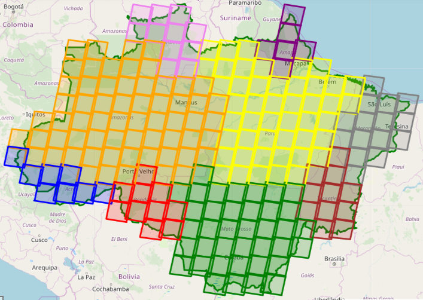
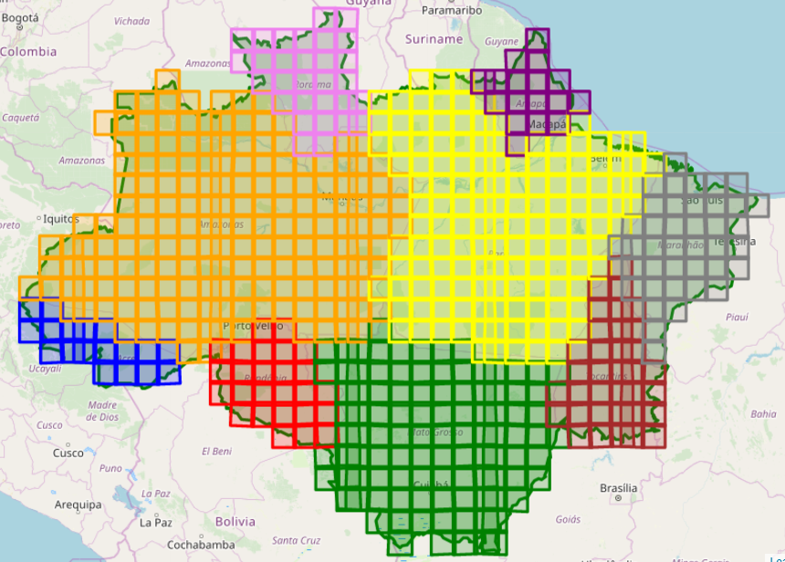
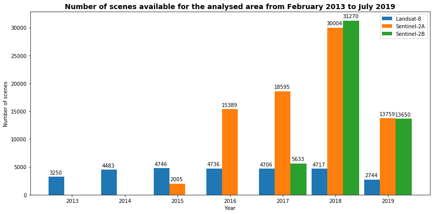
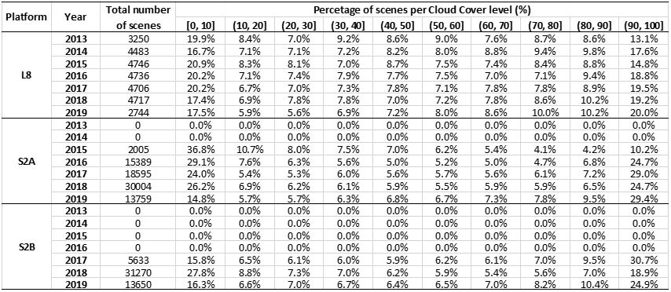
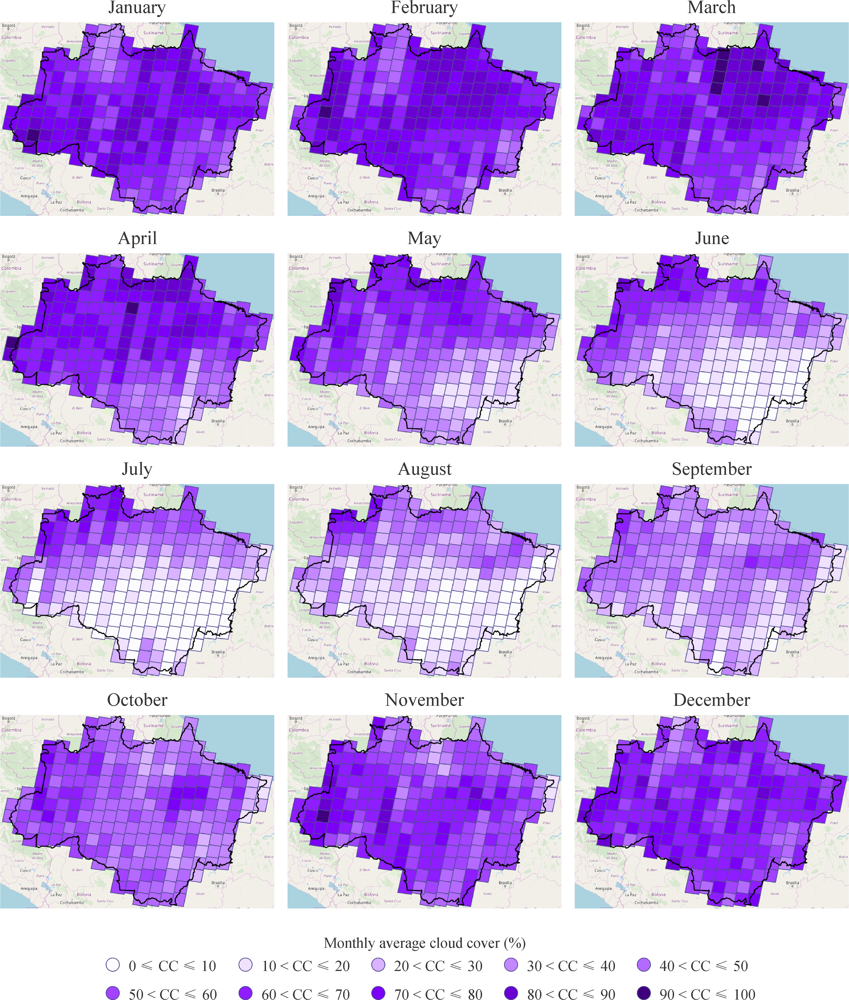
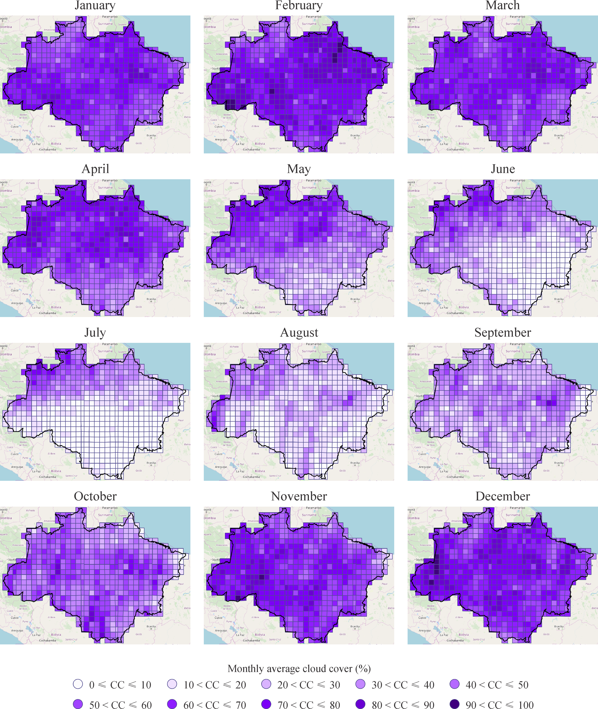

***

<h1> <p align="center"> Spatial-temporal differences in cloud cover of satellite observations across the Brazilian Amazon</p> </h1>
<p align="center"> Willian Vieira de Oliveira </p>


<p align="right"> [ Part 3 - Exploratory Data Analysis ] </p>

### SUMMARY

1. [**About**](./1_Project.md#About)
1. [**The Data**](./1_Project.md#TheData)
    1. [Raw data](./1_Project.md#RawData)
    1. [Processed data](./1_Project.md#ProcessedData)
    1. [Additional data](./1_Project.md#AdditionalData)
1. [**Questions about the data**](./1_Project.md#Questions)
1. [**Basic processing of the data**](./2_Basic_processing.md#BasicProc)
1. [**Statistics**](./2_Basic_processing.md#Stats)
1. [**Exploratory Data Analysis**](./3_EDA.md#EDA)
1. [**Results**](./4_Results_and_Conclusion.md#Results)
1. [**Conclusion**](./4_Results_and_Conclusion.md#Conclusion)
***

<a id='EDA'></a>
## 6. Exploratory Data Analysis


```python
import numpy as np
import pandas as pd
import geopandas as gpd
import folium
import os, shutil
from glob import glob
```

### Analysis of the Landsat-8 grids (path/row) that intersect the area of interest

At this moment, we consider all grids that intersect the area do study, regardless of the percentage of intersection. For that reason, the following analysis might include grids that present most of their area outside the area of study.


```python
# Auxiliary data
# List of all landsat-8 paths and rows
wrs = gpd.GeoDataFrame.from_file('Data/wrs2/wrs2.shp')

wrs.head(10)
```


<div>

<table border="1" class="dataframe">
  <thead>
    <tr style="text-align: right;">
      <th></th>
      <th>PR_ID</th>
      <th>PATH</th>
      <th>ROW</th>
      <th>MODE</th>
      <th>WEST</th>
      <th>EAST</th>
      <th>SOUTH</th>
      <th>NORTH</th>
      <th>geometry</th>
    </tr>
  </thead>
  <tbody>
    <tr>
      <th>0</th>
      <td>1</td>
      <td>1</td>
      <td>1</td>
      <td>D</td>
      <td>-3.6745</td>
      <td>9.5667</td>
      <td>79.6888</td>
      <td>81.8555</td>
      <td>POLYGON ((7.737374983151664 80.9888, 9.56671 8...</td>
    </tr>
    <tr>
      <th>1</th>
      <td>2</td>
      <td>1</td>
      <td>2</td>
      <td>D</td>
      <td>-10.7752</td>
      <td>1.9275</td>
      <td>78.9112</td>
      <td>81.1340</td>
      <td>POLYGON ((-10.70176281728041 80.18680241918837...</td>
    </tr>
    <tr>
      <th>2</th>
      <td>3</td>
      <td>1</td>
      <td>3</td>
      <td>D</td>
      <td>-16.6563</td>
      <td>-4.7688</td>
      <td>78.0110</td>
      <td>80.2529</td>
      <td>POLYGON ((-5.501291292099153 79.12261447018395...</td>
    </tr>
    <tr>
      <th>3</th>
      <td>4</td>
      <td>1</td>
      <td>4</td>
      <td>D</td>
      <td>-21.5265</td>
      <td>-10.5518</td>
      <td>77.0135</td>
      <td>79.2513</td>
      <td>POLYGON ((-18.12735185913917 77.46093710574092...</td>
    </tr>
    <tr>
      <th>4</th>
      <td>5</td>
      <td>1</td>
      <td>5</td>
      <td>D</td>
      <td>-25.5839</td>
      <td>-15.5133</td>
      <td>75.9394</td>
      <td>78.1597</td>
      <td>POLYGON ((-25.57135833693951 76.93656686536796...</td>
    </tr>
    <tr>
      <th>5</th>
      <td>6</td>
      <td>1</td>
      <td>6</td>
      <td>D</td>
      <td>-28.9948</td>
      <td>-19.7671</td>
      <td>74.8049</td>
      <td>77.0006</td>
      <td>POLYGON ((-28.98426286879677 75.72469936212626...</td>
    </tr>
    <tr>
      <th>6</th>
      <td>7</td>
      <td>1</td>
      <td>7</td>
      <td>D</td>
      <td>-31.8920</td>
      <td>-23.4259</td>
      <td>73.6225</td>
      <td>75.7905</td>
      <td>POLYGON ((-30.22221834467266 74.19892154025511...</td>
    </tr>
    <tr>
      <th>7</th>
      <td>8</td>
      <td>1</td>
      <td>8</td>
      <td>D</td>
      <td>-34.3789</td>
      <td>-26.5895</td>
      <td>72.4017</td>
      <td>74.5414</td>
      <td>POLYGON ((-26.82133122817676 73.5819522998444,...</td>
    </tr>
    <tr>
      <th>8</th>
      <td>9</td>
      <td>1</td>
      <td>9</td>
      <td>D</td>
      <td>-36.5359</td>
      <td>-29.3432</td>
      <td>71.1499</td>
      <td>73.2618</td>
      <td>POLYGON ((-36.48398005837918 71.92117369507797...</td>
    </tr>
    <tr>
      <th>9</th>
      <td>10</td>
      <td>1</td>
      <td>10</td>
      <td>D</td>
      <td>-38.4250</td>
      <td>-31.7570</td>
      <td>69.8729</td>
      <td>71.9583</td>
      <td>POLYGON ((-38.42023584542212 70.5653549828656,...</td>
    </tr>
  </tbody>
</table>
</div>


```python
# Definition of the area of interest
BR_Amazon_Estates = gpd.read_file('Data/Amazonia_Legal/UFS_AMZLEG_LLWGS84.shp', encoding='utf-8')
bounding_box_AM = BR_Amazon_Estates.unary_union
```

#### Question 1a: How many Landsat-8 scenes intersect the Brazilian Amazon?


```python
# We can check which Polygons of the WRS-2 system intersects the area of interest.

wrs_intersection = wrs[wrs.intersects(bounding_box_AM)]
paths, rows = wrs_intersection['PATH'].values, wrs_intersection['ROW'].values

print("There are ", paths.size, " WRS grids that intersect the study area")
```

    There are  234  WRS grids that intersect the study area
    

#### Nothern and Southern hemisphere

The Landsat framing is uniform for each orbit. The adjacent east-west scenes have scene center locations at the same nominal latitude. A notation of Row numbers can, therefore, be applied to identify all scenes occurring at the same latitude. 

Row 060 corresponds to latitude 0 (equator). Row 059 is immediately north of this.

Read more: https://landsat.gsfc.nasa.gov/the-worldwide-reference-system/


```python
# Empty arrays to store the identification of the grids located in each hemisphere
L8_N_grids_Path_Row = np.empty((0,2), str)
L8_S_grids_Path_Row = np.empty((0,2), str)

# Get the center of the map
xy = np.asarray(bounding_box_AM.centroid.xy).squeeze()
center = list(xy[::-1])

# Select a zoom
zoom = 5

# Create the most basic OSM folium map
m = folium.Map(location=center, zoom_start=zoom, control_scale=True)

# Add the bounds GeoDataFrame in red
m.add_child(folium.GeoJson(bounding_box_AM.__geo_interface__, name='Area of Study', 
                           style_function=lambda x: {'color': 'green', 'alpha': 0}))

# Iterate through each Polygon of paths and rows intersecting the area
for i, row in wrs_intersection.iterrows():
    # Create a string for the name containing the path and row of this Polygon
    name = 'path: %03d, row: %03d' % (row.PATH, row.ROW)
    
    # Create the folium geometry of this Polygon 
    if (row.ROW <= 60 and row.MODE == 'D'): # Northern hemisphere
        L8_N_grids_Path_Row = np.append(L8_N_grids_Path_Row, np.array([[row.PATH,row.ROW]]), axis=0)
        g = folium.GeoJson(row.geometry.__geo_interface__, name=name, style_function=lambda y: {'color': 'red'})
    else: # Southern hemisphere
        L8_S_grids_Path_Row = np.append(L8_S_grids_Path_Row, np.array([[row.PATH,row.ROW]]), axis=0)
        g = folium.GeoJson(row.geometry.__geo_interface__, name=name)#, style_function=lambda y: {'color': 'blue'})
    # Add a folium Popup object with the name string
    g.add_child(folium.Popup(name))
    # Add the object to the map
    g.add_to(m)

folium.LayerControl().add_to(m)
#m.save('Data/wrs2/wrs.html')
#m
```


    <folium.map.LayerControl at 0xa05fbf8b00>


Github can not render folium maps. Therefore, it was necessary to save the result as an image to include on Github.
<p align="center"></p>


```python
print("Number of Landsat-8 grids that cover the Brazilian Amazon:")
print("    Northern hemisphere: ", len(L8_N_grids_Path_Row), " grids.", "\n    Southern hemisphere: ", len(L8_S_grids_Path_Row), " grids.")

```

    Number of Landsat-8 grids that cover the Brazilian Amazon:
        Northern hemisphere:  47  grids. 
        Southern hemisphere:  187  grids.
    

### Analysis of the Sentinel-2 grids (path/row) that intersect the area of interest


```python
# Auxiliary data
# List of all Sentinel-2 tiles
S2_zones = gpd.GeoDataFrame.from_file('Data/Sentinel2_granule_zones/sentinel2_tiles_world.shp')

S2_zones.head(10)
```


<div>

<table border="1" class="dataframe">
  <thead>
    <tr style="text-align: right;">
      <th></th>
      <th>Name</th>
      <th>geometry</th>
    </tr>
  </thead>
  <tbody>
    <tr>
      <th>0</th>
      <td>01CCV</td>
      <td>POLYGON Z ((180.0000000000001 -73.059737407999...</td>
    </tr>
    <tr>
      <th>1</th>
      <td>01CCV</td>
      <td>POLYGON Z ((-180 -72.07333117899998 0, -179.62...</td>
    </tr>
    <tr>
      <th>2</th>
      <td>01CDH</td>
      <td>POLYGON Z ((180.0000000000001 -83.808545835999...</td>
    </tr>
    <tr>
      <th>3</th>
      <td>01CDH</td>
      <td>POLYGON Z ((-180 -82.82590260499995 0, -176.29...</td>
    </tr>
    <tr>
      <th>4</th>
      <td>01CDJ</td>
      <td>POLYGON Z ((180.0000000000001 -82.913439054999...</td>
    </tr>
    <tr>
      <th>5</th>
      <td>01CDJ</td>
      <td>POLYGON Z ((-180 -81.93056465699993 0, -176.37...</td>
    </tr>
    <tr>
      <th>6</th>
      <td>01CDK</td>
      <td>POLYGON Z ((180.0000000000001 -82.018655909999...</td>
    </tr>
    <tr>
      <th>7</th>
      <td>01CDK</td>
      <td>POLYGON Z ((-180 -81.03560602299996 0, -176.43...</td>
    </tr>
    <tr>
      <th>8</th>
      <td>01CDL</td>
      <td>POLYGON Z ((180.0000000000001 -81.123174027999...</td>
    </tr>
    <tr>
      <th>9</th>
      <td>01CDL</td>
      <td>POLYGON Z ((-180 -80.13998199399998 0, -176.48...</td>
    </tr>
  </tbody>
</table>
</div>


#### Question 1b: How many Sentinel-2 scenes intersect the Brazilian Amazon?


```python
# We can check which Polygons of the WRS-2 system intersects the area of interest.

S2_zones_intersection = S2_zones[S2_zones.intersects(bounding_box_AM)]
tiles = S2_zones_intersection['Name'].values

print("There are ", tiles.size, " granule zones that intersect the study area")
```

    There are  629  granule zones that intersect the study area
    

#### Nothern and Southern hemisphere

The first three characters of the tile name refer to UTM zone. The last of these characters can be used to identify the hemisphere of the tile. In case the letter comes before the letter 'N' in the alphabetical order (A, B, ..., M), the tile is in the Southern hemisphere. Otherwise, the tile is in the Northern hemisphere.


```python
# Empty arrays to store the identification of the grids located in each hemisphere
S2_N_tiles = np.empty((0,1), str)
S2_S_tiles = np.empty((0,1), str)

# Get the center of the map
xy = np.asarray(bounding_box_AM.centroid.xy).squeeze()
center = list(xy[::-1])

# Select a zoom
zoom = 5

# Create the most basic OSM folium map
m = folium.Map(location=center, zoom_start=zoom, control_scale=True)

# Add the bounds GeoDataFrame in red
m.add_child(folium.GeoJson(bounding_box_AM.__geo_interface__, name='Area of Study', 
                           style_function=lambda x: {'color': 'green', 'alpha': 0}))

# Iterate through each Polygon of paths and rows intersecting the area
for i, tile in S2_zones_intersection.iterrows():
    # Create a string for the name containing the path and row of this Polygon
    name = 'tile: %s' % (tile.Name)
    # Create the folium geometry of this Polygon 
    zone = tile.Name[2]
    if (zone.capitalize() >= 'N'): # northern hemisphere
        S2_N_tiles = np.append(S2_N_tiles, np.array([[tile.Name]]), axis=0)
        g = folium.GeoJson(tile.geometry.__geo_interface__, name=name, style_function=lambda y: {'color': 'red'})
    else: # southern hemisphere
        S2_S_tiles = np.append(S2_S_tiles, np.array([[tile.Name]]), axis=0)
        g = folium.GeoJson(tile.geometry.__geo_interface__, name=name)#, style_function=lambda y: {'color': 'blue'})
        
    # Add a folium Popup object with the name string
    g.add_child(folium.Popup(name))
    # Add the object to the map
    g.add_to(m)

folium.LayerControl().add_to(m)
#m.save('Data/Sentinel2_granule_zones/tiles.html')
#m
```


    <folium.map.LayerControl at 0xa05aa7bac8>


Github can not render folium maps. Therefore, it was necessary to save the result as an image to include on Github.
<p align="center"></p>


```python
print("Number of Sentinel-2 grids that cover the Brazilian Amazon:")
print("    Northern hemisphere: ", len(S2_N_tiles), " grids.", "\n    Southern hemisphere: ", len(S2_S_tiles), " grids.")
```

    Number of Sentinel-2 grids that cover the Brazilian Amazon:
        Northern hemisphere:  95  grids. 
        Southern hemisphere:  534  grids.
    

#### Question 2: How many Landsat-8 and Sentinel-2 grids intersect each Brazilian state?

Description of the shapefile that contains the boundaries of the Brazilian states that intersect the Brazilian Amazon:


```python
BR_Amazon_Estates
```

    The history saving thread hit an unexpected error (OperationalError('disk I/O error')).History will not be written to the database.
    


<div>

<table border="1" class="dataframe">
  <thead>
    <tr style="text-align: right;">
      <th></th>
      <th>SPRAREA</th>
      <th>SPRPERIMET</th>
      <th>SPRROTULO</th>
      <th>SPRNOME</th>
      <th>MSLINK</th>
      <th>MAPID</th>
      <th>CODIGO</th>
      <th>AREA_1</th>
      <th>PERIMETRO_</th>
      <th>GEOCODIGO</th>
      <th>NOME</th>
      <th>AREA_TOT_G</th>
      <th>objeid_88</th>
      <th>geometry</th>
    </tr>
  </thead>
  <tbody>
    <tr>
      <th>0</th>
      <td>2.404023e+11</td>
      <td>3.463076e+06</td>
      <td>1</td>
      <td>1</td>
      <td>1.0</td>
      <td>99.0</td>
      <td>11</td>
      <td>237576.167</td>
      <td>3441.37404</td>
      <td>11</td>
      <td>b'Rond\xf4nia'</td>
      <td>237576.167</td>
      <td>0</td>
      <td>POLYGON ((-60.70872435793023 -13.6933369594173...</td>
    </tr>
    <tr>
      <th>1</th>
      <td>1.588525e+11</td>
      <td>2.712820e+06</td>
      <td>2</td>
      <td>2</td>
      <td>2.0</td>
      <td>99.0</td>
      <td>12</td>
      <td>152581.388</td>
      <td>2670.32865</td>
      <td>12</td>
      <td>ACRE</td>
      <td>152581.388</td>
      <td>1</td>
      <td>POLYGON ((-66.80690861022219 -9.81492014010332...</td>
    </tr>
    <tr>
      <th>2</th>
      <td>1.429297e+11</td>
      <td>2.381854e+06</td>
      <td>20</td>
      <td>20</td>
      <td>20.0</td>
      <td>99.0</td>
      <td>16</td>
      <td>142814.585</td>
      <td>2380.76564</td>
      <td>16</td>
      <td>b'AMAP\xc1'</td>
      <td>142814.585</td>
      <td>19</td>
      <td>POLYGON ((-54.87266013107782 2.433385649611453...</td>
    </tr>
    <tr>
      <th>3</th>
      <td>1.601832e+12</td>
      <td>8.217087e+06</td>
      <td>3</td>
      <td>3</td>
      <td>3.0</td>
      <td>99.0</td>
      <td>13</td>
      <td>1570745.680</td>
      <td>8133.83971</td>
      <td>13</td>
      <td>AMAZONAS</td>
      <td>1570745.680</td>
      <td>2</td>
      <td>POLYGON ((-73.8034252650382 -7.112006890477168...</td>
    </tr>
    <tr>
      <th>4</th>
      <td>2.789995e+11</td>
      <td>4.022957e+06</td>
      <td>21</td>
      <td>21</td>
      <td>21.0</td>
      <td>99.0</td>
      <td>17</td>
      <td>277620.914</td>
      <td>4011.78300</td>
      <td>17</td>
      <td>TOCANTINS</td>
      <td>277620.914</td>
      <td>20</td>
      <td>POLYGON ((-50.22519403920089 -9.84157763020462...</td>
    </tr>
    <tr>
      <th>5</th>
      <td>3.353462e+11</td>
      <td>5.521029e+06</td>
      <td>23</td>
      <td>23</td>
      <td>23.0</td>
      <td>99.0</td>
      <td>21</td>
      <td>331430.739</td>
      <td>5487.32162</td>
      <td>21</td>
      <td>b'MARANH\xc3O'</td>
      <td>331983.293</td>
      <td>22</td>
      <td>POLYGON ((-48.75552863774982 -5.34957275673850...</td>
    </tr>
    <tr>
      <th>6</th>
      <td>9.048834e+11</td>
      <td>5.822618e+06</td>
      <td>225</td>
      <td>225</td>
      <td>225.0</td>
      <td>99.0</td>
      <td>51</td>
      <td>903357.715</td>
      <td>5815.15259</td>
      <td>51</td>
      <td>MATO GROSSO</td>
      <td>903357.715</td>
      <td>223</td>
      <td>POLYGON ((-61.58341167071828 -8.79909488810787...</td>
    </tr>
    <tr>
      <th>7</th>
      <td>2.262320e+11</td>
      <td>3.564371e+06</td>
      <td>4</td>
      <td>4</td>
      <td>4.0</td>
      <td>99.0</td>
      <td>14</td>
      <td>224298.980</td>
      <td>3548.01904</td>
      <td>14</td>
      <td>RORAIMA</td>
      <td>224298.980</td>
      <td>3</td>
      <td>POLYGON ((-63.37277878441854 2.211372310513946...</td>
    </tr>
    <tr>
      <th>8</th>
      <td>1.249560e+12</td>
      <td>7.453945e+06</td>
      <td>5</td>
      <td>5</td>
      <td>5.0</td>
      <td>99.0</td>
      <td>15</td>
      <td>1247659.325</td>
      <td>7440.29108</td>
      <td>15</td>
      <td>b'PAR\xc1'</td>
      <td>1247689.515</td>
      <td>4</td>
      <td>POLYGON ((-58.89592617252967 1.227324906244945...</td>
    </tr>
  </tbody>
</table>
</div>


First, we create a list containing the geocode and name of all states described in the shapefile. Then, we use this list to extract the boundaries of each state and identify the number of scenes that intersects each one of them.


```python
# list of the geocode and name of all the 9 states
states_geocodes = list([BR_Amazon_Estates.CODIGO, BR_Amazon_Estates.NOME])
```


```python
print("Number of Landsat-8 and Sentinel-2 grids that intersect each Brazilian state. Obs.: Note that states that intersect more than one state are counted more than once.")

for code, name in zip(states_geocodes[0], states_geocodes[1]):    
    # Some names need to be decoded
    try:
        name = name.decode("utf-8", "replace")
    except:
        pass
        
    bounding_box_state = BR_Amazon_Estates[BR_Amazon_Estates["GEOCODIGO"]==code].unary_union
    #BR_Amazon_Estates[BR_Amazon_Estates["GEOCODIGO"]==code].plot()
    
    # OLI sensor
    # We can check which Polygons of the WRS-2 system intersects each state
    wrs_intersection = wrs[wrs.intersects(bounding_box_state)]
    paths, rows = wrs_intersection['PATH'].values, wrs_intersection['ROW'].values
    
    # MSI sensor
    S2_zones_intersection = S2_zones[S2_zones.intersects(bounding_box_state)]
    tiles = S2_zones_intersection['Name'].values
    print("There are ", paths.size, " WRS grids and ", tiles.size, " Sentinel-2 zones that intersect the Brazilian state of ", name)
```

    Number of Landsat-8 and Sentinel-2 grids that intersect each Brazilian state. Obs.: Note that states that intersect more than one state are counted more than once.
    There are  20  WRS grids and  41  Sentinel-2 zones that intersect the Brazilian state of  Rond�nia
    There are  16  WRS grids and  33  Sentinel-2 zones that intersect the Brazilian state of  ACRE
    There are  14  WRS grids and  32  Sentinel-2 zones that intersect the Brazilian state of  AMAP�
    There are  83  WRS grids and  210  Sentinel-2 zones that intersect the Brazilian state of  AMAZONAS
    There are  22  WRS grids and  51  Sentinel-2 zones that intersect the Brazilian state of  TOCANTINS
    There are  24  WRS grids and  58  Sentinel-2 zones that intersect the Brazilian state of  MARANH�O
    There are  53  WRS grids and  131  Sentinel-2 zones that intersect the Brazilian state of  MATO GROSSO
    There are  21  WRS grids and  40  Sentinel-2 zones that intersect the Brazilian state of  RORAIMA
    There are  67  WRS grids and  168  Sentinel-2 zones that intersect the Brazilian state of  PAR�
    

<b>Observation: </b>The previous analysis considers all grids that intersect the area do study, regardless of the percentage of intersection. Now, we select and analyse only grids that present at least 15% of their area over the area of study.

We created three new dataframes. The 'df_grid_perState' dataframe scores the count of grids that intersect each state, while the 'df_wrs' and 'df_S2_zones' dataframes include the information of which state each grid covers the most. 


```python
area_threshold = 15
```


```python
df_grid_perState = gpd.GeoDataFrame()
df_grid_perState['GEOCODIGO'] = BR_Amazon_Estates.GEOCODIGO
df_grid_perState['NOME'] = BR_Amazon_Estates.NOME
df_grid_perState['geometry'] = BR_Amazon_Estates.geometry
df_grid_perState['Number_L8_grids'] = 0
df_grid_perState['Number_S2_grids'] = 0

wrs_intersection = wrs[wrs.intersects(bounding_box_AM)]

df_wrs = gpd.GeoDataFrame()
df_wrs['PATH'] = wrs_intersection.PATH
df_wrs['ROW'] = wrs_intersection.ROW
df_wrs['geometry'] = wrs_intersection.geometry
df_wrs['STATE'] = "None"
df_wrs['STATE_GEOCODE'] = "None"

S2_zones_intersection = S2_zones[S2_zones.intersects(bounding_box_AM)]

df_S2_zones = gpd.GeoDataFrame()
df_S2_zones['NAME'] = S2_zones_intersection.Name
df_S2_zones['geometry'] = S2_zones_intersection.geometry
df_S2_zones['STATE'] = "None"
df_S2_zones['STATE_GEOCODE'] = "None"
```

First, we analyse only the Landsat-8 data.


```python
# Get the center of the map
xy = np.asarray(bounding_box_AM.centroid.xy).squeeze()
center = list(xy[::-1])

# Select a zoom
zoom = 5
 
# Create the most basic OSM folium map
m = folium.Map(location=center, zoom_start=zoom, control_scale=True)

# Add the bounds GeoDataFrame in red
m.add_child(folium.GeoJson(bounding_box_AM.__geo_interface__, name='Area of Study', 
                           style_function=lambda x: {'color': 'green', 'alpha': 0}))

bounding_box_state = BR_Amazon_Estates.unary_union

wrs_intersection = wrs[wrs.intersects(bounding_box_state)]

# Iterate through each Polygon of paths and rows intersecting the area
for i, row in wrs_intersection.iterrows():
    estado_pertence = 0
    estado_pertence_perc = 0.0
    for code in states_geocodes[0]:
        estado = BR_Amazon_Estates[BR_Amazon_Estates["GEOCODIGO"]==code]
        area_intersecao = estado.intersection(row.geometry).area.item()
        perc = area_intersecao/row.geometry.area * 100
        
        if (perc > estado_pertence_perc):
            estado_pertence = str(code)
            estado_pertence_perc = perc
    
    if (estado_pertence_perc >= area_threshold): # At least 15% of the grid must cover the analysed in order
                                            # to be considered in this analysis
        # Create a string to save the path and row of this Polygon    
        name = 'path: %03d, row: %03d, perc. no estado: %f' % (row.PATH, row.ROW, estado_pertence_perc)

        # Create the folium geometry of this Polygon 
        if (estado_pertence == "11"): # Rondônia
            df_grid_perState.loc[df_grid_perState.GEOCODIGO == "11", 'Number_L8_grids']+=1
            df_wrs.loc[(df_wrs.PATH == row.PATH) & (df_wrs.ROW == row.ROW), 'STATE'] = "RO"
            df_wrs.loc[(df_wrs.PATH == row.PATH) & (df_wrs.ROW == row.ROW), 'STATE_GEOCODE'] = "11"
            g = folium.GeoJson(row.geometry.__geo_interface__, name=name, style_function=lambda y: {'color': 'red'})
        elif (estado_pertence == "12"): # Acre
            df_grid_perState.loc[df_grid_perState.GEOCODIGO == "12", 'Number_L8_grids']+=1
            df_wrs.loc[(df_wrs.PATH == row.PATH) & (df_wrs.ROW == row.ROW), 'STATE'] = "AC"
            df_wrs.loc[(df_wrs.PATH == row.PATH) & (df_wrs.ROW == row.ROW), 'STATE_GEOCODE'] = "12"
            g = folium.GeoJson(row.geometry.__geo_interface__, name=name, style_function=lambda y: {'color': 'blue'})
        elif (estado_pertence == "13"): # Amazonas
            df_grid_perState.loc[df_grid_perState.GEOCODIGO == "13", 'Number_L8_grids']+=1
            df_wrs.loc[(df_wrs.PATH == row.PATH) & (df_wrs.ROW == row.ROW), 'STATE'] = "AM"
            df_wrs.loc[(df_wrs.PATH == row.PATH) & (df_wrs.ROW == row.ROW), 'STATE_GEOCODE'] = "13"
            g = folium.GeoJson(row.geometry.__geo_interface__, name=name, style_function=lambda y: {'color': 'orange'})
        elif (estado_pertence == "14"): # Roraima
            df_grid_perState.loc[df_grid_perState.GEOCODIGO == "14", 'Number_L8_grids']+=1            
            df_wrs.loc[(df_wrs.PATH == row.PATH) & (df_wrs.ROW == row.ROW), 'STATE'] = "RR"
            df_wrs.loc[(df_wrs.PATH == row.PATH) & (df_wrs.ROW == row.ROW), 'STATE_GEOCODE'] = "14"
            g = folium.GeoJson(row.geometry.__geo_interface__, name=name, style_function=lambda y: {'color': 'violet'})
        elif (estado_pertence == "15"): # Para
            df_grid_perState.loc[df_grid_perState.GEOCODIGO == "15", 'Number_L8_grids']+=1
            df_wrs.loc[(df_wrs.PATH == row.PATH) & (df_wrs.ROW == row.ROW), 'STATE'] = "PA"
            df_wrs.loc[(df_wrs.PATH == row.PATH) & (df_wrs.ROW == row.ROW), 'STATE_GEOCODE'] = "15"
            g = folium.GeoJson(row.geometry.__geo_interface__, name=name, style_function=lambda y: {'color': 'yellow'})
        elif (estado_pertence == "16"): # Amapa
            df_grid_perState.loc[df_grid_perState.GEOCODIGO == "16", 'Number_L8_grids']+=1
            df_wrs.loc[(df_wrs.PATH == row.PATH) & (df_wrs.ROW == row.ROW), 'STATE'] = "AM"
            df_wrs.loc[(df_wrs.PATH == row.PATH) & (df_wrs.ROW == row.ROW), 'STATE_GEOCODE'] = "16"
            g = folium.GeoJson(row.geometry.__geo_interface__, name=name, style_function=lambda y: {'color': 'purple'})
        elif (estado_pertence == "17"): # Tocantins
            df_grid_perState.loc[df_grid_perState.GEOCODIGO == "17", 'Number_L8_grids']+=1
            df_wrs.loc[(df_wrs.PATH == row.PATH) & (df_wrs.ROW == row.ROW), 'STATE'] = "TO"
            df_wrs.loc[(df_wrs.PATH == row.PATH) & (df_wrs.ROW == row.ROW), 'STATE_GEOCODE'] = "17"
            g = folium.GeoJson(row.geometry.__geo_interface__, name=name, style_function=lambda y: {'color': 'brown'})
        elif (estado_pertence == "21"): # Maranhão
            df_grid_perState.loc[df_grid_perState.GEOCODIGO == "21", 'Number_L8_grids']+=1
            df_wrs.loc[(df_wrs.PATH == row.PATH) & (df_wrs.ROW == row.ROW), 'STATE'] = "MA"
            df_wrs.loc[(df_wrs.PATH == row.PATH) & (df_wrs.ROW == row.ROW), 'STATE_GEOCODE'] = "21"
            g = folium.GeoJson(row.geometry.__geo_interface__, name=name, style_function=lambda y: {'color': 'gray'})
        elif (estado_pertence == "51"): # Mato Grosso
            df_grid_perState.loc[df_grid_perState.GEOCODIGO == "51", 'Number_L8_grids']+=1
            df_wrs.loc[(df_wrs.PATH == row.PATH) & (df_wrs.ROW == row.ROW), 'STATE'] = "MT"
            df_wrs.loc[(df_wrs.PATH == row.PATH) & (df_wrs.ROW == row.ROW), 'STATE_GEOCODE'] = "51"
            g = folium.GeoJson(row.geometry.__geo_interface__, name=name, style_function=lambda y: {'color': 'green'})
        else: # Apenas por garantia, provavelmente não será necessário. 
            g = folium.GeoJson(row.geometry.__geo_interface__, name=name, style_function=lambda y: {'color': 'black'})

        # Add a folium Popup object with the name string
        g.add_child(folium.Popup(name))
        # Add the object to the map
        g.add_to(m)

folium.LayerControl().add_to(m)
#m.save('Output/L8_Grids_perState.html')
#m
```


    <folium.map.LayerControl at 0xa06351b6d8>


Github can not render folium maps. Therefore, it was necessary to save the result as an image to include on Github. You can also use the 'wrs_perState.html' file to analyse this result.
<p align="center"></p>


```python
df_grid_perState
```


<div>

<table border="1" class="dataframe">
  <thead>
    <tr style="text-align: right;">
      <th></th>
      <th>GEOCODIGO</th>
      <th>NOME</th>
      <th>geometry</th>
      <th>Number_L8_grids</th>
      <th>Number_S2_grids</th>
    </tr>
  </thead>
  <tbody>
    <tr>
      <th>0</th>
      <td>11</td>
      <td>b'Rond\xf4nia'</td>
      <td>POLYGON ((-60.70872435793023 -13.6933369594173...</td>
      <td>10</td>
      <td>0</td>
    </tr>
    <tr>
      <th>1</th>
      <td>12</td>
      <td>ACRE</td>
      <td>POLYGON ((-66.80690861022219 -9.81492014010332...</td>
      <td>8</td>
      <td>0</td>
    </tr>
    <tr>
      <th>2</th>
      <td>16</td>
      <td>b'AMAP\xc1'</td>
      <td>POLYGON ((-54.87266013107782 2.433385649611453...</td>
      <td>6</td>
      <td>0</td>
    </tr>
    <tr>
      <th>3</th>
      <td>13</td>
      <td>AMAZONAS</td>
      <td>POLYGON ((-73.8034252650382 -7.112006890477168...</td>
      <td>62</td>
      <td>0</td>
    </tr>
    <tr>
      <th>4</th>
      <td>17</td>
      <td>TOCANTINS</td>
      <td>POLYGON ((-50.22519403920089 -9.84157763020462...</td>
      <td>11</td>
      <td>0</td>
    </tr>
    <tr>
      <th>5</th>
      <td>21</td>
      <td>b'MARANH\xc3O'</td>
      <td>POLYGON ((-48.75552863774982 -5.34957275673850...</td>
      <td>15</td>
      <td>0</td>
    </tr>
    <tr>
      <th>6</th>
      <td>51</td>
      <td>MATO GROSSO</td>
      <td>POLYGON ((-61.58341167071828 -8.79909488810787...</td>
      <td>38</td>
      <td>0</td>
    </tr>
    <tr>
      <th>7</th>
      <td>14</td>
      <td>RORAIMA</td>
      <td>POLYGON ((-63.37277878441854 2.211372310513946...</td>
      <td>11</td>
      <td>0</td>
    </tr>
    <tr>
      <th>8</th>
      <td>15</td>
      <td>b'PAR\xc1'</td>
      <td>POLYGON ((-58.89592617252967 1.227324906244945...</td>
      <td>47</td>
      <td>0</td>
    </tr>
  </tbody>
</table>
</div>


In addition, the 'df_wrs' dataframe describes which Brazilian state each grid covers (at least most of their area). This dataframe also identifies which grids do not present the minimum coverage area required in this study.


```python
df_wrs.head(20)
```


<div>

<table border="1" class="dataframe">
  <thead>
    <tr style="text-align: right;">
      <th></th>
      <th>PATH</th>
      <th>ROW</th>
      <th>geometry</th>
      <th>STATE</th>
      <th>STATE_GEOCODE</th>
    </tr>
  </thead>
  <tbody>
    <tr>
      <th>56</th>
      <td>1</td>
      <td>57</td>
      <td>POLYGON ((-62.69021422502469 4.98028206634571,...</td>
      <td>RR</td>
      <td>14</td>
    </tr>
    <tr>
      <th>57</th>
      <td>1</td>
      <td>58</td>
      <td>POLYGON ((-63.32440246063994 2.01260035744379,...</td>
      <td>RR</td>
      <td>14</td>
    </tr>
    <tr>
      <th>58</th>
      <td>1</td>
      <td>59</td>
      <td>POLYGON ((-63.32440246063994 2.01260035744379,...</td>
      <td>AM</td>
      <td>13</td>
    </tr>
    <tr>
      <th>59</th>
      <td>1</td>
      <td>60</td>
      <td>POLYGON ((-63.61713228359266 0.636073644560817...</td>
      <td>AM</td>
      <td>13</td>
    </tr>
    <tr>
      <th>60</th>
      <td>1</td>
      <td>61</td>
      <td>POLYGON ((-63.92293223992832 -0.80513531657767...</td>
      <td>AM</td>
      <td>13</td>
    </tr>
    <tr>
      <th>61</th>
      <td>1</td>
      <td>62</td>
      <td>POLYGON ((-64.22954292592541 -2.25170376438412...</td>
      <td>AM</td>
      <td>13</td>
    </tr>
    <tr>
      <th>62</th>
      <td>1</td>
      <td>63</td>
      <td>POLYGON ((-64.53595683711796 -3.69831174359904...</td>
      <td>AM</td>
      <td>13</td>
    </tr>
    <tr>
      <th>63</th>
      <td>1</td>
      <td>64</td>
      <td>POLYGON ((-65.14952878906843 -6.59136581792295...</td>
      <td>AM</td>
      <td>13</td>
    </tr>
    <tr>
      <th>64</th>
      <td>1</td>
      <td>65</td>
      <td>POLYGON ((-67.12151252704504 -7.8154398765744,...</td>
      <td>AM</td>
      <td>13</td>
    </tr>
    <tr>
      <th>65</th>
      <td>1</td>
      <td>66</td>
      <td>POLYGON ((-65.76574325020484 -9.48391371776759...</td>
      <td>AM</td>
      <td>13</td>
    </tr>
    <tr>
      <th>66</th>
      <td>1</td>
      <td>67</td>
      <td>POLYGON ((-67.76077272731082 -10.7395476767596...</td>
      <td>AC</td>
      <td>12</td>
    </tr>
    <tr>
      <th>67</th>
      <td>1</td>
      <td>68</td>
      <td>POLYGON ((-66.3868067454264 -12.37559902021067...</td>
      <td>None</td>
      <td>None</td>
    </tr>
    <tr>
      <th>180</th>
      <td>2</td>
      <td>57</td>
      <td>POLYGON ((-64.25140814694619 4.905061183431392...</td>
      <td>None</td>
      <td>None</td>
    </tr>
    <tr>
      <th>182</th>
      <td>2</td>
      <td>59</td>
      <td>POLYGON ((-65.17706476990446 0.566169408979251...</td>
      <td>None</td>
      <td>None</td>
    </tr>
    <tr>
      <th>183</th>
      <td>2</td>
      <td>60</td>
      <td>POLYGON ((-65.17706476990446 0.566169408979251...</td>
      <td>AM</td>
      <td>13</td>
    </tr>
    <tr>
      <th>184</th>
      <td>2</td>
      <td>61</td>
      <td>POLYGON ((-65.790544287841 -2.326973566667828,...</td>
      <td>AM</td>
      <td>13</td>
    </tr>
    <tr>
      <th>185</th>
      <td>2</td>
      <td>62</td>
      <td>POLYGON ((-65.790544287841 -2.326973566667828,...</td>
      <td>AM</td>
      <td>13</td>
    </tr>
    <tr>
      <th>186</th>
      <td>2</td>
      <td>63</td>
      <td>POLYGON ((-66.40356548233339 -5.22012048755396...</td>
      <td>AM</td>
      <td>13</td>
    </tr>
    <tr>
      <th>187</th>
      <td>2</td>
      <td>64</td>
      <td>POLYGON ((-66.71059821718762 -6.66659573317328...</td>
      <td>AM</td>
      <td>13</td>
    </tr>
    <tr>
      <th>188</th>
      <td>2</td>
      <td>65</td>
      <td>POLYGON ((-67.01825995297074 -8.11297129118655...</td>
      <td>AM</td>
      <td>13</td>
    </tr>
  </tbody>
</table>
</div>


```python
a = df_wrs[df_wrs.STATE_GEOCODE == "None"]

print("There are ", len(a), " WRS grids that do not present at least ", area_threshold,"% of their area covering the area of interest.")
```

    There are  26  WRS grids that do not present at least  15 % of their area covering the area of interest.
    

***
Now, we repeat the above procedures for the Sentinel-2 data.


```python
# Get the center of the map
xy = np.asarray(bounding_box_AM.centroid.xy).squeeze()
center = list(xy[::-1])

# Select a zoom
zoom = 5

# Create the most basic OSM folium map
m = folium.Map(location=center, zoom_start=zoom, control_scale=True)

# Add the bounds GeoDataFrame in red
m.add_child(folium.GeoJson(bounding_box_AM.__geo_interface__, name='Area of Study', 
                           style_function=lambda x: {'color': 'green', 'alpha': 0}))

bounding_box_state = BR_Amazon_Estates.unary_union

S2_zones_intersection = S2_zones[S2_zones.intersects(bounding_box_state)]

# Iterate through each Polygon intersecting the area
for i, tile in S2_zones_intersection.iterrows():
    estado_pertence = 0
    estado_pertence_perc = 0.0
    for code in states_geocodes[0]:
        estado = BR_Amazon_Estates[BR_Amazon_Estates["GEOCODIGO"]==code]
        area_intersecao = estado.intersection(tile.geometry).area.item()
        perc = area_intersecao/tile.geometry.area * 100

        if (perc > estado_pertence_perc):
            estado_pertence = str(code)
            estado_pertence_perc = perc
    if (estado_pertence_perc >= area_threshold): # At least 15% of the grid must cover the analysed area in order
                                            # to be considered in this analysis
        # Create a string for the name containing the name of this Polygon
        name = 'tile: %s, perc. no estado: %f' % (tile.Name, estado_pertence_perc) 
        
        # Create the folium geometry of this Polygon 
        if (estado_pertence == "11"): # Rondônia
            df_grid_perState.loc[df_grid_perState.GEOCODIGO == "11", 'Number_S2_grids']+=1
            df_S2_zones.loc[(df_S2_zones.NAME == tile.Name), 'STATE'] = "RO"
            df_S2_zones.loc[(df_S2_zones.NAME == tile.Name), 'STATE_GEOCODE'] = "11"
            g = folium.GeoJson(tile.geometry.__geo_interface__, name=name, style_function=lambda y: {'color': 'red'})
        elif (estado_pertence == "12"): # Acre
            df_grid_perState.loc[df_grid_perState.GEOCODIGO == "12", 'Number_S2_grids']+=1
            df_S2_zones.loc[(df_S2_zones.NAME == tile.Name), 'STATE'] = "AC"
            df_S2_zones.loc[(df_S2_zones.NAME == tile.Name), 'STATE_GEOCODE'] = "12"
            g = folium.GeoJson(tile.geometry.__geo_interface__, name=name, style_function=lambda y: {'color': 'blue'})
        elif (estado_pertence == "13"): # Amazonas
            df_grid_perState.loc[df_grid_perState.GEOCODIGO == "13", 'Number_S2_grids']+=1
            df_S2_zones.loc[(df_S2_zones.NAME == tile.Name), 'STATE'] = "AM"
            df_S2_zones.loc[(df_S2_zones.NAME == tile.Name), 'STATE_GEOCODE'] = "13"
            g = folium.GeoJson(tile.geometry.__geo_interface__, name=name, style_function=lambda y: {'color': 'orange'})
        elif (estado_pertence == "14"): # Roraima
            df_grid_perState.loc[df_grid_perState.GEOCODIGO == "14", 'Number_S2_grids']+=1            
            df_S2_zones.loc[(df_S2_zones.NAME == tile.Name), 'STATE'] = "RR"
            df_S2_zones.loc[(df_S2_zones.NAME == tile.Name), 'STATE_GEOCODE'] = "14"
            g = folium.GeoJson(tile.geometry.__geo_interface__, name=name, style_function=lambda y: {'color': 'violet'})
        elif (estado_pertence == "15"): # Para
            df_grid_perState.loc[df_grid_perState.GEOCODIGO == "15", 'Number_S2_grids']+=1
            df_S2_zones.loc[(df_S2_zones.NAME == tile.Name), 'STATE'] = "PA"
            df_S2_zones.loc[(df_S2_zones.NAME == tile.Name), 'STATE_GEOCODE'] = "15"
            g = folium.GeoJson(tile.geometry.__geo_interface__, name=name, style_function=lambda y: {'color': 'yellow'})
        elif (estado_pertence == "16"): # Amapa
            df_grid_perState.loc[df_grid_perState.GEOCODIGO == "16", 'Number_S2_grids']+=1
            df_S2_zones.loc[(df_S2_zones.NAME == tile.Name), 'STATE'] = "AM"
            df_S2_zones.loc[(df_S2_zones.NAME == tile.Name), 'STATE_GEOCODE'] = "16"
            g = folium.GeoJson(tile.geometry.__geo_interface__, name=name, style_function=lambda y: {'color': 'purple'})
        elif (estado_pertence == "17"): # Tocantins
            df_grid_perState.loc[df_grid_perState.GEOCODIGO == "17", 'Number_S2_grids']+=1
            df_S2_zones.loc[(df_S2_zones.NAME == tile.Name), 'STATE'] = "TO"
            df_S2_zones.loc[(df_S2_zones.NAME == tile.Name), 'STATE_GEOCODE'] = "17"
            g = folium.GeoJson(tile.geometry.__geo_interface__, name=name, style_function=lambda y: {'color': 'brown'})
        elif (estado_pertence == "21"): # Maranhão
            df_grid_perState.loc[df_grid_perState.GEOCODIGO == "21", 'Number_S2_grids']+=1
            df_S2_zones.loc[(df_S2_zones.NAME == tile.Name), 'STATE'] = "MA"
            df_S2_zones.loc[(df_S2_zones.NAME == tile.Name), 'STATE_GEOCODE'] = "21"
            g = folium.GeoJson(tile.geometry.__geo_interface__, name=name, style_function=lambda y: {'color': 'gray'})
        elif (estado_pertence == "51"): # Mato Grosso
            df_grid_perState.loc[df_grid_perState.GEOCODIGO == "51", 'Number_S2_grids']+=1
            df_S2_zones.loc[(df_S2_zones.NAME == tile.Name), 'STATE'] = "MT"
            df_S2_zones.loc[(df_S2_zones.NAME == tile.Name), 'STATE_GEOCODE'] = "51"
            g = folium.GeoJson(tile.geometry.__geo_interface__, name=name, style_function=lambda y: {'color': 'green'})
        else: # Apenas por garantia, provavelmente não será necessário. 
            g = folium.GeoJson(tile.geometry.__geo_interface__, name=name, style_function=lambda y: {'color': 'black'})
        
        # Add a folium Popup object with the name string
        g.add_child(folium.Popup(name))
        # Add the object to the map
        g.add_to(m)
            
folium.LayerControl().add_to(m)
#m.save('Output/S2Tiles_perState.html')
#m
```


    <folium.map.LayerControl at 0xa06351f1d0>


Github can not render folium maps. Therefore, it was necessary to save the result as an image to include on Github. You can also use the 'tiles_perState.html' file to analyse this result.
<p align="center"></p>

#### Answer to question 2: 

The columns 'Number_L8_grids' and 'Number_S2_grids' show the number of Landsat-8 and Sentinel-2 grids that intersect each Brazilian state, respectively.


```python
df_grid_perState
```


<div>

<table border="1" class="dataframe">
  <thead>
    <tr style="text-align: right;">
      <th></th>
      <th>GEOCODIGO</th>
      <th>NOME</th>
      <th>geometry</th>
      <th>Number_L8_grids</th>
      <th>Number_S2_grids</th>
    </tr>
  </thead>
  <tbody>
    <tr>
      <th>0</th>
      <td>11</td>
      <td>b'Rond\xf4nia'</td>
      <td>POLYGON ((-60.70872435793023 -13.6933369594173...</td>
      <td>10</td>
      <td>26</td>
    </tr>
    <tr>
      <th>1</th>
      <td>12</td>
      <td>ACRE</td>
      <td>POLYGON ((-66.80690861022219 -9.81492014010332...</td>
      <td>8</td>
      <td>18</td>
    </tr>
    <tr>
      <th>2</th>
      <td>16</td>
      <td>b'AMAP\xc1'</td>
      <td>POLYGON ((-54.87266013107782 2.433385649611453...</td>
      <td>6</td>
      <td>17</td>
    </tr>
    <tr>
      <th>3</th>
      <td>13</td>
      <td>AMAZONAS</td>
      <td>POLYGON ((-73.8034252650382 -7.112006890477168...</td>
      <td>62</td>
      <td>174</td>
    </tr>
    <tr>
      <th>4</th>
      <td>17</td>
      <td>TOCANTINS</td>
      <td>POLYGON ((-50.22519403920089 -9.84157763020462...</td>
      <td>11</td>
      <td>35</td>
    </tr>
    <tr>
      <th>5</th>
      <td>21</td>
      <td>b'MARANH\xc3O'</td>
      <td>POLYGON ((-48.75552863774982 -5.34957275673850...</td>
      <td>15</td>
      <td>40</td>
    </tr>
    <tr>
      <th>6</th>
      <td>51</td>
      <td>MATO GROSSO</td>
      <td>POLYGON ((-61.58341167071828 -8.79909488810787...</td>
      <td>38</td>
      <td>102</td>
    </tr>
    <tr>
      <th>7</th>
      <td>14</td>
      <td>RORAIMA</td>
      <td>POLYGON ((-63.37277878441854 2.211372310513946...</td>
      <td>11</td>
      <td>30</td>
    </tr>
    <tr>
      <th>8</th>
      <td>15</td>
      <td>b'PAR\xc1'</td>
      <td>POLYGON ((-58.89592617252967 1.227324906244945...</td>
      <td>47</td>
      <td>137</td>
    </tr>
  </tbody>
</table>
</div>


In addition, the 'df_S2_zones' dataframe describes which Brazilian state each grid covers (at least most of their area). This dataframe also identifies which grids do not present the minimum coverage area required in this study.


```python
df_S2_zones.head(629)
```


<div>

<table border="1" class="dataframe">
  <thead>
    <tr style="text-align: right;">
      <th></th>
      <th>NAME</th>
      <th>geometry</th>
      <th>STATE</th>
      <th>STATE_GEOCODE</th>
    </tr>
  </thead>
  <tbody>
    <tr>
      <th>16757</th>
      <td>18LXQ</td>
      <td>POLYGON Z ((-74.09012137699995 -9.045071504999...</td>
      <td>None</td>
      <td>None</td>
    </tr>
    <tr>
      <th>16758</th>
      <td>18LXR</td>
      <td>POLYGON Z ((-74.09227431799997 -8.141019404999...</td>
      <td>AC</td>
      <td>12</td>
    </tr>
    <tr>
      <th>16765</th>
      <td>18LYP</td>
      <td>POLYGON Z ((-73.17606535199997 -9.945892148999...</td>
      <td>None</td>
      <td>None</td>
    </tr>
    <tr>
      <th>16766</th>
      <td>18LYQ</td>
      <td>POLYGON Z ((-73.18084308499994 -9.041687251999...</td>
      <td>AC</td>
      <td>12</td>
    </tr>
    <tr>
      <th>16767</th>
      <td>18LYR</td>
      <td>POLYGON Z ((-73.18514538599999 -8.137978066999...</td>
      <td>AC</td>
      <td>12</td>
    </tr>
    <tr>
      <th>16774</th>
      <td>18LZP</td>
      <td>POLYGON Z ((-72.26433183699999 -9.939678496999...</td>
      <td>None</td>
      <td>None</td>
    </tr>
    <tr>
      <th>16775</th>
      <td>18LZQ</td>
      <td>POLYGON Z ((-72.27149179999998 -9.036048067999...</td>
      <td>AC</td>
      <td>12</td>
    </tr>
    <tr>
      <th>16776</th>
      <td>18LZR</td>
      <td>POLYGON Z ((-72.27793931399998 -8.132910270999...</td>
      <td>AC</td>
      <td>12</td>
    </tr>
    <tr>
      <th>16818</th>
      <td>18MXS</td>
      <td>POLYGON Z ((-74.09419464599995 -7.236383950999...</td>
      <td>AC</td>
      <td>12</td>
    </tr>
    <tr>
      <th>16819</th>
      <td>18MXT</td>
      <td>POLYGON Z ((-74.09588341499995 -6.331712202999...</td>
      <td>AM</td>
      <td>13</td>
    </tr>
    <tr>
      <th>16820</th>
      <td>18MXU</td>
      <td>POLYGON Z ((-74.09734193399999 -5.427551341999...</td>
      <td>None</td>
      <td>None</td>
    </tr>
    <tr>
      <th>16827</th>
      <td>18MYS</td>
      <td>POLYGON Z ((-73.18898285999995 -7.233684263999...</td>
      <td>AC</td>
      <td>12</td>
    </tr>
    <tr>
      <th>16828</th>
      <td>18MYT</td>
      <td>POLYGON Z ((-73.19235760999999 -6.329352865999...</td>
      <td>AM</td>
      <td>13</td>
    </tr>
    <tr>
      <th>16829</th>
      <td>18MYU</td>
      <td>POLYGON Z ((-73.19527224699993 -5.425531019999...</td>
      <td>AM</td>
      <td>13</td>
    </tr>
    <tr>
      <th>16830</th>
      <td>18MYV</td>
      <td>POLYGON Z ((-73.19773390599994 -4.521138360999...</td>
      <td>AM</td>
      <td>13</td>
    </tr>
    <tr>
      <th>16831</th>
      <td>18MZA</td>
      <td>POLYGON Z ((-72.29981700799993 -3.614481509999...</td>
      <td>None</td>
      <td>None</td>
    </tr>
    <tr>
      <th>16836</th>
      <td>18MZS</td>
      <td>POLYGON Z ((-72.28369026099995 -7.229185751999...</td>
      <td>AM</td>
      <td>13</td>
    </tr>
    <tr>
      <th>16837</th>
      <td>18MZT</td>
      <td>POLYGON Z ((-72.28874778199997 -6.325421474999...</td>
      <td>AM</td>
      <td>13</td>
    </tr>
    <tr>
      <th>16838</th>
      <td>18MZU</td>
      <td>POLYGON Z ((-72.29311578199997 -5.422164528999...</td>
      <td>AM</td>
      <td>13</td>
    </tr>
    <tr>
      <th>16839</th>
      <td>18MZV</td>
      <td>POLYGON Z ((-72.29680494099995 -4.518335502999...</td>
      <td>AM</td>
      <td>13</td>
    </tr>
    <tr>
      <th>17665</th>
      <td>19LBJ</td>
      <td>POLYGON Z ((-71.73603265499997 -9.939675515999...</td>
      <td>None</td>
      <td>None</td>
    </tr>
    <tr>
      <th>17666</th>
      <td>19LBK</td>
      <td>POLYGON Z ((-71.72887174199997 -9.036045362999...</td>
      <td>AC</td>
      <td>12</td>
    </tr>
    <tr>
      <th>17667</th>
      <td>19LBL</td>
      <td>POLYGON Z ((-71.72242337099993 -8.132907839999...</td>
      <td>AC</td>
      <td>12</td>
    </tr>
    <tr>
      <th>17673</th>
      <td>19LCH</td>
      <td>POLYGON Z ((-70.82955723299995 -10.85004360999...</td>
      <td>None</td>
      <td>None</td>
    </tr>
    <tr>
      <th>17674</th>
      <td>19LCJ</td>
      <td>POLYGON Z ((-70.82429937999996 -9.945890159999...</td>
      <td>AC</td>
      <td>12</td>
    </tr>
    <tr>
      <th>17675</th>
      <td>19LCK</td>
      <td>POLYGON Z ((-70.81952069299996 -9.041685446999...</td>
      <td>AC</td>
      <td>12</td>
    </tr>
    <tr>
      <th>17676</th>
      <td>19LCL</td>
      <td>POLYGON Z ((-70.81521753299995 -8.137976444999...</td>
      <td>AC</td>
      <td>12</td>
    </tr>
    <tr>
      <th>17682</th>
      <td>19LDH</td>
      <td>POLYGON Z ((-69.91526602599998 -10.85412030299...</td>
      <td>None</td>
      <td>None</td>
    </tr>
    <tr>
      <th>17683</th>
      <td>19LDJ</td>
      <td>POLYGON Z ((-69.91263436399998 -9.949620171999...</td>
      <td>AC</td>
      <td>12</td>
    </tr>
    <tr>
      <th>17684</th>
      <td>19LDK</td>
      <td>POLYGON Z ((-69.91024254299998 -9.045070601999...</td>
      <td>AC</td>
      <td>12</td>
    </tr>
    <tr>
      <th>...</th>
      <td>...</td>
      <td>...</td>
      <td>...</td>
      <td>...</td>
    </tr>
    <tr>
      <th>21520</th>
      <td>23MMM</td>
      <td>POLYGON Z ((-45.90616764599997 -7.236383230999...</td>
      <td>MA</td>
      <td>21</td>
    </tr>
    <tr>
      <th>21521</th>
      <td>23MMN</td>
      <td>POLYGON Z ((-45.90447820099996 -6.331711572999...</td>
      <td>MA</td>
      <td>21</td>
    </tr>
    <tr>
      <th>21522</th>
      <td>23MMP</td>
      <td>POLYGON Z ((-45.90301909899995 -5.427550802999...</td>
      <td>MA</td>
      <td>21</td>
    </tr>
    <tr>
      <th>21523</th>
      <td>23MMQ</td>
      <td>POLYGON Z ((-45.90178676699998 -4.522819979999...</td>
      <td>MA</td>
      <td>21</td>
    </tr>
    <tr>
      <th>21524</th>
      <td>23MMR</td>
      <td>POLYGON Z ((-45.90078061599996 -3.618066326999...</td>
      <td>MA</td>
      <td>21</td>
    </tr>
    <tr>
      <th>21525</th>
      <td>23MMS</td>
      <td>POLYGON Z ((-45.89999980099998 -2.713837142999...</td>
      <td>MA</td>
      <td>21</td>
    </tr>
    <tr>
      <th>21526</th>
      <td>23MMT</td>
      <td>POLYGON Z ((-45.89944241899997 -1.809051473999...</td>
      <td>MA</td>
      <td>21</td>
    </tr>
    <tr>
      <th>21527</th>
      <td>23MMU</td>
      <td>POLYGON Z ((-45.89910831799995 -0.904256642999...</td>
      <td>MA</td>
      <td>21</td>
    </tr>
    <tr>
      <th>21529</th>
      <td>23MNM</td>
      <td>POLYGON Z ((-45.00018116899997 -7.237284699999...</td>
      <td>None</td>
      <td>None</td>
    </tr>
    <tr>
      <th>21530</th>
      <td>23MNN</td>
      <td>POLYGON Z ((-45.00018083099997 -6.332499393999...</td>
      <td>MA</td>
      <td>21</td>
    </tr>
    <tr>
      <th>21531</th>
      <td>23MNP</td>
      <td>POLYGON Z ((-45.00018053899998 -5.428225419999...</td>
      <td>MA</td>
      <td>21</td>
    </tr>
    <tr>
      <th>21532</th>
      <td>23MNQ</td>
      <td>POLYGON Z ((-45.00018029299997 -4.523381647999...</td>
      <td>MA</td>
      <td>21</td>
    </tr>
    <tr>
      <th>21533</th>
      <td>23MNR</td>
      <td>POLYGON Z ((-45.00018009199994 -3.618515314999...</td>
      <td>MA</td>
      <td>21</td>
    </tr>
    <tr>
      <th>21534</th>
      <td>23MNS</td>
      <td>POLYGON Z ((-45.00017993599994 -2.714173730999...</td>
      <td>MA</td>
      <td>21</td>
    </tr>
    <tr>
      <th>21535</th>
      <td>23MNT</td>
      <td>POLYGON Z ((-45.00017982399999 -1.809275754999...</td>
      <td>MA</td>
      <td>21</td>
    </tr>
    <tr>
      <th>21536</th>
      <td>23MNU</td>
      <td>POLYGON Z ((-45.00017975699996 -0.904368722999...</td>
      <td>None</td>
      <td>None</td>
    </tr>
    <tr>
      <th>21539</th>
      <td>23MPN</td>
      <td>POLYGON Z ((-44.09588341499995 -6.331712202999...</td>
      <td>MA</td>
      <td>21</td>
    </tr>
    <tr>
      <th>21540</th>
      <td>23MPP</td>
      <td>POLYGON Z ((-44.09734193399999 -5.427551341999...</td>
      <td>MA</td>
      <td>21</td>
    </tr>
    <tr>
      <th>21541</th>
      <td>23MPQ</td>
      <td>POLYGON Z ((-44.09857377399993 -4.522820428999...</td>
      <td>MA</td>
      <td>21</td>
    </tr>
    <tr>
      <th>21542</th>
      <td>23MPR</td>
      <td>POLYGON Z ((-44.09957952199994 -3.618066685999...</td>
      <td>MA</td>
      <td>21</td>
    </tr>
    <tr>
      <th>21543</th>
      <td>23MPS</td>
      <td>POLYGON Z ((-44.10036002499993 -2.713837411999...</td>
      <td>MA</td>
      <td>21</td>
    </tr>
    <tr>
      <th>21544</th>
      <td>23MPT</td>
      <td>POLYGON Z ((-44.10091718399997 -1.809051652999...</td>
      <td>MA</td>
      <td>21</td>
    </tr>
    <tr>
      <th>21548</th>
      <td>23MQN</td>
      <td>POLYGON Z ((-43.19235760999993 -6.329352865999...</td>
      <td>None</td>
      <td>None</td>
    </tr>
    <tr>
      <th>21549</th>
      <td>23MQP</td>
      <td>POLYGON Z ((-43.19527224699993 -5.425531019999...</td>
      <td>MA</td>
      <td>21</td>
    </tr>
    <tr>
      <th>21550</th>
      <td>23MQQ</td>
      <td>POLYGON Z ((-43.19773390599994 -4.521138360999...</td>
      <td>MA</td>
      <td>21</td>
    </tr>
    <tr>
      <th>21551</th>
      <td>23MQR</td>
      <td>POLYGON Z ((-43.19974375599998 -3.616722068999...</td>
      <td>MA</td>
      <td>21</td>
    </tr>
    <tr>
      <th>21552</th>
      <td>23MQS</td>
      <td>POLYGON Z ((-43.20130348599997 -2.712829405999...</td>
      <td>MA</td>
      <td>21</td>
    </tr>
    <tr>
      <th>21553</th>
      <td>23MQT</td>
      <td>POLYGON Z ((-43.20241689499994 -1.808379981999...</td>
      <td>MA</td>
      <td>21</td>
    </tr>
    <tr>
      <th>21561</th>
      <td>23MRS</td>
      <td>POLYGON Z ((-42.30215450599997 -2.711149745999...</td>
      <td>MA</td>
      <td>21</td>
    </tr>
    <tr>
      <th>21562</th>
      <td>23MRT</td>
      <td>POLYGON Z ((-42.30382312599994 -1.807260761999...</td>
      <td>None</td>
      <td>None</td>
    </tr>
  </tbody>
</table>
<p>629 rows × 4 columns</p>
</div>


```python
a = df_S2_zones[df_S2_zones.STATE_GEOCODE == "None"]

print("There are ", len(a), "granule zones that do not present at least ", area_threshold,"% of their area covering the area of interest.")
```

    There are  50 granule zones that do not present at least  15 % of their area covering the area of interest.
    

## Updates to the dity data


### Loading the tidy data


```python
filename = 'Output/Metadata/Metadata_L8_S2_tidy.csv'

try:
    tidy_data = pd.read_csv(filename, encoding='utf-8')
    print("The file was read!")
except Exception as e:
    print(str(e))
```

    The file was read!
    

Before we started the analysis of the cloud cover data, we included the identification of the Brazilian state related to each row in this dataframe. After this procedure, we also removed rows related to data that were not associated with any Brazilian state (tidy_data.STATE equal to "None").

### Including new data and excluding unnecessary rows


```python
# Creating new columns in the dataframe
tidy_data['STATE'] = "None"
tidy_data['STATE_GEOCODE'] = "None"
```


```python
tidy_data.head(5)
```


<div>

<table border="1" class="dataframe">
  <thead>
    <tr style="text-align: right;">
      <th></th>
      <th>ProductID</th>
      <th>AcquisitionDate</th>
      <th>Platform</th>
      <th>CatalogSystem</th>
      <th>WRSPath</th>
      <th>WRSRow</th>
      <th>TileNumber</th>
      <th>CloudCover</th>
      <th>Datum</th>
      <th>UTMZone</th>
      <th>Hemisphere</th>
      <th>SpatialRes_Pan</th>
      <th>SpatialRes_Refletive</th>
      <th>SpatialRes_Thermal</th>
      <th>STATE</th>
      <th>STATE_GEOCODE</th>
    </tr>
  </thead>
  <tbody>
    <tr>
      <th>0</th>
      <td>LC08_L1GT_228058_20190731_20190731_01_RT</td>
      <td>2019/07/31</td>
      <td>L8</td>
      <td>WRS</td>
      <td>228.0</td>
      <td>58.0</td>
      <td>NaN</td>
      <td>46.82</td>
      <td>WGS84</td>
      <td>21</td>
      <td>N</td>
      <td>15</td>
      <td>30</td>
      <td>30</td>
      <td>None</td>
      <td>None</td>
    </tr>
    <tr>
      <th>1</th>
      <td>LC08_L1TP_228059_20190731_20190731_01_RT</td>
      <td>2019/07/31</td>
      <td>L8</td>
      <td>WRS</td>
      <td>228.0</td>
      <td>59.0</td>
      <td>NaN</td>
      <td>18.89</td>
      <td>WGS84</td>
      <td>21</td>
      <td>N</td>
      <td>15</td>
      <td>30</td>
      <td>30</td>
      <td>None</td>
      <td>None</td>
    </tr>
    <tr>
      <th>2</th>
      <td>LC08_L1TP_228060_20190731_20190731_01_RT</td>
      <td>2019/07/31</td>
      <td>L8</td>
      <td>WRS</td>
      <td>228.0</td>
      <td>60.0</td>
      <td>NaN</td>
      <td>12.86</td>
      <td>WGS84</td>
      <td>21</td>
      <td>N</td>
      <td>15</td>
      <td>30</td>
      <td>30</td>
      <td>None</td>
      <td>None</td>
    </tr>
    <tr>
      <th>3</th>
      <td>LC08_L1TP_228061_20190731_20190731_01_RT</td>
      <td>2019/07/31</td>
      <td>L8</td>
      <td>WRS</td>
      <td>228.0</td>
      <td>61.0</td>
      <td>NaN</td>
      <td>7.67</td>
      <td>WGS84</td>
      <td>21</td>
      <td>S</td>
      <td>15</td>
      <td>30</td>
      <td>30</td>
      <td>None</td>
      <td>None</td>
    </tr>
    <tr>
      <th>4</th>
      <td>LC08_L1TP_228062_20190731_20190731_01_RT</td>
      <td>2019/07/31</td>
      <td>L8</td>
      <td>WRS</td>
      <td>228.0</td>
      <td>62.0</td>
      <td>NaN</td>
      <td>8.10</td>
      <td>WGS84</td>
      <td>21</td>
      <td>S</td>
      <td>15</td>
      <td>30</td>
      <td>30</td>
      <td>None</td>
      <td>None</td>
    </tr>
  </tbody>
</table>
</div>


```python
# Include data to the new columns
#Landsat data
for i, row in df_wrs.iterrows():
    tidy_data.loc[(tidy_data['WRSPath'] == row.PATH) & (tidy_data['WRSRow'] == row.ROW), ['STATE', 'STATE_GEOCODE']] = [row.STATE, row.STATE_GEOCODE]
    
#Sentinel data
for i, tile in df_S2_zones.iterrows():
    tidy_data.loc[(tidy_data['TileNumber'] == tile.NAME), ['STATE', 'STATE_GEOCODE']] = [tile.STATE, tile.STATE_GEOCODE]
```


```python
# Excluding unnecessary information
tidy_data = tidy_data[tidy_data.STATE != "None"]
```


```python
df_wrs = df_wrs[df_wrs.STATE != "None"]
df_S2_zones = df_S2_zones[df_S2_zones.STATE != "None"]
```


```python
tidy_data
```


<div>

<table border="1" class="dataframe">
  <thead>
    <tr style="text-align: right;">
      <th></th>
      <th>ProductID</th>
      <th>AcquisitionDate</th>
      <th>Platform</th>
      <th>CatalogSystem</th>
      <th>WRSPath</th>
      <th>WRSRow</th>
      <th>TileNumber</th>
      <th>CloudCover</th>
      <th>Datum</th>
      <th>UTMZone</th>
      <th>Hemisphere</th>
      <th>SpatialRes_Pan</th>
      <th>SpatialRes_Refletive</th>
      <th>SpatialRes_Thermal</th>
      <th>STATE</th>
      <th>STATE_GEOCODE</th>
    </tr>
  </thead>
  <tbody>
    <tr>
      <th>1</th>
      <td>LC08_L1TP_228059_20190731_20190731_01_RT</td>
      <td>2019/07/31</td>
      <td>L8</td>
      <td>WRS</td>
      <td>228.0</td>
      <td>59.0</td>
      <td>NaN</td>
      <td>18.8900</td>
      <td>WGS84</td>
      <td>21</td>
      <td>N</td>
      <td>15</td>
      <td>30</td>
      <td>30</td>
      <td>PA</td>
      <td>15</td>
    </tr>
    <tr>
      <th>2</th>
      <td>LC08_L1TP_228060_20190731_20190731_01_RT</td>
      <td>2019/07/31</td>
      <td>L8</td>
      <td>WRS</td>
      <td>228.0</td>
      <td>60.0</td>
      <td>NaN</td>
      <td>12.8600</td>
      <td>WGS84</td>
      <td>21</td>
      <td>N</td>
      <td>15</td>
      <td>30</td>
      <td>30</td>
      <td>PA</td>
      <td>15</td>
    </tr>
    <tr>
      <th>3</th>
      <td>LC08_L1TP_228061_20190731_20190731_01_RT</td>
      <td>2019/07/31</td>
      <td>L8</td>
      <td>WRS</td>
      <td>228.0</td>
      <td>61.0</td>
      <td>NaN</td>
      <td>7.6700</td>
      <td>WGS84</td>
      <td>21</td>
      <td>S</td>
      <td>15</td>
      <td>30</td>
      <td>30</td>
      <td>PA</td>
      <td>15</td>
    </tr>
    <tr>
      <th>4</th>
      <td>LC08_L1TP_228062_20190731_20190731_01_RT</td>
      <td>2019/07/31</td>
      <td>L8</td>
      <td>WRS</td>
      <td>228.0</td>
      <td>62.0</td>
      <td>NaN</td>
      <td>8.1000</td>
      <td>WGS84</td>
      <td>21</td>
      <td>S</td>
      <td>15</td>
      <td>30</td>
      <td>30</td>
      <td>PA</td>
      <td>15</td>
    </tr>
    <tr>
      <th>5</th>
      <td>LC08_L1TP_228063_20190731_20190731_01_RT</td>
      <td>2019/07/31</td>
      <td>L8</td>
      <td>WRS</td>
      <td>228.0</td>
      <td>63.0</td>
      <td>NaN</td>
      <td>0.1000</td>
      <td>WGS84</td>
      <td>21</td>
      <td>S</td>
      <td>15</td>
      <td>30</td>
      <td>30</td>
      <td>PA</td>
      <td>15</td>
    </tr>
    <tr>
      <th>6</th>
      <td>LC08_L1TP_228064_20190731_20190731_01_RT</td>
      <td>2019/07/31</td>
      <td>L8</td>
      <td>WRS</td>
      <td>228.0</td>
      <td>64.0</td>
      <td>NaN</td>
      <td>0.0000</td>
      <td>WGS84</td>
      <td>21</td>
      <td>S</td>
      <td>15</td>
      <td>30</td>
      <td>30</td>
      <td>PA</td>
      <td>15</td>
    </tr>
    <tr>
      <th>7</th>
      <td>LC08_L1TP_228065_20190731_20190731_01_RT</td>
      <td>2019/07/31</td>
      <td>L8</td>
      <td>WRS</td>
      <td>228.0</td>
      <td>65.0</td>
      <td>NaN</td>
      <td>0.8000</td>
      <td>WGS84</td>
      <td>21</td>
      <td>S</td>
      <td>15</td>
      <td>30</td>
      <td>30</td>
      <td>PA</td>
      <td>15</td>
    </tr>
    <tr>
      <th>8</th>
      <td>LC08_L1TP_228066_20190731_20190731_01_RT</td>
      <td>2019/07/31</td>
      <td>L8</td>
      <td>WRS</td>
      <td>228.0</td>
      <td>66.0</td>
      <td>NaN</td>
      <td>3.9400</td>
      <td>WGS84</td>
      <td>21</td>
      <td>S</td>
      <td>15</td>
      <td>30</td>
      <td>30</td>
      <td>PA</td>
      <td>15</td>
    </tr>
    <tr>
      <th>9</th>
      <td>LC08_L1TP_228067_20190731_20190731_01_RT</td>
      <td>2019/07/31</td>
      <td>L8</td>
      <td>WRS</td>
      <td>228.0</td>
      <td>67.0</td>
      <td>NaN</td>
      <td>9.8300</td>
      <td>WGS84</td>
      <td>21</td>
      <td>S</td>
      <td>15</td>
      <td>30</td>
      <td>30</td>
      <td>MT</td>
      <td>51</td>
    </tr>
    <tr>
      <th>10</th>
      <td>LC08_L1TP_228068_20190731_20190731_01_RT</td>
      <td>2019/07/31</td>
      <td>L8</td>
      <td>WRS</td>
      <td>228.0</td>
      <td>68.0</td>
      <td>NaN</td>
      <td>0.9800</td>
      <td>WGS84</td>
      <td>21</td>
      <td>S</td>
      <td>15</td>
      <td>30</td>
      <td>30</td>
      <td>MT</td>
      <td>51</td>
    </tr>
    <tr>
      <th>11</th>
      <td>LC08_L1TP_228069_20190731_20190731_01_RT</td>
      <td>2019/07/31</td>
      <td>L8</td>
      <td>WRS</td>
      <td>228.0</td>
      <td>69.0</td>
      <td>NaN</td>
      <td>0.7900</td>
      <td>WGS84</td>
      <td>21</td>
      <td>S</td>
      <td>15</td>
      <td>30</td>
      <td>30</td>
      <td>MT</td>
      <td>51</td>
    </tr>
    <tr>
      <th>12</th>
      <td>LC08_L1TP_228070_20190731_20190731_01_RT</td>
      <td>2019/07/31</td>
      <td>L8</td>
      <td>WRS</td>
      <td>228.0</td>
      <td>70.0</td>
      <td>NaN</td>
      <td>0.1000</td>
      <td>WGS84</td>
      <td>21</td>
      <td>S</td>
      <td>15</td>
      <td>30</td>
      <td>30</td>
      <td>MT</td>
      <td>51</td>
    </tr>
    <tr>
      <th>13</th>
      <td>LC08_L1TP_228071_20190731_20190731_01_RT</td>
      <td>2019/07/31</td>
      <td>L8</td>
      <td>WRS</td>
      <td>228.0</td>
      <td>71.0</td>
      <td>NaN</td>
      <td>0.1700</td>
      <td>WGS84</td>
      <td>21</td>
      <td>S</td>
      <td>15</td>
      <td>30</td>
      <td>30</td>
      <td>MT</td>
      <td>51</td>
    </tr>
    <tr>
      <th>16</th>
      <td>LC08_L1TP_004059_20190730_20190730_01_RT</td>
      <td>2019/07/30</td>
      <td>L8</td>
      <td>WRS</td>
      <td>4.0</td>
      <td>59.0</td>
      <td>NaN</td>
      <td>54.7200</td>
      <td>WGS84</td>
      <td>19</td>
      <td>N</td>
      <td>15</td>
      <td>30</td>
      <td>30</td>
      <td>AM</td>
      <td>13</td>
    </tr>
    <tr>
      <th>17</th>
      <td>LC08_L1TP_004060_20190730_20190730_01_RT</td>
      <td>2019/07/30</td>
      <td>L8</td>
      <td>WRS</td>
      <td>4.0</td>
      <td>60.0</td>
      <td>NaN</td>
      <td>79.8400</td>
      <td>WGS84</td>
      <td>19</td>
      <td>N</td>
      <td>15</td>
      <td>30</td>
      <td>30</td>
      <td>AM</td>
      <td>13</td>
    </tr>
    <tr>
      <th>18</th>
      <td>LC08_L1GT_004061_20190730_20190730_01_RT</td>
      <td>2019/07/30</td>
      <td>L8</td>
      <td>WRS</td>
      <td>4.0</td>
      <td>61.0</td>
      <td>NaN</td>
      <td>84.4400</td>
      <td>WGS84</td>
      <td>19</td>
      <td>S</td>
      <td>15</td>
      <td>30</td>
      <td>30</td>
      <td>AM</td>
      <td>13</td>
    </tr>
    <tr>
      <th>19</th>
      <td>LC08_L1GT_004062_20190730_20190730_01_RT</td>
      <td>2019/07/30</td>
      <td>L8</td>
      <td>WRS</td>
      <td>4.0</td>
      <td>62.0</td>
      <td>NaN</td>
      <td>81.8600</td>
      <td>WGS84</td>
      <td>19</td>
      <td>S</td>
      <td>15</td>
      <td>30</td>
      <td>30</td>
      <td>AM</td>
      <td>13</td>
    </tr>
    <tr>
      <th>20</th>
      <td>LC08_L1TP_004063_20190730_20190730_01_RT</td>
      <td>2019/07/30</td>
      <td>L8</td>
      <td>WRS</td>
      <td>4.0</td>
      <td>63.0</td>
      <td>NaN</td>
      <td>14.2300</td>
      <td>WGS84</td>
      <td>19</td>
      <td>S</td>
      <td>15</td>
      <td>30</td>
      <td>30</td>
      <td>AM</td>
      <td>13</td>
    </tr>
    <tr>
      <th>21</th>
      <td>LC08_L1TP_004064_20190730_20190730_01_RT</td>
      <td>2019/07/30</td>
      <td>L8</td>
      <td>WRS</td>
      <td>4.0</td>
      <td>64.0</td>
      <td>NaN</td>
      <td>0.0000</td>
      <td>WGS84</td>
      <td>19</td>
      <td>S</td>
      <td>15</td>
      <td>30</td>
      <td>30</td>
      <td>AM</td>
      <td>13</td>
    </tr>
    <tr>
      <th>22</th>
      <td>LC08_L1TP_004065_20190730_20190730_01_RT</td>
      <td>2019/07/30</td>
      <td>L8</td>
      <td>WRS</td>
      <td>4.0</td>
      <td>65.0</td>
      <td>NaN</td>
      <td>0.0000</td>
      <td>WGS84</td>
      <td>19</td>
      <td>S</td>
      <td>15</td>
      <td>30</td>
      <td>30</td>
      <td>AM</td>
      <td>13</td>
    </tr>
    <tr>
      <th>23</th>
      <td>LC08_L1TP_004066_20190730_20190730_01_RT</td>
      <td>2019/07/30</td>
      <td>L8</td>
      <td>WRS</td>
      <td>4.0</td>
      <td>66.0</td>
      <td>NaN</td>
      <td>0.0000</td>
      <td>WGS84</td>
      <td>19</td>
      <td>S</td>
      <td>15</td>
      <td>30</td>
      <td>30</td>
      <td>AC</td>
      <td>12</td>
    </tr>
    <tr>
      <th>24</th>
      <td>LC08_L1TP_004067_20190730_20190730_01_RT</td>
      <td>2019/07/30</td>
      <td>L8</td>
      <td>WRS</td>
      <td>4.0</td>
      <td>67.0</td>
      <td>NaN</td>
      <td>4.6700</td>
      <td>WGS84</td>
      <td>19</td>
      <td>S</td>
      <td>15</td>
      <td>30</td>
      <td>30</td>
      <td>AC</td>
      <td>12</td>
    </tr>
    <tr>
      <th>25</th>
      <td>LC08_L1GT_221061_20190730_20190730_01_RT</td>
      <td>2019/07/30</td>
      <td>L8</td>
      <td>WRS</td>
      <td>221.0</td>
      <td>61.0</td>
      <td>NaN</td>
      <td>40.7500</td>
      <td>WGS84</td>
      <td>23</td>
      <td>S</td>
      <td>15</td>
      <td>30</td>
      <td>30</td>
      <td>MA</td>
      <td>21</td>
    </tr>
    <tr>
      <th>26</th>
      <td>LC08_L1TP_221062_20190730_20190730_01_RT</td>
      <td>2019/07/30</td>
      <td>L8</td>
      <td>WRS</td>
      <td>221.0</td>
      <td>62.0</td>
      <td>NaN</td>
      <td>34.9100</td>
      <td>WGS84</td>
      <td>23</td>
      <td>S</td>
      <td>15</td>
      <td>30</td>
      <td>30</td>
      <td>MA</td>
      <td>21</td>
    </tr>
    <tr>
      <th>27</th>
      <td>LC08_L1TP_221063_20190730_20190730_01_RT</td>
      <td>2019/07/30</td>
      <td>L8</td>
      <td>WRS</td>
      <td>221.0</td>
      <td>63.0</td>
      <td>NaN</td>
      <td>8.7300</td>
      <td>WGS84</td>
      <td>23</td>
      <td>S</td>
      <td>15</td>
      <td>30</td>
      <td>30</td>
      <td>MA</td>
      <td>21</td>
    </tr>
    <tr>
      <th>28</th>
      <td>LC08_L1TP_221064_20190730_20190730_01_RT</td>
      <td>2019/07/30</td>
      <td>L8</td>
      <td>WRS</td>
      <td>221.0</td>
      <td>64.0</td>
      <td>NaN</td>
      <td>0.0000</td>
      <td>WGS84</td>
      <td>23</td>
      <td>S</td>
      <td>15</td>
      <td>30</td>
      <td>30</td>
      <td>MA</td>
      <td>21</td>
    </tr>
    <tr>
      <th>29</th>
      <td>LC08_L1TP_221065_20190730_20190730_01_RT</td>
      <td>2019/07/30</td>
      <td>L8</td>
      <td>WRS</td>
      <td>221.0</td>
      <td>65.0</td>
      <td>NaN</td>
      <td>0.0000</td>
      <td>WGS84</td>
      <td>23</td>
      <td>S</td>
      <td>15</td>
      <td>30</td>
      <td>30</td>
      <td>MA</td>
      <td>21</td>
    </tr>
    <tr>
      <th>30</th>
      <td>LC08_L1TP_221066_20190730_20190730_01_RT</td>
      <td>2019/07/30</td>
      <td>L8</td>
      <td>WRS</td>
      <td>221.0</td>
      <td>66.0</td>
      <td>NaN</td>
      <td>0.0000</td>
      <td>WGS84</td>
      <td>23</td>
      <td>S</td>
      <td>15</td>
      <td>30</td>
      <td>30</td>
      <td>MA</td>
      <td>21</td>
    </tr>
    <tr>
      <th>31</th>
      <td>LC08_L1TP_221067_20190730_20190730_01_RT</td>
      <td>2019/07/30</td>
      <td>L8</td>
      <td>WRS</td>
      <td>221.0</td>
      <td>67.0</td>
      <td>NaN</td>
      <td>0.1200</td>
      <td>WGS84</td>
      <td>23</td>
      <td>S</td>
      <td>15</td>
      <td>30</td>
      <td>30</td>
      <td>TO</td>
      <td>17</td>
    </tr>
    <tr>
      <th>32</th>
      <td>LC08_L1TP_221068_20190730_20190730_01_RT</td>
      <td>2019/07/30</td>
      <td>L8</td>
      <td>WRS</td>
      <td>221.0</td>
      <td>68.0</td>
      <td>NaN</td>
      <td>0.7100</td>
      <td>WGS84</td>
      <td>23</td>
      <td>S</td>
      <td>15</td>
      <td>30</td>
      <td>30</td>
      <td>TO</td>
      <td>17</td>
    </tr>
    <tr>
      <th>...</th>
      <td>...</td>
      <td>...</td>
      <td>...</td>
      <td>...</td>
      <td>...</td>
      <td>...</td>
      <td>...</td>
      <td>...</td>
      <td>...</td>
      <td>...</td>
      <td>...</td>
      <td>...</td>
      <td>...</td>
      <td>...</td>
      <td>...</td>
      <td>...</td>
    </tr>
    <tr>
      <th>177466</th>
      <td>S2A_OPER_MSI_L1C_TL_EPA__20160928T053642_A0008...</td>
      <td>2015-08-19</td>
      <td>S2A</td>
      <td>Tile</td>
      <td>NaN</td>
      <td>NaN</td>
      <td>21LTG</td>
      <td>0.0000</td>
      <td>WGS84</td>
      <td>21</td>
      <td>S</td>
      <td>10</td>
      <td>20</td>
      <td>60</td>
      <td>MT</td>
      <td>51</td>
    </tr>
    <tr>
      <th>177467</th>
      <td>S2A_OPER_MSI_L1C_TL_EPA__20160928T053642_A0008...</td>
      <td>2015-08-19</td>
      <td>S2A</td>
      <td>Tile</td>
      <td>NaN</td>
      <td>NaN</td>
      <td>21LUH</td>
      <td>40.1783</td>
      <td>WGS84</td>
      <td>21</td>
      <td>S</td>
      <td>10</td>
      <td>20</td>
      <td>60</td>
      <td>MT</td>
      <td>51</td>
    </tr>
    <tr>
      <th>177468</th>
      <td>S2A_OPER_MSI_L1C_TL_EPA__20160928T053642_A0008...</td>
      <td>2015-08-19</td>
      <td>S2A</td>
      <td>Tile</td>
      <td>NaN</td>
      <td>NaN</td>
      <td>21LWG</td>
      <td>0.0000</td>
      <td>WGS84</td>
      <td>21</td>
      <td>S</td>
      <td>10</td>
      <td>20</td>
      <td>60</td>
      <td>MT</td>
      <td>51</td>
    </tr>
    <tr>
      <th>177469</th>
      <td>S2A_OPER_MSI_L1C_TL_EPA__20160928T053642_A0008...</td>
      <td>2015-08-19</td>
      <td>S2A</td>
      <td>Tile</td>
      <td>NaN</td>
      <td>NaN</td>
      <td>21MVN</td>
      <td>31.4895</td>
      <td>WGS84</td>
      <td>21</td>
      <td>S</td>
      <td>10</td>
      <td>20</td>
      <td>60</td>
      <td>PA</td>
      <td>15</td>
    </tr>
    <tr>
      <th>177470</th>
      <td>S2A_OPER_MSI_L1C_TL_EPA__20160928T053642_A0008...</td>
      <td>2015-08-19</td>
      <td>S2A</td>
      <td>Tile</td>
      <td>NaN</td>
      <td>NaN</td>
      <td>21MWP</td>
      <td>8.2695</td>
      <td>WGS84</td>
      <td>21</td>
      <td>S</td>
      <td>10</td>
      <td>20</td>
      <td>60</td>
      <td>PA</td>
      <td>15</td>
    </tr>
    <tr>
      <th>177471</th>
      <td>S2A_OPER_MSI_L1C_TL_EPA__20160928T053642_A0008...</td>
      <td>2015-08-19</td>
      <td>S2A</td>
      <td>Tile</td>
      <td>NaN</td>
      <td>NaN</td>
      <td>21MXM</td>
      <td>71.5078</td>
      <td>WGS84</td>
      <td>21</td>
      <td>S</td>
      <td>10</td>
      <td>20</td>
      <td>60</td>
      <td>PA</td>
      <td>15</td>
    </tr>
    <tr>
      <th>177472</th>
      <td>S2A_OPER_MSI_L1C_TL_EPA__20160928T053642_A0008...</td>
      <td>2015-08-19</td>
      <td>S2A</td>
      <td>Tile</td>
      <td>NaN</td>
      <td>NaN</td>
      <td>21MVP</td>
      <td>9.4894</td>
      <td>WGS84</td>
      <td>21</td>
      <td>S</td>
      <td>10</td>
      <td>20</td>
      <td>60</td>
      <td>PA</td>
      <td>15</td>
    </tr>
    <tr>
      <th>177473</th>
      <td>S2A_OPER_MSI_L1C_TL_EPA__20160928T053642_A0008...</td>
      <td>2015-08-19</td>
      <td>S2A</td>
      <td>Tile</td>
      <td>NaN</td>
      <td>NaN</td>
      <td>21MVM</td>
      <td>23.7708</td>
      <td>WGS84</td>
      <td>21</td>
      <td>S</td>
      <td>10</td>
      <td>20</td>
      <td>60</td>
      <td>PA</td>
      <td>15</td>
    </tr>
    <tr>
      <th>177474</th>
      <td>S2A_OPER_MSI_L1C_TL_EPA__20160928T053642_A0008...</td>
      <td>2015-08-19</td>
      <td>S2A</td>
      <td>Tile</td>
      <td>NaN</td>
      <td>NaN</td>
      <td>21MUP</td>
      <td>44.9922</td>
      <td>WGS84</td>
      <td>21</td>
      <td>S</td>
      <td>10</td>
      <td>20</td>
      <td>60</td>
      <td>AM</td>
      <td>13</td>
    </tr>
    <tr>
      <th>177475</th>
      <td>S2A_OPER_MSI_L1C_TL_EPA__20160928T053642_A0008...</td>
      <td>2015-08-19</td>
      <td>S2A</td>
      <td>Tile</td>
      <td>NaN</td>
      <td>NaN</td>
      <td>21MUN</td>
      <td>48.1419</td>
      <td>WGS84</td>
      <td>21</td>
      <td>S</td>
      <td>10</td>
      <td>20</td>
      <td>60</td>
      <td>PA</td>
      <td>15</td>
    </tr>
    <tr>
      <th>177476</th>
      <td>S2A_OPER_MSI_L1C_TL_EPA__20160928T053642_A0008...</td>
      <td>2015-08-19</td>
      <td>S2A</td>
      <td>Tile</td>
      <td>NaN</td>
      <td>NaN</td>
      <td>21MUM</td>
      <td>11.8060</td>
      <td>WGS84</td>
      <td>21</td>
      <td>S</td>
      <td>10</td>
      <td>20</td>
      <td>60</td>
      <td>AM</td>
      <td>13</td>
    </tr>
    <tr>
      <th>177477</th>
      <td>S2A_OPER_MSI_L1C_TL_EPA__20160928T053642_A0008...</td>
      <td>2015-08-19</td>
      <td>S2A</td>
      <td>Tile</td>
      <td>NaN</td>
      <td>NaN</td>
      <td>21MWM</td>
      <td>48.0121</td>
      <td>WGS84</td>
      <td>21</td>
      <td>S</td>
      <td>10</td>
      <td>20</td>
      <td>60</td>
      <td>PA</td>
      <td>15</td>
    </tr>
    <tr>
      <th>177478</th>
      <td>S2A_OPER_MSI_L1C_TL_EPA__20160928T053642_A0008...</td>
      <td>2015-08-19</td>
      <td>S2A</td>
      <td>Tile</td>
      <td>NaN</td>
      <td>NaN</td>
      <td>21MXN</td>
      <td>47.3968</td>
      <td>WGS84</td>
      <td>21</td>
      <td>S</td>
      <td>10</td>
      <td>20</td>
      <td>60</td>
      <td>PA</td>
      <td>15</td>
    </tr>
    <tr>
      <th>177479</th>
      <td>S2A_OPER_MSI_L1C_TL_EPA__20160928T053642_A0008...</td>
      <td>2015-08-19</td>
      <td>S2A</td>
      <td>Tile</td>
      <td>NaN</td>
      <td>NaN</td>
      <td>21MXP</td>
      <td>48.0832</td>
      <td>WGS84</td>
      <td>21</td>
      <td>S</td>
      <td>10</td>
      <td>20</td>
      <td>60</td>
      <td>PA</td>
      <td>15</td>
    </tr>
    <tr>
      <th>177480</th>
      <td>S2A_OPER_MSI_L1C_TL_EPA__20160928T053642_A0008...</td>
      <td>2015-08-19</td>
      <td>S2A</td>
      <td>Tile</td>
      <td>NaN</td>
      <td>NaN</td>
      <td>21MWN</td>
      <td>39.6626</td>
      <td>WGS84</td>
      <td>21</td>
      <td>S</td>
      <td>10</td>
      <td>20</td>
      <td>60</td>
      <td>PA</td>
      <td>15</td>
    </tr>
    <tr>
      <th>177481</th>
      <td>S2A_OPER_MSI_L1C_TL_EPA__20160928T053642_A0008...</td>
      <td>2015-08-19</td>
      <td>S2A</td>
      <td>Tile</td>
      <td>NaN</td>
      <td>NaN</td>
      <td>21KUB</td>
      <td>0.0000</td>
      <td>WGS84</td>
      <td>21</td>
      <td>S</td>
      <td>10</td>
      <td>20</td>
      <td>60</td>
      <td>MT</td>
      <td>51</td>
    </tr>
    <tr>
      <th>177486</th>
      <td>S2A_OPER_MSI_L1C_TL_EPA__20160928T053642_A0008...</td>
      <td>2015-08-19</td>
      <td>S2A</td>
      <td>Tile</td>
      <td>NaN</td>
      <td>NaN</td>
      <td>21KVB</td>
      <td>0.0000</td>
      <td>WGS84</td>
      <td>21</td>
      <td>S</td>
      <td>10</td>
      <td>20</td>
      <td>60</td>
      <td>MT</td>
      <td>51</td>
    </tr>
    <tr>
      <th>177487</th>
      <td>S2A_OPER_MSI_L1C_TL_EPA__20160928T053642_A0008...</td>
      <td>2015-08-19</td>
      <td>S2A</td>
      <td>Tile</td>
      <td>NaN</td>
      <td>NaN</td>
      <td>21MYU</td>
      <td>0.2791</td>
      <td>WGS84</td>
      <td>21</td>
      <td>S</td>
      <td>10</td>
      <td>20</td>
      <td>60</td>
      <td>PA</td>
      <td>15</td>
    </tr>
    <tr>
      <th>177488</th>
      <td>S2A_OPER_MSI_L1C_TL_EPA__20160928T053642_A0008...</td>
      <td>2015-08-19</td>
      <td>S2A</td>
      <td>Tile</td>
      <td>NaN</td>
      <td>NaN</td>
      <td>21MWT</td>
      <td>3.0382</td>
      <td>WGS84</td>
      <td>21</td>
      <td>S</td>
      <td>10</td>
      <td>20</td>
      <td>60</td>
      <td>PA</td>
      <td>15</td>
    </tr>
    <tr>
      <th>177489</th>
      <td>S2A_OPER_MSI_L1C_TL_EPA__20160928T053642_A0008...</td>
      <td>2015-08-19</td>
      <td>S2A</td>
      <td>Tile</td>
      <td>NaN</td>
      <td>NaN</td>
      <td>21MZV</td>
      <td>0.0000</td>
      <td>WGS84</td>
      <td>21</td>
      <td>S</td>
      <td>10</td>
      <td>20</td>
      <td>60</td>
      <td>PA</td>
      <td>15</td>
    </tr>
    <tr>
      <th>177490</th>
      <td>S2A_OPER_MSI_L1C_TL_EPA__20160928T053642_A0008...</td>
      <td>2015-08-19</td>
      <td>S2A</td>
      <td>Tile</td>
      <td>NaN</td>
      <td>NaN</td>
      <td>21MWV</td>
      <td>44.3405</td>
      <td>WGS84</td>
      <td>21</td>
      <td>S</td>
      <td>10</td>
      <td>20</td>
      <td>60</td>
      <td>PA</td>
      <td>15</td>
    </tr>
    <tr>
      <th>177491</th>
      <td>S2A_OPER_MSI_L1C_TL_EPA__20160928T053642_A0008...</td>
      <td>2015-08-19</td>
      <td>S2A</td>
      <td>Tile</td>
      <td>NaN</td>
      <td>NaN</td>
      <td>21MXV</td>
      <td>9.5568</td>
      <td>WGS84</td>
      <td>21</td>
      <td>S</td>
      <td>10</td>
      <td>20</td>
      <td>60</td>
      <td>PA</td>
      <td>15</td>
    </tr>
    <tr>
      <th>177492</th>
      <td>S2A_OPER_MSI_L1C_TL_EPA__20160928T053642_A0008...</td>
      <td>2015-08-19</td>
      <td>S2A</td>
      <td>Tile</td>
      <td>NaN</td>
      <td>NaN</td>
      <td>21MXT</td>
      <td>2.3223</td>
      <td>WGS84</td>
      <td>21</td>
      <td>S</td>
      <td>10</td>
      <td>20</td>
      <td>60</td>
      <td>PA</td>
      <td>15</td>
    </tr>
    <tr>
      <th>177493</th>
      <td>S2A_OPER_MSI_L1C_TL_EPA__20160928T053642_A0008...</td>
      <td>2015-08-19</td>
      <td>S2A</td>
      <td>Tile</td>
      <td>NaN</td>
      <td>NaN</td>
      <td>21MXU</td>
      <td>1.2880</td>
      <td>WGS84</td>
      <td>21</td>
      <td>S</td>
      <td>10</td>
      <td>20</td>
      <td>60</td>
      <td>PA</td>
      <td>15</td>
    </tr>
    <tr>
      <th>177494</th>
      <td>S2A_OPER_MSI_L1C_TL_EPA__20160928T053642_A0008...</td>
      <td>2015-08-19</td>
      <td>S2A</td>
      <td>Tile</td>
      <td>NaN</td>
      <td>NaN</td>
      <td>21MYT</td>
      <td>3.1379</td>
      <td>WGS84</td>
      <td>21</td>
      <td>S</td>
      <td>10</td>
      <td>20</td>
      <td>60</td>
      <td>PA</td>
      <td>15</td>
    </tr>
    <tr>
      <th>177495</th>
      <td>S2A_OPER_MSI_L1C_TL_EPA__20160928T053642_A0008...</td>
      <td>2015-08-19</td>
      <td>S2A</td>
      <td>Tile</td>
      <td>NaN</td>
      <td>NaN</td>
      <td>21MWU</td>
      <td>10.2529</td>
      <td>WGS84</td>
      <td>21</td>
      <td>S</td>
      <td>10</td>
      <td>20</td>
      <td>60</td>
      <td>PA</td>
      <td>15</td>
    </tr>
    <tr>
      <th>177496</th>
      <td>S2A_OPER_MSI_L1C_TL_EPA__20160928T053642_A0008...</td>
      <td>2015-08-19</td>
      <td>S2A</td>
      <td>Tile</td>
      <td>NaN</td>
      <td>NaN</td>
      <td>21MVV</td>
      <td>44.8977</td>
      <td>WGS84</td>
      <td>21</td>
      <td>S</td>
      <td>10</td>
      <td>20</td>
      <td>60</td>
      <td>PA</td>
      <td>15</td>
    </tr>
    <tr>
      <th>177497</th>
      <td>S2A_OPER_MSI_L1C_TL_EPA__20160928T053642_A0008...</td>
      <td>2015-08-19</td>
      <td>S2A</td>
      <td>Tile</td>
      <td>NaN</td>
      <td>NaN</td>
      <td>21MVU</td>
      <td>18.1768</td>
      <td>WGS84</td>
      <td>21</td>
      <td>S</td>
      <td>10</td>
      <td>20</td>
      <td>60</td>
      <td>PA</td>
      <td>15</td>
    </tr>
    <tr>
      <th>177498</th>
      <td>S2A_OPER_MSI_L1C_TL_EPA__20160928T053642_A0008...</td>
      <td>2015-08-19</td>
      <td>S2A</td>
      <td>Tile</td>
      <td>NaN</td>
      <td>NaN</td>
      <td>21MYV</td>
      <td>34.5259</td>
      <td>WGS84</td>
      <td>21</td>
      <td>S</td>
      <td>10</td>
      <td>20</td>
      <td>60</td>
      <td>PA</td>
      <td>15</td>
    </tr>
    <tr>
      <th>177499</th>
      <td>S2A_OPER_MSI_L1C_TL_EPA__20160928T053642_A0008...</td>
      <td>2015-08-19</td>
      <td>S2A</td>
      <td>Tile</td>
      <td>NaN</td>
      <td>NaN</td>
      <td>21MVT</td>
      <td>5.5611</td>
      <td>WGS84</td>
      <td>21</td>
      <td>S</td>
      <td>10</td>
      <td>20</td>
      <td>60</td>
      <td>AM</td>
      <td>13</td>
    </tr>
  </tbody>
</table>
<p>159687 rows × 16 columns</p>
</div>


### Writing the tidy dataframe to file


```python
filename = 'Output/Metadata/Metadata_L8_S2_tidy_updated.csv'

try:
    tidy_data.to_csv(filename, sep=',', index=False, encoding='utf-8')
    print("The dataframe was written to file!")
except Exception as e:
    print(str(e))
```

    The dataframe was written to file!
    

## Analysis of scene acquisition statistics


```python
# Convets to date type
tidy_data['AcquisitionDate'] = pd.to_datetime(tidy_data['AcquisitionDate'])
# Converts to categorical type
tidy_data["Platform"] = tidy_data["Platform"].astype('category')
tidy_data["CatalogSystem"] = tidy_data["CatalogSystem"].astype('category')
```


```python
#tidy_data.dtypes
```

### Annual image availability

The following table and graph present scene acquisition statistics regarding all Landsat-8 and Sentinel-2 scenes available for the region of the Brazilian Amazon, from February 2013 to July 2019.


```python
#tidy_data
print("Table 1. Number of Landsat-8 and Sentinel-2 scenes available for the study area from February 2013 to July 2019.")
counts = tidy_data['AcquisitionDate'].groupby([tidy_data.Platform.rename('Platform'), tidy_data.AcquisitionDate.dt.year.rename('Year')]).agg({'count'})
counts = counts.unstack(level=0)
counts.columns = counts.columns.droplevel(level=0)
counts = counts.fillna(0)
counts
```

    Table 1. Number of Landsat-8 and Sentinel-2 scenes available for the study area from February 2013 to July 2019
    


<div>

<table border="1" class="dataframe">
  <thead>
    <tr style="text-align: right;">
      <th>Platform</th>
      <th>L8</th>
      <th>S2A</th>
      <th>S2B</th>
    </tr>
    <tr>
      <th>Year</th>
      <th></th>
      <th></th>
      <th></th>
    </tr>
  </thead>
  <tbody>
    <tr>
      <th>2013</th>
      <td>3250.0</td>
      <td>0.0</td>
      <td>0.0</td>
    </tr>
    <tr>
      <th>2014</th>
      <td>4483.0</td>
      <td>0.0</td>
      <td>0.0</td>
    </tr>
    <tr>
      <th>2015</th>
      <td>4746.0</td>
      <td>2005.0</td>
      <td>0.0</td>
    </tr>
    <tr>
      <th>2016</th>
      <td>4736.0</td>
      <td>15389.0</td>
      <td>0.0</td>
    </tr>
    <tr>
      <th>2017</th>
      <td>4706.0</td>
      <td>18595.0</td>
      <td>5633.0</td>
    </tr>
    <tr>
      <th>2018</th>
      <td>4717.0</td>
      <td>30004.0</td>
      <td>31270.0</td>
    </tr>
    <tr>
      <th>2019</th>
      <td>2744.0</td>
      <td>13759.0</td>
      <td>13650.0</td>
    </tr>
  </tbody>
</table>
</div>


```python
import numpy as np
import matplotlib.pyplot as plt

N = 7
years = ['2013', '2014', '2015', '2016', '2017', '2018', '2019']

fig, ax = plt.subplots(figsize=(12,6))

ind = np.arange(N)    # the x locations for the groups
width = 0.3         # the width of the bars

p1 = ax.bar(ind, counts.L8, width, bottom=0)
p2 = ax.bar(ind + width, counts.S2A, width, bottom=0)
p3 = ax.bar(ind + 2*width, counts.S2B, width, bottom=0)

ax.set_title('Number of scenes available for the analysed area from February 2013 to July 2019', fontsize=14, fontweight='bold')
ax.set_xlabel('Year')
ax.set_ylabel('Number of scenes')

ax.set_xticks(ind + 2*width / 2)
ax.set_xticklabels(('2013', '2014', '2015', '2016', '2017', '2018', '2019'))

ax.legend((p1[0], p2[0], p3[0]), ('Landsat-8', 'Sentinel-2A', 'Sentinel-2B'))
ax.autoscale_view()

def autolabel(rects):
    """Attach a text label above each bar in *rects*, displaying its height."""
    for rect in rects:
        height = int(rect.get_height())
        if(height != 0):
            ax.annotate('{}'.format(height),
                        xy=(rect.get_x() + rect.get_width()/2.2, height),
                        xytext=(0, 3),  # 3 points vertical offset
                        textcoords="offset points",
                        ha='center', va='bottom')
        
autolabel(p1)
autolabel(p2)
autolabel(p3)

fig.tight_layout()
plt.show()
```





In addition, the following table presents the number of available scenes for the area of interest, considering ten cloud clover (CC) levels:

    - Level 0: 00% <= CC <= 10%;
    - Level 1: 10% < CC <= 20%;
    - Level 2: 20% < CC <= 30%;
    - Level 3: 30% < CC <= 40%;
    - Level 4: 40% < CC <= 50%;
    - Level 5: 50% < CC <= 60%;
    - Level 6: 60% < CC <= 70%;
    - Level 7: 70% < CC <= 80%;
    - Level 8: 80% < CC <= 90%.
    - Level 9: 90% < CC <= 100%;


```python
print("Table 2. Number of Landsat-8 and Sentinel-2 scenes available, considering different CC levels.")
gpd.pd.set_option('display.max_rows', None)
counts = tidy_data['AcquisitionDate'].groupby([tidy_data.Platform.rename('Platform'), tidy_data.AcquisitionDate.dt.year.rename('Year'), 
            pd.cut(tidy_data["CloudCover"], np.arange(0,110,10), include_lowest=True, right=True).rename('CC Level')]).agg({'count'})
counts = counts.unstack(level=0)
counts.columns = counts.columns.droplevel(level=0)
counts = counts.fillna(0)
#counts
```

    Table 2. Number of Landsat-8 and Sentinel-2 scenes available, considering different CC levels.
    

<p align="center"></p>

### Average cloud cover observed in each Brazilian state


```python
#tidy_data
print("Table 3. Average annual cloud cover (%) observed in each Brazilian state.")
gpd.pd.set_option('display.max_rows', None)
counts = tidy_data['CloudCover'].groupby([tidy_data.Platform.rename('Platform'), tidy_data.STATE.rename('State'), 
                                          tidy_data.AcquisitionDate.dt.year.rename('Year')]).agg({'mean'})
counts = counts.unstack(level=0)
counts.columns = counts.columns.droplevel(level=0)
counts = counts.fillna(0)
counts.round(2)
```

    Table 3. Average annual cloud cover (%) observed in each Brazilian state.
    


<div>

<table border="1" class="dataframe">
  <thead>
    <tr style="text-align: right;">
      <th></th>
      <th>Platform</th>
      <th>L8</th>
      <th>S2A</th>
      <th>S2B</th>
    </tr>
    <tr>
      <th>State</th>
      <th>Year</th>
      <th></th>
      <th></th>
      <th></th>
    </tr>
  </thead>
  <tbody>
    <tr>
      <th rowspan="7" valign="top">AC</th>
      <th>2013</th>
      <td>42.48</td>
      <td>0.00</td>
      <td>0.00</td>
    </tr>
    <tr>
      <th>2014</th>
      <td>55.93</td>
      <td>0.00</td>
      <td>0.00</td>
    </tr>
    <tr>
      <th>2015</th>
      <td>54.79</td>
      <td>31.41</td>
      <td>0.00</td>
    </tr>
    <tr>
      <th>2016</th>
      <td>54.30</td>
      <td>45.18</td>
      <td>0.00</td>
    </tr>
    <tr>
      <th>2017</th>
      <td>59.03</td>
      <td>57.85</td>
      <td>68.54</td>
    </tr>
    <tr>
      <th>2018</th>
      <td>56.91</td>
      <td>51.45</td>
      <td>51.44</td>
    </tr>
    <tr>
      <th>2019</th>
      <td>59.08</td>
      <td>66.16</td>
      <td>62.22</td>
    </tr>
    <tr>
      <th rowspan="7" valign="top">AM</th>
      <th>2013</th>
      <td>54.02</td>
      <td>0.00</td>
      <td>0.00</td>
    </tr>
    <tr>
      <th>2014</th>
      <td>58.03</td>
      <td>0.00</td>
      <td>0.00</td>
    </tr>
    <tr>
      <th>2015</th>
      <td>52.26</td>
      <td>32.53</td>
      <td>0.00</td>
    </tr>
    <tr>
      <th>2016</th>
      <td>57.14</td>
      <td>53.32</td>
      <td>0.00</td>
    </tr>
    <tr>
      <th>2017</th>
      <td>57.92</td>
      <td>59.70</td>
      <td>64.49</td>
    </tr>
    <tr>
      <th>2018</th>
      <td>58.99</td>
      <td>54.45</td>
      <td>48.87</td>
    </tr>
    <tr>
      <th>2019</th>
      <td>63.07</td>
      <td>63.88</td>
      <td>60.30</td>
    </tr>
    <tr>
      <th rowspan="7" valign="top">MA</th>
      <th>2013</th>
      <td>41.18</td>
      <td>0.00</td>
      <td>0.00</td>
    </tr>
    <tr>
      <th>2014</th>
      <td>48.24</td>
      <td>0.00</td>
      <td>0.00</td>
    </tr>
    <tr>
      <th>2015</th>
      <td>44.62</td>
      <td>32.36</td>
      <td>0.00</td>
    </tr>
    <tr>
      <th>2016</th>
      <td>44.60</td>
      <td>42.68</td>
      <td>0.00</td>
    </tr>
    <tr>
      <th>2017</th>
      <td>41.96</td>
      <td>44.37</td>
      <td>48.40</td>
    </tr>
    <tr>
      <th>2018</th>
      <td>44.60</td>
      <td>42.33</td>
      <td>39.58</td>
    </tr>
    <tr>
      <th>2019</th>
      <td>50.00</td>
      <td>57.24</td>
      <td>55.85</td>
    </tr>
    <tr>
      <th rowspan="7" valign="top">MT</th>
      <th>2013</th>
      <td>35.06</td>
      <td>0.00</td>
      <td>0.00</td>
    </tr>
    <tr>
      <th>2014</th>
      <td>41.60</td>
      <td>0.00</td>
      <td>0.00</td>
    </tr>
    <tr>
      <th>2015</th>
      <td>35.25</td>
      <td>31.77</td>
      <td>0.00</td>
    </tr>
    <tr>
      <th>2016</th>
      <td>37.28</td>
      <td>37.98</td>
      <td>0.00</td>
    </tr>
    <tr>
      <th>2017</th>
      <td>38.99</td>
      <td>43.40</td>
      <td>57.86</td>
    </tr>
    <tr>
      <th>2018</th>
      <td>42.46</td>
      <td>41.26</td>
      <td>39.10</td>
    </tr>
    <tr>
      <th>2019</th>
      <td>36.40</td>
      <td>47.87</td>
      <td>44.06</td>
    </tr>
    <tr>
      <th rowspan="7" valign="top">PA</th>
      <th>2013</th>
      <td>52.11</td>
      <td>0.00</td>
      <td>0.00</td>
    </tr>
    <tr>
      <th>2014</th>
      <td>55.82</td>
      <td>0.00</td>
      <td>0.00</td>
    </tr>
    <tr>
      <th>2015</th>
      <td>51.85</td>
      <td>39.25</td>
      <td>0.00</td>
    </tr>
    <tr>
      <th>2016</th>
      <td>54.01</td>
      <td>50.16</td>
      <td>0.00</td>
    </tr>
    <tr>
      <th>2017</th>
      <td>54.76</td>
      <td>54.80</td>
      <td>54.70</td>
    </tr>
    <tr>
      <th>2018</th>
      <td>55.48</td>
      <td>51.19</td>
      <td>44.43</td>
    </tr>
    <tr>
      <th>2019</th>
      <td>59.46</td>
      <td>64.59</td>
      <td>60.61</td>
    </tr>
    <tr>
      <th rowspan="7" valign="top">RO</th>
      <th>2013</th>
      <td>44.10</td>
      <td>0.00</td>
      <td>0.00</td>
    </tr>
    <tr>
      <th>2014</th>
      <td>46.33</td>
      <td>0.00</td>
      <td>0.00</td>
    </tr>
    <tr>
      <th>2015</th>
      <td>43.55</td>
      <td>34.36</td>
      <td>0.00</td>
    </tr>
    <tr>
      <th>2016</th>
      <td>49.61</td>
      <td>40.09</td>
      <td>0.00</td>
    </tr>
    <tr>
      <th>2017</th>
      <td>45.42</td>
      <td>50.43</td>
      <td>62.12</td>
    </tr>
    <tr>
      <th>2018</th>
      <td>49.18</td>
      <td>45.03</td>
      <td>45.65</td>
    </tr>
    <tr>
      <th>2019</th>
      <td>51.54</td>
      <td>57.41</td>
      <td>52.36</td>
    </tr>
    <tr>
      <th rowspan="7" valign="top">RR</th>
      <th>2013</th>
      <td>57.75</td>
      <td>0.00</td>
      <td>0.00</td>
    </tr>
    <tr>
      <th>2014</th>
      <td>56.56</td>
      <td>0.00</td>
      <td>0.00</td>
    </tr>
    <tr>
      <th>2015</th>
      <td>55.58</td>
      <td>26.67</td>
      <td>0.00</td>
    </tr>
    <tr>
      <th>2016</th>
      <td>55.93</td>
      <td>50.90</td>
      <td>0.00</td>
    </tr>
    <tr>
      <th>2017</th>
      <td>54.06</td>
      <td>61.48</td>
      <td>54.53</td>
    </tr>
    <tr>
      <th>2018</th>
      <td>55.09</td>
      <td>54.82</td>
      <td>49.11</td>
    </tr>
    <tr>
      <th>2019</th>
      <td>61.85</td>
      <td>55.42</td>
      <td>52.81</td>
    </tr>
    <tr>
      <th rowspan="7" valign="top">TO</th>
      <th>2013</th>
      <td>26.67</td>
      <td>0.00</td>
      <td>0.00</td>
    </tr>
    <tr>
      <th>2014</th>
      <td>38.94</td>
      <td>0.00</td>
      <td>0.00</td>
    </tr>
    <tr>
      <th>2015</th>
      <td>31.58</td>
      <td>25.90</td>
      <td>0.00</td>
    </tr>
    <tr>
      <th>2016</th>
      <td>29.12</td>
      <td>37.61</td>
      <td>0.00</td>
    </tr>
    <tr>
      <th>2017</th>
      <td>35.15</td>
      <td>39.45</td>
      <td>51.35</td>
    </tr>
    <tr>
      <th>2018</th>
      <td>34.50</td>
      <td>37.62</td>
      <td>31.89</td>
    </tr>
    <tr>
      <th>2019</th>
      <td>33.58</td>
      <td>45.68</td>
      <td>47.74</td>
    </tr>
  </tbody>
</table>
</div>


```python
#tidy_data
print("Table 4. Average cloud cover (%) observed in each Brazilian state from February 2013 to July 2019.")
gpd.pd.set_option('display.max_rows', None)
counts = tidy_data['CloudCover'].groupby([tidy_data.Platform.rename('Platform'), tidy_data.STATE.rename('State')]).agg({'mean'})
counts = counts.unstack(level=0)
counts.columns = counts.columns.droplevel(level=0)
counts = counts.fillna(0)
counts.round(2)
```

    Table 4. Average cloud cover (%) observed in each Brazilian state from February 2013 to July 2019.
    


<div>

<table border="1" class="dataframe">
  <thead>
    <tr style="text-align: right;">
      <th>Platform</th>
      <th>L8</th>
      <th>S2A</th>
      <th>S2B</th>
    </tr>
    <tr>
      <th>State</th>
      <th></th>
      <th></th>
      <th></th>
    </tr>
  </thead>
  <tbody>
    <tr>
      <th>AC</th>
      <td>55.08</td>
      <td>53.84</td>
      <td>56.17</td>
    </tr>
    <tr>
      <th>AM</th>
      <td>57.11</td>
      <td>56.52</td>
      <td>53.64</td>
    </tr>
    <tr>
      <th>MA</th>
      <td>44.87</td>
      <td>45.34</td>
      <td>44.85</td>
    </tr>
    <tr>
      <th>MT</th>
      <td>38.40</td>
      <td>41.87</td>
      <td>42.55</td>
    </tr>
    <tr>
      <th>PA</th>
      <td>54.59</td>
      <td>53.84</td>
      <td>49.93</td>
    </tr>
    <tr>
      <th>RO</th>
      <td>46.97</td>
      <td>47.08</td>
      <td>49.26</td>
    </tr>
    <tr>
      <th>RR</th>
      <td>56.28</td>
      <td>55.17</td>
      <td>50.74</td>
    </tr>
    <tr>
      <th>TO</th>
      <td>33.00</td>
      <td>39.46</td>
      <td>38.37</td>
    </tr>
  </tbody>
</table>
</div>


### Cloud cover in Landsat observations

Average cloud cover observed in each WRS grid.


```python
df_wrs_CC = df_wrs.copy()
```


```python
months = ['Jan', 'Feb', 'Mar', 'Apr', 'Mai', 'Jun', 'Jul', 'Aug', 'Sep', 'Oct', 'Nov', 'Dec']

for m in np.arange(0,12,1):
    # Creating a new column to store the monthly average cloud cover
    colName = 'Avg_CC_'+months[m]
    df_wrs_CC[colName] = "None"
    
    for i, row in df_wrs_CC.iterrows():
        x = round(tidy_data.CloudCover.loc[(tidy_data.WRSPath == row.PATH) & 
                                           (tidy_data.WRSRow == row.ROW) &
                                           (tidy_data.AcquisitionDate.dt.month == m+1)].mean(), 2)
        
        df_wrs_CC.loc[(df_wrs_CC.PATH == row.PATH) & (df_wrs_CC.ROW == row.ROW), colName] = x
```


```python
df_wrs_CC.head(10)
```


<div>

<table border="1" class="dataframe">
  <thead>
    <tr style="text-align: right;">
      <th></th>
      <th>PATH</th>
      <th>ROW</th>
      <th>geometry</th>
      <th>STATE</th>
      <th>STATE_GEOCODE</th>
      <th>Avg_CC_Jan</th>
      <th>Avg_CC_Feb</th>
      <th>Avg_CC_Mar</th>
      <th>Avg_CC_Apr</th>
      <th>Avg_CC_Mai</th>
      <th>Avg_CC_Jun</th>
      <th>Avg_CC_Jul</th>
      <th>Avg_CC_Aug</th>
      <th>Avg_CC_Sep</th>
      <th>Avg_CC_Oct</th>
      <th>Avg_CC_Nov</th>
      <th>Avg_CC_Dec</th>
      <th>CC_Level_Jan</th>
      <th>CC_Level_Feb</th>
      <th>CC_Level_Mar</th>
      <th>CC_Level_Apr</th>
      <th>CC_Level_Mai</th>
      <th>CC_Level_Jun</th>
      <th>CC_Level_Jul</th>
      <th>CC_Level_Aug</th>
      <th>CC_Level_Sep</th>
      <th>CC_Level_Oct</th>
      <th>CC_Level_Nov</th>
      <th>CC_Level_Dec</th>
    </tr>
  </thead>
  <tbody>
    <tr>
      <th>56</th>
      <td>1</td>
      <td>57</td>
      <td>POLYGON ((-62.69021422502469 4.98028206634571,...</td>
      <td>RR</td>
      <td>14</td>
      <td>56.45</td>
      <td>67.89</td>
      <td>65.73</td>
      <td>78.94</td>
      <td>75.69</td>
      <td>75.08</td>
      <td>65.5</td>
      <td>57.94</td>
      <td>55.99</td>
      <td>50.67</td>
      <td>74.41</td>
      <td>57.65</td>
      <td>5</td>
      <td>6</td>
      <td>6</td>
      <td>7</td>
      <td>7</td>
      <td>7</td>
      <td>6</td>
      <td>5</td>
      <td>5</td>
      <td>5</td>
      <td>7</td>
      <td>5</td>
    </tr>
    <tr>
      <th>57</th>
      <td>1</td>
      <td>58</td>
      <td>POLYGON ((-63.32440246063994 2.01260035744379,...</td>
      <td>RR</td>
      <td>14</td>
      <td>57.24</td>
      <td>72.58</td>
      <td>57.23</td>
      <td>81.78</td>
      <td>70.23</td>
      <td>79.87</td>
      <td>67.71</td>
      <td>70.98</td>
      <td>52.85</td>
      <td>52.31</td>
      <td>66.34</td>
      <td>65.5</td>
      <td>5</td>
      <td>7</td>
      <td>5</td>
      <td>8</td>
      <td>7</td>
      <td>7</td>
      <td>6</td>
      <td>7</td>
      <td>5</td>
      <td>5</td>
      <td>6</td>
      <td>6</td>
    </tr>
    <tr>
      <th>58</th>
      <td>1</td>
      <td>59</td>
      <td>POLYGON ((-63.32440246063994 2.01260035744379,...</td>
      <td>AM</td>
      <td>13</td>
      <td>50.52</td>
      <td>63.89</td>
      <td>52.12</td>
      <td>86.35</td>
      <td>63.17</td>
      <td>73.77</td>
      <td>75.33</td>
      <td>60.67</td>
      <td>47.42</td>
      <td>52.42</td>
      <td>50.12</td>
      <td>55.52</td>
      <td>5</td>
      <td>6</td>
      <td>5</td>
      <td>8</td>
      <td>6</td>
      <td>7</td>
      <td>7</td>
      <td>6</td>
      <td>4</td>
      <td>5</td>
      <td>5</td>
      <td>5</td>
    </tr>
    <tr>
      <th>59</th>
      <td>1</td>
      <td>60</td>
      <td>POLYGON ((-63.61713228359266 0.636073644560817...</td>
      <td>AM</td>
      <td>13</td>
      <td>55.82</td>
      <td>61.08</td>
      <td>61.19</td>
      <td>66.7</td>
      <td>59.28</td>
      <td>63.63</td>
      <td>76.31</td>
      <td>52.44</td>
      <td>39.9</td>
      <td>55.64</td>
      <td>53.41</td>
      <td>46.57</td>
      <td>5</td>
      <td>6</td>
      <td>6</td>
      <td>6</td>
      <td>5</td>
      <td>6</td>
      <td>7</td>
      <td>5</td>
      <td>3</td>
      <td>5</td>
      <td>5</td>
      <td>4</td>
    </tr>
    <tr>
      <th>60</th>
      <td>1</td>
      <td>61</td>
      <td>POLYGON ((-63.92293223992832 -0.80513531657767...</td>
      <td>AM</td>
      <td>13</td>
      <td>62.05</td>
      <td>72.42</td>
      <td>58.25</td>
      <td>60.47</td>
      <td>47.49</td>
      <td>58.92</td>
      <td>62.61</td>
      <td>52.46</td>
      <td>44.45</td>
      <td>53.99</td>
      <td>61.65</td>
      <td>49.66</td>
      <td>6</td>
      <td>7</td>
      <td>5</td>
      <td>6</td>
      <td>4</td>
      <td>5</td>
      <td>6</td>
      <td>5</td>
      <td>4</td>
      <td>5</td>
      <td>6</td>
      <td>4</td>
    </tr>
    <tr>
      <th>61</th>
      <td>1</td>
      <td>62</td>
      <td>POLYGON ((-64.22954292592541 -2.25170376438412...</td>
      <td>AM</td>
      <td>13</td>
      <td>71.38</td>
      <td>65.76</td>
      <td>64.91</td>
      <td>73.21</td>
      <td>51.63</td>
      <td>52.58</td>
      <td>47.8</td>
      <td>43.84</td>
      <td>42.05</td>
      <td>55.62</td>
      <td>63.89</td>
      <td>42.12</td>
      <td>7</td>
      <td>6</td>
      <td>6</td>
      <td>7</td>
      <td>5</td>
      <td>5</td>
      <td>4</td>
      <td>4</td>
      <td>4</td>
      <td>5</td>
      <td>6</td>
      <td>4</td>
    </tr>
    <tr>
      <th>62</th>
      <td>1</td>
      <td>63</td>
      <td>POLYGON ((-64.53595683711796 -3.69831174359904...</td>
      <td>AM</td>
      <td>13</td>
      <td>82.69</td>
      <td>70.16</td>
      <td>62.97</td>
      <td>75.41</td>
      <td>59.05</td>
      <td>46.96</td>
      <td>39.69</td>
      <td>42.42</td>
      <td>35.49</td>
      <td>62.6</td>
      <td>60.23</td>
      <td>58.86</td>
      <td>8</td>
      <td>7</td>
      <td>6</td>
      <td>7</td>
      <td>5</td>
      <td>4</td>
      <td>3</td>
      <td>4</td>
      <td>3</td>
      <td>6</td>
      <td>6</td>
      <td>5</td>
    </tr>
    <tr>
      <th>63</th>
      <td>1</td>
      <td>64</td>
      <td>POLYGON ((-65.14952878906843 -6.59136581792295...</td>
      <td>AM</td>
      <td>13</td>
      <td>74.2</td>
      <td>72.31</td>
      <td>69.76</td>
      <td>79.95</td>
      <td>57.55</td>
      <td>45.6</td>
      <td>34.73</td>
      <td>28.57</td>
      <td>40.34</td>
      <td>67.78</td>
      <td>60.07</td>
      <td>66.35</td>
      <td>7</td>
      <td>7</td>
      <td>6</td>
      <td>7</td>
      <td>5</td>
      <td>4</td>
      <td>3</td>
      <td>2</td>
      <td>4</td>
      <td>6</td>
      <td>6</td>
      <td>6</td>
    </tr>
    <tr>
      <th>64</th>
      <td>1</td>
      <td>65</td>
      <td>POLYGON ((-67.12151252704504 -7.8154398765744,...</td>
      <td>AM</td>
      <td>13</td>
      <td>76.14</td>
      <td>71.33</td>
      <td>76.73</td>
      <td>68.85</td>
      <td>65.79</td>
      <td>41.77</td>
      <td>23.53</td>
      <td>27.93</td>
      <td>27.28</td>
      <td>67.75</td>
      <td>58.11</td>
      <td>68.93</td>
      <td>7</td>
      <td>7</td>
      <td>7</td>
      <td>6</td>
      <td>6</td>
      <td>4</td>
      <td>2</td>
      <td>2</td>
      <td>2</td>
      <td>6</td>
      <td>5</td>
      <td>6</td>
    </tr>
    <tr>
      <th>65</th>
      <td>1</td>
      <td>66</td>
      <td>POLYGON ((-65.76574325020484 -9.48391371776759...</td>
      <td>AM</td>
      <td>13</td>
      <td>78.65</td>
      <td>68.33</td>
      <td>79.64</td>
      <td>64.7</td>
      <td>59.82</td>
      <td>27.93</td>
      <td>15.41</td>
      <td>21.27</td>
      <td>23.42</td>
      <td>48.06</td>
      <td>49.55</td>
      <td>69.95</td>
      <td>7</td>
      <td>6</td>
      <td>7</td>
      <td>6</td>
      <td>5</td>
      <td>2</td>
      <td>1</td>
      <td>2</td>
      <td>2</td>
      <td>4</td>
      <td>4</td>
      <td>6</td>
    </tr>
  </tbody>
</table>
</div>


```python
months = ['Jan', 'Feb', 'Mar', 'Apr', 'Mai', 'Jun', 'Jul', 'Aug', 'Sep', 'Oct', 'Nov', 'Dec']

for m in np.arange(0,12,1):
    # Creating a new column to store the monthly average cloud cover
    colName = 'CC_Level_'+months[m]
    df_wrs_CC[colName] = "None"
    
    colName_value = 'Avg_CC_'+months[m]
    
    for i, row in df_wrs_CC.iterrows():       
        if(row[colName_value] <= 10):
            df_wrs_CC.loc[(df_wrs_CC.PATH == row.PATH) & (df_wrs_CC.ROW == row.ROW), colName] = '0'
        elif(row[colName_value] <= 20):
            df_wrs_CC.loc[(df_wrs_CC.PATH == row.PATH) & (df_wrs_CC.ROW == row.ROW), colName] = '1'
        elif(row[colName_value] <= 30):
            df_wrs_CC.loc[(df_wrs_CC.PATH == row.PATH) & (df_wrs_CC.ROW == row.ROW), colName] = '2'
        elif(row[colName_value] <= 40):
            df_wrs_CC.loc[(df_wrs_CC.PATH == row.PATH) & (df_wrs_CC.ROW == row.ROW), colName] = '3'
        elif(row[colName_value] <= 50):
            df_wrs_CC.loc[(df_wrs_CC.PATH == row.PATH) & (df_wrs_CC.ROW == row.ROW), colName] = '4'
        elif(row[colName_value] <= 60):
            df_wrs_CC.loc[(df_wrs_CC.PATH == row.PATH) & (df_wrs_CC.ROW == row.ROW), colName] = '5'
        elif(row[colName_value] <= 70):
            df_wrs_CC.loc[(df_wrs_CC.PATH == row.PATH) & (df_wrs_CC.ROW == row.ROW), colName] = '6'
        elif(row[colName_value] <= 80):
            df_wrs_CC.loc[(df_wrs_CC.PATH == row.PATH) & (df_wrs_CC.ROW == row.ROW), colName] = '7'
        elif(row[colName_value] <= 90):
            df_wrs_CC.loc[(df_wrs_CC.PATH == row.PATH) & (df_wrs_CC.ROW == row.ROW), colName] = '8'
        else: 
            df_wrs_CC.loc[(df_wrs_CC.PATH == row.PATH) & (df_wrs_CC.ROW == row.ROW), colName] = '9'
```

The next figure illustrates the monthly average cloud cover level of Landsat-8 observations obtained from February 2013 to July 2019, considering ten cloud cover levels:

    - Level 0: 00% <= CC <= 10%;
    - Level 1: 10% < CC <= 20%;
    - Level 2: 20% < CC <= 30%;
    - Level 3: 30% < CC <= 40%;
    - Level 4: 40% < CC <= 50%;
    - Level 5: 50% < CC <= 60%;
    - Level 6: 60% < CC <= 70%;
    - Level 7: 70% < CC <= 80%;
    - Level 8: 80% < CC <= 90%.
    - Level 9: 90% < CC <= 100%;


```python
months = ['Jan', 'Feb', 'Mar', 'Apr', 'Mai', 'Jun', 'Jul', 'Aug', 'Sep', 'Oct', 'Nov', 'Dec']

for month in months:
    # Get the center of the map
    xy = np.asarray(bounding_box_AM.centroid.xy).squeeze()
    center = list(xy[::-1])

    # Select a zoom
    zoom = 5

    # Create the most basic OSM folium map
    m = folium.Map(location=center, zoom_start=zoom, control_scale=True)

    # Add the bounds GeoDataFrame
    #m.add_child(folium.GeoJson(bounding_box_AM.__geo_interface__, name='Area of Study', 
    #                           style_function=lambda x: {'color': 'green', 'alpha': 0}))

    #month = 'Mar'

    # Iterate through each Polygon of paths and rows intersecting the area
    for i, row in df_wrs_CC.iterrows():    
        # Create a string to save the path and row of this Polygon    
        name = 'path: %03d, row: %03d, CC: %f' % (row.PATH, row.ROW, row['Avg_CC_'+month])

        if(row['CC_Level_'+month] == '0'):
            g = folium.GeoJson(row.geometry.__geo_interface__, name=name, style_function=lambda y: { #ok #919191
                                                'color': '#504C8F', 'fillColor': '#FCFBFD', 'fillOpacity': 1, 'weight': 2})
        elif(row['CC_Level_'+month] == '1'):
            g = folium.GeoJson(row.geometry.__geo_interface__, name=name, style_function=lambda y: { #ok 
                                                'color': '#504C8F', 'fillColor': '#F0E1FF', 'fillOpacity': 1, 'weight': 2})
        elif(row['CC_Level_'+month] == '2'):
            g = folium.GeoJson(row.geometry.__geo_interface__, name=name, style_function=lambda y: { #ok
                                                'color': '#504C8F', 'fillColor': '#D9B3FF', 'fillOpacity': 1, 'weight': 2})
        elif(row['CC_Level_'+month] == '3'):
            g = folium.GeoJson(row.geometry.__geo_interface__, name=name, style_function=lambda y: { #ok
                                                'color': '#504C8F', 'fillColor': '#C387FF', 'fillOpacity': 1, 'weight': 2})
        elif(row['CC_Level_'+month] == '4'):
            g = folium.GeoJson(row.geometry.__geo_interface__, name=name, style_function=lambda y: { #ok
                                                'color': '#504C8F', 'fillColor': '#B469FF', 'fillOpacity': 1, 'weight': 2})
        elif(row['CC_Level_'+month] == '5'):
            g = folium.GeoJson(row.geometry.__geo_interface__, name=name, style_function=lambda y: {
                                                'color': '#504C8F', 'fillColor': '#A143FF', 'fillOpacity': 1, 'weight': 2})
        elif(row['CC_Level_'+month] == '6'):
            g = folium.GeoJson(row.geometry.__geo_interface__, name=name, style_function=lambda y: {
                                                'color': '#504C8F', 'fillColor': '#8E1DFF', 'fillOpacity': 1, 'weight': 2})
        elif(row['CC_Level_'+month] == '7'):
            g = folium.GeoJson(row.geometry.__geo_interface__, name=name, style_function=lambda y: {
                                                'color': '#504C8F', 'fillColor': '#7B00F6', 'fillOpacity': 1, 'weight': 2})
        elif(row['CC_Level_'+month] == '8'):
            g = folium.GeoJson(row.geometry.__geo_interface__, name=name, style_function=lambda y: { #ok
                                                'color': '#504C8F', 'fillColor': '#6900D2', 'fillOpacity': 1, 'weight': 2})
        else: #(row.CC_Level_Jan == '9'):
            g = folium.GeoJson(row.geometry.__geo_interface__, name=name, style_function=lambda y: {#ok
                                                'color': '#504C8F', 'fillColor': '#3F007E', 'fillOpacity': 1, 'weight': 2})

        # Add a folium Popup object with the name string
        g.add_child(folium.Popup(name))
        # Add the object to the map
        g.add_to(m)

    m.add_child(folium.GeoJson(bounding_box_AM.__geo_interface__, name='Area of Study', 
                               style_function=lambda x: {'color': 'black', 'fillOpacity': 0, 'alpha': 0}))

    folium.LayerControl().add_to(m)
    #m.save('Output/Prints_Montly_avg_CC/Average_CC_'+month+'.html')
#m
```

<p align="center"></p>

### Cloud cover in Sentinel observations

Average cloud cover observed in each Sentinel tile.


```python
df_S2_zones_CC = df_S2_zones.copy()
```


```python
months = ['Jan', 'Feb', 'Mar', 'Apr', 'Mai', 'Jun', 'Jul', 'Aug', 'Sep', 'Oct', 'Nov', 'Dec']

for m in np.arange(0,12,1):
    # Creating a new column to store the monthly average cloud cover
    colName = 'Avg_CC_'+months[m]
    df_S2_zones_CC[colName] = "None"
    
    for i, row in df_S2_zones_CC.iterrows():
        x = round(tidy_data.CloudCover.loc[(tidy_data.TileNumber == row.NAME) & 
                                           (tidy_data.AcquisitionDate.dt.month == m+1)].mean(), 2)
        
        df_S2_zones_CC.loc[(df_S2_zones_CC.NAME == row.NAME), colName] = x
```


```python
df_S2_zones_CC.head(10)
```


<div>

<table border="1" class="dataframe">
  <thead>
    <tr style="text-align: right;">
      <th></th>
      <th>NAME</th>
      <th>geometry</th>
      <th>STATE</th>
      <th>STATE_GEOCODE</th>
      <th>Avg_CC_Jan</th>
      <th>Avg_CC_Feb</th>
      <th>Avg_CC_Mar</th>
      <th>Avg_CC_Apr</th>
      <th>Avg_CC_Mai</th>
      <th>Avg_CC_Jun</th>
      <th>Avg_CC_Jul</th>
      <th>Avg_CC_Aug</th>
      <th>Avg_CC_Sep</th>
      <th>Avg_CC_Oct</th>
      <th>Avg_CC_Nov</th>
      <th>Avg_CC_Dec</th>
      <th>CC_Level_Jan</th>
      <th>CC_Level_Feb</th>
      <th>CC_Level_Mar</th>
      <th>CC_Level_Apr</th>
      <th>CC_Level_Mai</th>
      <th>CC_Level_Jun</th>
      <th>CC_Level_Jul</th>
      <th>CC_Level_Aug</th>
      <th>CC_Level_Sep</th>
      <th>CC_Level_Oct</th>
      <th>CC_Level_Nov</th>
      <th>CC_Level_Dec</th>
    </tr>
  </thead>
  <tbody>
    <tr>
      <th>16758</th>
      <td>18LXR</td>
      <td>POLYGON Z ((-74.09227431799997 -8.141019404999...</td>
      <td>AC</td>
      <td>12</td>
      <td>75.99</td>
      <td>73.91</td>
      <td>73.24</td>
      <td>62.27</td>
      <td>55.73</td>
      <td>37.68</td>
      <td>13.54</td>
      <td>37.05</td>
      <td>29.07</td>
      <td>50.4</td>
      <td>72.63</td>
      <td>72.05</td>
      <td>7</td>
      <td>7</td>
      <td>7</td>
      <td>6</td>
      <td>5</td>
      <td>3</td>
      <td>1</td>
      <td>3</td>
      <td>2</td>
      <td>5</td>
      <td>7</td>
      <td>7</td>
    </tr>
    <tr>
      <th>16766</th>
      <td>18LYQ</td>
      <td>POLYGON Z ((-73.18084308499994 -9.041687251999...</td>
      <td>AC</td>
      <td>12</td>
      <td>62.89</td>
      <td>70.83</td>
      <td>65.92</td>
      <td>67.47</td>
      <td>43.74</td>
      <td>41.85</td>
      <td>13.13</td>
      <td>63.35</td>
      <td>33.05</td>
      <td>70.44</td>
      <td>79.33</td>
      <td>60.64</td>
      <td>6</td>
      <td>7</td>
      <td>6</td>
      <td>6</td>
      <td>4</td>
      <td>4</td>
      <td>1</td>
      <td>6</td>
      <td>3</td>
      <td>7</td>
      <td>7</td>
      <td>6</td>
    </tr>
    <tr>
      <th>16767</th>
      <td>18LYR</td>
      <td>POLYGON Z ((-73.18514538599999 -8.137978066999...</td>
      <td>AC</td>
      <td>12</td>
      <td>70.93</td>
      <td>75.34</td>
      <td>69.12</td>
      <td>59.4</td>
      <td>45.7</td>
      <td>40.94</td>
      <td>14.61</td>
      <td>71.43</td>
      <td>27.19</td>
      <td>62.13</td>
      <td>86.8</td>
      <td>63.9</td>
      <td>7</td>
      <td>7</td>
      <td>6</td>
      <td>5</td>
      <td>4</td>
      <td>4</td>
      <td>1</td>
      <td>7</td>
      <td>2</td>
      <td>6</td>
      <td>8</td>
      <td>6</td>
    </tr>
    <tr>
      <th>16775</th>
      <td>18LZQ</td>
      <td>POLYGON Z ((-72.27149179999998 -9.036048067999...</td>
      <td>AC</td>
      <td>12</td>
      <td>72.47</td>
      <td>83.15</td>
      <td>79.7</td>
      <td>62.95</td>
      <td>39.16</td>
      <td>35.45</td>
      <td>6.15</td>
      <td>38.27</td>
      <td>23.09</td>
      <td>47.7</td>
      <td>74.27</td>
      <td>73.24</td>
      <td>7</td>
      <td>8</td>
      <td>7</td>
      <td>6</td>
      <td>3</td>
      <td>3</td>
      <td>0</td>
      <td>3</td>
      <td>2</td>
      <td>4</td>
      <td>7</td>
      <td>7</td>
    </tr>
    <tr>
      <th>16776</th>
      <td>18LZR</td>
      <td>POLYGON Z ((-72.27793931399998 -8.132910270999...</td>
      <td>AC</td>
      <td>12</td>
      <td>62.56</td>
      <td>86.17</td>
      <td>73.91</td>
      <td>63.13</td>
      <td>42.91</td>
      <td>35.77</td>
      <td>8.46</td>
      <td>41.14</td>
      <td>20.91</td>
      <td>43.87</td>
      <td>71.43</td>
      <td>74.26</td>
      <td>6</td>
      <td>8</td>
      <td>7</td>
      <td>6</td>
      <td>4</td>
      <td>3</td>
      <td>0</td>
      <td>4</td>
      <td>2</td>
      <td>4</td>
      <td>7</td>
      <td>7</td>
    </tr>
    <tr>
      <th>16818</th>
      <td>18MXS</td>
      <td>POLYGON Z ((-74.09419464599995 -7.236383950999...</td>
      <td>AC</td>
      <td>12</td>
      <td>73.79</td>
      <td>72.15</td>
      <td>72.58</td>
      <td>61.62</td>
      <td>58.72</td>
      <td>43.25</td>
      <td>18.45</td>
      <td>43.03</td>
      <td>25.26</td>
      <td>54.79</td>
      <td>68.71</td>
      <td>74.96</td>
      <td>7</td>
      <td>7</td>
      <td>7</td>
      <td>6</td>
      <td>5</td>
      <td>4</td>
      <td>1</td>
      <td>4</td>
      <td>2</td>
      <td>5</td>
      <td>6</td>
      <td>7</td>
    </tr>
    <tr>
      <th>16819</th>
      <td>18MXT</td>
      <td>POLYGON Z ((-74.09588341499995 -6.331712202999...</td>
      <td>AM</td>
      <td>13</td>
      <td>74.75</td>
      <td>78.74</td>
      <td>75.2</td>
      <td>69.93</td>
      <td>58.42</td>
      <td>45.47</td>
      <td>29.71</td>
      <td>37.93</td>
      <td>27.28</td>
      <td>51.81</td>
      <td>61.11</td>
      <td>73.28</td>
      <td>7</td>
      <td>7</td>
      <td>7</td>
      <td>6</td>
      <td>5</td>
      <td>4</td>
      <td>2</td>
      <td>3</td>
      <td>2</td>
      <td>5</td>
      <td>6</td>
      <td>7</td>
    </tr>
    <tr>
      <th>16827</th>
      <td>18MYS</td>
      <td>POLYGON Z ((-73.18898285999995 -7.233684263999...</td>
      <td>AC</td>
      <td>12</td>
      <td>66.87</td>
      <td>77.62</td>
      <td>66.12</td>
      <td>63.51</td>
      <td>40.69</td>
      <td>51.84</td>
      <td>17.24</td>
      <td>71.51</td>
      <td>35.86</td>
      <td>63.3</td>
      <td>77.35</td>
      <td>77.71</td>
      <td>6</td>
      <td>7</td>
      <td>6</td>
      <td>6</td>
      <td>4</td>
      <td>5</td>
      <td>1</td>
      <td>7</td>
      <td>3</td>
      <td>6</td>
      <td>7</td>
      <td>7</td>
    </tr>
    <tr>
      <th>16828</th>
      <td>18MYT</td>
      <td>POLYGON Z ((-73.19235760999999 -6.329352865999...</td>
      <td>AM</td>
      <td>13</td>
      <td>65.82</td>
      <td>80.29</td>
      <td>65.41</td>
      <td>69.6</td>
      <td>46.75</td>
      <td>55.52</td>
      <td>25.88</td>
      <td>62.45</td>
      <td>45.79</td>
      <td>62.62</td>
      <td>76.7</td>
      <td>78.11</td>
      <td>6</td>
      <td>8</td>
      <td>6</td>
      <td>6</td>
      <td>4</td>
      <td>5</td>
      <td>2</td>
      <td>6</td>
      <td>4</td>
      <td>6</td>
      <td>7</td>
      <td>7</td>
    </tr>
    <tr>
      <th>16829</th>
      <td>18MYU</td>
      <td>POLYGON Z ((-73.19527224699993 -5.425531019999...</td>
      <td>AM</td>
      <td>13</td>
      <td>76.39</td>
      <td>77.95</td>
      <td>83.56</td>
      <td>74.15</td>
      <td>64.24</td>
      <td>52.2</td>
      <td>15.99</td>
      <td>46.81</td>
      <td>26.43</td>
      <td>48.49</td>
      <td>75.24</td>
      <td>68.27</td>
      <td>7</td>
      <td>7</td>
      <td>8</td>
      <td>7</td>
      <td>6</td>
      <td>5</td>
      <td>1</td>
      <td>4</td>
      <td>2</td>
      <td>4</td>
      <td>7</td>
      <td>6</td>
    </tr>
  </tbody>
</table>
</div>


```python
months = ['Jan', 'Feb', 'Mar', 'Apr', 'Mai', 'Jun', 'Jul', 'Aug', 'Sep', 'Oct', 'Nov', 'Dec']

for m in np.arange(0,12,1):
    # Creating a new column to store the monthly average cloud cover
    colName = 'CC_Level_'+months[m]
    df_S2_zones_CC[colName] = "None"
    
    colName_value = 'Avg_CC_'+months[m]
    
    for i, row in df_S2_zones_CC.iterrows():       
        if(row[colName_value] <= 10):
            df_S2_zones_CC.loc[(df_S2_zones_CC.NAME == row.NAME), colName] = '0'
        elif(row[colName_value] <= 20):
            df_S2_zones_CC.loc[(df_S2_zones_CC.NAME == row.NAME), colName] = '1'
        elif(row[colName_value] <= 30):
            df_S2_zones_CC.loc[(df_S2_zones_CC.NAME == row.NAME), colName] = '2'
        elif(row[colName_value] <= 40):
            df_S2_zones_CC.loc[(df_S2_zones_CC.NAME == row.NAME), colName] = '3'
        elif(row[colName_value] <= 50):
            df_S2_zones_CC.loc[(df_S2_zones_CC.NAME == row.NAME), colName] = '4'
        elif(row[colName_value] <= 60):
            df_S2_zones_CC.loc[(df_S2_zones_CC.NAME == row.NAME), colName] = '5'
        elif(row[colName_value] <= 70):
            df_S2_zones_CC.loc[(df_S2_zones_CC.NAME == row.NAME), colName] = '6'
        elif(row[colName_value] <= 80):
            df_S2_zones_CC.loc[(df_S2_zones_CC.NAME == row.NAME), colName] = '7'
        elif(row[colName_value] <= 90):
            df_S2_zones_CC.loc[(df_S2_zones_CC.NAME == row.NAME), colName] = '8'
        else: 
            df_S2_zones_CC.loc[(df_S2_zones_CC.NAME == row.NAME), colName] = '9'
```

The next figure illustrates the monthly average cloud cover level of Landsat-8 observations obtained from February 2013 to July 2019, considering ten cloud cover levels:

    - Level 0: 00% <= CC <= 10%;
    - Level 1: 10% < CC <= 20%;
    - Level 2: 20% < CC <= 30%;
    - Level 3: 30% < CC <= 40%;
    - Level 4: 40% < CC <= 50%;
    - Level 5: 50% < CC <= 60%;
    - Level 6: 60% < CC <= 70%;
    - Level 7: 70% < CC <= 80%;
    - Level 8: 80% < CC <= 90%.
    - Level 9: 90% < CC <= 100%;


```python
months = ['Jan', 'Feb', 'Mar', 'Apr', 'Mai', 'Jun', 'Jul', 'Aug', 'Sep', 'Oct', 'Nov', 'Dec']

for month in months:
    # Get the center of the map
    xy = np.asarray(bounding_box_AM.centroid.xy).squeeze()
    center = list(xy[::-1])

    # Select a zoom
    zoom = 5

    # Create the most basic OSM folium map
    m = folium.Map(location=center, zoom_start=zoom, control_scale=True)

    # Add the bounds GeoDataFrame
    #m.add_child(folium.GeoJson(bounding_box_AM.__geo_interface__, name='Area of Study', 
    #                           style_function=lambda x: {'color': 'green', 'alpha': 0}))

    #month = 'Mar'

    # Iterate through each Polygon of paths and rows intersecting the area
    for i, row in df_S2_zones_CC.iterrows():    
        # Create a string to save the path and row of this Polygon    
        name = 'Tile: %s, CC: %f' % (row.NAME, row['Avg_CC_'+month])

        if(row['CC_Level_'+month] == '0'):
            g = folium.GeoJson(row.geometry.__geo_interface__, name=name, style_function=lambda y: { #ok #919191
                                                'color': '#504C8F', 'fillColor': '#FCFBFD', 'fillOpacity': 1, 'weight': 2})
        elif(row['CC_Level_'+month] == '1'):
            g = folium.GeoJson(row.geometry.__geo_interface__, name=name, style_function=lambda y: { #ok 
                                                'color': '#504C8F', 'fillColor': '#F0E1FF', 'fillOpacity': 1, 'weight': 2})
        elif(row['CC_Level_'+month] == '2'):
            g = folium.GeoJson(row.geometry.__geo_interface__, name=name, style_function=lambda y: { #ok
                                                'color': '#504C8F', 'fillColor': '#D9B3FF', 'fillOpacity': 1, 'weight': 2})
        elif(row['CC_Level_'+month] == '3'):
            g = folium.GeoJson(row.geometry.__geo_interface__, name=name, style_function=lambda y: { #ok
                                                'color': '#504C8F', 'fillColor': '#C387FF', 'fillOpacity': 1, 'weight': 2})
        elif(row['CC_Level_'+month] == '4'):
            g = folium.GeoJson(row.geometry.__geo_interface__, name=name, style_function=lambda y: { #ok
                                                'color': '#504C8F', 'fillColor': '#B469FF', 'fillOpacity': 1, 'weight': 2})
        elif(row['CC_Level_'+month] == '5'):
            g = folium.GeoJson(row.geometry.__geo_interface__, name=name, style_function=lambda y: {
                                                'color': '#504C8F', 'fillColor': '#A143FF', 'fillOpacity': 1, 'weight': 2})
        elif(row['CC_Level_'+month] == '6'):
            g = folium.GeoJson(row.geometry.__geo_interface__, name=name, style_function=lambda y: {
                                                'color': '#504C8F', 'fillColor': '#8E1DFF', 'fillOpacity': 1, 'weight': 2})
        elif(row['CC_Level_'+month] == '7'):
            g = folium.GeoJson(row.geometry.__geo_interface__, name=name, style_function=lambda y: {
                                                'color': '#504C8F', 'fillColor': '#7B00F6', 'fillOpacity': 1, 'weight': 2})
        elif(row['CC_Level_'+month] == '8'):
            g = folium.GeoJson(row.geometry.__geo_interface__, name=name, style_function=lambda y: { #ok
                                                'color': '#504C8F', 'fillColor': '#6900D2', 'fillOpacity': 1, 'weight': 2})
        else: #(row.CC_Level_Jan == '9'):
            g = folium.GeoJson(row.geometry.__geo_interface__, name=name, style_function=lambda y: {#ok
                                                'color': '#504C8F', 'fillColor': '#3F007E', 'fillOpacity': 1, 'weight': 2})

        # Add a folium Popup object with the name string
        g.add_child(folium.Popup(name))
        # Add the object to the map
        g.add_to(m)

    m.add_child(folium.GeoJson(bounding_box_AM.__geo_interface__, name='Area of Study', 
                               style_function=lambda x: {'color': 'black', 'fillOpacity': 0, 'alpha': 0}))

    folium.LayerControl().add_to(m)
    m.save('Output/Prints_S2_Montly_avg_CC/S2_Average_CC_'+month+'.html')
#m
```

<p align="center"></p>


```python

```


```python

```


```python

```

### Regional differences in annual and seasonal cloud cover


```python

```


```python

```

[<p align="left"> **<< Previous notebook** </p>](./2_Basic_processing.md)

[<p align="right"> **Next notebook >>** </p>](./4_Results_and_Conclusion.md)

***
## References

[1] Rene Beuchle , Hugh D. Eva , Hans-Jürgen Stibig , Catherine Bodart , Andreas Brink , Philippe Mayaux , Desiree Johansson , Frederic Achard & Alan Belward (2011) A satellite data set for tropical forest area change assessment, **International Journal of Remote Sensing**, 32:22, 7009-7031, DOI: 10.1080/01431161.2011.611186

[2] Sano E E, Ferreira L G, Asner G P et al., 2007. Spatial and temporal probabilities of obtaining cloud-free Landsat
images over the Brazilian tropical savanna. **International Journal of Remote Sensing**, 28(12): 2739–2752.

[3] Lima, T.A., Beuchle, R., Langner, A., Grecchi, R.C., Griess, V.C., & Achard, F. (2019). Comparing Sentinel-2 MSI and Landsat 8 OLI Imagery for Monitoring Selective Logging in the Brazilian Amazon. **Remote Sensing**, 11, 961.

[4] Young O.R., Onoda M. (2017) **Satellite Earth Observations in Environmental Problem-Solving**. In: Onoda M., Young O. (eds) Satellite Earth Observations and Their Impact on Society and Policy. Springer, Singapore, DOI: 10.1080/01431161.2011.611186
