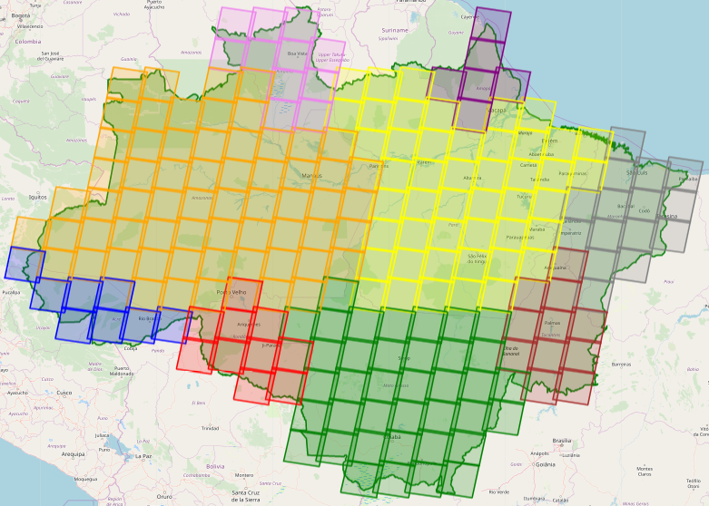

***

<h1> <p align="center"> Spatial-temporal differences in cloud cover of satellite observations across the Brazilian Amazon</p> </h1>
<p align="center"> Willian Vieira de Oliveira </p>


<p align="right"> [ Part 3 - Exploratory Data Analysis ] </p>

### SUMMARY

1. [**About**](./1_Project.md#About)
1. [**The Data**](./1_Project.md#TheData)
    1. [Raw data](./1_Project.md#RawData)
    1. [Processed data](./1_Project.md#ProcessedData)
    1. [Additional data](./1_Project.md#AdditionalData)
1. [**Questions about the data**](./1_Project.md#Questions)
1. [**Basic processing of the data**](./2_Basic_processing.md#BasicProc)
1. [**Statistics**](./2_Basic_processing.md#Stats)
1. [**Exploratory Data Analysis**](./3_EDA.md#EDA)
1. [**Results**](./4_Results_and_Conclusion.md#Results)
1. [**Conclusion**](./4_Results_and_Conclusion.md#Conclusion)
***

<a id='EDA'></a>
## 6. Exploratory Data Analysis


```python
import numpy as np
import pandas as pd
import geopandas as gpd
import folium
import os, shutil
from glob import glob
```

### Analysis of the Landsat-8 grids (path/row) that intersect the area of interest

At this moment, we consider all grids that intersect the area do study, regardless of the percentage of intersection. For that reason, the following analysis might include grids that present most of their area outside the area of study.


```python
# Auxiliary data
# List of all landsat-8 paths and rows
wrs = gpd.GeoDataFrame.from_file('Data/wrs2/wrs2.shp')

wrs.head(10)
```


<div>
<style scoped>
    .dataframe tbody tr th:only-of-type {
        vertical-align: middle;
    }

    .dataframe tbody tr th {
        vertical-align: top;
    }

    .dataframe thead th {
        text-align: right;
    }
</style>
<table border="1" class="dataframe">
  <thead>
    <tr style="text-align: right;">
      <th></th>
      <th>PR_ID</th>
      <th>PATH</th>
      <th>ROW</th>
      <th>MODE</th>
      <th>WEST</th>
      <th>EAST</th>
      <th>SOUTH</th>
      <th>NORTH</th>
      <th>geometry</th>
    </tr>
  </thead>
  <tbody>
    <tr>
      <th>0</th>
      <td>1</td>
      <td>1</td>
      <td>1</td>
      <td>D</td>
      <td>-3.6745</td>
      <td>9.5667</td>
      <td>79.6888</td>
      <td>81.8555</td>
      <td>POLYGON ((7.737374983151664 80.9888, 9.56671 8...</td>
    </tr>
    <tr>
      <th>1</th>
      <td>2</td>
      <td>1</td>
      <td>2</td>
      <td>D</td>
      <td>-10.7752</td>
      <td>1.9275</td>
      <td>78.9112</td>
      <td>81.1340</td>
      <td>POLYGON ((-10.70176281728041 80.18680241918837...</td>
    </tr>
    <tr>
      <th>2</th>
      <td>3</td>
      <td>1</td>
      <td>3</td>
      <td>D</td>
      <td>-16.6563</td>
      <td>-4.7688</td>
      <td>78.0110</td>
      <td>80.2529</td>
      <td>POLYGON ((-5.501291292099153 79.12261447018395...</td>
    </tr>
    <tr>
      <th>3</th>
      <td>4</td>
      <td>1</td>
      <td>4</td>
      <td>D</td>
      <td>-21.5265</td>
      <td>-10.5518</td>
      <td>77.0135</td>
      <td>79.2513</td>
      <td>POLYGON ((-18.12735185913917 77.46093710574092...</td>
    </tr>
    <tr>
      <th>4</th>
      <td>5</td>
      <td>1</td>
      <td>5</td>
      <td>D</td>
      <td>-25.5839</td>
      <td>-15.5133</td>
      <td>75.9394</td>
      <td>78.1597</td>
      <td>POLYGON ((-25.57135833693951 76.93656686536796...</td>
    </tr>
    <tr>
      <th>5</th>
      <td>6</td>
      <td>1</td>
      <td>6</td>
      <td>D</td>
      <td>-28.9948</td>
      <td>-19.7671</td>
      <td>74.8049</td>
      <td>77.0006</td>
      <td>POLYGON ((-28.98426286879677 75.72469936212626...</td>
    </tr>
    <tr>
      <th>6</th>
      <td>7</td>
      <td>1</td>
      <td>7</td>
      <td>D</td>
      <td>-31.8920</td>
      <td>-23.4259</td>
      <td>73.6225</td>
      <td>75.7905</td>
      <td>POLYGON ((-30.22221834467266 74.19892154025511...</td>
    </tr>
    <tr>
      <th>7</th>
      <td>8</td>
      <td>1</td>
      <td>8</td>
      <td>D</td>
      <td>-34.3789</td>
      <td>-26.5895</td>
      <td>72.4017</td>
      <td>74.5414</td>
      <td>POLYGON ((-26.82133122817676 73.5819522998444,...</td>
    </tr>
    <tr>
      <th>8</th>
      <td>9</td>
      <td>1</td>
      <td>9</td>
      <td>D</td>
      <td>-36.5359</td>
      <td>-29.3432</td>
      <td>71.1499</td>
      <td>73.2618</td>
      <td>POLYGON ((-36.48398005837918 71.92117369507797...</td>
    </tr>
    <tr>
      <th>9</th>
      <td>10</td>
      <td>1</td>
      <td>10</td>
      <td>D</td>
      <td>-38.4250</td>
      <td>-31.7570</td>
      <td>69.8729</td>
      <td>71.9583</td>
      <td>POLYGON ((-38.42023584542212 70.5653549828656,...</td>
    </tr>
  </tbody>
</table>
</div>


```python
# Definition of the area of interest
BR_Amazon_Estates = gpd.read_file('Data/Amazonia_Legal/UFS_AMZLEG_LLWGS84.shp', encoding='utf-8')
bounding_box_AM = BR_Amazon_Estates.unary_union
```

#### Question 1a: How many Landsat-8 scenes intersect the Brazilian Amazon?


```python
# We can check which Polygons of the WRS-2 system intersects the area of interest.

wrs_intersection = wrs[wrs.intersects(bounding_box_AM)]
paths, rows = wrs_intersection['PATH'].values, wrs_intersection['ROW'].values

print("There are ", paths.size, " WRS grids that intersect the study area")
```

    There are  234  WRS grids that intersect the study area
    

#### Nothern and Southern hemisphere

The Landsat framing is uniform for each orbit. The adjacent east-west scenes have scene center locations at the same nominal latitude. A notation of Row numbers can, therefore, be applied to identify all scenes occurring at the same latitude. 

Row 060 corresponds to latitude 0 (equator). Row 059 is immediately north of this.

Read more: https://landsat.gsfc.nasa.gov/the-worldwide-reference-system/


```python
# Empty arrays to store the identification of the grids located in each hemisphere
L8_N_grids_Path_Row = np.empty((0,2), str)
L8_S_grids_Path_Row = np.empty((0,2), str)

# Get the center of the map
xy = np.asarray(bounding_box_AM.centroid.xy).squeeze()
center = list(xy[::-1])

# Select a zoom
zoom = 5

# Create the most basic OSM folium map
m = folium.Map(location=center, zoom_start=zoom, control_scale=True)

# Add the bounds GeoDataFrame in red
m.add_child(folium.GeoJson(bounding_box_AM.__geo_interface__, name='Area of Study', 
                           style_function=lambda x: {'color': 'green', 'alpha': 0}))

# Iterate through each Polygon of paths and rows intersecting the area
for i, row in wrs_intersection.iterrows():
    # Create a string for the name containing the path and row of this Polygon
    name = 'path: %03d, row: %03d' % (row.PATH, row.ROW)
    
    # Create the folium geometry of this Polygon 
    if (row.ROW <= 60 and row.MODE == 'D'): # Northern hemisphere
        L8_N_grids_Path_Row = np.append(L8_N_grids_Path_Row, np.array([[row.PATH,row.ROW]]), axis=0)
        g = folium.GeoJson(row.geometry.__geo_interface__, name=name, style_function=lambda y: {'color': 'red'})
    else: # Southern hemisphere
        L8_S_grids_Path_Row = np.append(L8_S_grids_Path_Row, np.array([[row.PATH,row.ROW]]), axis=0)
        g = folium.GeoJson(row.geometry.__geo_interface__, name=name)#, style_function=lambda y: {'color': 'blue'})
    # Add a folium Popup object with the name string
    g.add_child(folium.Popup(name))
    # Add the object to the map
    g.add_to(m)

folium.LayerControl().add_to(m)
#m.save('Data/wrs2/wrs.html')
#m
```


    <folium.map.LayerControl at 0xa05fbf8b00>


Github can not render folium maps. Therefore, it was necessary to save the result as an image to include on Github.
<p align="center"></p>


```python
print("Number of Landsat-8 grids that cover the Brazilian Amazon:")
print("    Northern hemisphere: ", len(L8_N_grids_Path_Row), " grids.", "\n    Southern hemisphere: ", len(L8_S_grids_Path_Row), " grids.")

```

    Number of Landsat-8 grids that cover the Brazilian Amazon:
        Northern hemisphere:  47  grids. 
        Southern hemisphere:  187  grids.
    

### Analysis of the Sentinel-2 grids (path/row) that intersect the area of interest


```python
# Auxiliary data
# List of all Sentinel-2 tiles
S2_zones = gpd.GeoDataFrame.from_file('Data/Sentinel2_granule_zones/sentinel2_tiles_world.shp')

S2_zones.head(10)
```


<div>
<style scoped>
    .dataframe tbody tr th:only-of-type {
        vertical-align: middle;
    }

    .dataframe tbody tr th {
        vertical-align: top;
    }

    .dataframe thead th {
        text-align: right;
    }
</style>
<table border="1" class="dataframe">
  <thead>
    <tr style="text-align: right;">
      <th></th>
      <th>Name</th>
      <th>geometry</th>
    </tr>
  </thead>
  <tbody>
    <tr>
      <th>0</th>
      <td>01CCV</td>
      <td>POLYGON Z ((180.0000000000001 -73.059737407999...</td>
    </tr>
    <tr>
      <th>1</th>
      <td>01CCV</td>
      <td>POLYGON Z ((-180 -72.07333117899998 0, -179.62...</td>
    </tr>
    <tr>
      <th>2</th>
      <td>01CDH</td>
      <td>POLYGON Z ((180.0000000000001 -83.808545835999...</td>
    </tr>
    <tr>
      <th>3</th>
      <td>01CDH</td>
      <td>POLYGON Z ((-180 -82.82590260499995 0, -176.29...</td>
    </tr>
    <tr>
      <th>4</th>
      <td>01CDJ</td>
      <td>POLYGON Z ((180.0000000000001 -82.913439054999...</td>
    </tr>
    <tr>
      <th>5</th>
      <td>01CDJ</td>
      <td>POLYGON Z ((-180 -81.93056465699993 0, -176.37...</td>
    </tr>
    <tr>
      <th>6</th>
      <td>01CDK</td>
      <td>POLYGON Z ((180.0000000000001 -82.018655909999...</td>
    </tr>
    <tr>
      <th>7</th>
      <td>01CDK</td>
      <td>POLYGON Z ((-180 -81.03560602299996 0, -176.43...</td>
    </tr>
    <tr>
      <th>8</th>
      <td>01CDL</td>
      <td>POLYGON Z ((180.0000000000001 -81.123174027999...</td>
    </tr>
    <tr>
      <th>9</th>
      <td>01CDL</td>
      <td>POLYGON Z ((-180 -80.13998199399998 0, -176.48...</td>
    </tr>
  </tbody>
</table>
</div>


#### Question 1b: How many Sentinel-2 scenes intersect the Brazilian Amazon?


```python
# We can check which Polygons of the WRS-2 system intersects the area of interest.

S2_zones_intersection = S2_zones[S2_zones.intersects(bounding_box_AM)]
tiles = S2_zones_intersection['Name'].values

print("There are ", tiles.size, " granule zones that intersect the study area")
```

    There are  629  granule zones that intersect the study area
    

#### Nothern and Southern hemisphere

The first three characters of the tile name refer to UTM zone. The last of these characters can be used to identify the hemisphere of the tile. In case the letter comes before the letter 'N' in the alphabetical order (A, B, ..., M), the tile is in the Southern hemisphere. Otherwise, the tile is in the Northern hemisphere.


```python
# Empty arrays to store the identification of the grids located in each hemisphere
S2_N_tiles = np.empty((0,1), str)
S2_S_tiles = np.empty((0,1), str)

# Get the center of the map
xy = np.asarray(bounding_box_AM.centroid.xy).squeeze()
center = list(xy[::-1])

# Select a zoom
zoom = 5

# Create the most basic OSM folium map
m = folium.Map(location=center, zoom_start=zoom, control_scale=True)

# Add the bounds GeoDataFrame in red
m.add_child(folium.GeoJson(bounding_box_AM.__geo_interface__, name='Area of Study', 
                           style_function=lambda x: {'color': 'green', 'alpha': 0}))

# Iterate through each Polygon of paths and rows intersecting the area
for i, tile in S2_zones_intersection.iterrows():
    # Create a string for the name containing the path and row of this Polygon
    name = 'tile: %s' % (tile.Name)
    # Create the folium geometry of this Polygon 
    zone = tile.Name[2]
    if (zone.capitalize() >= 'N'): # northern hemisphere
        S2_N_tiles = np.append(S2_N_tiles, np.array([[tile.Name]]), axis=0)
        g = folium.GeoJson(tile.geometry.__geo_interface__, name=name, style_function=lambda y: {'color': 'red'})
    else: # southern hemisphere
        S2_S_tiles = np.append(S2_S_tiles, np.array([[tile.Name]]), axis=0)
        g = folium.GeoJson(tile.geometry.__geo_interface__, name=name)#, style_function=lambda y: {'color': 'blue'})
        
    # Add a folium Popup object with the name string
    g.add_child(folium.Popup(name))
    # Add the object to the map
    g.add_to(m)

folium.LayerControl().add_to(m)
#m.save('Data/Sentinel2_granule_zones/tiles.html')
#m
```


    <folium.map.LayerControl at 0xa05aa7bac8>


Github can not render folium maps. Therefore, it was necessary to save the result as an image to include on Github.
<p align="center"></p>


```python
print("Number of Sentinel-2 grids that cover the Brazilian Amazon:")
print("    Northern hemisphere: ", len(S2_N_tiles), " grids.", "\n    Southern hemisphere: ", len(S2_S_tiles), " grids.")
```

    Number of Sentinel-2 grids that cover the Brazilian Amazon:
        Northern hemisphere:  95  grids. 
        Southern hemisphere:  534  grids.
    

#### Question 2: How many Landsat-8 and Sentinel-2 grids intersect each Brazilian state?

Description of the shapefile that contains the boundaries of the Brazilian states that intersect the Brazilian Amazon:


```python
BR_Amazon_Estates
```

    The history saving thread hit an unexpected error (OperationalError('disk I/O error')).History will not be written to the database.
    


<div>
<style scoped>
    .dataframe tbody tr th:only-of-type {
        vertical-align: middle;
    }

    .dataframe tbody tr th {
        vertical-align: top;
    }

    .dataframe thead th {
        text-align: right;
    }
</style>
<table border="1" class="dataframe">
  <thead>
    <tr style="text-align: right;">
      <th></th>
      <th>SPRAREA</th>
      <th>SPRPERIMET</th>
      <th>SPRROTULO</th>
      <th>SPRNOME</th>
      <th>MSLINK</th>
      <th>MAPID</th>
      <th>CODIGO</th>
      <th>AREA_1</th>
      <th>PERIMETRO_</th>
      <th>GEOCODIGO</th>
      <th>NOME</th>
      <th>AREA_TOT_G</th>
      <th>objeid_88</th>
      <th>geometry</th>
    </tr>
  </thead>
  <tbody>
    <tr>
      <th>0</th>
      <td>2.404023e+11</td>
      <td>3.463076e+06</td>
      <td>1</td>
      <td>1</td>
      <td>1.0</td>
      <td>99.0</td>
      <td>11</td>
      <td>237576.167</td>
      <td>3441.37404</td>
      <td>11</td>
      <td>b'Rond\xf4nia'</td>
      <td>237576.167</td>
      <td>0</td>
      <td>POLYGON ((-60.70872435793023 -13.6933369594173...</td>
    </tr>
    <tr>
      <th>1</th>
      <td>1.588525e+11</td>
      <td>2.712820e+06</td>
      <td>2</td>
      <td>2</td>
      <td>2.0</td>
      <td>99.0</td>
      <td>12</td>
      <td>152581.388</td>
      <td>2670.32865</td>
      <td>12</td>
      <td>ACRE</td>
      <td>152581.388</td>
      <td>1</td>
      <td>POLYGON ((-66.80690861022219 -9.81492014010332...</td>
    </tr>
    <tr>
      <th>2</th>
      <td>1.429297e+11</td>
      <td>2.381854e+06</td>
      <td>20</td>
      <td>20</td>
      <td>20.0</td>
      <td>99.0</td>
      <td>16</td>
      <td>142814.585</td>
      <td>2380.76564</td>
      <td>16</td>
      <td>b'AMAP\xc1'</td>
      <td>142814.585</td>
      <td>19</td>
      <td>POLYGON ((-54.87266013107782 2.433385649611453...</td>
    </tr>
    <tr>
      <th>3</th>
      <td>1.601832e+12</td>
      <td>8.217087e+06</td>
      <td>3</td>
      <td>3</td>
      <td>3.0</td>
      <td>99.0</td>
      <td>13</td>
      <td>1570745.680</td>
      <td>8133.83971</td>
      <td>13</td>
      <td>AMAZONAS</td>
      <td>1570745.680</td>
      <td>2</td>
      <td>POLYGON ((-73.8034252650382 -7.112006890477168...</td>
    </tr>
    <tr>
      <th>4</th>
      <td>2.789995e+11</td>
      <td>4.022957e+06</td>
      <td>21</td>
      <td>21</td>
      <td>21.0</td>
      <td>99.0</td>
      <td>17</td>
      <td>277620.914</td>
      <td>4011.78300</td>
      <td>17</td>
      <td>TOCANTINS</td>
      <td>277620.914</td>
      <td>20</td>
      <td>POLYGON ((-50.22519403920089 -9.84157763020462...</td>
    </tr>
    <tr>
      <th>5</th>
      <td>3.353462e+11</td>
      <td>5.521029e+06</td>
      <td>23</td>
      <td>23</td>
      <td>23.0</td>
      <td>99.0</td>
      <td>21</td>
      <td>331430.739</td>
      <td>5487.32162</td>
      <td>21</td>
      <td>b'MARANH\xc3O'</td>
      <td>331983.293</td>
      <td>22</td>
      <td>POLYGON ((-48.75552863774982 -5.34957275673850...</td>
    </tr>
    <tr>
      <th>6</th>
      <td>9.048834e+11</td>
      <td>5.822618e+06</td>
      <td>225</td>
      <td>225</td>
      <td>225.0</td>
      <td>99.0</td>
      <td>51</td>
      <td>903357.715</td>
      <td>5815.15259</td>
      <td>51</td>
      <td>MATO GROSSO</td>
      <td>903357.715</td>
      <td>223</td>
      <td>POLYGON ((-61.58341167071828 -8.79909488810787...</td>
    </tr>
    <tr>
      <th>7</th>
      <td>2.262320e+11</td>
      <td>3.564371e+06</td>
      <td>4</td>
      <td>4</td>
      <td>4.0</td>
      <td>99.0</td>
      <td>14</td>
      <td>224298.980</td>
      <td>3548.01904</td>
      <td>14</td>
      <td>RORAIMA</td>
      <td>224298.980</td>
      <td>3</td>
      <td>POLYGON ((-63.37277878441854 2.211372310513946...</td>
    </tr>
    <tr>
      <th>8</th>
      <td>1.249560e+12</td>
      <td>7.453945e+06</td>
      <td>5</td>
      <td>5</td>
      <td>5.0</td>
      <td>99.0</td>
      <td>15</td>
      <td>1247659.325</td>
      <td>7440.29108</td>
      <td>15</td>
      <td>b'PAR\xc1'</td>
      <td>1247689.515</td>
      <td>4</td>
      <td>POLYGON ((-58.89592617252967 1.227324906244945...</td>
    </tr>
  </tbody>
</table>
</div>


First, we create a list containing the geocode and name of all states described in the shapefile. Then, we use this list to extract the boundaries of each state and identify the number of scenes that intersects each one of them.


```python
# list of the geocode and name of all the 9 states
states_geocodes = list([BR_Amazon_Estates.CODIGO, BR_Amazon_Estates.NOME])
```


```python
print("Number of Landsat-8 and Sentinel-2 grids that intersect each Brazilian state. Obs.: Note that states that intersect more than one state are counted more than once.")

for code, name in zip(states_geocodes[0], states_geocodes[1]):    
    # Some names need to be decoded
    try:
        name = name.decode("utf-8", "replace")
    except:
        pass
        
    bounding_box_state = BR_Amazon_Estates[BR_Amazon_Estates["GEOCODIGO"]==code].unary_union
    #BR_Amazon_Estates[BR_Amazon_Estates["GEOCODIGO"]==code].plot()
    
    # OLI sensor
    # We can check which Polygons of the WRS-2 system intersects each state
    wrs_intersection = wrs[wrs.intersects(bounding_box_state)]
    paths, rows = wrs_intersection['PATH'].values, wrs_intersection['ROW'].values
    
    # MSI sensor
    S2_zones_intersection = S2_zones[S2_zones.intersects(bounding_box_state)]
    tiles = S2_zones_intersection['Name'].values
    print("There are ", paths.size, " WRS grids and ", tiles.size, " Sentinel-2 zones that intersect the Brazilian state of ", name)
```

    Number of Landsat-8 and Sentinel-2 grids that intersect each Brazilian state. Obs.: Note that states that intersect more than one state are counted more than once.
    There are  20  WRS grids and  41  Sentinel-2 zones that intersect the Brazilian state of  Rond�nia
    There are  16  WRS grids and  33  Sentinel-2 zones that intersect the Brazilian state of  ACRE
    There are  14  WRS grids and  32  Sentinel-2 zones that intersect the Brazilian state of  AMAP�
    There are  83  WRS grids and  210  Sentinel-2 zones that intersect the Brazilian state of  AMAZONAS
    There are  22  WRS grids and  51  Sentinel-2 zones that intersect the Brazilian state of  TOCANTINS
    There are  24  WRS grids and  58  Sentinel-2 zones that intersect the Brazilian state of  MARANH�O
    There are  53  WRS grids and  131  Sentinel-2 zones that intersect the Brazilian state of  MATO GROSSO
    There are  21  WRS grids and  40  Sentinel-2 zones that intersect the Brazilian state of  RORAIMA
    There are  67  WRS grids and  168  Sentinel-2 zones that intersect the Brazilian state of  PAR�
    

<b>Observation: </b>The previous analysis considers all grids that intersect the area do study, regardless of the percentage of intersection. Now, we select and analyse only grids that present at least 15% of their area over the area of study.

We created three new dataframes. The 'df_grid_perState' dataframe scores the count of grids that intersect each state, while the 'df_wrs' and 'df_S2_zones' dataframes include the information of which state each grid covers the most. 


```python
area_threshold = 15
```


```python
df_grid_perState = gpd.GeoDataFrame()
df_grid_perState['GEOCODIGO'] = BR_Amazon_Estates.GEOCODIGO
df_grid_perState['NOME'] = BR_Amazon_Estates.NOME
df_grid_perState['geometry'] = BR_Amazon_Estates.geometry
df_grid_perState['Number_L8_grids'] = 0
df_grid_perState['Number_S2_grids'] = 0

wrs_intersection = wrs[wrs.intersects(bounding_box_AM)]

df_wrs = gpd.GeoDataFrame()
df_wrs['PATH'] = wrs_intersection.PATH
df_wrs['ROW'] = wrs_intersection.ROW
df_wrs['geometry'] = wrs_intersection.geometry
df_wrs['STATE'] = "None"
df_wrs['STATE_GEOCODE'] = "None"

S2_zones_intersection = S2_zones[S2_zones.intersects(bounding_box_AM)]

df_S2_zones = gpd.GeoDataFrame()
df_S2_zones['NAME'] = S2_zones_intersection.Name
df_S2_zones['geometry'] = S2_zones_intersection.geometry
df_S2_zones['STATE'] = "None"
df_S2_zones['STATE_GEOCODE'] = "None"
```

First, we analyse only the Landsat-8 data.


```python
# Get the center of the map
xy = np.asarray(bounding_box_AM.centroid.xy).squeeze()
center = list(xy[::-1])

# Select a zoom
zoom = 5
 
# Create the most basic OSM folium map
m = folium.Map(location=center, zoom_start=zoom, control_scale=True)

# Add the bounds GeoDataFrame in red
m.add_child(folium.GeoJson(bounding_box_AM.__geo_interface__, name='Area of Study', 
                           style_function=lambda x: {'color': 'green', 'alpha': 0}))

bounding_box_state = BR_Amazon_Estates.unary_union

wrs_intersection = wrs[wrs.intersects(bounding_box_state)]

# Iterate through each Polygon of paths and rows intersecting the area
for i, row in wrs_intersection.iterrows():
    estado_pertence = 0
    estado_pertence_perc = 0.0
    for code in states_geocodes[0]:
        estado = BR_Amazon_Estates[BR_Amazon_Estates["GEOCODIGO"]==code]
        area_intersecao = estado.intersection(row.geometry).area.item()
        perc = area_intersecao/row.geometry.area * 100
        
        if (perc > estado_pertence_perc):
            estado_pertence = str(code)
            estado_pertence_perc = perc
    
    if (estado_pertence_perc >= area_threshold): # At least 15% of the grid must cover the analysed in order
                                            # to be considered in this analysis
        # Create a string to save the path and row of this Polygon    
        name = 'path: %03d, row: %03d, perc. no estado: %f' % (row.PATH, row.ROW, estado_pertence_perc)

        # Create the folium geometry of this Polygon 
        if (estado_pertence == "11"): # Rondônia
            df_grid_perState.loc[df_grid_perState.GEOCODIGO == "11", 'Number_L8_grids']+=1
            df_wrs.loc[(df_wrs.PATH == row.PATH) & (df_wrs.ROW == row.ROW), 'STATE'] = "RO"
            df_wrs.loc[(df_wrs.PATH == row.PATH) & (df_wrs.ROW == row.ROW), 'STATE_GEOCODE'] = "11"
            g = folium.GeoJson(row.geometry.__geo_interface__, name=name, style_function=lambda y: {'color': 'red'})
        elif (estado_pertence == "12"): # Acre
            df_grid_perState.loc[df_grid_perState.GEOCODIGO == "12", 'Number_L8_grids']+=1
            df_wrs.loc[(df_wrs.PATH == row.PATH) & (df_wrs.ROW == row.ROW), 'STATE'] = "AC"
            df_wrs.loc[(df_wrs.PATH == row.PATH) & (df_wrs.ROW == row.ROW), 'STATE_GEOCODE'] = "12"
            g = folium.GeoJson(row.geometry.__geo_interface__, name=name, style_function=lambda y: {'color': 'blue'})
        elif (estado_pertence == "13"): # Amazonas
            df_grid_perState.loc[df_grid_perState.GEOCODIGO == "13", 'Number_L8_grids']+=1
            df_wrs.loc[(df_wrs.PATH == row.PATH) & (df_wrs.ROW == row.ROW), 'STATE'] = "AM"
            df_wrs.loc[(df_wrs.PATH == row.PATH) & (df_wrs.ROW == row.ROW), 'STATE_GEOCODE'] = "13"
            g = folium.GeoJson(row.geometry.__geo_interface__, name=name, style_function=lambda y: {'color': 'orange'})
        elif (estado_pertence == "14"): # Roraima
            df_grid_perState.loc[df_grid_perState.GEOCODIGO == "14", 'Number_L8_grids']+=1            
            df_wrs.loc[(df_wrs.PATH == row.PATH) & (df_wrs.ROW == row.ROW), 'STATE'] = "RR"
            df_wrs.loc[(df_wrs.PATH == row.PATH) & (df_wrs.ROW == row.ROW), 'STATE_GEOCODE'] = "14"
            g = folium.GeoJson(row.geometry.__geo_interface__, name=name, style_function=lambda y: {'color': 'violet'})
        elif (estado_pertence == "15"): # Para
            df_grid_perState.loc[df_grid_perState.GEOCODIGO == "15", 'Number_L8_grids']+=1
            df_wrs.loc[(df_wrs.PATH == row.PATH) & (df_wrs.ROW == row.ROW), 'STATE'] = "PA"
            df_wrs.loc[(df_wrs.PATH == row.PATH) & (df_wrs.ROW == row.ROW), 'STATE_GEOCODE'] = "15"
            g = folium.GeoJson(row.geometry.__geo_interface__, name=name, style_function=lambda y: {'color': 'yellow'})
        elif (estado_pertence == "16"): # Amapa
            df_grid_perState.loc[df_grid_perState.GEOCODIGO == "16", 'Number_L8_grids']+=1
            df_wrs.loc[(df_wrs.PATH == row.PATH) & (df_wrs.ROW == row.ROW), 'STATE'] = "AM"
            df_wrs.loc[(df_wrs.PATH == row.PATH) & (df_wrs.ROW == row.ROW), 'STATE_GEOCODE'] = "16"
            g = folium.GeoJson(row.geometry.__geo_interface__, name=name, style_function=lambda y: {'color': 'purple'})
        elif (estado_pertence == "17"): # Tocantins
            df_grid_perState.loc[df_grid_perState.GEOCODIGO == "17", 'Number_L8_grids']+=1
            df_wrs.loc[(df_wrs.PATH == row.PATH) & (df_wrs.ROW == row.ROW), 'STATE'] = "TO"
            df_wrs.loc[(df_wrs.PATH == row.PATH) & (df_wrs.ROW == row.ROW), 'STATE_GEOCODE'] = "17"
            g = folium.GeoJson(row.geometry.__geo_interface__, name=name, style_function=lambda y: {'color': 'brown'})
        elif (estado_pertence == "21"): # Maranhão
            df_grid_perState.loc[df_grid_perState.GEOCODIGO == "21", 'Number_L8_grids']+=1
            df_wrs.loc[(df_wrs.PATH == row.PATH) & (df_wrs.ROW == row.ROW), 'STATE'] = "MA"
            df_wrs.loc[(df_wrs.PATH == row.PATH) & (df_wrs.ROW == row.ROW), 'STATE_GEOCODE'] = "21"
            g = folium.GeoJson(row.geometry.__geo_interface__, name=name, style_function=lambda y: {'color': 'gray'})
        elif (estado_pertence == "51"): # Mato Grosso
            df_grid_perState.loc[df_grid_perState.GEOCODIGO == "51", 'Number_L8_grids']+=1
            df_wrs.loc[(df_wrs.PATH == row.PATH) & (df_wrs.ROW == row.ROW), 'STATE'] = "MT"
            df_wrs.loc[(df_wrs.PATH == row.PATH) & (df_wrs.ROW == row.ROW), 'STATE_GEOCODE'] = "51"
            g = folium.GeoJson(row.geometry.__geo_interface__, name=name, style_function=lambda y: {'color': 'green'})
        else: # Apenas por garantia, provavelmente não será necessário. 
            g = folium.GeoJson(row.geometry.__geo_interface__, name=name, style_function=lambda y: {'color': 'black'})

        # Add a folium Popup object with the name string
        g.add_child(folium.Popup(name))
        # Add the object to the map
        g.add_to(m)

folium.LayerControl().add_to(m)
#m.save('Output/L8_Grids_perState.html')
#m
```


    <folium.map.LayerControl at 0xa06351b6d8>


Github can not render folium maps. Therefore, it was necessary to save the result as an image to include on Github. You can also use the 'wrs_perState.html' file to analyse this result.
<p align="center"></p>


```python
df_grid_perState
```


<div>
<style scoped>
    .dataframe tbody tr th:only-of-type {
        vertical-align: middle;
    }

    .dataframe tbody tr th {
        vertical-align: top;
    }

    .dataframe thead th {
        text-align: right;
    }
</style>
<table border="1" class="dataframe">
  <thead>
    <tr style="text-align: right;">
      <th></th>
      <th>GEOCODIGO</th>
      <th>NOME</th>
      <th>geometry</th>
      <th>Number_L8_grids</th>
      <th>Number_S2_grids</th>
    </tr>
  </thead>
  <tbody>
    <tr>
      <th>0</th>
      <td>11</td>
      <td>b'Rond\xf4nia'</td>
      <td>POLYGON ((-60.70872435793023 -13.6933369594173...</td>
      <td>10</td>
      <td>0</td>
    </tr>
    <tr>
      <th>1</th>
      <td>12</td>
      <td>ACRE</td>
      <td>POLYGON ((-66.80690861022219 -9.81492014010332...</td>
      <td>8</td>
      <td>0</td>
    </tr>
    <tr>
      <th>2</th>
      <td>16</td>
      <td>b'AMAP\xc1'</td>
      <td>POLYGON ((-54.87266013107782 2.433385649611453...</td>
      <td>6</td>
      <td>0</td>
    </tr>
    <tr>
      <th>3</th>
      <td>13</td>
      <td>AMAZONAS</td>
      <td>POLYGON ((-73.8034252650382 -7.112006890477168...</td>
      <td>62</td>
      <td>0</td>
    </tr>
    <tr>
      <th>4</th>
      <td>17</td>
      <td>TOCANTINS</td>
      <td>POLYGON ((-50.22519403920089 -9.84157763020462...</td>
      <td>11</td>
      <td>0</td>
    </tr>
    <tr>
      <th>5</th>
      <td>21</td>
      <td>b'MARANH\xc3O'</td>
      <td>POLYGON ((-48.75552863774982 -5.34957275673850...</td>
      <td>15</td>
      <td>0</td>
    </tr>
    <tr>
      <th>6</th>
      <td>51</td>
      <td>MATO GROSSO</td>
      <td>POLYGON ((-61.58341167071828 -8.79909488810787...</td>
      <td>38</td>
      <td>0</td>
    </tr>
    <tr>
      <th>7</th>
      <td>14</td>
      <td>RORAIMA</td>
      <td>POLYGON ((-63.37277878441854 2.211372310513946...</td>
      <td>11</td>
      <td>0</td>
    </tr>
    <tr>
      <th>8</th>
      <td>15</td>
      <td>b'PAR\xc1'</td>
      <td>POLYGON ((-58.89592617252967 1.227324906244945...</td>
      <td>47</td>
      <td>0</td>
    </tr>
  </tbody>
</table>
</div>


In addition, the 'df_wrs' dataframe describes which Brazilian state each grid covers (at least most of their area). This dataframe also identifies which grids do not present the minimum coverage area required in this study.


```python
df_wrs.head(20)
```


<div>
<style scoped>
    .dataframe tbody tr th:only-of-type {
        vertical-align: middle;
    }

    .dataframe tbody tr th {
        vertical-align: top;
    }

    .dataframe thead th {
        text-align: right;
    }
</style>
<table border="1" class="dataframe">
  <thead>
    <tr style="text-align: right;">
      <th></th>
      <th>PATH</th>
      <th>ROW</th>
      <th>geometry</th>
      <th>STATE</th>
      <th>STATE_GEOCODE</th>
    </tr>
  </thead>
  <tbody>
    <tr>
      <th>56</th>
      <td>1</td>
      <td>57</td>
      <td>POLYGON ((-62.69021422502469 4.98028206634571,...</td>
      <td>RR</td>
      <td>14</td>
    </tr>
    <tr>
      <th>57</th>
      <td>1</td>
      <td>58</td>
      <td>POLYGON ((-63.32440246063994 2.01260035744379,...</td>
      <td>RR</td>
      <td>14</td>
    </tr>
    <tr>
      <th>58</th>
      <td>1</td>
      <td>59</td>
      <td>POLYGON ((-63.32440246063994 2.01260035744379,...</td>
      <td>AM</td>
      <td>13</td>
    </tr>
    <tr>
      <th>59</th>
      <td>1</td>
      <td>60</td>
      <td>POLYGON ((-63.61713228359266 0.636073644560817...</td>
      <td>AM</td>
      <td>13</td>
    </tr>
    <tr>
      <th>60</th>
      <td>1</td>
      <td>61</td>
      <td>POLYGON ((-63.92293223992832 -0.80513531657767...</td>
      <td>AM</td>
      <td>13</td>
    </tr>
    <tr>
      <th>61</th>
      <td>1</td>
      <td>62</td>
      <td>POLYGON ((-64.22954292592541 -2.25170376438412...</td>
      <td>AM</td>
      <td>13</td>
    </tr>
    <tr>
      <th>62</th>
      <td>1</td>
      <td>63</td>
      <td>POLYGON ((-64.53595683711796 -3.69831174359904...</td>
      <td>AM</td>
      <td>13</td>
    </tr>
    <tr>
      <th>63</th>
      <td>1</td>
      <td>64</td>
      <td>POLYGON ((-65.14952878906843 -6.59136581792295...</td>
      <td>AM</td>
      <td>13</td>
    </tr>
    <tr>
      <th>64</th>
      <td>1</td>
      <td>65</td>
      <td>POLYGON ((-67.12151252704504 -7.8154398765744,...</td>
      <td>AM</td>
      <td>13</td>
    </tr>
    <tr>
      <th>65</th>
      <td>1</td>
      <td>66</td>
      <td>POLYGON ((-65.76574325020484 -9.48391371776759...</td>
      <td>AM</td>
      <td>13</td>
    </tr>
    <tr>
      <th>66</th>
      <td>1</td>
      <td>67</td>
      <td>POLYGON ((-67.76077272731082 -10.7395476767596...</td>
      <td>AC</td>
      <td>12</td>
    </tr>
    <tr>
      <th>67</th>
      <td>1</td>
      <td>68</td>
      <td>POLYGON ((-66.3868067454264 -12.37559902021067...</td>
      <td>None</td>
      <td>None</td>
    </tr>
    <tr>
      <th>180</th>
      <td>2</td>
      <td>57</td>
      <td>POLYGON ((-64.25140814694619 4.905061183431392...</td>
      <td>None</td>
      <td>None</td>
    </tr>
    <tr>
      <th>182</th>
      <td>2</td>
      <td>59</td>
      <td>POLYGON ((-65.17706476990446 0.566169408979251...</td>
      <td>None</td>
      <td>None</td>
    </tr>
    <tr>
      <th>183</th>
      <td>2</td>
      <td>60</td>
      <td>POLYGON ((-65.17706476990446 0.566169408979251...</td>
      <td>AM</td>
      <td>13</td>
    </tr>
    <tr>
      <th>184</th>
      <td>2</td>
      <td>61</td>
      <td>POLYGON ((-65.790544287841 -2.326973566667828,...</td>
      <td>AM</td>
      <td>13</td>
    </tr>
    <tr>
      <th>185</th>
      <td>2</td>
      <td>62</td>
      <td>POLYGON ((-65.790544287841 -2.326973566667828,...</td>
      <td>AM</td>
      <td>13</td>
    </tr>
    <tr>
      <th>186</th>
      <td>2</td>
      <td>63</td>
      <td>POLYGON ((-66.40356548233339 -5.22012048755396...</td>
      <td>AM</td>
      <td>13</td>
    </tr>
    <tr>
      <th>187</th>
      <td>2</td>
      <td>64</td>
      <td>POLYGON ((-66.71059821718762 -6.66659573317328...</td>
      <td>AM</td>
      <td>13</td>
    </tr>
    <tr>
      <th>188</th>
      <td>2</td>
      <td>65</td>
      <td>POLYGON ((-67.01825995297074 -8.11297129118655...</td>
      <td>AM</td>
      <td>13</td>
    </tr>
  </tbody>
</table>
</div>


```python
a = df_wrs[df_wrs.STATE_GEOCODE == "None"]

print("There are ", len(a), " WRS grids that do not present at least ", area_threshold,"% of their area covering the area of interest.")
```

    There are  26  WRS grids that do not present at least  15 % of their area covering the area of interest.
    

***
Now, we repeat the above procedures for the Sentinel-2 data.


```python
# Get the center of the map
xy = np.asarray(bounding_box_AM.centroid.xy).squeeze()
center = list(xy[::-1])

# Select a zoom
zoom = 5

# Create the most basic OSM folium map
m = folium.Map(location=center, zoom_start=zoom, control_scale=True)

# Add the bounds GeoDataFrame in red
m.add_child(folium.GeoJson(bounding_box_AM.__geo_interface__, name='Area of Study', 
                           style_function=lambda x: {'color': 'green', 'alpha': 0}))

bounding_box_state = BR_Amazon_Estates.unary_union

S2_zones_intersection = S2_zones[S2_zones.intersects(bounding_box_state)]

# Iterate through each Polygon intersecting the area
for i, tile in S2_zones_intersection.iterrows():
    estado_pertence = 0
    estado_pertence_perc = 0.0
    for code in states_geocodes[0]:
        estado = BR_Amazon_Estates[BR_Amazon_Estates["GEOCODIGO"]==code]
        area_intersecao = estado.intersection(tile.geometry).area.item()
        perc = area_intersecao/tile.geometry.area * 100

        if (perc > estado_pertence_perc):
            estado_pertence = str(code)
            estado_pertence_perc = perc
    if (estado_pertence_perc >= area_threshold): # At least 15% of the grid must cover the analysed area in order
                                            # to be considered in this analysis
        # Create a string for the name containing the name of this Polygon
        name = 'tile: %s, perc. no estado: %f' % (tile.Name, estado_pertence_perc) 
        
        # Create the folium geometry of this Polygon 
        if (estado_pertence == "11"): # Rondônia
            df_grid_perState.loc[df_grid_perState.GEOCODIGO == "11", 'Number_S2_grids']+=1
            df_S2_zones.loc[(df_S2_zones.NAME == tile.Name), 'STATE'] = "RO"
            df_S2_zones.loc[(df_S2_zones.NAME == tile.Name), 'STATE_GEOCODE'] = "11"
            g = folium.GeoJson(tile.geometry.__geo_interface__, name=name, style_function=lambda y: {'color': 'red'})
        elif (estado_pertence == "12"): # Acre
            df_grid_perState.loc[df_grid_perState.GEOCODIGO == "12", 'Number_S2_grids']+=1
            df_S2_zones.loc[(df_S2_zones.NAME == tile.Name), 'STATE'] = "AC"
            df_S2_zones.loc[(df_S2_zones.NAME == tile.Name), 'STATE_GEOCODE'] = "12"
            g = folium.GeoJson(tile.geometry.__geo_interface__, name=name, style_function=lambda y: {'color': 'blue'})
        elif (estado_pertence == "13"): # Amazonas
            df_grid_perState.loc[df_grid_perState.GEOCODIGO == "13", 'Number_S2_grids']+=1
            df_S2_zones.loc[(df_S2_zones.NAME == tile.Name), 'STATE'] = "AM"
            df_S2_zones.loc[(df_S2_zones.NAME == tile.Name), 'STATE_GEOCODE'] = "13"
            g = folium.GeoJson(tile.geometry.__geo_interface__, name=name, style_function=lambda y: {'color': 'orange'})
        elif (estado_pertence == "14"): # Roraima
            df_grid_perState.loc[df_grid_perState.GEOCODIGO == "14", 'Number_S2_grids']+=1            
            df_S2_zones.loc[(df_S2_zones.NAME == tile.Name), 'STATE'] = "RR"
            df_S2_zones.loc[(df_S2_zones.NAME == tile.Name), 'STATE_GEOCODE'] = "14"
            g = folium.GeoJson(tile.geometry.__geo_interface__, name=name, style_function=lambda y: {'color': 'violet'})
        elif (estado_pertence == "15"): # Para
            df_grid_perState.loc[df_grid_perState.GEOCODIGO == "15", 'Number_S2_grids']+=1
            df_S2_zones.loc[(df_S2_zones.NAME == tile.Name), 'STATE'] = "PA"
            df_S2_zones.loc[(df_S2_zones.NAME == tile.Name), 'STATE_GEOCODE'] = "15"
            g = folium.GeoJson(tile.geometry.__geo_interface__, name=name, style_function=lambda y: {'color': 'yellow'})
        elif (estado_pertence == "16"): # Amapa
            df_grid_perState.loc[df_grid_perState.GEOCODIGO == "16", 'Number_S2_grids']+=1
            df_S2_zones.loc[(df_S2_zones.NAME == tile.Name), 'STATE'] = "AM"
            df_S2_zones.loc[(df_S2_zones.NAME == tile.Name), 'STATE_GEOCODE'] = "16"
            g = folium.GeoJson(tile.geometry.__geo_interface__, name=name, style_function=lambda y: {'color': 'purple'})
        elif (estado_pertence == "17"): # Tocantins
            df_grid_perState.loc[df_grid_perState.GEOCODIGO == "17", 'Number_S2_grids']+=1
            df_S2_zones.loc[(df_S2_zones.NAME == tile.Name), 'STATE'] = "TO"
            df_S2_zones.loc[(df_S2_zones.NAME == tile.Name), 'STATE_GEOCODE'] = "17"
            g = folium.GeoJson(tile.geometry.__geo_interface__, name=name, style_function=lambda y: {'color': 'brown'})
        elif (estado_pertence == "21"): # Maranhão
            df_grid_perState.loc[df_grid_perState.GEOCODIGO == "21", 'Number_S2_grids']+=1
            df_S2_zones.loc[(df_S2_zones.NAME == tile.Name), 'STATE'] = "MA"
            df_S2_zones.loc[(df_S2_zones.NAME == tile.Name), 'STATE_GEOCODE'] = "21"
            g = folium.GeoJson(tile.geometry.__geo_interface__, name=name, style_function=lambda y: {'color': 'gray'})
        elif (estado_pertence == "51"): # Mato Grosso
            df_grid_perState.loc[df_grid_perState.GEOCODIGO == "51", 'Number_S2_grids']+=1
            df_S2_zones.loc[(df_S2_zones.NAME == tile.Name), 'STATE'] = "MT"
            df_S2_zones.loc[(df_S2_zones.NAME == tile.Name), 'STATE_GEOCODE'] = "51"
            g = folium.GeoJson(tile.geometry.__geo_interface__, name=name, style_function=lambda y: {'color': 'green'})
        else: # Apenas por garantia, provavelmente não será necessário. 
            g = folium.GeoJson(tile.geometry.__geo_interface__, name=name, style_function=lambda y: {'color': 'black'})
        
        # Add a folium Popup object with the name string
        g.add_child(folium.Popup(name))
        # Add the object to the map
        g.add_to(m)
            
folium.LayerControl().add_to(m)
#m.save('Output/S2Tiles_perState.html')
#m
```


    <folium.map.LayerControl at 0xa06351f1d0>


Github can not render folium maps. Therefore, it was necessary to save the result as an image to include on Github. You can also use the 'tiles_perState.html' file to analyse this result.
<p align="center"></p>

#### Answer to question 2: 

The columns 'Number_L8_grids' and 'Number_S2_grids' show the number of Landsat-8 and Sentinel-2 grids that intersect each Brazilian state, respectively.


```python
df_grid_perState
```


<div>
<style scoped>
    .dataframe tbody tr th:only-of-type {
        vertical-align: middle;
    }

    .dataframe tbody tr th {
        vertical-align: top;
    }

    .dataframe thead th {
        text-align: right;
    }
</style>
<table border="1" class="dataframe">
  <thead>
    <tr style="text-align: right;">
      <th></th>
      <th>GEOCODIGO</th>
      <th>NOME</th>
      <th>geometry</th>
      <th>Number_L8_grids</th>
      <th>Number_S2_grids</th>
    </tr>
  </thead>
  <tbody>
    <tr>
      <th>0</th>
      <td>11</td>
      <td>b'Rond\xf4nia'</td>
      <td>POLYGON ((-60.70872435793023 -13.6933369594173...</td>
      <td>10</td>
      <td>26</td>
    </tr>
    <tr>
      <th>1</th>
      <td>12</td>
      <td>ACRE</td>
      <td>POLYGON ((-66.80690861022219 -9.81492014010332...</td>
      <td>8</td>
      <td>18</td>
    </tr>
    <tr>
      <th>2</th>
      <td>16</td>
      <td>b'AMAP\xc1'</td>
      <td>POLYGON ((-54.87266013107782 2.433385649611453...</td>
      <td>6</td>
      <td>17</td>
    </tr>
    <tr>
      <th>3</th>
      <td>13</td>
      <td>AMAZONAS</td>
      <td>POLYGON ((-73.8034252650382 -7.112006890477168...</td>
      <td>62</td>
      <td>174</td>
    </tr>
    <tr>
      <th>4</th>
      <td>17</td>
      <td>TOCANTINS</td>
      <td>POLYGON ((-50.22519403920089 -9.84157763020462...</td>
      <td>11</td>
      <td>35</td>
    </tr>
    <tr>
      <th>5</th>
      <td>21</td>
      <td>b'MARANH\xc3O'</td>
      <td>POLYGON ((-48.75552863774982 -5.34957275673850...</td>
      <td>15</td>
      <td>40</td>
    </tr>
    <tr>
      <th>6</th>
      <td>51</td>
      <td>MATO GROSSO</td>
      <td>POLYGON ((-61.58341167071828 -8.79909488810787...</td>
      <td>38</td>
      <td>102</td>
    </tr>
    <tr>
      <th>7</th>
      <td>14</td>
      <td>RORAIMA</td>
      <td>POLYGON ((-63.37277878441854 2.211372310513946...</td>
      <td>11</td>
      <td>30</td>
    </tr>
    <tr>
      <th>8</th>
      <td>15</td>
      <td>b'PAR\xc1'</td>
      <td>POLYGON ((-58.89592617252967 1.227324906244945...</td>
      <td>47</td>
      <td>137</td>
    </tr>
  </tbody>
</table>
</div>


In addition, the 'df_S2_zones' dataframe describes which Brazilian state each grid covers (at least most of their area). This dataframe also identifies which grids do not present the minimum coverage area required in this study.


```python
df_S2_zones.head(629)
```


<div>
<style scoped>
    .dataframe tbody tr th:only-of-type {
        vertical-align: middle;
    }

    .dataframe tbody tr th {
        vertical-align: top;
    }

    .dataframe thead th {
        text-align: right;
    }
</style>
<table border="1" class="dataframe">
  <thead>
    <tr style="text-align: right;">
      <th></th>
      <th>NAME</th>
      <th>geometry</th>
      <th>STATE</th>
      <th>STATE_GEOCODE</th>
    </tr>
  </thead>
  <tbody>
    <tr>
      <th>16757</th>
      <td>18LXQ</td>
      <td>POLYGON Z ((-74.09012137699995 -9.045071504999...</td>
      <td>None</td>
      <td>None</td>
    </tr>
    <tr>
      <th>16758</th>
      <td>18LXR</td>
      <td>POLYGON Z ((-74.09227431799997 -8.141019404999...</td>
      <td>AC</td>
      <td>12</td>
    </tr>
    <tr>
      <th>16765</th>
      <td>18LYP</td>
      <td>POLYGON Z ((-73.17606535199997 -9.945892148999...</td>
      <td>None</td>
      <td>None</td>
    </tr>
    <tr>
      <th>16766</th>
      <td>18LYQ</td>
      <td>POLYGON Z ((-73.18084308499994 -9.041687251999...</td>
      <td>AC</td>
      <td>12</td>
    </tr>
    <tr>
      <th>16767</th>
      <td>18LYR</td>
      <td>POLYGON Z ((-73.18514538599999 -8.137978066999...</td>
      <td>AC</td>
      <td>12</td>
    </tr>
    <tr>
      <th>16774</th>
      <td>18LZP</td>
      <td>POLYGON Z ((-72.26433183699999 -9.939678496999...</td>
      <td>None</td>
      <td>None</td>
    </tr>
    <tr>
      <th>16775</th>
      <td>18LZQ</td>
      <td>POLYGON Z ((-72.27149179999998 -9.036048067999...</td>
      <td>AC</td>
      <td>12</td>
    </tr>
    <tr>
      <th>16776</th>
      <td>18LZR</td>
      <td>POLYGON Z ((-72.27793931399998 -8.132910270999...</td>
      <td>AC</td>
      <td>12</td>
    </tr>
    <tr>
      <th>16818</th>
      <td>18MXS</td>
      <td>POLYGON Z ((-74.09419464599995 -7.236383950999...</td>
      <td>AC</td>
      <td>12</td>
    </tr>
    <tr>
      <th>16819</th>
      <td>18MXT</td>
      <td>POLYGON Z ((-74.09588341499995 -6.331712202999...</td>
      <td>AM</td>
      <td>13</td>
    </tr>
    <tr>
      <th>16820</th>
      <td>18MXU</td>
      <td>POLYGON Z ((-74.09734193399999 -5.427551341999...</td>
      <td>None</td>
      <td>None</td>
    </tr>
    <tr>
      <th>16827</th>
      <td>18MYS</td>
      <td>POLYGON Z ((-73.18898285999995 -7.233684263999...</td>
      <td>AC</td>
      <td>12</td>
    </tr>
    <tr>
      <th>16828</th>
      <td>18MYT</td>
      <td>POLYGON Z ((-73.19235760999999 -6.329352865999...</td>
      <td>AM</td>
      <td>13</td>
    </tr>
    <tr>
      <th>16829</th>
      <td>18MYU</td>
      <td>POLYGON Z ((-73.19527224699993 -5.425531019999...</td>
      <td>AM</td>
      <td>13</td>
    </tr>
    <tr>
      <th>16830</th>
      <td>18MYV</td>
      <td>POLYGON Z ((-73.19773390599994 -4.521138360999...</td>
      <td>AM</td>
      <td>13</td>
    </tr>
    <tr>
      <th>16831</th>
      <td>18MZA</td>
      <td>POLYGON Z ((-72.29981700799993 -3.614481509999...</td>
      <td>None</td>
      <td>None</td>
    </tr>
    <tr>
      <th>16836</th>
      <td>18MZS</td>
      <td>POLYGON Z ((-72.28369026099995 -7.229185751999...</td>
      <td>AM</td>
      <td>13</td>
    </tr>
    <tr>
      <th>16837</th>
      <td>18MZT</td>
      <td>POLYGON Z ((-72.28874778199997 -6.325421474999...</td>
      <td>AM</td>
      <td>13</td>
    </tr>
    <tr>
      <th>16838</th>
      <td>18MZU</td>
      <td>POLYGON Z ((-72.29311578199997 -5.422164528999...</td>
      <td>AM</td>
      <td>13</td>
    </tr>
    <tr>
      <th>16839</th>
      <td>18MZV</td>
      <td>POLYGON Z ((-72.29680494099995 -4.518335502999...</td>
      <td>AM</td>
      <td>13</td>
    </tr>
    <tr>
      <th>17665</th>
      <td>19LBJ</td>
      <td>POLYGON Z ((-71.73603265499997 -9.939675515999...</td>
      <td>None</td>
      <td>None</td>
    </tr>
    <tr>
      <th>17666</th>
      <td>19LBK</td>
      <td>POLYGON Z ((-71.72887174199997 -9.036045362999...</td>
      <td>AC</td>
      <td>12</td>
    </tr>
    <tr>
      <th>17667</th>
      <td>19LBL</td>
      <td>POLYGON Z ((-71.72242337099993 -8.132907839999...</td>
      <td>AC</td>
      <td>12</td>
    </tr>
    <tr>
      <th>17673</th>
      <td>19LCH</td>
      <td>POLYGON Z ((-70.82955723299995 -10.85004360999...</td>
      <td>None</td>
      <td>None</td>
    </tr>
    <tr>
      <th>17674</th>
      <td>19LCJ</td>
      <td>POLYGON Z ((-70.82429937999996 -9.945890159999...</td>
      <td>AC</td>
      <td>12</td>
    </tr>
    <tr>
      <th>17675</th>
      <td>19LCK</td>
      <td>POLYGON Z ((-70.81952069299996 -9.041685446999...</td>
      <td>AC</td>
      <td>12</td>
    </tr>
    <tr>
      <th>17676</th>
      <td>19LCL</td>
      <td>POLYGON Z ((-70.81521753299995 -8.137976444999...</td>
      <td>AC</td>
      <td>12</td>
    </tr>
    <tr>
      <th>17682</th>
      <td>19LDH</td>
      <td>POLYGON Z ((-69.91526602599998 -10.85412030299...</td>
      <td>None</td>
      <td>None</td>
    </tr>
    <tr>
      <th>17683</th>
      <td>19LDJ</td>
      <td>POLYGON Z ((-69.91263436399998 -9.949620171999...</td>
      <td>AC</td>
      <td>12</td>
    </tr>
    <tr>
      <th>17684</th>
      <td>19LDK</td>
      <td>POLYGON Z ((-69.91024254299998 -9.045070601999...</td>
      <td>AC</td>
      <td>12</td>
    </tr>
    <tr>
      <th>...</th>
      <td>...</td>
      <td>...</td>
      <td>...</td>
      <td>...</td>
    </tr>
    <tr>
      <th>21520</th>
      <td>23MMM</td>
      <td>POLYGON Z ((-45.90616764599997 -7.236383230999...</td>
      <td>MA</td>
      <td>21</td>
    </tr>
    <tr>
      <th>21521</th>
      <td>23MMN</td>
      <td>POLYGON Z ((-45.90447820099996 -6.331711572999...</td>
      <td>MA</td>
      <td>21</td>
    </tr>
    <tr>
      <th>21522</th>
      <td>23MMP</td>
      <td>POLYGON Z ((-45.90301909899995 -5.427550802999...</td>
      <td>MA</td>
      <td>21</td>
    </tr>
    <tr>
      <th>21523</th>
      <td>23MMQ</td>
      <td>POLYGON Z ((-45.90178676699998 -4.522819979999...</td>
      <td>MA</td>
      <td>21</td>
    </tr>
    <tr>
      <th>21524</th>
      <td>23MMR</td>
      <td>POLYGON Z ((-45.90078061599996 -3.618066326999...</td>
      <td>MA</td>
      <td>21</td>
    </tr>
    <tr>
      <th>21525</th>
      <td>23MMS</td>
      <td>POLYGON Z ((-45.89999980099998 -2.713837142999...</td>
      <td>MA</td>
      <td>21</td>
    </tr>
    <tr>
      <th>21526</th>
      <td>23MMT</td>
      <td>POLYGON Z ((-45.89944241899997 -1.809051473999...</td>
      <td>MA</td>
      <td>21</td>
    </tr>
    <tr>
      <th>21527</th>
      <td>23MMU</td>
      <td>POLYGON Z ((-45.89910831799995 -0.904256642999...</td>
      <td>MA</td>
      <td>21</td>
    </tr>
    <tr>
      <th>21529</th>
      <td>23MNM</td>
      <td>POLYGON Z ((-45.00018116899997 -7.237284699999...</td>
      <td>None</td>
      <td>None</td>
    </tr>
    <tr>
      <th>21530</th>
      <td>23MNN</td>
      <td>POLYGON Z ((-45.00018083099997 -6.332499393999...</td>
      <td>MA</td>
      <td>21</td>
    </tr>
    <tr>
      <th>21531</th>
      <td>23MNP</td>
      <td>POLYGON Z ((-45.00018053899998 -5.428225419999...</td>
      <td>MA</td>
      <td>21</td>
    </tr>
    <tr>
      <th>21532</th>
      <td>23MNQ</td>
      <td>POLYGON Z ((-45.00018029299997 -4.523381647999...</td>
      <td>MA</td>
      <td>21</td>
    </tr>
    <tr>
      <th>21533</th>
      <td>23MNR</td>
      <td>POLYGON Z ((-45.00018009199994 -3.618515314999...</td>
      <td>MA</td>
      <td>21</td>
    </tr>
    <tr>
      <th>21534</th>
      <td>23MNS</td>
      <td>POLYGON Z ((-45.00017993599994 -2.714173730999...</td>
      <td>MA</td>
      <td>21</td>
    </tr>
    <tr>
      <th>21535</th>
      <td>23MNT</td>
      <td>POLYGON Z ((-45.00017982399999 -1.809275754999...</td>
      <td>MA</td>
      <td>21</td>
    </tr>
    <tr>
      <th>21536</th>
      <td>23MNU</td>
      <td>POLYGON Z ((-45.00017975699996 -0.904368722999...</td>
      <td>None</td>
      <td>None</td>
    </tr>
    <tr>
      <th>21539</th>
      <td>23MPN</td>
      <td>POLYGON Z ((-44.09588341499995 -6.331712202999...</td>
      <td>MA</td>
      <td>21</td>
    </tr>
    <tr>
      <th>21540</th>
      <td>23MPP</td>
      <td>POLYGON Z ((-44.09734193399999 -5.427551341999...</td>
      <td>MA</td>
      <td>21</td>
    </tr>
    <tr>
      <th>21541</th>
      <td>23MPQ</td>
      <td>POLYGON Z ((-44.09857377399993 -4.522820428999...</td>
      <td>MA</td>
      <td>21</td>
    </tr>
    <tr>
      <th>21542</th>
      <td>23MPR</td>
      <td>POLYGON Z ((-44.09957952199994 -3.618066685999...</td>
      <td>MA</td>
      <td>21</td>
    </tr>
    <tr>
      <th>21543</th>
      <td>23MPS</td>
      <td>POLYGON Z ((-44.10036002499993 -2.713837411999...</td>
      <td>MA</td>
      <td>21</td>
    </tr>
    <tr>
      <th>21544</th>
      <td>23MPT</td>
      <td>POLYGON Z ((-44.10091718399997 -1.809051652999...</td>
      <td>MA</td>
      <td>21</td>
    </tr>
    <tr>
      <th>21548</th>
      <td>23MQN</td>
      <td>POLYGON Z ((-43.19235760999993 -6.329352865999...</td>
      <td>None</td>
      <td>None</td>
    </tr>
    <tr>
      <th>21549</th>
      <td>23MQP</td>
      <td>POLYGON Z ((-43.19527224699993 -5.425531019999...</td>
      <td>MA</td>
      <td>21</td>
    </tr>
    <tr>
      <th>21550</th>
      <td>23MQQ</td>
      <td>POLYGON Z ((-43.19773390599994 -4.521138360999...</td>
      <td>MA</td>
      <td>21</td>
    </tr>
    <tr>
      <th>21551</th>
      <td>23MQR</td>
      <td>POLYGON Z ((-43.19974375599998 -3.616722068999...</td>
      <td>MA</td>
      <td>21</td>
    </tr>
    <tr>
      <th>21552</th>
      <td>23MQS</td>
      <td>POLYGON Z ((-43.20130348599997 -2.712829405999...</td>
      <td>MA</td>
      <td>21</td>
    </tr>
    <tr>
      <th>21553</th>
      <td>23MQT</td>
      <td>POLYGON Z ((-43.20241689499994 -1.808379981999...</td>
      <td>MA</td>
      <td>21</td>
    </tr>
    <tr>
      <th>21561</th>
      <td>23MRS</td>
      <td>POLYGON Z ((-42.30215450599997 -2.711149745999...</td>
      <td>MA</td>
      <td>21</td>
    </tr>
    <tr>
      <th>21562</th>
      <td>23MRT</td>
      <td>POLYGON Z ((-42.30382312599994 -1.807260761999...</td>
      <td>None</td>
      <td>None</td>
    </tr>
  </tbody>
</table>
<p>629 rows × 4 columns</p>
</div>


```python
a = df_S2_zones[df_S2_zones.STATE_GEOCODE == "None"]

print("There are ", len(a), "granule zones that do not present at least ", area_threshold,"% of their area covering the area of interest.")
```

    There are  50 granule zones that do not present at least  15 % of their area covering the area of interest.
    

## Updates to the dity data


### Loading the tidy data


```python
filename = 'Output/Metadata/Metadata_L8_S2_tidy.csv'

try:
    tidy_data = pd.read_csv(filename, encoding='utf-8')
    print("The file was read!")
except Exception as e:
    print(str(e))
```

    The file was read!
    

Before we started the analysis of the cloud cover data, we included the identification of the Brazilian state related to each row in this dataframe. After this procedure, we also removed rows related to data that were not associated with any Brazilian state (tidy_data.STATE equal to "None").

### Including new data and excluding unnecessary rows


```python
# Creating new columns in the dataframe
tidy_data['STATE'] = "None"
tidy_data['STATE_GEOCODE'] = "None"
```


```python
tidy_data.head(5)
```


<div>
<style scoped>
    .dataframe tbody tr th:only-of-type {
        vertical-align: middle;
    }

    .dataframe tbody tr th {
        vertical-align: top;
    }

    .dataframe thead th {
        text-align: right;
    }
</style>
<table border="1" class="dataframe">
  <thead>
    <tr style="text-align: right;">
      <th></th>
      <th>ProductID</th>
      <th>AcquisitionDate</th>
      <th>Platform</th>
      <th>CatalogSystem</th>
      <th>WRSPath</th>
      <th>WRSRow</th>
      <th>TileNumber</th>
      <th>CloudCover</th>
      <th>Datum</th>
      <th>UTMZone</th>
      <th>Hemisphere</th>
      <th>SpatialRes_Pan</th>
      <th>SpatialRes_Refletive</th>
      <th>SpatialRes_Thermal</th>
      <th>STATE</th>
      <th>STATE_GEOCODE</th>
    </tr>
  </thead>
  <tbody>
    <tr>
      <th>0</th>
      <td>LC08_L1GT_228058_20190731_20190731_01_RT</td>
      <td>2019/07/31</td>
      <td>L8</td>
      <td>WRS</td>
      <td>228.0</td>
      <td>58.0</td>
      <td>NaN</td>
      <td>46.82</td>
      <td>WGS84</td>
      <td>21</td>
      <td>N</td>
      <td>15</td>
      <td>30</td>
      <td>30</td>
      <td>None</td>
      <td>None</td>
    </tr>
    <tr>
      <th>1</th>
      <td>LC08_L1TP_228059_20190731_20190731_01_RT</td>
      <td>2019/07/31</td>
      <td>L8</td>
      <td>WRS</td>
      <td>228.0</td>
      <td>59.0</td>
      <td>NaN</td>
      <td>18.89</td>
      <td>WGS84</td>
      <td>21</td>
      <td>N</td>
      <td>15</td>
      <td>30</td>
      <td>30</td>
      <td>None</td>
      <td>None</td>
    </tr>
    <tr>
      <th>2</th>
      <td>LC08_L1TP_228060_20190731_20190731_01_RT</td>
      <td>2019/07/31</td>
      <td>L8</td>
      <td>WRS</td>
      <td>228.0</td>
      <td>60.0</td>
      <td>NaN</td>
      <td>12.86</td>
      <td>WGS84</td>
      <td>21</td>
      <td>N</td>
      <td>15</td>
      <td>30</td>
      <td>30</td>
      <td>None</td>
      <td>None</td>
    </tr>
    <tr>
      <th>3</th>
      <td>LC08_L1TP_228061_20190731_20190731_01_RT</td>
      <td>2019/07/31</td>
      <td>L8</td>
      <td>WRS</td>
      <td>228.0</td>
      <td>61.0</td>
      <td>NaN</td>
      <td>7.67</td>
      <td>WGS84</td>
      <td>21</td>
      <td>S</td>
      <td>15</td>
      <td>30</td>
      <td>30</td>
      <td>None</td>
      <td>None</td>
    </tr>
    <tr>
      <th>4</th>
      <td>LC08_L1TP_228062_20190731_20190731_01_RT</td>
      <td>2019/07/31</td>
      <td>L8</td>
      <td>WRS</td>
      <td>228.0</td>
      <td>62.0</td>
      <td>NaN</td>
      <td>8.10</td>
      <td>WGS84</td>
      <td>21</td>
      <td>S</td>
      <td>15</td>
      <td>30</td>
      <td>30</td>
      <td>None</td>
      <td>None</td>
    </tr>
  </tbody>
</table>
</div>


```python
# Include data to the new columns
#Landsat data
for i, row in df_wrs.iterrows():
    tidy_data.loc[(tidy_data['WRSPath'] == row.PATH) & (tidy_data['WRSRow'] == row.ROW), ['STATE', 'STATE_GEOCODE']] = [row.STATE, row.STATE_GEOCODE]
    
#Sentinel data
for i, tile in df_S2_zones.iterrows():
    tidy_data.loc[(tidy_data['TileNumber'] == tile.NAME), ['STATE', 'STATE_GEOCODE']] = [tile.STATE, tile.STATE_GEOCODE]
```


```python
# Excluding unnecessary information
tidy_data = tidy_data[tidy_data.STATE != "None"]
```


```python
df_wrs = df_wrs[df_wrs.STATE != "None"]
df_S2_zones = df_S2_zones[df_S2_zones.STATE != "None"]
```


```python
tidy_data
```


<div>
<style scoped>
    .dataframe tbody tr th:only-of-type {
        vertical-align: middle;
    }

    .dataframe tbody tr th {
        vertical-align: top;
    }

    .dataframe thead th {
        text-align: right;
    }
</style>
<table border="1" class="dataframe">
  <thead>
    <tr style="text-align: right;">
      <th></th>
      <th>ProductID</th>
      <th>AcquisitionDate</th>
      <th>Platform</th>
      <th>CatalogSystem</th>
      <th>WRSPath</th>
      <th>WRSRow</th>
      <th>TileNumber</th>
      <th>CloudCover</th>
      <th>Datum</th>
      <th>UTMZone</th>
      <th>Hemisphere</th>
      <th>SpatialRes_Pan</th>
      <th>SpatialRes_Refletive</th>
      <th>SpatialRes_Thermal</th>
      <th>STATE</th>
      <th>STATE_GEOCODE</th>
    </tr>
  </thead>
  <tbody>
    <tr>
      <th>1</th>
      <td>LC08_L1TP_228059_20190731_20190731_01_RT</td>
      <td>2019/07/31</td>
      <td>L8</td>
      <td>WRS</td>
      <td>228.0</td>
      <td>59.0</td>
      <td>NaN</td>
      <td>18.8900</td>
      <td>WGS84</td>
      <td>21</td>
      <td>N</td>
      <td>15</td>
      <td>30</td>
      <td>30</td>
      <td>PA</td>
      <td>15</td>
    </tr>
    <tr>
      <th>2</th>
      <td>LC08_L1TP_228060_20190731_20190731_01_RT</td>
      <td>2019/07/31</td>
      <td>L8</td>
      <td>WRS</td>
      <td>228.0</td>
      <td>60.0</td>
      <td>NaN</td>
      <td>12.8600</td>
      <td>WGS84</td>
      <td>21</td>
      <td>N</td>
      <td>15</td>
      <td>30</td>
      <td>30</td>
      <td>PA</td>
      <td>15</td>
    </tr>
    <tr>
      <th>3</th>
      <td>LC08_L1TP_228061_20190731_20190731_01_RT</td>
      <td>2019/07/31</td>
      <td>L8</td>
      <td>WRS</td>
      <td>228.0</td>
      <td>61.0</td>
      <td>NaN</td>
      <td>7.6700</td>
      <td>WGS84</td>
      <td>21</td>
      <td>S</td>
      <td>15</td>
      <td>30</td>
      <td>30</td>
      <td>PA</td>
      <td>15</td>
    </tr>
    <tr>
      <th>4</th>
      <td>LC08_L1TP_228062_20190731_20190731_01_RT</td>
      <td>2019/07/31</td>
      <td>L8</td>
      <td>WRS</td>
      <td>228.0</td>
      <td>62.0</td>
      <td>NaN</td>
      <td>8.1000</td>
      <td>WGS84</td>
      <td>21</td>
      <td>S</td>
      <td>15</td>
      <td>30</td>
      <td>30</td>
      <td>PA</td>
      <td>15</td>
    </tr>
    <tr>
      <th>5</th>
      <td>LC08_L1TP_228063_20190731_20190731_01_RT</td>
      <td>2019/07/31</td>
      <td>L8</td>
      <td>WRS</td>
      <td>228.0</td>
      <td>63.0</td>
      <td>NaN</td>
      <td>0.1000</td>
      <td>WGS84</td>
      <td>21</td>
      <td>S</td>
      <td>15</td>
      <td>30</td>
      <td>30</td>
      <td>PA</td>
      <td>15</td>
    </tr>
    <tr>
      <th>6</th>
      <td>LC08_L1TP_228064_20190731_20190731_01_RT</td>
      <td>2019/07/31</td>
      <td>L8</td>
      <td>WRS</td>
      <td>228.0</td>
      <td>64.0</td>
      <td>NaN</td>
      <td>0.0000</td>
      <td>WGS84</td>
      <td>21</td>
      <td>S</td>
      <td>15</td>
      <td>30</td>
      <td>30</td>
      <td>PA</td>
      <td>15</td>
    </tr>
    <tr>
      <th>7</th>
      <td>LC08_L1TP_228065_20190731_20190731_01_RT</td>
      <td>2019/07/31</td>
      <td>L8</td>
      <td>WRS</td>
      <td>228.0</td>
      <td>65.0</td>
      <td>NaN</td>
      <td>0.8000</td>
      <td>WGS84</td>
      <td>21</td>
      <td>S</td>
      <td>15</td>
      <td>30</td>
      <td>30</td>
      <td>PA</td>
      <td>15</td>
    </tr>
    <tr>
      <th>8</th>
      <td>LC08_L1TP_228066_20190731_20190731_01_RT</td>
      <td>2019/07/31</td>
      <td>L8</td>
      <td>WRS</td>
      <td>228.0</td>
      <td>66.0</td>
      <td>NaN</td>
      <td>3.9400</td>
      <td>WGS84</td>
      <td>21</td>
      <td>S</td>
      <td>15</td>
      <td>30</td>
      <td>30</td>
      <td>PA</td>
      <td>15</td>
    </tr>
    <tr>
      <th>9</th>
      <td>LC08_L1TP_228067_20190731_20190731_01_RT</td>
      <td>2019/07/31</td>
      <td>L8</td>
      <td>WRS</td>
      <td>228.0</td>
      <td>67.0</td>
      <td>NaN</td>
      <td>9.8300</td>
      <td>WGS84</td>
      <td>21</td>
      <td>S</td>
      <td>15</td>
      <td>30</td>
      <td>30</td>
      <td>MT</td>
      <td>51</td>
    </tr>
    <tr>
      <th>10</th>
      <td>LC08_L1TP_228068_20190731_20190731_01_RT</td>
      <td>2019/07/31</td>
      <td>L8</td>
      <td>WRS</td>
      <td>228.0</td>
      <td>68.0</td>
      <td>NaN</td>
      <td>0.9800</td>
      <td>WGS84</td>
      <td>21</td>
      <td>S</td>
      <td>15</td>
      <td>30</td>
      <td>30</td>
      <td>MT</td>
      <td>51</td>
    </tr>
    <tr>
      <th>11</th>
      <td>LC08_L1TP_228069_20190731_20190731_01_RT</td>
      <td>2019/07/31</td>
      <td>L8</td>
      <td>WRS</td>
      <td>228.0</td>
      <td>69.0</td>
      <td>NaN</td>
      <td>0.7900</td>
      <td>WGS84</td>
      <td>21</td>
      <td>S</td>
      <td>15</td>
      <td>30</td>
      <td>30</td>
      <td>MT</td>
      <td>51</td>
    </tr>
    <tr>
      <th>12</th>
      <td>LC08_L1TP_228070_20190731_20190731_01_RT</td>
      <td>2019/07/31</td>
      <td>L8</td>
      <td>WRS</td>
      <td>228.0</td>
      <td>70.0</td>
      <td>NaN</td>
      <td>0.1000</td>
      <td>WGS84</td>
      <td>21</td>
      <td>S</td>
      <td>15</td>
      <td>30</td>
      <td>30</td>
      <td>MT</td>
      <td>51</td>
    </tr>
    <tr>
      <th>13</th>
      <td>LC08_L1TP_228071_20190731_20190731_01_RT</td>
      <td>2019/07/31</td>
      <td>L8</td>
      <td>WRS</td>
      <td>228.0</td>
      <td>71.0</td>
      <td>NaN</td>
      <td>0.1700</td>
      <td>WGS84</td>
      <td>21</td>
      <td>S</td>
      <td>15</td>
      <td>30</td>
      <td>30</td>
      <td>MT</td>
      <td>51</td>
    </tr>
    <tr>
      <th>16</th>
      <td>LC08_L1TP_004059_20190730_20190730_01_RT</td>
      <td>2019/07/30</td>
      <td>L8</td>
      <td>WRS</td>
      <td>4.0</td>
      <td>59.0</td>
      <td>NaN</td>
      <td>54.7200</td>
      <td>WGS84</td>
      <td>19</td>
      <td>N</td>
      <td>15</td>
      <td>30</td>
      <td>30</td>
      <td>AM</td>
      <td>13</td>
    </tr>
    <tr>
      <th>17</th>
      <td>LC08_L1TP_004060_20190730_20190730_01_RT</td>
      <td>2019/07/30</td>
      <td>L8</td>
      <td>WRS</td>
      <td>4.0</td>
      <td>60.0</td>
      <td>NaN</td>
      <td>79.8400</td>
      <td>WGS84</td>
      <td>19</td>
      <td>N</td>
      <td>15</td>
      <td>30</td>
      <td>30</td>
      <td>AM</td>
      <td>13</td>
    </tr>
    <tr>
      <th>18</th>
      <td>LC08_L1GT_004061_20190730_20190730_01_RT</td>
      <td>2019/07/30</td>
      <td>L8</td>
      <td>WRS</td>
      <td>4.0</td>
      <td>61.0</td>
      <td>NaN</td>
      <td>84.4400</td>
      <td>WGS84</td>
      <td>19</td>
      <td>S</td>
      <td>15</td>
      <td>30</td>
      <td>30</td>
      <td>AM</td>
      <td>13</td>
    </tr>
    <tr>
      <th>19</th>
      <td>LC08_L1GT_004062_20190730_20190730_01_RT</td>
      <td>2019/07/30</td>
      <td>L8</td>
      <td>WRS</td>
      <td>4.0</td>
      <td>62.0</td>
      <td>NaN</td>
      <td>81.8600</td>
      <td>WGS84</td>
      <td>19</td>
      <td>S</td>
      <td>15</td>
      <td>30</td>
      <td>30</td>
      <td>AM</td>
      <td>13</td>
    </tr>
    <tr>
      <th>20</th>
      <td>LC08_L1TP_004063_20190730_20190730_01_RT</td>
      <td>2019/07/30</td>
      <td>L8</td>
      <td>WRS</td>
      <td>4.0</td>
      <td>63.0</td>
      <td>NaN</td>
      <td>14.2300</td>
      <td>WGS84</td>
      <td>19</td>
      <td>S</td>
      <td>15</td>
      <td>30</td>
      <td>30</td>
      <td>AM</td>
      <td>13</td>
    </tr>
    <tr>
      <th>21</th>
      <td>LC08_L1TP_004064_20190730_20190730_01_RT</td>
      <td>2019/07/30</td>
      <td>L8</td>
      <td>WRS</td>
      <td>4.0</td>
      <td>64.0</td>
      <td>NaN</td>
      <td>0.0000</td>
      <td>WGS84</td>
      <td>19</td>
      <td>S</td>
      <td>15</td>
      <td>30</td>
      <td>30</td>
      <td>AM</td>
      <td>13</td>
    </tr>
    <tr>
      <th>22</th>
      <td>LC08_L1TP_004065_20190730_20190730_01_RT</td>
      <td>2019/07/30</td>
      <td>L8</td>
      <td>WRS</td>
      <td>4.0</td>
      <td>65.0</td>
      <td>NaN</td>
      <td>0.0000</td>
      <td>WGS84</td>
      <td>19</td>
      <td>S</td>
      <td>15</td>
      <td>30</td>
      <td>30</td>
      <td>AM</td>
      <td>13</td>
    </tr>
    <tr>
      <th>23</th>
      <td>LC08_L1TP_004066_20190730_20190730_01_RT</td>
      <td>2019/07/30</td>
      <td>L8</td>
      <td>WRS</td>
      <td>4.0</td>
      <td>66.0</td>
      <td>NaN</td>
      <td>0.0000</td>
      <td>WGS84</td>
      <td>19</td>
      <td>S</td>
      <td>15</td>
      <td>30</td>
      <td>30</td>
      <td>AC</td>
      <td>12</td>
    </tr>
    <tr>
      <th>24</th>
      <td>LC08_L1TP_004067_20190730_20190730_01_RT</td>
      <td>2019/07/30</td>
      <td>L8</td>
      <td>WRS</td>
      <td>4.0</td>
      <td>67.0</td>
      <td>NaN</td>
      <td>4.6700</td>
      <td>WGS84</td>
      <td>19</td>
      <td>S</td>
      <td>15</td>
      <td>30</td>
      <td>30</td>
      <td>AC</td>
      <td>12</td>
    </tr>
    <tr>
      <th>25</th>
      <td>LC08_L1GT_221061_20190730_20190730_01_RT</td>
      <td>2019/07/30</td>
      <td>L8</td>
      <td>WRS</td>
      <td>221.0</td>
      <td>61.0</td>
      <td>NaN</td>
      <td>40.7500</td>
      <td>WGS84</td>
      <td>23</td>
      <td>S</td>
      <td>15</td>
      <td>30</td>
      <td>30</td>
      <td>MA</td>
      <td>21</td>
    </tr>
    <tr>
      <th>26</th>
      <td>LC08_L1TP_221062_20190730_20190730_01_RT</td>
      <td>2019/07/30</td>
      <td>L8</td>
      <td>WRS</td>
      <td>221.0</td>
      <td>62.0</td>
      <td>NaN</td>
      <td>34.9100</td>
      <td>WGS84</td>
      <td>23</td>
      <td>S</td>
      <td>15</td>
      <td>30</td>
      <td>30</td>
      <td>MA</td>
      <td>21</td>
    </tr>
    <tr>
      <th>27</th>
      <td>LC08_L1TP_221063_20190730_20190730_01_RT</td>
      <td>2019/07/30</td>
      <td>L8</td>
      <td>WRS</td>
      <td>221.0</td>
      <td>63.0</td>
      <td>NaN</td>
      <td>8.7300</td>
      <td>WGS84</td>
      <td>23</td>
      <td>S</td>
      <td>15</td>
      <td>30</td>
      <td>30</td>
      <td>MA</td>
      <td>21</td>
    </tr>
    <tr>
      <th>28</th>
      <td>LC08_L1TP_221064_20190730_20190730_01_RT</td>
      <td>2019/07/30</td>
      <td>L8</td>
      <td>WRS</td>
      <td>221.0</td>
      <td>64.0</td>
      <td>NaN</td>
      <td>0.0000</td>
      <td>WGS84</td>
      <td>23</td>
      <td>S</td>
      <td>15</td>
      <td>30</td>
      <td>30</td>
      <td>MA</td>
      <td>21</td>
    </tr>
    <tr>
      <th>29</th>
      <td>LC08_L1TP_221065_20190730_20190730_01_RT</td>
      <td>2019/07/30</td>
      <td>L8</td>
      <td>WRS</td>
      <td>221.0</td>
      <td>65.0</td>
      <td>NaN</td>
      <td>0.0000</td>
      <td>WGS84</td>
      <td>23</td>
      <td>S</td>
      <td>15</td>
      <td>30</td>
      <td>30</td>
      <td>MA</td>
      <td>21</td>
    </tr>
    <tr>
      <th>30</th>
      <td>LC08_L1TP_221066_20190730_20190730_01_RT</td>
      <td>2019/07/30</td>
      <td>L8</td>
      <td>WRS</td>
      <td>221.0</td>
      <td>66.0</td>
      <td>NaN</td>
      <td>0.0000</td>
      <td>WGS84</td>
      <td>23</td>
      <td>S</td>
      <td>15</td>
      <td>30</td>
      <td>30</td>
      <td>MA</td>
      <td>21</td>
    </tr>
    <tr>
      <th>31</th>
      <td>LC08_L1TP_221067_20190730_20190730_01_RT</td>
      <td>2019/07/30</td>
      <td>L8</td>
      <td>WRS</td>
      <td>221.0</td>
      <td>67.0</td>
      <td>NaN</td>
      <td>0.1200</td>
      <td>WGS84</td>
      <td>23</td>
      <td>S</td>
      <td>15</td>
      <td>30</td>
      <td>30</td>
      <td>TO</td>
      <td>17</td>
    </tr>
    <tr>
      <th>32</th>
      <td>LC08_L1TP_221068_20190730_20190730_01_RT</td>
      <td>2019/07/30</td>
      <td>L8</td>
      <td>WRS</td>
      <td>221.0</td>
      <td>68.0</td>
      <td>NaN</td>
      <td>0.7100</td>
      <td>WGS84</td>
      <td>23</td>
      <td>S</td>
      <td>15</td>
      <td>30</td>
      <td>30</td>
      <td>TO</td>
      <td>17</td>
    </tr>
    <tr>
      <th>...</th>
      <td>...</td>
      <td>...</td>
      <td>...</td>
      <td>...</td>
      <td>...</td>
      <td>...</td>
      <td>...</td>
      <td>...</td>
      <td>...</td>
      <td>...</td>
      <td>...</td>
      <td>...</td>
      <td>...</td>
      <td>...</td>
      <td>...</td>
      <td>...</td>
    </tr>
    <tr>
      <th>177466</th>
      <td>S2A_OPER_MSI_L1C_TL_EPA__20160928T053642_A0008...</td>
      <td>2015-08-19</td>
      <td>S2A</td>
      <td>Tile</td>
      <td>NaN</td>
      <td>NaN</td>
      <td>21LTG</td>
      <td>0.0000</td>
      <td>WGS84</td>
      <td>21</td>
      <td>S</td>
      <td>10</td>
      <td>20</td>
      <td>60</td>
      <td>MT</td>
      <td>51</td>
    </tr>
    <tr>
      <th>177467</th>
      <td>S2A_OPER_MSI_L1C_TL_EPA__20160928T053642_A0008...</td>
      <td>2015-08-19</td>
      <td>S2A</td>
      <td>Tile</td>
      <td>NaN</td>
      <td>NaN</td>
      <td>21LUH</td>
      <td>40.1783</td>
      <td>WGS84</td>
      <td>21</td>
      <td>S</td>
      <td>10</td>
      <td>20</td>
      <td>60</td>
      <td>MT</td>
      <td>51</td>
    </tr>
    <tr>
      <th>177468</th>
      <td>S2A_OPER_MSI_L1C_TL_EPA__20160928T053642_A0008...</td>
      <td>2015-08-19</td>
      <td>S2A</td>
      <td>Tile</td>
      <td>NaN</td>
      <td>NaN</td>
      <td>21LWG</td>
      <td>0.0000</td>
      <td>WGS84</td>
      <td>21</td>
      <td>S</td>
      <td>10</td>
      <td>20</td>
      <td>60</td>
      <td>MT</td>
      <td>51</td>
    </tr>
    <tr>
      <th>177469</th>
      <td>S2A_OPER_MSI_L1C_TL_EPA__20160928T053642_A0008...</td>
      <td>2015-08-19</td>
      <td>S2A</td>
      <td>Tile</td>
      <td>NaN</td>
      <td>NaN</td>
      <td>21MVN</td>
      <td>31.4895</td>
      <td>WGS84</td>
      <td>21</td>
      <td>S</td>
      <td>10</td>
      <td>20</td>
      <td>60</td>
      <td>PA</td>
      <td>15</td>
    </tr>
    <tr>
      <th>177470</th>
      <td>S2A_OPER_MSI_L1C_TL_EPA__20160928T053642_A0008...</td>
      <td>2015-08-19</td>
      <td>S2A</td>
      <td>Tile</td>
      <td>NaN</td>
      <td>NaN</td>
      <td>21MWP</td>
      <td>8.2695</td>
      <td>WGS84</td>
      <td>21</td>
      <td>S</td>
      <td>10</td>
      <td>20</td>
      <td>60</td>
      <td>PA</td>
      <td>15</td>
    </tr>
    <tr>
      <th>177471</th>
      <td>S2A_OPER_MSI_L1C_TL_EPA__20160928T053642_A0008...</td>
      <td>2015-08-19</td>
      <td>S2A</td>
      <td>Tile</td>
      <td>NaN</td>
      <td>NaN</td>
      <td>21MXM</td>
      <td>71.5078</td>
      <td>WGS84</td>
      <td>21</td>
      <td>S</td>
      <td>10</td>
      <td>20</td>
      <td>60</td>
      <td>PA</td>
      <td>15</td>
    </tr>
    <tr>
      <th>177472</th>
      <td>S2A_OPER_MSI_L1C_TL_EPA__20160928T053642_A0008...</td>
      <td>2015-08-19</td>
      <td>S2A</td>
      <td>Tile</td>
      <td>NaN</td>
      <td>NaN</td>
      <td>21MVP</td>
      <td>9.4894</td>
      <td>WGS84</td>
      <td>21</td>
      <td>S</td>
      <td>10</td>
      <td>20</td>
      <td>60</td>
      <td>PA</td>
      <td>15</td>
    </tr>
    <tr>
      <th>177473</th>
      <td>S2A_OPER_MSI_L1C_TL_EPA__20160928T053642_A0008...</td>
      <td>2015-08-19</td>
      <td>S2A</td>
      <td>Tile</td>
      <td>NaN</td>
      <td>NaN</td>
      <td>21MVM</td>
      <td>23.7708</td>
      <td>WGS84</td>
      <td>21</td>
      <td>S</td>
      <td>10</td>
      <td>20</td>
      <td>60</td>
      <td>PA</td>
      <td>15</td>
    </tr>
    <tr>
      <th>177474</th>
      <td>S2A_OPER_MSI_L1C_TL_EPA__20160928T053642_A0008...</td>
      <td>2015-08-19</td>
      <td>S2A</td>
      <td>Tile</td>
      <td>NaN</td>
      <td>NaN</td>
      <td>21MUP</td>
      <td>44.9922</td>
      <td>WGS84</td>
      <td>21</td>
      <td>S</td>
      <td>10</td>
      <td>20</td>
      <td>60</td>
      <td>AM</td>
      <td>13</td>
    </tr>
    <tr>
      <th>177475</th>
      <td>S2A_OPER_MSI_L1C_TL_EPA__20160928T053642_A0008...</td>
      <td>2015-08-19</td>
      <td>S2A</td>
      <td>Tile</td>
      <td>NaN</td>
      <td>NaN</td>
      <td>21MUN</td>
      <td>48.1419</td>
      <td>WGS84</td>
      <td>21</td>
      <td>S</td>
      <td>10</td>
      <td>20</td>
      <td>60</td>
      <td>PA</td>
      <td>15</td>
    </tr>
    <tr>
      <th>177476</th>
      <td>S2A_OPER_MSI_L1C_TL_EPA__20160928T053642_A0008...</td>
      <td>2015-08-19</td>
      <td>S2A</td>
      <td>Tile</td>
      <td>NaN</td>
      <td>NaN</td>
      <td>21MUM</td>
      <td>11.8060</td>
      <td>WGS84</td>
      <td>21</td>
      <td>S</td>
      <td>10</td>
      <td>20</td>
      <td>60</td>
      <td>AM</td>
      <td>13</td>
    </tr>
    <tr>
      <th>177477</th>
      <td>S2A_OPER_MSI_L1C_TL_EPA__20160928T053642_A0008...</td>
      <td>2015-08-19</td>
      <td>S2A</td>
      <td>Tile</td>
      <td>NaN</td>
      <td>NaN</td>
      <td>21MWM</td>
      <td>48.0121</td>
      <td>WGS84</td>
      <td>21</td>
      <td>S</td>
      <td>10</td>
      <td>20</td>
      <td>60</td>
      <td>PA</td>
      <td>15</td>
    </tr>
    <tr>
      <th>177478</th>
      <td>S2A_OPER_MSI_L1C_TL_EPA__20160928T053642_A0008...</td>
      <td>2015-08-19</td>
      <td>S2A</td>
      <td>Tile</td>
      <td>NaN</td>
      <td>NaN</td>
      <td>21MXN</td>
      <td>47.3968</td>
      <td>WGS84</td>
      <td>21</td>
      <td>S</td>
      <td>10</td>
      <td>20</td>
      <td>60</td>
      <td>PA</td>
      <td>15</td>
    </tr>
    <tr>
      <th>177479</th>
      <td>S2A_OPER_MSI_L1C_TL_EPA__20160928T053642_A0008...</td>
      <td>2015-08-19</td>
      <td>S2A</td>
      <td>Tile</td>
      <td>NaN</td>
      <td>NaN</td>
      <td>21MXP</td>
      <td>48.0832</td>
      <td>WGS84</td>
      <td>21</td>
      <td>S</td>
      <td>10</td>
      <td>20</td>
      <td>60</td>
      <td>PA</td>
      <td>15</td>
    </tr>
    <tr>
      <th>177480</th>
      <td>S2A_OPER_MSI_L1C_TL_EPA__20160928T053642_A0008...</td>
      <td>2015-08-19</td>
      <td>S2A</td>
      <td>Tile</td>
      <td>NaN</td>
      <td>NaN</td>
      <td>21MWN</td>
      <td>39.6626</td>
      <td>WGS84</td>
      <td>21</td>
      <td>S</td>
      <td>10</td>
      <td>20</td>
      <td>60</td>
      <td>PA</td>
      <td>15</td>
    </tr>
    <tr>
      <th>177481</th>
      <td>S2A_OPER_MSI_L1C_TL_EPA__20160928T053642_A0008...</td>
      <td>2015-08-19</td>
      <td>S2A</td>
      <td>Tile</td>
      <td>NaN</td>
      <td>NaN</td>
      <td>21KUB</td>
      <td>0.0000</td>
      <td>WGS84</td>
      <td>21</td>
      <td>S</td>
      <td>10</td>
      <td>20</td>
      <td>60</td>
      <td>MT</td>
      <td>51</td>
    </tr>
    <tr>
      <th>177486</th>
      <td>S2A_OPER_MSI_L1C_TL_EPA__20160928T053642_A0008...</td>
      <td>2015-08-19</td>
      <td>S2A</td>
      <td>Tile</td>
      <td>NaN</td>
      <td>NaN</td>
      <td>21KVB</td>
      <td>0.0000</td>
      <td>WGS84</td>
      <td>21</td>
      <td>S</td>
      <td>10</td>
      <td>20</td>
      <td>60</td>
      <td>MT</td>
      <td>51</td>
    </tr>
    <tr>
      <th>177487</th>
      <td>S2A_OPER_MSI_L1C_TL_EPA__20160928T053642_A0008...</td>
      <td>2015-08-19</td>
      <td>S2A</td>
      <td>Tile</td>
      <td>NaN</td>
      <td>NaN</td>
      <td>21MYU</td>
      <td>0.2791</td>
      <td>WGS84</td>
      <td>21</td>
      <td>S</td>
      <td>10</td>
      <td>20</td>
      <td>60</td>
      <td>PA</td>
      <td>15</td>
    </tr>
    <tr>
      <th>177488</th>
      <td>S2A_OPER_MSI_L1C_TL_EPA__20160928T053642_A0008...</td>
      <td>2015-08-19</td>
      <td>S2A</td>
      <td>Tile</td>
      <td>NaN</td>
      <td>NaN</td>
      <td>21MWT</td>
      <td>3.0382</td>
      <td>WGS84</td>
      <td>21</td>
      <td>S</td>
      <td>10</td>
      <td>20</td>
      <td>60</td>
      <td>PA</td>
      <td>15</td>
    </tr>
    <tr>
      <th>177489</th>
      <td>S2A_OPER_MSI_L1C_TL_EPA__20160928T053642_A0008...</td>
      <td>2015-08-19</td>
      <td>S2A</td>
      <td>Tile</td>
      <td>NaN</td>
      <td>NaN</td>
      <td>21MZV</td>
      <td>0.0000</td>
      <td>WGS84</td>
      <td>21</td>
      <td>S</td>
      <td>10</td>
      <td>20</td>
      <td>60</td>
      <td>PA</td>
      <td>15</td>
    </tr>
    <tr>
      <th>177490</th>
      <td>S2A_OPER_MSI_L1C_TL_EPA__20160928T053642_A0008...</td>
      <td>2015-08-19</td>
      <td>S2A</td>
      <td>Tile</td>
      <td>NaN</td>
      <td>NaN</td>
      <td>21MWV</td>
      <td>44.3405</td>
      <td>WGS84</td>
      <td>21</td>
      <td>S</td>
      <td>10</td>
      <td>20</td>
      <td>60</td>
      <td>PA</td>
      <td>15</td>
    </tr>
    <tr>
      <th>177491</th>
      <td>S2A_OPER_MSI_L1C_TL_EPA__20160928T053642_A0008...</td>
      <td>2015-08-19</td>
      <td>S2A</td>
      <td>Tile</td>
      <td>NaN</td>
      <td>NaN</td>
      <td>21MXV</td>
      <td>9.5568</td>
      <td>WGS84</td>
      <td>21</td>
      <td>S</td>
      <td>10</td>
      <td>20</td>
      <td>60</td>
      <td>PA</td>
      <td>15</td>
    </tr>
    <tr>
      <th>177492</th>
      <td>S2A_OPER_MSI_L1C_TL_EPA__20160928T053642_A0008...</td>
      <td>2015-08-19</td>
      <td>S2A</td>
      <td>Tile</td>
      <td>NaN</td>
      <td>NaN</td>
      <td>21MXT</td>
      <td>2.3223</td>
      <td>WGS84</td>
      <td>21</td>
      <td>S</td>
      <td>10</td>
      <td>20</td>
      <td>60</td>
      <td>PA</td>
      <td>15</td>
    </tr>
    <tr>
      <th>177493</th>
      <td>S2A_OPER_MSI_L1C_TL_EPA__20160928T053642_A0008...</td>
      <td>2015-08-19</td>
      <td>S2A</td>
      <td>Tile</td>
      <td>NaN</td>
      <td>NaN</td>
      <td>21MXU</td>
      <td>1.2880</td>
      <td>WGS84</td>
      <td>21</td>
      <td>S</td>
      <td>10</td>
      <td>20</td>
      <td>60</td>
      <td>PA</td>
      <td>15</td>
    </tr>
    <tr>
      <th>177494</th>
      <td>S2A_OPER_MSI_L1C_TL_EPA__20160928T053642_A0008...</td>
      <td>2015-08-19</td>
      <td>S2A</td>
      <td>Tile</td>
      <td>NaN</td>
      <td>NaN</td>
      <td>21MYT</td>
      <td>3.1379</td>
      <td>WGS84</td>
      <td>21</td>
      <td>S</td>
      <td>10</td>
      <td>20</td>
      <td>60</td>
      <td>PA</td>
      <td>15</td>
    </tr>
    <tr>
      <th>177495</th>
      <td>S2A_OPER_MSI_L1C_TL_EPA__20160928T053642_A0008...</td>
      <td>2015-08-19</td>
      <td>S2A</td>
      <td>Tile</td>
      <td>NaN</td>
      <td>NaN</td>
      <td>21MWU</td>
      <td>10.2529</td>
      <td>WGS84</td>
      <td>21</td>
      <td>S</td>
      <td>10</td>
      <td>20</td>
      <td>60</td>
      <td>PA</td>
      <td>15</td>
    </tr>
    <tr>
      <th>177496</th>
      <td>S2A_OPER_MSI_L1C_TL_EPA__20160928T053642_A0008...</td>
      <td>2015-08-19</td>
      <td>S2A</td>
      <td>Tile</td>
      <td>NaN</td>
      <td>NaN</td>
      <td>21MVV</td>
      <td>44.8977</td>
      <td>WGS84</td>
      <td>21</td>
      <td>S</td>
      <td>10</td>
      <td>20</td>
      <td>60</td>
      <td>PA</td>
      <td>15</td>
    </tr>
    <tr>
      <th>177497</th>
      <td>S2A_OPER_MSI_L1C_TL_EPA__20160928T053642_A0008...</td>
      <td>2015-08-19</td>
      <td>S2A</td>
      <td>Tile</td>
      <td>NaN</td>
      <td>NaN</td>
      <td>21MVU</td>
      <td>18.1768</td>
      <td>WGS84</td>
      <td>21</td>
      <td>S</td>
      <td>10</td>
      <td>20</td>
      <td>60</td>
      <td>PA</td>
      <td>15</td>
    </tr>
    <tr>
      <th>177498</th>
      <td>S2A_OPER_MSI_L1C_TL_EPA__20160928T053642_A0008...</td>
      <td>2015-08-19</td>
      <td>S2A</td>
      <td>Tile</td>
      <td>NaN</td>
      <td>NaN</td>
      <td>21MYV</td>
      <td>34.5259</td>
      <td>WGS84</td>
      <td>21</td>
      <td>S</td>
      <td>10</td>
      <td>20</td>
      <td>60</td>
      <td>PA</td>
      <td>15</td>
    </tr>
    <tr>
      <th>177499</th>
      <td>S2A_OPER_MSI_L1C_TL_EPA__20160928T053642_A0008...</td>
      <td>2015-08-19</td>
      <td>S2A</td>
      <td>Tile</td>
      <td>NaN</td>
      <td>NaN</td>
      <td>21MVT</td>
      <td>5.5611</td>
      <td>WGS84</td>
      <td>21</td>
      <td>S</td>
      <td>10</td>
      <td>20</td>
      <td>60</td>
      <td>AM</td>
      <td>13</td>
    </tr>
  </tbody>
</table>
<p>159687 rows × 16 columns</p>
</div>


### Writing the tidy dataframe to file


```python
filename = 'Output/Metadata/Metadata_L8_S2_tidy_updated.csv'

try:
    tidy_data.to_csv(filename, sep=',', index=False, encoding='utf-8')
    print("The dataframe was written to file!")
except Exception as e:
    print(str(e))
```

    The dataframe was written to file!
    

## Analysis of scene acquisition statistics


```python
# Convets to date type
tidy_data['AcquisitionDate'] = pd.to_datetime(tidy_data['AcquisitionDate'])
# Converts to categorical type
tidy_data["Platform"] = tidy_data["Platform"].astype('category')
tidy_data["CatalogSystem"] = tidy_data["CatalogSystem"].astype('category')
```


```python
#tidy_data.dtypes
```

### Annual image availability

The following table and graph present scene acquisition statistics regarding all Landsat-8 and Sentinel-2 scenes available for the region of the Brazilian Amazon, from February 2013 to July 2019.


```python
#tidy_data
print("Table 1. Number of Landsat-8 and Sentinel-2 scenes available for the study area from February 2013 to July 2019.")
counts = tidy_data['AcquisitionDate'].groupby([tidy_data.Platform.rename('Platform'), tidy_data.AcquisitionDate.dt.year.rename('Year')]).agg({'count'})
counts = counts.unstack(level=0)
counts.columns = counts.columns.droplevel(level=0)
counts = counts.fillna(0)
counts
```

    Table 1. Number of Landsat-8 and Sentinel-2 scenes available for the study area from February 2013 to July 2019
    


<div>
<style scoped>
    .dataframe tbody tr th:only-of-type {
        vertical-align: middle;
    }

    .dataframe tbody tr th {
        vertical-align: top;
    }

    .dataframe thead th {
        text-align: right;
    }
</style>
<table border="1" class="dataframe">
  <thead>
    <tr style="text-align: right;">
      <th>Platform</th>
      <th>L8</th>
      <th>S2A</th>
      <th>S2B</th>
    </tr>
    <tr>
      <th>Year</th>
      <th></th>
      <th></th>
      <th></th>
    </tr>
  </thead>
  <tbody>
    <tr>
      <th>2013</th>
      <td>3250.0</td>
      <td>0.0</td>
      <td>0.0</td>
    </tr>
    <tr>
      <th>2014</th>
      <td>4483.0</td>
      <td>0.0</td>
      <td>0.0</td>
    </tr>
    <tr>
      <th>2015</th>
      <td>4746.0</td>
      <td>2005.0</td>
      <td>0.0</td>
    </tr>
    <tr>
      <th>2016</th>
      <td>4736.0</td>
      <td>15389.0</td>
      <td>0.0</td>
    </tr>
    <tr>
      <th>2017</th>
      <td>4706.0</td>
      <td>18595.0</td>
      <td>5633.0</td>
    </tr>
    <tr>
      <th>2018</th>
      <td>4717.0</td>
      <td>30004.0</td>
      <td>31270.0</td>
    </tr>
    <tr>
      <th>2019</th>
      <td>2744.0</td>
      <td>13759.0</td>
      <td>13650.0</td>
    </tr>
  </tbody>
</table>
</div>


```python
import numpy as np
import matplotlib.pyplot as plt

N = 7
years = ['2013', '2014', '2015', '2016', '2017', '2018', '2019']

fig, ax = plt.subplots(figsize=(12,6))

ind = np.arange(N)    # the x locations for the groups
width = 0.3         # the width of the bars

p1 = ax.bar(ind, counts.L8, width, bottom=0)
p2 = ax.bar(ind + width, counts.S2A, width, bottom=0)
p3 = ax.bar(ind + 2*width, counts.S2B, width, bottom=0)

ax.set_title('Number of scenes available for the analysed area from February 2013 to July 2019', fontsize=14, fontweight='bold')
ax.set_xlabel('Year')
ax.set_ylabel('Number of scenes')

ax.set_xticks(ind + 2*width / 2)
ax.set_xticklabels(('2013', '2014', '2015', '2016', '2017', '2018', '2019'))

ax.legend((p1[0], p2[0], p3[0]), ('Landsat-8', 'Sentinel-2A', 'Sentinel-2B'))
ax.autoscale_view()

def autolabel(rects):
    """Attach a text label above each bar in *rects*, displaying its height."""
    for rect in rects:
        height = int(rect.get_height())
        if(height != 0):
            ax.annotate('{}'.format(height),
                        xy=(rect.get_x() + rect.get_width()/2.2, height),
                        xytext=(0, 3),  # 3 points vertical offset
                        textcoords="offset points",
                        ha='center', va='bottom')
        
autolabel(p1)
autolabel(p2)
autolabel(p3)

fig.tight_layout()
plt.show()
```


In addition, the following table presents the number of available scenes for the area of interest, considering ten cloud clover (CC) levels:
    - Level 0: 00% <= CC <= 10%;
    - Level 1: 10% < CC <= 20%;
    - Level 2: 20% < CC <= 30%;
    - Level 3: 30% < CC <= 40%;
    - Level 4: 40% < CC <= 50%;
    - Level 5: 50% < CC <= 60%;
    - Level 6: 60% < CC <= 70%;
    - Level 7: 70% < CC <= 80%;
    - Level 8: 80% < CC <= 90%.
    - Level 9: 90% < CC <= 100%;


```python
print("Table 2. Number of Landsat-8 and Sentinel-2 scenes available, considering different CC levels.")
gpd.pd.set_option('display.max_rows', None)
counts = tidy_data['AcquisitionDate'].groupby([tidy_data.Platform.rename('Platform'), tidy_data.AcquisitionDate.dt.year.rename('Year'), 
            pd.cut(tidy_data["CloudCover"], np.arange(0,110,10), include_lowest=True, right=True).rename('CC Level')]).agg({'count'})
counts = counts.unstack(level=0)
counts.columns = counts.columns.droplevel(level=0)
counts = counts.fillna(0)
#counts
```

    Table 2. Number of Landsat-8 and Sentinel-2 scenes available, considering different CC levels.
    

<p align="center"></p>

### Average cloud cover observed in each Brazilian state


```python
#tidy_data
print("Table 3. Average annual cloud cover (%) observed in each Brazilian state.")
gpd.pd.set_option('display.max_rows', None)
counts = tidy_data['CloudCover'].groupby([tidy_data.Platform.rename('Platform'), tidy_data.STATE.rename('State'), 
                                          tidy_data.AcquisitionDate.dt.year.rename('Year')]).agg({'mean'})
counts = counts.unstack(level=0)
counts.columns = counts.columns.droplevel(level=0)
counts = counts.fillna(0)
counts.round(2)
```

    Table 3. Average annual cloud cover (%) observed in each Brazilian state.
    


<div>
<style scoped>
    .dataframe tbody tr th:only-of-type {
        vertical-align: middle;
    }

    .dataframe tbody tr th {
        vertical-align: top;
    }

    .dataframe thead th {
        text-align: right;
    }
</style>
<table border="1" class="dataframe">
  <thead>
    <tr style="text-align: right;">
      <th></th>
      <th>Platform</th>
      <th>L8</th>
      <th>S2A</th>
      <th>S2B</th>
    </tr>
    <tr>
      <th>State</th>
      <th>Year</th>
      <th></th>
      <th></th>
      <th></th>
    </tr>
  </thead>
  <tbody>
    <tr>
      <th rowspan="7" valign="top">AC</th>
      <th>2013</th>
      <td>42.48</td>
      <td>0.00</td>
      <td>0.00</td>
    </tr>
    <tr>
      <th>2014</th>
      <td>55.93</td>
      <td>0.00</td>
      <td>0.00</td>
    </tr>
    <tr>
      <th>2015</th>
      <td>54.79</td>
      <td>31.41</td>
      <td>0.00</td>
    </tr>
    <tr>
      <th>2016</th>
      <td>54.30</td>
      <td>45.18</td>
      <td>0.00</td>
    </tr>
    <tr>
      <th>2017</th>
      <td>59.03</td>
      <td>57.85</td>
      <td>68.54</td>
    </tr>
    <tr>
      <th>2018</th>
      <td>56.91</td>
      <td>51.45</td>
      <td>51.44</td>
    </tr>
    <tr>
      <th>2019</th>
      <td>59.08</td>
      <td>66.16</td>
      <td>62.22</td>
    </tr>
    <tr>
      <th rowspan="7" valign="top">AM</th>
      <th>2013</th>
      <td>54.02</td>
      <td>0.00</td>
      <td>0.00</td>
    </tr>
    <tr>
      <th>2014</th>
      <td>58.03</td>
      <td>0.00</td>
      <td>0.00</td>
    </tr>
    <tr>
      <th>2015</th>
      <td>52.26</td>
      <td>32.53</td>
      <td>0.00</td>
    </tr>
    <tr>
      <th>2016</th>
      <td>57.14</td>
      <td>53.32</td>
      <td>0.00</td>
    </tr>
    <tr>
      <th>2017</th>
      <td>57.92</td>
      <td>59.70</td>
      <td>64.49</td>
    </tr>
    <tr>
      <th>2018</th>
      <td>58.99</td>
      <td>54.45</td>
      <td>48.87</td>
    </tr>
    <tr>
      <th>2019</th>
      <td>63.07</td>
      <td>63.88</td>
      <td>60.30</td>
    </tr>
    <tr>
      <th rowspan="7" valign="top">MA</th>
      <th>2013</th>
      <td>41.18</td>
      <td>0.00</td>
      <td>0.00</td>
    </tr>
    <tr>
      <th>2014</th>
      <td>48.24</td>
      <td>0.00</td>
      <td>0.00</td>
    </tr>
    <tr>
      <th>2015</th>
      <td>44.62</td>
      <td>32.36</td>
      <td>0.00</td>
    </tr>
    <tr>
      <th>2016</th>
      <td>44.60</td>
      <td>42.68</td>
      <td>0.00</td>
    </tr>
    <tr>
      <th>2017</th>
      <td>41.96</td>
      <td>44.37</td>
      <td>48.40</td>
    </tr>
    <tr>
      <th>2018</th>
      <td>44.60</td>
      <td>42.33</td>
      <td>39.58</td>
    </tr>
    <tr>
      <th>2019</th>
      <td>50.00</td>
      <td>57.24</td>
      <td>55.85</td>
    </tr>
    <tr>
      <th rowspan="7" valign="top">MT</th>
      <th>2013</th>
      <td>35.06</td>
      <td>0.00</td>
      <td>0.00</td>
    </tr>
    <tr>
      <th>2014</th>
      <td>41.60</td>
      <td>0.00</td>
      <td>0.00</td>
    </tr>
    <tr>
      <th>2015</th>
      <td>35.25</td>
      <td>31.77</td>
      <td>0.00</td>
    </tr>
    <tr>
      <th>2016</th>
      <td>37.28</td>
      <td>37.98</td>
      <td>0.00</td>
    </tr>
    <tr>
      <th>2017</th>
      <td>38.99</td>
      <td>43.40</td>
      <td>57.86</td>
    </tr>
    <tr>
      <th>2018</th>
      <td>42.46</td>
      <td>41.26</td>
      <td>39.10</td>
    </tr>
    <tr>
      <th>2019</th>
      <td>36.40</td>
      <td>47.87</td>
      <td>44.06</td>
    </tr>
    <tr>
      <th rowspan="7" valign="top">PA</th>
      <th>2013</th>
      <td>52.11</td>
      <td>0.00</td>
      <td>0.00</td>
    </tr>
    <tr>
      <th>2014</th>
      <td>55.82</td>
      <td>0.00</td>
      <td>0.00</td>
    </tr>
    <tr>
      <th>2015</th>
      <td>51.85</td>
      <td>39.25</td>
      <td>0.00</td>
    </tr>
    <tr>
      <th>2016</th>
      <td>54.01</td>
      <td>50.16</td>
      <td>0.00</td>
    </tr>
    <tr>
      <th>2017</th>
      <td>54.76</td>
      <td>54.80</td>
      <td>54.70</td>
    </tr>
    <tr>
      <th>2018</th>
      <td>55.48</td>
      <td>51.19</td>
      <td>44.43</td>
    </tr>
    <tr>
      <th>2019</th>
      <td>59.46</td>
      <td>64.59</td>
      <td>60.61</td>
    </tr>
    <tr>
      <th rowspan="7" valign="top">RO</th>
      <th>2013</th>
      <td>44.10</td>
      <td>0.00</td>
      <td>0.00</td>
    </tr>
    <tr>
      <th>2014</th>
      <td>46.33</td>
      <td>0.00</td>
      <td>0.00</td>
    </tr>
    <tr>
      <th>2015</th>
      <td>43.55</td>
      <td>34.36</td>
      <td>0.00</td>
    </tr>
    <tr>
      <th>2016</th>
      <td>49.61</td>
      <td>40.09</td>
      <td>0.00</td>
    </tr>
    <tr>
      <th>2017</th>
      <td>45.42</td>
      <td>50.43</td>
      <td>62.12</td>
    </tr>
    <tr>
      <th>2018</th>
      <td>49.18</td>
      <td>45.03</td>
      <td>45.65</td>
    </tr>
    <tr>
      <th>2019</th>
      <td>51.54</td>
      <td>57.41</td>
      <td>52.36</td>
    </tr>
    <tr>
      <th rowspan="7" valign="top">RR</th>
      <th>2013</th>
      <td>57.75</td>
      <td>0.00</td>
      <td>0.00</td>
    </tr>
    <tr>
      <th>2014</th>
      <td>56.56</td>
      <td>0.00</td>
      <td>0.00</td>
    </tr>
    <tr>
      <th>2015</th>
      <td>55.58</td>
      <td>26.67</td>
      <td>0.00</td>
    </tr>
    <tr>
      <th>2016</th>
      <td>55.93</td>
      <td>50.90</td>
      <td>0.00</td>
    </tr>
    <tr>
      <th>2017</th>
      <td>54.06</td>
      <td>61.48</td>
      <td>54.53</td>
    </tr>
    <tr>
      <th>2018</th>
      <td>55.09</td>
      <td>54.82</td>
      <td>49.11</td>
    </tr>
    <tr>
      <th>2019</th>
      <td>61.85</td>
      <td>55.42</td>
      <td>52.81</td>
    </tr>
    <tr>
      <th rowspan="7" valign="top">TO</th>
      <th>2013</th>
      <td>26.67</td>
      <td>0.00</td>
      <td>0.00</td>
    </tr>
    <tr>
      <th>2014</th>
      <td>38.94</td>
      <td>0.00</td>
      <td>0.00</td>
    </tr>
    <tr>
      <th>2015</th>
      <td>31.58</td>
      <td>25.90</td>
      <td>0.00</td>
    </tr>
    <tr>
      <th>2016</th>
      <td>29.12</td>
      <td>37.61</td>
      <td>0.00</td>
    </tr>
    <tr>
      <th>2017</th>
      <td>35.15</td>
      <td>39.45</td>
      <td>51.35</td>
    </tr>
    <tr>
      <th>2018</th>
      <td>34.50</td>
      <td>37.62</td>
      <td>31.89</td>
    </tr>
    <tr>
      <th>2019</th>
      <td>33.58</td>
      <td>45.68</td>
      <td>47.74</td>
    </tr>
  </tbody>
</table>
</div>


```python
#tidy_data
print("Table 4. Average cloud cover (%) observed in each Brazilian state from February 2013 to July 2019.")
gpd.pd.set_option('display.max_rows', None)
counts = tidy_data['CloudCover'].groupby([tidy_data.Platform.rename('Platform'), tidy_data.STATE.rename('State')]).agg({'mean'})
counts = counts.unstack(level=0)
counts.columns = counts.columns.droplevel(level=0)
counts = counts.fillna(0)
counts.round(2)
```

    Table 4. Average cloud cover (%) observed in each Brazilian state from February 2013 to July 2019.
    


<div>
<style scoped>
    .dataframe tbody tr th:only-of-type {
        vertical-align: middle;
    }

    .dataframe tbody tr th {
        vertical-align: top;
    }

    .dataframe thead th {
        text-align: right;
    }
</style>
<table border="1" class="dataframe">
  <thead>
    <tr style="text-align: right;">
      <th>Platform</th>
      <th>L8</th>
      <th>S2A</th>
      <th>S2B</th>
    </tr>
    <tr>
      <th>State</th>
      <th></th>
      <th></th>
      <th></th>
    </tr>
  </thead>
  <tbody>
    <tr>
      <th>AC</th>
      <td>55.08</td>
      <td>53.84</td>
      <td>56.17</td>
    </tr>
    <tr>
      <th>AM</th>
      <td>57.11</td>
      <td>56.52</td>
      <td>53.64</td>
    </tr>
    <tr>
      <th>MA</th>
      <td>44.87</td>
      <td>45.34</td>
      <td>44.85</td>
    </tr>
    <tr>
      <th>MT</th>
      <td>38.40</td>
      <td>41.87</td>
      <td>42.55</td>
    </tr>
    <tr>
      <th>PA</th>
      <td>54.59</td>
      <td>53.84</td>
      <td>49.93</td>
    </tr>
    <tr>
      <th>RO</th>
      <td>46.97</td>
      <td>47.08</td>
      <td>49.26</td>
    </tr>
    <tr>
      <th>RR</th>
      <td>56.28</td>
      <td>55.17</td>
      <td>50.74</td>
    </tr>
    <tr>
      <th>TO</th>
      <td>33.00</td>
      <td>39.46</td>
      <td>38.37</td>
    </tr>
  </tbody>
</table>
</div>


### Cloud cover in Landsat observations

Average cloud cover observed in each WRS grid.


```python
df_wrs_CC = df_wrs.copy()
```


```python
months = ['Jan', 'Feb', 'Mar', 'Apr', 'Mai', 'Jun', 'Jul', 'Aug', 'Sep', 'Oct', 'Nov', 'Dec']

for m in np.arange(0,12,1):
    # Creating a new column to store the monthly average cloud cover
    colName = 'Avg_CC_'+months[m]
    df_wrs_CC[colName] = "None"
    
    for i, row in df_wrs_CC.iterrows():
        x = round(tidy_data.CloudCover.loc[(tidy_data.WRSPath == row.PATH) & 
                                           (tidy_data.WRSRow == row.ROW) &
                                           (tidy_data.AcquisitionDate.dt.month == m+1)].mean(), 2)
        
        df_wrs_CC.loc[(df_wrs_CC.PATH == row.PATH) & (df_wrs_CC.ROW == row.ROW), colName] = x
```


```python
df_wrs_CC
```


<div>
<style scoped>
    .dataframe tbody tr th:only-of-type {
        vertical-align: middle;
    }

    .dataframe tbody tr th {
        vertical-align: top;
    }

    .dataframe thead th {
        text-align: right;
    }
</style>
<table border="1" class="dataframe">
  <thead>
    <tr style="text-align: right;">
      <th></th>
      <th>PATH</th>
      <th>ROW</th>
      <th>geometry</th>
      <th>STATE</th>
      <th>STATE_GEOCODE</th>
      <th>Avg_CC_Jan</th>
      <th>Avg_CC_Feb</th>
      <th>Avg_CC_Mar</th>
      <th>Avg_CC_Apr</th>
      <th>Avg_CC_Mai</th>
      <th>Avg_CC_Jun</th>
      <th>Avg_CC_Jul</th>
      <th>Avg_CC_Aug</th>
      <th>Avg_CC_Sep</th>
      <th>Avg_CC_Oct</th>
      <th>Avg_CC_Nov</th>
      <th>Avg_CC_Dec</th>
    </tr>
  </thead>
  <tbody>
    <tr>
      <th>56</th>
      <td>1</td>
      <td>57</td>
      <td>POLYGON ((-62.69021422502469 4.98028206634571,...</td>
      <td>RR</td>
      <td>14</td>
      <td>56.45</td>
      <td>67.89</td>
      <td>65.73</td>
      <td>78.94</td>
      <td>75.69</td>
      <td>75.08</td>
      <td>65.5</td>
      <td>57.94</td>
      <td>55.99</td>
      <td>50.67</td>
      <td>74.41</td>
      <td>57.65</td>
    </tr>
    <tr>
      <th>57</th>
      <td>1</td>
      <td>58</td>
      <td>POLYGON ((-63.32440246063994 2.01260035744379,...</td>
      <td>RR</td>
      <td>14</td>
      <td>57.24</td>
      <td>72.58</td>
      <td>57.23</td>
      <td>81.78</td>
      <td>70.23</td>
      <td>79.87</td>
      <td>67.71</td>
      <td>70.98</td>
      <td>52.85</td>
      <td>52.31</td>
      <td>66.34</td>
      <td>65.5</td>
    </tr>
    <tr>
      <th>58</th>
      <td>1</td>
      <td>59</td>
      <td>POLYGON ((-63.32440246063994 2.01260035744379,...</td>
      <td>AM</td>
      <td>13</td>
      <td>50.52</td>
      <td>63.89</td>
      <td>52.12</td>
      <td>86.35</td>
      <td>63.17</td>
      <td>73.77</td>
      <td>75.33</td>
      <td>60.67</td>
      <td>47.42</td>
      <td>52.42</td>
      <td>50.12</td>
      <td>55.52</td>
    </tr>
    <tr>
      <th>59</th>
      <td>1</td>
      <td>60</td>
      <td>POLYGON ((-63.61713228359266 0.636073644560817...</td>
      <td>AM</td>
      <td>13</td>
      <td>55.82</td>
      <td>61.08</td>
      <td>61.19</td>
      <td>66.7</td>
      <td>59.28</td>
      <td>63.63</td>
      <td>76.31</td>
      <td>52.44</td>
      <td>39.9</td>
      <td>55.64</td>
      <td>53.41</td>
      <td>46.57</td>
    </tr>
    <tr>
      <th>60</th>
      <td>1</td>
      <td>61</td>
      <td>POLYGON ((-63.92293223992832 -0.80513531657767...</td>
      <td>AM</td>
      <td>13</td>
      <td>62.05</td>
      <td>72.42</td>
      <td>58.25</td>
      <td>60.47</td>
      <td>47.49</td>
      <td>58.92</td>
      <td>62.61</td>
      <td>52.46</td>
      <td>44.45</td>
      <td>53.99</td>
      <td>61.65</td>
      <td>49.66</td>
    </tr>
    <tr>
      <th>61</th>
      <td>1</td>
      <td>62</td>
      <td>POLYGON ((-64.22954292592541 -2.25170376438412...</td>
      <td>AM</td>
      <td>13</td>
      <td>71.38</td>
      <td>65.76</td>
      <td>64.91</td>
      <td>73.21</td>
      <td>51.63</td>
      <td>52.58</td>
      <td>47.8</td>
      <td>43.84</td>
      <td>42.05</td>
      <td>55.62</td>
      <td>63.89</td>
      <td>42.12</td>
    </tr>
    <tr>
      <th>62</th>
      <td>1</td>
      <td>63</td>
      <td>POLYGON ((-64.53595683711796 -3.69831174359904...</td>
      <td>AM</td>
      <td>13</td>
      <td>82.69</td>
      <td>70.16</td>
      <td>62.97</td>
      <td>75.41</td>
      <td>59.05</td>
      <td>46.96</td>
      <td>39.69</td>
      <td>42.42</td>
      <td>35.49</td>
      <td>62.6</td>
      <td>60.23</td>
      <td>58.86</td>
    </tr>
    <tr>
      <th>63</th>
      <td>1</td>
      <td>64</td>
      <td>POLYGON ((-65.14952878906843 -6.59136581792295...</td>
      <td>AM</td>
      <td>13</td>
      <td>74.2</td>
      <td>72.31</td>
      <td>69.76</td>
      <td>79.95</td>
      <td>57.55</td>
      <td>45.6</td>
      <td>34.73</td>
      <td>28.57</td>
      <td>40.34</td>
      <td>67.78</td>
      <td>60.07</td>
      <td>66.35</td>
    </tr>
    <tr>
      <th>64</th>
      <td>1</td>
      <td>65</td>
      <td>POLYGON ((-67.12151252704504 -7.8154398765744,...</td>
      <td>AM</td>
      <td>13</td>
      <td>76.14</td>
      <td>71.33</td>
      <td>76.73</td>
      <td>68.85</td>
      <td>65.79</td>
      <td>41.77</td>
      <td>23.53</td>
      <td>27.93</td>
      <td>27.28</td>
      <td>67.75</td>
      <td>58.11</td>
      <td>68.93</td>
    </tr>
    <tr>
      <th>65</th>
      <td>1</td>
      <td>66</td>
      <td>POLYGON ((-65.76574325020484 -9.48391371776759...</td>
      <td>AM</td>
      <td>13</td>
      <td>78.65</td>
      <td>68.33</td>
      <td>79.64</td>
      <td>64.7</td>
      <td>59.82</td>
      <td>27.93</td>
      <td>15.41</td>
      <td>21.27</td>
      <td>23.42</td>
      <td>48.06</td>
      <td>49.55</td>
      <td>69.95</td>
    </tr>
    <tr>
      <th>66</th>
      <td>1</td>
      <td>67</td>
      <td>POLYGON ((-67.76077272731082 -10.7395476767596...</td>
      <td>AC</td>
      <td>12</td>
      <td>70.92</td>
      <td>72.7</td>
      <td>71.16</td>
      <td>58.64</td>
      <td>59.23</td>
      <td>30.01</td>
      <td>21.73</td>
      <td>18.01</td>
      <td>25</td>
      <td>54.32</td>
      <td>51.19</td>
      <td>58.62</td>
    </tr>
    <tr>
      <th>183</th>
      <td>2</td>
      <td>60</td>
      <td>POLYGON ((-65.17706476990446 0.566169408979251...</td>
      <td>AM</td>
      <td>13</td>
      <td>61.55</td>
      <td>57.1</td>
      <td>82.59</td>
      <td>74.56</td>
      <td>60.52</td>
      <td>66.84</td>
      <td>59.22</td>
      <td>61.01</td>
      <td>50.72</td>
      <td>60.86</td>
      <td>65.64</td>
      <td>71.79</td>
    </tr>
    <tr>
      <th>184</th>
      <td>2</td>
      <td>61</td>
      <td>POLYGON ((-65.790544287841 -2.326973566667828,...</td>
      <td>AM</td>
      <td>13</td>
      <td>58.15</td>
      <td>50.66</td>
      <td>79.95</td>
      <td>77.21</td>
      <td>68.72</td>
      <td>61.38</td>
      <td>56.81</td>
      <td>44.94</td>
      <td>43.17</td>
      <td>52.08</td>
      <td>74.55</td>
      <td>65.21</td>
    </tr>
    <tr>
      <th>185</th>
      <td>2</td>
      <td>62</td>
      <td>POLYGON ((-65.790544287841 -2.326973566667828,...</td>
      <td>AM</td>
      <td>13</td>
      <td>66.52</td>
      <td>52.37</td>
      <td>79.35</td>
      <td>69.44</td>
      <td>75.97</td>
      <td>65.8</td>
      <td>45.35</td>
      <td>30.14</td>
      <td>38.64</td>
      <td>55.61</td>
      <td>63.37</td>
      <td>81.06</td>
    </tr>
    <tr>
      <th>186</th>
      <td>2</td>
      <td>63</td>
      <td>POLYGON ((-66.40356548233339 -5.22012048755396...</td>
      <td>AM</td>
      <td>13</td>
      <td>64.69</td>
      <td>55.51</td>
      <td>79.28</td>
      <td>71.51</td>
      <td>72.85</td>
      <td>44.2</td>
      <td>48.17</td>
      <td>18.21</td>
      <td>40.91</td>
      <td>62.98</td>
      <td>53.45</td>
      <td>73.85</td>
    </tr>
    <tr>
      <th>187</th>
      <td>2</td>
      <td>64</td>
      <td>POLYGON ((-66.71059821718762 -6.66659573317328...</td>
      <td>AM</td>
      <td>13</td>
      <td>69.77</td>
      <td>59.59</td>
      <td>72.73</td>
      <td>72.55</td>
      <td>68.98</td>
      <td>32.04</td>
      <td>35.7</td>
      <td>8.07</td>
      <td>39.54</td>
      <td>54.11</td>
      <td>66.21</td>
      <td>68.24</td>
    </tr>
    <tr>
      <th>188</th>
      <td>2</td>
      <td>65</td>
      <td>POLYGON ((-67.01825995297074 -8.11297129118655...</td>
      <td>AM</td>
      <td>13</td>
      <td>71.66</td>
      <td>78.13</td>
      <td>87.04</td>
      <td>61.65</td>
      <td>67.84</td>
      <td>34.61</td>
      <td>24.64</td>
      <td>12.64</td>
      <td>39.06</td>
      <td>54.47</td>
      <td>71.27</td>
      <td>68.88</td>
    </tr>
    <tr>
      <th>189</th>
      <td>2</td>
      <td>66</td>
      <td>POLYGON ((-67.31084325020483 -9.48391371776759...</td>
      <td>AM</td>
      <td>13</td>
      <td>78.98</td>
      <td>79.11</td>
      <td>78.96</td>
      <td>56.96</td>
      <td>61.38</td>
      <td>35.02</td>
      <td>23.07</td>
      <td>11.18</td>
      <td>34.23</td>
      <td>53.27</td>
      <td>61.39</td>
      <td>71.8</td>
    </tr>
    <tr>
      <th>190</th>
      <td>2</td>
      <td>67</td>
      <td>POLYGON ((-69.30587272731087 -10.7395476767598...</td>
      <td>AC</td>
      <td>12</td>
      <td>76.89</td>
      <td>79.29</td>
      <td>76.65</td>
      <td>53.22</td>
      <td>55.54</td>
      <td>27.97</td>
      <td>17.63</td>
      <td>9.01</td>
      <td>36.9</td>
      <td>56.38</td>
      <td>46.75</td>
      <td>49.41</td>
    </tr>
    <tr>
      <th>306</th>
      <td>3</td>
      <td>59</td>
      <td>POLYGON ((-66.39854523838707 2.087856571410218...</td>
      <td>AM</td>
      <td>13</td>
      <td>60.12</td>
      <td>59.54</td>
      <td>58.52</td>
      <td>75.39</td>
      <td>65.84</td>
      <td>68.29</td>
      <td>71.2</td>
      <td>74.01</td>
      <td>44.7</td>
      <td>56.69</td>
      <td>58.49</td>
      <td>64.03</td>
    </tr>
    <tr>
      <th>307</th>
      <td>3</td>
      <td>60</td>
      <td>POLYGON ((-67.02904517721905 -0.88038343720636...</td>
      <td>AM</td>
      <td>13</td>
      <td>65.46</td>
      <td>74.54</td>
      <td>63.86</td>
      <td>74.07</td>
      <td>68.98</td>
      <td>68.51</td>
      <td>69.5</td>
      <td>65.89</td>
      <td>44.7</td>
      <td>56.08</td>
      <td>65.77</td>
      <td>63.84</td>
    </tr>
    <tr>
      <th>308</th>
      <td>3</td>
      <td>61</td>
      <td>POLYGON ((-68.96578923130203 -2.01300839993809...</td>
      <td>AM</td>
      <td>13</td>
      <td>78.07</td>
      <td>81.37</td>
      <td>73.22</td>
      <td>73.36</td>
      <td>58.09</td>
      <td>63.18</td>
      <td>67.11</td>
      <td>54.65</td>
      <td>48.6</td>
      <td>56.66</td>
      <td>62.61</td>
      <td>62.5</td>
    </tr>
    <tr>
      <th>309</th>
      <td>3</td>
      <td>62</td>
      <td>POLYGON ((-67.64204548222307 -3.77356339318417...</td>
      <td>AM</td>
      <td>13</td>
      <td>74.13</td>
      <td>86.46</td>
      <td>77.53</td>
      <td>73.13</td>
      <td>64.82</td>
      <td>57.38</td>
      <td>64.34</td>
      <td>43</td>
      <td>55.32</td>
      <td>45.13</td>
      <td>62.38</td>
      <td>61.83</td>
    </tr>
    <tr>
      <th>310</th>
      <td>3</td>
      <td>63</td>
      <td>POLYGON ((-67.64204548222307 -3.77356339318417...</td>
      <td>AM</td>
      <td>13</td>
      <td>65.32</td>
      <td>86.36</td>
      <td>82.1</td>
      <td>72.13</td>
      <td>74.78</td>
      <td>58.6</td>
      <td>59.74</td>
      <td>26.83</td>
      <td>45.52</td>
      <td>58.64</td>
      <td>73.07</td>
      <td>65.31</td>
    </tr>
    <tr>
      <th>311</th>
      <td>3</td>
      <td>64</td>
      <td>POLYGON ((-68.23962878912046 -6.59136581816805...</td>
      <td>AM</td>
      <td>13</td>
      <td>78.95</td>
      <td>88.36</td>
      <td>81.44</td>
      <td>69.92</td>
      <td>74.81</td>
      <td>53.41</td>
      <td>41.04</td>
      <td>47.23</td>
      <td>42.29</td>
      <td>67.2</td>
      <td>74.35</td>
      <td>55.71</td>
    </tr>
    <tr>
      <th>312</th>
      <td>3</td>
      <td>65</td>
      <td>POLYGON ((-70.21215200181409 -7.81791650881129...</td>
      <td>AM</td>
      <td>13</td>
      <td>75.57</td>
      <td>84.56</td>
      <td>73.73</td>
      <td>77.31</td>
      <td>63.82</td>
      <td>50.38</td>
      <td>45.03</td>
      <td>48.87</td>
      <td>43.69</td>
      <td>71.55</td>
      <td>74.23</td>
      <td>61.01</td>
    </tr>
    <tr>
      <th>313</th>
      <td>3</td>
      <td>66</td>
      <td>POLYGON ((-68.85584804666536 -9.48391302106616...</td>
      <td>AC</td>
      <td>12</td>
      <td>89.07</td>
      <td>85.91</td>
      <td>82.73</td>
      <td>72.06</td>
      <td>62.27</td>
      <td>38.76</td>
      <td>41.45</td>
      <td>40.8</td>
      <td>23.7</td>
      <td>57.65</td>
      <td>70.36</td>
      <td>55.79</td>
    </tr>
    <tr>
      <th>314</th>
      <td>3</td>
      <td>67</td>
      <td>POLYGON ((-70.83929708335749 -10.6868004236337...</td>
      <td>AC</td>
      <td>12</td>
      <td>75.69</td>
      <td>65.53</td>
      <td>79.42</td>
      <td>69.9</td>
      <td>55.6</td>
      <td>30.89</td>
      <td>28.7</td>
      <td>39.49</td>
      <td>18.8</td>
      <td>52.6</td>
      <td>58.68</td>
      <td>61.49</td>
    </tr>
    <tr>
      <th>430</th>
      <td>4</td>
      <td>59</td>
      <td>POLYGON ((-67.95960246063994 2.012600357443791...</td>
      <td>AM</td>
      <td>13</td>
      <td>62.32</td>
      <td>71.07</td>
      <td>78.79</td>
      <td>77.89</td>
      <td>88.47</td>
      <td>81.76</td>
      <td>50.97</td>
      <td>73.78</td>
      <td>64.24</td>
      <td>65.44</td>
      <td>75.49</td>
      <td>57.85</td>
    </tr>
    <tr>
      <th>431</th>
      <td>4</td>
      <td>60</td>
      <td>POLYGON ((-68.25233228358948 0.636073644575794...</td>
      <td>AM</td>
      <td>13</td>
      <td>71.25</td>
      <td>82.95</td>
      <td>68.27</td>
      <td>83.25</td>
      <td>81.21</td>
      <td>68.87</td>
      <td>71.74</td>
      <td>62.94</td>
      <td>64.22</td>
      <td>73.58</td>
      <td>69.52</td>
      <td>73.45</td>
    </tr>
    <tr>
      <th>432</th>
      <td>4</td>
      <td>61</td>
      <td>POLYGON ((-68.88064428784101 -2.32697356666783...</td>
      <td>AM</td>
      <td>13</td>
      <td>67.66</td>
      <td>89.7</td>
      <td>73.65</td>
      <td>75.29</td>
      <td>72.53</td>
      <td>67.16</td>
      <td>73.23</td>
      <td>56.1</td>
      <td>50.34</td>
      <td>68.81</td>
      <td>77.94</td>
      <td>68.43</td>
    </tr>
    <tr>
      <th>433</th>
      <td>4</td>
      <td>62</td>
      <td>POLYGON ((-68.88064428784101 -2.32697356666783...</td>
      <td>AM</td>
      <td>13</td>
      <td>68.38</td>
      <td>81.29</td>
      <td>81.7</td>
      <td>78.93</td>
      <td>73.62</td>
      <td>70.19</td>
      <td>65.71</td>
      <td>35.07</td>
      <td>46.64</td>
      <td>67.73</td>
      <td>84.3</td>
      <td>70.23</td>
    </tr>
    <tr>
      <th>434</th>
      <td>4</td>
      <td>63</td>
      <td>POLYGON ((-69.17115683711796 -3.69831174359904...</td>
      <td>AM</td>
      <td>13</td>
      <td>77.15</td>
      <td>88.65</td>
      <td>75.42</td>
      <td>75.07</td>
      <td>64.85</td>
      <td>64.84</td>
      <td>32.22</td>
      <td>29.26</td>
      <td>49.98</td>
      <td>72.57</td>
      <td>79.71</td>
      <td>71.23</td>
    </tr>
    <tr>
      <th>435</th>
      <td>4</td>
      <td>64</td>
      <td>POLYGON ((-69.78472878906844 -6.59136581792295...</td>
      <td>AM</td>
      <td>13</td>
      <td>77.16</td>
      <td>90.2</td>
      <td>77.18</td>
      <td>69.79</td>
      <td>49.73</td>
      <td>60.21</td>
      <td>10.36</td>
      <td>29.43</td>
      <td>47.77</td>
      <td>72.16</td>
      <td>87.78</td>
      <td>79.44</td>
    </tr>
    <tr>
      <th>436</th>
      <td>4</td>
      <td>65</td>
      <td>POLYGON ((-71.7569095557558 -7.816350375522721...</td>
      <td>AM</td>
      <td>13</td>
      <td>85.9</td>
      <td>80.81</td>
      <td>76.51</td>
      <td>65.32</td>
      <td>48.67</td>
      <td>50.01</td>
      <td>8.32</td>
      <td>20.72</td>
      <td>35.54</td>
      <td>59.27</td>
      <td>94.08</td>
      <td>69.24</td>
    </tr>
    <tr>
      <th>437</th>
      <td>4</td>
      <td>66</td>
      <td>POLYGON ((-70.40094325020483 -9.48391371776759...</td>
      <td>AC</td>
      <td>12</td>
      <td>90.47</td>
      <td>77.17</td>
      <td>73.38</td>
      <td>63.99</td>
      <td>47.52</td>
      <td>44.6</td>
      <td>3.84</td>
      <td>18.24</td>
      <td>35.83</td>
      <td>49.18</td>
      <td>75.62</td>
      <td>69.76</td>
    </tr>
    <tr>
      <th>438</th>
      <td>4</td>
      <td>67</td>
      <td>POLYGON ((-72.39597272731082 -10.7395476767595...</td>
      <td>AC</td>
      <td>12</td>
      <td>84.59</td>
      <td>89.85</td>
      <td>78.64</td>
      <td>64.63</td>
      <td>58.04</td>
      <td>46.08</td>
      <td>3.44</td>
      <td>23.85</td>
      <td>28.22</td>
      <td>52.45</td>
      <td>79.97</td>
      <td>88.94</td>
    </tr>
    <tr>
      <th>558</th>
      <td>5</td>
      <td>63</td>
      <td>POLYGON ((-71.03876548233339 -5.22012048755396...</td>
      <td>AM</td>
      <td>13</td>
      <td>83</td>
      <td>72</td>
      <td>81.94</td>
      <td>70.29</td>
      <td>61.29</td>
      <td>71.38</td>
      <td>48.09</td>
      <td>39.32</td>
      <td>47.15</td>
      <td>49.74</td>
      <td>60.52</td>
      <td>75.97</td>
    </tr>
    <tr>
      <th>559</th>
      <td>5</td>
      <td>64</td>
      <td>POLYGON ((-71.34579821718764 -6.66659573317328...</td>
      <td>AM</td>
      <td>13</td>
      <td>73.17</td>
      <td>72.67</td>
      <td>72.08</td>
      <td>75.61</td>
      <td>59.71</td>
      <td>58.01</td>
      <td>43.81</td>
      <td>34.86</td>
      <td>40.79</td>
      <td>43.42</td>
      <td>68.84</td>
      <td>75.59</td>
    </tr>
    <tr>
      <th>560</th>
      <td>5</td>
      <td>65</td>
      <td>POLYGON ((-71.65345995297074 -8.11297129118655...</td>
      <td>AM</td>
      <td>13</td>
      <td>73.64</td>
      <td>69.88</td>
      <td>59.89</td>
      <td>65.17</td>
      <td>63.26</td>
      <td>55.1</td>
      <td>37.04</td>
      <td>28.12</td>
      <td>33.76</td>
      <td>55.36</td>
      <td>71.87</td>
      <td>78.4</td>
    </tr>
    <tr>
      <th>561</th>
      <td>5</td>
      <td>66</td>
      <td>POLYGON ((-71.94604325020484 -9.48391371776759...</td>
      <td>AC</td>
      <td>12</td>
      <td>88.65</td>
      <td>65.84</td>
      <td>87.89</td>
      <td>74.27</td>
      <td>64.16</td>
      <td>56.08</td>
      <td>31.74</td>
      <td>18.57</td>
      <td>25.69</td>
      <td>58.4</td>
      <td>71.65</td>
      <td>63.19</td>
    </tr>
    <tr>
      <th>683</th>
      <td>6</td>
      <td>64</td>
      <td>POLYGON ((-72.87482878912046 -6.59136581816805...</td>
      <td>AM</td>
      <td>13</td>
      <td>78.62</td>
      <td>56.02</td>
      <td>51.74</td>
      <td>91.18</td>
      <td>77.56</td>
      <td>61.54</td>
      <td>52.18</td>
      <td>43.94</td>
      <td>48.91</td>
      <td>49.08</td>
      <td>66.37</td>
      <td>73.28</td>
    </tr>
    <tr>
      <th>684</th>
      <td>6</td>
      <td>65</td>
      <td>POLYGON ((-74.84735200181412 -7.81791650881138...</td>
      <td>AC</td>
      <td>12</td>
      <td>74.64</td>
      <td>65.85</td>
      <td>78.61</td>
      <td>83.48</td>
      <td>75.47</td>
      <td>55.15</td>
      <td>45.77</td>
      <td>21.44</td>
      <td>50.23</td>
      <td>48.81</td>
      <td>65.03</td>
      <td>81.84</td>
    </tr>
    <tr>
      <th>27093</th>
      <td>219</td>
      <td>62</td>
      <td>POLYGON ((-41.37594548222307 -3.77356339318417...</td>
      <td>MA</td>
      <td>21</td>
      <td>50.3</td>
      <td>59.56</td>
      <td>51.64</td>
      <td>51.74</td>
      <td>27.5</td>
      <td>25.38</td>
      <td>17.78</td>
      <td>12</td>
      <td>16.04</td>
      <td>18.12</td>
      <td>13.44</td>
      <td>62.83</td>
    </tr>
    <tr>
      <th>27094</th>
      <td>219</td>
      <td>63</td>
      <td>POLYGON ((-41.37594548222307 -3.77356339318417...</td>
      <td>MA</td>
      <td>21</td>
      <td>50.32</td>
      <td>58.79</td>
      <td>48.67</td>
      <td>50.54</td>
      <td>33.35</td>
      <td>33.2</td>
      <td>22.17</td>
      <td>8.93</td>
      <td>12.95</td>
      <td>15.65</td>
      <td>13.89</td>
      <td>60.37</td>
    </tr>
    <tr>
      <th>27095</th>
      <td>219</td>
      <td>64</td>
      <td>POLYGON ((-41.97352878912046 -6.59136581816805...</td>
      <td>MA</td>
      <td>21</td>
      <td>63.38</td>
      <td>67.82</td>
      <td>66.9</td>
      <td>58.49</td>
      <td>28.37</td>
      <td>25.07</td>
      <td>14.89</td>
      <td>10.46</td>
      <td>15.36</td>
      <td>24.76</td>
      <td>20.47</td>
      <td>60.36</td>
    </tr>
    <tr>
      <th>27217</th>
      <td>220</td>
      <td>62</td>
      <td>POLYGON ((-42.614544287841 -2.32697356666783, ...</td>
      <td>MA</td>
      <td>21</td>
      <td>64.59</td>
      <td>62.11</td>
      <td>73.77</td>
      <td>60.07</td>
      <td>52.64</td>
      <td>30.46</td>
      <td>28.63</td>
      <td>20.74</td>
      <td>27.58</td>
      <td>28.65</td>
      <td>39.72</td>
      <td>53.96</td>
    </tr>
    <tr>
      <th>27218</th>
      <td>220</td>
      <td>63</td>
      <td>POLYGON ((-43.22757027884136 -5.22011979077789...</td>
      <td>MA</td>
      <td>21</td>
      <td>62.42</td>
      <td>64.92</td>
      <td>76.53</td>
      <td>53.95</td>
      <td>51.42</td>
      <td>26.44</td>
      <td>29.13</td>
      <td>8.11</td>
      <td>16.74</td>
      <td>21.96</td>
      <td>37.55</td>
      <td>51.4</td>
    </tr>
    <tr>
      <th>27219</th>
      <td>220</td>
      <td>64</td>
      <td>POLYGON ((-43.51862878906844 -6.59136581792295...</td>
      <td>MA</td>
      <td>21</td>
      <td>77.48</td>
      <td>70.36</td>
      <td>79.56</td>
      <td>60.57</td>
      <td>39.15</td>
      <td>23.43</td>
      <td>21.7</td>
      <td>8.22</td>
      <td>10.5</td>
      <td>27.26</td>
      <td>56.01</td>
      <td>61.75</td>
    </tr>
    <tr>
      <th>27220</th>
      <td>220</td>
      <td>65</td>
      <td>POLYGON ((-45.49080955575572 -7.81635037552241...</td>
      <td>MA</td>
      <td>21</td>
      <td>68.09</td>
      <td>65.75</td>
      <td>71.27</td>
      <td>54.97</td>
      <td>22.53</td>
      <td>10.96</td>
      <td>4.75</td>
      <td>2.3</td>
      <td>12.59</td>
      <td>16.68</td>
      <td>56.96</td>
      <td>61.78</td>
    </tr>
    <tr>
      <th>27340</th>
      <td>221</td>
      <td>61</td>
      <td>POLYGON ((-43.85304517730107 -0.88038343759335...</td>
      <td>MA</td>
      <td>21</td>
      <td>61.13</td>
      <td>68.93</td>
      <td>70.53</td>
      <td>52.26</td>
      <td>56.34</td>
      <td>50.3</td>
      <td>48.99</td>
      <td>39.75</td>
      <td>52.65</td>
      <td>59.3</td>
      <td>52.57</td>
      <td>63.42</td>
    </tr>
    <tr>
      <th>27341</th>
      <td>221</td>
      <td>62</td>
      <td>POLYGON ((-44.46604548222307 -3.77356339318417...</td>
      <td>MA</td>
      <td>21</td>
      <td>58.45</td>
      <td>66.36</td>
      <td>66.63</td>
      <td>67.22</td>
      <td>64</td>
      <td>43.3</td>
      <td>39.72</td>
      <td>37.28</td>
      <td>42.84</td>
      <td>55.31</td>
      <td>56.66</td>
      <td>64.51</td>
    </tr>
    <tr>
      <th>27342</th>
      <td>221</td>
      <td>63</td>
      <td>POLYGON ((-44.77266548233338 -5.22012048755396...</td>
      <td>MA</td>
      <td>21</td>
      <td>65.52</td>
      <td>67.97</td>
      <td>70.44</td>
      <td>65.8</td>
      <td>66.36</td>
      <td>37.13</td>
      <td>31.15</td>
      <td>32.86</td>
      <td>42.27</td>
      <td>61.43</td>
      <td>63.94</td>
      <td>73.61</td>
    </tr>
    <tr>
      <th>27343</th>
      <td>221</td>
      <td>64</td>
      <td>POLYGON ((-45.06363358591823 -6.59136512139782...</td>
      <td>MA</td>
      <td>21</td>
      <td>74.17</td>
      <td>79.63</td>
      <td>69.77</td>
      <td>75.84</td>
      <td>48.84</td>
      <td>22.48</td>
      <td>15.14</td>
      <td>17.37</td>
      <td>40.29</td>
      <td>55.01</td>
      <td>52.87</td>
      <td>79.23</td>
    </tr>
    <tr>
      <th>27344</th>
      <td>221</td>
      <td>65</td>
      <td>POLYGON ((-47.04788110915332 -7.87176274409854...</td>
      <td>MA</td>
      <td>21</td>
      <td>68.6</td>
      <td>69.94</td>
      <td>59.91</td>
      <td>62.78</td>
      <td>22.81</td>
      <td>9.32</td>
      <td>4.09</td>
      <td>3.57</td>
      <td>21.91</td>
      <td>55.59</td>
      <td>48.19</td>
      <td>66.87</td>
    </tr>
    <tr>
      <th>27345</th>
      <td>221</td>
      <td>66</td>
      <td>POLYGON ((-45.69601385075224 -9.55913346267961...</td>
      <td>MA</td>
      <td>21</td>
      <td>50.4</td>
      <td>57.4</td>
      <td>51.75</td>
      <td>54.96</td>
      <td>12.76</td>
      <td>4</td>
      <td>0.16</td>
      <td>2.36</td>
      <td>22.74</td>
      <td>43.94</td>
      <td>59.26</td>
      <td>50.1</td>
    </tr>
    <tr>
      <th>27346</th>
      <td>221</td>
      <td>67</td>
      <td>POLYGON ((-45.69601385075224 -9.55913346267961...</td>
      <td>TO</td>
      <td>17</td>
      <td>45.68</td>
      <td>44.99</td>
      <td>43.25</td>
      <td>46.43</td>
      <td>17.45</td>
      <td>1.35</td>
      <td>0.05</td>
      <td>2.69</td>
      <td>26.38</td>
      <td>37.37</td>
      <td>57.31</td>
      <td>55.45</td>
    </tr>
    <tr>
      <th>27347</th>
      <td>221</td>
      <td>68</td>
      <td>POLYGON ((-46.30090674543855 -12.3755990202671...</td>
      <td>TO</td>
      <td>17</td>
      <td>44.43</td>
      <td>48.63</td>
      <td>44.18</td>
      <td>47.25</td>
      <td>17.7</td>
      <td>1.33</td>
      <td>0.17</td>
      <td>5.32</td>
      <td>23.72</td>
      <td>36.85</td>
      <td>54.72</td>
      <td>61.15</td>
    </tr>
    <tr>
      <th>27348</th>
      <td>221</td>
      <td>69</td>
      <td>POLYGON ((-46.61401053839497 -13.8210984691476...</td>
      <td>TO</td>
      <td>17</td>
      <td>37.94</td>
      <td>44.79</td>
      <td>44.68</td>
      <td>45.99</td>
      <td>15.42</td>
      <td>3.34</td>
      <td>0.43</td>
      <td>4.7</td>
      <td>17.32</td>
      <td>38.88</td>
      <td>52.03</td>
      <td>60.59</td>
    </tr>
    <tr>
      <th>27464</th>
      <td>222</td>
      <td>61</td>
      <td>POLYGON ((-45.39814517721906 -0.88038343720636...</td>
      <td>PA</td>
      <td>15</td>
      <td>59.42</td>
      <td>57.82</td>
      <td>72.44</td>
      <td>49.77</td>
      <td>51.41</td>
      <td>39.09</td>
      <td>40.57</td>
      <td>51.45</td>
      <td>48.46</td>
      <td>52.81</td>
      <td>46</td>
      <td>63.8</td>
    </tr>
    <tr>
      <th>27465</th>
      <td>222</td>
      <td>62</td>
      <td>POLYGON ((-46.01114548222307 -3.77356339318417...</td>
      <td>PA</td>
      <td>15</td>
      <td>64.23</td>
      <td>74.2</td>
      <td>81.15</td>
      <td>55.01</td>
      <td>51.39</td>
      <td>50.5</td>
      <td>40.19</td>
      <td>51.67</td>
      <td>54.24</td>
      <td>59.33</td>
      <td>47.99</td>
      <td>65.72</td>
    </tr>
    <tr>
      <th>27466</th>
      <td>222</td>
      <td>63</td>
      <td>POLYGON ((-46.01114548222307 -3.77356339318417...</td>
      <td>MA</td>
      <td>21</td>
      <td>67.89</td>
      <td>77.73</td>
      <td>80.34</td>
      <td>62.49</td>
      <td>61.36</td>
      <td>50.21</td>
      <td>35.84</td>
      <td>47.58</td>
      <td>52.31</td>
      <td>44.7</td>
      <td>54.16</td>
      <td>62.32</td>
    </tr>
    <tr>
      <th>27467</th>
      <td>222</td>
      <td>64</td>
      <td>POLYGON ((-46.60872878912046 -6.59136581816805...</td>
      <td>MA</td>
      <td>21</td>
      <td>75</td>
      <td>70.28</td>
      <td>78.97</td>
      <td>53.27</td>
      <td>50.24</td>
      <td>28.61</td>
      <td>21.42</td>
      <td>25.86</td>
      <td>41.73</td>
      <td>37.93</td>
      <td>60.74</td>
      <td>69.38</td>
    </tr>
    <tr>
      <th>27468</th>
      <td>222</td>
      <td>65</td>
      <td>POLYGON ((-48.58125200181411 -7.81791650881132...</td>
      <td>TO</td>
      <td>17</td>
      <td>75.27</td>
      <td>60.85</td>
      <td>78.88</td>
      <td>50.08</td>
      <td>32.49</td>
      <td>17.77</td>
      <td>5.58</td>
      <td>7.85</td>
      <td>37.67</td>
      <td>44.23</td>
      <td>53.63</td>
      <td>62.17</td>
    </tr>
    <tr>
      <th>27469</th>
      <td>222</td>
      <td>66</td>
      <td>POLYGON ((-47.22494804666536 -9.48391302106616...</td>
      <td>TO</td>
      <td>17</td>
      <td>68.86</td>
      <td>41.32</td>
      <td>67.49</td>
      <td>45.78</td>
      <td>22.04</td>
      <td>13.62</td>
      <td>0.49</td>
      <td>4.62</td>
      <td>30.17</td>
      <td>44.29</td>
      <td>56.63</td>
      <td>44.98</td>
    </tr>
    <tr>
      <th>27470</th>
      <td>222</td>
      <td>67</td>
      <td>POLYGON ((-49.20839708335748 -10.6868004236337...</td>
      <td>TO</td>
      <td>17</td>
      <td>56.29</td>
      <td>37.92</td>
      <td>52.47</td>
      <td>40.76</td>
      <td>29.16</td>
      <td>6.37</td>
      <td>1.26</td>
      <td>6.07</td>
      <td>21.23</td>
      <td>37.06</td>
      <td>56.8</td>
      <td>42.56</td>
    </tr>
    <tr>
      <th>27471</th>
      <td>222</td>
      <td>68</td>
      <td>POLYGON ((-47.84600674543855 -12.3755990202671...</td>
      <td>TO</td>
      <td>17</td>
      <td>51.49</td>
      <td>47.32</td>
      <td>58.84</td>
      <td>37.81</td>
      <td>24.14</td>
      <td>4.23</td>
      <td>2.4</td>
      <td>6.54</td>
      <td>13.14</td>
      <td>38.79</td>
      <td>58.32</td>
      <td>41.68</td>
    </tr>
    <tr>
      <th>27472</th>
      <td>222</td>
      <td>69</td>
      <td>POLYGON ((-48.15910748799742 -13.8210843867567...</td>
      <td>TO</td>
      <td>17</td>
      <td>53.25</td>
      <td>50.1</td>
      <td>52.84</td>
      <td>32.82</td>
      <td>14.5</td>
      <td>4.49</td>
      <td>5.44</td>
      <td>3.64</td>
      <td>22.47</td>
      <td>38.3</td>
      <td>55.3</td>
      <td>39.39</td>
    </tr>
    <tr>
      <th>27588</th>
      <td>223</td>
      <td>61</td>
      <td>POLYGON ((-47.249744287841 -2.326973566667829,...</td>
      <td>PA</td>
      <td>15</td>
      <td>56.24</td>
      <td>73.57</td>
      <td>71.09</td>
      <td>76.52</td>
      <td>48.69</td>
      <td>28.34</td>
      <td>31.5</td>
      <td>30.53</td>
      <td>39.98</td>
      <td>45.56</td>
      <td>59.41</td>
      <td>51.11</td>
    </tr>
    <tr>
      <th>27589</th>
      <td>223</td>
      <td>62</td>
      <td>POLYGON ((-47.249744287841 -2.326973566667829,...</td>
      <td>PA</td>
      <td>15</td>
      <td>68.34</td>
      <td>82.33</td>
      <td>74.27</td>
      <td>75.26</td>
      <td>62.91</td>
      <td>34.58</td>
      <td>31.62</td>
      <td>46.77</td>
      <td>53.44</td>
      <td>48.32</td>
      <td>68.66</td>
      <td>62.72</td>
    </tr>
    <tr>
      <th>27590</th>
      <td>223</td>
      <td>63</td>
      <td>POLYGON ((-47.86276548233338 -5.22012048755396...</td>
      <td>PA</td>
      <td>15</td>
      <td>74.44</td>
      <td>79.46</td>
      <td>83.77</td>
      <td>76.34</td>
      <td>63.76</td>
      <td>29.37</td>
      <td>17.01</td>
      <td>46.86</td>
      <td>53.02</td>
      <td>45.2</td>
      <td>71.26</td>
      <td>60.4</td>
    </tr>
    <tr>
      <th>27591</th>
      <td>223</td>
      <td>64</td>
      <td>POLYGON ((-48.16979821718763 -6.66659573317328...</td>
      <td>PA</td>
      <td>15</td>
      <td>74.58</td>
      <td>72.47</td>
      <td>76.6</td>
      <td>65.12</td>
      <td>40.85</td>
      <td>22.98</td>
      <td>12.62</td>
      <td>27.07</td>
      <td>39.34</td>
      <td>52.37</td>
      <td>68.32</td>
      <td>62.85</td>
    </tr>
    <tr>
      <th>27592</th>
      <td>223</td>
      <td>65</td>
      <td>POLYGON ((-48.47745995297074 -8.11297129118655...</td>
      <td>PA</td>
      <td>15</td>
      <td>59.12</td>
      <td>72.12</td>
      <td>68.88</td>
      <td>57.1</td>
      <td>23.91</td>
      <td>16.61</td>
      <td>14.26</td>
      <td>11.47</td>
      <td>24.22</td>
      <td>49.1</td>
      <td>64.22</td>
      <td>65.41</td>
    </tr>
    <tr>
      <th>27593</th>
      <td>223</td>
      <td>66</td>
      <td>POLYGON ((-48.77004325020483 -9.48391371776759...</td>
      <td>TO</td>
      <td>17</td>
      <td>46.69</td>
      <td>65.99</td>
      <td>60.76</td>
      <td>53.08</td>
      <td>15.2</td>
      <td>9.86</td>
      <td>6.25</td>
      <td>10.3</td>
      <td>15.58</td>
      <td>33.62</td>
      <td>59.59</td>
      <td>57.7</td>
    </tr>
    <tr>
      <th>27594</th>
      <td>223</td>
      <td>67</td>
      <td>POLYGON ((-50.7650727273117 -10.73954767676357...</td>
      <td>TO</td>
      <td>17</td>
      <td>51.84</td>
      <td>60.44</td>
      <td>65.62</td>
      <td>42.37</td>
      <td>11.78</td>
      <td>7.75</td>
      <td>1.92</td>
      <td>12.34</td>
      <td>12.99</td>
      <td>25.13</td>
      <td>62.94</td>
      <td>48.23</td>
    </tr>
    <tr>
      <th>27595</th>
      <td>223</td>
      <td>68</td>
      <td>POLYGON ((-49.09599022242617 -11.0050868985892...</td>
      <td>TO</td>
      <td>17</td>
      <td>61.59</td>
      <td>75.39</td>
      <td>53.21</td>
      <td>46.12</td>
      <td>13.23</td>
      <td>4.87</td>
      <td>1.59</td>
      <td>9.86</td>
      <td>13.07</td>
      <td>28.25</td>
      <td>59.24</td>
      <td>52.39</td>
    </tr>
    <tr>
      <th>27596</th>
      <td>223</td>
      <td>69</td>
      <td>POLYGON ((-49.70411053839497 -13.8210984691476...</td>
      <td>MT</td>
      <td>51</td>
      <td>60.94</td>
      <td>70.56</td>
      <td>61.11</td>
      <td>34.88</td>
      <td>13.15</td>
      <td>5.3</td>
      <td>0.24</td>
      <td>12.05</td>
      <td>8.64</td>
      <td>30.91</td>
      <td>55.94</td>
      <td>59.89</td>
    </tr>
    <tr>
      <th>27597</th>
      <td>223</td>
      <td>70</td>
      <td>POLYGON ((-50.01931485747622 -15.2661833122296...</td>
      <td>MT</td>
      <td>51</td>
      <td>47.52</td>
      <td>64.42</td>
      <td>65.34</td>
      <td>27.01</td>
      <td>6.59</td>
      <td>6.13</td>
      <td>0.03</td>
      <td>9.59</td>
      <td>5.71</td>
      <td>28.99</td>
      <td>57</td>
      <td>57.4</td>
    </tr>
    <tr>
      <th>27711</th>
      <td>224</td>
      <td>60</td>
      <td>POLYGON ((-48.48824517721906 -0.88038343720636...</td>
      <td>PA</td>
      <td>15</td>
      <td>49.43</td>
      <td>71.15</td>
      <td>80.55</td>
      <td>53.14</td>
      <td>50.8</td>
      <td>48.12</td>
      <td>43.22</td>
      <td>26.02</td>
      <td>35.63</td>
      <td>39.1</td>
      <td>41.99</td>
      <td>52.45</td>
    </tr>
    <tr>
      <th>27712</th>
      <td>224</td>
      <td>61</td>
      <td>POLYGON ((-48.48824517721906 -0.88038343720636...</td>
      <td>PA</td>
      <td>15</td>
      <td>65.19</td>
      <td>78.19</td>
      <td>81.04</td>
      <td>69.46</td>
      <td>55.13</td>
      <td>46.86</td>
      <td>37.24</td>
      <td>27.49</td>
      <td>36.9</td>
      <td>46.47</td>
      <td>43.92</td>
      <td>58.4</td>
    </tr>
    <tr>
      <th>27713</th>
      <td>224</td>
      <td>62</td>
      <td>POLYGON ((-49.10124548222307 -3.77356339318417...</td>
      <td>PA</td>
      <td>15</td>
      <td>81.76</td>
      <td>86.34</td>
      <td>83.35</td>
      <td>73.24</td>
      <td>58.2</td>
      <td>38.21</td>
      <td>32.51</td>
      <td>39.86</td>
      <td>46.36</td>
      <td>60.58</td>
      <td>52.65</td>
      <td>74.63</td>
    </tr>
    <tr>
      <th>27714</th>
      <td>224</td>
      <td>63</td>
      <td>POLYGON ((-49.40786548233338 -5.22012048755396...</td>
      <td>PA</td>
      <td>15</td>
      <td>79.33</td>
      <td>85.88</td>
      <td>86.36</td>
      <td>70.36</td>
      <td>55.83</td>
      <td>30.99</td>
      <td>34.78</td>
      <td>55.73</td>
      <td>53.79</td>
      <td>72.33</td>
      <td>58.39</td>
      <td>70.45</td>
    </tr>
    <tr>
      <th>27715</th>
      <td>224</td>
      <td>64</td>
      <td>POLYGON ((-49.69883358591823 -6.59136512139782...</td>
      <td>PA</td>
      <td>15</td>
      <td>78.01</td>
      <td>84.5</td>
      <td>85.7</td>
      <td>61.23</td>
      <td>51.15</td>
      <td>20.6</td>
      <td>25.43</td>
      <td>42.23</td>
      <td>41.13</td>
      <td>66.71</td>
      <td>74.92</td>
      <td>69.54</td>
    </tr>
    <tr>
      <th>27716</th>
      <td>224</td>
      <td>65</td>
      <td>POLYGON ((-51.68308110915331 -7.87176274409854...</td>
      <td>PA</td>
      <td>15</td>
      <td>64.57</td>
      <td>70.7</td>
      <td>79.38</td>
      <td>33.75</td>
      <td>24.86</td>
      <td>18.52</td>
      <td>9.27</td>
      <td>13.49</td>
      <td>13.93</td>
      <td>39.22</td>
      <td>49.38</td>
      <td>54.06</td>
    </tr>
    <tr>
      <th>27717</th>
      <td>224</td>
      <td>66</td>
      <td>POLYGON ((-50.31504804675202 -9.48391302147235...</td>
      <td>PA</td>
      <td>15</td>
      <td>66.67</td>
      <td>65.19</td>
      <td>69.59</td>
      <td>25.27</td>
      <td>38.55</td>
      <td>14.22</td>
      <td>3.98</td>
      <td>6.44</td>
      <td>22.81</td>
      <td>40.59</td>
      <td>44.11</td>
      <td>50.85</td>
    </tr>
    <tr>
      <th>27718</th>
      <td>224</td>
      <td>67</td>
      <td>POLYGON ((-52.29872510352254 -10.6878172162450...</td>
      <td>MT</td>
      <td>51</td>
      <td>59.1</td>
      <td>53.79</td>
      <td>78.2</td>
      <td>23.32</td>
      <td>31.05</td>
      <td>18.29</td>
      <td>5.14</td>
      <td>12</td>
      <td>25.7</td>
      <td>50.64</td>
      <td>47.32</td>
      <td>57.82</td>
    </tr>
    <tr>
      <th>27719</th>
      <td>224</td>
      <td>68</td>
      <td>POLYGON ((-50.93610674543855 -12.3755990202671...</td>
      <td>MT</td>
      <td>51</td>
      <td>54.34</td>
      <td>58.75</td>
      <td>51.17</td>
      <td>23.84</td>
      <td>21.38</td>
      <td>12.23</td>
      <td>7.51</td>
      <td>12.94</td>
      <td>14.92</td>
      <td>49.27</td>
      <td>41.74</td>
      <td>64.05</td>
    </tr>
    <tr>
      <th>27720</th>
      <td>224</td>
      <td>69</td>
      <td>POLYGON ((-51.24920748799742 -13.8210843867567...</td>
      <td>MT</td>
      <td>51</td>
      <td>51.42</td>
      <td>51.01</td>
      <td>44.72</td>
      <td>15.48</td>
      <td>21.07</td>
      <td>7.52</td>
      <td>7.87</td>
      <td>16.23</td>
      <td>11.33</td>
      <td>36.37</td>
      <td>47.55</td>
      <td>62.12</td>
    </tr>
    <tr>
      <th>27721</th>
      <td>224</td>
      <td>70</td>
      <td>POLYGON ((-51.56431792931277 -15.2661973948771...</td>
      <td>MT</td>
      <td>51</td>
      <td>49.75</td>
      <td>39.54</td>
      <td>37.48</td>
      <td>12.1</td>
      <td>16.5</td>
      <td>3.71</td>
      <td>9.25</td>
      <td>15.33</td>
      <td>14.33</td>
      <td>40.52</td>
      <td>61.16</td>
      <td>54.15</td>
    </tr>
    <tr>
      <th>27722</th>
      <td>224</td>
      <td>71</td>
      <td>POLYGON ((-51.88188784453152 -16.7108872377102...</td>
      <td>MT</td>
      <td>51</td>
      <td>43.69</td>
      <td>40.32</td>
      <td>43.28</td>
      <td>23.31</td>
      <td>31.35</td>
      <td>9.4</td>
      <td>17.93</td>
      <td>10.36</td>
      <td>27.61</td>
      <td>41.31</td>
      <td>66.68</td>
      <td>60.83</td>
    </tr>
    <tr>
      <th>27723</th>
      <td>224</td>
      <td>72</td>
      <td>POLYGON ((-52.20212013590189 -18.155097075636,...</td>
      <td>MT</td>
      <td>51</td>
      <td>50.37</td>
      <td>33.34</td>
      <td>41.24</td>
      <td>29.55</td>
      <td>35.83</td>
      <td>18.73</td>
      <td>20.25</td>
      <td>12.92</td>
      <td>29.64</td>
      <td>47.4</td>
      <td>60.97</td>
      <td>70.8</td>
    </tr>
    <tr>
      <th>27834</th>
      <td>225</td>
      <td>59</td>
      <td>POLYGON ((-49.41880246063994 2.01260035744379,...</td>
      <td>AM</td>
      <td>16</td>
      <td>55.66</td>
      <td>66.27</td>
      <td>74.17</td>
      <td>59.19</td>
      <td>53.32</td>
      <td>48.16</td>
      <td>54.85</td>
      <td>33.13</td>
      <td>27.48</td>
      <td>36.6</td>
      <td>44.12</td>
      <td>56.79</td>
    </tr>
    <tr>
      <th>27835</th>
      <td>225</td>
      <td>60</td>
      <td>POLYGON ((-50.03334517721906 -0.88038343720636...</td>
      <td>PA</td>
      <td>15</td>
      <td>64.26</td>
      <td>70.51</td>
      <td>61.5</td>
      <td>69.38</td>
      <td>64.96</td>
      <td>48.66</td>
      <td>55.17</td>
      <td>32.67</td>
      <td>34.12</td>
      <td>45.46</td>
      <td>52.12</td>
      <td>57.07</td>
    </tr>
    <tr>
      <th>27836</th>
      <td>225</td>
      <td>61</td>
      <td>POLYGON ((-50.03334517721906 -0.88038343720636...</td>
      <td>PA</td>
      <td>15</td>
      <td>71.73</td>
      <td>81.08</td>
      <td>76.13</td>
      <td>71.6</td>
      <td>62.48</td>
      <td>47.02</td>
      <td>42.58</td>
      <td>31.87</td>
      <td>39.7</td>
      <td>58.61</td>
      <td>55.32</td>
      <td>61.03</td>
    </tr>
    <tr>
      <th>27837</th>
      <td>225</td>
      <td>62</td>
      <td>POLYGON ((-50.64634548222308 -3.77356339318417...</td>
      <td>PA</td>
      <td>15</td>
      <td>71.88</td>
      <td>83.47</td>
      <td>88.26</td>
      <td>81.79</td>
      <td>66.98</td>
      <td>57.76</td>
      <td>32.66</td>
      <td>40.97</td>
      <td>46.68</td>
      <td>64.62</td>
      <td>66.35</td>
      <td>75.09</td>
    </tr>
    <tr>
      <th>27838</th>
      <td>225</td>
      <td>63</td>
      <td>POLYGON ((-50.64634548222308 -3.77356339318417...</td>
      <td>PA</td>
      <td>15</td>
      <td>76.4</td>
      <td>82.17</td>
      <td>95.21</td>
      <td>87.12</td>
      <td>61.12</td>
      <td>40.94</td>
      <td>23.56</td>
      <td>42.89</td>
      <td>55.59</td>
      <td>77.09</td>
      <td>82.06</td>
      <td>81.72</td>
    </tr>
    <tr>
      <th>27839</th>
      <td>225</td>
      <td>64</td>
      <td>POLYGON ((-51.24392878912047 -6.59136581816805...</td>
      <td>PA</td>
      <td>15</td>
      <td>75.49</td>
      <td>82.84</td>
      <td>81.12</td>
      <td>79.12</td>
      <td>52.75</td>
      <td>19.37</td>
      <td>9.09</td>
      <td>14.54</td>
      <td>38.76</td>
      <td>60.41</td>
      <td>77.03</td>
      <td>70.62</td>
    </tr>
    <tr>
      <th>27840</th>
      <td>225</td>
      <td>65</td>
      <td>POLYGON ((-53.2164520018141 -7.817916508811354...</td>
      <td>PA</td>
      <td>15</td>
      <td>68.27</td>
      <td>77.75</td>
      <td>75.17</td>
      <td>65.58</td>
      <td>38.46</td>
      <td>14.41</td>
      <td>5.31</td>
      <td>1.61</td>
      <td>29.02</td>
      <td>44.81</td>
      <td>61.76</td>
      <td>71.05</td>
    </tr>
    <tr>
      <th>27841</th>
      <td>225</td>
      <td>66</td>
      <td>POLYGON ((-51.86014325020483 -9.48391371776759...</td>
      <td>PA</td>
      <td>15</td>
      <td>66.02</td>
      <td>64.96</td>
      <td>64.42</td>
      <td>62.55</td>
      <td>29</td>
      <td>10.64</td>
      <td>4.15</td>
      <td>0.51</td>
      <td>27.29</td>
      <td>43.32</td>
      <td>54.11</td>
      <td>70.36</td>
    </tr>
    <tr>
      <th>27842</th>
      <td>225</td>
      <td>67</td>
      <td>POLYGON ((-53.84359708335749 -10.6868004236337...</td>
      <td>MT</td>
      <td>51</td>
      <td>50.31</td>
      <td>63.57</td>
      <td>63.33</td>
      <td>61.68</td>
      <td>18.13</td>
      <td>6.72</td>
      <td>0.02</td>
      <td>1.07</td>
      <td>26.7</td>
      <td>40.28</td>
      <td>58.06</td>
      <td>69.91</td>
    </tr>
    <tr>
      <th>27843</th>
      <td>225</td>
      <td>68</td>
      <td>POLYGON ((-52.48120674543855 -12.3755990202671...</td>
      <td>MT</td>
      <td>51</td>
      <td>58.65</td>
      <td>73.14</td>
      <td>64.85</td>
      <td>54.13</td>
      <td>17.51</td>
      <td>3.38</td>
      <td>0.02</td>
      <td>2.36</td>
      <td>27.13</td>
      <td>26.77</td>
      <td>54.73</td>
      <td>68.6</td>
    </tr>
    <tr>
      <th>27844</th>
      <td>225</td>
      <td>69</td>
      <td>POLYGON ((-52.79430748799741 -13.8210843867567...</td>
      <td>MT</td>
      <td>51</td>
      <td>53.2</td>
      <td>72.92</td>
      <td>60.83</td>
      <td>36.2</td>
      <td>16.64</td>
      <td>5.91</td>
      <td>0.4</td>
      <td>3.72</td>
      <td>15.94</td>
      <td>29.07</td>
      <td>53.37</td>
      <td>59.16</td>
    </tr>
    <tr>
      <th>27845</th>
      <td>225</td>
      <td>70</td>
      <td>POLYGON ((-53.10941792931277 -15.2661973948771...</td>
      <td>MT</td>
      <td>51</td>
      <td>51.63</td>
      <td>59.95</td>
      <td>54.53</td>
      <td>33.44</td>
      <td>21.5</td>
      <td>5.43</td>
      <td>0.58</td>
      <td>10.85</td>
      <td>18.27</td>
      <td>30.38</td>
      <td>45.77</td>
      <td>64.34</td>
    </tr>
    <tr>
      <th>27846</th>
      <td>225</td>
      <td>71</td>
      <td>POLYGON ((-53.42698784453152 -16.7108872377102...</td>
      <td>MT</td>
      <td>51</td>
      <td>51.87</td>
      <td>60.72</td>
      <td>48.27</td>
      <td>38.26</td>
      <td>28.33</td>
      <td>9.17</td>
      <td>2.74</td>
      <td>27.94</td>
      <td>23.68</td>
      <td>34.13</td>
      <td>40.2</td>
      <td>44.21</td>
    </tr>
    <tr>
      <th>27847</th>
      <td>225</td>
      <td>72</td>
      <td>POLYGON ((-53.74721701543358 -18.1550830066758...</td>
      <td>MT</td>
      <td>51</td>
      <td>51.27</td>
      <td>64.69</td>
      <td>35.04</td>
      <td>33.75</td>
      <td>34.12</td>
      <td>10.37</td>
      <td>4.35</td>
      <td>34.34</td>
      <td>27.56</td>
      <td>43.09</td>
      <td>41.26</td>
      <td>63.77</td>
    </tr>
    <tr>
      <th>27956</th>
      <td>226</td>
      <td>57</td>
      <td>POLYGON ((-50.65544489072397 3.458926521017065...</td>
      <td>AM</td>
      <td>16</td>
      <td>75.78</td>
      <td>72.45</td>
      <td>64.69</td>
      <td>74.24</td>
      <td>62.3</td>
      <td>39.31</td>
      <td>50.25</td>
      <td>40.17</td>
      <td>30.2</td>
      <td>36.33</td>
      <td>38.55</td>
      <td>51.35</td>
    </tr>
    <tr>
      <th>27957</th>
      <td>226</td>
      <td>58</td>
      <td>POLYGON ((-50.65544489072397 3.458926521017065...</td>
      <td>AM</td>
      <td>16</td>
      <td>78.84</td>
      <td>81.35</td>
      <td>70.34</td>
      <td>81.93</td>
      <td>67.75</td>
      <td>58.89</td>
      <td>51.04</td>
      <td>40.63</td>
      <td>35.68</td>
      <td>38.49</td>
      <td>41.94</td>
      <td>66.02</td>
    </tr>
    <tr>
      <th>27958</th>
      <td>226</td>
      <td>59</td>
      <td>POLYGON ((-51.27146476990445 0.566169408979251...</td>
      <td>AM</td>
      <td>16</td>
      <td>81.85</td>
      <td>72.19</td>
      <td>85.31</td>
      <td>84.73</td>
      <td>63.5</td>
      <td>72.02</td>
      <td>52.13</td>
      <td>37.55</td>
      <td>35.11</td>
      <td>42.37</td>
      <td>51.73</td>
      <td>68.73</td>
    </tr>
    <tr>
      <th>27959</th>
      <td>226</td>
      <td>60</td>
      <td>POLYGON ((-51.27146476990445 0.566169408979251...</td>
      <td>AM</td>
      <td>16</td>
      <td>82.15</td>
      <td>76.2</td>
      <td>90.81</td>
      <td>86.14</td>
      <td>61.22</td>
      <td>64.45</td>
      <td>52.91</td>
      <td>42.1</td>
      <td>35.23</td>
      <td>47.76</td>
      <td>53.82</td>
      <td>74.77</td>
    </tr>
    <tr>
      <th>27960</th>
      <td>226</td>
      <td>61</td>
      <td>POLYGON ((-51.88493948994288 -2.32697426361921...</td>
      <td>PA</td>
      <td>15</td>
      <td>82.9</td>
      <td>81.34</td>
      <td>80.99</td>
      <td>79.6</td>
      <td>63.34</td>
      <td>68.23</td>
      <td>45.79</td>
      <td>33.68</td>
      <td>39.26</td>
      <td>49.33</td>
      <td>59.21</td>
      <td>70.37</td>
    </tr>
    <tr>
      <th>27961</th>
      <td>226</td>
      <td>62</td>
      <td>POLYGON ((-52.19134548230548 -3.77356339357302...</td>
      <td>PA</td>
      <td>15</td>
      <td>88.1</td>
      <td>84.48</td>
      <td>83.66</td>
      <td>79.95</td>
      <td>72.19</td>
      <td>59.43</td>
      <td>49.75</td>
      <td>37.92</td>
      <td>56.65</td>
      <td>68.89</td>
      <td>70.25</td>
      <td>78.52</td>
    </tr>
    <tr>
      <th>27962</th>
      <td>226</td>
      <td>63</td>
      <td>POLYGON ((-52.49796548233338 -5.22012048755396...</td>
      <td>PA</td>
      <td>15</td>
      <td>78.84</td>
      <td>82.66</td>
      <td>88.86</td>
      <td>86.62</td>
      <td>68.46</td>
      <td>37.61</td>
      <td>38.4</td>
      <td>38.68</td>
      <td>61.17</td>
      <td>75.66</td>
      <td>61.87</td>
      <td>67.45</td>
    </tr>
    <tr>
      <th>27963</th>
      <td>226</td>
      <td>64</td>
      <td>POLYGON ((-52.78893358591824 -6.59136512139782...</td>
      <td>PA</td>
      <td>15</td>
      <td>77.76</td>
      <td>80.34</td>
      <td>72.63</td>
      <td>77.55</td>
      <td>48.51</td>
      <td>10.77</td>
      <td>23.83</td>
      <td>16.45</td>
      <td>41.49</td>
      <td>73.95</td>
      <td>62.79</td>
      <td>61.45</td>
    </tr>
    <tr>
      <th>27964</th>
      <td>226</td>
      <td>65</td>
      <td>POLYGON ((-54.77318110915331 -7.87176274409854...</td>
      <td>PA</td>
      <td>15</td>
      <td>82.28</td>
      <td>75.39</td>
      <td>88.32</td>
      <td>70.67</td>
      <td>23.39</td>
      <td>8.39</td>
      <td>8.46</td>
      <td>14.68</td>
      <td>34.35</td>
      <td>64.59</td>
      <td>64.84</td>
      <td>65.05</td>
    </tr>
    <tr>
      <th>27965</th>
      <td>226</td>
      <td>66</td>
      <td>POLYGON ((-53.42131385075223 -9.55913346267961...</td>
      <td>PA</td>
      <td>15</td>
      <td>86.31</td>
      <td>69.87</td>
      <td>70.94</td>
      <td>57.97</td>
      <td>30.6</td>
      <td>6.6</td>
      <td>3.77</td>
      <td>8.14</td>
      <td>41.29</td>
      <td>59.81</td>
      <td>62.82</td>
      <td>64.18</td>
    </tr>
    <tr>
      <th>27966</th>
      <td>226</td>
      <td>67</td>
      <td>POLYGON ((-53.42131385075223 -9.55913346267961...</td>
      <td>MT</td>
      <td>51</td>
      <td>79.96</td>
      <td>72.87</td>
      <td>68.62</td>
      <td>47.54</td>
      <td>22.32</td>
      <td>2.42</td>
      <td>3.59</td>
      <td>6.02</td>
      <td>38.34</td>
      <td>48.55</td>
      <td>57.73</td>
      <td>63.83</td>
    </tr>
    <tr>
      <th>27967</th>
      <td>226</td>
      <td>68</td>
      <td>POLYGON ((-54.02620674543855 -12.3755990202671...</td>
      <td>MT</td>
      <td>51</td>
      <td>75.7</td>
      <td>69.84</td>
      <td>68.97</td>
      <td>41.24</td>
      <td>15.67</td>
      <td>4.98</td>
      <td>2.63</td>
      <td>1.45</td>
      <td>38.49</td>
      <td>43.67</td>
      <td>59.17</td>
      <td>68.21</td>
    </tr>
    <tr>
      <th>27968</th>
      <td>226</td>
      <td>69</td>
      <td>POLYGON ((-54.33931053839498 -13.8210984691476...</td>
      <td>MT</td>
      <td>51</td>
      <td>68.58</td>
      <td>57.23</td>
      <td>54.45</td>
      <td>35.09</td>
      <td>13.11</td>
      <td>4</td>
      <td>5.7</td>
      <td>1.28</td>
      <td>29</td>
      <td>42.46</td>
      <td>50.54</td>
      <td>73.89</td>
    </tr>
    <tr>
      <th>27969</th>
      <td>226</td>
      <td>70</td>
      <td>POLYGON ((-54.65451485747623 -15.2661833122296...</td>
      <td>MT</td>
      <td>51</td>
      <td>61.59</td>
      <td>65.15</td>
      <td>60.17</td>
      <td>41.27</td>
      <td>24.33</td>
      <td>14.17</td>
      <td>11.04</td>
      <td>2.17</td>
      <td>21.43</td>
      <td>53.23</td>
      <td>40.26</td>
      <td>63.44</td>
    </tr>
    <tr>
      <th>27970</th>
      <td>226</td>
      <td>71</td>
      <td>POLYGON ((-54.97198784453152 -16.7108872377102...</td>
      <td>MT</td>
      <td>51</td>
      <td>63.95</td>
      <td>54.45</td>
      <td>60.99</td>
      <td>40.65</td>
      <td>30.21</td>
      <td>36.03</td>
      <td>22.53</td>
      <td>10.03</td>
      <td>32.66</td>
      <td>49.55</td>
      <td>45.68</td>
      <td>54.86</td>
    </tr>
    <tr>
      <th>27971</th>
      <td>226</td>
      <td>72</td>
      <td>POLYGON ((-55.29222013590189 -18.155097075636,...</td>
      <td>MT</td>
      <td>51</td>
      <td>47.92</td>
      <td>44.17</td>
      <td>45.06</td>
      <td>37.36</td>
      <td>29.25</td>
      <td>37.1</td>
      <td>22.23</td>
      <td>13.39</td>
      <td>36.48</td>
      <td>41.35</td>
      <td>49.67</td>
      <td>46.79</td>
    </tr>
    <tr>
      <th>28082</th>
      <td>227</td>
      <td>59</td>
      <td>POLYGON ((-52.49294523838708 2.087856571410219...</td>
      <td>AM</td>
      <td>16</td>
      <td>76.74</td>
      <td>89.14</td>
      <td>86.37</td>
      <td>83.88</td>
      <td>82.35</td>
      <td>58.68</td>
      <td>46.22</td>
      <td>45.91</td>
      <td>39.83</td>
      <td>34.09</td>
      <td>56.38</td>
      <td>66.98</td>
    </tr>
    <tr>
      <th>28083</th>
      <td>227</td>
      <td>60</td>
      <td>POLYGON ((-53.12344517721906 -0.88038343720636...</td>
      <td>PA</td>
      <td>15</td>
      <td>76.51</td>
      <td>87.62</td>
      <td>86.84</td>
      <td>84.39</td>
      <td>79.79</td>
      <td>62.87</td>
      <td>48.75</td>
      <td>44.68</td>
      <td>42.6</td>
      <td>31.48</td>
      <td>56.92</td>
      <td>59.7</td>
    </tr>
    <tr>
      <th>28084</th>
      <td>227</td>
      <td>61</td>
      <td>POLYGON ((-53.12344517721906 -0.88038343720636...</td>
      <td>PA</td>
      <td>15</td>
      <td>61.82</td>
      <td>77.5</td>
      <td>85.58</td>
      <td>69.9</td>
      <td>76.44</td>
      <td>53.79</td>
      <td>44.32</td>
      <td>28.33</td>
      <td>29.56</td>
      <td>27.94</td>
      <td>49.7</td>
      <td>52.81</td>
    </tr>
    <tr>
      <th>28085</th>
      <td>227</td>
      <td>62</td>
      <td>POLYGON ((-53.73644548222308 -3.77356339318417...</td>
      <td>PA</td>
      <td>15</td>
      <td>67.12</td>
      <td>79.09</td>
      <td>83.85</td>
      <td>68.85</td>
      <td>77.21</td>
      <td>53.05</td>
      <td>27.21</td>
      <td>32.47</td>
      <td>35.95</td>
      <td>40.86</td>
      <td>55.09</td>
      <td>59.76</td>
    </tr>
    <tr>
      <th>28086</th>
      <td>227</td>
      <td>63</td>
      <td>POLYGON ((-54.04306548233338 -5.22012048755396...</td>
      <td>PA</td>
      <td>15</td>
      <td>68.32</td>
      <td>84.74</td>
      <td>83.2</td>
      <td>74.83</td>
      <td>62.77</td>
      <td>42.52</td>
      <td>18.54</td>
      <td>28.68</td>
      <td>41.22</td>
      <td>50.75</td>
      <td>71.57</td>
      <td>67.28</td>
    </tr>
    <tr>
      <th>28087</th>
      <td>227</td>
      <td>64</td>
      <td>POLYGON ((-54.33403358591823 -6.59136512139782...</td>
      <td>PA</td>
      <td>15</td>
      <td>61.07</td>
      <td>77.21</td>
      <td>85.26</td>
      <td>67.67</td>
      <td>60.08</td>
      <td>29.05</td>
      <td>13.69</td>
      <td>12.2</td>
      <td>42.53</td>
      <td>51.75</td>
      <td>67.69</td>
      <td>57.1</td>
    </tr>
    <tr>
      <th>28088</th>
      <td>227</td>
      <td>65</td>
      <td>POLYGON ((-56.30655200181307 -7.81791650880653...</td>
      <td>PA</td>
      <td>15</td>
      <td>70.09</td>
      <td>71.94</td>
      <td>80.28</td>
      <td>62.26</td>
      <td>46.55</td>
      <td>19.88</td>
      <td>9.11</td>
      <td>5.16</td>
      <td>32.94</td>
      <td>40.27</td>
      <td>65.97</td>
      <td>75.09</td>
    </tr>
    <tr>
      <th>28089</th>
      <td>227</td>
      <td>66</td>
      <td>POLYGON ((-54.95024804675202 -9.48391302147235...</td>
      <td>PA</td>
      <td>15</td>
      <td>77.34</td>
      <td>64.27</td>
      <td>74.84</td>
      <td>62.54</td>
      <td>35.85</td>
      <td>14</td>
      <td>8.02</td>
      <td>3.93</td>
      <td>34.42</td>
      <td>44.72</td>
      <td>79.72</td>
      <td>75.5</td>
    </tr>
    <tr>
      <th>28090</th>
      <td>227</td>
      <td>67</td>
      <td>POLYGON ((-56.93392510352252 -10.6878172162449...</td>
      <td>MT</td>
      <td>51</td>
      <td>65.86</td>
      <td>62.79</td>
      <td>58.77</td>
      <td>53</td>
      <td>22.92</td>
      <td>9.58</td>
      <td>9.34</td>
      <td>0.96</td>
      <td>31.19</td>
      <td>41.28</td>
      <td>76.35</td>
      <td>60.17</td>
    </tr>
    <tr>
      <th>28091</th>
      <td>227</td>
      <td>68</td>
      <td>POLYGON ((-55.57130674543855 -12.3755990202671...</td>
      <td>MT</td>
      <td>51</td>
      <td>66.39</td>
      <td>57.84</td>
      <td>61.39</td>
      <td>43.93</td>
      <td>15.86</td>
      <td>9.87</td>
      <td>7.72</td>
      <td>1.05</td>
      <td>26.22</td>
      <td>42.07</td>
      <td>68.16</td>
      <td>62.47</td>
    </tr>
    <tr>
      <th>28092</th>
      <td>227</td>
      <td>69</td>
      <td>POLYGON ((-55.88440748799741 -13.8210843867567...</td>
      <td>MT</td>
      <td>51</td>
      <td>63.03</td>
      <td>60.67</td>
      <td>66.77</td>
      <td>44.52</td>
      <td>26.62</td>
      <td>11.7</td>
      <td>19.1</td>
      <td>2.77</td>
      <td>11.58</td>
      <td>48.04</td>
      <td>60.45</td>
      <td>69.28</td>
    </tr>
    <tr>
      <th>28093</th>
      <td>227</td>
      <td>70</td>
      <td>POLYGON ((-56.19951792931277 -15.2661973948771...</td>
      <td>MT</td>
      <td>51</td>
      <td>54.43</td>
      <td>61.51</td>
      <td>69.23</td>
      <td>49.53</td>
      <td>34.07</td>
      <td>17.17</td>
      <td>31.19</td>
      <td>13.85</td>
      <td>15.17</td>
      <td>52.09</td>
      <td>65.84</td>
      <td>69.95</td>
    </tr>
    <tr>
      <th>28094</th>
      <td>227</td>
      <td>71</td>
      <td>POLYGON ((-56.51708784453152 -16.7108872377102...</td>
      <td>MT</td>
      <td>51</td>
      <td>54.39</td>
      <td>43.57</td>
      <td>67.41</td>
      <td>37.82</td>
      <td>36.28</td>
      <td>20.39</td>
      <td>31.71</td>
      <td>19.37</td>
      <td>9.19</td>
      <td>47.14</td>
      <td>55.75</td>
      <td>70.83</td>
    </tr>
    <tr>
      <th>28095</th>
      <td>227</td>
      <td>72</td>
      <td>POLYGON ((-56.83732013590189 -18.155097075636,...</td>
      <td>MT</td>
      <td>51</td>
      <td>56.6</td>
      <td>59.69</td>
      <td>56.34</td>
      <td>35.54</td>
      <td>32.01</td>
      <td>31.46</td>
      <td>28.65</td>
      <td>29.66</td>
      <td>3.71</td>
      <td>42.58</td>
      <td>41.21</td>
      <td>61.98</td>
    </tr>
    <tr>
      <th>28206</th>
      <td>228</td>
      <td>59</td>
      <td>POLYGON ((-54.05400246063994 2.012600357443789...</td>
      <td>PA</td>
      <td>15</td>
      <td>80.47</td>
      <td>89.6</td>
      <td>83.19</td>
      <td>87.42</td>
      <td>75.03</td>
      <td>67.01</td>
      <td>54.07</td>
      <td>47.15</td>
      <td>38.06</td>
      <td>44.35</td>
      <td>48.33</td>
      <td>84.35</td>
    </tr>
    <tr>
      <th>28207</th>
      <td>228</td>
      <td>60</td>
      <td>POLYGON ((-54.66854517721906 -0.88038343720636...</td>
      <td>PA</td>
      <td>15</td>
      <td>76.55</td>
      <td>89.31</td>
      <td>88.74</td>
      <td>86.28</td>
      <td>77.96</td>
      <td>61.07</td>
      <td>59.83</td>
      <td>42.42</td>
      <td>27.92</td>
      <td>40.97</td>
      <td>39.91</td>
      <td>76.4</td>
    </tr>
    <tr>
      <th>28208</th>
      <td>228</td>
      <td>61</td>
      <td>POLYGON ((-54.66854517721906 -0.88038343720636...</td>
      <td>PA</td>
      <td>15</td>
      <td>62.61</td>
      <td>84.9</td>
      <td>81.23</td>
      <td>73.21</td>
      <td>68.36</td>
      <td>39.08</td>
      <td>48.79</td>
      <td>26.42</td>
      <td>22.1</td>
      <td>39.85</td>
      <td>29.61</td>
      <td>59.6</td>
    </tr>
    <tr>
      <th>28209</th>
      <td>228</td>
      <td>62</td>
      <td>POLYGON ((-55.28154548222307 -3.77356339318417...</td>
      <td>PA</td>
      <td>15</td>
      <td>70.53</td>
      <td>88.67</td>
      <td>77.45</td>
      <td>76.35</td>
      <td>69.86</td>
      <td>38.13</td>
      <td>47.3</td>
      <td>31.27</td>
      <td>39.34</td>
      <td>48.74</td>
      <td>50.43</td>
      <td>66.2</td>
    </tr>
    <tr>
      <th>28210</th>
      <td>228</td>
      <td>63</td>
      <td>POLYGON ((-55.28154548222307 -3.77356339318417...</td>
      <td>PA</td>
      <td>15</td>
      <td>72.19</td>
      <td>79.42</td>
      <td>74.9</td>
      <td>71.66</td>
      <td>58.27</td>
      <td>26.26</td>
      <td>30.44</td>
      <td>22.7</td>
      <td>41.9</td>
      <td>51.78</td>
      <td>69.93</td>
      <td>55.82</td>
    </tr>
    <tr>
      <th>28211</th>
      <td>228</td>
      <td>64</td>
      <td>POLYGON ((-55.87912878912046 -6.59136581816805...</td>
      <td>PA</td>
      <td>15</td>
      <td>80.36</td>
      <td>83.78</td>
      <td>81.3</td>
      <td>81.29</td>
      <td>54.76</td>
      <td>17.68</td>
      <td>22.43</td>
      <td>11.44</td>
      <td>35.47</td>
      <td>37.5</td>
      <td>67.76</td>
      <td>49.74</td>
    </tr>
    <tr>
      <th>28212</th>
      <td>228</td>
      <td>65</td>
      <td>POLYGON ((-57.85165200181412 -7.81791650881137...</td>
      <td>PA</td>
      <td>15</td>
      <td>60.72</td>
      <td>77.38</td>
      <td>63.26</td>
      <td>82.3</td>
      <td>45.02</td>
      <td>17.46</td>
      <td>15.18</td>
      <td>12.26</td>
      <td>31.33</td>
      <td>46.19</td>
      <td>65.7</td>
      <td>59.64</td>
    </tr>
    <tr>
      <th>28213</th>
      <td>228</td>
      <td>66</td>
      <td>POLYGON ((-56.49534325020483 -9.48391371776759...</td>
      <td>PA</td>
      <td>15</td>
      <td>66.75</td>
      <td>69.13</td>
      <td>59.13</td>
      <td>55.51</td>
      <td>40.63</td>
      <td>10.93</td>
      <td>8.07</td>
      <td>8.58</td>
      <td>31.54</td>
      <td>41</td>
      <td>62.98</td>
      <td>59.94</td>
    </tr>
    <tr>
      <th>28214</th>
      <td>228</td>
      <td>67</td>
      <td>POLYGON ((-58.48997278692781 -10.7377252505772...</td>
      <td>MT</td>
      <td>51</td>
      <td>82.22</td>
      <td>68.15</td>
      <td>67.46</td>
      <td>56.93</td>
      <td>34.12</td>
      <td>13.31</td>
      <td>5.6</td>
      <td>10.19</td>
      <td>34.64</td>
      <td>42.51</td>
      <td>64</td>
      <td>63.16</td>
    </tr>
    <tr>
      <th>28215</th>
      <td>228</td>
      <td>68</td>
      <td>POLYGON ((-57.11640674542639 -12.3755990202106...</td>
      <td>MT</td>
      <td>51</td>
      <td>74.29</td>
      <td>70.49</td>
      <td>65.41</td>
      <td>37.84</td>
      <td>31.6</td>
      <td>11.69</td>
      <td>4.13</td>
      <td>5.36</td>
      <td>37.47</td>
      <td>39.16</td>
      <td>62.93</td>
      <td>59.1</td>
    </tr>
    <tr>
      <th>28216</th>
      <td>228</td>
      <td>69</td>
      <td>POLYGON ((-57.1326864121691 -12.45078745290088...</td>
      <td>MT</td>
      <td>51</td>
      <td>66.08</td>
      <td>67.23</td>
      <td>64.61</td>
      <td>39.57</td>
      <td>22.15</td>
      <td>7.48</td>
      <td>5.15</td>
      <td>2.89</td>
      <td>39.44</td>
      <td>40.87</td>
      <td>65.06</td>
      <td>62.23</td>
    </tr>
    <tr>
      <th>28217</th>
      <td>228</td>
      <td>70</td>
      <td>POLYGON ((-57.74461792931277 -15.2661973948771...</td>
      <td>MT</td>
      <td>51</td>
      <td>68.16</td>
      <td>61.79</td>
      <td>56.92</td>
      <td>44.2</td>
      <td>30.73</td>
      <td>22.89</td>
      <td>6.43</td>
      <td>2.45</td>
      <td>33.83</td>
      <td>43.5</td>
      <td>57.58</td>
      <td>60.83</td>
    </tr>
    <tr>
      <th>28218</th>
      <td>228</td>
      <td>71</td>
      <td>POLYGON ((-58.06218784453151 -16.7108872377102...</td>
      <td>MT</td>
      <td>51</td>
      <td>49.49</td>
      <td>58.59</td>
      <td>52.67</td>
      <td>42.83</td>
      <td>38.93</td>
      <td>39.79</td>
      <td>9.81</td>
      <td>4.98</td>
      <td>32.04</td>
      <td>51.88</td>
      <td>45.69</td>
      <td>40.75</td>
    </tr>
    <tr>
      <th>28330</th>
      <td>229</td>
      <td>59</td>
      <td>POLYGON ((-55.59833945879972 2.016166129641598...</td>
      <td>PA</td>
      <td>15</td>
      <td>86.43</td>
      <td>80.74</td>
      <td>90.46</td>
      <td>83.42</td>
      <td>78.55</td>
      <td>50.24</td>
      <td>53.06</td>
      <td>51.66</td>
      <td>35.68</td>
      <td>25.27</td>
      <td>29.92</td>
      <td>65</td>
    </tr>
    <tr>
      <th>28331</th>
      <td>229</td>
      <td>60</td>
      <td>POLYGON ((-56.21354517730107 -0.88038343759335...</td>
      <td>PA</td>
      <td>15</td>
      <td>84.29</td>
      <td>82.24</td>
      <td>93.28</td>
      <td>73.24</td>
      <td>79.09</td>
      <td>42.55</td>
      <td>41.15</td>
      <td>44.8</td>
      <td>27.85</td>
      <td>26.16</td>
      <td>29.22</td>
      <td>61.69</td>
    </tr>
    <tr>
      <th>28332</th>
      <td>229</td>
      <td>61</td>
      <td>POLYGON ((-58.1502892313021 -2.013008399938436...</td>
      <td>PA</td>
      <td>15</td>
      <td>82.91</td>
      <td>85.12</td>
      <td>92.39</td>
      <td>67.95</td>
      <td>65.09</td>
      <td>40.26</td>
      <td>31.39</td>
      <td>35.29</td>
      <td>26.91</td>
      <td>29.27</td>
      <td>44.24</td>
      <td>58.02</td>
    </tr>
    <tr>
      <th>28333</th>
      <td>229</td>
      <td>62</td>
      <td>POLYGON ((-56.82654548222308 -3.77356339318417...</td>
      <td>AM</td>
      <td>13</td>
      <td>78.06</td>
      <td>80.26</td>
      <td>91.34</td>
      <td>64.67</td>
      <td>63.66</td>
      <td>36.58</td>
      <td>25.89</td>
      <td>27.51</td>
      <td>31.61</td>
      <td>34.97</td>
      <td>46.87</td>
      <td>63.33</td>
    </tr>
    <tr>
      <th>28334</th>
      <td>229</td>
      <td>63</td>
      <td>POLYGON ((-57.13316548233338 -5.22012048755396...</td>
      <td>AM</td>
      <td>13</td>
      <td>85.12</td>
      <td>80.48</td>
      <td>79.34</td>
      <td>69.76</td>
      <td>65.52</td>
      <td>26.18</td>
      <td>13.34</td>
      <td>13.81</td>
      <td>32.68</td>
      <td>35.09</td>
      <td>54.48</td>
      <td>71.79</td>
    </tr>
    <tr>
      <th>28335</th>
      <td>229</td>
      <td>64</td>
      <td>POLYGON ((-57.42413358591823 -6.59136512139782...</td>
      <td>AM</td>
      <td>13</td>
      <td>84.71</td>
      <td>85.46</td>
      <td>59.35</td>
      <td>61.77</td>
      <td>58.3</td>
      <td>24.76</td>
      <td>6.08</td>
      <td>17.19</td>
      <td>25.13</td>
      <td>48.6</td>
      <td>69.21</td>
      <td>68.47</td>
    </tr>
    <tr>
      <th>28336</th>
      <td>229</td>
      <td>65</td>
      <td>POLYGON ((-59.40838110915332 -7.87176274409854...</td>
      <td>AM</td>
      <td>13</td>
      <td>83.55</td>
      <td>88</td>
      <td>72.81</td>
      <td>57.75</td>
      <td>50.72</td>
      <td>18.01</td>
      <td>8.6</td>
      <td>20.02</td>
      <td>15.49</td>
      <td>53.94</td>
      <td>60.99</td>
      <td>55.4</td>
    </tr>
    <tr>
      <th>28337</th>
      <td>229</td>
      <td>66</td>
      <td>POLYGON ((-58.05651385075223 -9.55913346267961...</td>
      <td>MT</td>
      <td>51</td>
      <td>82.63</td>
      <td>72.42</td>
      <td>78.51</td>
      <td>52.89</td>
      <td>45.15</td>
      <td>14.09</td>
      <td>11.22</td>
      <td>14.6</td>
      <td>30.43</td>
      <td>45.1</td>
      <td>60.73</td>
      <td>69.38</td>
    </tr>
    <tr>
      <th>28338</th>
      <td>229</td>
      <td>67</td>
      <td>POLYGON ((-58.05651385075223 -9.55913346267961...</td>
      <td>MT</td>
      <td>51</td>
      <td>68.04</td>
      <td>63.21</td>
      <td>75.04</td>
      <td>57.14</td>
      <td>44.02</td>
      <td>9.51</td>
      <td>8.59</td>
      <td>19.41</td>
      <td>37.53</td>
      <td>48.7</td>
      <td>62.42</td>
      <td>72.41</td>
    </tr>
    <tr>
      <th>28339</th>
      <td>229</td>
      <td>68</td>
      <td>POLYGON ((-58.66140674543855 -12.3755990202671...</td>
      <td>MT</td>
      <td>51</td>
      <td>70.73</td>
      <td>75.44</td>
      <td>68.02</td>
      <td>44.01</td>
      <td>45.76</td>
      <td>15.02</td>
      <td>9.45</td>
      <td>17.34</td>
      <td>26.71</td>
      <td>52.93</td>
      <td>57.2</td>
      <td>76.52</td>
    </tr>
    <tr>
      <th>28340</th>
      <td>229</td>
      <td>69</td>
      <td>POLYGON ((-58.97451053839497 -13.8210984691476...</td>
      <td>MT</td>
      <td>51</td>
      <td>65.59</td>
      <td>78.13</td>
      <td>62.15</td>
      <td>41.4</td>
      <td>39.77</td>
      <td>12.8</td>
      <td>8.09</td>
      <td>25.9</td>
      <td>19.96</td>
      <td>46.74</td>
      <td>56.96</td>
      <td>68.72</td>
    </tr>
    <tr>
      <th>28341</th>
      <td>229</td>
      <td>70</td>
      <td>POLYGON ((-59.28971485747623 -15.2661833122296...</td>
      <td>MT</td>
      <td>51</td>
      <td>64.46</td>
      <td>79.43</td>
      <td>54.7</td>
      <td>44.15</td>
      <td>34.58</td>
      <td>22.22</td>
      <td>13.83</td>
      <td>32.26</td>
      <td>19.48</td>
      <td>54.47</td>
      <td>64.83</td>
      <td>59.48</td>
    </tr>
    <tr>
      <th>28342</th>
      <td>229</td>
      <td>71</td>
      <td>POLYGON ((-59.60718784453152 -16.7108872377102...</td>
      <td>MT</td>
      <td>51</td>
      <td>55.15</td>
      <td>74.54</td>
      <td>63.53</td>
      <td>36.3</td>
      <td>37.12</td>
      <td>33.28</td>
      <td>23.61</td>
      <td>29.78</td>
      <td>19.08</td>
      <td>52.89</td>
      <td>63.5</td>
      <td>52.85</td>
    </tr>
    <tr>
      <th>28454</th>
      <td>230</td>
      <td>59</td>
      <td>POLYGON ((-57.14410246063994 2.01260035744379,...</td>
      <td>PA</td>
      <td>15</td>
      <td>71.41</td>
      <td>79.01</td>
      <td>83.88</td>
      <td>84.79</td>
      <td>80.89</td>
      <td>63.1</td>
      <td>58.98</td>
      <td>56.72</td>
      <td>44.51</td>
      <td>44.3</td>
      <td>46.98</td>
      <td>73.56</td>
    </tr>
    <tr>
      <th>28455</th>
      <td>230</td>
      <td>60</td>
      <td>POLYGON ((-57.75864517721906 -0.88038343720636...</td>
      <td>PA</td>
      <td>15</td>
      <td>65.63</td>
      <td>82.49</td>
      <td>76.67</td>
      <td>75.46</td>
      <td>66.45</td>
      <td>50.69</td>
      <td>52.96</td>
      <td>46.49</td>
      <td>46.27</td>
      <td>39.72</td>
      <td>35.7</td>
      <td>71.63</td>
    </tr>
    <tr>
      <th>28456</th>
      <td>230</td>
      <td>61</td>
      <td>POLYGON ((-57.75864517721906 -0.88038343720636...</td>
      <td>AM</td>
      <td>13</td>
      <td>64.21</td>
      <td>76.29</td>
      <td>71.08</td>
      <td>92.82</td>
      <td>52.92</td>
      <td>43.93</td>
      <td>49.09</td>
      <td>41.42</td>
      <td>51.12</td>
      <td>42.9</td>
      <td>50.55</td>
      <td>70</td>
    </tr>
    <tr>
      <th>28457</th>
      <td>230</td>
      <td>62</td>
      <td>POLYGON ((-58.37164548222307 -3.77356339318417...</td>
      <td>AM</td>
      <td>13</td>
      <td>67.11</td>
      <td>71.41</td>
      <td>69.58</td>
      <td>86.57</td>
      <td>53.88</td>
      <td>42</td>
      <td>36.34</td>
      <td>31.85</td>
      <td>50.48</td>
      <td>48.5</td>
      <td>62.44</td>
      <td>74.36</td>
    </tr>
    <tr>
      <th>28458</th>
      <td>230</td>
      <td>63</td>
      <td>POLYGON ((-58.37164548222307 -3.77356339318417...</td>
      <td>AM</td>
      <td>13</td>
      <td>64.36</td>
      <td>76.11</td>
      <td>59.74</td>
      <td>83.15</td>
      <td>56.86</td>
      <td>36.88</td>
      <td>29.82</td>
      <td>29.49</td>
      <td>48.53</td>
      <td>46.85</td>
      <td>59.16</td>
      <td>75.33</td>
    </tr>
    <tr>
      <th>28459</th>
      <td>230</td>
      <td>64</td>
      <td>POLYGON ((-58.96922878912046 -6.59136581816805...</td>
      <td>AM</td>
      <td>13</td>
      <td>75.1</td>
      <td>81.3</td>
      <td>65.85</td>
      <td>80.34</td>
      <td>46.93</td>
      <td>32.65</td>
      <td>14.17</td>
      <td>19.24</td>
      <td>40.75</td>
      <td>45.89</td>
      <td>50.48</td>
      <td>73.15</td>
    </tr>
    <tr>
      <th>28460</th>
      <td>230</td>
      <td>65</td>
      <td>POLYGON ((-60.94175200181409 -7.81791650881127...</td>
      <td>AM</td>
      <td>13</td>
      <td>88</td>
      <td>81.51</td>
      <td>62.66</td>
      <td>83.86</td>
      <td>47.36</td>
      <td>32.16</td>
      <td>4.4</td>
      <td>12.82</td>
      <td>30.31</td>
      <td>48.1</td>
      <td>64.83</td>
      <td>77.72</td>
    </tr>
    <tr>
      <th>28461</th>
      <td>230</td>
      <td>66</td>
      <td>POLYGON ((-59.58544804666536 -9.48391302106616...</td>
      <td>AM</td>
      <td>13</td>
      <td>82.85</td>
      <td>75.21</td>
      <td>47.14</td>
      <td>79.16</td>
      <td>43.01</td>
      <td>26.72</td>
      <td>7.21</td>
      <td>9.69</td>
      <td>20.54</td>
      <td>46.36</td>
      <td>59.69</td>
      <td>79.59</td>
    </tr>
    <tr>
      <th>28462</th>
      <td>230</td>
      <td>67</td>
      <td>POLYGON ((-61.56889708335748 -10.6868004236337...</td>
      <td>MT</td>
      <td>51</td>
      <td>79.42</td>
      <td>74.72</td>
      <td>58.99</td>
      <td>73.05</td>
      <td>33.74</td>
      <td>26.18</td>
      <td>5.42</td>
      <td>16.51</td>
      <td>18.06</td>
      <td>41.72</td>
      <td>71.38</td>
      <td>60.08</td>
    </tr>
    <tr>
      <th>28463</th>
      <td>230</td>
      <td>68</td>
      <td>POLYGON ((-60.20650674543855 -12.3755990202671...</td>
      <td>RO</td>
      <td>11</td>
      <td>84.36</td>
      <td>73.51</td>
      <td>55.72</td>
      <td>57.78</td>
      <td>31.57</td>
      <td>19.22</td>
      <td>1.53</td>
      <td>13.41</td>
      <td>24.41</td>
      <td>36.61</td>
      <td>71.97</td>
      <td>67.39</td>
    </tr>
    <tr>
      <th>28464</th>
      <td>230</td>
      <td>69</td>
      <td>POLYGON ((-60.51960748799741 -13.8210843867567...</td>
      <td>RO</td>
      <td>11</td>
      <td>80.73</td>
      <td>71.04</td>
      <td>65.47</td>
      <td>55.1</td>
      <td>33.58</td>
      <td>25.97</td>
      <td>7.25</td>
      <td>11.87</td>
      <td>38.45</td>
      <td>30.29</td>
      <td>74.99</td>
      <td>66.54</td>
    </tr>
    <tr>
      <th>28577</th>
      <td>231</td>
      <td>58</td>
      <td>POLYGON ((-58.68920246063994 2.01260035744379,...</td>
      <td>RR</td>
      <td>14</td>
      <td>67.51</td>
      <td>77.42</td>
      <td>68.83</td>
      <td>80.89</td>
      <td>70.88</td>
      <td>73.49</td>
      <td>66.7</td>
      <td>34.18</td>
      <td>32.98</td>
      <td>44.69</td>
      <td>59.89</td>
      <td>60.46</td>
    </tr>
    <tr>
      <th>28578</th>
      <td>231</td>
      <td>59</td>
      <td>POLYGON ((-58.68920246063994 2.01260035744379,...</td>
      <td>RR</td>
      <td>14</td>
      <td>65.85</td>
      <td>72.42</td>
      <td>74.41</td>
      <td>80.31</td>
      <td>85.26</td>
      <td>67.09</td>
      <td>62.01</td>
      <td>32.26</td>
      <td>31</td>
      <td>48.74</td>
      <td>54.62</td>
      <td>54.3</td>
    </tr>
    <tr>
      <th>28579</th>
      <td>231</td>
      <td>60</td>
      <td>POLYGON ((-58.98193228359266 0.636073644560817...</td>
      <td>RR</td>
      <td>14</td>
      <td>54.06</td>
      <td>67.9</td>
      <td>56.87</td>
      <td>70.9</td>
      <td>64.3</td>
      <td>60.58</td>
      <td>46.56</td>
      <td>33.54</td>
      <td>25.34</td>
      <td>46.29</td>
      <td>47.6</td>
      <td>48.08</td>
    </tr>
    <tr>
      <th>28580</th>
      <td>231</td>
      <td>61</td>
      <td>POLYGON ((-59.610244287841 -2.32697356666783, ...</td>
      <td>AM</td>
      <td>13</td>
      <td>55.14</td>
      <td>66.1</td>
      <td>47.06</td>
      <td>66.86</td>
      <td>68.19</td>
      <td>52.33</td>
      <td>43.29</td>
      <td>33.59</td>
      <td>39.19</td>
      <td>55.49</td>
      <td>52.13</td>
      <td>66.87</td>
    </tr>
    <tr>
      <th>28581</th>
      <td>231</td>
      <td>62</td>
      <td>POLYGON ((-59.610244287841 -2.32697356666783, ...</td>
      <td>AM</td>
      <td>13</td>
      <td>66.76</td>
      <td>67.25</td>
      <td>65.76</td>
      <td>62.47</td>
      <td>70.98</td>
      <td>42.53</td>
      <td>29.11</td>
      <td>35.02</td>
      <td>31.57</td>
      <td>55.59</td>
      <td>43.89</td>
      <td>60.98</td>
    </tr>
    <tr>
      <th>28582</th>
      <td>231</td>
      <td>63</td>
      <td>POLYGON ((-59.90075683711795 -3.69831174359904...</td>
      <td>AM</td>
      <td>13</td>
      <td>73.77</td>
      <td>57.85</td>
      <td>77.95</td>
      <td>69.06</td>
      <td>69.25</td>
      <td>45.51</td>
      <td>23.62</td>
      <td>34.76</td>
      <td>26.69</td>
      <td>50.61</td>
      <td>38.02</td>
      <td>59.75</td>
    </tr>
    <tr>
      <th>28583</th>
      <td>231</td>
      <td>64</td>
      <td>POLYGON ((-60.51432878906844 -6.59136581792295...</td>
      <td>AM</td>
      <td>13</td>
      <td>59.21</td>
      <td>68.39</td>
      <td>85.89</td>
      <td>65.82</td>
      <td>63.15</td>
      <td>33.67</td>
      <td>28.95</td>
      <td>22.49</td>
      <td>28.58</td>
      <td>47.88</td>
      <td>40.3</td>
      <td>63.48</td>
    </tr>
    <tr>
      <th>28584</th>
      <td>231</td>
      <td>65</td>
      <td>POLYGON ((-62.48631252704507 -7.81543987657452...</td>
      <td>AM</td>
      <td>13</td>
      <td>50.86</td>
      <td>69.89</td>
      <td>84.63</td>
      <td>75.07</td>
      <td>46.06</td>
      <td>25.85</td>
      <td>26.17</td>
      <td>26.99</td>
      <td>32.94</td>
      <td>41.9</td>
      <td>55.36</td>
      <td>64.32</td>
    </tr>
    <tr>
      <th>28585</th>
      <td>231</td>
      <td>66</td>
      <td>POLYGON ((-61.13054325020483 -9.48391371776759...</td>
      <td>AM</td>
      <td>13</td>
      <td>70.4</td>
      <td>72.59</td>
      <td>78.41</td>
      <td>56.19</td>
      <td>23.93</td>
      <td>25.52</td>
      <td>15.23</td>
      <td>16.09</td>
      <td>16.71</td>
      <td>43.3</td>
      <td>66.79</td>
      <td>67.04</td>
    </tr>
    <tr>
      <th>28586</th>
      <td>231</td>
      <td>67</td>
      <td>POLYGON ((-63.12557272731086 -10.7395476767597...</td>
      <td>RO</td>
      <td>11</td>
      <td>53.56</td>
      <td>80.48</td>
      <td>83.35</td>
      <td>54.64</td>
      <td>24.86</td>
      <td>24.23</td>
      <td>17.75</td>
      <td>10.22</td>
      <td>19.93</td>
      <td>51.97</td>
      <td>67</td>
      <td>69.76</td>
    </tr>
    <tr>
      <th>28587</th>
      <td>231</td>
      <td>68</td>
      <td>POLYGON ((-61.75160674542639 -12.3755990202106...</td>
      <td>RO</td>
      <td>11</td>
      <td>73.72</td>
      <td>76.08</td>
      <td>82.76</td>
      <td>44.48</td>
      <td>31.81</td>
      <td>32.56</td>
      <td>13.59</td>
      <td>8.04</td>
      <td>17.89</td>
      <td>55.36</td>
      <td>64.4</td>
      <td>72.17</td>
    </tr>
    <tr>
      <th>28588</th>
      <td>231</td>
      <td>69</td>
      <td>POLYGON ((-62.06470748799742 -13.8210843867567...</td>
      <td>RO</td>
      <td>11</td>
      <td>74.49</td>
      <td>69.36</td>
      <td>71.95</td>
      <td>44.61</td>
      <td>44.45</td>
      <td>38.73</td>
      <td>8.46</td>
      <td>21.13</td>
      <td>19.14</td>
      <td>40.71</td>
      <td>66.47</td>
      <td>81.03</td>
    </tr>
    <tr>
      <th>28700</th>
      <td>232</td>
      <td>57</td>
      <td>POLYGON ((-59.92584489072397 3.458926521017065...</td>
      <td>RR</td>
      <td>14</td>
      <td>35.24</td>
      <td>43.84</td>
      <td>40.49</td>
      <td>59.49</td>
      <td>71.87</td>
      <td>64.36</td>
      <td>70.35</td>
      <td>37.94</td>
      <td>33.36</td>
      <td>38.54</td>
      <td>41.62</td>
      <td>42.79</td>
    </tr>
    <tr>
      <th>28701</th>
      <td>232</td>
      <td>58</td>
      <td>POLYGON ((-59.92584489072397 3.458926521017065...</td>
      <td>RR</td>
      <td>14</td>
      <td>39.51</td>
      <td>44.17</td>
      <td>45.27</td>
      <td>61.22</td>
      <td>69.14</td>
      <td>63.1</td>
      <td>77.55</td>
      <td>40.97</td>
      <td>32.43</td>
      <td>43.19</td>
      <td>46.19</td>
      <td>52.29</td>
    </tr>
    <tr>
      <th>28702</th>
      <td>232</td>
      <td>59</td>
      <td>POLYGON ((-60.23353945879983 2.016166129641082...</td>
      <td>RR</td>
      <td>14</td>
      <td>42.41</td>
      <td>43.81</td>
      <td>51.61</td>
      <td>72.94</td>
      <td>66.19</td>
      <td>63.54</td>
      <td>76.04</td>
      <td>48.13</td>
      <td>30.31</td>
      <td>40.13</td>
      <td>50.25</td>
      <td>45.46</td>
    </tr>
    <tr>
      <th>28703</th>
      <td>232</td>
      <td>60</td>
      <td>POLYGON ((-60.84874517730107 -0.88038343759335...</td>
      <td>RR</td>
      <td>14</td>
      <td>39.37</td>
      <td>49.68</td>
      <td>63.04</td>
      <td>73.28</td>
      <td>68.36</td>
      <td>71.3</td>
      <td>62.89</td>
      <td>47.07</td>
      <td>40.83</td>
      <td>33.68</td>
      <td>55.02</td>
      <td>57.9</td>
    </tr>
    <tr>
      <th>28704</th>
      <td>232</td>
      <td>61</td>
      <td>POLYGON ((-61.15533948987128 -2.32697426328113...</td>
      <td>AM</td>
      <td>13</td>
      <td>46.23</td>
      <td>45.78</td>
      <td>73.5</td>
      <td>68.37</td>
      <td>63.3</td>
      <td>56.09</td>
      <td>61.56</td>
      <td>38.59</td>
      <td>34.81</td>
      <td>46.52</td>
      <td>54.63</td>
      <td>69.74</td>
    </tr>
    <tr>
      <th>28705</th>
      <td>232</td>
      <td>62</td>
      <td>POLYGON ((-61.46174548222307 -3.77356339318417...</td>
      <td>AM</td>
      <td>13</td>
      <td>60.82</td>
      <td>50.72</td>
      <td>60.53</td>
      <td>69.84</td>
      <td>60.24</td>
      <td>48.68</td>
      <td>46.26</td>
      <td>29.92</td>
      <td>33.37</td>
      <td>49.61</td>
      <td>62.3</td>
      <td>69.79</td>
    </tr>
    <tr>
      <th>28706</th>
      <td>232</td>
      <td>63</td>
      <td>POLYGON ((-61.76836548233338 -5.22012048755396...</td>
      <td>AM</td>
      <td>13</td>
      <td>58.44</td>
      <td>79.12</td>
      <td>75.87</td>
      <td>71.79</td>
      <td>58.6</td>
      <td>37.44</td>
      <td>23.46</td>
      <td>15.51</td>
      <td>38.38</td>
      <td>41.92</td>
      <td>77.11</td>
      <td>55.63</td>
    </tr>
    <tr>
      <th>28707</th>
      <td>232</td>
      <td>64</td>
      <td>POLYGON ((-62.05933358591823 -6.59136512139782...</td>
      <td>AM</td>
      <td>13</td>
      <td>61.4</td>
      <td>80.34</td>
      <td>78.72</td>
      <td>71.62</td>
      <td>57.88</td>
      <td>37.84</td>
      <td>23.57</td>
      <td>10.68</td>
      <td>43.19</td>
      <td>42.92</td>
      <td>83.99</td>
      <td>69.65</td>
    </tr>
    <tr>
      <th>28708</th>
      <td>232</td>
      <td>65</td>
      <td>POLYGON ((-64.03185200181412 -7.81791650881142...</td>
      <td>AM</td>
      <td>13</td>
      <td>59.54</td>
      <td>86.97</td>
      <td>75.9</td>
      <td>64.07</td>
      <td>56.88</td>
      <td>31.41</td>
      <td>8.26</td>
      <td>12.52</td>
      <td>40.71</td>
      <td>42.48</td>
      <td>89.34</td>
      <td>71.09</td>
    </tr>
    <tr>
      <th>28709</th>
      <td>232</td>
      <td>66</td>
      <td>POLYGON ((-62.67554804675202 -9.48391302147235...</td>
      <td>RO</td>
      <td>11</td>
      <td>68.63</td>
      <td>72.14</td>
      <td>78.56</td>
      <td>62.54</td>
      <td>56.64</td>
      <td>31.08</td>
      <td>2.15</td>
      <td>17.2</td>
      <td>39.16</td>
      <td>43.05</td>
      <td>82.12</td>
      <td>73.95</td>
    </tr>
    <tr>
      <th>28710</th>
      <td>232</td>
      <td>67</td>
      <td>POLYGON ((-64.65922510352175 -10.6878172162414...</td>
      <td>RO</td>
      <td>11</td>
      <td>70.42</td>
      <td>74.28</td>
      <td>65.33</td>
      <td>66.34</td>
      <td>51.67</td>
      <td>27.07</td>
      <td>1.71</td>
      <td>15.27</td>
      <td>32.64</td>
      <td>39.99</td>
      <td>72.19</td>
      <td>70.25</td>
    </tr>
    <tr>
      <th>28711</th>
      <td>232</td>
      <td>68</td>
      <td>POLYGON ((-63.29660674543855 -12.3755990202671...</td>
      <td>RO</td>
      <td>11</td>
      <td>54.15</td>
      <td>73.93</td>
      <td>64.56</td>
      <td>61.13</td>
      <td>49.04</td>
      <td>26.07</td>
      <td>7.18</td>
      <td>14.99</td>
      <td>28.15</td>
      <td>51.99</td>
      <td>68.29</td>
      <td>69.56</td>
    </tr>
    <tr>
      <th>28824</th>
      <td>233</td>
      <td>57</td>
      <td>POLYGON ((-61.16130335188105 4.905060486896705...</td>
      <td>RR</td>
      <td>14</td>
      <td>30.85</td>
      <td>41.97</td>
      <td>54.79</td>
      <td>66.25</td>
      <td>64.92</td>
      <td>67.3</td>
      <td>62.15</td>
      <td>51.78</td>
      <td>29.48</td>
      <td>41.5</td>
      <td>41.01</td>
      <td>26.95</td>
    </tr>
    <tr>
      <th>28825</th>
      <td>233</td>
      <td>58</td>
      <td>POLYGON ((-61.77930246063994 2.01260035744379,...</td>
      <td>RR</td>
      <td>14</td>
      <td>36.41</td>
      <td>56.61</td>
      <td>57</td>
      <td>68.98</td>
      <td>62.92</td>
      <td>70.9</td>
      <td>65.07</td>
      <td>45.78</td>
      <td>31.64</td>
      <td>49.7</td>
      <td>39.58</td>
      <td>31.44</td>
    </tr>
    <tr>
      <th>28826</th>
      <td>233</td>
      <td>59</td>
      <td>POLYGON ((-61.77930246063994 2.01260035744379,...</td>
      <td>AM</td>
      <td>13</td>
      <td>33.24</td>
      <td>49.29</td>
      <td>62.33</td>
      <td>68.28</td>
      <td>64.3</td>
      <td>70.25</td>
      <td>57.66</td>
      <td>32.5</td>
      <td>27.91</td>
      <td>51.91</td>
      <td>44.91</td>
      <td>34.36</td>
    </tr>
    <tr>
      <th>28827</th>
      <td>233</td>
      <td>60</td>
      <td>POLYGON ((-62.39384517721906 -0.88038343720636...</td>
      <td>AM</td>
      <td>13</td>
      <td>44.83</td>
      <td>46.11</td>
      <td>60.25</td>
      <td>60.2</td>
      <td>72.55</td>
      <td>63.95</td>
      <td>46.69</td>
      <td>27.91</td>
      <td>36.76</td>
      <td>62.79</td>
      <td>57.22</td>
      <td>46.84</td>
    </tr>
    <tr>
      <th>28828</th>
      <td>233</td>
      <td>61</td>
      <td>POLYGON ((-62.39384517721906 -0.88038343720636...</td>
      <td>AM</td>
      <td>13</td>
      <td>55.05</td>
      <td>53.49</td>
      <td>69.46</td>
      <td>65.27</td>
      <td>65.49</td>
      <td>58.19</td>
      <td>47.96</td>
      <td>25.68</td>
      <td>47.08</td>
      <td>60.04</td>
      <td>63.86</td>
      <td>56.15</td>
    </tr>
    <tr>
      <th>28829</th>
      <td>233</td>
      <td>62</td>
      <td>POLYGON ((-63.00684548222308 -3.77356339318417...</td>
      <td>AM</td>
      <td>13</td>
      <td>62.37</td>
      <td>48.65</td>
      <td>68.61</td>
      <td>70.2</td>
      <td>48.47</td>
      <td>48.83</td>
      <td>51.2</td>
      <td>30.56</td>
      <td>37.35</td>
      <td>52.08</td>
      <td>64.83</td>
      <td>67.49</td>
    </tr>
    <tr>
      <th>28830</th>
      <td>233</td>
      <td>63</td>
      <td>POLYGON ((-63.00684548222308 -3.77356339318417...</td>
      <td>AM</td>
      <td>13</td>
      <td>71.59</td>
      <td>54.76</td>
      <td>75.27</td>
      <td>73.49</td>
      <td>49.54</td>
      <td>28.97</td>
      <td>46</td>
      <td>28.53</td>
      <td>38.3</td>
      <td>59.46</td>
      <td>66.92</td>
      <td>76.36</td>
    </tr>
    <tr>
      <th>28831</th>
      <td>233</td>
      <td>64</td>
      <td>POLYGON ((-63.60442878912046 -6.59136581816805...</td>
      <td>AM</td>
      <td>13</td>
      <td>72.73</td>
      <td>74.92</td>
      <td>75.53</td>
      <td>61.99</td>
      <td>49.74</td>
      <td>30.27</td>
      <td>33.73</td>
      <td>24.21</td>
      <td>31.86</td>
      <td>51.18</td>
      <td>65.49</td>
      <td>81.26</td>
    </tr>
    <tr>
      <th>28832</th>
      <td>233</td>
      <td>65</td>
      <td>POLYGON ((-65.57695200181416 -7.81791650881158...</td>
      <td>AM</td>
      <td>13</td>
      <td>86.12</td>
      <td>69.1</td>
      <td>75.97</td>
      <td>69.87</td>
      <td>38.01</td>
      <td>19.76</td>
      <td>20.31</td>
      <td>16.69</td>
      <td>26.78</td>
      <td>43.9</td>
      <td>63.27</td>
      <td>67.49</td>
    </tr>
    <tr>
      <th>28833</th>
      <td>233</td>
      <td>66</td>
      <td>POLYGON ((-64.22064804666536 -9.48391302106616...</td>
      <td>AM</td>
      <td>13</td>
      <td>85.82</td>
      <td>74.4</td>
      <td>78.41</td>
      <td>60.02</td>
      <td>40.96</td>
      <td>13.53</td>
      <td>16.34</td>
      <td>19.7</td>
      <td>20.97</td>
      <td>51.4</td>
      <td>59.57</td>
      <td>75.54</td>
    </tr>
    <tr>
      <th>28834</th>
      <td>233</td>
      <td>67</td>
      <td>POLYGON ((-66.2040970833575 -10.68680042363374...</td>
      <td>RO</td>
      <td>11</td>
      <td>79.99</td>
      <td>76.22</td>
      <td>75</td>
      <td>64.49</td>
      <td>40.49</td>
      <td>19.7</td>
      <td>16.72</td>
      <td>21.56</td>
      <td>19.43</td>
      <td>55.53</td>
      <td>65.25</td>
      <td>72.94</td>
    </tr>
    <tr>
      <th>28835</th>
      <td>233</td>
      <td>68</td>
      <td>POLYGON ((-64.84170674543856 -12.3755990202671...</td>
      <td>RO</td>
      <td>11</td>
      <td>77.71</td>
      <td>78</td>
      <td>75.77</td>
      <td>58.64</td>
      <td>39.09</td>
      <td>27.81</td>
      <td>13.26</td>
      <td>21.66</td>
      <td>20.37</td>
      <td>55.2</td>
      <td>60.76</td>
      <td>72.48</td>
    </tr>
  </tbody>
</table>
</div>


```python
months = ['Jan', 'Feb', 'Mar', 'Apr', 'Mai', 'Jun', 'Jul', 'Aug', 'Sep', 'Oct', 'Nov', 'Dec']

for m in np.arange(0,12,1):
    # Creating a new column to store the monthly average cloud cover
    colName = 'CC_Level_'+months[m]
    df_wrs_CC[colName] = "None"
    
    colName_value = 'Avg_CC_'+months[m]
    
    for i, row in df_wrs_CC.iterrows():       
        if(row[colName_value] <= 10):
            df_wrs_CC.loc[(df_wrs_CC.PATH == row.PATH) & (df_wrs_CC.ROW == row.ROW), colName] = '0'
        elif(row[colName_value] <= 20):
            df_wrs_CC.loc[(df_wrs_CC.PATH == row.PATH) & (df_wrs_CC.ROW == row.ROW), colName] = '1'
        elif(row[colName_value] <= 30):
            df_wrs_CC.loc[(df_wrs_CC.PATH == row.PATH) & (df_wrs_CC.ROW == row.ROW), colName] = '2'
        elif(row[colName_value] <= 40):
            df_wrs_CC.loc[(df_wrs_CC.PATH == row.PATH) & (df_wrs_CC.ROW == row.ROW), colName] = '3'
        elif(row[colName_value] <= 50):
            df_wrs_CC.loc[(df_wrs_CC.PATH == row.PATH) & (df_wrs_CC.ROW == row.ROW), colName] = '4'
        elif(row[colName_value] <= 60):
            df_wrs_CC.loc[(df_wrs_CC.PATH == row.PATH) & (df_wrs_CC.ROW == row.ROW), colName] = '5'
        elif(row[colName_value] <= 70):
            df_wrs_CC.loc[(df_wrs_CC.PATH == row.PATH) & (df_wrs_CC.ROW == row.ROW), colName] = '6'
        elif(row[colName_value] <= 80):
            df_wrs_CC.loc[(df_wrs_CC.PATH == row.PATH) & (df_wrs_CC.ROW == row.ROW), colName] = '7'
        elif(row[colName_value] <= 90):
            df_wrs_CC.loc[(df_wrs_CC.PATH == row.PATH) & (df_wrs_CC.ROW == row.ROW), colName] = '8'
        else: 
            df_wrs_CC.loc[(df_wrs_CC.PATH == row.PATH) & (df_wrs_CC.ROW == row.ROW), colName] = '9'
```

The next figure illustrates the monthly average cloud cover level of Landsat-8 observations obtained from February 2013 to July 2019. Unfortunately, I could not set an unique colormap for all subplots. Therefore, each map illustrated in the next figure follows a different legend.

Cloud Cover levels:
    - Level 0: 00% <= CC <= 10%;
    - Level 1: 10% < CC <= 20%;
    - Level 2: 20% < CC <= 30%;
    - Level 3: 30% < CC <= 40%;
    - Level 4: 40% < CC <= 50%;
    - Level 5: 50% < CC <= 60%;
    - Level 6: 60% < CC <= 70%;
    - Level 7: 70% < CC <= 80%;
    - Level 8: 80% < CC <= 90%.
    - Level 9: 90% < CC <= 100%;


```python
months = ['Jan', 'Feb', 'Mar', 'Apr', 'Mai', 'Jun', 'Jul', 'Aug', 'Sep', 'Oct', 'Nov', 'Dec']

for month in months:
    # Get the center of the map
    xy = np.asarray(bounding_box_AM.centroid.xy).squeeze()
    center = list(xy[::-1])

    # Select a zoom
    zoom = 5

    # Create the most basic OSM folium map
    m = folium.Map(location=center, zoom_start=zoom, control_scale=True)

    # Add the bounds GeoDataFrame
    #m.add_child(folium.GeoJson(bounding_box_AM.__geo_interface__, name='Area of Study', 
    #                           style_function=lambda x: {'color': 'green', 'alpha': 0}))

    #month = 'Mar'

    # Iterate through each Polygon of paths and rows intersecting the area
    for i, row in df_wrs_CC.iterrows():    
        # Create a string to save the path and row of this Polygon    
        name = 'path: %03d, row: %03d, CC: %f' % (row.PATH, row.ROW, row['Avg_CC_'+month])

        if(row['CC_Level_'+month] == '0'):
            g = folium.GeoJson(row.geometry.__geo_interface__, name=name, style_function=lambda y: { #ok #919191
                                                'color': '#504C8F', 'fillColor': '#FCFBFD', 'fillOpacity': 1, 'weight': 2})
        elif(row['CC_Level_'+month] == '1'):
            g = folium.GeoJson(row.geometry.__geo_interface__, name=name, style_function=lambda y: { #ok 
                                                'color': '#504C8F', 'fillColor': '#F0E1FF', 'fillOpacity': 1, 'weight': 2})
        elif(row['CC_Level_'+month] == '2'):
            g = folium.GeoJson(row.geometry.__geo_interface__, name=name, style_function=lambda y: { #ok
                                                'color': '#504C8F', 'fillColor': '#D9B3FF', 'fillOpacity': 1, 'weight': 2})
        elif(row['CC_Level_'+month] == '3'):
            g = folium.GeoJson(row.geometry.__geo_interface__, name=name, style_function=lambda y: { #ok
                                                'color': '#504C8F', 'fillColor': '#C387FF', 'fillOpacity': 1, 'weight': 2})
        elif(row['CC_Level_'+month] == '4'):
            g = folium.GeoJson(row.geometry.__geo_interface__, name=name, style_function=lambda y: { #ok
                                                'color': '#504C8F', 'fillColor': '#B469FF', 'fillOpacity': 1, 'weight': 2})
        elif(row['CC_Level_'+month] == '5'):
            g = folium.GeoJson(row.geometry.__geo_interface__, name=name, style_function=lambda y: {
                                                'color': '#504C8F', 'fillColor': '#A143FF', 'fillOpacity': 1, 'weight': 2})
        elif(row['CC_Level_'+month] == '6'):
            g = folium.GeoJson(row.geometry.__geo_interface__, name=name, style_function=lambda y: {
                                                'color': '#504C8F', 'fillColor': '#8E1DFF', 'fillOpacity': 1, 'weight': 2})
        elif(row['CC_Level_'+month] == '7'):
            g = folium.GeoJson(row.geometry.__geo_interface__, name=name, style_function=lambda y: {
                                                'color': '#504C8F', 'fillColor': '#7B00F6', 'fillOpacity': 1, 'weight': 2})
        elif(row['CC_Level_'+month] == '8'):
            g = folium.GeoJson(row.geometry.__geo_interface__, name=name, style_function=lambda y: { #ok
                                                'color': '#504C8F', 'fillColor': '#6900D2', 'fillOpacity': 1, 'weight': 2})
        else: #(row.CC_Level_Jan == '9'):
            g = folium.GeoJson(row.geometry.__geo_interface__, name=name, style_function=lambda y: {#ok
                                                'color': '#504C8F', 'fillColor': '#3F007E', 'fillOpacity': 1, 'weight': 2})

        # Add a folium Popup object with the name string
        g.add_child(folium.Popup(name))
        # Add the object to the map
        g.add_to(m)

    m.add_child(folium.GeoJson(bounding_box_AM.__geo_interface__, name='Area of Study', 
                               style_function=lambda x: {'color': 'black', 'fillOpacity': 0, 'alpha': 0}))

    folium.LayerControl().add_to(m)
    #m.save('Output/Prints_Montly_avg_CC/Average_CC_'+month+'.html')
#m
```

<p align="center"></p>

### Cloud cover in Sentinel observations

Average cloud cover observed in each Sentinel tile.


```python
df_S2_zones_CC = df_S2_zones.copy()
```


```python
months = ['Jan', 'Feb', 'Mar', 'Apr', 'Mai', 'Jun', 'Jul', 'Aug', 'Sep', 'Oct', 'Nov', 'Dec']

for m in np.arange(0,12,1):
    # Creating a new column to store the monthly average cloud cover
    colName = 'Avg_CC_'+months[m]
    df_S2_zones_CC[colName] = "None"
    
    for i, row in df_S2_zones_CC.iterrows():
        x = round(tidy_data.CloudCover.loc[(tidy_data.TileNumber == row.NAME) & 
                                           (tidy_data.AcquisitionDate.dt.month == m+1)].mean(), 2)
        
        df_S2_zones_CC.loc[(df_S2_zones_CC.NAME == row.NAME), colName] = x
```


```python
df_S2_zones_CC
```


<div>
<style scoped>
    .dataframe tbody tr th:only-of-type {
        vertical-align: middle;
    }

    .dataframe tbody tr th {
        vertical-align: top;
    }

    .dataframe thead th {
        text-align: right;
    }
</style>
<table border="1" class="dataframe">
  <thead>
    <tr style="text-align: right;">
      <th></th>
      <th>NAME</th>
      <th>geometry</th>
      <th>STATE</th>
      <th>STATE_GEOCODE</th>
      <th>Avg_CC_Jan</th>
      <th>Avg_CC_Feb</th>
      <th>Avg_CC_Mar</th>
      <th>Avg_CC_Apr</th>
      <th>Avg_CC_Mai</th>
      <th>Avg_CC_Jun</th>
      <th>Avg_CC_Jul</th>
      <th>Avg_CC_Aug</th>
      <th>Avg_CC_Sep</th>
      <th>Avg_CC_Oct</th>
      <th>Avg_CC_Nov</th>
      <th>Avg_CC_Dec</th>
    </tr>
  </thead>
  <tbody>
    <tr>
      <th>16758</th>
      <td>18LXR</td>
      <td>POLYGON Z ((-74.09227431799997 -8.141019404999...</td>
      <td>AC</td>
      <td>12</td>
      <td>75.99</td>
      <td>73.91</td>
      <td>73.24</td>
      <td>62.27</td>
      <td>55.73</td>
      <td>37.68</td>
      <td>13.54</td>
      <td>37.05</td>
      <td>29.07</td>
      <td>50.4</td>
      <td>72.63</td>
      <td>72.05</td>
    </tr>
    <tr>
      <th>16766</th>
      <td>18LYQ</td>
      <td>POLYGON Z ((-73.18084308499994 -9.041687251999...</td>
      <td>AC</td>
      <td>12</td>
      <td>62.89</td>
      <td>70.83</td>
      <td>65.92</td>
      <td>67.47</td>
      <td>43.74</td>
      <td>41.85</td>
      <td>13.13</td>
      <td>63.35</td>
      <td>33.05</td>
      <td>70.44</td>
      <td>79.33</td>
      <td>60.64</td>
    </tr>
    <tr>
      <th>16767</th>
      <td>18LYR</td>
      <td>POLYGON Z ((-73.18514538599999 -8.137978066999...</td>
      <td>AC</td>
      <td>12</td>
      <td>70.93</td>
      <td>75.34</td>
      <td>69.12</td>
      <td>59.4</td>
      <td>45.7</td>
      <td>40.94</td>
      <td>14.61</td>
      <td>71.43</td>
      <td>27.19</td>
      <td>62.13</td>
      <td>86.8</td>
      <td>63.9</td>
    </tr>
    <tr>
      <th>16775</th>
      <td>18LZQ</td>
      <td>POLYGON Z ((-72.27149179999998 -9.036048067999...</td>
      <td>AC</td>
      <td>12</td>
      <td>72.47</td>
      <td>83.15</td>
      <td>79.7</td>
      <td>62.95</td>
      <td>39.16</td>
      <td>35.45</td>
      <td>6.15</td>
      <td>38.27</td>
      <td>23.09</td>
      <td>47.7</td>
      <td>74.27</td>
      <td>73.24</td>
    </tr>
    <tr>
      <th>16776</th>
      <td>18LZR</td>
      <td>POLYGON Z ((-72.27793931399998 -8.132910270999...</td>
      <td>AC</td>
      <td>12</td>
      <td>62.56</td>
      <td>86.17</td>
      <td>73.91</td>
      <td>63.13</td>
      <td>42.91</td>
      <td>35.77</td>
      <td>8.46</td>
      <td>41.14</td>
      <td>20.91</td>
      <td>43.87</td>
      <td>71.43</td>
      <td>74.26</td>
    </tr>
    <tr>
      <th>16818</th>
      <td>18MXS</td>
      <td>POLYGON Z ((-74.09419464599995 -7.236383950999...</td>
      <td>AC</td>
      <td>12</td>
      <td>73.79</td>
      <td>72.15</td>
      <td>72.58</td>
      <td>61.62</td>
      <td>58.72</td>
      <td>43.25</td>
      <td>18.45</td>
      <td>43.03</td>
      <td>25.26</td>
      <td>54.79</td>
      <td>68.71</td>
      <td>74.96</td>
    </tr>
    <tr>
      <th>16819</th>
      <td>18MXT</td>
      <td>POLYGON Z ((-74.09588341499995 -6.331712202999...</td>
      <td>AM</td>
      <td>13</td>
      <td>74.75</td>
      <td>78.74</td>
      <td>75.2</td>
      <td>69.93</td>
      <td>58.42</td>
      <td>45.47</td>
      <td>29.71</td>
      <td>37.93</td>
      <td>27.28</td>
      <td>51.81</td>
      <td>61.11</td>
      <td>73.28</td>
    </tr>
    <tr>
      <th>16827</th>
      <td>18MYS</td>
      <td>POLYGON Z ((-73.18898285999995 -7.233684263999...</td>
      <td>AC</td>
      <td>12</td>
      <td>66.87</td>
      <td>77.62</td>
      <td>66.12</td>
      <td>63.51</td>
      <td>40.69</td>
      <td>51.84</td>
      <td>17.24</td>
      <td>71.51</td>
      <td>35.86</td>
      <td>63.3</td>
      <td>77.35</td>
      <td>77.71</td>
    </tr>
    <tr>
      <th>16828</th>
      <td>18MYT</td>
      <td>POLYGON Z ((-73.19235760999999 -6.329352865999...</td>
      <td>AM</td>
      <td>13</td>
      <td>65.82</td>
      <td>80.29</td>
      <td>65.41</td>
      <td>69.6</td>
      <td>46.75</td>
      <td>55.52</td>
      <td>25.88</td>
      <td>62.45</td>
      <td>45.79</td>
      <td>62.62</td>
      <td>76.7</td>
      <td>78.11</td>
    </tr>
    <tr>
      <th>16829</th>
      <td>18MYU</td>
      <td>POLYGON Z ((-73.19527224699993 -5.425531019999...</td>
      <td>AM</td>
      <td>13</td>
      <td>76.39</td>
      <td>77.95</td>
      <td>83.56</td>
      <td>74.15</td>
      <td>64.24</td>
      <td>52.2</td>
      <td>15.99</td>
      <td>46.81</td>
      <td>26.43</td>
      <td>48.49</td>
      <td>75.24</td>
      <td>68.27</td>
    </tr>
    <tr>
      <th>16830</th>
      <td>18MYV</td>
      <td>POLYGON Z ((-73.19773390599994 -4.521138360999...</td>
      <td>AM</td>
      <td>13</td>
      <td>74.4</td>
      <td>78.26</td>
      <td>81</td>
      <td>69.84</td>
      <td>72.48</td>
      <td>52.63</td>
      <td>24.41</td>
      <td>44.94</td>
      <td>30.5</td>
      <td>52.88</td>
      <td>59.26</td>
      <td>64.5</td>
    </tr>
    <tr>
      <th>16836</th>
      <td>18MZS</td>
      <td>POLYGON Z ((-72.28369026099995 -7.229185751999...</td>
      <td>AM</td>
      <td>13</td>
      <td>66.11</td>
      <td>85.96</td>
      <td>67.21</td>
      <td>67.24</td>
      <td>61.28</td>
      <td>43.67</td>
      <td>8.47</td>
      <td>48.65</td>
      <td>25.52</td>
      <td>35.61</td>
      <td>72.63</td>
      <td>76.66</td>
    </tr>
    <tr>
      <th>16837</th>
      <td>18MZT</td>
      <td>POLYGON Z ((-72.28874778199997 -6.325421474999...</td>
      <td>AM</td>
      <td>13</td>
      <td>60.36</td>
      <td>82.04</td>
      <td>65.92</td>
      <td>61.73</td>
      <td>46.18</td>
      <td>56.99</td>
      <td>23.9</td>
      <td>57.09</td>
      <td>49.86</td>
      <td>55.74</td>
      <td>71.71</td>
      <td>74.35</td>
    </tr>
    <tr>
      <th>16838</th>
      <td>18MZU</td>
      <td>POLYGON Z ((-72.29311578199997 -5.422164528999...</td>
      <td>AM</td>
      <td>13</td>
      <td>65.04</td>
      <td>79.84</td>
      <td>77.61</td>
      <td>68.23</td>
      <td>54.64</td>
      <td>55.29</td>
      <td>32.53</td>
      <td>53.54</td>
      <td>37.04</td>
      <td>71.78</td>
      <td>77.02</td>
      <td>71.04</td>
    </tr>
    <tr>
      <th>16839</th>
      <td>18MZV</td>
      <td>POLYGON Z ((-72.29680494099995 -4.518335502999...</td>
      <td>AM</td>
      <td>13</td>
      <td>73.33</td>
      <td>83.08</td>
      <td>74.03</td>
      <td>68.17</td>
      <td>72.06</td>
      <td>60.48</td>
      <td>49.97</td>
      <td>66.15</td>
      <td>46.14</td>
      <td>65.2</td>
      <td>76.15</td>
      <td>67.84</td>
    </tr>
    <tr>
      <th>17666</th>
      <td>19LBK</td>
      <td>POLYGON Z ((-71.72887174199997 -9.036045362999...</td>
      <td>AC</td>
      <td>12</td>
      <td>72</td>
      <td>85.15</td>
      <td>76.04</td>
      <td>60.51</td>
      <td>34.14</td>
      <td>36.75</td>
      <td>8.47</td>
      <td>25.09</td>
      <td>23.85</td>
      <td>36.86</td>
      <td>71.5</td>
      <td>70.44</td>
    </tr>
    <tr>
      <th>17667</th>
      <td>19LBL</td>
      <td>POLYGON Z ((-71.72242337099993 -8.132907839999...</td>
      <td>AC</td>
      <td>12</td>
      <td>67</td>
      <td>83.19</td>
      <td>72.64</td>
      <td>61.91</td>
      <td>38.41</td>
      <td>44.85</td>
      <td>12.19</td>
      <td>35.95</td>
      <td>23.17</td>
      <td>35.9</td>
      <td>67.28</td>
      <td>73.08</td>
    </tr>
    <tr>
      <th>17674</th>
      <td>19LCJ</td>
      <td>POLYGON Z ((-70.82429937999996 -9.945890159999...</td>
      <td>AC</td>
      <td>12</td>
      <td>74.34</td>
      <td>91.57</td>
      <td>80.89</td>
      <td>53.7</td>
      <td>26.13</td>
      <td>55.85</td>
      <td>8.6</td>
      <td>8.6</td>
      <td>15.86</td>
      <td>43.92</td>
      <td>71.29</td>
      <td>72.02</td>
    </tr>
    <tr>
      <th>17675</th>
      <td>19LCK</td>
      <td>POLYGON Z ((-70.81952069299996 -9.041685446999...</td>
      <td>AC</td>
      <td>12</td>
      <td>75.92</td>
      <td>93.79</td>
      <td>87.76</td>
      <td>55.72</td>
      <td>27.52</td>
      <td>45.15</td>
      <td>6.99</td>
      <td>2.27</td>
      <td>20.56</td>
      <td>34.73</td>
      <td>68.08</td>
      <td>74.34</td>
    </tr>
    <tr>
      <th>17676</th>
      <td>19LCL</td>
      <td>POLYGON Z ((-70.81521753299995 -8.137976444999...</td>
      <td>AC</td>
      <td>12</td>
      <td>71.65</td>
      <td>84.43</td>
      <td>77.88</td>
      <td>62.2</td>
      <td>39.36</td>
      <td>44.16</td>
      <td>8.87</td>
      <td>3.12</td>
      <td>18.64</td>
      <td>37.48</td>
      <td>61.75</td>
      <td>80.27</td>
    </tr>
    <tr>
      <th>17683</th>
      <td>19LDJ</td>
      <td>POLYGON Z ((-69.91263436399998 -9.949620171999...</td>
      <td>AC</td>
      <td>12</td>
      <td>71.61</td>
      <td>91.19</td>
      <td>74.6</td>
      <td>61.02</td>
      <td>32.03</td>
      <td>43.27</td>
      <td>13.3</td>
      <td>11.39</td>
      <td>22.06</td>
      <td>34.14</td>
      <td>73.56</td>
      <td>65.05</td>
    </tr>
    <tr>
      <th>17684</th>
      <td>19LDK</td>
      <td>POLYGON Z ((-69.91024254299998 -9.045070601999...</td>
      <td>AC</td>
      <td>12</td>
      <td>61.91</td>
      <td>92.59</td>
      <td>77.19</td>
      <td>60.7</td>
      <td>29.94</td>
      <td>41.07</td>
      <td>6.58</td>
      <td>9.21</td>
      <td>21.33</td>
      <td>30.83</td>
      <td>76.49</td>
      <td>73.1</td>
    </tr>
    <tr>
      <th>17685</th>
      <td>19LDL</td>
      <td>POLYGON Z ((-69.90808874099997 -8.141018592999...</td>
      <td>AM</td>
      <td>13</td>
      <td>67</td>
      <td>86.89</td>
      <td>73.47</td>
      <td>64.95</td>
      <td>37.21</td>
      <td>36.34</td>
      <td>4.08</td>
      <td>3.4</td>
      <td>22.18</td>
      <td>31.61</td>
      <td>74.44</td>
      <td>81</td>
    </tr>
    <tr>
      <th>17692</th>
      <td>19LEJ</td>
      <td>POLYGON Z ((-69.00018246199994 -9.950865355999...</td>
      <td>AC</td>
      <td>12</td>
      <td>72.13</td>
      <td>83.42</td>
      <td>58.38</td>
      <td>54.84</td>
      <td>27.66</td>
      <td>39.77</td>
      <td>16.01</td>
      <td>30.06</td>
      <td>23.95</td>
      <td>55.66</td>
      <td>90.03</td>
      <td>66.94</td>
    </tr>
    <tr>
      <th>17693</th>
      <td>19LEK</td>
      <td>POLYGON Z ((-69.00018198399994 -9.046200660999...</td>
      <td>AC</td>
      <td>12</td>
      <td>66.39</td>
      <td>89.96</td>
      <td>73.41</td>
      <td>68.54</td>
      <td>39.19</td>
      <td>33.63</td>
      <td>11.53</td>
      <td>21.31</td>
      <td>19.95</td>
      <td>50.71</td>
      <td>82.43</td>
      <td>74.43</td>
    </tr>
    <tr>
      <th>17694</th>
      <td>19LEL</td>
      <td>POLYGON Z ((-69.00018155299995 -8.142034145999...</td>
      <td>AM</td>
      <td>13</td>
      <td>64.66</td>
      <td>88.08</td>
      <td>67.34</td>
      <td>66.52</td>
      <td>43.51</td>
      <td>29.25</td>
      <td>10.12</td>
      <td>21.85</td>
      <td>15.41</td>
      <td>48.13</td>
      <td>65.78</td>
      <td>78.18</td>
    </tr>
    <tr>
      <th>17701</th>
      <td>19LFJ</td>
      <td>POLYGON Z ((-68.08773051199995 -9.949621166999...</td>
      <td>AC</td>
      <td>12</td>
      <td>73.08</td>
      <td>91.04</td>
      <td>61.98</td>
      <td>52.57</td>
      <td>29.97</td>
      <td>30.07</td>
      <td>9.62</td>
      <td>31.64</td>
      <td>33.23</td>
      <td>57.83</td>
      <td>87.04</td>
      <td>72.07</td>
    </tr>
    <tr>
      <th>17702</th>
      <td>19LFK</td>
      <td>POLYGON Z ((-68.09012137699995 -9.045071504999...</td>
      <td>AC</td>
      <td>12</td>
      <td>69.78</td>
      <td>86.01</td>
      <td>74.36</td>
      <td>53.89</td>
      <td>33.8</td>
      <td>37.44</td>
      <td>12.54</td>
      <td>36.99</td>
      <td>32.74</td>
      <td>66.45</td>
      <td>72.75</td>
      <td>79.3</td>
    </tr>
    <tr>
      <th>17703</th>
      <td>19LFL</td>
      <td>POLYGON Z ((-68.09227431799997 -8.141019404999...</td>
      <td>AM</td>
      <td>13</td>
      <td>70.46</td>
      <td>87.97</td>
      <td>72.77</td>
      <td>57.79</td>
      <td>48.75</td>
      <td>35.59</td>
      <td>16.56</td>
      <td>41.52</td>
      <td>32.16</td>
      <td>50.71</td>
      <td>67.68</td>
      <td>83.74</td>
    </tr>
    <tr>
      <th>17711</th>
      <td>19LGK</td>
      <td>POLYGON Z ((-67.18084308499994 -9.041687251999...</td>
      <td>AM</td>
      <td>13</td>
      <td>75.81</td>
      <td>75.59</td>
      <td>60.98</td>
      <td>48.16</td>
      <td>51.06</td>
      <td>25.64</td>
      <td>6.57</td>
      <td>19.79</td>
      <td>24.91</td>
      <td>47.18</td>
      <td>79.62</td>
      <td>78.28</td>
    </tr>
    <tr>
      <th>17712</th>
      <td>19LGL</td>
      <td>POLYGON Z ((-67.18514538599999 -8.137978066999...</td>
      <td>AM</td>
      <td>13</td>
      <td>81.06</td>
      <td>80.4</td>
      <td>68.21</td>
      <td>57.03</td>
      <td>41.86</td>
      <td>28.31</td>
      <td>2.44</td>
      <td>19.06</td>
      <td>24.68</td>
      <td>43.13</td>
      <td>80.43</td>
      <td>81.47</td>
    </tr>
    <tr>
      <th>17720</th>
      <td>19LHK</td>
      <td>POLYGON Z ((-66.27149179999998 -9.036048067999...</td>
      <td>AM</td>
      <td>13</td>
      <td>82.98</td>
      <td>64.81</td>
      <td>53.05</td>
      <td>38.26</td>
      <td>48.33</td>
      <td>34.27</td>
      <td>3.19</td>
      <td>6.54</td>
      <td>39.82</td>
      <td>60.78</td>
      <td>86.79</td>
      <td>76.74</td>
    </tr>
    <tr>
      <th>17721</th>
      <td>19LHL</td>
      <td>POLYGON Z ((-66.27793931399998 -8.132910270999...</td>
      <td>AM</td>
      <td>13</td>
      <td>78.45</td>
      <td>77.29</td>
      <td>73.78</td>
      <td>63.43</td>
      <td>55.97</td>
      <td>26.21</td>
      <td>1.54</td>
      <td>7.68</td>
      <td>27.68</td>
      <td>46.94</td>
      <td>82.23</td>
      <td>72.81</td>
    </tr>
    <tr>
      <th>17722</th>
      <td>19MBM</td>
      <td>POLYGON Z ((-71.71667165999997 -7.229183593999...</td>
      <td>AM</td>
      <td>13</td>
      <td>66.73</td>
      <td>83.79</td>
      <td>68.18</td>
      <td>68.01</td>
      <td>56.02</td>
      <td>40.87</td>
      <td>15.32</td>
      <td>34.85</td>
      <td>19.78</td>
      <td>46.23</td>
      <td>70.35</td>
      <td>81.84</td>
    </tr>
    <tr>
      <th>17723</th>
      <td>19MBN</td>
      <td>POLYGON Z ((-71.71161346699995 -6.325419589999...</td>
      <td>AM</td>
      <td>13</td>
      <td>75.46</td>
      <td>87.49</td>
      <td>76.71</td>
      <td>67.18</td>
      <td>54.03</td>
      <td>34.19</td>
      <td>19.44</td>
      <td>31.93</td>
      <td>29.82</td>
      <td>45.03</td>
      <td>73.23</td>
      <td>84.81</td>
    </tr>
    <tr>
      <th>17724</th>
      <td>19MBP</td>
      <td>POLYGON Z ((-71.70724488799993 -5.422162914999...</td>
      <td>AM</td>
      <td>13</td>
      <td>75.73</td>
      <td>82.95</td>
      <td>75.57</td>
      <td>71.37</td>
      <td>59.66</td>
      <td>36.5</td>
      <td>29.55</td>
      <td>33.4</td>
      <td>31.84</td>
      <td>52.27</td>
      <td>84.04</td>
      <td>83.45</td>
    </tr>
    <tr>
      <th>17725</th>
      <td>19MBQ</td>
      <td>POLYGON Z ((-71.70355523799998 -4.518334157999...</td>
      <td>AM</td>
      <td>13</td>
      <td>81.38</td>
      <td>76.89</td>
      <td>78.58</td>
      <td>75.38</td>
      <td>78.61</td>
      <td>58.43</td>
      <td>51.2</td>
      <td>59.6</td>
      <td>45.7</td>
      <td>68.7</td>
      <td>79.34</td>
      <td>75.3</td>
    </tr>
    <tr>
      <th>17726</th>
      <td>19MBR</td>
      <td>POLYGON Z ((-71.70054277099996 -3.614480434999...</td>
      <td>AM</td>
      <td>13</td>
      <td>83.91</td>
      <td>85.53</td>
      <td>73.06</td>
      <td>71.8</td>
      <td>70.91</td>
      <td>53.11</td>
      <td>51.49</td>
      <td>71.73</td>
      <td>43.81</td>
      <td>58.93</td>
      <td>78.27</td>
      <td>85.36</td>
    </tr>
    <tr>
      <th>17731</th>
      <td>19MCM</td>
      <td>POLYGON Z ((-70.81137929199997 -7.233682823999...</td>
      <td>AM</td>
      <td>13</td>
      <td>72.99</td>
      <td>73.63</td>
      <td>69.44</td>
      <td>67.15</td>
      <td>61.12</td>
      <td>48.64</td>
      <td>12.47</td>
      <td>4.08</td>
      <td>15.98</td>
      <td>34.82</td>
      <td>63.52</td>
      <td>90.19</td>
    </tr>
    <tr>
      <th>17732</th>
      <td>19MCN</td>
      <td>POLYGON Z ((-70.80800386899995 -6.329351607999...</td>
      <td>AM</td>
      <td>13</td>
      <td>62.92</td>
      <td>53.46</td>
      <td>50.38</td>
      <td>42.79</td>
      <td>41.14</td>
      <td>15.14</td>
      <td>11</td>
      <td>2.84</td>
      <td>17.91</td>
      <td>20.76</td>
      <td>55.79</td>
      <td>66.81</td>
    </tr>
    <tr>
      <th>17733</th>
      <td>19MCP</td>
      <td>POLYGON Z ((-70.80508864899997 -5.425529942999...</td>
      <td>AM</td>
      <td>13</td>
      <td>76.05</td>
      <td>76.45</td>
      <td>72.15</td>
      <td>75.83</td>
      <td>60.34</td>
      <td>35.04</td>
      <td>27.63</td>
      <td>20.22</td>
      <td>27.37</td>
      <td>48.61</td>
      <td>79.85</td>
      <td>82.74</td>
    </tr>
    <tr>
      <th>17734</th>
      <td>19MCQ</td>
      <td>POLYGON Z ((-70.80262649899998 -4.521137462999...</td>
      <td>AM</td>
      <td>13</td>
      <td>79.3</td>
      <td>72.03</td>
      <td>69.38</td>
      <td>77.03</td>
      <td>64.02</td>
      <td>39.07</td>
      <td>31.84</td>
      <td>26.5</td>
      <td>36.34</td>
      <td>51.52</td>
      <td>73.91</td>
      <td>84.84</td>
    </tr>
    <tr>
      <th>17735</th>
      <td>19MCR</td>
      <td>POLYGON Z ((-70.80061624699994 -3.616721351999...</td>
      <td>AM</td>
      <td>13</td>
      <td>76.59</td>
      <td>76.79</td>
      <td>64.93</td>
      <td>70.63</td>
      <td>64.62</td>
      <td>45.76</td>
      <td>32.46</td>
      <td>40.69</td>
      <td>31.64</td>
      <td>50.22</td>
      <td>77.62</td>
      <td>87.25</td>
    </tr>
    <tr>
      <th>17740</th>
      <td>19MDM</td>
      <td>POLYGON Z ((-69.90616764499998 -7.236383230999...</td>
      <td>AM</td>
      <td>13</td>
      <td>70</td>
      <td>70.07</td>
      <td>65.14</td>
      <td>68.36</td>
      <td>59.37</td>
      <td>48.7</td>
      <td>10.47</td>
      <td>1.38</td>
      <td>26.82</td>
      <td>36.59</td>
      <td>64.54</td>
      <td>83.08</td>
    </tr>
    <tr>
      <th>17741</th>
      <td>19MDN</td>
      <td>POLYGON Z ((-69.90447820099996 -6.331711572999...</td>
      <td>AM</td>
      <td>13</td>
      <td>76.73</td>
      <td>66.37</td>
      <td>60.08</td>
      <td>72.98</td>
      <td>63.9</td>
      <td>22.93</td>
      <td>20.85</td>
      <td>4.39</td>
      <td>33.52</td>
      <td>47.27</td>
      <td>69.45</td>
      <td>86.13</td>
    </tr>
    <tr>
      <th>17742</th>
      <td>19MDP</td>
      <td>POLYGON Z ((-69.90301909899995 -5.427550802999...</td>
      <td>AM</td>
      <td>13</td>
      <td>75.78</td>
      <td>82.06</td>
      <td>66.03</td>
      <td>84.89</td>
      <td>47.14</td>
      <td>50.34</td>
      <td>33.82</td>
      <td>10.69</td>
      <td>30.58</td>
      <td>55.87</td>
      <td>70.73</td>
      <td>90.72</td>
    </tr>
    <tr>
      <th>17743</th>
      <td>19MDQ</td>
      <td>POLYGON Z ((-69.90178676699998 -4.522819979999...</td>
      <td>AM</td>
      <td>13</td>
      <td>75.21</td>
      <td>79.7</td>
      <td>60.34</td>
      <td>83.4</td>
      <td>59.04</td>
      <td>50</td>
      <td>32.61</td>
      <td>11.59</td>
      <td>37.46</td>
      <td>63.49</td>
      <td>72.22</td>
      <td>92.2</td>
    </tr>
    <tr>
      <th>17744</th>
      <td>19MDR</td>
      <td>POLYGON Z ((-69.90078061599996 -3.618066326999...</td>
      <td>AM</td>
      <td>13</td>
      <td>72.31</td>
      <td>69.66</td>
      <td>62.73</td>
      <td>85.08</td>
      <td>72.21</td>
      <td>47.62</td>
      <td>41.68</td>
      <td>25.02</td>
      <td>30.18</td>
      <td>60.43</td>
      <td>78.53</td>
      <td>90.06</td>
    </tr>
    <tr>
      <th>17745</th>
      <td>19MDS</td>
      <td>POLYGON Z ((-69.89999980099998 -2.713837142999...</td>
      <td>AM</td>
      <td>13</td>
      <td>67.31</td>
      <td>67.43</td>
      <td>55.25</td>
      <td>74.23</td>
      <td>71.35</td>
      <td>64.09</td>
      <td>41.04</td>
      <td>39.1</td>
      <td>30.25</td>
      <td>59.11</td>
      <td>75.93</td>
      <td>93.31</td>
    </tr>
    <tr>
      <th>17746</th>
      <td>19MDT</td>
      <td>POLYGON Z ((-69.89944241899997 -1.809051473999...</td>
      <td>AM</td>
      <td>13</td>
      <td>63.12</td>
      <td>80.02</td>
      <td>65.6</td>
      <td>79.96</td>
      <td>69.47</td>
      <td>59.13</td>
      <td>47.94</td>
      <td>39.96</td>
      <td>25.79</td>
      <td>38.11</td>
      <td>77.78</td>
      <td>87.04</td>
    </tr>
    <tr>
      <th>17747</th>
      <td>19MDU</td>
      <td>POLYGON Z ((-69.89910831799995 -0.904256642999...</td>
      <td>AM</td>
      <td>13</td>
      <td>64.69</td>
      <td>64.92</td>
      <td>65.05</td>
      <td>78.33</td>
      <td>63.72</td>
      <td>58.59</td>
      <td>59.3</td>
      <td>42.18</td>
      <td>33.15</td>
      <td>42.54</td>
      <td>74.32</td>
      <td>83.16</td>
    </tr>
    <tr>
      <th>17748</th>
      <td>19MDV</td>
      <td>POLYGON Z ((-69.89899708599995 5.6843418860808...</td>
      <td>AM</td>
      <td>13</td>
      <td>60.8</td>
      <td>53.61</td>
      <td>58.54</td>
      <td>68.79</td>
      <td>74.57</td>
      <td>66.75</td>
      <td>58.25</td>
      <td>46.54</td>
      <td>37.98</td>
      <td>41.48</td>
      <td>72.01</td>
      <td>80.62</td>
    </tr>
    <tr>
      <th>17749</th>
      <td>19MEM</td>
      <td>POLYGON Z ((-69.00018116899997 -7.237284699999...</td>
      <td>AM</td>
      <td>13</td>
      <td>72.52</td>
      <td>85.14</td>
      <td>73.51</td>
      <td>72.99</td>
      <td>48.03</td>
      <td>37.07</td>
      <td>13.54</td>
      <td>16.34</td>
      <td>21.97</td>
      <td>43.42</td>
      <td>64.72</td>
      <td>82.24</td>
    </tr>
    <tr>
      <th>17750</th>
      <td>19MEN</td>
      <td>POLYGON Z ((-69.00018083099997 -6.332499393999...</td>
      <td>AM</td>
      <td>13</td>
      <td>74.77</td>
      <td>84.37</td>
      <td>78.72</td>
      <td>74.13</td>
      <td>49.5</td>
      <td>37.22</td>
      <td>8.57</td>
      <td>16.18</td>
      <td>25.57</td>
      <td>40.78</td>
      <td>70.06</td>
      <td>83.2</td>
    </tr>
    <tr>
      <th>17751</th>
      <td>19MEP</td>
      <td>POLYGON Z ((-69.00018053899998 -5.428225419999...</td>
      <td>AM</td>
      <td>13</td>
      <td>69.52</td>
      <td>78.87</td>
      <td>71.48</td>
      <td>80.11</td>
      <td>55.14</td>
      <td>38.85</td>
      <td>16.45</td>
      <td>14.01</td>
      <td>19.06</td>
      <td>45.97</td>
      <td>74.95</td>
      <td>85.6</td>
    </tr>
    <tr>
      <th>17752</th>
      <td>19MEQ</td>
      <td>POLYGON Z ((-69.00018029299997 -4.523381647999...</td>
      <td>AM</td>
      <td>13</td>
      <td>69.31</td>
      <td>83.57</td>
      <td>66.28</td>
      <td>79.41</td>
      <td>61.97</td>
      <td>48.03</td>
      <td>17.18</td>
      <td>16.33</td>
      <td>28.07</td>
      <td>41.27</td>
      <td>73.11</td>
      <td>87.6</td>
    </tr>
    <tr>
      <th>17753</th>
      <td>19MER</td>
      <td>POLYGON Z ((-69.00018009199994 -3.618515314999...</td>
      <td>AM</td>
      <td>13</td>
      <td>73.34</td>
      <td>69.63</td>
      <td>60.77</td>
      <td>81.81</td>
      <td>62.77</td>
      <td>48.33</td>
      <td>29.97</td>
      <td>34.02</td>
      <td>22.75</td>
      <td>51.64</td>
      <td>71.2</td>
      <td>85.46</td>
    </tr>
    <tr>
      <th>17754</th>
      <td>19MES</td>
      <td>POLYGON Z ((-69.00017993599994 -2.714173730999...</td>
      <td>AM</td>
      <td>13</td>
      <td>61.44</td>
      <td>70.1</td>
      <td>62.87</td>
      <td>82.75</td>
      <td>69.75</td>
      <td>48.2</td>
      <td>43.75</td>
      <td>36.09</td>
      <td>23.89</td>
      <td>56.88</td>
      <td>75.78</td>
      <td>88.75</td>
    </tr>
    <tr>
      <th>17755</th>
      <td>19MET</td>
      <td>POLYGON Z ((-69.00017982399999 -1.809275754999...</td>
      <td>AM</td>
      <td>13</td>
      <td>52.14</td>
      <td>70.91</td>
      <td>64.24</td>
      <td>83.95</td>
      <td>68.15</td>
      <td>57.18</td>
      <td>56.38</td>
      <td>45.06</td>
      <td>39.09</td>
      <td>50.24</td>
      <td>75.66</td>
      <td>83.22</td>
    </tr>
    <tr>
      <th>17756</th>
      <td>19MEU</td>
      <td>POLYGON Z ((-69.00017975699996 -0.904368722999...</td>
      <td>AM</td>
      <td>13</td>
      <td>47.04</td>
      <td>65.45</td>
      <td>66.35</td>
      <td>85.39</td>
      <td>73.65</td>
      <td>64.58</td>
      <td>71.95</td>
      <td>33.07</td>
      <td>37.63</td>
      <td>54.7</td>
      <td>64.43</td>
      <td>79.11</td>
    </tr>
    <tr>
      <th>17757</th>
      <td>19MEV</td>
      <td>POLYGON Z ((-69.00017973499996 5.6843418860808...</td>
      <td>AM</td>
      <td>13</td>
      <td>58.03</td>
      <td>60.23</td>
      <td>56.04</td>
      <td>78.84</td>
      <td>74.94</td>
      <td>77.05</td>
      <td>65.55</td>
      <td>31.35</td>
      <td>40.79</td>
      <td>48.59</td>
      <td>74.05</td>
      <td>74.7</td>
    </tr>
    <tr>
      <th>17758</th>
      <td>19MFM</td>
      <td>POLYGON Z ((-68.09419464599995 -7.236383950999...</td>
      <td>AM</td>
      <td>13</td>
      <td>72.47</td>
      <td>84.97</td>
      <td>75.87</td>
      <td>70.23</td>
      <td>49.53</td>
      <td>38.98</td>
      <td>8.03</td>
      <td>31.03</td>
      <td>31.93</td>
      <td>37.81</td>
      <td>72.89</td>
      <td>83.26</td>
    </tr>
    <tr>
      <th>17759</th>
      <td>19MFN</td>
      <td>POLYGON Z ((-68.09588341499995 -6.331712202999...</td>
      <td>AM</td>
      <td>13</td>
      <td>75.29</td>
      <td>83.83</td>
      <td>78.51</td>
      <td>74.28</td>
      <td>61.06</td>
      <td>41.97</td>
      <td>13.45</td>
      <td>30.57</td>
      <td>24.19</td>
      <td>37.03</td>
      <td>78.11</td>
      <td>77.69</td>
    </tr>
    <tr>
      <th>17760</th>
      <td>19MFP</td>
      <td>POLYGON Z ((-68.09734193399999 -5.427551341999...</td>
      <td>AM</td>
      <td>13</td>
      <td>50.83</td>
      <td>55.63</td>
      <td>48.35</td>
      <td>54.6</td>
      <td>31.28</td>
      <td>24.62</td>
      <td>9.69</td>
      <td>15.05</td>
      <td>9.43</td>
      <td>24.49</td>
      <td>51.43</td>
      <td>63.63</td>
    </tr>
    <tr>
      <th>17761</th>
      <td>19MFQ</td>
      <td>POLYGON Z ((-68.09857377399999 -4.522820428999...</td>
      <td>AM</td>
      <td>13</td>
      <td>71.78</td>
      <td>77.15</td>
      <td>67.59</td>
      <td>81.01</td>
      <td>57.47</td>
      <td>39.68</td>
      <td>23.83</td>
      <td>17.23</td>
      <td>27.51</td>
      <td>43.79</td>
      <td>73.4</td>
      <td>86.52</td>
    </tr>
    <tr>
      <th>17762</th>
      <td>19MFR</td>
      <td>POLYGON Z ((-68.09957952199994 -3.618066685999...</td>
      <td>AM</td>
      <td>13</td>
      <td>65.92</td>
      <td>77</td>
      <td>63.57</td>
      <td>82.46</td>
      <td>64.68</td>
      <td>44.17</td>
      <td>24.48</td>
      <td>26.1</td>
      <td>24.88</td>
      <td>40.36</td>
      <td>72.9</td>
      <td>79.69</td>
    </tr>
    <tr>
      <th>17763</th>
      <td>19MFS</td>
      <td>POLYGON Z ((-68.10036002499999 -2.713837411999...</td>
      <td>AM</td>
      <td>13</td>
      <td>61.22</td>
      <td>76.49</td>
      <td>69.16</td>
      <td>78.15</td>
      <td>61.55</td>
      <td>46.85</td>
      <td>44.49</td>
      <td>39.49</td>
      <td>30.11</td>
      <td>46.74</td>
      <td>71.53</td>
      <td>75.08</td>
    </tr>
    <tr>
      <th>17764</th>
      <td>19MFT</td>
      <td>POLYGON Z ((-68.10091718399997 -1.809051652999...</td>
      <td>AM</td>
      <td>13</td>
      <td>55.17</td>
      <td>70.49</td>
      <td>69.43</td>
      <td>80.29</td>
      <td>60.64</td>
      <td>55.82</td>
      <td>50.96</td>
      <td>40.49</td>
      <td>29.51</td>
      <td>50.27</td>
      <td>67.36</td>
      <td>69.8</td>
    </tr>
    <tr>
      <th>17765</th>
      <td>19MFU</td>
      <td>POLYGON Z ((-68.10125115199997 -0.904256731999...</td>
      <td>AM</td>
      <td>13</td>
      <td>50.03</td>
      <td>74.93</td>
      <td>73.74</td>
      <td>83.23</td>
      <td>68.62</td>
      <td>54.04</td>
      <td>53.92</td>
      <td>28.92</td>
      <td>36.32</td>
      <td>49.17</td>
      <td>69.38</td>
      <td>68.75</td>
    </tr>
    <tr>
      <th>17766</th>
      <td>19MFV</td>
      <td>POLYGON Z ((-68.10136233999998 5.6843418860808...</td>
      <td>AM</td>
      <td>13</td>
      <td>51.11</td>
      <td>74.21</td>
      <td>76.86</td>
      <td>75.45</td>
      <td>71.58</td>
      <td>58.12</td>
      <td>53.45</td>
      <td>25.55</td>
      <td>38.4</td>
      <td>47.65</td>
      <td>77.91</td>
      <td>73.7</td>
    </tr>
    <tr>
      <th>17767</th>
      <td>19MGM</td>
      <td>POLYGON Z ((-67.18898285999995 -7.233684263999...</td>
      <td>AM</td>
      <td>13</td>
      <td>74.56</td>
      <td>79.12</td>
      <td>70.26</td>
      <td>63.28</td>
      <td>47.49</td>
      <td>27.21</td>
      <td>8.32</td>
      <td>20.66</td>
      <td>20.15</td>
      <td>37.63</td>
      <td>78.47</td>
      <td>79.33</td>
    </tr>
    <tr>
      <th>17768</th>
      <td>19MGN</td>
      <td>POLYGON Z ((-67.19235760999999 -6.329352865999...</td>
      <td>AM</td>
      <td>13</td>
      <td>70.19</td>
      <td>76.38</td>
      <td>73.78</td>
      <td>69.39</td>
      <td>54.79</td>
      <td>44.86</td>
      <td>11.74</td>
      <td>30.67</td>
      <td>16.06</td>
      <td>45.87</td>
      <td>81.61</td>
      <td>70.87</td>
    </tr>
    <tr>
      <th>17769</th>
      <td>19MGP</td>
      <td>POLYGON Z ((-67.19527224699993 -5.425531019999...</td>
      <td>AM</td>
      <td>13</td>
      <td>68.16</td>
      <td>80.35</td>
      <td>72.17</td>
      <td>79.93</td>
      <td>51.02</td>
      <td>48.27</td>
      <td>13.86</td>
      <td>18.96</td>
      <td>24.61</td>
      <td>45.53</td>
      <td>78.81</td>
      <td>74.39</td>
    </tr>
    <tr>
      <th>17770</th>
      <td>19MGQ</td>
      <td>POLYGON Z ((-67.19773390599994 -4.521138360999...</td>
      <td>AM</td>
      <td>13</td>
      <td>67.52</td>
      <td>76.77</td>
      <td>65.06</td>
      <td>79.2</td>
      <td>57.57</td>
      <td>60.24</td>
      <td>27.49</td>
      <td>18.87</td>
      <td>34.77</td>
      <td>57.17</td>
      <td>80.78</td>
      <td>75.53</td>
    </tr>
    <tr>
      <th>17771</th>
      <td>19MGR</td>
      <td>POLYGON Z ((-67.19974375599998 -3.616722068999...</td>
      <td>AM</td>
      <td>13</td>
      <td>57.57</td>
      <td>78.67</td>
      <td>62.98</td>
      <td>70.55</td>
      <td>68.04</td>
      <td>69.51</td>
      <td>44.41</td>
      <td>31.01</td>
      <td>46.79</td>
      <td>62</td>
      <td>78.84</td>
      <td>72.67</td>
    </tr>
    <tr>
      <th>17772</th>
      <td>19MGS</td>
      <td>POLYGON Z ((-67.20130348599997 -2.712829405999...</td>
      <td>AM</td>
      <td>13</td>
      <td>62.46</td>
      <td>74.81</td>
      <td>69.26</td>
      <td>74.96</td>
      <td>64.93</td>
      <td>72.59</td>
      <td>47.37</td>
      <td>48.88</td>
      <td>47.03</td>
      <td>56.92</td>
      <td>73.95</td>
      <td>58.64</td>
    </tr>
    <tr>
      <th>17773</th>
      <td>19MGT</td>
      <td>POLYGON Z ((-67.20241689499994 -1.808379981999...</td>
      <td>AM</td>
      <td>13</td>
      <td>53.28</td>
      <td>65.14</td>
      <td>75.82</td>
      <td>74.56</td>
      <td>64.94</td>
      <td>59.51</td>
      <td>51.44</td>
      <td>44.47</td>
      <td>50.14</td>
      <td>61.56</td>
      <td>76.69</td>
      <td>55.09</td>
    </tr>
    <tr>
      <th>17774</th>
      <td>19MGU</td>
      <td>POLYGON Z ((-67.20308428499999 -0.903921076999...</td>
      <td>AM</td>
      <td>13</td>
      <td>50.47</td>
      <td>67.14</td>
      <td>74.91</td>
      <td>81.68</td>
      <td>71.06</td>
      <td>45.09</td>
      <td>52.74</td>
      <td>29.78</td>
      <td>34.53</td>
      <td>46.65</td>
      <td>71.57</td>
      <td>71.45</td>
    </tr>
    <tr>
      <th>17775</th>
      <td>19MGV</td>
      <td>POLYGON Z ((-67.20330647999998 5.6843418860808...</td>
      <td>AM</td>
      <td>13</td>
      <td>51.8</td>
      <td>65.68</td>
      <td>74.71</td>
      <td>68.84</td>
      <td>71.94</td>
      <td>50.39</td>
      <td>56.72</td>
      <td>27.83</td>
      <td>38.07</td>
      <td>48.35</td>
      <td>70.3</td>
      <td>71.34</td>
    </tr>
    <tr>
      <th>17776</th>
      <td>19MHM</td>
      <td>POLYGON Z ((-66.28369026099995 -7.229185751999...</td>
      <td>AM</td>
      <td>13</td>
      <td>73.56</td>
      <td>70.34</td>
      <td>67.03</td>
      <td>56.53</td>
      <td>47.12</td>
      <td>34.78</td>
      <td>2.9</td>
      <td>11.08</td>
      <td>24.69</td>
      <td>51.42</td>
      <td>83.96</td>
      <td>71.04</td>
    </tr>
    <tr>
      <th>17777</th>
      <td>19MHN</td>
      <td>POLYGON Z ((-66.28874778199997 -6.325421474999...</td>
      <td>AM</td>
      <td>13</td>
      <td>72.15</td>
      <td>66.99</td>
      <td>67.67</td>
      <td>62.08</td>
      <td>48.48</td>
      <td>37.67</td>
      <td>5.52</td>
      <td>12.48</td>
      <td>25.58</td>
      <td>52.82</td>
      <td>81.09</td>
      <td>69.19</td>
    </tr>
    <tr>
      <th>17778</th>
      <td>19MHP</td>
      <td>POLYGON Z ((-66.29311578199997 -5.422164528999...</td>
      <td>AM</td>
      <td>13</td>
      <td>68.47</td>
      <td>67.58</td>
      <td>73.23</td>
      <td>67.24</td>
      <td>52.09</td>
      <td>42.71</td>
      <td>13.64</td>
      <td>14.48</td>
      <td>16.75</td>
      <td>53.15</td>
      <td>78.51</td>
      <td>70.28</td>
    </tr>
    <tr>
      <th>17779</th>
      <td>19MHQ</td>
      <td>POLYGON Z ((-66.29680494099995 -4.518335502999...</td>
      <td>AM</td>
      <td>13</td>
      <td>73.65</td>
      <td>70.33</td>
      <td>69.96</td>
      <td>66.9</td>
      <td>60.08</td>
      <td>44.93</td>
      <td>17.64</td>
      <td>20.15</td>
      <td>28.83</td>
      <td>55.87</td>
      <td>76.63</td>
      <td>71.6</td>
    </tr>
    <tr>
      <th>17780</th>
      <td>19MHR</td>
      <td>POLYGON Z ((-66.29981700799993 -3.614481509999...</td>
      <td>AM</td>
      <td>13</td>
      <td>65.41</td>
      <td>70.85</td>
      <td>67.68</td>
      <td>73.36</td>
      <td>68.9</td>
      <td>46.38</td>
      <td>26.37</td>
      <td>22.37</td>
      <td>35.37</td>
      <td>53.62</td>
      <td>81.41</td>
      <td>70.37</td>
    </tr>
    <tr>
      <th>17781</th>
      <td>19MHS</td>
      <td>POLYGON Z ((-66.30215450599997 -2.711149745999...</td>
      <td>AM</td>
      <td>13</td>
      <td>65.74</td>
      <td>61.01</td>
      <td>61.94</td>
      <td>73.97</td>
      <td>67.62</td>
      <td>68.48</td>
      <td>38.97</td>
      <td>35.93</td>
      <td>56.84</td>
      <td>54.05</td>
      <td>75.4</td>
      <td>53.62</td>
    </tr>
    <tr>
      <th>17782</th>
      <td>19MHT</td>
      <td>POLYGON Z ((-66.30382312599994 -1.807260761999...</td>
      <td>AM</td>
      <td>13</td>
      <td>56.54</td>
      <td>56.16</td>
      <td>64.45</td>
      <td>76.79</td>
      <td>64.9</td>
      <td>54.59</td>
      <td>47.28</td>
      <td>37.88</td>
      <td>59.78</td>
      <td>52.64</td>
      <td>74.63</td>
      <td>56.1</td>
    </tr>
    <tr>
      <th>17783</th>
      <td>19MHU</td>
      <td>POLYGON Z ((-66.30482331799993 -0.903361766999...</td>
      <td>AM</td>
      <td>13</td>
      <td>53.28</td>
      <td>57.68</td>
      <td>76.99</td>
      <td>75.92</td>
      <td>70.53</td>
      <td>47.17</td>
      <td>52.8</td>
      <td>51.6</td>
      <td>61.76</td>
      <td>56.26</td>
      <td>71.96</td>
      <td>62.19</td>
    </tr>
    <tr>
      <th>17784</th>
      <td>19MHV</td>
      <td>POLYGON Z ((-66.30515631299994 5.6843418860808...</td>
      <td>AM</td>
      <td>13</td>
      <td>53.6</td>
      <td>59.44</td>
      <td>81.89</td>
      <td>73.56</td>
      <td>72.58</td>
      <td>47.35</td>
      <td>63.63</td>
      <td>53.59</td>
      <td>65.52</td>
      <td>60.99</td>
      <td>65.29</td>
      <td>63.57</td>
    </tr>
    <tr>
      <th>17794</th>
      <td>19NCA</td>
      <td>POLYGON Z ((-70.79727531799995 0.9044634660000...</td>
      <td>AM</td>
      <td>13</td>
      <td>68.34</td>
      <td>61.99</td>
      <td>61.43</td>
      <td>60.25</td>
      <td>69.7</td>
      <td>85.53</td>
      <td>67.56</td>
      <td>63.59</td>
      <td>50.65</td>
      <td>58.18</td>
      <td>72.09</td>
      <td>67.5</td>
    </tr>
    <tr>
      <th>17803</th>
      <td>19NDA</td>
      <td>POLYGON Z ((-69.89910845199995 0.9047994130000...</td>
      <td>AM</td>
      <td>13</td>
      <td>60.69</td>
      <td>57.87</td>
      <td>58.32</td>
      <td>69.77</td>
      <td>77.32</td>
      <td>73.26</td>
      <td>61.03</td>
      <td>43.33</td>
      <td>40.05</td>
      <td>38.57</td>
      <td>70.75</td>
      <td>68.53</td>
    </tr>
    <tr>
      <th>17804</th>
      <td>19NDB</td>
      <td>POLYGON Z ((-69.89944268599999 1.8095942400000...</td>
      <td>AM</td>
      <td>13</td>
      <td>63.78</td>
      <td>54.38</td>
      <td>62.07</td>
      <td>64.66</td>
      <td>81.44</td>
      <td>74.33</td>
      <td>68.07</td>
      <td>45.42</td>
      <td>40.12</td>
      <td>36.51</td>
      <td>70.33</td>
      <td>60.95</td>
    </tr>
    <tr>
      <th>17812</th>
      <td>19NEA</td>
      <td>POLYGON Z ((-69.00017975699996 0.9049115600000...</td>
      <td>AM</td>
      <td>13</td>
      <td>52.86</td>
      <td>47.98</td>
      <td>56.05</td>
      <td>66.82</td>
      <td>80.07</td>
      <td>84.18</td>
      <td>73.32</td>
      <td>31.88</td>
      <td>45.93</td>
      <td>39.55</td>
      <td>79.88</td>
      <td>63.29</td>
    </tr>
    <tr>
      <th>17813</th>
      <td>19NEB</td>
      <td>POLYGON Z ((-69.00017982399999 1.8098185890000...</td>
      <td>AM</td>
      <td>13</td>
      <td>45.22</td>
      <td>39.25</td>
      <td>50.9</td>
      <td>39.95</td>
      <td>42.15</td>
      <td>50.49</td>
      <td>46.99</td>
      <td>21.35</td>
      <td>30.56</td>
      <td>12.18</td>
      <td>52.86</td>
      <td>40.53</td>
    </tr>
    <tr>
      <th>17821</th>
      <td>19NFA</td>
      <td>POLYGON Z ((-68.10125101799997 0.9047995020000...</td>
      <td>AM</td>
      <td>13</td>
      <td>50.36</td>
      <td>53.21</td>
      <td>63.49</td>
      <td>66</td>
      <td>71.82</td>
      <td>77.3</td>
      <td>78.68</td>
      <td>31.59</td>
      <td>51.89</td>
      <td>40.63</td>
      <td>72.14</td>
      <td>72.19</td>
    </tr>
    <tr>
      <th>17822</th>
      <td>19NFB</td>
      <td>POLYGON Z ((-68.10091691699995 1.8095944190000...</td>
      <td>AM</td>
      <td>13</td>
      <td>54</td>
      <td>46.3</td>
      <td>62.18</td>
      <td>78.15</td>
      <td>77.02</td>
      <td>67.11</td>
      <td>81.05</td>
      <td>46.14</td>
      <td>50.23</td>
      <td>33</td>
      <td>72.15</td>
      <td>50.9</td>
    </tr>
    <tr>
      <th>17823</th>
      <td>19NFC</td>
      <td>POLYGON Z ((-68.10036002499999 2.7138374120000...</td>
      <td>AM</td>
      <td>13</td>
      <td>63.07</td>
      <td>42.72</td>
      <td>63.46</td>
      <td>75.52</td>
      <td>67.22</td>
      <td>71.25</td>
      <td>80.35</td>
      <td>46.67</td>
      <td>41.18</td>
      <td>21.46</td>
      <td>71.68</td>
      <td>47.76</td>
    </tr>
    <tr>
      <th>17830</th>
      <td>19NGA</td>
      <td>POLYGON Z ((-67.20308401799997 0.9044636450000...</td>
      <td>AM</td>
      <td>13</td>
      <td>51.9</td>
      <td>58.29</td>
      <td>75.37</td>
      <td>67.68</td>
      <td>74.71</td>
      <td>62.09</td>
      <td>61.29</td>
      <td>38.27</td>
      <td>38.47</td>
      <td>46.02</td>
      <td>72.17</td>
      <td>62.98</td>
    </tr>
    <tr>
      <th>17831</th>
      <td>19NGB</td>
      <td>POLYGON Z ((-67.20241636099996 1.8089225460000...</td>
      <td>AM</td>
      <td>13</td>
      <td>44.62</td>
      <td>49.49</td>
      <td>72.35</td>
      <td>74.48</td>
      <td>74.57</td>
      <td>59.83</td>
      <td>64.62</td>
      <td>43.33</td>
      <td>36.57</td>
      <td>47.15</td>
      <td>69.01</td>
      <td>50.48</td>
    </tr>
    <tr>
      <th>17839</th>
      <td>19NHA</td>
      <td>POLYGON Z ((-66.30482291799996 0.9039039990000...</td>
      <td>AM</td>
      <td>13</td>
      <td>50.48</td>
      <td>61.75</td>
      <td>81.55</td>
      <td>62.74</td>
      <td>72.51</td>
      <td>52.9</td>
      <td>74.56</td>
      <td>52.06</td>
      <td>51.46</td>
      <td>57.41</td>
      <td>66.61</td>
      <td>60.67</td>
    </tr>
    <tr>
      <th>18609</th>
      <td>20LKN</td>
      <td>POLYGON Z ((-65.74391154699998 -10.84325137299...</td>
      <td>RO</td>
      <td>11</td>
      <td>77.31</td>
      <td>70</td>
      <td>57.57</td>
      <td>45.67</td>
      <td>54.07</td>
      <td>44.21</td>
      <td>1.01</td>
      <td>10.15</td>
      <td>18.26</td>
      <td>60.68</td>
      <td>80.57</td>
      <td>74.29</td>
    </tr>
    <tr>
      <th>18610</th>
      <td>20LKP</td>
      <td>POLYGON Z ((-65.73603265499997 -9.939675515999...</td>
      <td>RO</td>
      <td>11</td>
      <td>79.7</td>
      <td>66.46</td>
      <td>57.86</td>
      <td>42.89</td>
      <td>50.77</td>
      <td>31.62</td>
      <td>0.25</td>
      <td>8.98</td>
      <td>20.42</td>
      <td>58.84</td>
      <td>81.02</td>
      <td>77.58</td>
    </tr>
    <tr>
      <th>18611</th>
      <td>20LKQ</td>
      <td>POLYGON Z ((-65.72887174199997 -9.036045362999...</td>
      <td>RO</td>
      <td>11</td>
      <td>82</td>
      <td>62.99</td>
      <td>52.11</td>
      <td>36.62</td>
      <td>43.09</td>
      <td>27.62</td>
      <td>0.78</td>
      <td>5.6</td>
      <td>36.58</td>
      <td>57.86</td>
      <td>81.38</td>
      <td>72.06</td>
    </tr>
    <tr>
      <th>18612</th>
      <td>20LKR</td>
      <td>POLYGON Z ((-65.72242337099993 -8.132907839999...</td>
      <td>AM</td>
      <td>13</td>
      <td>82.78</td>
      <td>64.44</td>
      <td>56.32</td>
      <td>41.03</td>
      <td>38.76</td>
      <td>20.66</td>
      <td>2.93</td>
      <td>2.3</td>
      <td>28.87</td>
      <td>46.6</td>
      <td>70.88</td>
      <td>71.85</td>
    </tr>
    <tr>
      <th>18617</th>
      <td>20LLM</td>
      <td>POLYGON Z ((-64.83529738899995 -11.75359899299...</td>
      <td>RO</td>
      <td>11</td>
      <td>65.1</td>
      <td>72.25</td>
      <td>74.2</td>
      <td>48.09</td>
      <td>32.49</td>
      <td>24.97</td>
      <td>3.4</td>
      <td>5.37</td>
      <td>16.79</td>
      <td>50.68</td>
      <td>66.47</td>
      <td>66.26</td>
    </tr>
    <tr>
      <th>18618</th>
      <td>20LLN</td>
      <td>POLYGON Z ((-64.82955723299995 -10.85004360999...</td>
      <td>RO</td>
      <td>11</td>
      <td>71.81</td>
      <td>69.28</td>
      <td>64.37</td>
      <td>54.84</td>
      <td>42.51</td>
      <td>32.1</td>
      <td>2.45</td>
      <td>7.72</td>
      <td>17.37</td>
      <td>45.62</td>
      <td>66.8</td>
      <td>64.9</td>
    </tr>
    <tr>
      <th>18619</th>
      <td>20LLP</td>
      <td>POLYGON Z ((-64.82429937999996 -9.945890159999...</td>
      <td>RO</td>
      <td>11</td>
      <td>74.44</td>
      <td>72.61</td>
      <td>68.31</td>
      <td>58.29</td>
      <td>37.46</td>
      <td>16.03</td>
      <td>2.54</td>
      <td>7.17</td>
      <td>19.64</td>
      <td>48.17</td>
      <td>70.68</td>
      <td>69.97</td>
    </tr>
    <tr>
      <th>18620</th>
      <td>20LLQ</td>
      <td>POLYGON Z ((-64.81952069299996 -9.041685446999...</td>
      <td>RO</td>
      <td>11</td>
      <td>79.08</td>
      <td>75.17</td>
      <td>66.94</td>
      <td>57.82</td>
      <td>38.67</td>
      <td>22.23</td>
      <td>2.81</td>
      <td>4.29</td>
      <td>18.28</td>
      <td>51.24</td>
      <td>72.86</td>
      <td>73.97</td>
    </tr>
    <tr>
      <th>18621</th>
      <td>20LLR</td>
      <td>POLYGON Z ((-64.81521753299995 -8.137976444999...</td>
      <td>AM</td>
      <td>13</td>
      <td>85.61</td>
      <td>70.92</td>
      <td>64.05</td>
      <td>60.09</td>
      <td>43.49</td>
      <td>18.65</td>
      <td>1.66</td>
      <td>1.37</td>
      <td>15.74</td>
      <td>50.03</td>
      <td>72.41</td>
      <td>69.4</td>
    </tr>
    <tr>
      <th>18626</th>
      <td>20LMM</td>
      <td>POLYGON Z ((-63.91813910399998 -11.75802416299...</td>
      <td>RO</td>
      <td>11</td>
      <td>61.56</td>
      <td>65.82</td>
      <td>70.74</td>
      <td>48.64</td>
      <td>27.52</td>
      <td>23.28</td>
      <td>7.67</td>
      <td>3.36</td>
      <td>21.39</td>
      <td>62.18</td>
      <td>66.79</td>
      <td>52.71</td>
    </tr>
    <tr>
      <th>18627</th>
      <td>20LMN</td>
      <td>POLYGON Z ((-63.91526602599998 -10.85412030299...</td>
      <td>RO</td>
      <td>11</td>
      <td>63.82</td>
      <td>75.16</td>
      <td>72.18</td>
      <td>53.02</td>
      <td>44.59</td>
      <td>19.27</td>
      <td>9.99</td>
      <td>2.34</td>
      <td>25.77</td>
      <td>56.81</td>
      <td>68.7</td>
      <td>63.6</td>
    </tr>
    <tr>
      <th>18628</th>
      <td>20LMP</td>
      <td>POLYGON Z ((-63.91263436399998 -9.949620171999...</td>
      <td>RO</td>
      <td>11</td>
      <td>72.29</td>
      <td>78.78</td>
      <td>77.28</td>
      <td>58.56</td>
      <td>50.94</td>
      <td>19.8</td>
      <td>13.59</td>
      <td>2.99</td>
      <td>19.02</td>
      <td>61.35</td>
      <td>72.14</td>
      <td>72.37</td>
    </tr>
    <tr>
      <th>18629</th>
      <td>20LMQ</td>
      <td>POLYGON Z ((-63.91024254299998 -9.045070601999...</td>
      <td>RO</td>
      <td>11</td>
      <td>79.98</td>
      <td>62</td>
      <td>69.75</td>
      <td>51.26</td>
      <td>37.56</td>
      <td>24.47</td>
      <td>2.73</td>
      <td>2.23</td>
      <td>12.21</td>
      <td>38.2</td>
      <td>70.54</td>
      <td>67.97</td>
    </tr>
    <tr>
      <th>18630</th>
      <td>20LMR</td>
      <td>POLYGON Z ((-63.90808874099997 -8.141018592999...</td>
      <td>RO</td>
      <td>11</td>
      <td>79.34</td>
      <td>68.37</td>
      <td>68.59</td>
      <td>62.08</td>
      <td>35.67</td>
      <td>22.68</td>
      <td>0.96</td>
      <td>4.78</td>
      <td>13.21</td>
      <td>37.18</td>
      <td>72.85</td>
      <td>69.4</td>
    </tr>
    <tr>
      <th>18634</th>
      <td>20LNL</td>
      <td>POLYGON Z ((-63.00018418699995 -12.66400702199...</td>
      <td>RO</td>
      <td>11</td>
      <td>65.54</td>
      <td>72.61</td>
      <td>66.98</td>
      <td>48.99</td>
      <td>22.71</td>
      <td>27.24</td>
      <td>11.87</td>
      <td>10.39</td>
      <td>18.94</td>
      <td>44.06</td>
      <td>65.76</td>
      <td>65.62</td>
    </tr>
    <tr>
      <th>18635</th>
      <td>20LNM</td>
      <td>POLYGON Z ((-63.00018356299995 -11.75950141499...</td>
      <td>RO</td>
      <td>11</td>
      <td>66.36</td>
      <td>67.67</td>
      <td>72.99</td>
      <td>47.88</td>
      <td>29.5</td>
      <td>21.23</td>
      <td>3.9</td>
      <td>7.33</td>
      <td>24.99</td>
      <td>45.15</td>
      <td>66.64</td>
      <td>59.44</td>
    </tr>
    <tr>
      <th>18636</th>
      <td>20LNN</td>
      <td>POLYGON Z ((-63.00018298799995 -10.85548122199...</td>
      <td>RO</td>
      <td>11</td>
      <td>75.53</td>
      <td>76.13</td>
      <td>69.51</td>
      <td>55.69</td>
      <td>40.58</td>
      <td>21.89</td>
      <td>4.29</td>
      <td>6.52</td>
      <td>27.92</td>
      <td>37.87</td>
      <td>71.46</td>
      <td>74.4</td>
    </tr>
    <tr>
      <th>18637</th>
      <td>20LNP</td>
      <td>POLYGON Z ((-63.00018246199994 -9.950865355999...</td>
      <td>RO</td>
      <td>11</td>
      <td>71.94</td>
      <td>73.77</td>
      <td>79.25</td>
      <td>60.89</td>
      <td>41.69</td>
      <td>28.2</td>
      <td>15.77</td>
      <td>3.29</td>
      <td>19.96</td>
      <td>50.7</td>
      <td>75.13</td>
      <td>62.58</td>
    </tr>
    <tr>
      <th>18638</th>
      <td>20LNQ</td>
      <td>POLYGON Z ((-63.00018198399994 -9.046200660999...</td>
      <td>RO</td>
      <td>11</td>
      <td>69.13</td>
      <td>83.58</td>
      <td>76.36</td>
      <td>61.29</td>
      <td>36.72</td>
      <td>31.36</td>
      <td>4.94</td>
      <td>8</td>
      <td>28.47</td>
      <td>49.17</td>
      <td>73.12</td>
      <td>60.84</td>
    </tr>
    <tr>
      <th>18639</th>
      <td>20LNR</td>
      <td>POLYGON Z ((-63.00018155299995 -8.142034145999...</td>
      <td>RO</td>
      <td>11</td>
      <td>74.2</td>
      <td>87.49</td>
      <td>75.1</td>
      <td>71.2</td>
      <td>44.81</td>
      <td>34.83</td>
      <td>0.2</td>
      <td>8</td>
      <td>23.3</td>
      <td>53.8</td>
      <td>75.28</td>
      <td>56.82</td>
    </tr>
    <tr>
      <th>18643</th>
      <td>20LPL</td>
      <td>POLYGON Z ((-62.07910756699994 -12.66241390899...</td>
      <td>RO</td>
      <td>11</td>
      <td>62.08</td>
      <td>62.15</td>
      <td>51.09</td>
      <td>46.42</td>
      <td>31.86</td>
      <td>30.78</td>
      <td>0.35</td>
      <td>16.24</td>
      <td>28.68</td>
      <td>43.37</td>
      <td>65.42</td>
      <td>66.49</td>
    </tr>
    <tr>
      <th>18644</th>
      <td>20LPM</td>
      <td>POLYGON Z ((-62.08222797199994 -11.75802534399...</td>
      <td>RO</td>
      <td>11</td>
      <td>68.29</td>
      <td>74.11</td>
      <td>67.66</td>
      <td>52.26</td>
      <td>39.68</td>
      <td>17.05</td>
      <td>2.07</td>
      <td>13.46</td>
      <td>28.02</td>
      <td>37.82</td>
      <td>73.5</td>
      <td>58.92</td>
    </tr>
    <tr>
      <th>18645</th>
      <td>20LPN</td>
      <td>POLYGON Z ((-62.08509990199997 -10.85412139099...</td>
      <td>RO</td>
      <td>11</td>
      <td>68.99</td>
      <td>74.67</td>
      <td>69.94</td>
      <td>51.95</td>
      <td>36.79</td>
      <td>13.78</td>
      <td>3.72</td>
      <td>14.12</td>
      <td>29.63</td>
      <td>32.38</td>
      <td>79.35</td>
      <td>63.85</td>
    </tr>
    <tr>
      <th>18646</th>
      <td>20LPP</td>
      <td>POLYGON Z ((-62.08773051199995 -9.949621166999...</td>
      <td>RO</td>
      <td>11</td>
      <td>71.58</td>
      <td>82.03</td>
      <td>74.52</td>
      <td>60.52</td>
      <td>31.92</td>
      <td>15.51</td>
      <td>7</td>
      <td>12.94</td>
      <td>30.86</td>
      <td>35.47</td>
      <td>78.37</td>
      <td>65.43</td>
    </tr>
    <tr>
      <th>18647</th>
      <td>20LPQ</td>
      <td>POLYGON Z ((-62.09012137699995 -9.045071504999...</td>
      <td>RO</td>
      <td>11</td>
      <td>70.98</td>
      <td>83.91</td>
      <td>73.15</td>
      <td>65.94</td>
      <td>30.83</td>
      <td>20.82</td>
      <td>7.39</td>
      <td>14.07</td>
      <td>25.19</td>
      <td>36.43</td>
      <td>76.49</td>
      <td>63.8</td>
    </tr>
    <tr>
      <th>18648</th>
      <td>20LPR</td>
      <td>POLYGON Z ((-62.09227431799997 -8.141019404999...</td>
      <td>AM</td>
      <td>13</td>
      <td>68.16</td>
      <td>85.62</td>
      <td>73.07</td>
      <td>66.94</td>
      <td>34.64</td>
      <td>20.34</td>
      <td>3.46</td>
      <td>16.5</td>
      <td>26.47</td>
      <td>37.37</td>
      <td>69.54</td>
      <td>64.4</td>
    </tr>
    <tr>
      <th>18650</th>
      <td>20LQJ</td>
      <td>POLYGON Z ((-61.14485476899995 -14.46497458599...</td>
      <td>MT</td>
      <td>51</td>
      <td>62.45</td>
      <td>68.99</td>
      <td>52.74</td>
      <td>33.77</td>
      <td>17.48</td>
      <td>34.61</td>
      <td>5.9</td>
      <td>15.41</td>
      <td>10.33</td>
      <td>42.94</td>
      <td>57.42</td>
      <td>62.76</td>
    </tr>
    <tr>
      <th>18651</th>
      <td>20LQK</td>
      <td>POLYGON Z ((-61.15209721499997 -13.56161238799...</td>
      <td>MT</td>
      <td>51</td>
      <td>63.99</td>
      <td>77.08</td>
      <td>57.23</td>
      <td>41.3</td>
      <td>14.98</td>
      <td>35.66</td>
      <td>2.41</td>
      <td>14.22</td>
      <td>10.9</td>
      <td>39.62</td>
      <td>66.99</td>
      <td>68.17</td>
    </tr>
    <tr>
      <th>18652</th>
      <td>20LQL</td>
      <td>POLYGON Z ((-61.15883402899993 -12.65763913399...</td>
      <td>RO</td>
      <td>11</td>
      <td>63.54</td>
      <td>78.44</td>
      <td>49.83</td>
      <td>48.67</td>
      <td>25.65</td>
      <td>30.25</td>
      <td>1.61</td>
      <td>25.62</td>
      <td>27.11</td>
      <td>52.74</td>
      <td>70.5</td>
      <td>61.12</td>
    </tr>
    <tr>
      <th>18653</th>
      <td>20LQM</td>
      <td>POLYGON Z ((-61.16506953899994 -11.75360135299...</td>
      <td>RO</td>
      <td>11</td>
      <td>68.56</td>
      <td>80.67</td>
      <td>61.46</td>
      <td>53.19</td>
      <td>36.15</td>
      <td>20.47</td>
      <td>0.69</td>
      <td>25.42</td>
      <td>40.24</td>
      <td>49.31</td>
      <td>76.65</td>
      <td>74.72</td>
    </tr>
    <tr>
      <th>18654</th>
      <td>20LQN</td>
      <td>POLYGON Z ((-61.17080854899996 -10.85004578399...</td>
      <td>RO</td>
      <td>11</td>
      <td>69.48</td>
      <td>75.03</td>
      <td>62.68</td>
      <td>50.49</td>
      <td>37.55</td>
      <td>12.54</td>
      <td>3.09</td>
      <td>23.35</td>
      <td>45.57</td>
      <td>38.14</td>
      <td>79.48</td>
      <td>71.92</td>
    </tr>
    <tr>
      <th>18655</th>
      <td>20LQP</td>
      <td>POLYGON Z ((-61.17606535199997 -9.945892148999...</td>
      <td>MT</td>
      <td>51</td>
      <td>77.81</td>
      <td>80.43</td>
      <td>75.26</td>
      <td>56.95</td>
      <td>23.83</td>
      <td>22.29</td>
      <td>1.48</td>
      <td>25.48</td>
      <td>41.45</td>
      <td>38.34</td>
      <td>78.2</td>
      <td>84.15</td>
    </tr>
    <tr>
      <th>18656</th>
      <td>20LQQ</td>
      <td>POLYGON Z ((-61.18084308499994 -9.041687251999...</td>
      <td>MT</td>
      <td>51</td>
      <td>76.54</td>
      <td>81.5</td>
      <td>79.3</td>
      <td>60.81</td>
      <td>25.15</td>
      <td>16.73</td>
      <td>1.05</td>
      <td>23.92</td>
      <td>36.85</td>
      <td>39.5</td>
      <td>76.97</td>
      <td>79.6</td>
    </tr>
    <tr>
      <th>18657</th>
      <td>20LQR</td>
      <td>POLYGON Z ((-61.18514538599999 -8.137978066999...</td>
      <td>AM</td>
      <td>13</td>
      <td>66.34</td>
      <td>81.13</td>
      <td>69.29</td>
      <td>56.11</td>
      <td>31.93</td>
      <td>13.12</td>
      <td>2.11</td>
      <td>17.57</td>
      <td>18.62</td>
      <td>33.71</td>
      <td>64.96</td>
      <td>62.78</td>
    </tr>
    <tr>
      <th>18658</th>
      <td>20LRH</td>
      <td>POLYGON Z ((-60.20592237899996 -15.35907166299...</td>
      <td>MT</td>
      <td>51</td>
      <td>37.68</td>
      <td>45.7</td>
      <td>39.86</td>
      <td>21.76</td>
      <td>11.97</td>
      <td>23.28</td>
      <td>7.67</td>
      <td>5.25</td>
      <td>13.48</td>
      <td>33.49</td>
      <td>40.49</td>
      <td>46.37</td>
    </tr>
    <tr>
      <th>18659</th>
      <td>20LRJ</td>
      <td>POLYGON Z ((-60.21756050199997 -14.45583765699...</td>
      <td>MT</td>
      <td>51</td>
      <td>60.95</td>
      <td>69.73</td>
      <td>54.29</td>
      <td>38.77</td>
      <td>14.59</td>
      <td>30.56</td>
      <td>5.82</td>
      <td>9.46</td>
      <td>15.32</td>
      <td>47.78</td>
      <td>62.71</td>
      <td>61.84</td>
    </tr>
    <tr>
      <th>18660</th>
      <td>20LRK</td>
      <td>POLYGON Z ((-60.22841365399995 -13.55306782999...</td>
      <td>MT</td>
      <td>51</td>
      <td>63.18</td>
      <td>75.9</td>
      <td>55.55</td>
      <td>42.78</td>
      <td>11.23</td>
      <td>29.5</td>
      <td>4.7</td>
      <td>12.15</td>
      <td>14.86</td>
      <td>49.23</td>
      <td>58.81</td>
      <td>69.09</td>
    </tr>
    <tr>
      <th>18661</th>
      <td>20LRL</td>
      <td>POLYGON Z ((-60.23850919099993 -12.64968301599...</td>
      <td>MT</td>
      <td>51</td>
      <td>65.67</td>
      <td>79.21</td>
      <td>64.18</td>
      <td>47.73</td>
      <td>23</td>
      <td>23.28</td>
      <td>3.57</td>
      <td>15.43</td>
      <td>24.23</td>
      <td>45.12</td>
      <td>64.33</td>
      <td>74.75</td>
    </tr>
    <tr>
      <th>18662</th>
      <td>20LRM</td>
      <td>POLYGON Z ((-60.24785357699994 -11.74622971299...</td>
      <td>MT</td>
      <td>51</td>
      <td>70.09</td>
      <td>80.93</td>
      <td>73.42</td>
      <td>45.1</td>
      <td>25.19</td>
      <td>10.99</td>
      <td>5.78</td>
      <td>14.92</td>
      <td>33</td>
      <td>40.64</td>
      <td>64.11</td>
      <td>79.62</td>
    </tr>
    <tr>
      <th>18663</th>
      <td>20LRN</td>
      <td>POLYGON Z ((-60.25645399299998 -10.84325463099...</td>
      <td>MT</td>
      <td>51</td>
      <td>65.42</td>
      <td>77.85</td>
      <td>69.99</td>
      <td>48.88</td>
      <td>20.22</td>
      <td>15.83</td>
      <td>1.89</td>
      <td>11.66</td>
      <td>23.72</td>
      <td>36.09</td>
      <td>73.38</td>
      <td>80.13</td>
    </tr>
    <tr>
      <th>18664</th>
      <td>20LRP</td>
      <td>POLYGON Z ((-60.26433183699999 -9.939678496999...</td>
      <td>MT</td>
      <td>51</td>
      <td>71.78</td>
      <td>74.56</td>
      <td>74.96</td>
      <td>55.12</td>
      <td>32.52</td>
      <td>12.09</td>
      <td>2.35</td>
      <td>22.6</td>
      <td>24.19</td>
      <td>38.84</td>
      <td>75.13</td>
      <td>83.53</td>
    </tr>
    <tr>
      <th>18665</th>
      <td>20LRQ</td>
      <td>POLYGON Z ((-60.27149179999998 -9.036048067999...</td>
      <td>MT</td>
      <td>51</td>
      <td>72.13</td>
      <td>76.68</td>
      <td>73.68</td>
      <td>59.93</td>
      <td>20.4</td>
      <td>13.12</td>
      <td>1.32</td>
      <td>29.14</td>
      <td>49.28</td>
      <td>44.11</td>
      <td>77.96</td>
      <td>75.55</td>
    </tr>
    <tr>
      <th>18666</th>
      <td>20LRR</td>
      <td>POLYGON Z ((-60.27793931399998 -8.132910270999...</td>
      <td>AM</td>
      <td>13</td>
      <td>69.44</td>
      <td>80.79</td>
      <td>70.96</td>
      <td>60.11</td>
      <td>38.02</td>
      <td>12.54</td>
      <td>0.29</td>
      <td>38.41</td>
      <td>37.3</td>
      <td>42.85</td>
      <td>80.07</td>
      <td>73.62</td>
    </tr>
    <tr>
      <th>18667</th>
      <td>20MKA</td>
      <td>POLYGON Z ((-65.70054277099996 -3.614480434999...</td>
      <td>AM</td>
      <td>13</td>
      <td>58.47</td>
      <td>72.49</td>
      <td>69.01</td>
      <td>67.95</td>
      <td>68.54</td>
      <td>50.58</td>
      <td>22.14</td>
      <td>29.22</td>
      <td>33.99</td>
      <td>59.75</td>
      <td>76.22</td>
      <td>69.52</td>
    </tr>
    <tr>
      <th>18668</th>
      <td>20MKB</td>
      <td>POLYGON Z ((-65.69820496199998 -2.711148939999...</td>
      <td>AM</td>
      <td>13</td>
      <td>58.92</td>
      <td>68.77</td>
      <td>66.18</td>
      <td>70.26</td>
      <td>64.45</td>
      <td>54.01</td>
      <td>34.6</td>
      <td>28.05</td>
      <td>43.86</td>
      <td>53.25</td>
      <td>74.96</td>
      <td>62.88</td>
    </tr>
    <tr>
      <th>18669</th>
      <td>20MKC</td>
      <td>POLYGON Z ((-65.69653611999996 -1.807260224999...</td>
      <td>AM</td>
      <td>13</td>
      <td>55.74</td>
      <td>64.14</td>
      <td>68.08</td>
      <td>66.94</td>
      <td>66.53</td>
      <td>49.26</td>
      <td>42.03</td>
      <td>27.83</td>
      <td>44.98</td>
      <td>51.49</td>
      <td>65.94</td>
      <td>60.42</td>
    </tr>
    <tr>
      <th>18670</th>
      <td>20MKD</td>
      <td>POLYGON Z ((-65.69553579599994 -0.903361497999...</td>
      <td>AM</td>
      <td>13</td>
      <td>55.08</td>
      <td>57.69</td>
      <td>71.06</td>
      <td>70.15</td>
      <td>67.45</td>
      <td>39.69</td>
      <td>38.77</td>
      <td>29.75</td>
      <td>42.6</td>
      <td>48.67</td>
      <td>60.6</td>
      <td>62.85</td>
    </tr>
    <tr>
      <th>18671</th>
      <td>20MKE</td>
      <td>POLYGON Z ((-65.69520275699995 5.6843418860808...</td>
      <td>AM</td>
      <td>13</td>
      <td>50.92</td>
      <td>52.86</td>
      <td>79.1</td>
      <td>70.92</td>
      <td>72.57</td>
      <td>41.86</td>
      <td>55.5</td>
      <td>47.82</td>
      <td>55.87</td>
      <td>53.09</td>
      <td>67.14</td>
      <td>55.92</td>
    </tr>
    <tr>
      <th>18672</th>
      <td>20MKS</td>
      <td>POLYGON Z ((-65.71667165999997 -7.229183593999...</td>
      <td>AM</td>
      <td>13</td>
      <td>74.21</td>
      <td>63.15</td>
      <td>66.16</td>
      <td>51.63</td>
      <td>45.72</td>
      <td>33.4</td>
      <td>5.65</td>
      <td>4.58</td>
      <td>29.19</td>
      <td>66.78</td>
      <td>88.89</td>
      <td>74.22</td>
    </tr>
    <tr>
      <th>18673</th>
      <td>20MKT</td>
      <td>POLYGON Z ((-65.71161346699995 -6.325419589999...</td>
      <td>AM</td>
      <td>13</td>
      <td>75.45</td>
      <td>60.22</td>
      <td>61.1</td>
      <td>49.45</td>
      <td>52.26</td>
      <td>35.84</td>
      <td>8.25</td>
      <td>8.14</td>
      <td>26.22</td>
      <td>77.72</td>
      <td>82.75</td>
      <td>70.84</td>
    </tr>
    <tr>
      <th>18674</th>
      <td>20MKU</td>
      <td>POLYGON Z ((-65.70724488799993 -5.422162914999...</td>
      <td>AM</td>
      <td>13</td>
      <td>70.08</td>
      <td>72.57</td>
      <td>67.93</td>
      <td>69.79</td>
      <td>59</td>
      <td>42.8</td>
      <td>9.62</td>
      <td>8.76</td>
      <td>16.04</td>
      <td>53.36</td>
      <td>78.41</td>
      <td>67.39</td>
    </tr>
    <tr>
      <th>18675</th>
      <td>20MKV</td>
      <td>POLYGON Z ((-65.70355523799998 -4.518334157999...</td>
      <td>AM</td>
      <td>13</td>
      <td>71.43</td>
      <td>72.89</td>
      <td>70.43</td>
      <td>64.1</td>
      <td>59.95</td>
      <td>43.08</td>
      <td>14.97</td>
      <td>19.89</td>
      <td>27.29</td>
      <td>62.57</td>
      <td>72.52</td>
      <td>70.12</td>
    </tr>
    <tr>
      <th>18676</th>
      <td>20MLA</td>
      <td>POLYGON Z ((-64.80061624699994 -3.616721351999...</td>
      <td>AM</td>
      <td>13</td>
      <td>63.46</td>
      <td>71.59</td>
      <td>75.96</td>
      <td>61.19</td>
      <td>59.07</td>
      <td>46.16</td>
      <td>33.73</td>
      <td>33.1</td>
      <td>21.57</td>
      <td>78.98</td>
      <td>80.06</td>
      <td>67.02</td>
    </tr>
    <tr>
      <th>18677</th>
      <td>20MLB</td>
      <td>POLYGON Z ((-64.79905620599993 -2.712828867999...</td>
      <td>AM</td>
      <td>13</td>
      <td>60.73</td>
      <td>69.62</td>
      <td>72.89</td>
      <td>58.89</td>
      <td>53.65</td>
      <td>50.32</td>
      <td>41.16</td>
      <td>43.3</td>
      <td>46.74</td>
      <td>68.02</td>
      <td>76.3</td>
      <td>58.9</td>
    </tr>
    <tr>
      <th>18678</th>
      <td>20MLC</td>
      <td>POLYGON Z ((-64.79794257499998 -1.808379623999...</td>
      <td>AM</td>
      <td>13</td>
      <td>36.38</td>
      <td>36.58</td>
      <td>50.27</td>
      <td>44.13</td>
      <td>45.78</td>
      <td>28.5</td>
      <td>22.64</td>
      <td>21.65</td>
      <td>18.82</td>
      <td>33.25</td>
      <td>45.21</td>
      <td>48.45</td>
    </tr>
    <tr>
      <th>18679</th>
      <td>20MLD</td>
      <td>POLYGON Z ((-64.79727505099999 -0.903920896999...</td>
      <td>AM</td>
      <td>13</td>
      <td>53.56</td>
      <td>58.56</td>
      <td>75.06</td>
      <td>68.85</td>
      <td>71.12</td>
      <td>49.03</td>
      <td>37.21</td>
      <td>42.22</td>
      <td>41.34</td>
      <td>49.65</td>
      <td>59.67</td>
      <td>57.25</td>
    </tr>
    <tr>
      <th>18680</th>
      <td>20MLE</td>
      <td>POLYGON Z ((-64.79705281199995 5.6843418860808...</td>
      <td>AM</td>
      <td>13</td>
      <td>45.47</td>
      <td>52</td>
      <td>72.52</td>
      <td>71.62</td>
      <td>69.71</td>
      <td>41.7</td>
      <td>44.37</td>
      <td>35.36</td>
      <td>34.65</td>
      <td>49.35</td>
      <td>69.28</td>
      <td>49.6</td>
    </tr>
    <tr>
      <th>18681</th>
      <td>20MLS</td>
      <td>POLYGON Z ((-64.81137929199997 -7.233682823999...</td>
      <td>AM</td>
      <td>13</td>
      <td>76.43</td>
      <td>64.49</td>
      <td>60.23</td>
      <td>52.82</td>
      <td>58.19</td>
      <td>30.96</td>
      <td>6.27</td>
      <td>1.77</td>
      <td>23.68</td>
      <td>58.56</td>
      <td>82.85</td>
      <td>72.37</td>
    </tr>
    <tr>
      <th>18682</th>
      <td>20MLT</td>
      <td>POLYGON Z ((-64.80800386899995 -6.329351607999...</td>
      <td>AM</td>
      <td>13</td>
      <td>68.87</td>
      <td>66.95</td>
      <td>67.02</td>
      <td>55.19</td>
      <td>57.55</td>
      <td>33.02</td>
      <td>12.04</td>
      <td>4.61</td>
      <td>21.77</td>
      <td>67.79</td>
      <td>91.38</td>
      <td>71.97</td>
    </tr>
    <tr>
      <th>18683</th>
      <td>20MLU</td>
      <td>POLYGON Z ((-64.80508864899997 -5.425529942999...</td>
      <td>AM</td>
      <td>13</td>
      <td>71.7</td>
      <td>71.17</td>
      <td>68.34</td>
      <td>60.16</td>
      <td>63.8</td>
      <td>29.46</td>
      <td>8.57</td>
      <td>12.01</td>
      <td>25.78</td>
      <td>81.56</td>
      <td>89.03</td>
      <td>75.35</td>
    </tr>
    <tr>
      <th>18684</th>
      <td>20MLV</td>
      <td>POLYGON Z ((-64.80262649899998 -4.521137462999...</td>
      <td>AM</td>
      <td>13</td>
      <td>78.73</td>
      <td>73.44</td>
      <td>74.26</td>
      <td>57.35</td>
      <td>63.5</td>
      <td>36.73</td>
      <td>21.81</td>
      <td>13.8</td>
      <td>26.16</td>
      <td>83.9</td>
      <td>81.22</td>
      <td>73.91</td>
    </tr>
    <tr>
      <th>18685</th>
      <td>20MMA</td>
      <td>POLYGON Z ((-63.90078061599996 -3.618066326999...</td>
      <td>AM</td>
      <td>13</td>
      <td>66.13</td>
      <td>71.22</td>
      <td>71.03</td>
      <td>67.79</td>
      <td>62.75</td>
      <td>38.59</td>
      <td>18.87</td>
      <td>24.69</td>
      <td>31.89</td>
      <td>46.84</td>
      <td>72.55</td>
      <td>70.94</td>
    </tr>
    <tr>
      <th>18686</th>
      <td>20MMB</td>
      <td>POLYGON Z ((-63.89999980099998 -2.713837142999...</td>
      <td>AM</td>
      <td>13</td>
      <td>59.27</td>
      <td>69.55</td>
      <td>67.41</td>
      <td>62.46</td>
      <td>58.83</td>
      <td>47.44</td>
      <td>36.42</td>
      <td>41.57</td>
      <td>32.18</td>
      <td>69.59</td>
      <td>66.62</td>
      <td>56.02</td>
    </tr>
    <tr>
      <th>18687</th>
      <td>20MMC</td>
      <td>POLYGON Z ((-63.89944241899997 -1.809051473999...</td>
      <td>AM</td>
      <td>13</td>
      <td>57.32</td>
      <td>68.61</td>
      <td>75.5</td>
      <td>56.96</td>
      <td>56.95</td>
      <td>50.46</td>
      <td>39.25</td>
      <td>40.75</td>
      <td>36.69</td>
      <td>68.02</td>
      <td>75.03</td>
      <td>57.47</td>
    </tr>
    <tr>
      <th>18688</th>
      <td>20MMD</td>
      <td>POLYGON Z ((-63.89910831799995 -0.904256642999...</td>
      <td>AM</td>
      <td>13</td>
      <td>59.41</td>
      <td>62.57</td>
      <td>68.36</td>
      <td>64.51</td>
      <td>65.19</td>
      <td>56.67</td>
      <td>49.7</td>
      <td>47.69</td>
      <td>27.8</td>
      <td>64.84</td>
      <td>70.02</td>
      <td>54.83</td>
    </tr>
    <tr>
      <th>18689</th>
      <td>20MME</td>
      <td>POLYGON Z ((-63.89899708599995 5.6843418860808...</td>
      <td>AM</td>
      <td>13</td>
      <td>55.31</td>
      <td>51.66</td>
      <td>69.87</td>
      <td>74.64</td>
      <td>54.17</td>
      <td>62.85</td>
      <td>55</td>
      <td>40.68</td>
      <td>24.62</td>
      <td>52.71</td>
      <td>69.26</td>
      <td>43.76</td>
    </tr>
    <tr>
      <th>18690</th>
      <td>20MMS</td>
      <td>POLYGON Z ((-63.90616764499998 -7.236383230999...</td>
      <td>AM</td>
      <td>13</td>
      <td>74.7</td>
      <td>77.77</td>
      <td>72.05</td>
      <td>62.65</td>
      <td>48.67</td>
      <td>23.35</td>
      <td>4.11</td>
      <td>5.14</td>
      <td>15.98</td>
      <td>44.01</td>
      <td>76.31</td>
      <td>68.86</td>
    </tr>
    <tr>
      <th>18691</th>
      <td>20MMT</td>
      <td>POLYGON Z ((-63.90447820099996 -6.331711572999...</td>
      <td>AM</td>
      <td>13</td>
      <td>73.06</td>
      <td>75.31</td>
      <td>70.56</td>
      <td>63.05</td>
      <td>52.29</td>
      <td>27.61</td>
      <td>10.22</td>
      <td>4.08</td>
      <td>27.25</td>
      <td>50.66</td>
      <td>84.44</td>
      <td>70.94</td>
    </tr>
    <tr>
      <th>18692</th>
      <td>20MMU</td>
      <td>POLYGON Z ((-63.90301909899995 -5.427550802999...</td>
      <td>AM</td>
      <td>13</td>
      <td>67.79</td>
      <td>79.31</td>
      <td>65.52</td>
      <td>63.79</td>
      <td>59.74</td>
      <td>25.36</td>
      <td>13.26</td>
      <td>8.97</td>
      <td>26.56</td>
      <td>56.24</td>
      <td>83.83</td>
      <td>70.56</td>
    </tr>
    <tr>
      <th>18693</th>
      <td>20MMV</td>
      <td>POLYGON Z ((-63.90178676699998 -4.522819979999...</td>
      <td>AM</td>
      <td>13</td>
      <td>63.35</td>
      <td>81.7</td>
      <td>66.91</td>
      <td>62.11</td>
      <td>58.62</td>
      <td>28.26</td>
      <td>11.01</td>
      <td>8.32</td>
      <td>31.74</td>
      <td>46.79</td>
      <td>76.02</td>
      <td>66.42</td>
    </tr>
    <tr>
      <th>18694</th>
      <td>20MNA</td>
      <td>POLYGON Z ((-63.00018009199994 -3.618515314999...</td>
      <td>AM</td>
      <td>13</td>
      <td>60.87</td>
      <td>69.87</td>
      <td>62.36</td>
      <td>65.89</td>
      <td>49.57</td>
      <td>34.95</td>
      <td>23.9</td>
      <td>19.59</td>
      <td>32.36</td>
      <td>58.85</td>
      <td>77.94</td>
      <td>71.95</td>
    </tr>
    <tr>
      <th>18695</th>
      <td>20MNB</td>
      <td>POLYGON Z ((-63.00017993599994 -2.714173730999...</td>
      <td>AM</td>
      <td>13</td>
      <td>55.54</td>
      <td>73.14</td>
      <td>66.46</td>
      <td>60.8</td>
      <td>57.93</td>
      <td>38.3</td>
      <td>35.06</td>
      <td>26.6</td>
      <td>33.36</td>
      <td>51.54</td>
      <td>71.47</td>
      <td>67.98</td>
    </tr>
    <tr>
      <th>18696</th>
      <td>20MNC</td>
      <td>POLYGON Z ((-63.00017982399999 -1.809275754999...</td>
      <td>AM</td>
      <td>13</td>
      <td>52.61</td>
      <td>69.84</td>
      <td>66.82</td>
      <td>62.84</td>
      <td>57.64</td>
      <td>37.74</td>
      <td>36.34</td>
      <td>31.91</td>
      <td>29.15</td>
      <td>59.46</td>
      <td>69.26</td>
      <td>70.33</td>
    </tr>
    <tr>
      <th>18697</th>
      <td>20MND</td>
      <td>POLYGON Z ((-63.00017975699996 -0.904368722999...</td>
      <td>AM</td>
      <td>13</td>
      <td>60.39</td>
      <td>62.39</td>
      <td>58.37</td>
      <td>68.63</td>
      <td>60.42</td>
      <td>43.75</td>
      <td>36.11</td>
      <td>38.7</td>
      <td>18.74</td>
      <td>48.49</td>
      <td>73.47</td>
      <td>64.34</td>
    </tr>
    <tr>
      <th>18698</th>
      <td>20MNE</td>
      <td>POLYGON Z ((-63.00017973499996 5.6843418860808...</td>
      <td>AM</td>
      <td>13</td>
      <td>55.22</td>
      <td>60.52</td>
      <td>59.9</td>
      <td>68.38</td>
      <td>64.37</td>
      <td>45.17</td>
      <td>33.57</td>
      <td>33.99</td>
      <td>19.74</td>
      <td>41.11</td>
      <td>73.76</td>
      <td>57.91</td>
    </tr>
    <tr>
      <th>18699</th>
      <td>20MNS</td>
      <td>POLYGON Z ((-63.00018116899997 -7.237284699999...</td>
      <td>AM</td>
      <td>13</td>
      <td>71.71</td>
      <td>90.15</td>
      <td>69.34</td>
      <td>73.64</td>
      <td>46.64</td>
      <td>18.27</td>
      <td>5.32</td>
      <td>6.3</td>
      <td>32.83</td>
      <td>50.78</td>
      <td>73</td>
      <td>53.46</td>
    </tr>
    <tr>
      <th>18700</th>
      <td>20MNT</td>
      <td>POLYGON Z ((-63.00018083099997 -6.332499393999...</td>
      <td>AM</td>
      <td>13</td>
      <td>66.96</td>
      <td>88.46</td>
      <td>71.63</td>
      <td>63.75</td>
      <td>54.73</td>
      <td>24.52</td>
      <td>14.96</td>
      <td>18.31</td>
      <td>58.39</td>
      <td>60.68</td>
      <td>65.69</td>
      <td>56.29</td>
    </tr>
    <tr>
      <th>18701</th>
      <td>20MNU</td>
      <td>POLYGON Z ((-63.00018053899998 -5.428225419999...</td>
      <td>AM</td>
      <td>13</td>
      <td>59.16</td>
      <td>83.89</td>
      <td>66.3</td>
      <td>60.99</td>
      <td>54.56</td>
      <td>24.62</td>
      <td>9.66</td>
      <td>10.71</td>
      <td>45.51</td>
      <td>57.66</td>
      <td>70.71</td>
      <td>62.94</td>
    </tr>
    <tr>
      <th>18702</th>
      <td>20MNV</td>
      <td>POLYGON Z ((-63.00018029299997 -4.523381647999...</td>
      <td>AM</td>
      <td>13</td>
      <td>57.56</td>
      <td>78.83</td>
      <td>73.99</td>
      <td>67.94</td>
      <td>59.93</td>
      <td>28.11</td>
      <td>12.56</td>
      <td>16.26</td>
      <td>31.99</td>
      <td>57.92</td>
      <td>73.43</td>
      <td>74.53</td>
    </tr>
    <tr>
      <th>18703</th>
      <td>20MPA</td>
      <td>POLYGON Z ((-62.09957952199994 -3.618066685999...</td>
      <td>AM</td>
      <td>13</td>
      <td>62.81</td>
      <td>79.88</td>
      <td>69.04</td>
      <td>70.09</td>
      <td>48.4</td>
      <td>33.05</td>
      <td>29.93</td>
      <td>26.46</td>
      <td>44.14</td>
      <td>60.91</td>
      <td>68.44</td>
      <td>75.24</td>
    </tr>
    <tr>
      <th>18704</th>
      <td>20MPB</td>
      <td>POLYGON Z ((-62.10036002499999 -2.713837411999...</td>
      <td>AM</td>
      <td>13</td>
      <td>61.66</td>
      <td>79.92</td>
      <td>68.58</td>
      <td>59.07</td>
      <td>51.66</td>
      <td>41.82</td>
      <td>39.19</td>
      <td>17.35</td>
      <td>39.13</td>
      <td>52.04</td>
      <td>80.32</td>
      <td>80.92</td>
    </tr>
    <tr>
      <th>18705</th>
      <td>20MPC</td>
      <td>POLYGON Z ((-62.10091718399997 -1.809051652999...</td>
      <td>AM</td>
      <td>13</td>
      <td>61.26</td>
      <td>71.9</td>
      <td>64.86</td>
      <td>56.99</td>
      <td>58.98</td>
      <td>41.23</td>
      <td>43.26</td>
      <td>25.66</td>
      <td>35</td>
      <td>55.07</td>
      <td>73.01</td>
      <td>81.47</td>
    </tr>
    <tr>
      <th>18706</th>
      <td>20MPD</td>
      <td>POLYGON Z ((-62.10125115199997 -0.904256731999...</td>
      <td>AM</td>
      <td>13</td>
      <td>54.58</td>
      <td>49.6</td>
      <td>47.65</td>
      <td>52.24</td>
      <td>46.3</td>
      <td>39.78</td>
      <td>36.22</td>
      <td>21.97</td>
      <td>15.08</td>
      <td>42.13</td>
      <td>64.46</td>
      <td>64.71</td>
    </tr>
    <tr>
      <th>18707</th>
      <td>20MPE</td>
      <td>POLYGON Z ((-62.10136233999998 5.6843418860808...</td>
      <td>RR</td>
      <td>14</td>
      <td>49.14</td>
      <td>59.08</td>
      <td>50.41</td>
      <td>69.6</td>
      <td>71</td>
      <td>52.14</td>
      <td>42.75</td>
      <td>25.31</td>
      <td>19.6</td>
      <td>47.69</td>
      <td>68.01</td>
      <td>61.19</td>
    </tr>
    <tr>
      <th>18708</th>
      <td>20MPS</td>
      <td>POLYGON Z ((-62.09419464599995 -7.236383950999...</td>
      <td>AM</td>
      <td>13</td>
      <td>69.75</td>
      <td>81.68</td>
      <td>72.86</td>
      <td>64.53</td>
      <td>51.86</td>
      <td>19.69</td>
      <td>4.34</td>
      <td>17.67</td>
      <td>36.17</td>
      <td>40.34</td>
      <td>69.75</td>
      <td>67.71</td>
    </tr>
    <tr>
      <th>18709</th>
      <td>20MPT</td>
      <td>POLYGON Z ((-62.09588341499995 -6.331712202999...</td>
      <td>AM</td>
      <td>13</td>
      <td>66.68</td>
      <td>87.97</td>
      <td>70.31</td>
      <td>60.31</td>
      <td>68.38</td>
      <td>18.86</td>
      <td>16.58</td>
      <td>18.38</td>
      <td>54.68</td>
      <td>62.27</td>
      <td>60.72</td>
      <td>54.86</td>
    </tr>
    <tr>
      <th>18710</th>
      <td>20MPU</td>
      <td>POLYGON Z ((-62.09734193399999 -5.427551341999...</td>
      <td>AM</td>
      <td>13</td>
      <td>68.56</td>
      <td>78.41</td>
      <td>60.19</td>
      <td>59.15</td>
      <td>64.78</td>
      <td>20.02</td>
      <td>12.03</td>
      <td>21.07</td>
      <td>44.05</td>
      <td>54.59</td>
      <td>67.97</td>
      <td>65.61</td>
    </tr>
    <tr>
      <th>18711</th>
      <td>20MPV</td>
      <td>POLYGON Z ((-62.09857377399999 -4.522820428999...</td>
      <td>AM</td>
      <td>13</td>
      <td>58.89</td>
      <td>77.39</td>
      <td>67.5</td>
      <td>65.61</td>
      <td>58.03</td>
      <td>21.2</td>
      <td>9.38</td>
      <td>27.85</td>
      <td>46.42</td>
      <td>62.47</td>
      <td>68.51</td>
      <td>66.76</td>
    </tr>
    <tr>
      <th>18712</th>
      <td>20MQA</td>
      <td>POLYGON Z ((-61.19974375599998 -3.616722068999...</td>
      <td>AM</td>
      <td>13</td>
      <td>61.89</td>
      <td>73.38</td>
      <td>64.36</td>
      <td>74.39</td>
      <td>57.63</td>
      <td>25.95</td>
      <td>20.95</td>
      <td>15.01</td>
      <td>34.97</td>
      <td>40.61</td>
      <td>64.57</td>
      <td>73.44</td>
    </tr>
    <tr>
      <th>18713</th>
      <td>20MQB</td>
      <td>POLYGON Z ((-61.20130348599997 -2.712829405999...</td>
      <td>AM</td>
      <td>13</td>
      <td>61.91</td>
      <td>74.97</td>
      <td>64.23</td>
      <td>62.09</td>
      <td>55.9</td>
      <td>29.9</td>
      <td>43.39</td>
      <td>14.82</td>
      <td>37.93</td>
      <td>56.93</td>
      <td>70.51</td>
      <td>82.38</td>
    </tr>
    <tr>
      <th>18714</th>
      <td>20MQC</td>
      <td>POLYGON Z ((-61.20241689499994 -1.808379981999...</td>
      <td>AM</td>
      <td>13</td>
      <td>60.79</td>
      <td>70.66</td>
      <td>62.51</td>
      <td>59.05</td>
      <td>53.21</td>
      <td>38.18</td>
      <td>38.96</td>
      <td>26.84</td>
      <td>36.79</td>
      <td>64.81</td>
      <td>81.14</td>
      <td>75.66</td>
    </tr>
    <tr>
      <th>18715</th>
      <td>20MQD</td>
      <td>POLYGON Z ((-61.20308428499993 -0.903921076999...</td>
      <td>AM</td>
      <td>13</td>
      <td>63.37</td>
      <td>66.86</td>
      <td>52.92</td>
      <td>70.13</td>
      <td>56.85</td>
      <td>58.49</td>
      <td>39.31</td>
      <td>37.52</td>
      <td>36.39</td>
      <td>57.19</td>
      <td>72.33</td>
      <td>78.15</td>
    </tr>
    <tr>
      <th>18716</th>
      <td>20MQE</td>
      <td>POLYGON Z ((-61.20330647999998 5.6843418860808...</td>
      <td>RR</td>
      <td>14</td>
      <td>59.02</td>
      <td>53</td>
      <td>46.94</td>
      <td>75.76</td>
      <td>61.83</td>
      <td>67.82</td>
      <td>43.09</td>
      <td>36.81</td>
      <td>28.53</td>
      <td>50.74</td>
      <td>59.68</td>
      <td>67.99</td>
    </tr>
    <tr>
      <th>18717</th>
      <td>20MQS</td>
      <td>POLYGON Z ((-61.18898285999995 -7.233684263999...</td>
      <td>AM</td>
      <td>13</td>
      <td>75.8</td>
      <td>83.16</td>
      <td>76.98</td>
      <td>62.29</td>
      <td>57.08</td>
      <td>11.21</td>
      <td>2.31</td>
      <td>16.79</td>
      <td>26.2</td>
      <td>46.43</td>
      <td>72.8</td>
      <td>69.74</td>
    </tr>
    <tr>
      <th>18718</th>
      <td>20MQT</td>
      <td>POLYGON Z ((-61.19235760999999 -6.329352865999...</td>
      <td>AM</td>
      <td>13</td>
      <td>69.36</td>
      <td>80.68</td>
      <td>76.08</td>
      <td>70.77</td>
      <td>60.25</td>
      <td>18.98</td>
      <td>3.66</td>
      <td>19.21</td>
      <td>29.99</td>
      <td>50.42</td>
      <td>69.5</td>
      <td>67.17</td>
    </tr>
    <tr>
      <th>18719</th>
      <td>20MQU</td>
      <td>POLYGON Z ((-61.19527224699993 -5.425531019999...</td>
      <td>AM</td>
      <td>13</td>
      <td>65.36</td>
      <td>80.79</td>
      <td>69.66</td>
      <td>67.23</td>
      <td>63.11</td>
      <td>19.57</td>
      <td>8.77</td>
      <td>21.4</td>
      <td>27.63</td>
      <td>47.29</td>
      <td>61.53</td>
      <td>75.96</td>
    </tr>
    <tr>
      <th>18720</th>
      <td>20MQV</td>
      <td>POLYGON Z ((-61.19773390599994 -4.521138360999...</td>
      <td>AM</td>
      <td>13</td>
      <td>65.83</td>
      <td>82.31</td>
      <td>69.47</td>
      <td>71.45</td>
      <td>57.02</td>
      <td>23.9</td>
      <td>9.68</td>
      <td>22.03</td>
      <td>33.9</td>
      <td>50.24</td>
      <td>58.29</td>
      <td>79.57</td>
    </tr>
    <tr>
      <th>18721</th>
      <td>20MRA</td>
      <td>POLYGON Z ((-60.29981700799993 -3.614481509999...</td>
      <td>AM</td>
      <td>13</td>
      <td>66.36</td>
      <td>79.73</td>
      <td>67.93</td>
      <td>72.35</td>
      <td>62.88</td>
      <td>35.57</td>
      <td>20.42</td>
      <td>15.89</td>
      <td>26.71</td>
      <td>42.57</td>
      <td>65.92</td>
      <td>80.41</td>
    </tr>
    <tr>
      <th>18722</th>
      <td>20MRB</td>
      <td>POLYGON Z ((-60.30215450599997 -2.711149745999...</td>
      <td>AM</td>
      <td>13</td>
      <td>70</td>
      <td>72.33</td>
      <td>61.54</td>
      <td>64.21</td>
      <td>53.27</td>
      <td>30.83</td>
      <td>25.99</td>
      <td>12.97</td>
      <td>32.14</td>
      <td>44.55</td>
      <td>71.51</td>
      <td>76.9</td>
    </tr>
    <tr>
      <th>18723</th>
      <td>20MRC</td>
      <td>POLYGON Z ((-60.30382312599994 -1.807260761999...</td>
      <td>AM</td>
      <td>13</td>
      <td>71.23</td>
      <td>71.56</td>
      <td>68.84</td>
      <td>63.14</td>
      <td>54.19</td>
      <td>39.43</td>
      <td>29.87</td>
      <td>20.84</td>
      <td>38.54</td>
      <td>46.65</td>
      <td>74.86</td>
      <td>81.41</td>
    </tr>
    <tr>
      <th>18724</th>
      <td>20MRD</td>
      <td>POLYGON Z ((-60.30482331799993 -0.903361766999...</td>
      <td>AM</td>
      <td>13</td>
      <td>63.09</td>
      <td>68.34</td>
      <td>59.88</td>
      <td>64.91</td>
      <td>52.47</td>
      <td>47.29</td>
      <td>30.95</td>
      <td>21.5</td>
      <td>31.41</td>
      <td>40.77</td>
      <td>67.18</td>
      <td>79.41</td>
    </tr>
    <tr>
      <th>18725</th>
      <td>20MRE</td>
      <td>POLYGON Z ((-60.30515631299994 5.6843418860808...</td>
      <td>AM</td>
      <td>13</td>
      <td>60.95</td>
      <td>62.82</td>
      <td>54.79</td>
      <td>70.65</td>
      <td>59.82</td>
      <td>52.44</td>
      <td>36.62</td>
      <td>20.65</td>
      <td>30.67</td>
      <td>30.54</td>
      <td>62.9</td>
      <td>79.97</td>
    </tr>
    <tr>
      <th>18726</th>
      <td>20MRS</td>
      <td>POLYGON Z ((-60.28369026099995 -7.229185751999...</td>
      <td>AM</td>
      <td>13</td>
      <td>75.09</td>
      <td>76.59</td>
      <td>68.97</td>
      <td>65.59</td>
      <td>38.36</td>
      <td>23.94</td>
      <td>1.55</td>
      <td>32.58</td>
      <td>28.86</td>
      <td>52.16</td>
      <td>69</td>
      <td>76.27</td>
    </tr>
    <tr>
      <th>18727</th>
      <td>20MRT</td>
      <td>POLYGON Z ((-60.28874778199997 -6.325421474999...</td>
      <td>AM</td>
      <td>13</td>
      <td>75.17</td>
      <td>72.85</td>
      <td>67.6</td>
      <td>69.86</td>
      <td>52.45</td>
      <td>19.67</td>
      <td>1.46</td>
      <td>30.88</td>
      <td>22.58</td>
      <td>46.82</td>
      <td>65.64</td>
      <td>77.04</td>
    </tr>
    <tr>
      <th>18728</th>
      <td>20MRU</td>
      <td>POLYGON Z ((-60.29311578199997 -5.422164528999...</td>
      <td>AM</td>
      <td>13</td>
      <td>68.58</td>
      <td>76.78</td>
      <td>70.22</td>
      <td>71.23</td>
      <td>51.14</td>
      <td>24.62</td>
      <td>3.03</td>
      <td>36.19</td>
      <td>32.19</td>
      <td>54.3</td>
      <td>60.91</td>
      <td>74.28</td>
    </tr>
    <tr>
      <th>18729</th>
      <td>20MRV</td>
      <td>POLYGON Z ((-60.29680494099995 -4.518335502999...</td>
      <td>AM</td>
      <td>13</td>
      <td>46.32</td>
      <td>55.18</td>
      <td>49.49</td>
      <td>61.58</td>
      <td>35.41</td>
      <td>21.03</td>
      <td>8.61</td>
      <td>19.41</td>
      <td>23.02</td>
      <td>47.4</td>
      <td>54.62</td>
      <td>56.97</td>
    </tr>
    <tr>
      <th>18730</th>
      <td>20NKF</td>
      <td>POLYGON Z ((-65.69553619499999 0.9039037310000...</td>
      <td>AM</td>
      <td>13</td>
      <td>44.46</td>
      <td>57.73</td>
      <td>77.95</td>
      <td>61.5</td>
      <td>74.82</td>
      <td>53.9</td>
      <td>70.7</td>
      <td>36.23</td>
      <td>45.45</td>
      <td>54.32</td>
      <td>57.01</td>
      <td>50.92</td>
    </tr>
    <tr>
      <th>18731</th>
      <td>20NKG</td>
      <td>POLYGON Z ((-65.69653692099996 1.8078024530000...</td>
      <td>AM</td>
      <td>13</td>
      <td>39.25</td>
      <td>56.39</td>
      <td>74.43</td>
      <td>64.47</td>
      <td>75.36</td>
      <td>56.45</td>
      <td>67.07</td>
      <td>44.9</td>
      <td>45.36</td>
      <td>55.95</td>
      <td>63.38</td>
      <td>48.5</td>
    </tr>
    <tr>
      <th>18739</th>
      <td>20NLF</td>
      <td>POLYGON Z ((-64.79727531799995 0.9044634660000...</td>
      <td>AM</td>
      <td>13</td>
      <td>42.49</td>
      <td>47.3</td>
      <td>73.41</td>
      <td>66.28</td>
      <td>67.81</td>
      <td>52.36</td>
      <td>52.16</td>
      <td>29.72</td>
      <td>30.88</td>
      <td>50.41</td>
      <td>60.53</td>
      <td>50.29</td>
    </tr>
    <tr>
      <th>18740</th>
      <td>20NLG</td>
      <td>POLYGON Z ((-64.79794310899996 1.8089221880000...</td>
      <td>AM</td>
      <td>13</td>
      <td>40.89</td>
      <td>54.22</td>
      <td>68.48</td>
      <td>70.36</td>
      <td>69.22</td>
      <td>51.05</td>
      <td>55.31</td>
      <td>35.76</td>
      <td>35.09</td>
      <td>46.47</td>
      <td>62.2</td>
      <td>51.75</td>
    </tr>
    <tr>
      <th>18742</th>
      <td>20NLJ</td>
      <td>POLYGON Z ((-64.80061731799998 3.6172638990000...</td>
      <td>RR</td>
      <td>14</td>
      <td>60.54</td>
      <td>68.85</td>
      <td>66.43</td>
      <td>79</td>
      <td>85.02</td>
      <td>54.14</td>
      <td>58.06</td>
      <td>38.27</td>
      <td>36.44</td>
      <td>51.29</td>
      <td>64.35</td>
      <td>69.29</td>
    </tr>
    <tr>
      <th>18743</th>
      <td>20NLK</td>
      <td>POLYGON Z ((-64.80262783999996 4.5216799980000...</td>
      <td>RR</td>
      <td>14</td>
      <td>56.79</td>
      <td>56.71</td>
      <td>62.65</td>
      <td>65.36</td>
      <td>76.34</td>
      <td>48.52</td>
      <td>71.25</td>
      <td>35.2</td>
      <td>42.07</td>
      <td>53.52</td>
      <td>59.88</td>
      <td>45.52</td>
    </tr>
    <tr>
      <th>18748</th>
      <td>20NMF</td>
      <td>POLYGON Z ((-63.89910845199995 0.9047994130000...</td>
      <td>AM</td>
      <td>13</td>
      <td>49.2</td>
      <td>54.36</td>
      <td>66.82</td>
      <td>72.81</td>
      <td>62.91</td>
      <td>78.36</td>
      <td>45.49</td>
      <td>41.88</td>
      <td>32.35</td>
      <td>59.88</td>
      <td>70.38</td>
      <td>42.13</td>
    </tr>
    <tr>
      <th>18749</th>
      <td>20NMG</td>
      <td>POLYGON Z ((-63.89944268599999 1.8095942400000...</td>
      <td>AM</td>
      <td>13</td>
      <td>46.08</td>
      <td>64.94</td>
      <td>67.63</td>
      <td>77.02</td>
      <td>68.72</td>
      <td>68.67</td>
      <td>51.89</td>
      <td>50.8</td>
      <td>34.04</td>
      <td>63.43</td>
      <td>64.22</td>
      <td>49.07</td>
    </tr>
    <tr>
      <th>18750</th>
      <td>20NMH</td>
      <td>POLYGON Z ((-63.89999980099998 2.7138371420000...</td>
      <td>RR</td>
      <td>14</td>
      <td>48.16</td>
      <td>70.15</td>
      <td>60.89</td>
      <td>79.58</td>
      <td>79.78</td>
      <td>60.79</td>
      <td>51.03</td>
      <td>38.16</td>
      <td>31.58</td>
      <td>52.97</td>
      <td>63.01</td>
      <td>60.49</td>
    </tr>
    <tr>
      <th>18751</th>
      <td>20NMJ</td>
      <td>POLYGON Z ((-63.90078115199998 3.6186090760000...</td>
      <td>RR</td>
      <td>14</td>
      <td>53.96</td>
      <td>60.29</td>
      <td>51.91</td>
      <td>74.24</td>
      <td>86.37</td>
      <td>56.89</td>
      <td>60.6</td>
      <td>33.24</td>
      <td>34.21</td>
      <td>49.94</td>
      <td>59.06</td>
      <td>60.03</td>
    </tr>
    <tr>
      <th>18752</th>
      <td>20NMK</td>
      <td>POLYGON Z ((-63.90178743799999 4.5233627170000...</td>
      <td>RR</td>
      <td>14</td>
      <td>51.89</td>
      <td>55.72</td>
      <td>59</td>
      <td>68.41</td>
      <td>83.42</td>
      <td>60.12</td>
      <td>59.99</td>
      <td>32.83</td>
      <td>31.62</td>
      <td>46.95</td>
      <td>55.82</td>
      <td>45.31</td>
    </tr>
    <tr>
      <th>18757</th>
      <td>20NNF</td>
      <td>POLYGON Z ((-63.00017975699996 0.9049115600000...</td>
      <td>AM</td>
      <td>13</td>
      <td>54.52</td>
      <td>59.63</td>
      <td>59.41</td>
      <td>70.57</td>
      <td>79.68</td>
      <td>67.05</td>
      <td>50.18</td>
      <td>32.56</td>
      <td>33.21</td>
      <td>51.49</td>
      <td>66.98</td>
      <td>37</td>
    </tr>
    <tr>
      <th>18758</th>
      <td>20NNG</td>
      <td>POLYGON Z ((-63.00017982399999 1.8098185890000...</td>
      <td>RR</td>
      <td>14</td>
      <td>48.68</td>
      <td>52.82</td>
      <td>64.31</td>
      <td>70.88</td>
      <td>70.91</td>
      <td>73.26</td>
      <td>59.07</td>
      <td>29.75</td>
      <td>32.94</td>
      <td>52.03</td>
      <td>61.73</td>
      <td>38.84</td>
    </tr>
    <tr>
      <th>18759</th>
      <td>20NNH</td>
      <td>POLYGON Z ((-63.00017993599994 2.7141737310000...</td>
      <td>RR</td>
      <td>14</td>
      <td>44.88</td>
      <td>53.17</td>
      <td>46.67</td>
      <td>78.53</td>
      <td>68.05</td>
      <td>75.09</td>
      <td>73.02</td>
      <td>42.19</td>
      <td>36.12</td>
      <td>54.35</td>
      <td>49.42</td>
      <td>48.08</td>
    </tr>
    <tr>
      <th>18760</th>
      <td>20NNJ</td>
      <td>POLYGON Z ((-63.00018009199994 3.6190581320000...</td>
      <td>RR</td>
      <td>14</td>
      <td>46.84</td>
      <td>46</td>
      <td>54.08</td>
      <td>73.86</td>
      <td>74.36</td>
      <td>73.19</td>
      <td>76.39</td>
      <td>47.81</td>
      <td>38.1</td>
      <td>53.66</td>
      <td>41.54</td>
      <td>43.82</td>
    </tr>
    <tr>
      <th>18761</th>
      <td>20NNK</td>
      <td>POLYGON Z ((-63.00018029299997 4.5239244530000...</td>
      <td>RR</td>
      <td>14</td>
      <td>34.5</td>
      <td>42.09</td>
      <td>52.64</td>
      <td>66.93</td>
      <td>74.07</td>
      <td>58.49</td>
      <td>72.64</td>
      <td>45.93</td>
      <td>39.62</td>
      <td>50.3</td>
      <td>43.83</td>
      <td>38.14</td>
    </tr>
    <tr>
      <th>18766</th>
      <td>20NPF</td>
      <td>POLYGON Z ((-62.10125101799997 0.9047995020000...</td>
      <td>RR</td>
      <td>14</td>
      <td>48.86</td>
      <td>51.69</td>
      <td>50.66</td>
      <td>77.02</td>
      <td>77.09</td>
      <td>59.05</td>
      <td>40.65</td>
      <td>38.03</td>
      <td>27.13</td>
      <td>48.79</td>
      <td>65.16</td>
      <td>51.94</td>
    </tr>
    <tr>
      <th>18767</th>
      <td>20NPG</td>
      <td>POLYGON Z ((-62.10091691699995 1.8095944190000...</td>
      <td>RR</td>
      <td>14</td>
      <td>51.03</td>
      <td>49.89</td>
      <td>49.53</td>
      <td>71.95</td>
      <td>68.72</td>
      <td>62.06</td>
      <td>46.4</td>
      <td>31.8</td>
      <td>29.56</td>
      <td>39.68</td>
      <td>56.31</td>
      <td>48.49</td>
    </tr>
    <tr>
      <th>18768</th>
      <td>20NPH</td>
      <td>POLYGON Z ((-62.10036002499999 2.7138374120000...</td>
      <td>RR</td>
      <td>14</td>
      <td>44.36</td>
      <td>53.77</td>
      <td>52.21</td>
      <td>75.82</td>
      <td>75.05</td>
      <td>70.37</td>
      <td>55.92</td>
      <td>33.75</td>
      <td>28.31</td>
      <td>33.17</td>
      <td>52.51</td>
      <td>52.7</td>
    </tr>
    <tr>
      <th>18769</th>
      <td>20NPJ</td>
      <td>POLYGON Z ((-62.09957898699997 3.6186094350000...</td>
      <td>RR</td>
      <td>14</td>
      <td>42.91</td>
      <td>45.64</td>
      <td>53.07</td>
      <td>73.54</td>
      <td>71</td>
      <td>60.87</td>
      <td>47.1</td>
      <td>32.54</td>
      <td>28.18</td>
      <td>31.19</td>
      <td>53.49</td>
      <td>46.05</td>
    </tr>
    <tr>
      <th>18770</th>
      <td>20NPK</td>
      <td>POLYGON Z ((-62.09857310299998 4.5233631660000...</td>
      <td>RR</td>
      <td>14</td>
      <td>34.86</td>
      <td>34.07</td>
      <td>49.14</td>
      <td>69.73</td>
      <td>65.27</td>
      <td>46.68</td>
      <td>39.43</td>
      <td>21.71</td>
      <td>25.31</td>
      <td>28.12</td>
      <td>57.05</td>
      <td>41.68</td>
    </tr>
    <tr>
      <th>18775</th>
      <td>20NQF</td>
      <td>POLYGON Z ((-61.20308401799997 0.9044636450000...</td>
      <td>RR</td>
      <td>14</td>
      <td>55.02</td>
      <td>45.05</td>
      <td>38.94</td>
      <td>73.74</td>
      <td>70.22</td>
      <td>61.29</td>
      <td>45.31</td>
      <td>54.34</td>
      <td>34.78</td>
      <td>49.71</td>
      <td>47.69</td>
      <td>65.89</td>
    </tr>
    <tr>
      <th>18776</th>
      <td>20NQG</td>
      <td>POLYGON Z ((-61.20241636099996 1.8089225460000...</td>
      <td>RR</td>
      <td>14</td>
      <td>62.29</td>
      <td>46.41</td>
      <td>42.43</td>
      <td>71.21</td>
      <td>66.55</td>
      <td>77.58</td>
      <td>54.08</td>
      <td>41.52</td>
      <td>36.02</td>
      <td>34.14</td>
      <td>44.04</td>
      <td>63.6</td>
    </tr>
    <tr>
      <th>18777</th>
      <td>20NQH</td>
      <td>POLYGON Z ((-61.20130348599997 2.7128294060000...</td>
      <td>RR</td>
      <td>14</td>
      <td>54.18</td>
      <td>39.43</td>
      <td>52.04</td>
      <td>76.7</td>
      <td>73.5</td>
      <td>73.14</td>
      <td>49.85</td>
      <td>32.25</td>
      <td>33.06</td>
      <td>33.27</td>
      <td>48.09</td>
      <td>62.5</td>
    </tr>
    <tr>
      <th>18778</th>
      <td>20NQJ</td>
      <td>POLYGON Z ((-61.19974268499993 3.6172646160000...</td>
      <td>RR</td>
      <td>14</td>
      <td>35.92</td>
      <td>44.38</td>
      <td>48.56</td>
      <td>66.79</td>
      <td>71.52</td>
      <td>62.59</td>
      <td>39.34</td>
      <td>20.69</td>
      <td>23.37</td>
      <td>37.69</td>
      <td>49.47</td>
      <td>48.39</td>
    </tr>
    <tr>
      <th>18779</th>
      <td>20NQK</td>
      <td>POLYGON Z ((-61.19773256499997 4.5216808950000...</td>
      <td>RR</td>
      <td>14</td>
      <td>30.71</td>
      <td>32.07</td>
      <td>37.36</td>
      <td>61.15</td>
      <td>55.16</td>
      <td>52.18</td>
      <td>37.5</td>
      <td>12.55</td>
      <td>18.78</td>
      <td>39.56</td>
      <td>45.75</td>
      <td>42.3</td>
    </tr>
    <tr>
      <th>18780</th>
      <td>20NQL</td>
      <td>POLYGON Z ((-61.19527224699993 5.4255310200000...</td>
      <td>RR</td>
      <td>14</td>
      <td>45.97</td>
      <td>40.32</td>
      <td>47.81</td>
      <td>58.97</td>
      <td>67.38</td>
      <td>55.74</td>
      <td>43.44</td>
      <td>29.07</td>
      <td>27.56</td>
      <td>42.49</td>
      <td>49.58</td>
      <td>48.85</td>
    </tr>
    <tr>
      <th>18784</th>
      <td>20NRF</td>
      <td>POLYGON Z ((-60.30482291799996 0.9039039990000...</td>
      <td>RR</td>
      <td>14</td>
      <td>58.32</td>
      <td>61.44</td>
      <td>54.58</td>
      <td>75.99</td>
      <td>71.47</td>
      <td>47.04</td>
      <td>43.6</td>
      <td>26.44</td>
      <td>37.55</td>
      <td>30.2</td>
      <td>49.34</td>
      <td>77.3</td>
    </tr>
    <tr>
      <th>18785</th>
      <td>20NRG</td>
      <td>POLYGON Z ((-60.30382232599993 1.8078029900000...</td>
      <td>RR</td>
      <td>14</td>
      <td>66.66</td>
      <td>59.97</td>
      <td>56.15</td>
      <td>70.05</td>
      <td>72.51</td>
      <td>68.24</td>
      <td>48.22</td>
      <td>36.23</td>
      <td>34.62</td>
      <td>32.72</td>
      <td>45.2</td>
      <td>67.51</td>
    </tr>
    <tr>
      <th>18786</th>
      <td>20NRH</td>
      <td>POLYGON Z ((-60.30215450599997 2.7111497460000...</td>
      <td>RR</td>
      <td>14</td>
      <td>65.11</td>
      <td>53.78</td>
      <td>64.62</td>
      <td>77.93</td>
      <td>77.94</td>
      <td>72</td>
      <td>50.69</td>
      <td>25.59</td>
      <td>36.46</td>
      <td>32.48</td>
      <td>47.47</td>
      <td>69.8</td>
    </tr>
    <tr>
      <th>18787</th>
      <td>20NRJ</td>
      <td>POLYGON Z ((-60.29981540299997 3.6150237210000...</td>
      <td>RR</td>
      <td>14</td>
      <td>49.2</td>
      <td>42.26</td>
      <td>53.6</td>
      <td>75.5</td>
      <td>77.58</td>
      <td>72.3</td>
      <td>43.47</td>
      <td>15.75</td>
      <td>43</td>
      <td>24</td>
      <td>52.07</td>
      <td>58.29</td>
    </tr>
    <tr>
      <th>18788</th>
      <td>20NRK</td>
      <td>POLYGON Z ((-60.29680293099995 4.5188777000000...</td>
      <td>RR</td>
      <td>14</td>
      <td>49.68</td>
      <td>43.27</td>
      <td>58.17</td>
      <td>76.58</td>
      <td>68.17</td>
      <td>72.86</td>
      <td>42.22</td>
      <td>21.02</td>
      <td>41.38</td>
      <td>36.65</td>
      <td>54.69</td>
      <td>51.76</td>
    </tr>
    <tr>
      <th>18789</th>
      <td>20NRL</td>
      <td>POLYGON Z ((-60.29311578199997 5.4221645290000...</td>
      <td>RR</td>
      <td>14</td>
      <td>66.77</td>
      <td>69.39</td>
      <td>67.92</td>
      <td>80.65</td>
      <td>80.75</td>
      <td>68.02</td>
      <td>45.87</td>
      <td>37.05</td>
      <td>37.66</td>
      <td>51.56</td>
      <td>55.61</td>
      <td>72.47</td>
    </tr>
    <tr>
      <th>19496</th>
      <td>21KUB</td>
      <td>POLYGON Z ((-58.87158218199994 -16.27255669399...</td>
      <td>MT</td>
      <td>51</td>
      <td>50.5</td>
      <td>51.29</td>
      <td>53.28</td>
      <td>44.98</td>
      <td>27.5</td>
      <td>41.16</td>
      <td>12.94</td>
      <td>18.72</td>
      <td>22.19</td>
      <td>53.49</td>
      <td>46.71</td>
      <td>46.18</td>
    </tr>
    <tr>
      <th>19504</th>
      <td>21KVA</td>
      <td>POLYGON Z ((-57.94072256499999 -17.18225680099...</td>
      <td>MT</td>
      <td>51</td>
      <td>57.49</td>
      <td>45.89</td>
      <td>39.57</td>
      <td>55.28</td>
      <td>32.54</td>
      <td>47.19</td>
      <td>14.33</td>
      <td>35.55</td>
      <td>27.39</td>
      <td>58.63</td>
      <td>60.83</td>
      <td>41.38</td>
    </tr>
    <tr>
      <th>19505</th>
      <td>21KVB</td>
      <td>POLYGON Z ((-57.93630078699994 -16.27876184099...</td>
      <td>MT</td>
      <td>51</td>
      <td>45.77</td>
      <td>46.97</td>
      <td>42.63</td>
      <td>37.62</td>
      <td>16.38</td>
      <td>25.46</td>
      <td>11.04</td>
      <td>20.9</td>
      <td>21.99</td>
      <td>50.18</td>
      <td>53.98</td>
      <td>33.43</td>
    </tr>
    <tr>
      <th>19514</th>
      <td>21KWB</td>
      <td>POLYGON Z ((-57.00018719399998 -16.28083332299...</td>
      <td>MT</td>
      <td>51</td>
      <td>67.2</td>
      <td>56.91</td>
      <td>37.13</td>
      <td>60.29</td>
      <td>30.91</td>
      <td>31</td>
      <td>8.14</td>
      <td>43.14</td>
      <td>24.48</td>
      <td>81.01</td>
      <td>65.38</td>
      <td>42.54</td>
    </tr>
    <tr>
      <th>19522</th>
      <td>21KXA</td>
      <td>POLYGON Z ((-56.05965353599998 -17.18225855399...</td>
      <td>MT</td>
      <td>51</td>
      <td>52.46</td>
      <td>55.33</td>
      <td>53.81</td>
      <td>39.48</td>
      <td>37.14</td>
      <td>29.64</td>
      <td>6.28</td>
      <td>16.69</td>
      <td>21.88</td>
      <td>42.96</td>
      <td>55.53</td>
      <td>39.66</td>
    </tr>
    <tr>
      <th>19523</th>
      <td>21KXB</td>
      <td>POLYGON Z ((-56.06407354699996 -16.27876349699...</td>
      <td>MT</td>
      <td>51</td>
      <td>58.04</td>
      <td>58.32</td>
      <td>52.03</td>
      <td>36.62</td>
      <td>35.08</td>
      <td>28.76</td>
      <td>9.5</td>
      <td>19.39</td>
      <td>21.35</td>
      <td>52.73</td>
      <td>60.32</td>
      <td>52.53</td>
    </tr>
    <tr>
      <th>19531</th>
      <td>21KYA</td>
      <td>POLYGON Z ((-55.11995975799994 -17.17569056999...</td>
      <td>MT</td>
      <td>51</td>
      <td>53.22</td>
      <td>56.81</td>
      <td>61.36</td>
      <td>25.45</td>
      <td>31.97</td>
      <td>19.79</td>
      <td>4.35</td>
      <td>11.4</td>
      <td>22.19</td>
      <td>46.04</td>
      <td>62.77</td>
      <td>55.62</td>
    </tr>
    <tr>
      <th>19532</th>
      <td>21KYB</td>
      <td>POLYGON Z ((-55.12879198999997 -16.27256000199...</td>
      <td>MT</td>
      <td>51</td>
      <td>58.81</td>
      <td>63.42</td>
      <td>58.88</td>
      <td>29.96</td>
      <td>36.14</td>
      <td>19.78</td>
      <td>6.32</td>
      <td>7.49</td>
      <td>29.16</td>
      <td>44.01</td>
      <td>58.61</td>
      <td>62.19</td>
    </tr>
    <tr>
      <th>19540</th>
      <td>21KZA</td>
      <td>POLYGON Z ((-54.18025498699996 -17.16474669599...</td>
      <td>MT</td>
      <td>51</td>
      <td>52.95</td>
      <td>68.9</td>
      <td>56.18</td>
      <td>33.03</td>
      <td>27.07</td>
      <td>16.92</td>
      <td>10.15</td>
      <td>6.77</td>
      <td>18.98</td>
      <td>37.8</td>
      <td>62.38</td>
      <td>57.6</td>
    </tr>
    <tr>
      <th>19541</th>
      <td>21KZB</td>
      <td>POLYGON Z ((-54.19349005599997 -16.26222340599...</td>
      <td>MT</td>
      <td>51</td>
      <td>56.7</td>
      <td>68.64</td>
      <td>50.57</td>
      <td>33.86</td>
      <td>20.16</td>
      <td>17</td>
      <td>8.8</td>
      <td>1.75</td>
      <td>24.58</td>
      <td>36.55</td>
      <td>60.46</td>
      <td>64.63</td>
    </tr>
    <tr>
      <th>19549</th>
      <td>21LTC</td>
      <td>POLYGON Z ((-59.79444987199997 -15.35906699299...</td>
      <td>MT</td>
      <td>51</td>
      <td>59.36</td>
      <td>71.18</td>
      <td>54.86</td>
      <td>38.32</td>
      <td>15.99</td>
      <td>30.04</td>
      <td>13.95</td>
      <td>8.53</td>
      <td>28.23</td>
      <td>71.66</td>
      <td>40.89</td>
      <td>59.39</td>
    </tr>
    <tr>
      <th>19550</th>
      <td>21LTD</td>
      <td>POLYGON Z ((-59.78281020299994 -14.45583327399...</td>
      <td>MT</td>
      <td>51</td>
      <td>62.59</td>
      <td>70.27</td>
      <td>56.01</td>
      <td>34.16</td>
      <td>12.84</td>
      <td>30.38</td>
      <td>12.31</td>
      <td>10.08</td>
      <td>30.19</td>
      <td>75.36</td>
      <td>52.94</td>
      <td>63.57</td>
    </tr>
    <tr>
      <th>19551</th>
      <td>21LTE</td>
      <td>POLYGON Z ((-59.77195560999996 -13.55306373099...</td>
      <td>MT</td>
      <td>51</td>
      <td>33.09</td>
      <td>51.58</td>
      <td>48.91</td>
      <td>26.13</td>
      <td>8.39</td>
      <td>8.87</td>
      <td>4.97</td>
      <td>5.9</td>
      <td>18.04</td>
      <td>61.13</td>
      <td>45.66</td>
      <td>53.23</td>
    </tr>
    <tr>
      <th>19552</th>
      <td>21LTF</td>
      <td>POLYGON Z ((-59.76185873199995 -12.64967919899...</td>
      <td>MT</td>
      <td>51</td>
      <td>69.07</td>
      <td>78.61</td>
      <td>67.87</td>
      <td>46.13</td>
      <td>23.36</td>
      <td>12.94</td>
      <td>3</td>
      <td>11.54</td>
      <td>28.96</td>
      <td>44.52</td>
      <td>61.43</td>
      <td>77.72</td>
    </tr>
    <tr>
      <th>19553</th>
      <td>21LTG</td>
      <td>POLYGON Z ((-59.75251310499993 -11.74622617699...</td>
      <td>MT</td>
      <td>51</td>
      <td>68.85</td>
      <td>81.92</td>
      <td>76.08</td>
      <td>46.79</td>
      <td>21.16</td>
      <td>10.65</td>
      <td>2.99</td>
      <td>11.47</td>
      <td>28.78</td>
      <td>43.11</td>
      <td>63.03</td>
      <td>81.77</td>
    </tr>
    <tr>
      <th>19554</th>
      <td>21LTH</td>
      <td>POLYGON Z ((-59.74391154699998 -10.84325137299...</td>
      <td>MT</td>
      <td>51</td>
      <td>64.94</td>
      <td>75.71</td>
      <td>69.39</td>
      <td>50.38</td>
      <td>25.14</td>
      <td>15.73</td>
      <td>1.03</td>
      <td>10.53</td>
      <td>22.96</td>
      <td>40.43</td>
      <td>72.87</td>
      <td>79.04</td>
    </tr>
    <tr>
      <th>19555</th>
      <td>21LTJ</td>
      <td>POLYGON Z ((-59.73603265499997 -9.939675515999...</td>
      <td>MT</td>
      <td>51</td>
      <td>66.39</td>
      <td>75.33</td>
      <td>76.3</td>
      <td>53.95</td>
      <td>30.77</td>
      <td>19.1</td>
      <td>3.67</td>
      <td>18.52</td>
      <td>28.38</td>
      <td>44.09</td>
      <td>71.49</td>
      <td>79.79</td>
    </tr>
    <tr>
      <th>19556</th>
      <td>21LTK</td>
      <td>POLYGON Z ((-59.72887174199997 -9.036045362999...</td>
      <td>MT</td>
      <td>51</td>
      <td>61.76</td>
      <td>79.25</td>
      <td>79.36</td>
      <td>51.95</td>
      <td>25.13</td>
      <td>19.5</td>
      <td>2.61</td>
      <td>19.89</td>
      <td>28.96</td>
      <td>44.15</td>
      <td>74.17</td>
      <td>74.79</td>
    </tr>
    <tr>
      <th>19557</th>
      <td>21LTL</td>
      <td>POLYGON Z ((-59.72242337099993 -8.132907839999...</td>
      <td>AM</td>
      <td>13</td>
      <td>62.21</td>
      <td>82.56</td>
      <td>75.57</td>
      <td>57.95</td>
      <td>32.14</td>
      <td>17.91</td>
      <td>2.33</td>
      <td>17.48</td>
      <td>22.57</td>
      <td>38.96</td>
      <td>75.45</td>
      <td>73.71</td>
    </tr>
    <tr>
      <th>19558</th>
      <td>21LUC</td>
      <td>POLYGON Z ((-58.86328409699996 -15.36880282499...</td>
      <td>MT</td>
      <td>51</td>
      <td>51.68</td>
      <td>55.97</td>
      <td>54.99</td>
      <td>40.24</td>
      <td>28.24</td>
      <td>28.05</td>
      <td>8.76</td>
      <td>15.15</td>
      <td>20.05</td>
      <td>52.4</td>
      <td>52.34</td>
      <td>55.28</td>
    </tr>
    <tr>
      <th>19559</th>
      <td>21LUD</td>
      <td>POLYGON Z ((-58.85551619599994 -14.46497166099...</td>
      <td>MT</td>
      <td>51</td>
      <td>53.27</td>
      <td>62.37</td>
      <td>60.19</td>
      <td>45.74</td>
      <td>34.92</td>
      <td>29.78</td>
      <td>7.31</td>
      <td>11.7</td>
      <td>17.86</td>
      <td>48.3</td>
      <td>55.28</td>
      <td>60.33</td>
    </tr>
    <tr>
      <th>19560</th>
      <td>21LUE</td>
      <td>POLYGON Z ((-58.84827230299999 -13.56160965299...</td>
      <td>MT</td>
      <td>51</td>
      <td>57.16</td>
      <td>73.53</td>
      <td>68.61</td>
      <td>32.21</td>
      <td>12.1</td>
      <td>15.75</td>
      <td>9.23</td>
      <td>10.48</td>
      <td>29.62</td>
      <td>83.34</td>
      <td>56.69</td>
      <td>62.36</td>
    </tr>
    <tr>
      <th>19561</th>
      <td>21LUF</td>
      <td>POLYGON Z ((-58.84153414399998 -12.65763658699...</td>
      <td>MT</td>
      <td>51</td>
      <td>61.39</td>
      <td>80.21</td>
      <td>66.36</td>
      <td>47.2</td>
      <td>21.52</td>
      <td>11.92</td>
      <td>2.06</td>
      <td>11.02</td>
      <td>25.57</td>
      <td>85.18</td>
      <td>62.35</td>
      <td>69.08</td>
    </tr>
    <tr>
      <th>19562</th>
      <td>21LUG</td>
      <td>POLYGON Z ((-58.83529738899995 -11.75359899299...</td>
      <td>MT</td>
      <td>51</td>
      <td>55.62</td>
      <td>72.23</td>
      <td>64.97</td>
      <td>46.77</td>
      <td>17.12</td>
      <td>21.81</td>
      <td>0.11</td>
      <td>13.5</td>
      <td>21.96</td>
      <td>78.3</td>
      <td>60.13</td>
      <td>80.1</td>
    </tr>
    <tr>
      <th>19563</th>
      <td>21LUH</td>
      <td>POLYGON Z ((-58.82955723299995 -10.85004360999...</td>
      <td>MT</td>
      <td>51</td>
      <td>61.6</td>
      <td>66.37</td>
      <td>69.1</td>
      <td>43.38</td>
      <td>21.07</td>
      <td>17.21</td>
      <td>0.08</td>
      <td>13.15</td>
      <td>13.64</td>
      <td>58.8</td>
      <td>65.88</td>
      <td>84.39</td>
    </tr>
    <tr>
      <th>19564</th>
      <td>21LUJ</td>
      <td>POLYGON Z ((-58.82429937999996 -9.945890159999...</td>
      <td>MT</td>
      <td>51</td>
      <td>63.93</td>
      <td>62.36</td>
      <td>73.75</td>
      <td>46.52</td>
      <td>22.51</td>
      <td>10.6</td>
      <td>0.02</td>
      <td>21.16</td>
      <td>16.26</td>
      <td>63.8</td>
      <td>72.6</td>
      <td>81.54</td>
    </tr>
    <tr>
      <th>19565</th>
      <td>21LUK</td>
      <td>POLYGON Z ((-58.81952069299996 -9.041685446999...</td>
      <td>MT</td>
      <td>51</td>
      <td>48.98</td>
      <td>48.17</td>
      <td>48.18</td>
      <td>35.59</td>
      <td>19.63</td>
      <td>5.6</td>
      <td>0.04</td>
      <td>14.28</td>
      <td>14.31</td>
      <td>26.45</td>
      <td>52.48</td>
      <td>59.12</td>
    </tr>
    <tr>
      <th>19566</th>
      <td>21LUL</td>
      <td>POLYGON Z ((-58.81521753299995 -8.137976444999...</td>
      <td>MT</td>
      <td>51</td>
      <td>68.59</td>
      <td>76.01</td>
      <td>72.06</td>
      <td>64.83</td>
      <td>32.97</td>
      <td>13.05</td>
      <td>0.42</td>
      <td>19.71</td>
      <td>29.43</td>
      <td>40.4</td>
      <td>73.14</td>
      <td>72.1</td>
    </tr>
    <tr>
      <th>19567</th>
      <td>21LVC</td>
      <td>POLYGON Z ((-57.93214728399994 -15.37464636899...</td>
      <td>MT</td>
      <td>51</td>
      <td>57.23</td>
      <td>55.83</td>
      <td>56.67</td>
      <td>42.03</td>
      <td>31.64</td>
      <td>20.16</td>
      <td>7.23</td>
      <td>20.12</td>
      <td>22.74</td>
      <td>55.48</td>
      <td>51.95</td>
      <td>53.97</td>
    </tr>
    <tr>
      <th>19568</th>
      <td>21LVD</td>
      <td>POLYGON Z ((-57.92825918599993 -14.47045658999...</td>
      <td>MT</td>
      <td>51</td>
      <td>52.38</td>
      <td>55.78</td>
      <td>53.83</td>
      <td>37.94</td>
      <td>27.22</td>
      <td>20.57</td>
      <td>7.84</td>
      <td>22.16</td>
      <td>17.77</td>
      <td>57.44</td>
      <td>58.27</td>
      <td>56.32</td>
    </tr>
    <tr>
      <th>19569</th>
      <td>21LVE</td>
      <td>POLYGON Z ((-57.92463339399995 -13.56673895899...</td>
      <td>MT</td>
      <td>51</td>
      <td>58.25</td>
      <td>67.33</td>
      <td>54.95</td>
      <td>39.47</td>
      <td>19</td>
      <td>14.7</td>
      <td>6.44</td>
      <td>17.29</td>
      <td>15.86</td>
      <td>62.78</td>
      <td>62.05</td>
      <td>65.14</td>
    </tr>
    <tr>
      <th>19570</th>
      <td>21LVF</td>
      <td>POLYGON Z ((-57.92126075699997 -12.66241263399...</td>
      <td>MT</td>
      <td>51</td>
      <td>54.78</td>
      <td>66.58</td>
      <td>54.97</td>
      <td>46.58</td>
      <td>20.28</td>
      <td>12.05</td>
      <td>2.08</td>
      <td>16.99</td>
      <td>16.89</td>
      <td>69.84</td>
      <td>67.84</td>
      <td>75.41</td>
    </tr>
    <tr>
      <th>19571</th>
      <td>21LVG</td>
      <td>POLYGON Z ((-57.91813910399998 -11.75802416299...</td>
      <td>MT</td>
      <td>51</td>
      <td>56.49</td>
      <td>62.78</td>
      <td>58.72</td>
      <td>45.97</td>
      <td>23.2</td>
      <td>15.93</td>
      <td>1.92</td>
      <td>10.73</td>
      <td>16.42</td>
      <td>65.71</td>
      <td>68.42</td>
      <td>73.5</td>
    </tr>
    <tr>
      <th>19572</th>
      <td>21LVH</td>
      <td>POLYGON Z ((-57.91526602599998 -10.85412030299...</td>
      <td>MT</td>
      <td>51</td>
      <td>67.43</td>
      <td>66.79</td>
      <td>56.37</td>
      <td>46.83</td>
      <td>22.01</td>
      <td>17.09</td>
      <td>6.03</td>
      <td>10.84</td>
      <td>12.39</td>
      <td>51.71</td>
      <td>74.95</td>
      <td>75.48</td>
    </tr>
    <tr>
      <th>19573</th>
      <td>21LVJ</td>
      <td>POLYGON Z ((-57.91263436399998 -9.949620171999...</td>
      <td>MT</td>
      <td>51</td>
      <td>61.18</td>
      <td>65.34</td>
      <td>65.75</td>
      <td>50.53</td>
      <td>24.07</td>
      <td>4.39</td>
      <td>0.03</td>
      <td>23.07</td>
      <td>15.85</td>
      <td>74.13</td>
      <td>78</td>
      <td>77.31</td>
    </tr>
    <tr>
      <th>19574</th>
      <td>21LVK</td>
      <td>POLYGON Z ((-57.91024254299998 -9.045070601999...</td>
      <td>MT</td>
      <td>51</td>
      <td>64.37</td>
      <td>67.82</td>
      <td>69.51</td>
      <td>55.64</td>
      <td>31.3</td>
      <td>9.37</td>
      <td>0.07</td>
      <td>22.81</td>
      <td>28.91</td>
      <td>58.97</td>
      <td>72.11</td>
      <td>79.44</td>
    </tr>
    <tr>
      <th>19575</th>
      <td>21LVL</td>
      <td>POLYGON Z ((-57.90808874099997 -8.141018592999...</td>
      <td>PA</td>
      <td>15</td>
      <td>67.09</td>
      <td>69.37</td>
      <td>73.19</td>
      <td>61.99</td>
      <td>32.39</td>
      <td>9.42</td>
      <td>0.69</td>
      <td>19.59</td>
      <td>38.44</td>
      <td>59.09</td>
      <td>67.82</td>
      <td>69.28</td>
    </tr>
    <tr>
      <th>19576</th>
      <td>21LWC</td>
      <td>POLYGON Z ((-57.00018636399994 -15.37659713199...</td>
      <td>MT</td>
      <td>51</td>
      <td>66.7</td>
      <td>59.12</td>
      <td>33.86</td>
      <td>56.24</td>
      <td>35.95</td>
      <td>17.24</td>
      <td>11.16</td>
      <td>38</td>
      <td>24.17</td>
      <td>73.91</td>
      <td>72.43</td>
      <td>61.76</td>
    </tr>
    <tr>
      <th>19577</th>
      <td>21LWD</td>
      <td>POLYGON Z ((-57.00018558599999 -14.47228763099...</td>
      <td>MT</td>
      <td>51</td>
      <td>60.81</td>
      <td>58.08</td>
      <td>42.58</td>
      <td>45.25</td>
      <td>35.26</td>
      <td>8.73</td>
      <td>7.42</td>
      <td>37.5</td>
      <td>13.48</td>
      <td>75.22</td>
      <td>73.44</td>
      <td>63.3</td>
    </tr>
    <tr>
      <th>19578</th>
      <td>21LWE</td>
      <td>POLYGON Z ((-57.00018486099998 -13.56845127799...</td>
      <td>MT</td>
      <td>51</td>
      <td>56.7</td>
      <td>64.82</td>
      <td>32.75</td>
      <td>43.89</td>
      <td>24.38</td>
      <td>8.31</td>
      <td>5.55</td>
      <td>31.62</td>
      <td>7.38</td>
      <td>76.14</td>
      <td>72.01</td>
      <td>66.18</td>
    </tr>
    <tr>
      <th>19579</th>
      <td>21LWF</td>
      <td>POLYGON Z ((-57.00018418699995 -12.66400702199...</td>
      <td>MT</td>
      <td>51</td>
      <td>54.41</td>
      <td>61.36</td>
      <td>40.55</td>
      <td>57.16</td>
      <td>15.25</td>
      <td>6.8</td>
      <td>3.6</td>
      <td>30.81</td>
      <td>23.01</td>
      <td>68.19</td>
      <td>69.41</td>
      <td>71.4</td>
    </tr>
    <tr>
      <th>19580</th>
      <td>21LWG</td>
      <td>POLYGON Z ((-57.00018356299995 -11.75950141499...</td>
      <td>MT</td>
      <td>51</td>
      <td>57.52</td>
      <td>66.64</td>
      <td>59.64</td>
      <td>52.64</td>
      <td>26.24</td>
      <td>20.16</td>
      <td>0.44</td>
      <td>18.86</td>
      <td>15.3</td>
      <td>54.25</td>
      <td>81</td>
      <td>67.93</td>
    </tr>
    <tr>
      <th>19581</th>
      <td>21LWH</td>
      <td>POLYGON Z ((-57.00018298799995 -10.85548122199...</td>
      <td>MT</td>
      <td>51</td>
      <td>58.88</td>
      <td>67.7</td>
      <td>57.19</td>
      <td>47.96</td>
      <td>19.01</td>
      <td>12.8</td>
      <td>3.65</td>
      <td>17.32</td>
      <td>21.13</td>
      <td>52.87</td>
      <td>77.21</td>
      <td>70.51</td>
    </tr>
    <tr>
      <th>19582</th>
      <td>21LWJ</td>
      <td>POLYGON Z ((-57.00018246199994 -9.950865355999...</td>
      <td>MT</td>
      <td>51</td>
      <td>57.26</td>
      <td>66.96</td>
      <td>60.55</td>
      <td>55.55</td>
      <td>23.52</td>
      <td>7.72</td>
      <td>6.09</td>
      <td>19.72</td>
      <td>23.92</td>
      <td>50.74</td>
      <td>71.73</td>
      <td>71.51</td>
    </tr>
    <tr>
      <th>19583</th>
      <td>21LWK</td>
      <td>POLYGON Z ((-57.00018198399994 -9.046200660999...</td>
      <td>MT</td>
      <td>51</td>
      <td>66.66</td>
      <td>70.37</td>
      <td>58.22</td>
      <td>70.06</td>
      <td>25.06</td>
      <td>3.79</td>
      <td>6.52</td>
      <td>21.36</td>
      <td>26.79</td>
      <td>51.03</td>
      <td>75.07</td>
      <td>74.3</td>
    </tr>
    <tr>
      <th>19584</th>
      <td>21LWL</td>
      <td>POLYGON Z ((-57.00018155299995 -8.142034145999...</td>
      <td>PA</td>
      <td>15</td>
      <td>63.77</td>
      <td>68.72</td>
      <td>62.69</td>
      <td>71.87</td>
      <td>24.75</td>
      <td>7.05</td>
      <td>5.01</td>
      <td>21.06</td>
      <td>26.33</td>
      <td>55.55</td>
      <td>72.48</td>
      <td>66.57</td>
    </tr>
    <tr>
      <th>19585</th>
      <td>21LXC</td>
      <td>POLYGON Z ((-56.06822538999995 -15.37464792899...</td>
      <td>MT</td>
      <td>51</td>
      <td>62.39</td>
      <td>52.35</td>
      <td>54.56</td>
      <td>37.34</td>
      <td>28.83</td>
      <td>30.32</td>
      <td>7.08</td>
      <td>20.09</td>
      <td>20.49</td>
      <td>50.04</td>
      <td>64.16</td>
      <td>62.06</td>
    </tr>
    <tr>
      <th>19586</th>
      <td>21LXD</td>
      <td>POLYGON Z ((-56.07211193499995 -14.47045805399...</td>
      <td>MT</td>
      <td>51</td>
      <td>65.6</td>
      <td>64.5</td>
      <td>55.11</td>
      <td>40.22</td>
      <td>24.57</td>
      <td>8.39</td>
      <td>2.51</td>
      <td>14.72</td>
      <td>14.69</td>
      <td>46.35</td>
      <td>65.73</td>
      <td>65.73</td>
    </tr>
    <tr>
      <th>19587</th>
      <td>21LXE</td>
      <td>POLYGON Z ((-56.07573627799997 -13.56674032799...</td>
      <td>MT</td>
      <td>51</td>
      <td>64.49</td>
      <td>70.52</td>
      <td>58.41</td>
      <td>34.99</td>
      <td>23.87</td>
      <td>6.59</td>
      <td>2.08</td>
      <td>13.44</td>
      <td>13.39</td>
      <td>43.46</td>
      <td>69.05</td>
      <td>70.03</td>
    </tr>
    <tr>
      <th>19588</th>
      <td>21LXF</td>
      <td>POLYGON Z ((-56.07910756699994 -12.66241390899...</td>
      <td>MT</td>
      <td>51</td>
      <td>54.79</td>
      <td>57.79</td>
      <td>41.62</td>
      <td>34.4</td>
      <td>10.42</td>
      <td>10.49</td>
      <td>3.79</td>
      <td>31.34</td>
      <td>24.77</td>
      <td>63.93</td>
      <td>69.31</td>
      <td>76.99</td>
    </tr>
    <tr>
      <th>19589</th>
      <td>21LXG</td>
      <td>POLYGON Z ((-56.08222797199994 -11.75802534399...</td>
      <td>MT</td>
      <td>51</td>
      <td>57.2</td>
      <td>64.56</td>
      <td>39.08</td>
      <td>50.83</td>
      <td>12.79</td>
      <td>22.96</td>
      <td>1.5</td>
      <td>26.43</td>
      <td>27.74</td>
      <td>50.36</td>
      <td>74.64</td>
      <td>75.83</td>
    </tr>
    <tr>
      <th>19590</th>
      <td>21LXH</td>
      <td>POLYGON Z ((-56.08509990199997 -10.85412139099...</td>
      <td>MT</td>
      <td>51</td>
      <td>55.8</td>
      <td>63.7</td>
      <td>42.49</td>
      <td>57.93</td>
      <td>17.64</td>
      <td>7.49</td>
      <td>5.88</td>
      <td>34.84</td>
      <td>38.54</td>
      <td>56.68</td>
      <td>80.39</td>
      <td>75.04</td>
    </tr>
    <tr>
      <th>19591</th>
      <td>21LXJ</td>
      <td>POLYGON Z ((-56.08773051199995 -9.949621166999...</td>
      <td>MT</td>
      <td>51</td>
      <td>55.21</td>
      <td>70.14</td>
      <td>48.42</td>
      <td>58.38</td>
      <td>21.33</td>
      <td>5.48</td>
      <td>6.53</td>
      <td>34.58</td>
      <td>36.68</td>
      <td>52.51</td>
      <td>78.83</td>
      <td>76.97</td>
    </tr>
    <tr>
      <th>19592</th>
      <td>21LXK</td>
      <td>POLYGON Z ((-56.09012137699995 -9.045071504999...</td>
      <td>MT</td>
      <td>51</td>
      <td>66.66</td>
      <td>64.45</td>
      <td>49.89</td>
      <td>61.06</td>
      <td>30.47</td>
      <td>6.95</td>
      <td>6.89</td>
      <td>31.23</td>
      <td>24.76</td>
      <td>61.31</td>
      <td>81.97</td>
      <td>81.23</td>
    </tr>
    <tr>
      <th>19593</th>
      <td>21LXL</td>
      <td>POLYGON Z ((-56.09227431799997 -8.141019404999...</td>
      <td>PA</td>
      <td>15</td>
      <td>50.66</td>
      <td>50.52</td>
      <td>45.2</td>
      <td>47.74</td>
      <td>22.31</td>
      <td>9.37</td>
      <td>8.43</td>
      <td>14.99</td>
      <td>15.49</td>
      <td>37.16</td>
      <td>61.79</td>
      <td>44.44</td>
    </tr>
    <tr>
      <th>19594</th>
      <td>21LYC</td>
      <td>POLYGON Z ((-55.13708841899995 -15.36880594099...</td>
      <td>MT</td>
      <td>51</td>
      <td>43.61</td>
      <td>43.44</td>
      <td>46.62</td>
      <td>29.26</td>
      <td>23.49</td>
      <td>11.48</td>
      <td>5.73</td>
      <td>7.95</td>
      <td>17.16</td>
      <td>25.01</td>
      <td>41.54</td>
      <td>53.1</td>
    </tr>
    <tr>
      <th>19595</th>
      <td>21LYD</td>
      <td>POLYGON Z ((-55.14485476899995 -14.46497458599...</td>
      <td>MT</td>
      <td>51</td>
      <td>57.38</td>
      <td>68.56</td>
      <td>54.28</td>
      <td>34.14</td>
      <td>21.71</td>
      <td>6.76</td>
      <td>3.06</td>
      <td>7.08</td>
      <td>12.34</td>
      <td>22.84</td>
      <td>65.49</td>
      <td>69.62</td>
    </tr>
    <tr>
      <th>19596</th>
      <td>21LYE</td>
      <td>POLYGON Z ((-55.15209721499997 -13.56161238799...</td>
      <td>MT</td>
      <td>51</td>
      <td>58.19</td>
      <td>65.73</td>
      <td>56.39</td>
      <td>37.27</td>
      <td>18.29</td>
      <td>5.81</td>
      <td>1.06</td>
      <td>9.31</td>
      <td>21.06</td>
      <td>34.51</td>
      <td>65.31</td>
      <td>68.11</td>
    </tr>
    <tr>
      <th>19597</th>
      <td>21LYF</td>
      <td>POLYGON Z ((-55.15883402899993 -12.65763913399...</td>
      <td>MT</td>
      <td>51</td>
      <td>59.04</td>
      <td>71.99</td>
      <td>57.28</td>
      <td>36.93</td>
      <td>22</td>
      <td>6.27</td>
      <td>0.83</td>
      <td>14.63</td>
      <td>18.72</td>
      <td>40.18</td>
      <td>72.62</td>
      <td>69.62</td>
    </tr>
    <tr>
      <th>19598</th>
      <td>21LYG</td>
      <td>POLYGON Z ((-55.16506953899994 -11.75360135299...</td>
      <td>MT</td>
      <td>51</td>
      <td>58.28</td>
      <td>70.67</td>
      <td>51.92</td>
      <td>45.2</td>
      <td>27.96</td>
      <td>9.2</td>
      <td>1.39</td>
      <td>19.94</td>
      <td>17.54</td>
      <td>41.64</td>
      <td>66.84</td>
      <td>66.59</td>
    </tr>
    <tr>
      <th>19599</th>
      <td>21LYH</td>
      <td>POLYGON Z ((-55.17080854899996 -10.85004578399...</td>
      <td>MT</td>
      <td>51</td>
      <td>59.45</td>
      <td>67.15</td>
      <td>60.09</td>
      <td>53.28</td>
      <td>16.74</td>
      <td>6.46</td>
      <td>2.28</td>
      <td>20.25</td>
      <td>23.88</td>
      <td>36.18</td>
      <td>69.59</td>
      <td>62.52</td>
    </tr>
    <tr>
      <th>19600</th>
      <td>21LYJ</td>
      <td>POLYGON Z ((-55.17606535199997 -9.945892148999...</td>
      <td>MT</td>
      <td>51</td>
      <td>64.89</td>
      <td>71.17</td>
      <td>54.92</td>
      <td>52.57</td>
      <td>25.14</td>
      <td>7.06</td>
      <td>5.02</td>
      <td>18.38</td>
      <td>24.79</td>
      <td>35.03</td>
      <td>73.59</td>
      <td>71.59</td>
    </tr>
    <tr>
      <th>19601</th>
      <td>21LYK</td>
      <td>POLYGON Z ((-55.18084308499994 -9.041687251999...</td>
      <td>MT</td>
      <td>51</td>
      <td>65.64</td>
      <td>62.74</td>
      <td>45.13</td>
      <td>55.2</td>
      <td>26.53</td>
      <td>5.94</td>
      <td>13.87</td>
      <td>29.16</td>
      <td>35.05</td>
      <td>55.59</td>
      <td>77.94</td>
      <td>75.24</td>
    </tr>
    <tr>
      <th>19602</th>
      <td>21LYL</td>
      <td>POLYGON Z ((-55.18514538599993 -8.137978066999...</td>
      <td>PA</td>
      <td>15</td>
      <td>69.28</td>
      <td>64</td>
      <td>58.13</td>
      <td>65.46</td>
      <td>36.58</td>
      <td>3.78</td>
      <td>5.49</td>
      <td>20.86</td>
      <td>34.61</td>
      <td>48.68</td>
      <td>86.81</td>
      <td>58.89</td>
    </tr>
    <tr>
      <th>19603</th>
      <td>21LZC</td>
      <td>POLYGON Z ((-54.20592237899996 -15.35907166299...</td>
      <td>MT</td>
      <td>51</td>
      <td>62.79</td>
      <td>69.06</td>
      <td>59.23</td>
      <td>31.49</td>
      <td>19.33</td>
      <td>11.87</td>
      <td>8.05</td>
      <td>8.24</td>
      <td>28.13</td>
      <td>26.25</td>
      <td>56.67</td>
      <td>69.1</td>
    </tr>
    <tr>
      <th>19604</th>
      <td>21LZD</td>
      <td>POLYGON Z ((-54.21756050199997 -14.45583765699...</td>
      <td>MT</td>
      <td>51</td>
      <td>53.93</td>
      <td>78.95</td>
      <td>71.1</td>
      <td>31.09</td>
      <td>27.17</td>
      <td>8.35</td>
      <td>3.31</td>
      <td>20.64</td>
      <td>24.57</td>
      <td>41.63</td>
      <td>56.24</td>
      <td>70.25</td>
    </tr>
    <tr>
      <th>19605</th>
      <td>21LZE</td>
      <td>POLYGON Z ((-54.22841365399995 -13.55306782999...</td>
      <td>MT</td>
      <td>51</td>
      <td>65.08</td>
      <td>82.6</td>
      <td>65.91</td>
      <td>37.8</td>
      <td>16.71</td>
      <td>5.47</td>
      <td>3.95</td>
      <td>17.42</td>
      <td>35.19</td>
      <td>44.46</td>
      <td>57.11</td>
      <td>62.29</td>
    </tr>
    <tr>
      <th>19606</th>
      <td>21LZF</td>
      <td>POLYGON Z ((-54.23850919099993 -12.64968301599...</td>
      <td>MT</td>
      <td>51</td>
      <td>62.31</td>
      <td>87.72</td>
      <td>67.41</td>
      <td>38.05</td>
      <td>25.09</td>
      <td>10.1</td>
      <td>2.3</td>
      <td>14.74</td>
      <td>20.03</td>
      <td>46.81</td>
      <td>51.19</td>
      <td>62.58</td>
    </tr>
    <tr>
      <th>19607</th>
      <td>21LZG</td>
      <td>POLYGON Z ((-54.24785357699994 -11.74622971299...</td>
      <td>MT</td>
      <td>51</td>
      <td>64.73</td>
      <td>79.51</td>
      <td>67.43</td>
      <td>48.5</td>
      <td>17.97</td>
      <td>9.22</td>
      <td>0.18</td>
      <td>12.82</td>
      <td>17.44</td>
      <td>53.64</td>
      <td>55.63</td>
      <td>57.35</td>
    </tr>
    <tr>
      <th>19608</th>
      <td>21LZH</td>
      <td>POLYGON Z ((-54.25645399299998 -10.84325463099...</td>
      <td>MT</td>
      <td>51</td>
      <td>57.23</td>
      <td>67.89</td>
      <td>59.79</td>
      <td>52.12</td>
      <td>17.23</td>
      <td>1.71</td>
      <td>1.22</td>
      <td>10.49</td>
      <td>12.55</td>
      <td>31.32</td>
      <td>68.48</td>
      <td>57.96</td>
    </tr>
    <tr>
      <th>19609</th>
      <td>21LZJ</td>
      <td>POLYGON Z ((-54.26433183699999 -9.939678496999...</td>
      <td>MT</td>
      <td>51</td>
      <td>59.72</td>
      <td>71.56</td>
      <td>58.7</td>
      <td>54.43</td>
      <td>21.37</td>
      <td>4.97</td>
      <td>1.12</td>
      <td>13.59</td>
      <td>26.31</td>
      <td>37.38</td>
      <td>72.44</td>
      <td>71.76</td>
    </tr>
    <tr>
      <th>19610</th>
      <td>21LZK</td>
      <td>POLYGON Z ((-54.27149179999998 -9.036048067999...</td>
      <td>PA</td>
      <td>15</td>
      <td>60.93</td>
      <td>72.51</td>
      <td>61.31</td>
      <td>57.45</td>
      <td>26.15</td>
      <td>13.55</td>
      <td>3.86</td>
      <td>16.99</td>
      <td>32.11</td>
      <td>39.98</td>
      <td>70.31</td>
      <td>68.79</td>
    </tr>
    <tr>
      <th>19611</th>
      <td>21LZL</td>
      <td>POLYGON Z ((-54.27793931399998 -8.132910270999...</td>
      <td>PA</td>
      <td>15</td>
      <td>73.01</td>
      <td>71.66</td>
      <td>69.56</td>
      <td>61.48</td>
      <td>37.36</td>
      <td>16.52</td>
      <td>3.71</td>
      <td>13.95</td>
      <td>28.36</td>
      <td>41.93</td>
      <td>73.55</td>
      <td>68.67</td>
    </tr>
    <tr>
      <th>19612</th>
      <td>21MTM</td>
      <td>POLYGON Z ((-59.71667165999997 -7.229183593999...</td>
      <td>AM</td>
      <td>13</td>
      <td>71.73</td>
      <td>75.97</td>
      <td>70.57</td>
      <td>63.22</td>
      <td>49.47</td>
      <td>17.97</td>
      <td>1.38</td>
      <td>36.68</td>
      <td>24.57</td>
      <td>41.66</td>
      <td>69.93</td>
      <td>79.11</td>
    </tr>
    <tr>
      <th>19613</th>
      <td>21MTN</td>
      <td>POLYGON Z ((-59.71161346699995 -6.325419589999...</td>
      <td>AM</td>
      <td>13</td>
      <td>73.3</td>
      <td>67.59</td>
      <td>73.1</td>
      <td>75.86</td>
      <td>47.44</td>
      <td>14.48</td>
      <td>0.96</td>
      <td>32.51</td>
      <td>21.8</td>
      <td>44.49</td>
      <td>64.89</td>
      <td>78.49</td>
    </tr>
    <tr>
      <th>19614</th>
      <td>21MTP</td>
      <td>POLYGON Z ((-59.70724488799993 -5.422162914999...</td>
      <td>AM</td>
      <td>13</td>
      <td>65.45</td>
      <td>69.77</td>
      <td>71.42</td>
      <td>79.65</td>
      <td>51.22</td>
      <td>17.23</td>
      <td>6.09</td>
      <td>31.72</td>
      <td>36.11</td>
      <td>55.38</td>
      <td>56.83</td>
      <td>76.82</td>
    </tr>
    <tr>
      <th>19615</th>
      <td>21MTQ</td>
      <td>POLYGON Z ((-59.70355523799998 -4.518334157999...</td>
      <td>AM</td>
      <td>13</td>
      <td>54.32</td>
      <td>68.93</td>
      <td>69.47</td>
      <td>69.9</td>
      <td>48.44</td>
      <td>25.88</td>
      <td>10.96</td>
      <td>30.49</td>
      <td>35.15</td>
      <td>48.96</td>
      <td>63.6</td>
      <td>79.83</td>
    </tr>
    <tr>
      <th>19616</th>
      <td>21MTR</td>
      <td>POLYGON Z ((-59.70054277099996 -3.614480434999...</td>
      <td>AM</td>
      <td>13</td>
      <td>65.5</td>
      <td>71.84</td>
      <td>64.66</td>
      <td>69.83</td>
      <td>43.94</td>
      <td>36.02</td>
      <td>8.15</td>
      <td>15.25</td>
      <td>33.13</td>
      <td>47.75</td>
      <td>59.44</td>
      <td>74.86</td>
    </tr>
    <tr>
      <th>19617</th>
      <td>21MTS</td>
      <td>POLYGON Z ((-59.69820496199998 -2.711148939999...</td>
      <td>AM</td>
      <td>13</td>
      <td>75.16</td>
      <td>67.69</td>
      <td>57.37</td>
      <td>68.69</td>
      <td>56.13</td>
      <td>49.15</td>
      <td>16.37</td>
      <td>11.89</td>
      <td>42.18</td>
      <td>44.2</td>
      <td>68.79</td>
      <td>71.24</td>
    </tr>
    <tr>
      <th>19618</th>
      <td>21MTT</td>
      <td>POLYGON Z ((-59.69653611999996 -1.807260224999...</td>
      <td>AM</td>
      <td>13</td>
      <td>68.12</td>
      <td>62.41</td>
      <td>52.36</td>
      <td>66.08</td>
      <td>56.07</td>
      <td>40.66</td>
      <td>33.58</td>
      <td>16.4</td>
      <td>40.92</td>
      <td>38.9</td>
      <td>66.56</td>
      <td>80.57</td>
    </tr>
    <tr>
      <th>19619</th>
      <td>21MTU</td>
      <td>POLYGON Z ((-59.69553579599994 -0.903361497999...</td>
      <td>AM</td>
      <td>13</td>
      <td>69.19</td>
      <td>72.62</td>
      <td>61.49</td>
      <td>71.38</td>
      <td>52.75</td>
      <td>41.05</td>
      <td>26.76</td>
      <td>19.88</td>
      <td>25.37</td>
      <td>29.34</td>
      <td>70.81</td>
      <td>80.16</td>
    </tr>
    <tr>
      <th>19620</th>
      <td>21MTV</td>
      <td>POLYGON Z ((-59.69520275699995 5.6843418860808...</td>
      <td>AM</td>
      <td>13</td>
      <td>64.69</td>
      <td>70.02</td>
      <td>56.78</td>
      <td>69.15</td>
      <td>65.75</td>
      <td>51.2</td>
      <td>41.68</td>
      <td>20.56</td>
      <td>29.21</td>
      <td>27.37</td>
      <td>63.49</td>
      <td>80.34</td>
    </tr>
    <tr>
      <th>19621</th>
      <td>21MUM</td>
      <td>POLYGON Z ((-58.81137929199997 -7.233682823999...</td>
      <td>AM</td>
      <td>13</td>
      <td>72.74</td>
      <td>73.91</td>
      <td>67.64</td>
      <td>70.02</td>
      <td>41.69</td>
      <td>8.08</td>
      <td>1.95</td>
      <td>20.37</td>
      <td>27.92</td>
      <td>40.67</td>
      <td>64.45</td>
      <td>78.23</td>
    </tr>
    <tr>
      <th>19622</th>
      <td>21MUN</td>
      <td>POLYGON Z ((-58.80800386899995 -6.329351607999...</td>
      <td>PA</td>
      <td>15</td>
      <td>70.13</td>
      <td>72.56</td>
      <td>70.93</td>
      <td>76.44</td>
      <td>47.06</td>
      <td>9.85</td>
      <td>3.86</td>
      <td>25.11</td>
      <td>36.38</td>
      <td>42.04</td>
      <td>61.39</td>
      <td>75.49</td>
    </tr>
    <tr>
      <th>19623</th>
      <td>21MUP</td>
      <td>POLYGON Z ((-58.80508864899997 -5.425529942999...</td>
      <td>AM</td>
      <td>13</td>
      <td>64.01</td>
      <td>75.4</td>
      <td>70.96</td>
      <td>81.16</td>
      <td>60.49</td>
      <td>9.45</td>
      <td>6.68</td>
      <td>22.83</td>
      <td>30.23</td>
      <td>46.63</td>
      <td>63.36</td>
      <td>76.29</td>
    </tr>
    <tr>
      <th>19624</th>
      <td>21MUQ</td>
      <td>POLYGON Z ((-58.80262649899998 -4.521137462999...</td>
      <td>AM</td>
      <td>13</td>
      <td>60.04</td>
      <td>74.74</td>
      <td>62.72</td>
      <td>77.15</td>
      <td>65.74</td>
      <td>19.68</td>
      <td>5.37</td>
      <td>24.31</td>
      <td>20.55</td>
      <td>44.74</td>
      <td>67.43</td>
      <td>77.44</td>
    </tr>
    <tr>
      <th>19625</th>
      <td>21MUR</td>
      <td>POLYGON Z ((-58.80061624699994 -3.616721351999...</td>
      <td>AM</td>
      <td>13</td>
      <td>61.18</td>
      <td>77.63</td>
      <td>64.4</td>
      <td>76.15</td>
      <td>64.47</td>
      <td>29.24</td>
      <td>11.39</td>
      <td>13.14</td>
      <td>23.71</td>
      <td>36.91</td>
      <td>63.92</td>
      <td>80.04</td>
    </tr>
    <tr>
      <th>19626</th>
      <td>21MUS</td>
      <td>POLYGON Z ((-58.79905620599993 -2.712828867999...</td>
      <td>AM</td>
      <td>13</td>
      <td>72.71</td>
      <td>66.06</td>
      <td>64.92</td>
      <td>69.35</td>
      <td>65.06</td>
      <td>43.28</td>
      <td>21.57</td>
      <td>13.66</td>
      <td>46.11</td>
      <td>45.16</td>
      <td>70.21</td>
      <td>74.2</td>
    </tr>
    <tr>
      <th>19627</th>
      <td>21MUT</td>
      <td>POLYGON Z ((-58.79794257499998 -1.808379623999...</td>
      <td>AM</td>
      <td>13</td>
      <td>70.47</td>
      <td>72.47</td>
      <td>62.2</td>
      <td>66.25</td>
      <td>67.89</td>
      <td>63.2</td>
      <td>31.84</td>
      <td>24.42</td>
      <td>52.15</td>
      <td>41.74</td>
      <td>72.85</td>
      <td>86.78</td>
    </tr>
    <tr>
      <th>19628</th>
      <td>21MUU</td>
      <td>POLYGON Z ((-58.79727505099999 -0.903920896999...</td>
      <td>AM</td>
      <td>13</td>
      <td>67.94</td>
      <td>73.88</td>
      <td>65.41</td>
      <td>58.21</td>
      <td>57.5</td>
      <td>52.98</td>
      <td>46.69</td>
      <td>23.07</td>
      <td>46.28</td>
      <td>39.03</td>
      <td>74.32</td>
      <td>87.73</td>
    </tr>
    <tr>
      <th>19629</th>
      <td>21MUV</td>
      <td>POLYGON Z ((-58.79705281199995 5.6843418860808...</td>
      <td>PA</td>
      <td>15</td>
      <td>67.67</td>
      <td>75.86</td>
      <td>60.01</td>
      <td>67.07</td>
      <td>66.93</td>
      <td>54.14</td>
      <td>52.56</td>
      <td>21.28</td>
      <td>45.11</td>
      <td>32.62</td>
      <td>64.49</td>
      <td>82.94</td>
    </tr>
    <tr>
      <th>19630</th>
      <td>21MVM</td>
      <td>POLYGON Z ((-57.90616764499998 -7.236383230999...</td>
      <td>PA</td>
      <td>15</td>
      <td>73.11</td>
      <td>75.12</td>
      <td>70.94</td>
      <td>75.55</td>
      <td>33.1</td>
      <td>14.83</td>
      <td>2.23</td>
      <td>25.83</td>
      <td>46.01</td>
      <td>61.19</td>
      <td>61.19</td>
      <td>73.15</td>
    </tr>
    <tr>
      <th>19631</th>
      <td>21MVN</td>
      <td>POLYGON Z ((-57.90447820099996 -6.331711572999...</td>
      <td>PA</td>
      <td>15</td>
      <td>72.64</td>
      <td>76.4</td>
      <td>76.65</td>
      <td>85.98</td>
      <td>43.47</td>
      <td>12.15</td>
      <td>6.39</td>
      <td>23.15</td>
      <td>48.7</td>
      <td>57.25</td>
      <td>49.21</td>
      <td>67.7</td>
    </tr>
    <tr>
      <th>19632</th>
      <td>21MVP</td>
      <td>POLYGON Z ((-57.90301909899995 -5.427550802999...</td>
      <td>PA</td>
      <td>15</td>
      <td>71.9</td>
      <td>70.27</td>
      <td>71.48</td>
      <td>79.08</td>
      <td>61.46</td>
      <td>14.15</td>
      <td>4.12</td>
      <td>19.55</td>
      <td>46.2</td>
      <td>60.84</td>
      <td>50.44</td>
      <td>70.85</td>
    </tr>
    <tr>
      <th>19633</th>
      <td>21MVQ</td>
      <td>POLYGON Z ((-57.90178676699998 -4.522819979999...</td>
      <td>PA</td>
      <td>15</td>
      <td>64.13</td>
      <td>76.87</td>
      <td>69.22</td>
      <td>77.87</td>
      <td>75.23</td>
      <td>22.77</td>
      <td>13.29</td>
      <td>18.78</td>
      <td>35.22</td>
      <td>43.91</td>
      <td>62.78</td>
      <td>79.48</td>
    </tr>
    <tr>
      <th>19634</th>
      <td>21MVR</td>
      <td>POLYGON Z ((-57.90078061599996 -3.618066326999...</td>
      <td>AM</td>
      <td>13</td>
      <td>67.48</td>
      <td>74.39</td>
      <td>71.73</td>
      <td>73.05</td>
      <td>72.77</td>
      <td>26.49</td>
      <td>7.87</td>
      <td>17.14</td>
      <td>32.63</td>
      <td>48.11</td>
      <td>66.82</td>
      <td>78.82</td>
    </tr>
    <tr>
      <th>19635</th>
      <td>21MVS</td>
      <td>POLYGON Z ((-57.89999980099998 -2.713837142999...</td>
      <td>AM</td>
      <td>13</td>
      <td>65.2</td>
      <td>77.41</td>
      <td>71.63</td>
      <td>74.21</td>
      <td>72.13</td>
      <td>37.28</td>
      <td>19.52</td>
      <td>16.51</td>
      <td>35.63</td>
      <td>50.13</td>
      <td>68.43</td>
      <td>74.78</td>
    </tr>
    <tr>
      <th>19636</th>
      <td>21MVT</td>
      <td>POLYGON Z ((-57.89944241899997 -1.809051473999...</td>
      <td>AM</td>
      <td>13</td>
      <td>60.74</td>
      <td>82.64</td>
      <td>72.69</td>
      <td>70.22</td>
      <td>74.85</td>
      <td>42.68</td>
      <td>40.85</td>
      <td>16.48</td>
      <td>37.54</td>
      <td>51.68</td>
      <td>76.51</td>
      <td>77.54</td>
    </tr>
    <tr>
      <th>19637</th>
      <td>21MVU</td>
      <td>POLYGON Z ((-57.89910831799995 -0.904256642999...</td>
      <td>PA</td>
      <td>15</td>
      <td>63.25</td>
      <td>79.28</td>
      <td>72.51</td>
      <td>66.71</td>
      <td>69.82</td>
      <td>35.87</td>
      <td>46.29</td>
      <td>17.83</td>
      <td>30.2</td>
      <td>41.5</td>
      <td>76.93</td>
      <td>77.52</td>
    </tr>
    <tr>
      <th>19638</th>
      <td>21MVV</td>
      <td>POLYGON Z ((-57.89899708599995 5.6843418860808...</td>
      <td>PA</td>
      <td>15</td>
      <td>65.44</td>
      <td>79.13</td>
      <td>70.58</td>
      <td>70.05</td>
      <td>68.47</td>
      <td>40.63</td>
      <td>32.33</td>
      <td>13.9</td>
      <td>22.56</td>
      <td>36.76</td>
      <td>66</td>
      <td>72.34</td>
    </tr>
    <tr>
      <th>19639</th>
      <td>21MWM</td>
      <td>POLYGON Z ((-57.00018116899997 -7.237284699999...</td>
      <td>PA</td>
      <td>15</td>
      <td>69.18</td>
      <td>74.83</td>
      <td>66.96</td>
      <td>79.76</td>
      <td>44.25</td>
      <td>12.84</td>
      <td>3.71</td>
      <td>21.64</td>
      <td>25.29</td>
      <td>45.41</td>
      <td>65.71</td>
      <td>68.01</td>
    </tr>
    <tr>
      <th>19640</th>
      <td>21MWN</td>
      <td>POLYGON Z ((-57.00018083099997 -6.332499393999...</td>
      <td>PA</td>
      <td>15</td>
      <td>67.17</td>
      <td>72.14</td>
      <td>73.77</td>
      <td>75.67</td>
      <td>29.75</td>
      <td>12.43</td>
      <td>3.83</td>
      <td>21.58</td>
      <td>36.73</td>
      <td>44.92</td>
      <td>47.65</td>
      <td>69.36</td>
    </tr>
    <tr>
      <th>19641</th>
      <td>21MWP</td>
      <td>POLYGON Z ((-57.00018053899998 -5.428225419999...</td>
      <td>PA</td>
      <td>15</td>
      <td>59.12</td>
      <td>72.11</td>
      <td>73.55</td>
      <td>75.79</td>
      <td>46.7</td>
      <td>14.11</td>
      <td>7.42</td>
      <td>8.66</td>
      <td>43.5</td>
      <td>42.58</td>
      <td>49.99</td>
      <td>70.76</td>
    </tr>
    <tr>
      <th>19642</th>
      <td>21MWQ</td>
      <td>POLYGON Z ((-57.00018029299997 -4.523381647999...</td>
      <td>PA</td>
      <td>15</td>
      <td>64.19</td>
      <td>82.85</td>
      <td>71.1</td>
      <td>80.56</td>
      <td>60.67</td>
      <td>18.25</td>
      <td>16.48</td>
      <td>13.96</td>
      <td>37.38</td>
      <td>47.37</td>
      <td>58.27</td>
      <td>73.69</td>
    </tr>
    <tr>
      <th>19643</th>
      <td>21MWR</td>
      <td>POLYGON Z ((-57.00018009199994 -3.618515314999...</td>
      <td>PA</td>
      <td>15</td>
      <td>71.95</td>
      <td>88.39</td>
      <td>74.04</td>
      <td>78.63</td>
      <td>67.24</td>
      <td>22.98</td>
      <td>14.83</td>
      <td>25.68</td>
      <td>39.54</td>
      <td>57.54</td>
      <td>55</td>
      <td>73.69</td>
    </tr>
    <tr>
      <th>19644</th>
      <td>21MWS</td>
      <td>POLYGON Z ((-57.00017993599994 -2.714173730999...</td>
      <td>PA</td>
      <td>15</td>
      <td>73.3</td>
      <td>84.64</td>
      <td>68.46</td>
      <td>75.68</td>
      <td>67.82</td>
      <td>31.77</td>
      <td>27.93</td>
      <td>24.75</td>
      <td>44.69</td>
      <td>56.3</td>
      <td>61.77</td>
      <td>73.41</td>
    </tr>
    <tr>
      <th>19645</th>
      <td>21MWT</td>
      <td>POLYGON Z ((-57.00017982399999 -1.809275754999...</td>
      <td>PA</td>
      <td>15</td>
      <td>65.51</td>
      <td>79.65</td>
      <td>73.28</td>
      <td>72.92</td>
      <td>69.84</td>
      <td>36.88</td>
      <td>41.02</td>
      <td>23.67</td>
      <td>41.05</td>
      <td>49.45</td>
      <td>63.06</td>
      <td>72.03</td>
    </tr>
    <tr>
      <th>19646</th>
      <td>21MWU</td>
      <td>POLYGON Z ((-57.00017975699996 -0.904368722999...</td>
      <td>PA</td>
      <td>15</td>
      <td>45.45</td>
      <td>54.31</td>
      <td>54.8</td>
      <td>48.12</td>
      <td>47.95</td>
      <td>28.64</td>
      <td>24.39</td>
      <td>15.01</td>
      <td>22.56</td>
      <td>22.11</td>
      <td>43.25</td>
      <td>61.49</td>
    </tr>
    <tr>
      <th>19647</th>
      <td>21MWV</td>
      <td>POLYGON Z ((-57.00017973499996 5.6843418860808...</td>
      <td>PA</td>
      <td>15</td>
      <td>68.88</td>
      <td>78.86</td>
      <td>68.75</td>
      <td>67.28</td>
      <td>70.09</td>
      <td>35.67</td>
      <td>26.58</td>
      <td>13.19</td>
      <td>19.05</td>
      <td>28.23</td>
      <td>60.91</td>
      <td>69.96</td>
    </tr>
    <tr>
      <th>19648</th>
      <td>21MXM</td>
      <td>POLYGON Z ((-56.09419464599995 -7.236383950999...</td>
      <td>PA</td>
      <td>15</td>
      <td>64.89</td>
      <td>76.35</td>
      <td>68.63</td>
      <td>76.84</td>
      <td>39.81</td>
      <td>9.53</td>
      <td>5.63</td>
      <td>23.2</td>
      <td>28.2</td>
      <td>43.67</td>
      <td>70.53</td>
      <td>65.5</td>
    </tr>
    <tr>
      <th>19649</th>
      <td>21MXN</td>
      <td>POLYGON Z ((-56.09588341499995 -6.331712202999...</td>
      <td>PA</td>
      <td>15</td>
      <td>67.61</td>
      <td>70.9</td>
      <td>70.65</td>
      <td>72.37</td>
      <td>45.86</td>
      <td>9.11</td>
      <td>7.73</td>
      <td>20.34</td>
      <td>26.2</td>
      <td>43.36</td>
      <td>56.71</td>
      <td>65.25</td>
    </tr>
    <tr>
      <th>19650</th>
      <td>21MXP</td>
      <td>POLYGON Z ((-56.09734193399999 -5.427551341999...</td>
      <td>PA</td>
      <td>15</td>
      <td>60.57</td>
      <td>74.63</td>
      <td>72.42</td>
      <td>75.06</td>
      <td>49.89</td>
      <td>11.62</td>
      <td>6.42</td>
      <td>19.15</td>
      <td>35.21</td>
      <td>41.47</td>
      <td>58.91</td>
      <td>75.79</td>
    </tr>
    <tr>
      <th>19651</th>
      <td>21MXQ</td>
      <td>POLYGON Z ((-56.09857377399993 -4.522820428999...</td>
      <td>PA</td>
      <td>15</td>
      <td>63.5</td>
      <td>80.63</td>
      <td>70.95</td>
      <td>76.32</td>
      <td>62.08</td>
      <td>17.55</td>
      <td>10.31</td>
      <td>17.6</td>
      <td>33.4</td>
      <td>40.11</td>
      <td>61.85</td>
      <td>78.28</td>
    </tr>
    <tr>
      <th>19652</th>
      <td>21MXR</td>
      <td>POLYGON Z ((-56.09957952199994 -3.618066685999...</td>
      <td>PA</td>
      <td>15</td>
      <td>66.04</td>
      <td>81.01</td>
      <td>74.25</td>
      <td>80.5</td>
      <td>65.4</td>
      <td>23.46</td>
      <td>14.6</td>
      <td>22.42</td>
      <td>27.58</td>
      <td>50.19</td>
      <td>55.55</td>
      <td>77.16</td>
    </tr>
    <tr>
      <th>19653</th>
      <td>21MXS</td>
      <td>POLYGON Z ((-56.10036002499999 -2.713837411999...</td>
      <td>PA</td>
      <td>15</td>
      <td>77.55</td>
      <td>78.89</td>
      <td>73.95</td>
      <td>77.06</td>
      <td>71.67</td>
      <td>31.86</td>
      <td>17.87</td>
      <td>22.64</td>
      <td>29.6</td>
      <td>55.2</td>
      <td>60.08</td>
      <td>77.55</td>
    </tr>
    <tr>
      <th>19654</th>
      <td>21MXT</td>
      <td>POLYGON Z ((-56.10091718399997 -1.809051652999...</td>
      <td>PA</td>
      <td>15</td>
      <td>73.73</td>
      <td>73.8</td>
      <td>77.47</td>
      <td>67.22</td>
      <td>65.03</td>
      <td>31.52</td>
      <td>29.65</td>
      <td>21.37</td>
      <td>40.92</td>
      <td>45.92</td>
      <td>48.84</td>
      <td>72.02</td>
    </tr>
    <tr>
      <th>19655</th>
      <td>21MXU</td>
      <td>POLYGON Z ((-56.10125115199997 -0.904256731999...</td>
      <td>PA</td>
      <td>15</td>
      <td>66.22</td>
      <td>71.27</td>
      <td>74.14</td>
      <td>67.7</td>
      <td>63.65</td>
      <td>35.5</td>
      <td>31.39</td>
      <td>15.17</td>
      <td>26.07</td>
      <td>32.45</td>
      <td>47.19</td>
      <td>70.95</td>
    </tr>
    <tr>
      <th>19656</th>
      <td>21MXV</td>
      <td>POLYGON Z ((-56.10136233999998 5.6843418860808...</td>
      <td>PA</td>
      <td>15</td>
      <td>71.39</td>
      <td>81.7</td>
      <td>73.87</td>
      <td>70.05</td>
      <td>59.01</td>
      <td>39.8</td>
      <td>34.48</td>
      <td>15.37</td>
      <td>25.96</td>
      <td>30.43</td>
      <td>54.13</td>
      <td>67.6</td>
    </tr>
    <tr>
      <th>19657</th>
      <td>21MYM</td>
      <td>POLYGON Z ((-55.18898285999995 -7.233684263999...</td>
      <td>PA</td>
      <td>15</td>
      <td>74.77</td>
      <td>67.08</td>
      <td>66.89</td>
      <td>68.7</td>
      <td>40.78</td>
      <td>5.11</td>
      <td>9.12</td>
      <td>22.12</td>
      <td>41</td>
      <td>47.84</td>
      <td>75.89</td>
      <td>65.7</td>
    </tr>
    <tr>
      <th>19658</th>
      <td>21MYN</td>
      <td>POLYGON Z ((-55.19235760999993 -6.329352865999...</td>
      <td>PA</td>
      <td>15</td>
      <td>69.15</td>
      <td>74.27</td>
      <td>71.92</td>
      <td>69.87</td>
      <td>46.2</td>
      <td>13.86</td>
      <td>9.8</td>
      <td>26</td>
      <td>39.99</td>
      <td>43.86</td>
      <td>67.37</td>
      <td>72.5</td>
    </tr>
    <tr>
      <th>19659</th>
      <td>21MYP</td>
      <td>POLYGON Z ((-55.19527224699993 -5.425531019999...</td>
      <td>PA</td>
      <td>15</td>
      <td>62.59</td>
      <td>82.28</td>
      <td>70.47</td>
      <td>69.2</td>
      <td>52.86</td>
      <td>19.21</td>
      <td>3.27</td>
      <td>29.66</td>
      <td>49.42</td>
      <td>50.22</td>
      <td>68.31</td>
      <td>77.05</td>
    </tr>
    <tr>
      <th>19660</th>
      <td>21MYQ</td>
      <td>POLYGON Z ((-55.19773390599994 -4.521138360999...</td>
      <td>PA</td>
      <td>15</td>
      <td>69.21</td>
      <td>82.65</td>
      <td>69.78</td>
      <td>66.64</td>
      <td>57.48</td>
      <td>14.62</td>
      <td>18.13</td>
      <td>29.37</td>
      <td>50.36</td>
      <td>60.96</td>
      <td>70.92</td>
      <td>77.89</td>
    </tr>
    <tr>
      <th>19661</th>
      <td>21MYR</td>
      <td>POLYGON Z ((-55.19974375599998 -3.616722068999...</td>
      <td>PA</td>
      <td>15</td>
      <td>73.63</td>
      <td>85.54</td>
      <td>76.02</td>
      <td>76.05</td>
      <td>73.33</td>
      <td>21.79</td>
      <td>16.55</td>
      <td>23.23</td>
      <td>31.73</td>
      <td>57.54</td>
      <td>69.61</td>
      <td>77.67</td>
    </tr>
    <tr>
      <th>19662</th>
      <td>21MYS</td>
      <td>POLYGON Z ((-55.20130348599997 -2.712829405999...</td>
      <td>PA</td>
      <td>15</td>
      <td>71.43</td>
      <td>76.7</td>
      <td>76.36</td>
      <td>75.13</td>
      <td>73.04</td>
      <td>29.48</td>
      <td>15.05</td>
      <td>18.63</td>
      <td>25.41</td>
      <td>54.51</td>
      <td>62.57</td>
      <td>78.14</td>
    </tr>
    <tr>
      <th>19663</th>
      <td>21MYT</td>
      <td>POLYGON Z ((-55.20241689499994 -1.808379981999...</td>
      <td>PA</td>
      <td>15</td>
      <td>60.89</td>
      <td>68.76</td>
      <td>75.12</td>
      <td>73.7</td>
      <td>66.91</td>
      <td>38.13</td>
      <td>22.62</td>
      <td>12.67</td>
      <td>20.77</td>
      <td>47.02</td>
      <td>48.85</td>
      <td>69.28</td>
    </tr>
    <tr>
      <th>19664</th>
      <td>21MYU</td>
      <td>POLYGON Z ((-55.20308428499993 -0.903921076999...</td>
      <td>PA</td>
      <td>15</td>
      <td>64.25</td>
      <td>68.89</td>
      <td>73.5</td>
      <td>71.11</td>
      <td>62.59</td>
      <td>33.2</td>
      <td>25.74</td>
      <td>10.6</td>
      <td>17.3</td>
      <td>30.13</td>
      <td>50.55</td>
      <td>69.8</td>
    </tr>
    <tr>
      <th>19665</th>
      <td>21MYV</td>
      <td>POLYGON Z ((-55.20330647999998 5.6843418860808...</td>
      <td>PA</td>
      <td>15</td>
      <td>74.23</td>
      <td>84.6</td>
      <td>80.53</td>
      <td>83.85</td>
      <td>69.69</td>
      <td>50.05</td>
      <td>34.24</td>
      <td>26.71</td>
      <td>26.98</td>
      <td>27.94</td>
      <td>61.28</td>
      <td>71.83</td>
    </tr>
    <tr>
      <th>19666</th>
      <td>21MZM</td>
      <td>POLYGON Z ((-54.28369026099995 -7.229185751999...</td>
      <td>PA</td>
      <td>15</td>
      <td>77.48</td>
      <td>77.04</td>
      <td>73.54</td>
      <td>70.59</td>
      <td>32.61</td>
      <td>6.58</td>
      <td>5.36</td>
      <td>17.56</td>
      <td>27.73</td>
      <td>44.01</td>
      <td>73.33</td>
      <td>69.72</td>
    </tr>
    <tr>
      <th>19667</th>
      <td>21MZN</td>
      <td>POLYGON Z ((-54.28874778199997 -6.325421474999...</td>
      <td>PA</td>
      <td>15</td>
      <td>74.98</td>
      <td>79.16</td>
      <td>77.51</td>
      <td>77.51</td>
      <td>38.53</td>
      <td>14.18</td>
      <td>5.58</td>
      <td>24.92</td>
      <td>29.79</td>
      <td>47.71</td>
      <td>71.78</td>
      <td>72.74</td>
    </tr>
    <tr>
      <th>19668</th>
      <td>21MZP</td>
      <td>POLYGON Z ((-54.29311578199997 -5.422164528999...</td>
      <td>PA</td>
      <td>15</td>
      <td>65.56</td>
      <td>86.28</td>
      <td>72.8</td>
      <td>66.49</td>
      <td>46.9</td>
      <td>11.49</td>
      <td>7.69</td>
      <td>35.17</td>
      <td>49.08</td>
      <td>49.91</td>
      <td>75.42</td>
      <td>80.21</td>
    </tr>
    <tr>
      <th>19669</th>
      <td>21MZQ</td>
      <td>POLYGON Z ((-54.29680494099995 -4.518335502999...</td>
      <td>PA</td>
      <td>15</td>
      <td>74.64</td>
      <td>88.22</td>
      <td>72.67</td>
      <td>70.57</td>
      <td>58.45</td>
      <td>21.83</td>
      <td>18.92</td>
      <td>34.94</td>
      <td>45.65</td>
      <td>63.66</td>
      <td>68.45</td>
      <td>79.49</td>
    </tr>
    <tr>
      <th>19670</th>
      <td>21MZR</td>
      <td>POLYGON Z ((-54.29981700799993 -3.614481509999...</td>
      <td>PA</td>
      <td>15</td>
      <td>80.43</td>
      <td>81.65</td>
      <td>74.28</td>
      <td>71.64</td>
      <td>68.89</td>
      <td>39.83</td>
      <td>20.56</td>
      <td>44.42</td>
      <td>35.62</td>
      <td>64.72</td>
      <td>72.87</td>
      <td>83.47</td>
    </tr>
    <tr>
      <th>19671</th>
      <td>21MZS</td>
      <td>POLYGON Z ((-54.30215450599997 -2.711149745999...</td>
      <td>PA</td>
      <td>15</td>
      <td>77.85</td>
      <td>86.14</td>
      <td>78.89</td>
      <td>81.73</td>
      <td>80.46</td>
      <td>52.56</td>
      <td>20.44</td>
      <td>39.85</td>
      <td>34.02</td>
      <td>63.53</td>
      <td>65.1</td>
      <td>81.88</td>
    </tr>
    <tr>
      <th>19672</th>
      <td>21MZT</td>
      <td>POLYGON Z ((-54.30382312599994 -1.807260761999...</td>
      <td>PA</td>
      <td>15</td>
      <td>71.28</td>
      <td>78.77</td>
      <td>74.1</td>
      <td>77.25</td>
      <td>81.41</td>
      <td>51.93</td>
      <td>28.49</td>
      <td>22.76</td>
      <td>33.81</td>
      <td>59.42</td>
      <td>61.51</td>
      <td>73.15</td>
    </tr>
    <tr>
      <th>19673</th>
      <td>21MZU</td>
      <td>POLYGON Z ((-54.30482331799993 -0.903361766999...</td>
      <td>PA</td>
      <td>15</td>
      <td>70.76</td>
      <td>74.73</td>
      <td>66.86</td>
      <td>75.28</td>
      <td>70.87</td>
      <td>43.91</td>
      <td>38.19</td>
      <td>8.46</td>
      <td>24.82</td>
      <td>37.25</td>
      <td>50.9</td>
      <td>70.52</td>
    </tr>
    <tr>
      <th>19674</th>
      <td>21MZV</td>
      <td>POLYGON Z ((-54.30515631299994 5.6843418860808...</td>
      <td>PA</td>
      <td>15</td>
      <td>55.94</td>
      <td>59.23</td>
      <td>51.1</td>
      <td>55.72</td>
      <td>44.75</td>
      <td>35.12</td>
      <td>36.08</td>
      <td>14.06</td>
      <td>20.97</td>
      <td>19.55</td>
      <td>47.07</td>
      <td>52.12</td>
    </tr>
    <tr>
      <th>19675</th>
      <td>21NTA</td>
      <td>POLYGON Z ((-59.69553619499993 0.9039037310000...</td>
      <td>RR</td>
      <td>14</td>
      <td>60.2</td>
      <td>64.12</td>
      <td>50.01</td>
      <td>71.45</td>
      <td>67</td>
      <td>51.35</td>
      <td>43.22</td>
      <td>23.94</td>
      <td>27.88</td>
      <td>33.23</td>
      <td>50.62</td>
      <td>75.96</td>
    </tr>
    <tr>
      <th>19676</th>
      <td>21NTB</td>
      <td>POLYGON Z ((-59.69653692099996 1.8078024530000...</td>
      <td>RR</td>
      <td>14</td>
      <td>67.95</td>
      <td>67.75</td>
      <td>64.54</td>
      <td>77.68</td>
      <td>75.16</td>
      <td>56.24</td>
      <td>46.65</td>
      <td>24.22</td>
      <td>21.52</td>
      <td>32.71</td>
      <td>51.94</td>
      <td>77.32</td>
    </tr>
    <tr>
      <th>19684</th>
      <td>21NUA</td>
      <td>POLYGON Z ((-58.79727531799995 0.9044634660000...</td>
      <td>PA</td>
      <td>15</td>
      <td>72.63</td>
      <td>74.11</td>
      <td>59.09</td>
      <td>70.88</td>
      <td>65.6</td>
      <td>64.98</td>
      <td>61.68</td>
      <td>16.33</td>
      <td>26.2</td>
      <td>35.78</td>
      <td>54.86</td>
      <td>80.21</td>
    </tr>
    <tr>
      <th>19685</th>
      <td>21NUB</td>
      <td>POLYGON Z ((-58.79794310899996 1.8089221880000...</td>
      <td>PA</td>
      <td>15</td>
      <td>79.6</td>
      <td>77.55</td>
      <td>75.76</td>
      <td>83.07</td>
      <td>72.16</td>
      <td>57.28</td>
      <td>61.01</td>
      <td>27.81</td>
      <td>30.36</td>
      <td>36.1</td>
      <td>61.94</td>
      <td>78.98</td>
    </tr>
    <tr>
      <th>19693</th>
      <td>21NVA</td>
      <td>POLYGON Z ((-57.89910845199995 0.9047994130000...</td>
      <td>PA</td>
      <td>15</td>
      <td>72.11</td>
      <td>77.34</td>
      <td>69</td>
      <td>73.57</td>
      <td>71.27</td>
      <td>51.51</td>
      <td>44.73</td>
      <td>12.58</td>
      <td>28.19</td>
      <td>33.52</td>
      <td>54.05</td>
      <td>82.66</td>
    </tr>
    <tr>
      <th>19694</th>
      <td>21NVB</td>
      <td>POLYGON Z ((-57.89944268599999 1.8095942400000...</td>
      <td>PA</td>
      <td>15</td>
      <td>73.36</td>
      <td>77.89</td>
      <td>74.5</td>
      <td>81.42</td>
      <td>71.33</td>
      <td>56.31</td>
      <td>49.73</td>
      <td>22.43</td>
      <td>33.3</td>
      <td>32.33</td>
      <td>57.43</td>
      <td>82.13</td>
    </tr>
    <tr>
      <th>19702</th>
      <td>21NWA</td>
      <td>POLYGON Z ((-57.00017975699996 0.9049115600000...</td>
      <td>PA</td>
      <td>15</td>
      <td>66.54</td>
      <td>78.13</td>
      <td>67.28</td>
      <td>74.44</td>
      <td>68.53</td>
      <td>37.27</td>
      <td>27.92</td>
      <td>15.09</td>
      <td>21.14</td>
      <td>29.92</td>
      <td>63.05</td>
      <td>67.07</td>
    </tr>
    <tr>
      <th>19703</th>
      <td>21NWB</td>
      <td>POLYGON Z ((-57.00017982399999 1.8098185890000...</td>
      <td>PA</td>
      <td>15</td>
      <td>58.68</td>
      <td>82.19</td>
      <td>74.8</td>
      <td>75.38</td>
      <td>72.04</td>
      <td>41.57</td>
      <td>39.78</td>
      <td>23.49</td>
      <td>24.53</td>
      <td>28.33</td>
      <td>56.44</td>
      <td>67.52</td>
    </tr>
    <tr>
      <th>19704</th>
      <td>21NWC</td>
      <td>POLYGON Z ((-57.00017993599994 2.7141737310000...</td>
      <td>PA</td>
      <td>15</td>
      <td>62.04</td>
      <td>76.45</td>
      <td>74.05</td>
      <td>72.6</td>
      <td>69.68</td>
      <td>50.24</td>
      <td>45.69</td>
      <td>28.38</td>
      <td>25.62</td>
      <td>23.37</td>
      <td>60.44</td>
      <td>70.07</td>
    </tr>
    <tr>
      <th>19711</th>
      <td>21NXA</td>
      <td>POLYGON Z ((-56.10125101799997 0.9047995020000...</td>
      <td>PA</td>
      <td>15</td>
      <td>70.12</td>
      <td>87.79</td>
      <td>70.67</td>
      <td>76.54</td>
      <td>72.47</td>
      <td>48.08</td>
      <td>38.81</td>
      <td>21.35</td>
      <td>20.83</td>
      <td>33.05</td>
      <td>63.14</td>
      <td>66.51</td>
    </tr>
    <tr>
      <th>19712</th>
      <td>21NXB</td>
      <td>POLYGON Z ((-56.10091691699995 1.8095944190000...</td>
      <td>PA</td>
      <td>15</td>
      <td>63.03</td>
      <td>88.96</td>
      <td>73.98</td>
      <td>74.76</td>
      <td>80.29</td>
      <td>42.69</td>
      <td>39.19</td>
      <td>33.99</td>
      <td>28.9</td>
      <td>36.66</td>
      <td>61.28</td>
      <td>59.87</td>
    </tr>
    <tr>
      <th>19713</th>
      <td>21NXC</td>
      <td>POLYGON Z ((-56.10036002499999 2.7138374120000...</td>
      <td>PA</td>
      <td>15</td>
      <td>68.11</td>
      <td>84.84</td>
      <td>72.95</td>
      <td>77.67</td>
      <td>72.65</td>
      <td>57.05</td>
      <td>40.4</td>
      <td>39.76</td>
      <td>29.03</td>
      <td>41.9</td>
      <td>64.46</td>
      <td>69.94</td>
    </tr>
    <tr>
      <th>19720</th>
      <td>21NYA</td>
      <td>POLYGON Z ((-55.20308401799997 0.9044636450000...</td>
      <td>PA</td>
      <td>15</td>
      <td>72.24</td>
      <td>82.15</td>
      <td>79.54</td>
      <td>80.65</td>
      <td>72.05</td>
      <td>40.87</td>
      <td>32.9</td>
      <td>30.01</td>
      <td>29.28</td>
      <td>26.11</td>
      <td>56.8</td>
      <td>71.97</td>
    </tr>
    <tr>
      <th>19721</th>
      <td>21NYB</td>
      <td>POLYGON Z ((-55.20241636099996 1.8089225460000...</td>
      <td>PA</td>
      <td>15</td>
      <td>72.21</td>
      <td>85.53</td>
      <td>71.28</td>
      <td>74.81</td>
      <td>63.86</td>
      <td>53.34</td>
      <td>46.73</td>
      <td>41.23</td>
      <td>35.03</td>
      <td>41.75</td>
      <td>57.96</td>
      <td>67.02</td>
    </tr>
    <tr>
      <th>19722</th>
      <td>21NYC</td>
      <td>POLYGON Z ((-55.20130348599997 2.7128294060000...</td>
      <td>PA</td>
      <td>15</td>
      <td>75.67</td>
      <td>81.02</td>
      <td>75.05</td>
      <td>74.7</td>
      <td>69.82</td>
      <td>50.27</td>
      <td>43.61</td>
      <td>42.9</td>
      <td>43.81</td>
      <td>44.73</td>
      <td>52.51</td>
      <td>68.51</td>
    </tr>
    <tr>
      <th>19729</th>
      <td>21NZA</td>
      <td>POLYGON Z ((-54.30482291799996 0.9039039990000...</td>
      <td>PA</td>
      <td>15</td>
      <td>69.76</td>
      <td>80.19</td>
      <td>74.87</td>
      <td>79.14</td>
      <td>71.03</td>
      <td>37.42</td>
      <td>29.03</td>
      <td>25.9</td>
      <td>22.46</td>
      <td>25.46</td>
      <td>47.23</td>
      <td>66.21</td>
    </tr>
    <tr>
      <th>19730</th>
      <td>21NZB</td>
      <td>POLYGON Z ((-54.30382232599993 1.8078029900000...</td>
      <td>PA</td>
      <td>15</td>
      <td>71.62</td>
      <td>86.31</td>
      <td>73.98</td>
      <td>76.61</td>
      <td>68.25</td>
      <td>40.94</td>
      <td>31.85</td>
      <td>26.69</td>
      <td>29.84</td>
      <td>28.17</td>
      <td>46.88</td>
      <td>71.83</td>
    </tr>
    <tr>
      <th>19731</th>
      <td>21NZC</td>
      <td>POLYGON Z ((-54.30215450599997 2.7111497460000...</td>
      <td>AM</td>
      <td>16</td>
      <td>72.87</td>
      <td>84.03</td>
      <td>74.24</td>
      <td>70.91</td>
      <td>71.2</td>
      <td>40.51</td>
      <td>30.2</td>
      <td>26.44</td>
      <td>28.65</td>
      <td>30.35</td>
      <td>43.52</td>
      <td>72.43</td>
    </tr>
    <tr>
      <th>20436</th>
      <td>22KBF</td>
      <td>POLYGON Z ((-53.82012067199997 -17.16474144599...</td>
      <td>MT</td>
      <td>51</td>
      <td>51.85</td>
      <td>65.75</td>
      <td>54.93</td>
      <td>34.47</td>
      <td>27.32</td>
      <td>13.39</td>
      <td>4.67</td>
      <td>6.57</td>
      <td>20.7</td>
      <td>38.46</td>
      <td>67.24</td>
      <td>56.91</td>
    </tr>
    <tr>
      <th>20437</th>
      <td>22KBG</td>
      <td>POLYGON Z ((-53.80688384599995 -16.26221844799...</td>
      <td>MT</td>
      <td>51</td>
      <td>55</td>
      <td>65.18</td>
      <td>44.52</td>
      <td>34.1</td>
      <td>17.59</td>
      <td>16.37</td>
      <td>8.4</td>
      <td>2.64</td>
      <td>25.8</td>
      <td>34.61</td>
      <td>64.96</td>
      <td>63.59</td>
    </tr>
    <tr>
      <th>20494</th>
      <td>22LBH</td>
      <td>POLYGON Z ((-53.79444987199997 -15.35906699299...</td>
      <td>MT</td>
      <td>51</td>
      <td>63.14</td>
      <td>67.35</td>
      <td>49.89</td>
      <td>33.69</td>
      <td>20.67</td>
      <td>9.17</td>
      <td>7.69</td>
      <td>4.65</td>
      <td>24.24</td>
      <td>31.67</td>
      <td>65.94</td>
      <td>66.31</td>
    </tr>
    <tr>
      <th>20495</th>
      <td>22LBJ</td>
      <td>POLYGON Z ((-53.78281020299994 -14.45583327399...</td>
      <td>MT</td>
      <td>51</td>
      <td>55.24</td>
      <td>76.74</td>
      <td>59.99</td>
      <td>34.41</td>
      <td>31.63</td>
      <td>11.81</td>
      <td>1.53</td>
      <td>11.98</td>
      <td>20.74</td>
      <td>34.73</td>
      <td>56.21</td>
      <td>73.61</td>
    </tr>
    <tr>
      <th>20496</th>
      <td>22LBK</td>
      <td>POLYGON Z ((-53.77195560999996 -13.55306373099...</td>
      <td>MT</td>
      <td>51</td>
      <td>65.52</td>
      <td>83.16</td>
      <td>61.82</td>
      <td>35.77</td>
      <td>19.21</td>
      <td>8.08</td>
      <td>2.54</td>
      <td>19.07</td>
      <td>32.23</td>
      <td>49.89</td>
      <td>58.58</td>
      <td>59.34</td>
    </tr>
    <tr>
      <th>20497</th>
      <td>22LBL</td>
      <td>POLYGON Z ((-53.76185873199995 -12.64967919899...</td>
      <td>MT</td>
      <td>51</td>
      <td>62.24</td>
      <td>79.76</td>
      <td>65.17</td>
      <td>31.43</td>
      <td>12.74</td>
      <td>2.63</td>
      <td>1.43</td>
      <td>14.79</td>
      <td>18</td>
      <td>47.59</td>
      <td>50.33</td>
      <td>67.53</td>
    </tr>
    <tr>
      <th>20498</th>
      <td>22LBM</td>
      <td>POLYGON Z ((-53.75251310499993 -11.74622617699...</td>
      <td>MT</td>
      <td>51</td>
      <td>61.18</td>
      <td>76.28</td>
      <td>60.37</td>
      <td>48.79</td>
      <td>19.48</td>
      <td>6.57</td>
      <td>0.1</td>
      <td>11.6</td>
      <td>19.47</td>
      <td>42.81</td>
      <td>51.8</td>
      <td>60.62</td>
    </tr>
    <tr>
      <th>20499</th>
      <td>22LBN</td>
      <td>POLYGON Z ((-53.74391154699998 -10.84325137299...</td>
      <td>MT</td>
      <td>51</td>
      <td>66.38</td>
      <td>71.86</td>
      <td>69.52</td>
      <td>53.92</td>
      <td>14.62</td>
      <td>6.14</td>
      <td>0.02</td>
      <td>12.27</td>
      <td>34.99</td>
      <td>52.82</td>
      <td>51.71</td>
      <td>51.62</td>
    </tr>
    <tr>
      <th>20500</th>
      <td>22LBP</td>
      <td>POLYGON Z ((-53.73603265499997 -9.939675515999...</td>
      <td>MT</td>
      <td>51</td>
      <td>70.07</td>
      <td>80.57</td>
      <td>70.38</td>
      <td>55.78</td>
      <td>32.96</td>
      <td>11.8</td>
      <td>0.47</td>
      <td>14.62</td>
      <td>44.75</td>
      <td>65.71</td>
      <td>56.09</td>
      <td>61.33</td>
    </tr>
    <tr>
      <th>20501</th>
      <td>22LBQ</td>
      <td>POLYGON Z ((-53.72887174199997 -9.036045362999...</td>
      <td>PA</td>
      <td>15</td>
      <td>65.95</td>
      <td>57.58</td>
      <td>56.24</td>
      <td>49.44</td>
      <td>20.35</td>
      <td>15.46</td>
      <td>0</td>
      <td>9.02</td>
      <td>17.68</td>
      <td>38.22</td>
      <td>53.92</td>
      <td>56.39</td>
    </tr>
    <tr>
      <th>20502</th>
      <td>22LBR</td>
      <td>POLYGON Z ((-53.72242337099993 -8.132907839999...</td>
      <td>PA</td>
      <td>15</td>
      <td>73.37</td>
      <td>72</td>
      <td>72.38</td>
      <td>61.01</td>
      <td>34.58</td>
      <td>11.78</td>
      <td>4</td>
      <td>14.28</td>
      <td>17.78</td>
      <td>41.61</td>
      <td>70.2</td>
      <td>67.8</td>
    </tr>
    <tr>
      <th>20503</th>
      <td>22LCH</td>
      <td>POLYGON Z ((-52.86328409699996 -15.36880282499...</td>
      <td>MT</td>
      <td>51</td>
      <td>60.4</td>
      <td>68.95</td>
      <td>52.8</td>
      <td>34.52</td>
      <td>27.29</td>
      <td>5.9</td>
      <td>1.41</td>
      <td>4.32</td>
      <td>22.86</td>
      <td>29.77</td>
      <td>69.98</td>
      <td>71.07</td>
    </tr>
    <tr>
      <th>20504</th>
      <td>22LCJ</td>
      <td>POLYGON Z ((-52.85551619599994 -14.46497166099...</td>
      <td>MT</td>
      <td>51</td>
      <td>62.77</td>
      <td>73.29</td>
      <td>55</td>
      <td>39.6</td>
      <td>25.71</td>
      <td>5.48</td>
      <td>6.18</td>
      <td>12.83</td>
      <td>29.23</td>
      <td>30.76</td>
      <td>65.45</td>
      <td>66.63</td>
    </tr>
    <tr>
      <th>20505</th>
      <td>22LCK</td>
      <td>POLYGON Z ((-52.84827230299993 -13.56160965299...</td>
      <td>MT</td>
      <td>51</td>
      <td>66.19</td>
      <td>71</td>
      <td>59.76</td>
      <td>36.9</td>
      <td>29.7</td>
      <td>6.76</td>
      <td>2.33</td>
      <td>12.59</td>
      <td>24.36</td>
      <td>32.99</td>
      <td>62.46</td>
      <td>62.65</td>
    </tr>
    <tr>
      <th>20506</th>
      <td>22LCL</td>
      <td>POLYGON Z ((-52.84153414399998 -12.65763658699...</td>
      <td>MT</td>
      <td>51</td>
      <td>53.77</td>
      <td>70.27</td>
      <td>59.81</td>
      <td>36.62</td>
      <td>18.75</td>
      <td>3.82</td>
      <td>1.71</td>
      <td>9.36</td>
      <td>24.05</td>
      <td>39.19</td>
      <td>54.39</td>
      <td>66.88</td>
    </tr>
    <tr>
      <th>20507</th>
      <td>22LCM</td>
      <td>POLYGON Z ((-52.83529738899995 -11.75359899299...</td>
      <td>MT</td>
      <td>51</td>
      <td>51.69</td>
      <td>69.95</td>
      <td>62.56</td>
      <td>38.1</td>
      <td>11.12</td>
      <td>1.89</td>
      <td>2.04</td>
      <td>8.81</td>
      <td>22.73</td>
      <td>45.46</td>
      <td>55.94</td>
      <td>61.96</td>
    </tr>
    <tr>
      <th>20508</th>
      <td>22LCN</td>
      <td>POLYGON Z ((-52.82955723299995 -10.85004360999...</td>
      <td>MT</td>
      <td>51</td>
      <td>58.32</td>
      <td>77.89</td>
      <td>68.7</td>
      <td>47.44</td>
      <td>22.26</td>
      <td>3.11</td>
      <td>0.42</td>
      <td>10.97</td>
      <td>25.56</td>
      <td>43.71</td>
      <td>54.56</td>
      <td>59.1</td>
    </tr>
    <tr>
      <th>20509</th>
      <td>22LCP</td>
      <td>POLYGON Z ((-52.82429937999996 -9.945890159999...</td>
      <td>MT</td>
      <td>51</td>
      <td>68.37</td>
      <td>74.51</td>
      <td>70.81</td>
      <td>40.46</td>
      <td>33.62</td>
      <td>9.72</td>
      <td>0</td>
      <td>15.97</td>
      <td>34.23</td>
      <td>53.39</td>
      <td>52.75</td>
      <td>63.34</td>
    </tr>
    <tr>
      <th>20510</th>
      <td>22LCQ</td>
      <td>POLYGON Z ((-52.81952069299996 -9.041685446999...</td>
      <td>PA</td>
      <td>15</td>
      <td>71.69</td>
      <td>79.03</td>
      <td>74.4</td>
      <td>59.09</td>
      <td>26.75</td>
      <td>12.86</td>
      <td>0</td>
      <td>19.24</td>
      <td>34.02</td>
      <td>48.17</td>
      <td>56.64</td>
      <td>60.91</td>
    </tr>
    <tr>
      <th>20511</th>
      <td>22LCR</td>
      <td>POLYGON Z ((-52.81521753299995 -8.137976444999...</td>
      <td>PA</td>
      <td>15</td>
      <td>75.01</td>
      <td>79.8</td>
      <td>70.72</td>
      <td>66.22</td>
      <td>28.12</td>
      <td>16.23</td>
      <td>0</td>
      <td>7.08</td>
      <td>31.94</td>
      <td>58.4</td>
      <td>57.78</td>
      <td>57.92</td>
    </tr>
    <tr>
      <th>20513</th>
      <td>22LDJ</td>
      <td>POLYGON Z ((-51.92825918599993 -14.47045658999...</td>
      <td>MT</td>
      <td>51</td>
      <td>55.69</td>
      <td>51.07</td>
      <td>48.44</td>
      <td>35.29</td>
      <td>23.62</td>
      <td>1.55</td>
      <td>0.28</td>
      <td>7.51</td>
      <td>36.08</td>
      <td>32.04</td>
      <td>71.94</td>
      <td>64.53</td>
    </tr>
    <tr>
      <th>20514</th>
      <td>22LDK</td>
      <td>POLYGON Z ((-51.92463339399995 -13.56673895899...</td>
      <td>MT</td>
      <td>51</td>
      <td>54.54</td>
      <td>53.58</td>
      <td>54.39</td>
      <td>44.74</td>
      <td>28.74</td>
      <td>5.07</td>
      <td>0.18</td>
      <td>15.11</td>
      <td>34.14</td>
      <td>37.13</td>
      <td>63.86</td>
      <td>59.26</td>
    </tr>
    <tr>
      <th>20515</th>
      <td>22LDL</td>
      <td>POLYGON Z ((-51.92126075699997 -12.66241263399...</td>
      <td>MT</td>
      <td>51</td>
      <td>48.32</td>
      <td>61</td>
      <td>58.15</td>
      <td>35.33</td>
      <td>16.36</td>
      <td>2.07</td>
      <td>0.54</td>
      <td>7.1</td>
      <td>37.69</td>
      <td>37.73</td>
      <td>51.6</td>
      <td>54.46</td>
    </tr>
    <tr>
      <th>20516</th>
      <td>22LDM</td>
      <td>POLYGON Z ((-51.91813910399998 -11.75802416299...</td>
      <td>MT</td>
      <td>51</td>
      <td>51.4</td>
      <td>57.69</td>
      <td>65.7</td>
      <td>31.83</td>
      <td>10.64</td>
      <td>1.33</td>
      <td>2.91</td>
      <td>7.19</td>
      <td>19.2</td>
      <td>25.95</td>
      <td>46.29</td>
      <td>54.21</td>
    </tr>
    <tr>
      <th>20517</th>
      <td>22LDN</td>
      <td>POLYGON Z ((-51.91526602599998 -10.85412030299...</td>
      <td>MT</td>
      <td>51</td>
      <td>54.25</td>
      <td>71.33</td>
      <td>67.08</td>
      <td>49.95</td>
      <td>15.64</td>
      <td>1.48</td>
      <td>0.25</td>
      <td>6.55</td>
      <td>27.86</td>
      <td>30.89</td>
      <td>60.12</td>
      <td>57.67</td>
    </tr>
    <tr>
      <th>20518</th>
      <td>22LDP</td>
      <td>POLYGON Z ((-51.91263436399998 -9.949620171999...</td>
      <td>MT</td>
      <td>51</td>
      <td>59.56</td>
      <td>69.91</td>
      <td>59.98</td>
      <td>52.21</td>
      <td>21.37</td>
      <td>5.69</td>
      <td>1.42</td>
      <td>10.11</td>
      <td>25.25</td>
      <td>43.52</td>
      <td>54.71</td>
      <td>60.2</td>
    </tr>
    <tr>
      <th>20519</th>
      <td>22LDQ</td>
      <td>POLYGON Z ((-51.91024254299998 -9.045070601999...</td>
      <td>PA</td>
      <td>15</td>
      <td>61.49</td>
      <td>77</td>
      <td>65.09</td>
      <td>58.07</td>
      <td>27.02</td>
      <td>8.04</td>
      <td>3.02</td>
      <td>11.38</td>
      <td>21.76</td>
      <td>50.39</td>
      <td>62.13</td>
      <td>55.18</td>
    </tr>
    <tr>
      <th>20520</th>
      <td>22LDR</td>
      <td>POLYGON Z ((-51.90808874099997 -8.141018592999...</td>
      <td>PA</td>
      <td>15</td>
      <td>62.7</td>
      <td>73.99</td>
      <td>67.32</td>
      <td>59.23</td>
      <td>34.59</td>
      <td>10.83</td>
      <td>0.68</td>
      <td>8.44</td>
      <td>22.89</td>
      <td>44.42</td>
      <td>58.32</td>
      <td>55.79</td>
    </tr>
    <tr>
      <th>20524</th>
      <td>22LEL</td>
      <td>POLYGON Z ((-51.00018418699995 -12.66400702199...</td>
      <td>MT</td>
      <td>51</td>
      <td>54</td>
      <td>55.5</td>
      <td>53.79</td>
      <td>36.11</td>
      <td>20.11</td>
      <td>3.83</td>
      <td>0</td>
      <td>13.68</td>
      <td>35.3</td>
      <td>43.39</td>
      <td>51.98</td>
      <td>57.2</td>
    </tr>
    <tr>
      <th>20525</th>
      <td>22LEM</td>
      <td>POLYGON Z ((-51.00018356299995 -11.75950141499...</td>
      <td>TO</td>
      <td>17</td>
      <td>51.93</td>
      <td>64.98</td>
      <td>55.42</td>
      <td>41.43</td>
      <td>13.17</td>
      <td>1.41</td>
      <td>0</td>
      <td>6.92</td>
      <td>28.78</td>
      <td>43.34</td>
      <td>53.87</td>
      <td>61.35</td>
    </tr>
    <tr>
      <th>20526</th>
      <td>22LEN</td>
      <td>POLYGON Z ((-51.00018298799995 -10.85548122199...</td>
      <td>TO</td>
      <td>17</td>
      <td>49.23</td>
      <td>70.4</td>
      <td>55.5</td>
      <td>54.22</td>
      <td>19.86</td>
      <td>2.47</td>
      <td>0.13</td>
      <td>7.24</td>
      <td>26.52</td>
      <td>35.87</td>
      <td>49.74</td>
      <td>68.73</td>
    </tr>
    <tr>
      <th>20527</th>
      <td>22LEP</td>
      <td>POLYGON Z ((-51.00018246199994 -9.950865355999...</td>
      <td>MT</td>
      <td>51</td>
      <td>51.5</td>
      <td>70.78</td>
      <td>52.81</td>
      <td>62.61</td>
      <td>24.16</td>
      <td>2.28</td>
      <td>5.68</td>
      <td>13.11</td>
      <td>26.69</td>
      <td>51.44</td>
      <td>52.68</td>
      <td>70.4</td>
    </tr>
    <tr>
      <th>20528</th>
      <td>22LEQ</td>
      <td>POLYGON Z ((-51.00018198399994 -9.046200660999...</td>
      <td>PA</td>
      <td>15</td>
      <td>55.16</td>
      <td>76.47</td>
      <td>52.96</td>
      <td>60.47</td>
      <td>32.27</td>
      <td>3.64</td>
      <td>6.59</td>
      <td>20.02</td>
      <td>22.67</td>
      <td>54.3</td>
      <td>61.77</td>
      <td>72.18</td>
    </tr>
    <tr>
      <th>20529</th>
      <td>22LER</td>
      <td>POLYGON Z ((-51.00018155299995 -8.142034145999...</td>
      <td>PA</td>
      <td>15</td>
      <td>52.17</td>
      <td>75.02</td>
      <td>56.91</td>
      <td>58.38</td>
      <td>32.93</td>
      <td>8.49</td>
      <td>0.98</td>
      <td>19.88</td>
      <td>30.72</td>
      <td>48.26</td>
      <td>60.39</td>
      <td>65.91</td>
    </tr>
    <tr>
      <th>20533</th>
      <td>22LFL</td>
      <td>POLYGON Z ((-50.07910756699994 -12.66241390899...</td>
      <td>TO</td>
      <td>17</td>
      <td>48.21</td>
      <td>61.08</td>
      <td>51.44</td>
      <td>33.48</td>
      <td>16.37</td>
      <td>9.06</td>
      <td>5.14</td>
      <td>8.26</td>
      <td>25.93</td>
      <td>39.95</td>
      <td>60.85</td>
      <td>69.56</td>
    </tr>
    <tr>
      <th>20534</th>
      <td>22LFM</td>
      <td>POLYGON Z ((-50.08222797199994 -11.75802534399...</td>
      <td>TO</td>
      <td>17</td>
      <td>46.84</td>
      <td>65.13</td>
      <td>52.17</td>
      <td>38.67</td>
      <td>15.96</td>
      <td>10.06</td>
      <td>4.06</td>
      <td>7.71</td>
      <td>21.62</td>
      <td>36.68</td>
      <td>63.27</td>
      <td>65.57</td>
    </tr>
    <tr>
      <th>20535</th>
      <td>22LFN</td>
      <td>POLYGON Z ((-50.08509990199997 -10.85412139099...</td>
      <td>TO</td>
      <td>17</td>
      <td>50.45</td>
      <td>70.67</td>
      <td>51.77</td>
      <td>52.82</td>
      <td>21.46</td>
      <td>2.03</td>
      <td>1.88</td>
      <td>7.72</td>
      <td>20.16</td>
      <td>33.89</td>
      <td>52.93</td>
      <td>63.49</td>
    </tr>
    <tr>
      <th>20536</th>
      <td>22LFP</td>
      <td>POLYGON Z ((-50.08773051199995 -9.949621166999...</td>
      <td>TO</td>
      <td>17</td>
      <td>51.99</td>
      <td>72.29</td>
      <td>58.8</td>
      <td>59.15</td>
      <td>26.38</td>
      <td>1.06</td>
      <td>1.77</td>
      <td>7.79</td>
      <td>27.46</td>
      <td>36.53</td>
      <td>60.12</td>
      <td>67.25</td>
    </tr>
    <tr>
      <th>20537</th>
      <td>22LFQ</td>
      <td>POLYGON Z ((-50.09012137699995 -9.045071504999...</td>
      <td>TO</td>
      <td>17</td>
      <td>50.55</td>
      <td>78.06</td>
      <td>51.76</td>
      <td>64.32</td>
      <td>18.91</td>
      <td>5.81</td>
      <td>4.28</td>
      <td>21.81</td>
      <td>23.76</td>
      <td>47.23</td>
      <td>58.62</td>
      <td>74.23</td>
    </tr>
    <tr>
      <th>20538</th>
      <td>22LFR</td>
      <td>POLYGON Z ((-50.09227431799997 -8.141019404999...</td>
      <td>PA</td>
      <td>15</td>
      <td>44.97</td>
      <td>78.57</td>
      <td>49.15</td>
      <td>70.15</td>
      <td>23.61</td>
      <td>4.97</td>
      <td>1.06</td>
      <td>22.17</td>
      <td>31.38</td>
      <td>51.61</td>
      <td>58.03</td>
      <td>58.44</td>
    </tr>
    <tr>
      <th>20542</th>
      <td>22LGL</td>
      <td>POLYGON Z ((-49.15883402899993 -12.65763913399...</td>
      <td>TO</td>
      <td>17</td>
      <td>38.44</td>
      <td>71.91</td>
      <td>46.34</td>
      <td>42.83</td>
      <td>12.83</td>
      <td>14.89</td>
      <td>7.47</td>
      <td>11.48</td>
      <td>29.15</td>
      <td>60.22</td>
      <td>61.4</td>
      <td>60.37</td>
    </tr>
    <tr>
      <th>20543</th>
      <td>22LGM</td>
      <td>POLYGON Z ((-49.16506953899994 -11.75360135299...</td>
      <td>TO</td>
      <td>17</td>
      <td>51.15</td>
      <td>65.05</td>
      <td>47.06</td>
      <td>41.45</td>
      <td>11.41</td>
      <td>14.63</td>
      <td>3.82</td>
      <td>11.05</td>
      <td>24.44</td>
      <td>54.07</td>
      <td>62.58</td>
      <td>57.06</td>
    </tr>
    <tr>
      <th>20544</th>
      <td>22LGN</td>
      <td>POLYGON Z ((-49.17080854899996 -10.85004578399...</td>
      <td>TO</td>
      <td>17</td>
      <td>35.56</td>
      <td>52.54</td>
      <td>40.22</td>
      <td>35.22</td>
      <td>16.18</td>
      <td>2.02</td>
      <td>1.46</td>
      <td>4.8</td>
      <td>19.28</td>
      <td>23.98</td>
      <td>50.52</td>
      <td>43.99</td>
    </tr>
    <tr>
      <th>20545</th>
      <td>22LGP</td>
      <td>POLYGON Z ((-49.17606535199997 -9.945892148999...</td>
      <td>TO</td>
      <td>17</td>
      <td>50.35</td>
      <td>76.24</td>
      <td>54.9</td>
      <td>59.6</td>
      <td>23.25</td>
      <td>5.23</td>
      <td>0.61</td>
      <td>3.73</td>
      <td>28.38</td>
      <td>33.03</td>
      <td>53.55</td>
      <td>71.9</td>
    </tr>
    <tr>
      <th>20546</th>
      <td>22LGQ</td>
      <td>POLYGON Z ((-49.18084308499994 -9.041687251999...</td>
      <td>TO</td>
      <td>17</td>
      <td>49.26</td>
      <td>77.7</td>
      <td>50.15</td>
      <td>54.75</td>
      <td>31.77</td>
      <td>4.64</td>
      <td>1.53</td>
      <td>9.95</td>
      <td>22.84</td>
      <td>36.22</td>
      <td>58.95</td>
      <td>74.94</td>
    </tr>
    <tr>
      <th>20547</th>
      <td>22LGR</td>
      <td>POLYGON Z ((-49.18514538599993 -8.137978066999...</td>
      <td>TO</td>
      <td>17</td>
      <td>54.34</td>
      <td>74.2</td>
      <td>48.45</td>
      <td>55.23</td>
      <td>32.95</td>
      <td>3.8</td>
      <td>0.37</td>
      <td>11.21</td>
      <td>29.54</td>
      <td>42.52</td>
      <td>58.48</td>
      <td>65.72</td>
    </tr>
    <tr>
      <th>20551</th>
      <td>22LHL</td>
      <td>POLYGON Z ((-48.23850919099993 -12.64968301599...</td>
      <td>TO</td>
      <td>17</td>
      <td>41.64</td>
      <td>60.18</td>
      <td>57.53</td>
      <td>35.26</td>
      <td>15.61</td>
      <td>6.29</td>
      <td>6.85</td>
      <td>11.99</td>
      <td>14.02</td>
      <td>36</td>
      <td>64.43</td>
      <td>63.73</td>
    </tr>
    <tr>
      <th>20552</th>
      <td>22LHM</td>
      <td>POLYGON Z ((-48.24785357699994 -11.74622971299...</td>
      <td>TO</td>
      <td>17</td>
      <td>34.31</td>
      <td>58.55</td>
      <td>49.92</td>
      <td>43.03</td>
      <td>5.82</td>
      <td>5.12</td>
      <td>7.26</td>
      <td>12.79</td>
      <td>21.9</td>
      <td>49.39</td>
      <td>52.62</td>
      <td>53.16</td>
    </tr>
    <tr>
      <th>20553</th>
      <td>22LHN</td>
      <td>POLYGON Z ((-48.25645399299998 -10.84325463099...</td>
      <td>TO</td>
      <td>17</td>
      <td>42.26</td>
      <td>63.79</td>
      <td>49.28</td>
      <td>39.35</td>
      <td>21.11</td>
      <td>3.22</td>
      <td>6.49</td>
      <td>10.44</td>
      <td>36.03</td>
      <td>28.45</td>
      <td>49.29</td>
      <td>60.04</td>
    </tr>
    <tr>
      <th>20554</th>
      <td>22LHP</td>
      <td>POLYGON Z ((-48.26433183699999 -9.939678496999...</td>
      <td>TO</td>
      <td>17</td>
      <td>51.84</td>
      <td>65.07</td>
      <td>44.26</td>
      <td>42.25</td>
      <td>26.41</td>
      <td>10.3</td>
      <td>2.74</td>
      <td>2.9</td>
      <td>26.92</td>
      <td>32.1</td>
      <td>55.46</td>
      <td>62.67</td>
    </tr>
    <tr>
      <th>20555</th>
      <td>22LHQ</td>
      <td>POLYGON Z ((-48.27149179999998 -9.036048067999...</td>
      <td>TO</td>
      <td>17</td>
      <td>51.25</td>
      <td>66.28</td>
      <td>44.03</td>
      <td>48.28</td>
      <td>33.55</td>
      <td>7.99</td>
      <td>0.77</td>
      <td>5.86</td>
      <td>26.49</td>
      <td>46.99</td>
      <td>63.05</td>
      <td>64.02</td>
    </tr>
    <tr>
      <th>20556</th>
      <td>22LHR</td>
      <td>POLYGON Z ((-48.27793931399998 -8.132910270999...</td>
      <td>TO</td>
      <td>17</td>
      <td>59.37</td>
      <td>71.54</td>
      <td>41.72</td>
      <td>51.36</td>
      <td>35.67</td>
      <td>5.03</td>
      <td>0.12</td>
      <td>6.55</td>
      <td>35</td>
      <td>47.54</td>
      <td>60.56</td>
      <td>69.35</td>
    </tr>
    <tr>
      <th>20557</th>
      <td>22MBA</td>
      <td>POLYGON Z ((-53.70054277099996 -3.614480434999...</td>
      <td>PA</td>
      <td>15</td>
      <td>78.11</td>
      <td>88.89</td>
      <td>80.09</td>
      <td>82.87</td>
      <td>56.69</td>
      <td>25.67</td>
      <td>19.13</td>
      <td>29.4</td>
      <td>39.63</td>
      <td>55.76</td>
      <td>77.56</td>
      <td>78.21</td>
    </tr>
    <tr>
      <th>20558</th>
      <td>22MBB</td>
      <td>POLYGON Z ((-53.69820496199998 -2.711148939999...</td>
      <td>PA</td>
      <td>15</td>
      <td>74.17</td>
      <td>89.12</td>
      <td>81.2</td>
      <td>80.91</td>
      <td>76.53</td>
      <td>52.72</td>
      <td>27.73</td>
      <td>43.31</td>
      <td>37.82</td>
      <td>60.26</td>
      <td>71.13</td>
      <td>81.31</td>
    </tr>
    <tr>
      <th>20559</th>
      <td>22MBC</td>
      <td>POLYGON Z ((-53.69653611999996 -1.807260224999...</td>
      <td>PA</td>
      <td>15</td>
      <td>78.91</td>
      <td>85.39</td>
      <td>79.5</td>
      <td>77.99</td>
      <td>78.44</td>
      <td>56.13</td>
      <td>33.79</td>
      <td>34.42</td>
      <td>38.66</td>
      <td>60.18</td>
      <td>65.93</td>
      <td>78.69</td>
    </tr>
    <tr>
      <th>20560</th>
      <td>22MBD</td>
      <td>POLYGON Z ((-53.69553579599994 -0.903361497999...</td>
      <td>PA</td>
      <td>15</td>
      <td>67.18</td>
      <td>75.5</td>
      <td>72.31</td>
      <td>78.23</td>
      <td>76.83</td>
      <td>41.82</td>
      <td>35.88</td>
      <td>17.52</td>
      <td>24.02</td>
      <td>46.51</td>
      <td>57.62</td>
      <td>64.4</td>
    </tr>
    <tr>
      <th>20561</th>
      <td>22MBE</td>
      <td>POLYGON Z ((-53.69520275699995 5.6843418860808...</td>
      <td>PA</td>
      <td>15</td>
      <td>67.98</td>
      <td>80.61</td>
      <td>71.9</td>
      <td>81.63</td>
      <td>72.16</td>
      <td>45.61</td>
      <td>45.55</td>
      <td>21.58</td>
      <td>25.1</td>
      <td>34.66</td>
      <td>60.16</td>
      <td>72.88</td>
    </tr>
    <tr>
      <th>20562</th>
      <td>22MBS</td>
      <td>POLYGON Z ((-53.71667165999997 -7.229183593999...</td>
      <td>PA</td>
      <td>15</td>
      <td>74.77</td>
      <td>77.29</td>
      <td>71.05</td>
      <td>63.86</td>
      <td>31.01</td>
      <td>7.2</td>
      <td>5.27</td>
      <td>14.54</td>
      <td>24.77</td>
      <td>48.61</td>
      <td>71.05</td>
      <td>67.93</td>
    </tr>
    <tr>
      <th>20563</th>
      <td>22MBT</td>
      <td>POLYGON Z ((-53.71161346699995 -6.325419589999...</td>
      <td>PA</td>
      <td>15</td>
      <td>71.55</td>
      <td>79.72</td>
      <td>73.14</td>
      <td>75.54</td>
      <td>37.99</td>
      <td>15.55</td>
      <td>6.09</td>
      <td>24.84</td>
      <td>29.34</td>
      <td>50.39</td>
      <td>65.41</td>
      <td>71.69</td>
    </tr>
    <tr>
      <th>20564</th>
      <td>22MBU</td>
      <td>POLYGON Z ((-53.70724488799993 -5.422162914999...</td>
      <td>PA</td>
      <td>15</td>
      <td>71.56</td>
      <td>89.29</td>
      <td>74.47</td>
      <td>72.77</td>
      <td>46.64</td>
      <td>12.71</td>
      <td>11.02</td>
      <td>26.35</td>
      <td>32.75</td>
      <td>47.17</td>
      <td>73.35</td>
      <td>82.54</td>
    </tr>
    <tr>
      <th>20565</th>
      <td>22MBV</td>
      <td>POLYGON Z ((-53.70355523799998 -4.518334157999...</td>
      <td>PA</td>
      <td>15</td>
      <td>76.71</td>
      <td>88.85</td>
      <td>80.18</td>
      <td>79.44</td>
      <td>60.27</td>
      <td>17.86</td>
      <td>14.23</td>
      <td>25.53</td>
      <td>36.21</td>
      <td>55.84</td>
      <td>73.46</td>
      <td>78.13</td>
    </tr>
    <tr>
      <th>20566</th>
      <td>22MCA</td>
      <td>POLYGON Z ((-52.80061624699994 -3.616721351999...</td>
      <td>PA</td>
      <td>15</td>
      <td>76.54</td>
      <td>87.76</td>
      <td>80.61</td>
      <td>80.37</td>
      <td>61.94</td>
      <td>22.94</td>
      <td>21.9</td>
      <td>35.51</td>
      <td>42.14</td>
      <td>60.68</td>
      <td>74.45</td>
      <td>80.14</td>
    </tr>
    <tr>
      <th>20567</th>
      <td>22MCB</td>
      <td>POLYGON Z ((-52.79905620599993 -2.712828867999...</td>
      <td>PA</td>
      <td>15</td>
      <td>77.98</td>
      <td>89.68</td>
      <td>82.29</td>
      <td>79</td>
      <td>62.33</td>
      <td>35.35</td>
      <td>26.68</td>
      <td>31.93</td>
      <td>30.02</td>
      <td>57.2</td>
      <td>77.41</td>
      <td>80.49</td>
    </tr>
    <tr>
      <th>20568</th>
      <td>22MCC</td>
      <td>POLYGON Z ((-52.79794257499998 -1.808379623999...</td>
      <td>PA</td>
      <td>15</td>
      <td>78.35</td>
      <td>88.17</td>
      <td>80.7</td>
      <td>83.69</td>
      <td>66.71</td>
      <td>31.99</td>
      <td>25.73</td>
      <td>26</td>
      <td>28.77</td>
      <td>53.19</td>
      <td>71.71</td>
      <td>74.93</td>
    </tr>
    <tr>
      <th>20569</th>
      <td>22MCD</td>
      <td>POLYGON Z ((-52.79727505099999 -0.903920896999...</td>
      <td>PA</td>
      <td>15</td>
      <td>71.5</td>
      <td>84.89</td>
      <td>75.05</td>
      <td>73.53</td>
      <td>55.9</td>
      <td>29.37</td>
      <td>28</td>
      <td>19.27</td>
      <td>22.3</td>
      <td>31.81</td>
      <td>62.62</td>
      <td>67.87</td>
    </tr>
    <tr>
      <th>20570</th>
      <td>22MCE</td>
      <td>POLYGON Z ((-52.79705281199995 5.6843418860808...</td>
      <td>AM</td>
      <td>16</td>
      <td>72.95</td>
      <td>87.35</td>
      <td>74.8</td>
      <td>76.64</td>
      <td>61.92</td>
      <td>37.31</td>
      <td>31.26</td>
      <td>15.51</td>
      <td>22.12</td>
      <td>27.37</td>
      <td>65.15</td>
      <td>67.17</td>
    </tr>
    <tr>
      <th>20571</th>
      <td>22MCS</td>
      <td>POLYGON Z ((-52.81137929199997 -7.233682823999...</td>
      <td>PA</td>
      <td>15</td>
      <td>76.58</td>
      <td>77.78</td>
      <td>68.16</td>
      <td>65.75</td>
      <td>26.43</td>
      <td>9.91</td>
      <td>0.24</td>
      <td>7.18</td>
      <td>35.86</td>
      <td>59.93</td>
      <td>59.36</td>
      <td>63.27</td>
    </tr>
    <tr>
      <th>20572</th>
      <td>22MCT</td>
      <td>POLYGON Z ((-52.80800386899995 -6.329351607999...</td>
      <td>PA</td>
      <td>15</td>
      <td>72.54</td>
      <td>77.48</td>
      <td>68.96</td>
      <td>76.16</td>
      <td>35.89</td>
      <td>4.42</td>
      <td>4.4</td>
      <td>17.75</td>
      <td>23.82</td>
      <td>54.19</td>
      <td>59.24</td>
      <td>67.13</td>
    </tr>
    <tr>
      <th>20573</th>
      <td>22MCU</td>
      <td>POLYGON Z ((-52.80508864899997 -5.425529942999...</td>
      <td>PA</td>
      <td>15</td>
      <td>78.55</td>
      <td>83.42</td>
      <td>77.28</td>
      <td>80.73</td>
      <td>30.75</td>
      <td>7.01</td>
      <td>21.96</td>
      <td>37.7</td>
      <td>24.76</td>
      <td>73.43</td>
      <td>77.25</td>
      <td>78.95</td>
    </tr>
    <tr>
      <th>20574</th>
      <td>22MCV</td>
      <td>POLYGON Z ((-52.80262649899998 -4.521137462999...</td>
      <td>PA</td>
      <td>15</td>
      <td>62.94</td>
      <td>61.37</td>
      <td>59.45</td>
      <td>46.17</td>
      <td>28.32</td>
      <td>8.81</td>
      <td>8.5</td>
      <td>20.59</td>
      <td>18.11</td>
      <td>37.34</td>
      <td>55.09</td>
      <td>50.02</td>
    </tr>
    <tr>
      <th>20575</th>
      <td>22MDA</td>
      <td>POLYGON Z ((-51.90078061599996 -3.618066326999...</td>
      <td>PA</td>
      <td>15</td>
      <td>85.34</td>
      <td>85.57</td>
      <td>86.7</td>
      <td>80.3</td>
      <td>49.86</td>
      <td>19.13</td>
      <td>19.96</td>
      <td>39.82</td>
      <td>66.09</td>
      <td>74.66</td>
      <td>75.35</td>
      <td>84.26</td>
    </tr>
    <tr>
      <th>20576</th>
      <td>22MDB</td>
      <td>POLYGON Z ((-51.89999980099998 -2.713837142999...</td>
      <td>PA</td>
      <td>15</td>
      <td>81.56</td>
      <td>88.24</td>
      <td>81.96</td>
      <td>74.28</td>
      <td>50.53</td>
      <td>22</td>
      <td>23.89</td>
      <td>27.49</td>
      <td>41.08</td>
      <td>64.43</td>
      <td>75.18</td>
      <td>76.15</td>
    </tr>
    <tr>
      <th>20577</th>
      <td>22MDC</td>
      <td>POLYGON Z ((-51.89944241899997 -1.809051473999...</td>
      <td>PA</td>
      <td>15</td>
      <td>76.03</td>
      <td>92.01</td>
      <td>74.72</td>
      <td>77.05</td>
      <td>53.43</td>
      <td>24.78</td>
      <td>14.28</td>
      <td>19.52</td>
      <td>30.47</td>
      <td>48.13</td>
      <td>72.75</td>
      <td>68.82</td>
    </tr>
    <tr>
      <th>20578</th>
      <td>22MDD</td>
      <td>POLYGON Z ((-51.89910831799995 -0.904256642999...</td>
      <td>PA</td>
      <td>15</td>
      <td>75.52</td>
      <td>90.3</td>
      <td>70.99</td>
      <td>72.6</td>
      <td>47.76</td>
      <td>31.67</td>
      <td>28.57</td>
      <td>17.15</td>
      <td>26.4</td>
      <td>38.01</td>
      <td>71.44</td>
      <td>67.41</td>
    </tr>
    <tr>
      <th>20579</th>
      <td>22MDE</td>
      <td>POLYGON Z ((-51.89899708599995 5.6843418860808...</td>
      <td>PA</td>
      <td>15</td>
      <td>72.04</td>
      <td>89.67</td>
      <td>73.69</td>
      <td>74.58</td>
      <td>62.09</td>
      <td>43.2</td>
      <td>33.84</td>
      <td>18</td>
      <td>25.33</td>
      <td>30.13</td>
      <td>65.39</td>
      <td>73.22</td>
    </tr>
    <tr>
      <th>20580</th>
      <td>22MDS</td>
      <td>POLYGON Z ((-51.90616764499998 -7.236383230999...</td>
      <td>PA</td>
      <td>15</td>
      <td>60.48</td>
      <td>76.12</td>
      <td>70.26</td>
      <td>68.22</td>
      <td>29.9</td>
      <td>4.16</td>
      <td>1.37</td>
      <td>11.61</td>
      <td>21.24</td>
      <td>48.21</td>
      <td>58.74</td>
      <td>59.5</td>
    </tr>
    <tr>
      <th>20581</th>
      <td>22MDT</td>
      <td>POLYGON Z ((-51.90447820099996 -6.331711572999...</td>
      <td>PA</td>
      <td>15</td>
      <td>69.37</td>
      <td>75.82</td>
      <td>74.77</td>
      <td>80.62</td>
      <td>39.13</td>
      <td>10.86</td>
      <td>4.72</td>
      <td>14.16</td>
      <td>23.52</td>
      <td>49.1</td>
      <td>60.49</td>
      <td>74.91</td>
    </tr>
    <tr>
      <th>20582</th>
      <td>22MDU</td>
      <td>POLYGON Z ((-51.90301909899995 -5.427550802999...</td>
      <td>PA</td>
      <td>15</td>
      <td>83.4</td>
      <td>76.54</td>
      <td>82.07</td>
      <td>76.44</td>
      <td>33.9</td>
      <td>20.05</td>
      <td>21.81</td>
      <td>26</td>
      <td>29.27</td>
      <td>72.31</td>
      <td>71.08</td>
      <td>80.17</td>
    </tr>
    <tr>
      <th>20583</th>
      <td>22MDV</td>
      <td>POLYGON Z ((-51.90178676699998 -4.522819979999...</td>
      <td>PA</td>
      <td>15</td>
      <td>83.99</td>
      <td>81.47</td>
      <td>86.92</td>
      <td>77.7</td>
      <td>45.35</td>
      <td>18.2</td>
      <td>27.52</td>
      <td>37.43</td>
      <td>53.22</td>
      <td>74.69</td>
      <td>77.78</td>
      <td>83.75</td>
    </tr>
    <tr>
      <th>20584</th>
      <td>22MEA</td>
      <td>POLYGON Z ((-51.00018009199994 -3.618515314999...</td>
      <td>PA</td>
      <td>15</td>
      <td>81.28</td>
      <td>82.42</td>
      <td>83.73</td>
      <td>74.55</td>
      <td>46.44</td>
      <td>10.27</td>
      <td>16.42</td>
      <td>32.4</td>
      <td>49.85</td>
      <td>61.3</td>
      <td>72.77</td>
      <td>71.31</td>
    </tr>
    <tr>
      <th>20585</th>
      <td>22MEB</td>
      <td>POLYGON Z ((-51.00017993599994 -2.714173730999...</td>
      <td>PA</td>
      <td>15</td>
      <td>78.19</td>
      <td>83.47</td>
      <td>78.65</td>
      <td>71.1</td>
      <td>55.49</td>
      <td>13.14</td>
      <td>12.03</td>
      <td>27.04</td>
      <td>31.69</td>
      <td>56.51</td>
      <td>66.77</td>
      <td>66.85</td>
    </tr>
    <tr>
      <th>20586</th>
      <td>22MEC</td>
      <td>POLYGON Z ((-51.00017982399999 -1.809275754999...</td>
      <td>PA</td>
      <td>15</td>
      <td>73.08</td>
      <td>84.69</td>
      <td>72.32</td>
      <td>68.65</td>
      <td>37.84</td>
      <td>20.92</td>
      <td>19.03</td>
      <td>12.32</td>
      <td>30.23</td>
      <td>53.22</td>
      <td>67.53</td>
      <td>69.73</td>
    </tr>
    <tr>
      <th>20587</th>
      <td>22MED</td>
      <td>POLYGON Z ((-51.00017975699996 -0.904368722999...</td>
      <td>PA</td>
      <td>15</td>
      <td>72.4</td>
      <td>86.63</td>
      <td>69.22</td>
      <td>71.99</td>
      <td>42.57</td>
      <td>21.26</td>
      <td>20.57</td>
      <td>13.65</td>
      <td>19.17</td>
      <td>35.32</td>
      <td>63.87</td>
      <td>67.04</td>
    </tr>
    <tr>
      <th>20588</th>
      <td>22MEE</td>
      <td>POLYGON Z ((-51.00017973499996 5.6843418860808...</td>
      <td>PA</td>
      <td>15</td>
      <td>71.33</td>
      <td>93.42</td>
      <td>73.49</td>
      <td>71.5</td>
      <td>45.64</td>
      <td>42.04</td>
      <td>37.06</td>
      <td>13.4</td>
      <td>20.71</td>
      <td>49.45</td>
      <td>63.76</td>
      <td>69.43</td>
    </tr>
    <tr>
      <th>20589</th>
      <td>22MES</td>
      <td>POLYGON Z ((-51.00018116899997 -7.237284699999...</td>
      <td>PA</td>
      <td>15</td>
      <td>60.99</td>
      <td>77.22</td>
      <td>69.96</td>
      <td>74.09</td>
      <td>36.02</td>
      <td>6.05</td>
      <td>2.48</td>
      <td>11.35</td>
      <td>19.86</td>
      <td>45.6</td>
      <td>62.61</td>
      <td>58.68</td>
    </tr>
    <tr>
      <th>20590</th>
      <td>22MET</td>
      <td>POLYGON Z ((-51.00018083099997 -6.332499393999...</td>
      <td>PA</td>
      <td>15</td>
      <td>66.19</td>
      <td>71.25</td>
      <td>70.72</td>
      <td>74.19</td>
      <td>26.81</td>
      <td>11.58</td>
      <td>3.11</td>
      <td>13.62</td>
      <td>29.29</td>
      <td>51.28</td>
      <td>67.13</td>
      <td>62.7</td>
    </tr>
    <tr>
      <th>20591</th>
      <td>22MEU</td>
      <td>POLYGON Z ((-51.00018053899998 -5.428225419999...</td>
      <td>PA</td>
      <td>15</td>
      <td>79.6</td>
      <td>80.35</td>
      <td>80.02</td>
      <td>75.29</td>
      <td>29.04</td>
      <td>13</td>
      <td>12.39</td>
      <td>20.4</td>
      <td>39.66</td>
      <td>58.99</td>
      <td>74.71</td>
      <td>71.19</td>
    </tr>
    <tr>
      <th>20592</th>
      <td>22MEV</td>
      <td>POLYGON Z ((-51.00018029299997 -4.523381647999...</td>
      <td>PA</td>
      <td>15</td>
      <td>81.08</td>
      <td>80.46</td>
      <td>82.5</td>
      <td>75.77</td>
      <td>42.33</td>
      <td>15.18</td>
      <td>14.32</td>
      <td>33.95</td>
      <td>56.97</td>
      <td>60.9</td>
      <td>73.51</td>
      <td>78.17</td>
    </tr>
    <tr>
      <th>20593</th>
      <td>22MFA</td>
      <td>POLYGON Z ((-50.09957952199994 -3.618066685999...</td>
      <td>PA</td>
      <td>15</td>
      <td>54.33</td>
      <td>59.02</td>
      <td>55.84</td>
      <td>42.64</td>
      <td>32.72</td>
      <td>4.24</td>
      <td>11.99</td>
      <td>27.11</td>
      <td>42.77</td>
      <td>41.57</td>
      <td>55.9</td>
      <td>45.92</td>
    </tr>
    <tr>
      <th>20594</th>
      <td>22MFB</td>
      <td>POLYGON Z ((-50.10036002499999 -2.713837411999...</td>
      <td>PA</td>
      <td>15</td>
      <td>72.55</td>
      <td>80.49</td>
      <td>70.93</td>
      <td>72.41</td>
      <td>41.69</td>
      <td>13.46</td>
      <td>15.25</td>
      <td>28.4</td>
      <td>39.43</td>
      <td>39.2</td>
      <td>68.53</td>
      <td>58.3</td>
    </tr>
    <tr>
      <th>20595</th>
      <td>22MFC</td>
      <td>POLYGON Z ((-50.10091718399997 -1.809051652999...</td>
      <td>PA</td>
      <td>15</td>
      <td>62.93</td>
      <td>80.45</td>
      <td>69.8</td>
      <td>62.19</td>
      <td>38.9</td>
      <td>17.6</td>
      <td>11.22</td>
      <td>13.73</td>
      <td>33.3</td>
      <td>38.36</td>
      <td>59.17</td>
      <td>56.11</td>
    </tr>
    <tr>
      <th>20596</th>
      <td>22MFD</td>
      <td>POLYGON Z ((-50.10125115199997 -0.904256731999...</td>
      <td>PA</td>
      <td>15</td>
      <td>66.44</td>
      <td>81.97</td>
      <td>71.36</td>
      <td>59.9</td>
      <td>40.61</td>
      <td>22.76</td>
      <td>15.94</td>
      <td>12.76</td>
      <td>24.38</td>
      <td>35.09</td>
      <td>54.86</td>
      <td>59.37</td>
    </tr>
    <tr>
      <th>20597</th>
      <td>22MFE</td>
      <td>POLYGON Z ((-50.10136233999998 5.6843418860808...</td>
      <td>PA</td>
      <td>15</td>
      <td>74.8</td>
      <td>83.53</td>
      <td>69.14</td>
      <td>67.46</td>
      <td>48.96</td>
      <td>34.98</td>
      <td>22.22</td>
      <td>14.57</td>
      <td>24.34</td>
      <td>37</td>
      <td>52.65</td>
      <td>60.35</td>
    </tr>
    <tr>
      <th>20598</th>
      <td>22MFS</td>
      <td>POLYGON Z ((-50.09419464599995 -7.236383950999...</td>
      <td>PA</td>
      <td>15</td>
      <td>53.95</td>
      <td>78.9</td>
      <td>61.32</td>
      <td>73.92</td>
      <td>27.59</td>
      <td>4.89</td>
      <td>3.2</td>
      <td>14.64</td>
      <td>42.36</td>
      <td>54.08</td>
      <td>70.93</td>
      <td>54.89</td>
    </tr>
    <tr>
      <th>20599</th>
      <td>22MFT</td>
      <td>POLYGON Z ((-50.09588341499995 -6.331712202999...</td>
      <td>PA</td>
      <td>15</td>
      <td>64.39</td>
      <td>76.22</td>
      <td>64.18</td>
      <td>76.21</td>
      <td>30.29</td>
      <td>7.15</td>
      <td>3.31</td>
      <td>17.46</td>
      <td>44.43</td>
      <td>66.39</td>
      <td>72.99</td>
      <td>62.87</td>
    </tr>
    <tr>
      <th>20600</th>
      <td>22MFU</td>
      <td>POLYGON Z ((-50.09734193399999 -5.427551341999...</td>
      <td>PA</td>
      <td>15</td>
      <td>79.37</td>
      <td>80.78</td>
      <td>72.53</td>
      <td>71.5</td>
      <td>27.47</td>
      <td>10.93</td>
      <td>8.53</td>
      <td>31.54</td>
      <td>57</td>
      <td>72.53</td>
      <td>76.68</td>
      <td>64.64</td>
    </tr>
    <tr>
      <th>20601</th>
      <td>22MFV</td>
      <td>POLYGON Z ((-50.09857377399993 -4.522820428999...</td>
      <td>PA</td>
      <td>15</td>
      <td>82.25</td>
      <td>72.7</td>
      <td>73.93</td>
      <td>74.21</td>
      <td>37.39</td>
      <td>7.68</td>
      <td>24.51</td>
      <td>57.18</td>
      <td>80.48</td>
      <td>63.33</td>
      <td>73.93</td>
      <td>66.24</td>
    </tr>
    <tr>
      <th>20602</th>
      <td>22MGA</td>
      <td>POLYGON Z ((-49.19974375599998 -3.616722068999...</td>
      <td>PA</td>
      <td>15</td>
      <td>78.88</td>
      <td>70.1</td>
      <td>75.09</td>
      <td>61.65</td>
      <td>56.45</td>
      <td>9.25</td>
      <td>11.34</td>
      <td>64.47</td>
      <td>64.52</td>
      <td>61.03</td>
      <td>66.74</td>
      <td>50.38</td>
    </tr>
    <tr>
      <th>20603</th>
      <td>22MGB</td>
      <td>POLYGON Z ((-49.20130348599997 -2.712829405999...</td>
      <td>PA</td>
      <td>15</td>
      <td>65.11</td>
      <td>72.18</td>
      <td>70.46</td>
      <td>63.31</td>
      <td>31.9</td>
      <td>17.43</td>
      <td>11.95</td>
      <td>49.39</td>
      <td>52.69</td>
      <td>51.29</td>
      <td>52.19</td>
      <td>44.92</td>
    </tr>
    <tr>
      <th>20604</th>
      <td>22MGC</td>
      <td>POLYGON Z ((-49.20241689499994 -1.808379981999...</td>
      <td>PA</td>
      <td>15</td>
      <td>55.19</td>
      <td>70.72</td>
      <td>67.83</td>
      <td>60.47</td>
      <td>41.55</td>
      <td>21.85</td>
      <td>11.9</td>
      <td>22.22</td>
      <td>42.52</td>
      <td>35.27</td>
      <td>49.36</td>
      <td>40.19</td>
    </tr>
    <tr>
      <th>20605</th>
      <td>22MGD</td>
      <td>POLYGON Z ((-49.20308428499993 -0.903921076999...</td>
      <td>PA</td>
      <td>15</td>
      <td>59.26</td>
      <td>74.05</td>
      <td>66.15</td>
      <td>49.72</td>
      <td>33.4</td>
      <td>34.69</td>
      <td>15.7</td>
      <td>10.44</td>
      <td>31.65</td>
      <td>28.67</td>
      <td>40.63</td>
      <td>47.71</td>
    </tr>
    <tr>
      <th>20606</th>
      <td>22MGE</td>
      <td>POLYGON Z ((-49.20330647999998 5.6843418860808...</td>
      <td>PA</td>
      <td>15</td>
      <td>70.72</td>
      <td>70.96</td>
      <td>53.66</td>
      <td>52.76</td>
      <td>36.97</td>
      <td>33.16</td>
      <td>21.37</td>
      <td>10.18</td>
      <td>28.8</td>
      <td>33.17</td>
      <td>26.73</td>
      <td>51.07</td>
    </tr>
    <tr>
      <th>20607</th>
      <td>22MGS</td>
      <td>POLYGON Z ((-49.18898285999995 -7.233684263999...</td>
      <td>TO</td>
      <td>17</td>
      <td>59.9</td>
      <td>77.25</td>
      <td>59.91</td>
      <td>65.53</td>
      <td>33.71</td>
      <td>3.82</td>
      <td>2.83</td>
      <td>11.65</td>
      <td>33.3</td>
      <td>49.2</td>
      <td>57.86</td>
      <td>64.45</td>
    </tr>
    <tr>
      <th>20608</th>
      <td>22MGT</td>
      <td>POLYGON Z ((-49.19235760999993 -6.329352865999...</td>
      <td>TO</td>
      <td>17</td>
      <td>69.08</td>
      <td>77.87</td>
      <td>64.91</td>
      <td>61.72</td>
      <td>28.61</td>
      <td>2.66</td>
      <td>4.83</td>
      <td>15.06</td>
      <td>36.4</td>
      <td>53.09</td>
      <td>66.88</td>
      <td>63.78</td>
    </tr>
    <tr>
      <th>20609</th>
      <td>22MGU</td>
      <td>POLYGON Z ((-49.19527224699993 -5.425531019999...</td>
      <td>PA</td>
      <td>15</td>
      <td>76.14</td>
      <td>85.05</td>
      <td>73.12</td>
      <td>67.75</td>
      <td>27.92</td>
      <td>5.41</td>
      <td>9.33</td>
      <td>23.38</td>
      <td>44.08</td>
      <td>52.25</td>
      <td>70.96</td>
      <td>70.59</td>
    </tr>
    <tr>
      <th>20610</th>
      <td>22MGV</td>
      <td>POLYGON Z ((-49.19773390599994 -4.521138360999...</td>
      <td>PA</td>
      <td>15</td>
      <td>80.46</td>
      <td>70.18</td>
      <td>70.51</td>
      <td>62.68</td>
      <td>46.86</td>
      <td>6.35</td>
      <td>17.25</td>
      <td>53.53</td>
      <td>73.52</td>
      <td>61.19</td>
      <td>64.83</td>
      <td>49.65</td>
    </tr>
    <tr>
      <th>20611</th>
      <td>22MHA</td>
      <td>POLYGON Z ((-48.29981700799993 -3.614481509999...</td>
      <td>PA</td>
      <td>15</td>
      <td>70.19</td>
      <td>81.7</td>
      <td>76.17</td>
      <td>62.35</td>
      <td>46.54</td>
      <td>17.1</td>
      <td>16.84</td>
      <td>35.21</td>
      <td>48.44</td>
      <td>51.03</td>
      <td>74.18</td>
      <td>70.97</td>
    </tr>
    <tr>
      <th>20612</th>
      <td>22MHB</td>
      <td>POLYGON Z ((-48.30215450599997 -2.711149745999...</td>
      <td>PA</td>
      <td>15</td>
      <td>65.54</td>
      <td>79.02</td>
      <td>73.97</td>
      <td>61.81</td>
      <td>38.19</td>
      <td>23.58</td>
      <td>20.61</td>
      <td>33.12</td>
      <td>40.03</td>
      <td>41.03</td>
      <td>62.52</td>
      <td>65.63</td>
    </tr>
    <tr>
      <th>20613</th>
      <td>22MHC</td>
      <td>POLYGON Z ((-48.30382312599994 -1.807260761999...</td>
      <td>PA</td>
      <td>15</td>
      <td>61.09</td>
      <td>80.48</td>
      <td>73.16</td>
      <td>59.49</td>
      <td>43.87</td>
      <td>22.27</td>
      <td>12.9</td>
      <td>15.9</td>
      <td>32.31</td>
      <td>37.56</td>
      <td>54.06</td>
      <td>65.54</td>
    </tr>
    <tr>
      <th>20614</th>
      <td>22MHD</td>
      <td>POLYGON Z ((-48.30482331799993 -0.903361766999...</td>
      <td>PA</td>
      <td>15</td>
      <td>62.07</td>
      <td>76.81</td>
      <td>66.89</td>
      <td>57.86</td>
      <td>33.62</td>
      <td>19.39</td>
      <td>19.79</td>
      <td>11.6</td>
      <td>34.67</td>
      <td>38.2</td>
      <td>43.52</td>
      <td>52.27</td>
    </tr>
    <tr>
      <th>20615</th>
      <td>22MHE</td>
      <td>POLYGON Z ((-48.30515631299994 5.6843418860808...</td>
      <td>PA</td>
      <td>15</td>
      <td>69.09</td>
      <td>66.85</td>
      <td>59.5</td>
      <td>57.95</td>
      <td>36.31</td>
      <td>28.41</td>
      <td>23.12</td>
      <td>7.51</td>
      <td>25.15</td>
      <td>24.46</td>
      <td>23.73</td>
      <td>43.21</td>
    </tr>
    <tr>
      <th>20616</th>
      <td>22MHS</td>
      <td>POLYGON Z ((-48.28369026099995 -7.229185751999...</td>
      <td>TO</td>
      <td>17</td>
      <td>66.7</td>
      <td>75.02</td>
      <td>56.24</td>
      <td>53.73</td>
      <td>36.51</td>
      <td>3.67</td>
      <td>3.81</td>
      <td>10</td>
      <td>44.9</td>
      <td>51.41</td>
      <td>54.3</td>
      <td>71.48</td>
    </tr>
    <tr>
      <th>20617</th>
      <td>22MHT</td>
      <td>POLYGON Z ((-48.28874778199997 -6.325421474999...</td>
      <td>TO</td>
      <td>17</td>
      <td>63.29</td>
      <td>76.47</td>
      <td>67.5</td>
      <td>62.77</td>
      <td>28.77</td>
      <td>3.41</td>
      <td>1</td>
      <td>15.11</td>
      <td>35.91</td>
      <td>46.57</td>
      <td>65.46</td>
      <td>65.3</td>
    </tr>
    <tr>
      <th>20618</th>
      <td>22MHU</td>
      <td>POLYGON Z ((-48.29311578199997 -5.422164528999...</td>
      <td>TO</td>
      <td>17</td>
      <td>72.95</td>
      <td>79.42</td>
      <td>72.22</td>
      <td>62.43</td>
      <td>31.06</td>
      <td>5.75</td>
      <td>6.47</td>
      <td>20.17</td>
      <td>47.53</td>
      <td>51.87</td>
      <td>66.22</td>
      <td>68.71</td>
    </tr>
    <tr>
      <th>20619</th>
      <td>22MHV</td>
      <td>POLYGON Z ((-48.29680494099995 -4.518335502999...</td>
      <td>MA</td>
      <td>21</td>
      <td>69.14</td>
      <td>78.61</td>
      <td>75.79</td>
      <td>61.48</td>
      <td>46.53</td>
      <td>13.16</td>
      <td>14.86</td>
      <td>28.89</td>
      <td>45.42</td>
      <td>47.75</td>
      <td>62.57</td>
      <td>65.67</td>
    </tr>
    <tr>
      <th>20620</th>
      <td>22NBF</td>
      <td>POLYGON Z ((-53.69553619499993 0.9039037310000...</td>
      <td>PA</td>
      <td>15</td>
      <td>66.76</td>
      <td>79.05</td>
      <td>74.74</td>
      <td>79.79</td>
      <td>72.95</td>
      <td>46.14</td>
      <td>37.61</td>
      <td>24.06</td>
      <td>29.1</td>
      <td>30.97</td>
      <td>44.56</td>
      <td>68.69</td>
    </tr>
    <tr>
      <th>20621</th>
      <td>22NBG</td>
      <td>POLYGON Z ((-53.69653692099996 1.8078024530000...</td>
      <td>AM</td>
      <td>16</td>
      <td>76.16</td>
      <td>82.15</td>
      <td>76.08</td>
      <td>76.59</td>
      <td>74.31</td>
      <td>49.35</td>
      <td>35.99</td>
      <td>27.61</td>
      <td>31.52</td>
      <td>32.71</td>
      <td>41.17</td>
      <td>80.49</td>
    </tr>
    <tr>
      <th>20622</th>
      <td>22NBH</td>
      <td>POLYGON Z ((-53.69820496199998 2.7111489400000...</td>
      <td>AM</td>
      <td>16</td>
      <td>56.67</td>
      <td>65.74</td>
      <td>46.9</td>
      <td>48</td>
      <td>42.3</td>
      <td>23.94</td>
      <td>27.74</td>
      <td>11.49</td>
      <td>15.62</td>
      <td>17.45</td>
      <td>30.64</td>
      <td>46.45</td>
    </tr>
    <tr>
      <th>20629</th>
      <td>22NCF</td>
      <td>POLYGON Z ((-52.79727531799995 0.9044634660000...</td>
      <td>AM</td>
      <td>16</td>
      <td>71.93</td>
      <td>84.68</td>
      <td>82.72</td>
      <td>83.36</td>
      <td>71.46</td>
      <td>41.18</td>
      <td>29.49</td>
      <td>19.18</td>
      <td>23.85</td>
      <td>22.53</td>
      <td>54.65</td>
      <td>73.14</td>
    </tr>
    <tr>
      <th>20630</th>
      <td>22NCG</td>
      <td>POLYGON Z ((-52.79794310899996 1.8089221880000...</td>
      <td>AM</td>
      <td>16</td>
      <td>71.96</td>
      <td>76.23</td>
      <td>75.03</td>
      <td>75.39</td>
      <td>69.97</td>
      <td>48.05</td>
      <td>36.24</td>
      <td>23.82</td>
      <td>26.02</td>
      <td>29.27</td>
      <td>34.85</td>
      <td>78.13</td>
    </tr>
    <tr>
      <th>20631</th>
      <td>22NCH</td>
      <td>POLYGON Z ((-52.79905620599993 2.7128288680000...</td>
      <td>AM</td>
      <td>16</td>
      <td>75.52</td>
      <td>81.55</td>
      <td>75.61</td>
      <td>71.02</td>
      <td>72.31</td>
      <td>42.36</td>
      <td>38.89</td>
      <td>23.07</td>
      <td>21.4</td>
      <td>29.66</td>
      <td>29.92</td>
      <td>80.21</td>
    </tr>
    <tr>
      <th>20632</th>
      <td>22NCJ</td>
      <td>POLYGON Z ((-52.80061731799998 3.6172638990000...</td>
      <td>AM</td>
      <td>16</td>
      <td>78.94</td>
      <td>75.98</td>
      <td>66.31</td>
      <td>66.11</td>
      <td>69.59</td>
      <td>42.38</td>
      <td>34.41</td>
      <td>23.85</td>
      <td>19.32</td>
      <td>31.98</td>
      <td>34.67</td>
      <td>76.08</td>
    </tr>
    <tr>
      <th>20638</th>
      <td>22NDF</td>
      <td>POLYGON Z ((-51.89910845199995 0.9047994130000...</td>
      <td>AM</td>
      <td>16</td>
      <td>64.85</td>
      <td>80.93</td>
      <td>79.97</td>
      <td>77.05</td>
      <td>66.02</td>
      <td>41.29</td>
      <td>30.15</td>
      <td>18.46</td>
      <td>22.23</td>
      <td>23.12</td>
      <td>55.26</td>
      <td>71.26</td>
    </tr>
    <tr>
      <th>20639</th>
      <td>22NDG</td>
      <td>POLYGON Z ((-51.89944268599999 1.8095942400000...</td>
      <td>AM</td>
      <td>16</td>
      <td>68.38</td>
      <td>78.83</td>
      <td>78.03</td>
      <td>77.9</td>
      <td>70.58</td>
      <td>42.91</td>
      <td>30.58</td>
      <td>21.23</td>
      <td>20.11</td>
      <td>22.53</td>
      <td>47.64</td>
      <td>69.91</td>
    </tr>
    <tr>
      <th>20640</th>
      <td>22NDH</td>
      <td>POLYGON Z ((-51.89999980099998 2.7138371420000...</td>
      <td>AM</td>
      <td>16</td>
      <td>77.62</td>
      <td>77</td>
      <td>79.61</td>
      <td>83.9</td>
      <td>68.13</td>
      <td>43.7</td>
      <td>37.43</td>
      <td>26.38</td>
      <td>16.98</td>
      <td>24.21</td>
      <td>43.77</td>
      <td>75.97</td>
    </tr>
    <tr>
      <th>20641</th>
      <td>22NDJ</td>
      <td>POLYGON Z ((-51.90078115199998 3.6186090760000...</td>
      <td>AM</td>
      <td>16</td>
      <td>74.3</td>
      <td>79.57</td>
      <td>67.39</td>
      <td>78.17</td>
      <td>68.77</td>
      <td>41.77</td>
      <td>32.39</td>
      <td>25.06</td>
      <td>17.52</td>
      <td>18.04</td>
      <td>43.98</td>
      <td>71.3</td>
    </tr>
    <tr>
      <th>20642</th>
      <td>22NDK</td>
      <td>POLYGON Z ((-51.90178743799999 4.5233627170000...</td>
      <td>AM</td>
      <td>16</td>
      <td>67.34</td>
      <td>70.1</td>
      <td>57.71</td>
      <td>68.13</td>
      <td>55.02</td>
      <td>35.05</td>
      <td>27.28</td>
      <td>19.22</td>
      <td>13.03</td>
      <td>19.04</td>
      <td>37.25</td>
      <td>54.69</td>
    </tr>
    <tr>
      <th>20647</th>
      <td>22NEF</td>
      <td>POLYGON Z ((-51.00017975699996 0.9049115600000...</td>
      <td>AM</td>
      <td>16</td>
      <td>66.4</td>
      <td>90.38</td>
      <td>82.54</td>
      <td>74.54</td>
      <td>52.15</td>
      <td>36.03</td>
      <td>33.83</td>
      <td>16.74</td>
      <td>21.73</td>
      <td>34.44</td>
      <td>57.25</td>
      <td>70.37</td>
    </tr>
    <tr>
      <th>20648</th>
      <td>22NEG</td>
      <td>POLYGON Z ((-51.00017982399999 1.8098185890000...</td>
      <td>AM</td>
      <td>16</td>
      <td>63.91</td>
      <td>85.36</td>
      <td>74.21</td>
      <td>78.91</td>
      <td>64.53</td>
      <td>46.8</td>
      <td>37.88</td>
      <td>28.63</td>
      <td>33.17</td>
      <td>23.93</td>
      <td>54.27</td>
      <td>65.12</td>
    </tr>
    <tr>
      <th>20649</th>
      <td>22NEH</td>
      <td>POLYGON Z ((-51.00017993599994 2.7141737310000...</td>
      <td>AM</td>
      <td>16</td>
      <td>71.45</td>
      <td>68.68</td>
      <td>62.41</td>
      <td>80.19</td>
      <td>65.8</td>
      <td>39.88</td>
      <td>34.72</td>
      <td>26.12</td>
      <td>14.08</td>
      <td>12.26</td>
      <td>44.89</td>
      <td>62.99</td>
    </tr>
    <tr>
      <th>20656</th>
      <td>22NFF</td>
      <td>POLYGON Z ((-50.10125101799997 0.9047995020000...</td>
      <td>PA</td>
      <td>15</td>
      <td>60.76</td>
      <td>73.98</td>
      <td>64.8</td>
      <td>65.45</td>
      <td>51.76</td>
      <td>32.46</td>
      <td>27</td>
      <td>6.13</td>
      <td>20.91</td>
      <td>13.03</td>
      <td>36.95</td>
      <td>61.98</td>
    </tr>
    <tr>
      <th>20657</th>
      <td>22NFG</td>
      <td>POLYGON Z ((-50.10091691699995 1.8095944190000...</td>
      <td>AM</td>
      <td>16</td>
      <td>58.3</td>
      <td>81.35</td>
      <td>59.44</td>
      <td>76.29</td>
      <td>55.29</td>
      <td>34.04</td>
      <td>28.75</td>
      <td>17.32</td>
      <td>26.23</td>
      <td>9.66</td>
      <td>43.15</td>
      <td>64.12</td>
    </tr>
    <tr>
      <th>21442</th>
      <td>23LKF</td>
      <td>POLYGON Z ((-47.76185873199995 -12.64967919899...</td>
      <td>TO</td>
      <td>17</td>
      <td>42.77</td>
      <td>55.05</td>
      <td>54.61</td>
      <td>33.68</td>
      <td>12.18</td>
      <td>6.67</td>
      <td>7.68</td>
      <td>12.31</td>
      <td>15.81</td>
      <td>38.89</td>
      <td>56.95</td>
      <td>63.23</td>
    </tr>
    <tr>
      <th>21443</th>
      <td>23LKG</td>
      <td>POLYGON Z ((-47.75251310499993 -11.74622617699...</td>
      <td>TO</td>
      <td>17</td>
      <td>47.5</td>
      <td>57.84</td>
      <td>56.77</td>
      <td>42.49</td>
      <td>13.02</td>
      <td>6.46</td>
      <td>4.14</td>
      <td>16.19</td>
      <td>15.82</td>
      <td>30.72</td>
      <td>55.39</td>
      <td>58.87</td>
    </tr>
    <tr>
      <th>21444</th>
      <td>23LKH</td>
      <td>POLYGON Z ((-47.74391154699998 -10.84325137299...</td>
      <td>TO</td>
      <td>17</td>
      <td>54.24</td>
      <td>63.94</td>
      <td>62.91</td>
      <td>45.28</td>
      <td>20.39</td>
      <td>7.05</td>
      <td>5.94</td>
      <td>14.56</td>
      <td>28.44</td>
      <td>19.66</td>
      <td>63.42</td>
      <td>59.09</td>
    </tr>
    <tr>
      <th>21445</th>
      <td>23LKJ</td>
      <td>POLYGON Z ((-47.73603265499997 -9.939675515999...</td>
      <td>TO</td>
      <td>17</td>
      <td>45.61</td>
      <td>62.28</td>
      <td>45.09</td>
      <td>40.72</td>
      <td>17.69</td>
      <td>6.61</td>
      <td>2.44</td>
      <td>4.11</td>
      <td>22.71</td>
      <td>23.01</td>
      <td>53.48</td>
      <td>57.75</td>
    </tr>
    <tr>
      <th>21446</th>
      <td>23LKK</td>
      <td>POLYGON Z ((-47.72887174199997 -9.036045362999...</td>
      <td>TO</td>
      <td>17</td>
      <td>52.3</td>
      <td>69</td>
      <td>42.36</td>
      <td>46.12</td>
      <td>34.8</td>
      <td>5.2</td>
      <td>1.01</td>
      <td>8.23</td>
      <td>28.62</td>
      <td>54.16</td>
      <td>54.15</td>
      <td>59.74</td>
    </tr>
    <tr>
      <th>21447</th>
      <td>23LKL</td>
      <td>POLYGON Z ((-47.72242337099993 -8.132907839999...</td>
      <td>TO</td>
      <td>17</td>
      <td>57.46</td>
      <td>72.29</td>
      <td>44.79</td>
      <td>48.67</td>
      <td>20.87</td>
      <td>4.45</td>
      <td>1.26</td>
      <td>4.78</td>
      <td>35.69</td>
      <td>63.81</td>
      <td>58.99</td>
      <td>68.68</td>
    </tr>
    <tr>
      <th>21451</th>
      <td>23LLF</td>
      <td>POLYGON Z ((-46.84153414399998 -12.65763658699...</td>
      <td>TO</td>
      <td>17</td>
      <td>54.96</td>
      <td>63.32</td>
      <td>54.98</td>
      <td>31.86</td>
      <td>10.09</td>
      <td>5.96</td>
      <td>3.03</td>
      <td>23.23</td>
      <td>19.85</td>
      <td>36.23</td>
      <td>54.29</td>
      <td>61.97</td>
    </tr>
    <tr>
      <th>21452</th>
      <td>23LLG</td>
      <td>POLYGON Z ((-46.83529738899995 -11.75359899299...</td>
      <td>TO</td>
      <td>17</td>
      <td>38.24</td>
      <td>37.42</td>
      <td>42.69</td>
      <td>24.13</td>
      <td>14.59</td>
      <td>1.72</td>
      <td>1.27</td>
      <td>11.34</td>
      <td>8.42</td>
      <td>19.13</td>
      <td>36.5</td>
      <td>45.59</td>
    </tr>
    <tr>
      <th>21453</th>
      <td>23LLH</td>
      <td>POLYGON Z ((-46.82955723299995 -10.85004360999...</td>
      <td>TO</td>
      <td>17</td>
      <td>47.89</td>
      <td>62.74</td>
      <td>61.51</td>
      <td>42.66</td>
      <td>16.15</td>
      <td>5.06</td>
      <td>0.41</td>
      <td>12.69</td>
      <td>20.4</td>
      <td>24.53</td>
      <td>57.7</td>
      <td>62.27</td>
    </tr>
    <tr>
      <th>21454</th>
      <td>23LLJ</td>
      <td>POLYGON Z ((-46.82429937999996 -9.945890159999...</td>
      <td>TO</td>
      <td>17</td>
      <td>49.42</td>
      <td>63.19</td>
      <td>53.62</td>
      <td>45.61</td>
      <td>25.2</td>
      <td>5.88</td>
      <td>3.98</td>
      <td>12.25</td>
      <td>21.93</td>
      <td>27.63</td>
      <td>55.58</td>
      <td>56.05</td>
    </tr>
    <tr>
      <th>21455</th>
      <td>23LLK</td>
      <td>POLYGON Z ((-46.81952069299996 -9.041685446999...</td>
      <td>MA</td>
      <td>21</td>
      <td>50.89</td>
      <td>64.27</td>
      <td>46.83</td>
      <td>52.37</td>
      <td>22.76</td>
      <td>7.26</td>
      <td>2.89</td>
      <td>11.54</td>
      <td>13.07</td>
      <td>34.66</td>
      <td>48.16</td>
      <td>55.98</td>
    </tr>
    <tr>
      <th>21456</th>
      <td>23LLL</td>
      <td>POLYGON Z ((-46.81521753299995 -8.137976444999...</td>
      <td>MA</td>
      <td>21</td>
      <td>58.61</td>
      <td>65.82</td>
      <td>50.87</td>
      <td>55.86</td>
      <td>23.85</td>
      <td>9.9</td>
      <td>4.74</td>
      <td>5.59</td>
      <td>19.74</td>
      <td>35.28</td>
      <td>53.76</td>
      <td>61.05</td>
    </tr>
    <tr>
      <th>21502</th>
      <td>23MKM</td>
      <td>POLYGON Z ((-47.71667165999997 -7.229183593999...</td>
      <td>TO</td>
      <td>17</td>
      <td>64.7</td>
      <td>72.79</td>
      <td>57.79</td>
      <td>48.45</td>
      <td>30.03</td>
      <td>4.63</td>
      <td>0.72</td>
      <td>12.15</td>
      <td>43.91</td>
      <td>70.95</td>
      <td>56.35</td>
      <td>72.01</td>
    </tr>
    <tr>
      <th>21503</th>
      <td>23MKN</td>
      <td>POLYGON Z ((-47.71161346699995 -6.325419589999...</td>
      <td>MA</td>
      <td>21</td>
      <td>63.13</td>
      <td>77.96</td>
      <td>69.6</td>
      <td>55.77</td>
      <td>40.92</td>
      <td>2.31</td>
      <td>3.34</td>
      <td>15.33</td>
      <td>43.82</td>
      <td>56.96</td>
      <td>65.98</td>
      <td>72.78</td>
    </tr>
    <tr>
      <th>21504</th>
      <td>23MKP</td>
      <td>POLYGON Z ((-47.70724488799993 -5.422162914999...</td>
      <td>MA</td>
      <td>21</td>
      <td>61.54</td>
      <td>83.6</td>
      <td>80.38</td>
      <td>56.13</td>
      <td>39.21</td>
      <td>12.39</td>
      <td>22.86</td>
      <td>22.85</td>
      <td>46.21</td>
      <td>62.76</td>
      <td>59.47</td>
      <td>82.65</td>
    </tr>
    <tr>
      <th>21505</th>
      <td>23MKQ</td>
      <td>POLYGON Z ((-47.70355523799998 -4.518334157999...</td>
      <td>MA</td>
      <td>21</td>
      <td>59.11</td>
      <td>76.12</td>
      <td>63.84</td>
      <td>61.26</td>
      <td>44.24</td>
      <td>9.87</td>
      <td>27.87</td>
      <td>26.68</td>
      <td>41.18</td>
      <td>50.69</td>
      <td>62.12</td>
      <td>81.78</td>
    </tr>
    <tr>
      <th>21506</th>
      <td>23MKR</td>
      <td>POLYGON Z ((-47.70054277099996 -3.614480434999...</td>
      <td>MA</td>
      <td>21</td>
      <td>71.23</td>
      <td>86.31</td>
      <td>80.22</td>
      <td>64</td>
      <td>56</td>
      <td>27.55</td>
      <td>17.79</td>
      <td>28.83</td>
      <td>38.16</td>
      <td>49.16</td>
      <td>72.23</td>
      <td>69.88</td>
    </tr>
    <tr>
      <th>21507</th>
      <td>23MKS</td>
      <td>POLYGON Z ((-47.69820496199998 -2.711148939999...</td>
      <td>PA</td>
      <td>15</td>
      <td>61.74</td>
      <td>78.39</td>
      <td>75.94</td>
      <td>64.47</td>
      <td>37.34</td>
      <td>27.05</td>
      <td>21</td>
      <td>32.06</td>
      <td>37.29</td>
      <td>37.26</td>
      <td>62.47</td>
      <td>70.47</td>
    </tr>
    <tr>
      <th>21508</th>
      <td>23MKT</td>
      <td>POLYGON Z ((-47.69653611999996 -1.807260224999...</td>
      <td>PA</td>
      <td>15</td>
      <td>58.9</td>
      <td>75.86</td>
      <td>72.1</td>
      <td>58.12</td>
      <td>37.53</td>
      <td>21.1</td>
      <td>15.24</td>
      <td>17.49</td>
      <td>35.05</td>
      <td>30.63</td>
      <td>54.86</td>
      <td>69.52</td>
    </tr>
    <tr>
      <th>21509</th>
      <td>23MKU</td>
      <td>POLYGON Z ((-47.69553579599994 -0.903361497999...</td>
      <td>PA</td>
      <td>15</td>
      <td>61.36</td>
      <td>76.43</td>
      <td>69.92</td>
      <td>57.74</td>
      <td>40.54</td>
      <td>20.25</td>
      <td>17.46</td>
      <td>12.22</td>
      <td>36.15</td>
      <td>36.63</td>
      <td>45.16</td>
      <td>59.77</td>
    </tr>
    <tr>
      <th>21510</th>
      <td>23MKV</td>
      <td>POLYGON Z ((-47.69520275699995 5.6843418860808...</td>
      <td>PA</td>
      <td>15</td>
      <td>59.45</td>
      <td>73.2</td>
      <td>63.31</td>
      <td>53.01</td>
      <td>37.81</td>
      <td>23.43</td>
      <td>15.92</td>
      <td>5.11</td>
      <td>22.23</td>
      <td>20.47</td>
      <td>29.78</td>
      <td>54.06</td>
    </tr>
    <tr>
      <th>21511</th>
      <td>23MLM</td>
      <td>POLYGON Z ((-46.81137929199997 -7.233682823999...</td>
      <td>MA</td>
      <td>21</td>
      <td>68.14</td>
      <td>68.6</td>
      <td>59.93</td>
      <td>62.61</td>
      <td>30.1</td>
      <td>6.08</td>
      <td>6.5</td>
      <td>6.5</td>
      <td>21.92</td>
      <td>42.44</td>
      <td>56.12</td>
      <td>60.11</td>
    </tr>
    <tr>
      <th>21512</th>
      <td>23MLN</td>
      <td>POLYGON Z ((-46.80800386899995 -6.329351607999...</td>
      <td>MA</td>
      <td>21</td>
      <td>72.14</td>
      <td>67.88</td>
      <td>75.19</td>
      <td>65.42</td>
      <td>29.99</td>
      <td>8.26</td>
      <td>14.59</td>
      <td>10.72</td>
      <td>20.89</td>
      <td>37.36</td>
      <td>51.53</td>
      <td>60.52</td>
    </tr>
    <tr>
      <th>21513</th>
      <td>23MLP</td>
      <td>POLYGON Z ((-46.80508864899997 -5.425529942999...</td>
      <td>MA</td>
      <td>21</td>
      <td>61.47</td>
      <td>79.84</td>
      <td>75.66</td>
      <td>61.61</td>
      <td>42.31</td>
      <td>4.24</td>
      <td>21.19</td>
      <td>29.7</td>
      <td>40.77</td>
      <td>72.13</td>
      <td>58.66</td>
      <td>83.12</td>
    </tr>
    <tr>
      <th>21514</th>
      <td>23MLQ</td>
      <td>POLYGON Z ((-46.80262649899998 -4.521137462999...</td>
      <td>MA</td>
      <td>21</td>
      <td>62.46</td>
      <td>82.74</td>
      <td>71.44</td>
      <td>62.77</td>
      <td>45.66</td>
      <td>15.78</td>
      <td>23</td>
      <td>23.69</td>
      <td>44.86</td>
      <td>71.26</td>
      <td>60.26</td>
      <td>86.81</td>
    </tr>
    <tr>
      <th>21515</th>
      <td>23MLR</td>
      <td>POLYGON Z ((-46.80061624699994 -3.616721351999...</td>
      <td>MA</td>
      <td>21</td>
      <td>65.75</td>
      <td>87.89</td>
      <td>67.99</td>
      <td>61.29</td>
      <td>57.09</td>
      <td>23.71</td>
      <td>31.1</td>
      <td>22.14</td>
      <td>47.81</td>
      <td>69.2</td>
      <td>64.92</td>
      <td>80.82</td>
    </tr>
    <tr>
      <th>21516</th>
      <td>23MLS</td>
      <td>POLYGON Z ((-46.79905620599993 -2.712828867999...</td>
      <td>MA</td>
      <td>21</td>
      <td>65.97</td>
      <td>87.11</td>
      <td>72.88</td>
      <td>64.71</td>
      <td>51.41</td>
      <td>33.81</td>
      <td>32.39</td>
      <td>29.28</td>
      <td>53.17</td>
      <td>53.49</td>
      <td>65.7</td>
      <td>82.8</td>
    </tr>
    <tr>
      <th>21517</th>
      <td>23MLT</td>
      <td>POLYGON Z ((-46.79794257499998 -1.808379623999...</td>
      <td>MA</td>
      <td>21</td>
      <td>62.03</td>
      <td>81.31</td>
      <td>67.26</td>
      <td>57.47</td>
      <td>46.96</td>
      <td>21.99</td>
      <td>25.8</td>
      <td>26.78</td>
      <td>57.5</td>
      <td>46.38</td>
      <td>57.53</td>
      <td>78.28</td>
    </tr>
    <tr>
      <th>21518</th>
      <td>23MLU</td>
      <td>POLYGON Z ((-46.79727505099999 -0.903920896999...</td>
      <td>PA</td>
      <td>15</td>
      <td>60.13</td>
      <td>76.34</td>
      <td>72.84</td>
      <td>55.65</td>
      <td>56.24</td>
      <td>16.35</td>
      <td>21.39</td>
      <td>20.76</td>
      <td>48.5</td>
      <td>32.71</td>
      <td>47.92</td>
      <td>77.46</td>
    </tr>
    <tr>
      <th>21520</th>
      <td>23MMM</td>
      <td>POLYGON Z ((-45.90616764599997 -7.236383230999...</td>
      <td>MA</td>
      <td>21</td>
      <td>67.47</td>
      <td>72.23</td>
      <td>71.42</td>
      <td>72.81</td>
      <td>40.26</td>
      <td>5.27</td>
      <td>5.34</td>
      <td>4.08</td>
      <td>14.13</td>
      <td>34.56</td>
      <td>64.66</td>
      <td>65.1</td>
    </tr>
    <tr>
      <th>21521</th>
      <td>23MMN</td>
      <td>POLYGON Z ((-45.90447820099996 -6.331711572999...</td>
      <td>MA</td>
      <td>21</td>
      <td>71.02</td>
      <td>70.59</td>
      <td>71.62</td>
      <td>65.48</td>
      <td>37.43</td>
      <td>9.33</td>
      <td>7.71</td>
      <td>7.63</td>
      <td>18.71</td>
      <td>37.74</td>
      <td>50.47</td>
      <td>67.04</td>
    </tr>
    <tr>
      <th>21522</th>
      <td>23MMP</td>
      <td>POLYGON Z ((-45.90301909899995 -5.427550802999...</td>
      <td>MA</td>
      <td>21</td>
      <td>66.47</td>
      <td>77.89</td>
      <td>70.22</td>
      <td>64.64</td>
      <td>46.93</td>
      <td>10.11</td>
      <td>16.06</td>
      <td>16.77</td>
      <td>21.52</td>
      <td>54.4</td>
      <td>54.2</td>
      <td>69.65</td>
    </tr>
    <tr>
      <th>21523</th>
      <td>23MMQ</td>
      <td>POLYGON Z ((-45.90178676699998 -4.522819979999...</td>
      <td>MA</td>
      <td>21</td>
      <td>65.79</td>
      <td>81.25</td>
      <td>74.37</td>
      <td>55.06</td>
      <td>45.69</td>
      <td>20.68</td>
      <td>23.35</td>
      <td>16.48</td>
      <td>28.33</td>
      <td>46.55</td>
      <td>51.96</td>
      <td>73.61</td>
    </tr>
    <tr>
      <th>21524</th>
      <td>23MMR</td>
      <td>POLYGON Z ((-45.90078061599996 -3.618066326999...</td>
      <td>MA</td>
      <td>21</td>
      <td>68.77</td>
      <td>80.47</td>
      <td>74.78</td>
      <td>58.6</td>
      <td>46.58</td>
      <td>27</td>
      <td>26.22</td>
      <td>18.18</td>
      <td>32.05</td>
      <td>45.52</td>
      <td>53.97</td>
      <td>73.15</td>
    </tr>
    <tr>
      <th>21525</th>
      <td>23MMS</td>
      <td>POLYGON Z ((-45.89999980099998 -2.713837142999...</td>
      <td>MA</td>
      <td>21</td>
      <td>64.49</td>
      <td>78.42</td>
      <td>73.6</td>
      <td>57.51</td>
      <td>37.24</td>
      <td>26.41</td>
      <td>20.28</td>
      <td>20.5</td>
      <td>30.94</td>
      <td>39.35</td>
      <td>57.69</td>
      <td>69.77</td>
    </tr>
    <tr>
      <th>21526</th>
      <td>23MMT</td>
      <td>POLYGON Z ((-45.89944241899997 -1.809051473999...</td>
      <td>MA</td>
      <td>21</td>
      <td>57.43</td>
      <td>78.05</td>
      <td>75.56</td>
      <td>57.03</td>
      <td>44.1</td>
      <td>23.48</td>
      <td>33.54</td>
      <td>25.97</td>
      <td>51.12</td>
      <td>45.21</td>
      <td>69.32</td>
      <td>80.71</td>
    </tr>
    <tr>
      <th>21527</th>
      <td>23MMU</td>
      <td>POLYGON Z ((-45.89910831799995 -0.904256642999...</td>
      <td>MA</td>
      <td>21</td>
      <td>54.92</td>
      <td>72.97</td>
      <td>67.81</td>
      <td>53.75</td>
      <td>43.58</td>
      <td>20.3</td>
      <td>24.47</td>
      <td>17.05</td>
      <td>36.3</td>
      <td>23.67</td>
      <td>37.24</td>
      <td>66.84</td>
    </tr>
    <tr>
      <th>21530</th>
      <td>23MNN</td>
      <td>POLYGON Z ((-45.00018083099997 -6.332499393999...</td>
      <td>MA</td>
      <td>21</td>
      <td>65.53</td>
      <td>69.54</td>
      <td>63.95</td>
      <td>57.73</td>
      <td>38.21</td>
      <td>10.8</td>
      <td>5.24</td>
      <td>8.33</td>
      <td>18.9</td>
      <td>31.13</td>
      <td>45.48</td>
      <td>68.44</td>
    </tr>
    <tr>
      <th>21531</th>
      <td>23MNP</td>
      <td>POLYGON Z ((-45.00018053899998 -5.428225419999...</td>
      <td>MA</td>
      <td>21</td>
      <td>79.9</td>
      <td>79.33</td>
      <td>66.27</td>
      <td>61.72</td>
      <td>48.29</td>
      <td>21.91</td>
      <td>14.86</td>
      <td>18.41</td>
      <td>13.67</td>
      <td>42.52</td>
      <td>48.21</td>
      <td>64.68</td>
    </tr>
    <tr>
      <th>21532</th>
      <td>23MNQ</td>
      <td>POLYGON Z ((-45.00018029299997 -4.523381647999...</td>
      <td>MA</td>
      <td>21</td>
      <td>59.87</td>
      <td>80.86</td>
      <td>62.35</td>
      <td>51.79</td>
      <td>32.5</td>
      <td>31.88</td>
      <td>33.65</td>
      <td>19.2</td>
      <td>13.84</td>
      <td>40.77</td>
      <td>41.23</td>
      <td>62.97</td>
    </tr>
    <tr>
      <th>21533</th>
      <td>23MNR</td>
      <td>POLYGON Z ((-45.00018009199994 -3.618515314999...</td>
      <td>MA</td>
      <td>21</td>
      <td>40.32</td>
      <td>49.43</td>
      <td>47.74</td>
      <td>38.53</td>
      <td>23.61</td>
      <td>17.09</td>
      <td>13.94</td>
      <td>9.02</td>
      <td>6.17</td>
      <td>22.14</td>
      <td>23.9</td>
      <td>46.96</td>
    </tr>
    <tr>
      <th>21534</th>
      <td>23MNS</td>
      <td>POLYGON Z ((-45.00017993599994 -2.714173730999...</td>
      <td>MA</td>
      <td>21</td>
      <td>57.83</td>
      <td>77.91</td>
      <td>67.19</td>
      <td>53.05</td>
      <td>35.92</td>
      <td>30.03</td>
      <td>18.9</td>
      <td>18.53</td>
      <td>21.02</td>
      <td>28.83</td>
      <td>53.59</td>
      <td>69.78</td>
    </tr>
    <tr>
      <th>21535</th>
      <td>23MNT</td>
      <td>POLYGON Z ((-45.00017982399999 -1.809275754999...</td>
      <td>MA</td>
      <td>21</td>
      <td>57.7</td>
      <td>76.82</td>
      <td>67.85</td>
      <td>52.46</td>
      <td>46.37</td>
      <td>29.71</td>
      <td>25.03</td>
      <td>21.64</td>
      <td>32.96</td>
      <td>30.02</td>
      <td>51.31</td>
      <td>65.26</td>
    </tr>
    <tr>
      <th>21539</th>
      <td>23MPN</td>
      <td>POLYGON Z ((-44.09588341499995 -6.331712202999...</td>
      <td>MA</td>
      <td>21</td>
      <td>59.08</td>
      <td>76.55</td>
      <td>70.38</td>
      <td>53.35</td>
      <td>43.14</td>
      <td>10.89</td>
      <td>2.62</td>
      <td>3</td>
      <td>9.68</td>
      <td>18.43</td>
      <td>42.52</td>
      <td>69.87</td>
    </tr>
    <tr>
      <th>21540</th>
      <td>23MPP</td>
      <td>POLYGON Z ((-44.09734193399999 -5.427551341999...</td>
      <td>MA</td>
      <td>21</td>
      <td>63.26</td>
      <td>77.32</td>
      <td>72.84</td>
      <td>58.3</td>
      <td>44.34</td>
      <td>16.56</td>
      <td>4.66</td>
      <td>8.02</td>
      <td>5.33</td>
      <td>19.22</td>
      <td>42.61</td>
      <td>62.17</td>
    </tr>
    <tr>
      <th>21541</th>
      <td>23MPQ</td>
      <td>POLYGON Z ((-44.09857377399993 -4.522820428999...</td>
      <td>MA</td>
      <td>21</td>
      <td>61.44</td>
      <td>77.41</td>
      <td>59.33</td>
      <td>50.45</td>
      <td>33.22</td>
      <td>15.92</td>
      <td>15.69</td>
      <td>13.89</td>
      <td>5.73</td>
      <td>22.55</td>
      <td>35.39</td>
      <td>53.96</td>
    </tr>
    <tr>
      <th>21542</th>
      <td>23MPR</td>
      <td>POLYGON Z ((-44.09957952199994 -3.618066685999...</td>
      <td>MA</td>
      <td>21</td>
      <td>51.52</td>
      <td>71.4</td>
      <td>57.85</td>
      <td>43.94</td>
      <td>37.21</td>
      <td>24.01</td>
      <td>16.6</td>
      <td>14.63</td>
      <td>4.82</td>
      <td>17.77</td>
      <td>26.77</td>
      <td>57.47</td>
    </tr>
    <tr>
      <th>21543</th>
      <td>23MPS</td>
      <td>POLYGON Z ((-44.10036002499993 -2.713837411999...</td>
      <td>MA</td>
      <td>21</td>
      <td>51.91</td>
      <td>80.04</td>
      <td>50.34</td>
      <td>51.8</td>
      <td>37.65</td>
      <td>35.31</td>
      <td>23.4</td>
      <td>19.59</td>
      <td>7.57</td>
      <td>15.64</td>
      <td>35.36</td>
      <td>63.16</td>
    </tr>
    <tr>
      <th>21544</th>
      <td>23MPT</td>
      <td>POLYGON Z ((-44.10091718399997 -1.809051652999...</td>
      <td>MA</td>
      <td>21</td>
      <td>48.66</td>
      <td>79.74</td>
      <td>54.38</td>
      <td>46.8</td>
      <td>36.8</td>
      <td>35.1</td>
      <td>26.66</td>
      <td>17.89</td>
      <td>16.74</td>
      <td>21.24</td>
      <td>33.72</td>
      <td>52.46</td>
    </tr>
    <tr>
      <th>21549</th>
      <td>23MQP</td>
      <td>POLYGON Z ((-43.19527224699993 -5.425531019999...</td>
      <td>MA</td>
      <td>21</td>
      <td>66.57</td>
      <td>71.67</td>
      <td>69.4</td>
      <td>60.16</td>
      <td>49.41</td>
      <td>10.49</td>
      <td>4.26</td>
      <td>6.49</td>
      <td>5.22</td>
      <td>12.75</td>
      <td>37.4</td>
      <td>55.1</td>
    </tr>
    <tr>
      <th>21550</th>
      <td>23MQQ</td>
      <td>POLYGON Z ((-43.19773390599994 -4.521138360999...</td>
      <td>MA</td>
      <td>21</td>
      <td>56.36</td>
      <td>69.49</td>
      <td>62.45</td>
      <td>53.01</td>
      <td>43.05</td>
      <td>16.46</td>
      <td>6.95</td>
      <td>5.14</td>
      <td>3.75</td>
      <td>10.04</td>
      <td>27.84</td>
      <td>55.06</td>
    </tr>
    <tr>
      <th>21551</th>
      <td>23MQR</td>
      <td>POLYGON Z ((-43.19974375599998 -3.616722068999...</td>
      <td>MA</td>
      <td>21</td>
      <td>44.22</td>
      <td>59.2</td>
      <td>52.71</td>
      <td>42.22</td>
      <td>39.53</td>
      <td>18.63</td>
      <td>7.74</td>
      <td>4.88</td>
      <td>4.7</td>
      <td>5.25</td>
      <td>17.31</td>
      <td>57.98</td>
    </tr>
    <tr>
      <th>21552</th>
      <td>23MQS</td>
      <td>POLYGON Z ((-43.20130348599997 -2.712829405999...</td>
      <td>MA</td>
      <td>21</td>
      <td>47.17</td>
      <td>64.11</td>
      <td>57.9</td>
      <td>55.7</td>
      <td>43.94</td>
      <td>19.68</td>
      <td>12.53</td>
      <td>6.91</td>
      <td>4.25</td>
      <td>9.27</td>
      <td>21.69</td>
      <td>57.66</td>
    </tr>
    <tr>
      <th>21553</th>
      <td>23MQT</td>
      <td>POLYGON Z ((-43.20241689499994 -1.808379981999...</td>
      <td>MA</td>
      <td>21</td>
      <td>40.13</td>
      <td>65.05</td>
      <td>53.3</td>
      <td>58.13</td>
      <td>48.83</td>
      <td>30.41</td>
      <td>12.25</td>
      <td>8.24</td>
      <td>6.14</td>
      <td>8.62</td>
      <td>18.35</td>
      <td>44.23</td>
    </tr>
    <tr>
      <th>21561</th>
      <td>23MRS</td>
      <td>POLYGON Z ((-42.30215450599997 -2.711149745999...</td>
      <td>MA</td>
      <td>21</td>
      <td>28.25</td>
      <td>43.71</td>
      <td>48.4</td>
      <td>42.49</td>
      <td>32.16</td>
      <td>11.93</td>
      <td>7.15</td>
      <td>1.61</td>
      <td>1.26</td>
      <td>4.49</td>
      <td>11.57</td>
      <td>38.36</td>
    </tr>
  </tbody>
</table>
</div>


```python
months = ['Jan', 'Feb', 'Mar', 'Apr', 'Mai', 'Jun', 'Jul', 'Aug', 'Sep', 'Oct', 'Nov', 'Dec']

for m in np.arange(0,12,1):
    # Creating a new column to store the monthly average cloud cover
    colName = 'CC_Level_'+months[m]
    df_S2_zones_CC[colName] = "None"
    
    colName_value = 'Avg_CC_'+months[m]
    
    for i, row in df_S2_zones_CC.iterrows():       
        if(row[colName_value] <= 10):
            df_S2_zones_CC.loc[(df_S2_zones_CC.NAME == row.NAME), colName] = '0'
        elif(row[colName_value] <= 20):
            df_S2_zones_CC.loc[(df_S2_zones_CC.NAME == row.NAME), colName] = '1'
        elif(row[colName_value] <= 30):
            df_S2_zones_CC.loc[(df_S2_zones_CC.NAME == row.NAME), colName] = '2'
        elif(row[colName_value] <= 40):
            df_S2_zones_CC.loc[(df_S2_zones_CC.NAME == row.NAME), colName] = '3'
        elif(row[colName_value] <= 50):
            df_S2_zones_CC.loc[(df_S2_zones_CC.NAME == row.NAME), colName] = '4'
        elif(row[colName_value] <= 60):
            df_S2_zones_CC.loc[(df_S2_zones_CC.NAME == row.NAME), colName] = '5'
        elif(row[colName_value] <= 70):
            df_S2_zones_CC.loc[(df_S2_zones_CC.NAME == row.NAME), colName] = '6'
        elif(row[colName_value] <= 80):
            df_S2_zones_CC.loc[(df_S2_zones_CC.NAME == row.NAME), colName] = '7'
        elif(row[colName_value] <= 90):
            df_S2_zones_CC.loc[(df_S2_zones_CC.NAME == row.NAME), colName] = '8'
        else: 
            df_S2_zones_CC.loc[(df_S2_zones_CC.NAME == row.NAME), colName] = '9'
```

The next figure illustrates the monthly average cloud cover level of Landsat-8 observations obtained from February 2013 to July 2019. Unfortunately, I could not set an unique colormap for all subplots. Therefore, each map illustrated in the next figure follows a different legend.

Cloud Cover levels:
    - Level 0: 00% <= CC <= 10%;
    - Level 1: 10% < CC <= 20%;
    - Level 2: 20% < CC <= 30%;
    - Level 3: 30% < CC <= 40%;
    - Level 4: 40% < CC <= 50%;
    - Level 5: 50% < CC <= 60%;
    - Level 6: 60% < CC <= 70%;
    - Level 7: 70% < CC <= 80%;
    - Level 8: 80% < CC <= 90%.
    - Level 9: 90% < CC <= 100%;


```python
months = ['Jan', 'Feb', 'Mar', 'Apr', 'Mai', 'Jun', 'Jul', 'Aug', 'Sep', 'Oct', 'Nov', 'Dec']

for month in months:
    # Get the center of the map
    xy = np.asarray(bounding_box_AM.centroid.xy).squeeze()
    center = list(xy[::-1])

    # Select a zoom
    zoom = 5

    # Create the most basic OSM folium map
    m = folium.Map(location=center, zoom_start=zoom, control_scale=True)

    # Add the bounds GeoDataFrame
    #m.add_child(folium.GeoJson(bounding_box_AM.__geo_interface__, name='Area of Study', 
    #                           style_function=lambda x: {'color': 'green', 'alpha': 0}))

    #month = 'Mar'

    # Iterate through each Polygon of paths and rows intersecting the area
    for i, row in df_S2_zones_CC.iterrows():    
        # Create a string to save the path and row of this Polygon    
        name = 'Tile: %s, CC: %f' % (row.NAME, row['Avg_CC_'+month])

        if(row['CC_Level_'+month] == '0'):
            g = folium.GeoJson(row.geometry.__geo_interface__, name=name, style_function=lambda y: { #ok #919191
                                                'color': '#504C8F', 'fillColor': '#FCFBFD', 'fillOpacity': 1, 'weight': 2})
        elif(row['CC_Level_'+month] == '1'):
            g = folium.GeoJson(row.geometry.__geo_interface__, name=name, style_function=lambda y: { #ok 
                                                'color': '#504C8F', 'fillColor': '#F0E1FF', 'fillOpacity': 1, 'weight': 2})
        elif(row['CC_Level_'+month] == '2'):
            g = folium.GeoJson(row.geometry.__geo_interface__, name=name, style_function=lambda y: { #ok
                                                'color': '#504C8F', 'fillColor': '#D9B3FF', 'fillOpacity': 1, 'weight': 2})
        elif(row['CC_Level_'+month] == '3'):
            g = folium.GeoJson(row.geometry.__geo_interface__, name=name, style_function=lambda y: { #ok
                                                'color': '#504C8F', 'fillColor': '#C387FF', 'fillOpacity': 1, 'weight': 2})
        elif(row['CC_Level_'+month] == '4'):
            g = folium.GeoJson(row.geometry.__geo_interface__, name=name, style_function=lambda y: { #ok
                                                'color': '#504C8F', 'fillColor': '#B469FF', 'fillOpacity': 1, 'weight': 2})
        elif(row['CC_Level_'+month] == '5'):
            g = folium.GeoJson(row.geometry.__geo_interface__, name=name, style_function=lambda y: {
                                                'color': '#504C8F', 'fillColor': '#A143FF', 'fillOpacity': 1, 'weight': 2})
        elif(row['CC_Level_'+month] == '6'):
            g = folium.GeoJson(row.geometry.__geo_interface__, name=name, style_function=lambda y: {
                                                'color': '#504C8F', 'fillColor': '#8E1DFF', 'fillOpacity': 1, 'weight': 2})
        elif(row['CC_Level_'+month] == '7'):
            g = folium.GeoJson(row.geometry.__geo_interface__, name=name, style_function=lambda y: {
                                                'color': '#504C8F', 'fillColor': '#7B00F6', 'fillOpacity': 1, 'weight': 2})
        elif(row['CC_Level_'+month] == '8'):
            g = folium.GeoJson(row.geometry.__geo_interface__, name=name, style_function=lambda y: { #ok
                                                'color': '#504C8F', 'fillColor': '#6900D2', 'fillOpacity': 1, 'weight': 2})
        else: #(row.CC_Level_Jan == '9'):
            g = folium.GeoJson(row.geometry.__geo_interface__, name=name, style_function=lambda y: {#ok
                                                'color': '#504C8F', 'fillColor': '#3F007E', 'fillOpacity': 1, 'weight': 2})

        # Add a folium Popup object with the name string
        g.add_child(folium.Popup(name))
        # Add the object to the map
        g.add_to(m)

    m.add_child(folium.GeoJson(bounding_box_AM.__geo_interface__, name='Area of Study', 
                               style_function=lambda x: {'color': 'black', 'fillOpacity': 0, 'alpha': 0}))

    folium.LayerControl().add_to(m)
    m.save('Output/Prints_S2_Montly_avg_CC/S2_Average_CC_'+month+'.html')
#m
```

<p align="center"></p>

[<p align="left"> **<< Previous notebook** </p>](./2_Basic_processing.md)

[<p align="right"> **Next notebook >>** </p>](./4_Results_and_Conclusion.md)

***
## References

[1] Rene Beuchle , Hugh D. Eva , Hans-Jürgen Stibig , Catherine Bodart , Andreas Brink , Philippe Mayaux , Desiree Johansson , Frederic Achard & Alan Belward (2011) A satellite data set for tropical forest area change assessment, **International Journal of Remote Sensing**, 32:22, 7009-7031, DOI: 10.1080/01431161.2011.611186

[2] Sano E E, Ferreira L G, Asner G P et al., 2007. Spatial and temporal probabilities of obtaining cloud-free Landsat
images over the Brazilian tropical savanna. **International Journal of Remote Sensing**, 28(12): 2739–2752.

[3] Lima, T.A., Beuchle, R., Langner, A., Grecchi, R.C., Griess, V.C., & Achard, F. (2019). Comparing Sentinel-2 MSI and Landsat 8 OLI Imagery for Monitoring Selective Logging in the Brazilian Amazon. **Remote Sensing**, 11, 961.

[4] Young O.R., Onoda M. (2017) **Satellite Earth Observations in Environmental Problem-Solving**. In: Onoda M., Young O. (eds) Satellite Earth Observations and Their Impact on Society and Policy. Springer, Singapore, DOI: 10.1080/01431161.2011.611186
