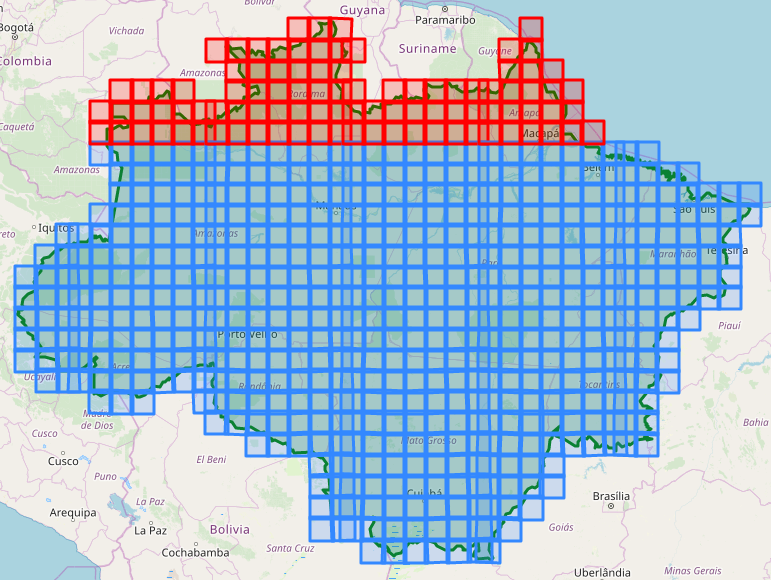
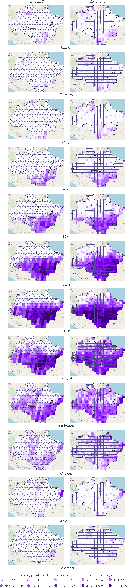

***

<h1> 
 Spatial-temporal differences in cloud cover of satellite observations across the Brazilian Amazon
 </h1>

 Willian Vieira de Oliveira 

 [ Part 4 - Results and Conclusion ] 

### SUMMARY

1. [**About**](./1_Project.md#About)
1. [**The Data**](./1_Project.md#TheData)
    1. [Raw data](./1_Project.md#RawData)
    1. [Processed data](./1_Project.md#ProcessedData)
    1. [Additional data](./1_Project.md#AdditionalData)
1. [**Questions about the data**](./1_Project.md#Questions)
1. [**Basic processing of the data**](./2_Basic_processing.md#BasicProc)
1. [**Statistics**](./2_Basic_processing.md#Stats)
1. [**Exploratory Data Analysis**](./3_EDA.md#EDA)
1. [**Results**](./4_Results_and_Conclusion.md#Results)
1. [**Conclusion**](./4_Results_and_Conclusion.md#Conclusion)
***

## 7. Results

We analysed both Landsat-8 and Sentinel-2 metadata archives, regarding scenes obtained across the Brazilian Amazon from February 2013 to July 2019. These platforms use different catalog systems. In this study, we chose to analyse separately the data obtained by each platform, instead of combining the data obtained by both platforms using a regular grid. The creation of a regular grid would require the conversion of the data to the new grid. We opted to preserve the catalog systems of both platforms in order to favour the comparison with similar studies present in literature.

In the Exploratory Data Analysis (EDA) stage, we performed diverse analysis that contribute to a better understanding of the spatio-temporal patterns of cloud cover across the Brazilian Amazon. This section provides answers to diverse questions on the differences in cloud cover of Landsat-8 and Sentinel-2 observations, acquired across this region from February 2013 to July 2019.

### Question 1. How many scenes intersect the Brazilian Amazon, considering the OLI and MSI sensors?

There are <b>234 Landsat-8 grids</b> that intersect the Brazilian states covered by the Amazon rainforest. On the other hand, there are <b>629 Sentinel-2 tiles</b> that interset the same region. The MSI sensor requires the obtainment of a larger number of scenes than the OLI sensor in order to cover the same area. However, the MSI sensor presents higher spatial and temporal resolutions. Therefore, the MSI sensor not only presents higher frequency of revisit than the OLI sensor, but also acquire data with a higher detail level. In the following figure, the red grids indicate the grids located in the Northern hemisphere.

<table align='left'>
<tr>
<td>Landsat-8 grids</td>
<td> Sentinel-2 tiles</td>
</tr>
</table>

### Question 2. How many scenes intersect each Brazilian state?

The Amazon rainforest covers 9 Brazilian states: Acre, Amapá, Amazonas, Maranhão, Mato Grosso, Pará, Rondônia, Roraima and Tocantins. In this analysis, we considered only grids that present an intersection area larger than 15% of the size of the grid.

- There are  <b>08  WRS grids</b> and  <b>18  Sentinel-2 tiles</b> that intersect the Brazilian state of  <b>ACRE</b>.
- There are  <b>06  WRS grids</b> and  <b>17  Sentinel-2 tiles</b> that intersect the Brazilian state of  <b>AMAPÁ</b>.
- There are  <b>62  WRS grids</b> and  <b>174 Sentinel-2 tiles</b> that intersect the Brazilian state of  <b>AMAZONAS</b>.
- There are  <b>15  WRS grids</b> and  <b>40  Sentinel-2 tiles</b> that intersect the Brazilian state of  <b>MARANHÃO</b>.
- There are  <b>38  WRS grids</b> and  <b>102 Sentinel-2 tiles</b> that intersect the Brazilian state of  <b>MATO GROSSO</b>.
- There are  <b>47  WRS grids</b> and  <b>137 Sentinel-2 tiles</b> that intersect the Brazilian state of  <b>PARÁ</b>.
- There are  <b>10  WRS grids</b> and  <b>26  Sentinel-2 tiles</b> that intersect the Brazilian state of  <b>RONDÔNIA</b>.
- There are  <b>11  WRS grids</b> and  <b>30  Sentinel-2 tiles</b> that intersect the Brazilian state of  <b>RORAIMA</b>.
- There are  <b>11  WRS grids</b> and  <b>35  Sentinel-2 tiles</b> that intersect the Brazilian state of  <b>TOCANTINS</b>.

<table align='left'>
<tr>
<td>Landsat-8 grids
    </td>
<td>Sentinel-2 tiles</td>
</tr>
</table>

### Question 3. What is the monthly average percentage of cloud cover observed for each region?

The following figure illustrates the monthly average cloud cover percentages generated using data obtained by both platforms. The OLI sensor presents a 16-day temporal resolution, while the MSI sensor presents a 5-day temporal resolution (considering both Sentinel S2A and S2B). The temporal resolution of the MSI sensor provides more consistency to the study of spatial-temporal differences in cloud cover of satellite observations. In addition, the metadata archives only provide the cloud cover percentage of the entire scene. Therefore, the higher the number to tiles/grids that cover the analysed area, the higher the amount of information regarding the cloud cover variations in each region. 

In this study, the use of both Landsat-8 and Sentinel-2 data resulted in maps with similar monthly average CC percentages for most areas. Observe that the Brazilian state of Roraima and the northern Amazonas presented average cloud cover percentages higher than 30% for all months. In this regions, the probability of obtaing an image with 30% or less cloud cover is close to zero. In addition, at higher cloud cover percentages, cloud shadows become increasingly problematic. This result emphasizes the limitations of optical remote sensing of these regions. Although optical sensors represent an important source of data, they depend on environmental conditions. For that reason, many projects use data acquired only during the dry season, as an alternative to minimize the impacts of environmental conditions. The period from June to August presented the lowest average cloud cover percentages for most parte of the Brazilian Amazon.

### Question 4. Which regions are more affected by cloud cover?

Cloud cover persists in the Brazilian state of Roraima and the northern Amazonas even during the ‘dry’ season. At the 16-day revisit period of Landsat-8, this effect can also be observed in the northern Pará. Howerver, the use a sensor with higher temporal resolution, such as the MSI sensor, increases the probability of acquiring data with lower cloud cover.

#### Monthly average cloud cover in Landsat-8 and Sentinel-2 observations

***

### Question 5. Which state did present the lowest annual cloud cover rate?

The following figure presents the average annual cloud cover obtained from 2013 to 2019 for each Brazilian state. This result considers data obtained by the Landsat-8, Sentinel-2A and Sentinel-2B platforms. On an annual basis, the state of Tocantins presented the lowest annual cloud cover percentage, followed by the state of Mato Grosso. On the other hand, the states of Acre, Amazonas, Pará and Roraima presented the highest annual cloud cover percentages. Observe that the year of 2019 presented higher cloud cover percentages than other years for most states. We can relate this pattern to the fact that we did not consider data from the entire dry season of 2019. We analysed data acquired from February 2013 to July 2019.

### Question 6. What is the mean cloud cover percentage observed in each season of the year?

The winter season provided the lowest average cloud cover percentage for all the analysed Brazilian states, except for the state of Roraima. On the other hand, the summer season provided the highest average cloud cover percentage for most states, except for the state of Roraima. The Brazilian state of Roraima was the only state that presented different results. The highest cloud cover percentage for the state of Roraima was observed during the Autumn season, while the lowest percentage was observed during the spring season. This statistics are described in the following figure.

In addition, the maps of the average seasonal cloud cover percentages for each grid/tile obtained by the Landsat and Sentinel-2 platforms. Despite the differences between the Landsat and Sentinel missions and sensors, the products generated using the data obtaied by these platforms resulted in similar seasonal maps.

***

***
### Question 7. What is the percentage of cloud-free scenes in each region?

The following figure shows maps that describe the probability of acquiring a scene with up to 10% cloud cover for both Landsat-8 and Sentinel-2. We considered this threshold to determine the scenes considered as cloud-free. Observe that the probability of acquiring a cloud-free Landsat-8 scene is close to zero from November to May for most part of diverse states, including Acre, Amapá, Amazonas, Pará and Rondônia. On the other hand, the higher temporal resolution of the sentinel-2 sensors assisted to the increase of the aquisition probability of cloud-free scenes for some tiles located in these states, during this 'wet' period of the year. In general, the best conditions for image acquisition in the entire Brazilian Amazon occur between June and September. At this period, the probability of acquiring high-quality images increases, specially for Sentinel-2 mission.

 
The maps presented bellow highlight the differences of aquisition probability of cloud-free observations at varied spatial and temporal resolutions. This analysis contributes to the evaluation of the usefulness of the Landsat-8 and Sentinel-2 platforms for studies that require high-quality satellite observations acquired with a 10% cloud cover threshold. It is also important to point out that we did not take into account in this study the image availability in areas with overlay of adjacent scenes. These regions present higher data availability, which might be usefull for some studies.

***

## 8. Conclusion

In this study, we analysed Landsat-8 and Sentinel-2 metadata archives obtained from February 2013 to July 2019 across the Brazilian Amazon, in order to evaluate the spatio-temporal differences in cloud cover accross this region. In general, the monthly average cloud cover percentages showed the limitations of using optical remote sensing to analyse most areas of the Brazilian Amazon during most part of the year. The best conditions for image acquisition in the entire Brazilian Amazon occur between June and September. At this period, the probability of acquiring high-quality images increases, specially for Sentinel-2/MSI sensor, which presents higher spatial and temporal resolutions than the Landsat-8/OLI sensor.

The analysis of the acquisition probability and the spatio-temporal differences of cloud cover helps to understand the temporal and spatial practicality of obtaining satisfactory Landsat-8 and Sentinel-2 observations. The temporal resolution of the sentinel-2/MSI sensor increases the probability of acquiring cloud-free scenes in the Brazilian Amazon region, in contrast to the Landsat-8/OLI sensor, specially during the 'wet' period of the year. 

The results obtained in this study highlight the importance of combining both radar and optical imaging techonologies to studies of the Brazilian rainforest that require frequent high-quality satellite observations. 

[
 **<< Previous notebook** 
](./3_EDA.md)

***
## References

[1] Rene Beuchle , Hugh D. Eva , Hans-Jürgen Stibig , Catherine Bodart , Andreas Brink , Philippe Mayaux , Desiree Johansson , Frederic Achard & Alan Belward (2011) A satellite data set for tropical forest area change assessment, **International Journal of Remote Sensing**, 32:22, 7009-7031, DOI: 10.1080/01431161.2011.611186

[2] Sano E E, Ferreira L G, Asner G P et al., 2007. Spatial and temporal probabilities of obtaining cloud-free Landsat
images over the Brazilian tropical savanna. **International Journal of Remote Sensing**, 28(12): 2739–2752.

[3] Lima, T.A., Beuchle, R., Langner, A., Grecchi, R.C., Griess, V.C., & Achard, F. (2019). Comparing Sentinel-2 MSI and Landsat 8 OLI Imagery for Monitoring Selective Logging in the Brazilian Amazon. **Remote Sensing**, 11, 961.

[4] Young O.R., Onoda M. (2017) **Satellite Earth Observations in Environmental Problem-Solving**. In: Onoda M., Young O. (eds) Satellite Earth Observations and Their Impact on Society and Policy. Springer, Singapore, DOI: 10.1080/01431161.2011.611186
